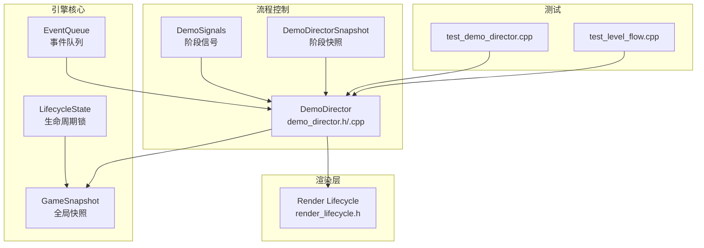
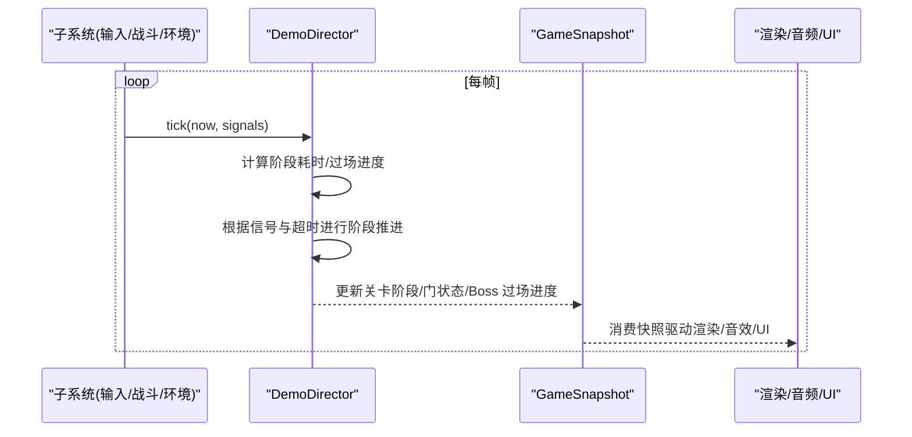
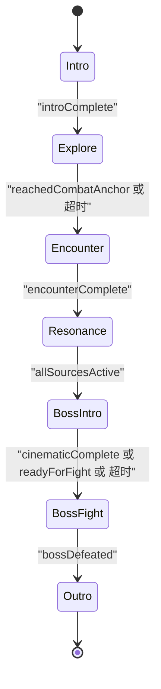
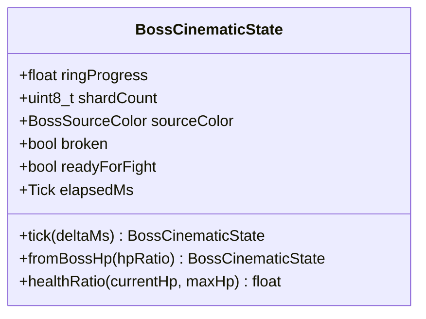
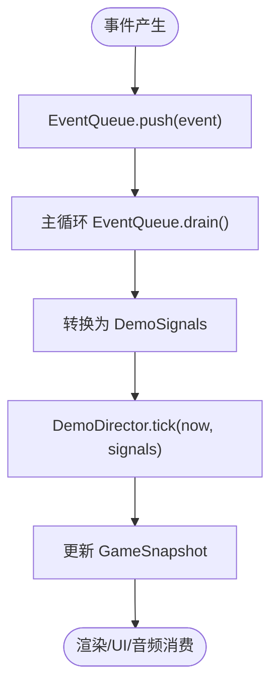
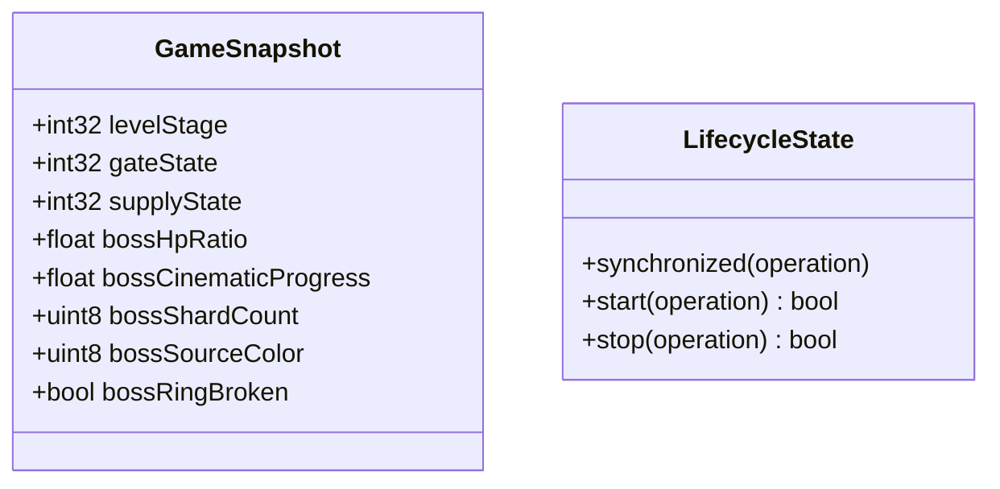
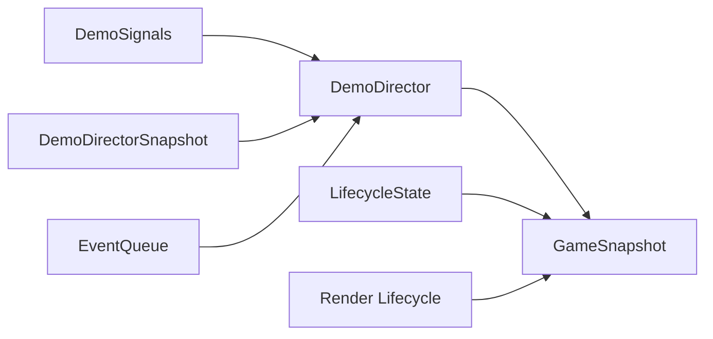

# 流程管理系统

<cite>
**本文引用的文件**   
- [demo_director.h](file://native/gameplay/flow/demo_director.h)
- [demo_director.cpp](file://native/gameplay/flow/demo_director.cpp)
- [test_demo_director.cpp](file://tests/test_demo_director.cpp)
- [test_level_flow.cpp](file://tests/test_level_flow.cpp)
- [game_snapshot.h](file://native/engine/core/game_snapshot.h)
- [lifecycle_state.h](file://native/engine/core/lifecycle_state.h)
- [event_queue.h](file://native/engine/core/event_queue.h)
- [render_lifecycle.h](file://native/engine/render/render_lifecycle.h)
</cite>

## 目录
1. [简介](#简介)
2. [项目结构](#项目结构)
3. [核心组件](#核心组件)
4. [架构总览](#架构总览)
5. [详细组件分析](#详细组件分析)
6. [依赖关系分析](#依赖关系分析)
7. [性能考量](#性能考量)
8. [故障排查指南](#故障排查指南)
9. [结论](#结论)
10. [附录](#附录)

## 简介
本技术文档围绕 my-world 的流程管理系统展开，重点解析 DemoDirector 演示导演系统如何驱动关卡流程控制、场景切换与剧情推进。文档涵盖：
- 游戏状态的层次化管理（主菜单、训练模式、探索模式、Boss 战）
- 事件驱动的流程控制（条件判断、分支逻辑、循环结构）
- 与渲染系统的集成（过场动画、UI 显示、音效播放的协调点）
- 关卡加载流程、剧情触发逻辑与流程状态保存示例
- 调试工具、错误恢复与性能监控等关键实现要点

## 项目结构
流程管理相关代码主要位于 gameplay/flow 与 engine/core 子系统中，测试用例位于 tests 目录。核心文件包括：
- 流程控制器与数据结构：demo_director.h/.cpp
- 全局快照与生命周期：game_snapshot.h、lifecycle_state.h
- 事件队列：event_queue.h
- 渲染生命周期接口：render_lifecycle.h
- 流程与关卡行为测试：test_demo_director.cpp、test_level_flow.cpp

图表来源
- [demo_director.h:1-71](file://native/gameplay/flow/demo_director.h#L1-L71)
- [demo_director.cpp:1-99](file://native/gameplay/flow/demo_director.cpp#L1-L99)
- [game_snapshot.h:1-77](file://native/engine/core/game_snapshot.h#L1-L77)
- [lifecycle_state.h:1-51](file://native/engine/core/lifecycle_state.h#L1-L51)
- [event_queue.h:1-31](file://native/engine/core/event_queue.h#L1-L31)
- [render_lifecycle.h:1-84](file://native/engine/render/render_lifecycle.h#L1-L84)

章节来源
- [demo_director.h:1-71](file://native/gameplay/flow/demo_director.h#L1-L71)
- [demo_director.cpp:1-99](file://native/gameplay/flow/demo_director.cpp#L1-L99)
- [game_snapshot.h:1-77](file://native/engine/core/game_snapshot.h#L1-L77)
- [lifecycle_state.h:1-51](file://native/engine/core/lifecycle_state.h#L1-L51)
- [event_queue.h:1-31](file://native/engine/core/event_queue.h#L1-L31)
- [render_lifecycle.h:1-84](file://native/engine/render/render_lifecycle.h#L1-L84)

## 核心组件
- DemoDirector：流程状态机，负责阶段推进、超时回退、跳过到指定阶段、Boss 过场动画进度计算与控制权恢复。
- DemoSignals：外部子系统向流程控制器投递的阶段完成信号（如 introComplete、reachedCombatAnchor、encounterComplete、allSourcesActive、cinematicComplete、bossDefeated）。
- DemoDirectorSnapshot：当前阶段的运行时快照，包含阶段、是否使用超时回退、输入与相机控制权恢复标志、阶段耗时与 Boss 过场状态。
- BossCinematicState：Boss 过场动画的状态机，维护环形进度、碎片数量、源颜色、破碎状态、就绪标志与累计时间。
- GameSnapshot：全局运行快照，供 UI、渲染、音频等子系统消费，包含关卡阶段、门状态、补给状态、Boss 血量比例、过场进度等。
- EventQueue<T>：线程安全的事件队列，用于解耦事件生产与消费。
- LifecycleState：提供同步化的生命周期操作（start/stop），保证关键操作的互斥访问。
- Render Lifecycle：定义资源销毁顺序与回调，确保渲染上下文与 GPU 资源在生命周期结束时正确释放。

章节来源
- [demo_director.h:1-71](file://native/gameplay/flow/demo_director.h#L1-L71)
- [demo_director.cpp:1-99](file://native/gameplay/flow/demo_director.cpp#L1-L99)
- [game_snapshot.h:1-77](file://native/engine/core/game_snapshot.h#L1-L77)
- [event_queue.h:1-31](file://native/engine/core/event_queue.h#L1-L31)
- [lifecycle_state.h:1-51](file://native/engine/core/lifecycle_state.h#L1-L51)
- [render_lifecycle.h:1-84](file://native/engine/render/render_lifecycle.h#L1-L84)

## 架构总览
DemoDirector 作为流程中枢，接收来自各子系统的信号并驱动阶段转换；同时更新全局快照以驱动 UI、渲染与音频。Boss 过场动画由独立状态机驱动，并在达到就绪或超时后交还玩家控制。

图表来源
- [demo_director.cpp:50-94](file://native/gameplay/flow/demo_director.cpp#L50-L94)
- [game_snapshot.h:51-76](file://native/engine/core/game_snapshot.h#L51-L76)

## 详细组件分析

### DemoDirector 流程状态机
- 阶段枚举：Intro、Explore、Encounter、Resonance、BossIntro、BossFight、Outro
- 推进规则：
  - Intro → Explore：当收到 introComplete
  - Explore → Encounter：到达战斗锚点或超时（kExploreTimeoutMs）
  - Encounter → Resonance：遭遇战完成
  - Resonance → BossIntro：所有源激活
  - BossIntro → BossFight：cinematicComplete 或 readyForFight 或超时（kBossIntroTimeoutMs）
  - BossFight → Outro：Boss 被击败
- 控制流恢复：进入 BossIntro 时禁用输入与相机控制，readyForFight 或超时后恢复
- 跳过能力：skipTo(phase) 可直接跳转到目标阶段，并重置阶段计时与恢复标志

图表来源
- [demo_director.cpp:60-93](file://native/gameplay/flow/demo_director.cpp#L60-L93)

章节来源
- [demo_director.h:7-15](file://native/gameplay/flow/demo_director.h#L7-L15)
- [demo_director.cpp:50-94](file://native/gameplay/flow/demo_director.cpp#L50-L94)

### Boss 过场动画状态机
- 状态字段：ringProgress、shardCount、sourceColor、broken、readyForFight、elapsedMs
- 推进逻辑：
  - elapsedMs 随帧累积，上限为 kBossCinematicDurationMs
  - ringProgress = elapsedMs / kBossCinematicDurationMs
  - readyForFight 在达到时长后置为 true
  - sourceColor 按固定间隔轮转（Radiance/Current/Corruption）
  - broken 可由 Boss 血量比率决定（fromBossHp）

图表来源
- [demo_director.h:23-34](file://native/gameplay/flow/demo_director.h#L23-L34)
- [demo_director.cpp:14-35](file://native/gameplay/flow/demo_director.cpp#L14-L35)

章节来源
- [demo_director.h:17-34](file://native/gameplay/flow/demo_director.h#L17-L34)
- [demo_director.cpp:14-35](file://native/gameplay/flow/demo_director.cpp#L14-L35)

### 事件驱动与队列
- EventQueue<T> 提供线程安全的 push/drain 接口，适合将外部事件（如输入、战斗结果）批量推入并由流程控制器统一处理
- 建议用法：子系统通过 EventQueue 推送事件，主循环定期 drain 并转换为 DemoSignals，再调用 DemoDirector::tick

图表来源
- [event_queue.h:12-24](file://native/engine/core/event_queue.h#L12-L24)
- [demo_director.cpp:50-94](file://native/gameplay/flow/demo_director.cpp#L50-L94)

章节来源
- [event_queue.h:1-31](file://native/engine/core/event_queue.h#L1-31)

### 全局快照与生命周期
- GameSnapshot 暴露关卡阶段、门状态、补给状态、Boss 血量比例、过场进度等字段，供 UI、渲染、音频等子系统读取
- LifecycleState 提供 synchronized/start/stop 封装，确保关键操作互斥执行，避免并发修改导致的竞态

图表来源
- [game_snapshot.h:51-76](file://native/engine/core/game_snapshot.h#L51-L76)
- [lifecycle_state.h:8-32](file://native/engine/core/lifecycle_state.h#L8-L32)

章节来源
- [game_snapshot.h:1-77](file://native/engine/core/game_snapshot.h#L1-L77)
- [lifecycle_state.h:1-51](file://native/engine/core/lifecycle_state.h#L1-L51)

### 渲染生命周期集成
- render_lifecycle.h 定义了 Surface 销毁顺序与回调，确保在流程切换或退出时正确释放 GPU 资源
- 建议在流程进入 BossIntro 或切换场景前，依据生命周期接口清理或标记资源，避免上下文失效导致崩溃

章节来源
- [render_lifecycle.h:1-84](file://native/engine/render/render_lifecycle.h#L1-L84)

## 依赖关系分析
- DemoDirector 依赖 DemoSignals 与 DemoDirectorSnapshot，内部维护阶段计时与 Boss 过场状态
- GameSnapshot 作为跨子系统共享数据，被渲染、UI、音频等消费
- EventQueue 解耦事件生产与消费，提升流程控制的稳定性
- LifecycleState 保障关键路径的线程安全
- Render Lifecycle 确保资源释放顺序正确，避免上下文问题

图表来源
- [demo_director.h:36-52](file://native/gameplay/flow/demo_director.h#L36-L52)
- [game_snapshot.h:1-77](file://native/engine/core/game_snapshot.h#L1-L77)
- [event_queue.h:1-31](file://native/engine/core/event_queue.h#L1-31)
- [lifecycle_state.h:1-51](file://native/engine/core/lifecycle_state.h#L1-51)
- [render_lifecycle.h:1-84](file://native/engine/render/render_lifecycle.h#L1-L84)

章节来源
- [demo_director.h:36-52](file://native/gameplay/flow/demo_director.h#L36-L52)
- [game_snapshot.h:1-77](file://native/engine/core/game_snapshot.h#L1-L77)
- [event_queue.h:1-31](file://native/engine/core/event_queue.h#L1-31)
- [lifecycle_state.h:1-51](file://native/engine/core/lifecycle_state.h#L1-51)
- [render_lifecycle.h:1-84](file://native/engine/render/render_lifecycle.h#L1-L84)

## 性能考量
- 阶段推进采用 O(1) 状态机检查，无额外分配
- Boss 过场动画仅浮点运算与取模，开销极低
- EventQueue 容量限制避免内存暴涨，drain 使用 swap 降低拷贝成本
- 建议在高频路径中减少 GameSnapshot 写入频率，批量更新以减少锁竞争
- 渲染资源销毁遵循固定顺序，避免重复释放与上下文冲突

[本节为通用指导，不直接分析具体文件]

## 故障排查指南
- 阶段卡死：检查 DemoSignals 是否正确设置对应标志位；确认 Explore 与 BossIntro 的超时阈值是否合理
- 控制未恢复：验证 BossIntro 的 readyForFight 或超时逻辑是否触发；检查 skipTo 是否误用
- 资源崩溃：确认 Render Lifecycle 的销毁顺序与回调是否按规范调用；避免在无效上下文执行 GL 删除
- 事件丢失：检查 EventQueue 容量与 drain 频率；确保 push/drain 在同一线程或加锁保护

章节来源
- [demo_director.cpp:60-94](file://native/gameplay/flow/demo_director.cpp#L60-L94)
- [render_lifecycle.h:66-83](file://native/engine/render/render_lifecycle.h#L66-L83)
- [event_queue.h:12-24](file://native/engine/core/event_queue.h#L12-L24)

## 结论
DemoDirector 通过简洁的状态机与事件驱动机制，实现了稳定的流程控制与场景切换。结合 GameSnapshot 与 Render Lifecycle，流程系统与渲染、UI、音频等子系统良好解耦。Boss 过场动画独立状态机确保了叙事节奏与玩家体验的统一。通过 EventQueue 与 LifecycleState，系统在多线程与资源管理方面具备鲁棒性。建议在实际使用中严格遵循信号约定与生命周期接口，以获得最佳稳定性与性能。

[本节为总结性内容，不直接分析具体文件]

## 附录

### 关卡加载流程示例（基于测试）
- 启动 LevelFlow 模式，初始阶段为 Training，门关闭
- 击败当前波次后门打开，可 advanceLevel 进入下一阶段（如 RiftClawFight）
- Supply 阶段仅可消耗一次，之后继续推进至 Boss 阶段
- Boss 失败后可 retry，保持 Gate 关闭并重置状态

章节来源
- [test_level_flow.cpp:25-84](file://tests/test_level_flow.cpp#L25-L84)

### 剧情触发逻辑示例（基于测试）
- 依次触发 introComplete → reachedCombatAnchor → encounterComplete → allSourcesActive → cinematicComplete → bossDefeated
- 每个信号驱动 DemoDirector 推进到下一阶段
- Explore 与 BossIntro 支持超时回退，确保流程不会卡死

章节来源
- [test_demo_director.cpp:7-28](file://tests/test_demo_director.cpp#L7-L28)
- [test_demo_director.cpp:30-36](file://tests/test_demo_director.cpp#L30-L36)
- [test_demo_director.cpp:46-54](file://tests/test_demo_director.cpp#L46-L54)

### 流程状态保存与恢复
- DemoDirectorSnapshot 记录 phase、usedTimeoutFallback、inputRestored、cameraRestored、phaseElapsedMs、bossCinematic
- 可在阶段切换或退出时序列化该快照，重启后恢复阶段与过场进度
- 结合 GameSnapshot 的全局字段，可实现更完整的存档（如关卡阶段、门状态、Boss 血量比例）

章节来源
- [demo_director.h:45-52](file://native/gameplay/flow/demo_director.h#L45-L52)
- [game_snapshot.h:51-76](file://native/engine/core/game_snapshot.h#L51-L76)