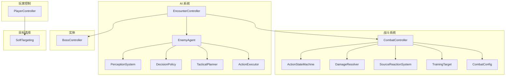
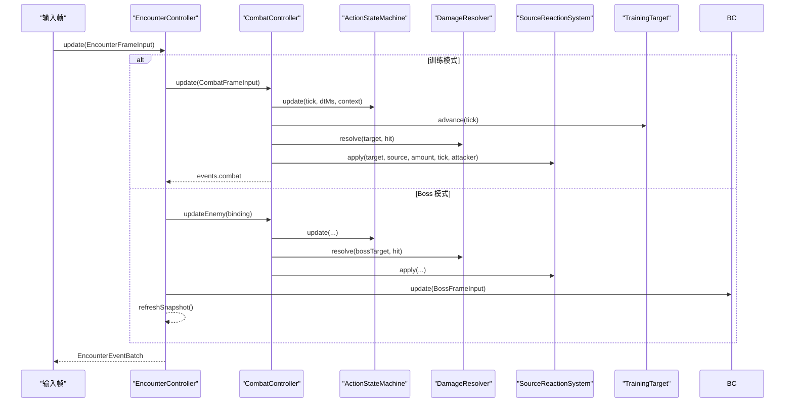
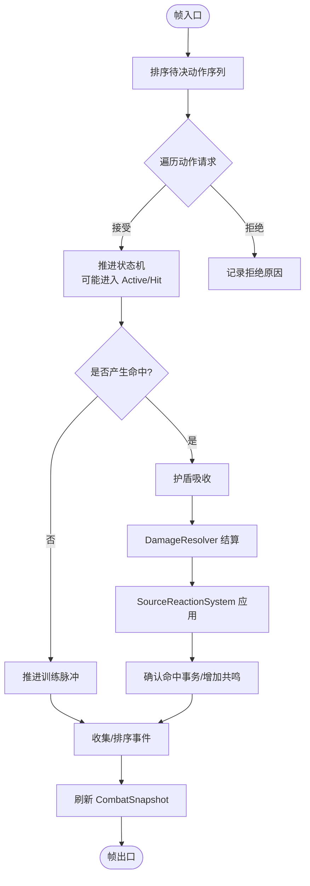
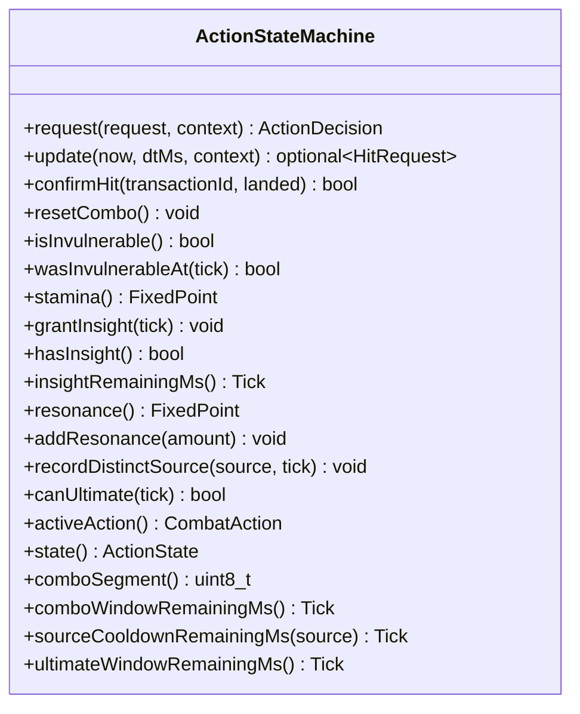
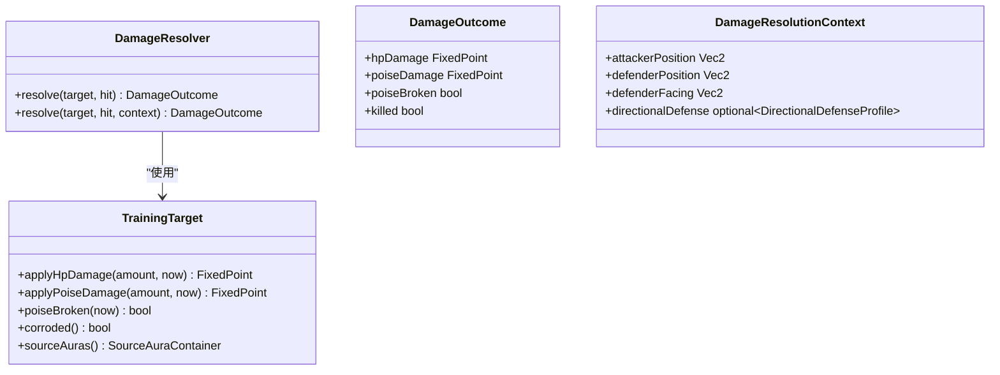
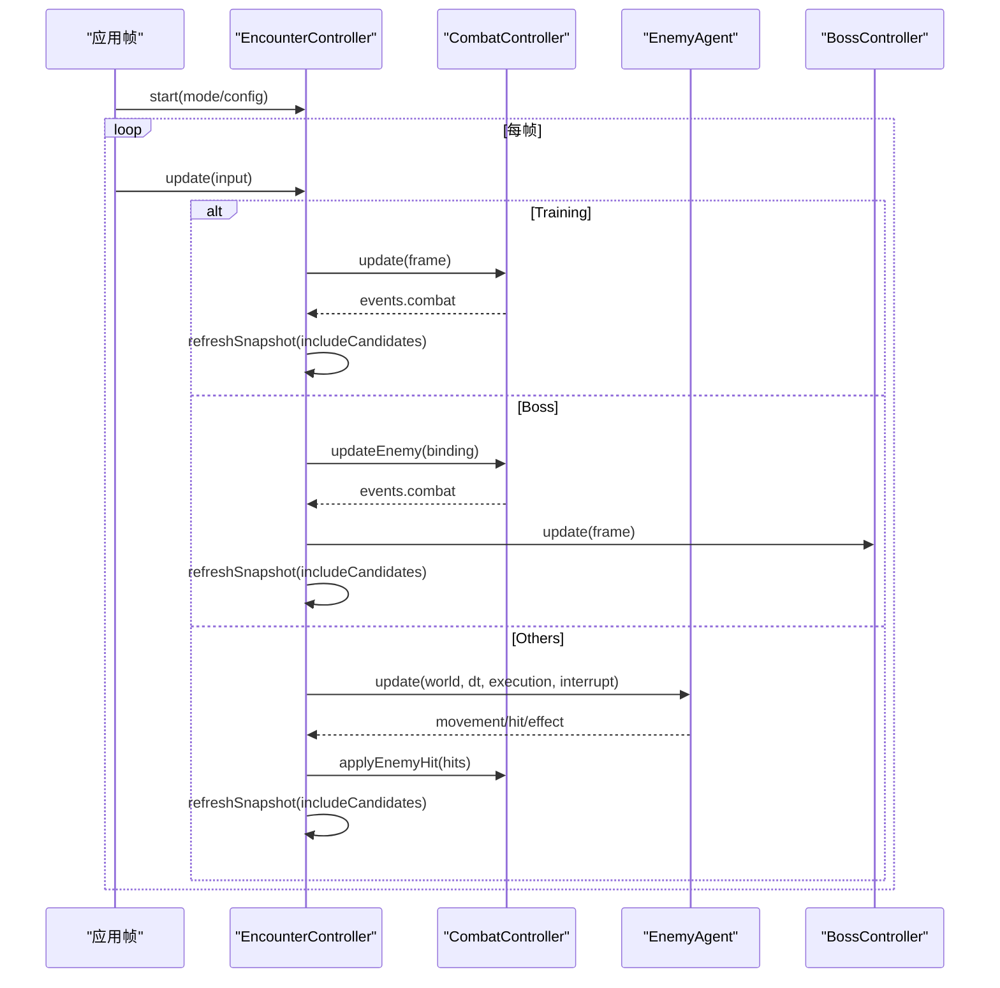
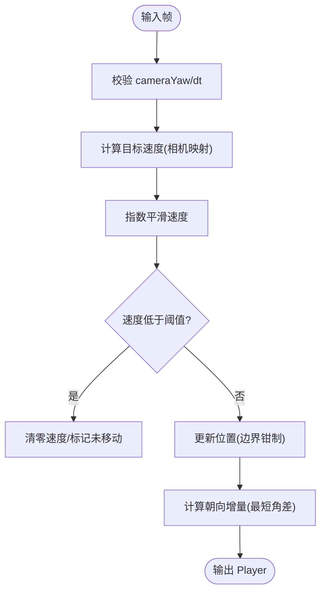
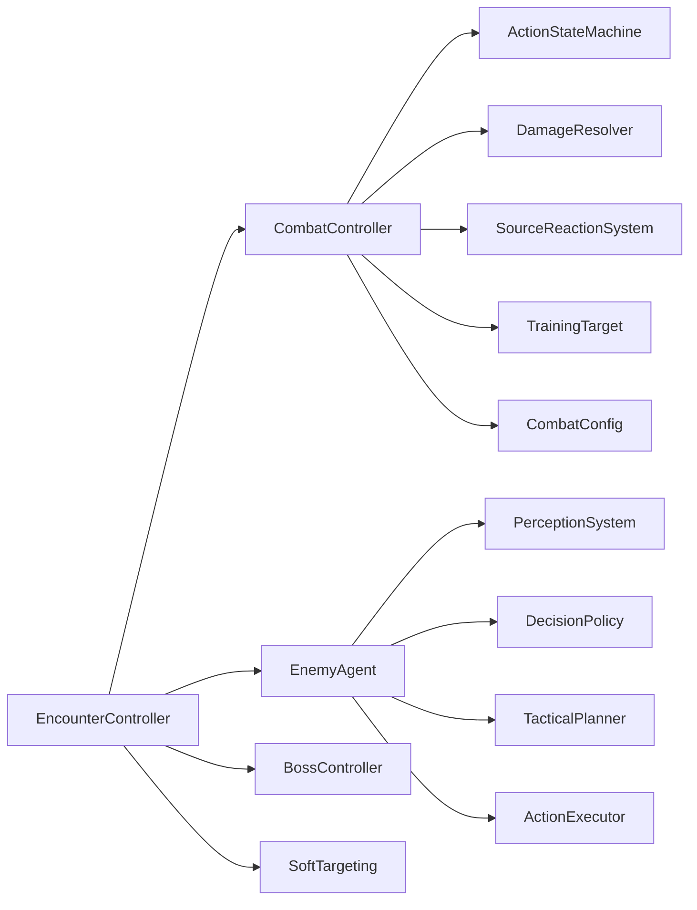

# 游戏逻辑层设计

<cite>
**本文引用的文件**   
- [combat_controller.h](file://native/gameplay/combat/combat_controller.h)
- [combat_controller.cpp](file://native/gameplay/combat/combat_controller.cpp)
- [action_state_machine.h](file://native/gameplay/combat/action_state_machine.h)
- [damage_resolver.h](file://native/gameplay/combat/damage_resolver.h)
- [resonance.h](file://native/gameplay/combat/resonance.h)
- [training_target.h](file://native/gameplay/combat/training_target.h)
- [combat_config.h](file://native/gameplay/combat/combat_config.h)
- [encounter_controller.h](file://native/gameplay/ai/encounter_controller.h)
- [encounter_controller.cpp](file://native/gameplay/ai/encounter_controller.cpp)
- [enemy_agent.h](file://native/gameplay/ai/enemy_agent.h)
- [boss.h](file://native/gameplay/entities/boss.h)
- [player_controller.h](file://native/gameplay/player/player_controller.h)
- [player_controller.cpp](file://native/gameplay/player/player_controller.cpp)
- [soft_targeting.h](file://native/gameplay/targeting/soft_targeting.h)
</cite>

## 目录
1. [简介](#简介)
2. [项目结构](#项目结构)
3. [核心组件](#核心组件)
4. [架构总览](#架构总览)
5. [详细组件分析](#详细组件分析)
6. [依赖关系分析](#依赖关系分析)
7. [性能考量](#性能考量)
8. [故障排查指南](#故障排查指南)
9. [结论](#结论)
10. [附录](#附录)

## 简介
本文件面向 my-world 的 native/gameplay 游戏逻辑层，系统性梳理战斗系统、AI 行为、玩家控制与实体管理的设计与实现。重点解析 CombatController 的战斗编排（动作状态机、伤害计算、共鸣系统）、EncounterController 的遭遇战管理（敌人生成、流程推进、Boss 机制）、PlayerController 的玩家输入与角色移动，以及 Boss 实体的阶段化 AI 模式。文档同时覆盖事件系统、数据快照与同步策略，帮助读者快速理解并扩展核心玩法。

## 项目结构
native/gameplay 采用分层模块化组织：
- combat：战斗核心（动作状态机、伤害解析、共鸣反应、训练脉冲与目标）
- ai：敌人 AI（感知、决策、战术规划、执行器、遭遇控制器）
- player：玩家控制（移动、朝向、速度平滑）
- entities：实体（Boss 控制器等）
- targeting：软目标选择（基于相机视角与距离的角度筛选）

图表来源 
- [combat_controller.h:1-113](file://native/gameplay/combat/combat_controller.h#L1-L113)
- [action_state_machine.h:1-91](file://native/gameplay/combat/action_state_machine.h#L1-L91)
- [damage_resolver.h:1-38](file://native/gameplay/combat/damage_resolver.h#L1-L38)
- [training_target.h:1-44](file://native/gameplay/combat/training_target.h#L1-L44)
- [combat_config.h:1-153](file://native/gameplay/combat/combat_config.h#L1-L153)
- [encounter_controller.h:1-151](file://native/gameplay/ai/encounter_controller.h#L1-L151)
- [encounter_controller.cpp:1-629](file://native/gameplay/ai/encounter_controller.cpp#L1-L629)
- [enemy_agent.h:1-107](file://native/gameplay/ai/enemy_agent.h#L1-L107)
- [boss.h:1-94](file://native/gameplay/entities/boss.h#L1-L94)
- [player_controller.h:1-36](file://native/gameplay/player/player_controller.h#L1-L36)
- [soft_targeting.h:1-42](file://native/gameplay/targeting/soft_targeting.h#L1-L42)

章节来源
- [combat_controller.h:1-113](file://native/gameplay/combat/combat_controller.h#L1-L113)
- [encounter_controller.h:1-151](file://native/gameplay/ai/encounter_controller.h#L1-L151)
- [player_controller.h:1-36](file://native/gameplay/player/player_controller.h#L1-L36)

## 核心组件
- CombatController：统一编排帧内战斗逻辑，包括动作请求队列、状态机推进、训练脉冲、伤害结算、共鸣反应与事件输出。提供 snapshot 用于 UI/渲染同步。
- ActionStateMachine：维护玩家动作状态、连击窗口、耐力、洞察、源技能冷却与终极技能窗口；处理动作接受/拒绝、命中时间线与事务确认。
- DamageResolver：根据攻击者/防御者位置与朝向计算方向性减伤，结合护盾与弱点/停滞等状态得出最终 HP/Poise 伤害与破势结果。
- SourceReactionSystem：将源类型（光耀/电流/腐化）作用于目标，触发共鸣反应并产出额外伤害与资源增益。
- TrainingTarget：训练目标的 HP/Poise、弱点击退、腐蚀、护盾与状态衰减。
- EncounterController：管理不同遭遇模式（训练、野兽、混合、守卫、关卡流、Boss），生成敌人、驱动 AI、处理效果与命中、推进关卡与补给。
- EnemyAgent：基于感知、决策与战术规划，输出移动意图、行动计划、命中与特效请求，支持打断与脱逃状态。
- PlayerController：指数平滑的速度与朝向更新，保证启动/转向/停止连续无突跳。
- BossController：三阶段 Boss 机制（光耀封锁、电流风暴、腐化坍塌），节点破坏、施法倒计时与脆弱期切换。

章节来源
- [combat_controller.cpp:1-306](file://native/gameplay/combat/combat_controller.cpp#L1-L306)
- [action_state_machine.h:1-91](file://native/gameplay/combat/action_state_machine.h#L1-L91)
- [damage_resolver.h:1-38](file://native/gameplay/combat/damage_resolver.h#L1-L38)
- [training_target.h:1-44](file://native/gameplay/combat/training_target.h#L1-L44)
- [encounter_controller.cpp:1-629](file://native/gameplay/ai/encounter_controller.cpp#L1-L629)
- [enemy_agent.h:1-107](file://native/gameplay/ai/enemy_agent.h#L1-L107)
- [boss.h:1-94](file://native/gameplay/entities/boss.h#L1-L94)
- [player_controller.cpp:1-69](file://native/gameplay/player/player_controller.cpp#L1-L69)

## 架构总览
整体采用“控制器 + 子系统”的分层架构：
- 顶层控制器负责帧级调度与事件排序（CombatController、EncounterController）。
- 子系统专注职责单一（ActionStateMachine、DamageResolver、SourceReactionSystem、EnemyAgent、BossController）。
- 数据通过快照（Snapshot）与事件批（EventBatch）在帧间同步给上层 UI/渲染。

图表来源 
- [encounter_controller.cpp:296-492](file://native/gameplay/ai/encounter_controller.cpp#L296-L492)
- [combat_controller.cpp:30-151](file://native/gameplay/combat/combat_controller.cpp#L30-L151)
- [action_state_machine.h:24-91](file://native/gameplay/combat/action_state_machine.h#L24-L91)
- [damage_resolver.h:28-38](file://native/gameplay/combat/damage_resolver.h#L28-L38)
- [training_target.h:6-44](file://native/gameplay/combat/training_target.h#L6-L44)

## 详细组件分析

### CombatController 战斗逻辑编排
- 动作状态机集成：每帧先推进资源时间线，再按序列号稳定排序 pendingActions_，逐个 request 决策，记录拒绝原因与最后接受序列。
- 精准闪避与洞察：训练模式下 Dodge 若命中精确窗口则 grantInsight，并在后续脉冲事件中判定是否被精准闪避。
- 伤害与共鸣：对命中进行护盾吸收、DamageResolver 结算、SourceReactionSystem 应用，产生共鸣事件与表现事件。
- 事件排序与快照：按 tick/source/target/sequence 稳定排序，刷新 CombatSnapshot 供上层消费。

图表来源 
- [combat_controller.cpp:30-151](file://native/gameplay/combat/combat_controller.cpp#L30-L151)
- [combat_controller.cpp:197-217](file://native/gameplay/combat/combat_controller.cpp#L197-L217)
- [combat_controller.cpp:219-261](file://native/gameplay/combat/combat_controller.cpp#L219-L261)

章节来源
- [combat_controller.cpp:1-306](file://native/gameplay/combat/combat_controller.cpp#L1-L306)
- [combat_controller.h:1-113](file://native/gameplay/combat/combat_controller.h#L1-L113)

### ActionStateMachine 动作状态机
- 关键能力：连击段数与窗口、耐力消耗与恢复、洞察加成、源技能冷却与终极窗口、无敌帧区间。
- 事务机制：为命中分配 transactionId，延迟到命中时刻由外部 confirmHit 确认落地与否，避免时序问题。
- 上下文判断：依据 ActionContext（攻击者/目标存活/移动/受击）决定动作是否可执行。

图表来源 
- [action_state_machine.h:24-91](file://native/gameplay/combat/action_state_machine.h#L24-L91)

章节来源
- [action_state_machine.h:1-91](file://native/gameplay/combat/action_state_machine.h#L1-L91)

### DamageResolver 伤害计算
- 输入：TrainingTarget、HitRequest、DamageResolutionContext（攻击者/防御者位置与朝向、可选方向性防御配置）。
- 输出：DamageOutcome（HP 伤害、Poise 伤害、是否破势、是否击杀）。
- 特性：支持方向性减伤（正面/背面）、护盾吸收前置、弱点/停滞/腐蚀等状态影响。

图表来源 
- [damage_resolver.h:28-38](file://native/gameplay/combat/damage_resolver.h#L28-L38)
- [training_target.h:6-44](file://native/gameplay/combat/training_target.h#L6-L44)

章节来源
- [damage_resolver.h:1-38](file://native/gameplay/combat/damage_resolver.h#L1-L38)

### SourceReactionSystem 共鸣系统
- 作用：将源类型（光耀/电流/腐化）施加于目标，触发共鸣反应，产出额外伤害与共鸣资源增益。
- 事件：在命中后推送 AuraApplied 与 Resonance 事件，并附带表现事件（如共鸣爆发）。

章节来源
- [combat_controller.cpp:121-147](file://native/gameplay/combat/combat_controller.cpp#L121-L147)
- [resonance.h:1-5](file://native/gameplay/combat/resonance.h#L1-L5)

### TrainingTarget 训练目标
- 功能：维护 HP/Poise、弱点击退、停滞、腐蚀、死亡重置时间；暴露状态查询与伤害应用接口。
- 用途：训练模式与 Boss 模式下的目标抽象，统一伤害与状态处理。

章节来源
- [training_target.h:1-44](file://native/gameplay/combat/training_target.h#L1-L44)

### EncounterController 遭遇战管理
- 模式：Training、Beast、Mixed、Guard、LevelFlow、Boss。
- 流程：start(config/mode) -> update(input) -> 推进敌人 AI -> 汇总命中与特效 -> 判定胜负/推进关卡 -> refreshSnapshot。
- 关卡推进：advanceLevel 按阶段切换模式（训练→裂隙爪→混合→守卫精英→补给→Boss）。
- Boss 模式：绑定 bossTarget_，观察玩家终极技能释放以触发 Boss 机制更新。

图表来源 
- [encounter_controller.cpp:222-273](file://native/gameplay/ai/encounter_controller.cpp#L222-L273)
- [encounter_controller.cpp:296-492](file://native/gameplay/ai/encounter_controller.cpp#L296-L492)
- [encounter_controller.cpp:550-596](file://native/gameplay/ai/encounter_controller.cpp#L550-L596)

章节来源
- [encounter_controller.h:1-151](file://native/gameplay/ai/encounter_controller.h#L1-L151)
- [encounter_controller.cpp:1-629](file://native/gameplay/ai/encounter_controller.cpp#L1-L629)

### EnemyAgent AI 行为
- 组成：PerceptionSystem（感知）、DecisionPolicy（决策）、TacticalPlanner（战术规划）、ActionExecutor（执行）。
- 输出：移动向量、分离力、行动阶段、命中/特效请求、脱逃状态。
- 特性：支持打断、进度跟踪、安全点返回、冷却管理与僵直释放。

章节来源
- [enemy_agent.h:1-107](file://native/gameplay/ai/enemy_agent.h#L1-L107)

### PlayerController 玩家控制
- 输入：摇杆 move、相机 yaw、dt。
- 处理：将输入映射到世界方向，指数平滑速度与朝向，边界限制与停止阈值。
- 输出：Player.x/y/angle/velocity/moving。

图表来源 
- [player_controller.cpp:23-69](file://native/gameplay/player/player_controller.cpp#L23-L69)

章节来源
- [player_controller.h:1-36](file://native/gameplay/player/player_controller.h#L1-L36)
- [player_controller.cpp:1-69](file://native/gameplay/player/player_controller.cpp#L1-L69)

### Boss 实体与机制
- 阶段：RadianceLockdown、CurrentStorm、CorruptionCollapse。
- 机制：JudgmentBeam、CurrentNodes、FinalForge；节点破坏、施法倒计时、脆弱期切换。
- 交互：EncounterController 在 Boss 模式下绑定 TrainingTarget，观察玩家终极技能释放触发 Boss 更新。

章节来源
- [boss.h:1-94](file://native/gameplay/entities/boss.h#L1-L94)
- [encounter_controller.cpp:317-356](file://native/gameplay/ai/encounter_controller.cpp#L317-L356)

### 软目标选择 SoftTargeting
- 输入：玩家位置、相机 yaw、候选目标列表、偏好 ID。
- 输出：满足最大距离与角度阈值的最佳目标选择。

章节来源
- [soft_targeting.h:1-42](file://native/gameplay/targeting/soft_targeting.h#L1-L42)

## 依赖关系分析
- CombatController 依赖 ActionStateMachine、DamageResolver、SourceReactionSystem、TrainingTarget、CombatConfig。
- EncounterController 依赖 CombatController、EnemyAgent、BossController、SoftTargeting。
- EnemyAgent 依赖 PerceptionSystem、DecisionPolicy、TacticalPlanner、ActionExecutor。
- PlayerController 独立，仅依赖数学库与 Vec2。

图表来源 
- [combat_controller.h:1-113](file://native/gameplay/combat/combat_controller.h#L1-L113)
- [encounter_controller.h:1-151](file://native/gameplay/ai/encounter_controller.h#L1-L151)
- [enemy_agent.h:1-107](file://native/gameplay/ai/enemy_agent.h#L1-L107)

章节来源
- [combat_controller.h:1-113](file://native/gameplay/combat/combat_controller.h#L1-L113)
- [encounter_controller.h:1-151](file://native/gameplay/ai/encounter_controller.h#L1-L151)
- [enemy_agent.h:1-107](file://native/gameplay/ai/enemy_agent.h#L1-L107)

## 性能考量
- 事件排序稳定性：CombatController 与 EncounterController 均使用稳定排序，确保同帧多源事件的确定性顺序，避免抖动。
- 固定步长与时间线：ActionStateMachine 的时间线推进与零时长不推进命中点，减少浮点误差累积。
- 指数平滑：PlayerController 使用指数插值，降低 CPU 抖动与动画突变。
- 最小化对象创建：EncounterController 复用 EnemySlot 与 TrainingTarget，减少内存分配。
- 配置校验：CombatConfig.validated 与 EnemyAiConfig.validated 在初始化时做参数合法性检查，避免运行时异常分支。

[本节为通用指导，无需特定文件引用]

## 故障排查指南
- 动作被拒绝：检查 ActionContext 与 lastRejectReason，确认目标存活、移动状态与资源（耐力/冷却）是否满足。
- 精准闪避无效：确认 preciseDodgedPulseTick_ 是否与脉冲事件 tick 一致，且未被其他逻辑覆盖。
- 共鸣未触发：检查 SourceReactionSystem 的 apply 调用路径与 sourceAmount/tick/attacker 是否正确传入。
- Boss 机制不推进：确认玩家终极技能释放标志 ultimateUsed 与 lastObservedBossAbility_ 变化逻辑。
- 敌人 AI 卡住：查看 progressTracking 与 noProgressDecisions_，必要时强制重新决策或返回安全点。

章节来源
- [combat_controller.cpp:15-74](file://native/gameplay/combat/combat_controller.cpp#L15-L74)
- [combat_controller.cpp:153-195](file://native/gameplay/combat/combat_controller.cpp#L153-L195)
- [encounter_controller.cpp:434-446](file://native/gameplay/ai/encounter_controller.cpp#L434-L446)

## 结论
my-world 的游戏逻辑层以 CombatController 与 EncounterController 为核心，围绕动作状态机、伤害解析、共鸣反应与 AI 决策形成清晰的分层架构。通过快照与事件批实现稳定的帧间同步，配合指数平滑与固定时间线提升体验与性能。Boss 的阶段化机制与软目标选择进一步丰富了战斗深度与交互流畅度。建议在扩展新敌人或新机制时遵循现有模块职责边界，优先通过配置与事件系统进行扩展。

[本节为总结性内容，无需特定文件引用]

## 附录
- 关键数据结构参考：
  - CombatSnapshot：战斗帧快照（连击段、HP/Poise、耐力、共鸣、状态标志、冷却、反应类型等）
  - EncounterSnapshot：遭遇战快照（模式、状态、玩家 HP、关卡阶段、门/补给状态、Boss/敌人信息、候选目标）
  - BossSnapshot：Boss 快照（阶段、机制、HP/Poise、脆弱期、节点破坏计数、施法剩余时间等）
- 事件类型参考：
  - GameplayEventType：Dodge/Damage/Hp/PoiseBreak/Death/AuraApplied/Resonance 等
  - PresentationEventType：DodgeFlash/HitFlash/PoiseBreakBurst/ResonanceBurst 等

[本节为概念性说明，无需特定文件引用]