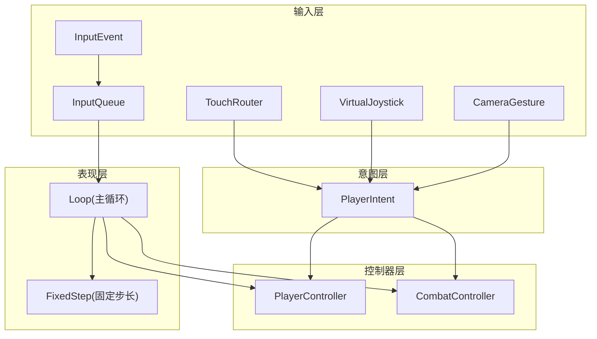
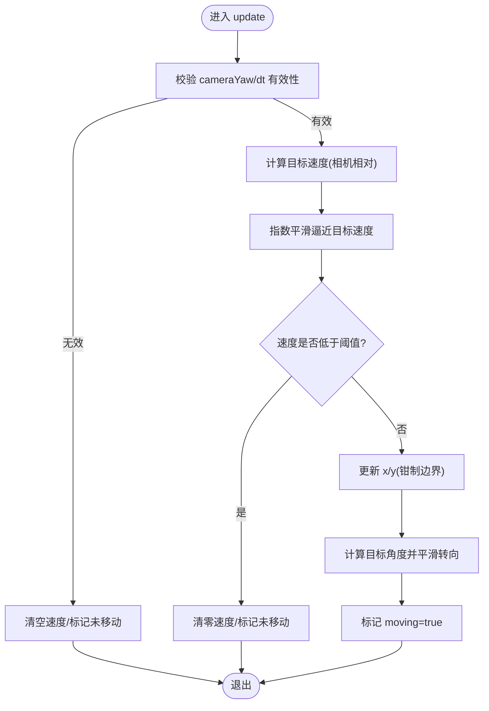
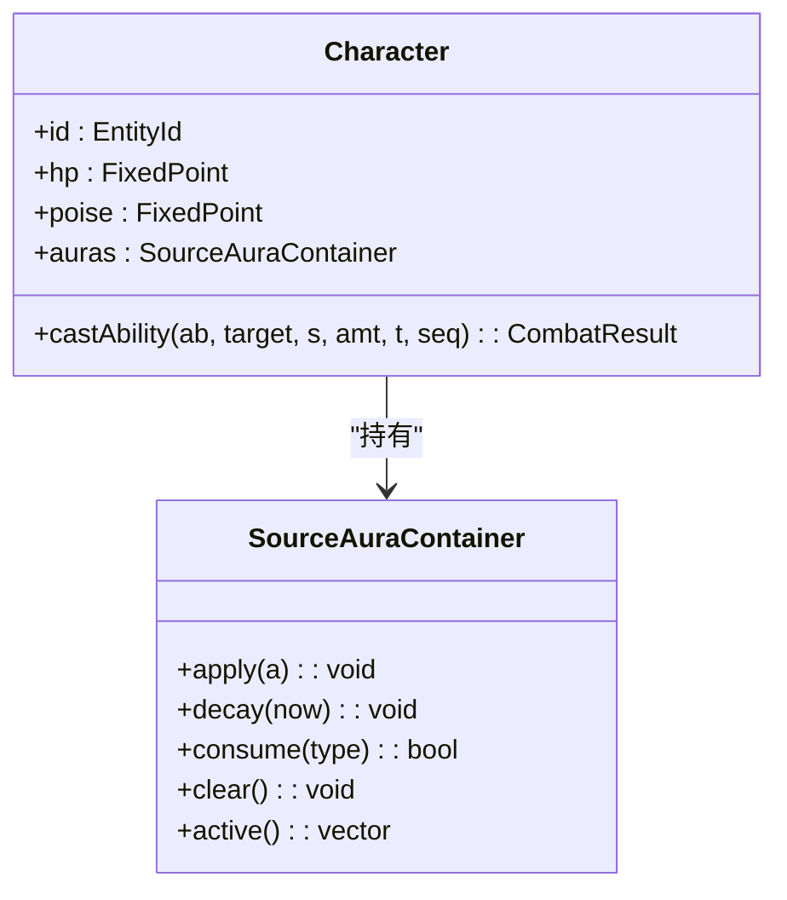
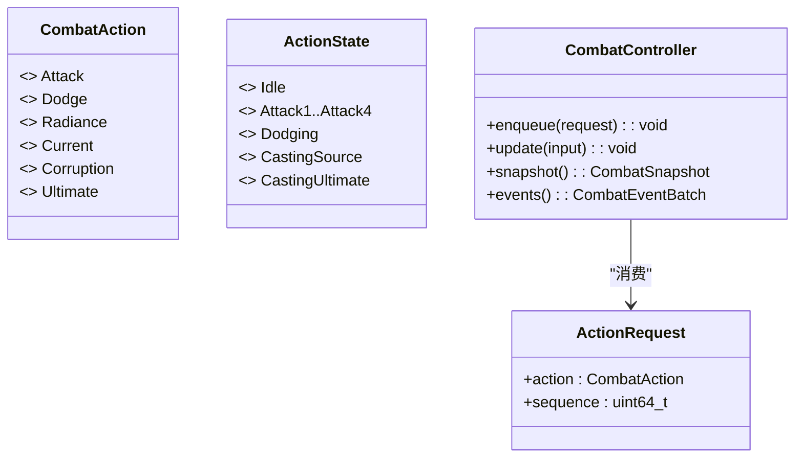
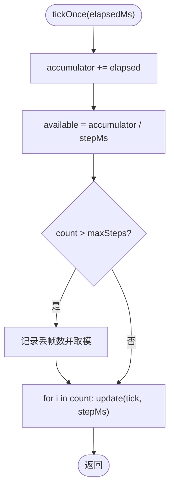
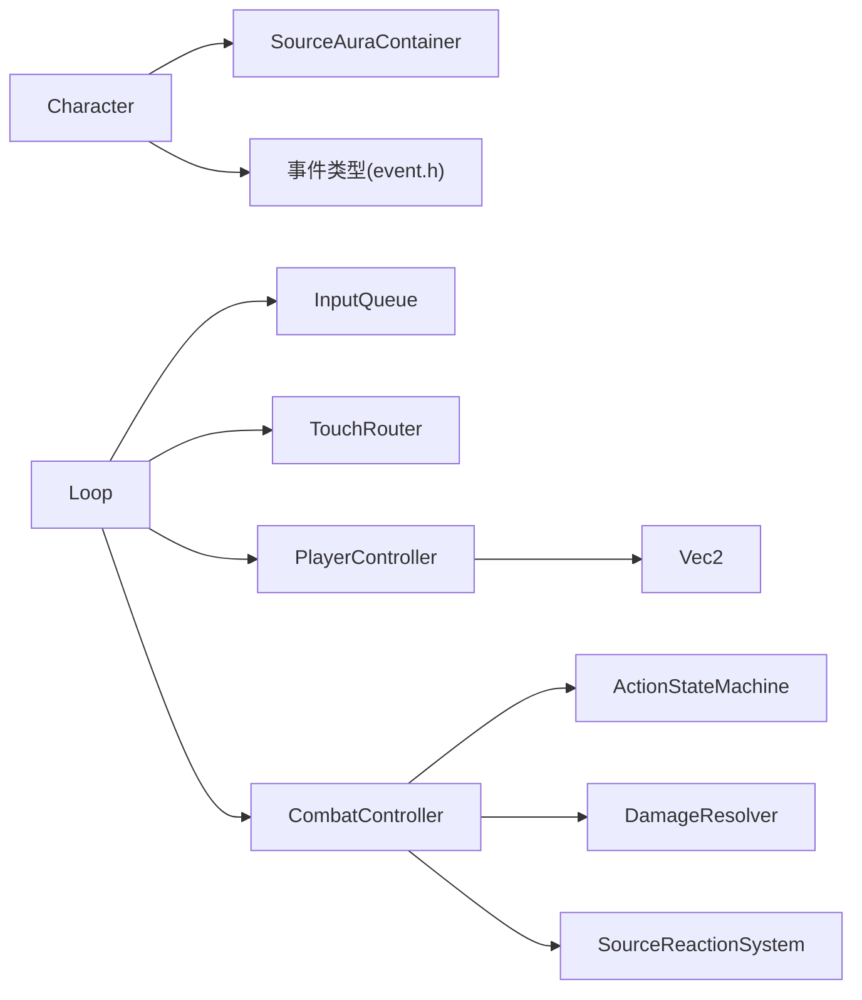

# 玩家控制系统

<cite>
**本文引用的文件**   
- [player_controller.h](file://native/gameplay/player/player_controller.h)
- [player_controller.cpp](file://native/gameplay/player/player_controller.cpp)
- [character.h](file://native/gameplay/player/character.h)
- [character.cpp](file://native/gameplay/player/character.cpp)
- [input_queue.h](file://native/engine/input/input_queue.h)
- [input_event.h](file://native/engine/input/input_event.h)
- [touch_router.h](file://native/engine/input/touch_router.h)
- [player_intent.h](file://native/engine/input/player_intent.h)
- [loop.h](file://native/engine/core/loop.h)
- [fixed_step.h](file://native/engine/core/fixed_step.h)
- [combat_action.h](file://native/gameplay/combat/combat_action.h)
- [event.h](file://native/gameplay/combat/event.h)
- [source_aura.h](file://native/gameplay/combat/source_aura.h)
- [combat_controller.h](file://native/gameplay/combat/combat_controller.h)
- [test_player_controller.cpp](file://tests/test_player_controller.cpp)
- [test_input_queue.cpp](file://tests/test_input_queue.cpp)
</cite>

## 目录
1. [简介](#简介)
2. [项目结构](#项目结构)
3. [核心组件](#核心组件)
4. [架构总览](#架构总览)
5. [详细组件分析](#详细组件分析)
6. [依赖关系分析](#依赖关系分析)
7. [性能考量](#性能考量)
8. [故障排查指南](#故障排查指南)
9. [结论](#结论)
10. [附录](#附录)

## 简介
本技术文档聚焦 my-world 的玩家控制系统，围绕 PlayerController 的输入处理与角色控制、Character 的状态管理（生命值、能量值、技能冷却、装备属性）、以及玩家与游戏世界的交互机制（移动控制、攻击指令、技能释放、物品使用）进行系统化说明。文档同时覆盖输入缓冲与指令队列的处理逻辑，确保流畅操作体验，并给出输入延迟优化、网络同步与反作弊等关键实现建议。

## 项目结构
玩家控制系统由“输入层—意图层—控制器层—表现层”构成：
- 输入层：InputEvent、InputQueue、TouchRouter、VirtualJoystick、CameraGesture 负责原始输入采集与路由。
- 意图层：PlayerIntent 聚合移动向量、视角增量、软锁定开关与动作请求序列。
- 控制器层：PlayerController 将输入映射为平滑的速度与朝向；CombatController 驱动战斗状态机、伤害解析与事件输出。
- 表现层：Loop 作为主循环协调固定步长更新、渲染、音频与 VFX。



图表来源
- [input_event.h:1-24](file://native/engine/input/input_event.h#L1-L24)
- [input_queue.h:1-47](file://native/engine/input/input_queue.h#L1-L47)
- [touch_router.h:1-59](file://native/engine/input/touch_router.h#L1-L59)
- [player_intent.h:1-13](file://native/engine/input/player_intent.h#L1-L13)
- [player_controller.h:1-36](file://native/gameplay/player/player_controller.h#L1-L36)
- [combat_controller.h:1-117](file://native/gameplay/combat/combat_controller.h#L1-L117)
- [loop.h:1-104](file://native/engine/core/loop.h#L1-L104)
- [fixed_step.h:1-49](file://native/engine/core/fixed_step.h#L1-L49)

章节来源
- [loop.h:26-104](file://native/engine/core/loop.h#L26-L104)
- [input_event.h:1-24](file://native/engine/input/input_event.h#L1-L24)
- [input_queue.h:1-47](file://native/engine/input/input_queue.h#L1-L47)
- [touch_router.h:1-59](file://native/engine/input/touch_router.h#L1-L59)
- [player_intent.h:1-13](file://native/engine/input/player_intent.h#L1-L13)
- [player_controller.h:1-36](file://native/gameplay/player/player_controller.h#L1-L36)
- [combat_controller.h:1-117](file://native/gameplay/combat/combat_controller.h#L1-L117)
- [fixed_step.h:1-49](file://native/engine/core/fixed_step.h#L1-L49)

## 核心组件
- PlayerController：基于指数平滑的速度插值与角度追踪，提供无突跳的移动与转向体验。
- Character：封装角色实体 ID、生命值与韧性（poise），以及源光环容器与能力释放接口。
- InputQueue：线程安全的输入事件缓冲队列，支持容量限制与丢弃计数。
- TouchRouter：多点触控角色分配（左摇杆移动、右摇杆相机）。
- CombatController：战斗状态机、动作请求入队、目标绑定、伤害解析与事件批处理。
- Loop/FixedStep：主循环与固定步长调度，保证确定性更新与帧率稳定。

章节来源
- [player_controller.h:1-36](file://native/gameplay/player/player_controller.h#L1-L36)
- [player_controller.cpp:1-69](file://native/gameplay/player/player_controller.cpp#L1-L69)
- [character.h:1-6](file://native/gameplay/player/character.h#L1-L6)
- [character.cpp:1-6](file://native/gameplay/player/character.cpp#L1-L6)
- [input_queue.h:1-47](file://native/engine/input/input_queue.h#L1-L47)
- [touch_router.h:1-59](file://native/engine/input/touch_router.h#L1-L59)
- [combat_controller.h:1-117](file://native/gameplay/combat/combat_controller.h#L1-L117)
- [loop.h:1-104](file://native/engine/core/loop.h#L1-L104)
- [fixed_step.h:1-49](file://native/engine/core/fixed_step.h#L1-L49)

## 架构总览
下图展示从输入到角色控制的完整数据流，包括输入缓冲、意图生成、控制器更新与战斗系统交互。

```mermaid
sequenceDiagram
participant UI as "UI/平台输入"
participant TR as "TouchRouter"
participant IQ as "InputQueue"
participant LOOP as "Loop"
participant PC as "PlayerController"
participant CC as "CombatController"
participant CH as "Character"
UI->>TR : "PointerDown/Move/Up"
TR-->>LOOP : "角色分配结果"
UI->>IQ : "InputEvent(含序列号)"
LOOP->>LOOP : "processInput() 消费队列"
LOOP->>PC : "update(player, move, cameraYaw, dt)"
PC-->>LOOP : "更新位置/速度/朝向"
LOOP->>CC : "enqueue(ActionRequest)"
CC-->>CH : "castAbility(...)"
CH-->>CC : "返回CombatResult"
CC-->>LOOP : "Gameplay/Presentation事件批次"
```

图表来源
- [input_event.h:1-24](file://native/engine/input/input_event.h#L1-L24)
- [input_queue.h:1-47](file://native/engine/input/input_queue.h#L1-L47)
- [touch_router.h:1-59](file://native/engine/input/touch_router.h#L1-L59)
- [loop.h:26-104](file://native/engine/core/loop.h#L26-L104)
- [player_controller.h:1-36](file://native/gameplay/player/player_controller.h#L1-L36)
- [combat_controller.h:1-117](file://native/gameplay/combat/combat_controller.h#L1-L117)
- [character.h:1-6](file://native/gameplay/player/character.h#L1-L6)

## 详细组件分析

### PlayerController：玩家移动与朝向控制
- 输入映射：将摇杆输入经相机 yaw 映射为世界方向，得到目标速度。
- 平滑控制：采用指数插值加速/减速，避免速度突变；低于阈值时强制停止。
- 边界约束：世界坐标在 [0,1] 范围内钳制。
- 朝向更新：按最短角差与最大转角速率平滑旋转。



图表来源
- [player_controller.cpp:1-69](file://native/gameplay/player/player_controller.cpp#L1-L69)
- [player_controller.h:1-36](file://native/gameplay/player/player_controller.h#L1-L36)

章节来源
- [player_controller.cpp:23-68](file://native/gameplay/player/player_controller.cpp#L23-L68)
- [player_controller.h:16-35](file://native/gameplay/player/player_controller.h#L16-L35)
- [test_player_controller.cpp:14-85](file://tests/test_player_controller.cpp#L14-L85)

### Character：角色状态与能力释放
- 状态字段：EntityId、hp、poise、SourceAuraContainer。
- 能力释放：castAbility 将源光环应用到 auras，并返回包含伤害、韧性伤害、共鸣类型及事件的 CombatResult。



图表来源
- [character.h:1-6](file://native/gameplay/player/character.h#L1-L6)
- [source_aura.h:1-11](file://native/gameplay/combat/source_aura.h#L1-L11)

章节来源
- [character.h:1-6](file://native/gameplay/player/character.h#L1-L6)
- [character.cpp:1-6](file://native/gameplay/player/character.cpp#L1-L6)
- [source_aura.h:1-11](file://native/gameplay/combat/source_aura.h#L1-L11)

### 输入缓冲与指令队列：InputQueue 与 TouchRouter
- InputQueue：线程安全队列，容量上限触发丢弃并计数；支持 clear、pop、push。
- TouchRouter：根据屏幕左右区域分配指针角色（移动/相机），防止重复占用。

```mermaid
sequenceDiagram
participant UI as "输入源"
participant TR as "TouchRouter"
participant IQ as "InputQueue"
participant LOOP as "Loop"
UI->>TR : "PointerDown(x,y)"
TR-->>UI : "分配角色(移动/相机)"
UI->>IQ : "push(InputEvent{action, pointerId, x, y, sequence})"
Note over IQ : "容量满则丢弃并计数"
LOOP->>IQ : "pop(out)"
IQ-->>LOOP : "返回首个事件"
```

图表来源
- [input_queue.h:1-47](file://native/engine/input/input_queue.h#L1-L47)
- [touch_router.h:1-59](file://native/engine/input/touch_router.h#L1-L59)
- [input_event.h:1-24](file://native/engine/input/input_event.h#L1-L24)

章节来源
- [input_queue.h:1-47](file://native/engine/input/input_queue.h#L1-L47)
- [touch_router.h:1-59](file://native/engine/input/touch_router.h#L1-L59)
- [test_input_queue.cpp:1-50](file://tests/test_input_queue.cpp#L1-L50)

### 战斗系统与动作映射：CombatAction 与 ActionRequest
- InputAction 到 CombatAction 的映射通过 TryMapCombatAction 完成。
- ActionRequest 携带动作类型与序列号，用于去重与顺序保障。
- CombatController 维护 CombatSnapshot（血量、韧性、耐力、共鸣、冷却窗口等）与事件批次。



图表来源
- [combat_action.h:1-67](file://native/gameplay/combat/combat_action.h#L1-L67)
- [combat_controller.h:1-117](file://native/gameplay/combat/combat_controller.h#L1-L117)

章节来源
- [combat_action.h:1-67](file://native/gameplay/combat/combat_action.h#L1-L67)
- [combat_controller.h:1-117](file://native/gameplay/combat/combat_controller.h#L1-L117)

### 主循环与固定步长：Loop 与 FixedStep
- Loop 聚合输入、渲染、音频、VFX、战斗与 AI，并通过 FixedStep 以固定时间步推进逻辑更新。
- FixedStep 累积时间，按 stepMs 执行多次 update(tick, stepMs)，并统计丢帧。



图表来源
- [loop.h:1-104](file://native/engine/core/loop.h#L1-L104)
- [fixed_step.h:1-49](file://native/engine/core/fixed_step.h#L1-L49)

章节来源
- [loop.h:26-104](file://native/engine/core/loop.h#L26-L104)
- [fixed_step.h:1-49](file://native/engine/core/fixed_step.h#L1-L49)

## 依赖关系分析
- PlayerController 依赖 Vec2 数学库与配置参数，不直接耦合输入层，便于测试与替换。
- Character 依赖 SourceAuraContainer 与事件类型定义，解耦战斗系统。
- InputQueue 与 TouchRouter 被 Loop 组合，形成输入管线。
- CombatController 依赖 ActionStateMachine、DamageResolver、SourceReactionSystem 等子系统。



图表来源
- [player_controller.h:1-36](file://native/gameplay/player/player_controller.h#L1-L36)
- [character.h:1-6](file://native/gameplay/player/character.h#L1-L6)
- [input_queue.h:1-47](file://native/engine/input/input_queue.h#L1-L47)
- [touch_router.h:1-59](file://native/engine/input/touch_router.h#L1-L59)
- [combat_controller.h:1-117](file://native/gameplay/combat/combat_controller.h#L1-L117)

章节来源
- [player_controller.h:1-36](file://native/gameplay/player/player_controller.h#L1-L36)
- [character.h:1-6](file://native/gameplay/player/character.h#L1-L6)
- [input_queue.h:1-47](file://native/engine/input/input_queue.h#L1-L47)
- [touch_router.h:1-59](file://native/engine/input/touch_router.h#L1-L59)
- [combat_controller.h:1-117](file://native/gameplay/combat/combat_controller.h#L1-L117)

## 性能考量
- 指数平滑：通过 factor = 1 - exp(-sharpness * dt) 实现连续且高效的加速/减速，避免分支与复杂求导。
- 固定步长：FixedStep 限制每帧最大更新次数，防止卡顿雪崩；丢帧计数可用于监控。
- 输入队列容量：合理设置 capacity，避免频繁丢弃；droppedCount 可作诊断指标。
- 最小停止阈值：kStopSpeedThreshold 避免浮点拖尾，减少无用计算。
- 事件批处理：CombatController 批量产出 Gameplay/Presentation 事件，降低调用开销。

[本节为通用指导，无需特定文件引用]

## 故障排查指南
- 输入丢失或卡顿
  - 检查 InputQueue 容量与 droppedCount；必要时增大容量或优化生产者频率。
  - 确认 TouchRouter 是否正确分配角色，避免 PointerDown 重复占用。
- 移动抖动或无法停止
  - 检查 kStopSpeedThreshold 与 sharpness 配置；验证 dt 有效性。
  - 参考测试用例断言，确认第一帧位移与收敛行为。
- 技能释放异常
  - 核对 TryMapCombatAction 映射；确认 ActionRequest 序列号递增与去重。
  - 查看 CombatSnapshot 中的冷却窗口与拒绝原因。
- 帧率波动
  - 观察 FixedStep 的 droppedFrames；调整 stepMs 与 maxSteps。

章节来源
- [input_queue.h:1-47](file://native/engine/input/input_queue.h#L1-L47)
- [touch_router.h:1-59](file://native/engine/input/touch_router.h#L1-L59)
- [player_controller.cpp:23-68](file://native/gameplay/player/player_controller.cpp#L23-L68)
- [combat_action.h:1-67](file://native/gameplay/combat/combat_action.h#L1-L67)
- [combat_controller.h:1-117](file://native/gameplay/combat/combat_controller.h#L1-L117)
- [fixed_step.h:1-49](file://native/engine/core/fixed_step.h#L1-L49)
- [test_player_controller.cpp:14-85](file://tests/test_player_controller.cpp#L14-L85)
- [test_input_queue.cpp:1-50](file://tests/test_input_queue.cpp#L1-L50)

## 结论
my-world 的玩家控制系统通过清晰的层次划分与解耦设计，实现了高响应、低抖动的移动与战斗体验。PlayerController 的指数平滑策略与 FixedStep 的确定性更新共同保障了操作的流畅性与稳定性；InputQueue 与 TouchRouter 提供了可靠的输入缓冲与角色分配；CombatController 将动作请求、状态机与伤害解析整合，形成完整的战斗闭环。建议在后续迭代中强化网络同步与反作弊机制，进一步提升在线体验与安全性。

[本节为总结性内容，无需特定文件引用]

## 附录

### 玩家输入处理流程示例（路径引用）
- 输入事件定义与枚举：[input_event.h:1-24](file://native/engine/input/input_event.h#L1-L24)
- 输入队列入队与出队：[input_queue.h:1-47](file://native/engine/input/input_queue.h#L1-L47)
- 触摸角色分配：[touch_router.h:1-59](file://native/engine/input/touch_router.h#L1-L59)
- 主循环集成与事件消费：[loop.h:26-104](file://native/engine/core/loop.h#L26-L104)
- 移动控制更新：[player_controller.cpp:23-68](file://native/gameplay/player/player_controller.cpp#L23-L68)
- 战斗动作映射与入队：[combat_action.h:1-67](file://native/gameplay/combat/combat_action.h#L1-L67)
- 能力释放与状态更新：[character.cpp:1-6](file://native/gameplay/player/character.cpp#L1-L6)

### 角色状态更新与动画播放控制（路径引用）
- 角色状态快照字段（血量、韧性、耐力、共鸣、冷却窗口等）：[combat_controller.h:20-54](file://native/gameplay/combat/combat_controller.h#L20-L54)
- 事件批次（Gameplay/Presentation）：[combat_controller.h:56-59](file://native/gameplay/combat/combat_controller.h#L56-L59)
- 事件类型与结构（Hit/Dodge/AuraApplied/Resonance 等）：[event.h:1-96](file://native/gameplay/combat/event.h#L1-L96)

### 输入延迟优化、网络同步与反作弊机制（建议）
- 输入延迟优化
  - 客户端预测：对移动与短 CD 技能做本地预测，服务端权威校验。
  - 输入合并：同帧内合并相同动作，减少带宽与处理压力。
  - 自适应缓冲：根据网络 RTT 动态调整 InputQueue 长度与丢弃策略。
- 网络同步
  - 固定步长一致性：服务端与客户端使用相同 stepMs 与 maxSteps。
  - 状态快照差分：仅传输变化字段（如 hp/poise/stamina/resonance/cooldowns）。
  - 事件回放：将 Gameplay/Presentation 事件序列化后回放，保证表现一致。
- 反作弊机制
  - 动作合法性校验：服务端校验 ActionRequest 的序列号、冷却窗口与资源消耗。
  - 输入合理性检测：限制移动速度上限、转向速率与跳跃高度。
  - 心跳与超时：定期校验客户端心跳，断开异常连接。

[本节为通用建议，无需特定文件引用]