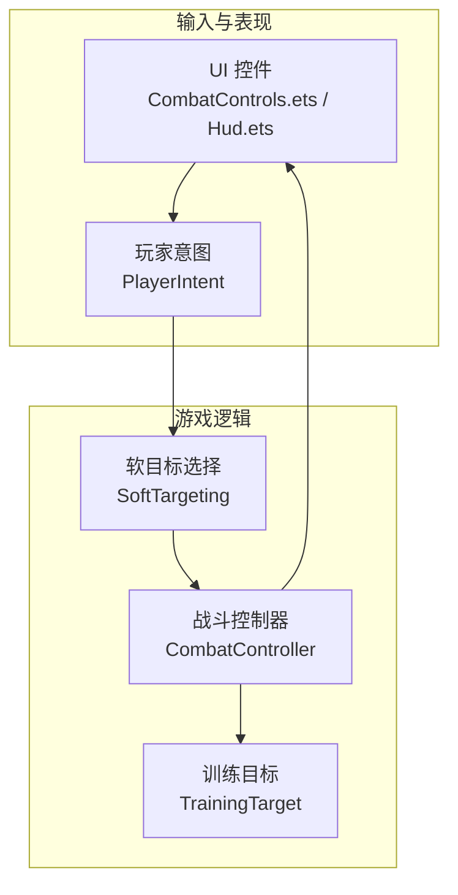
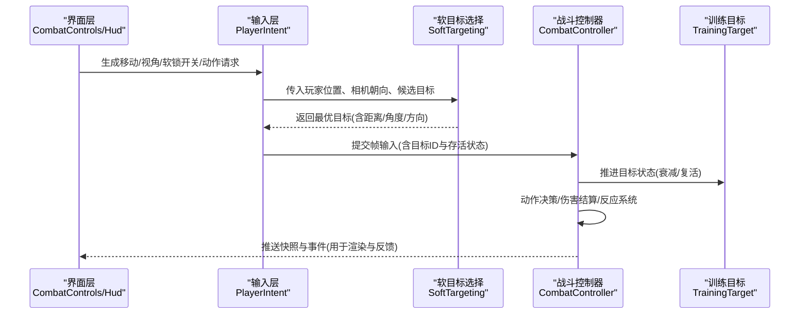
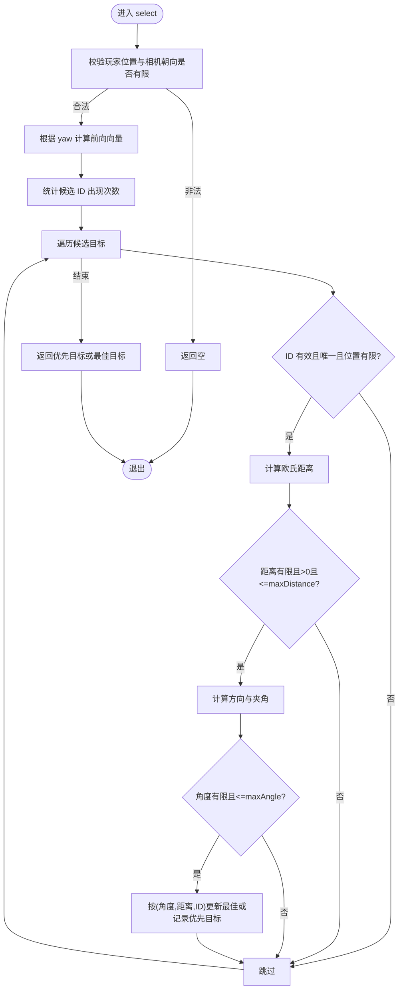
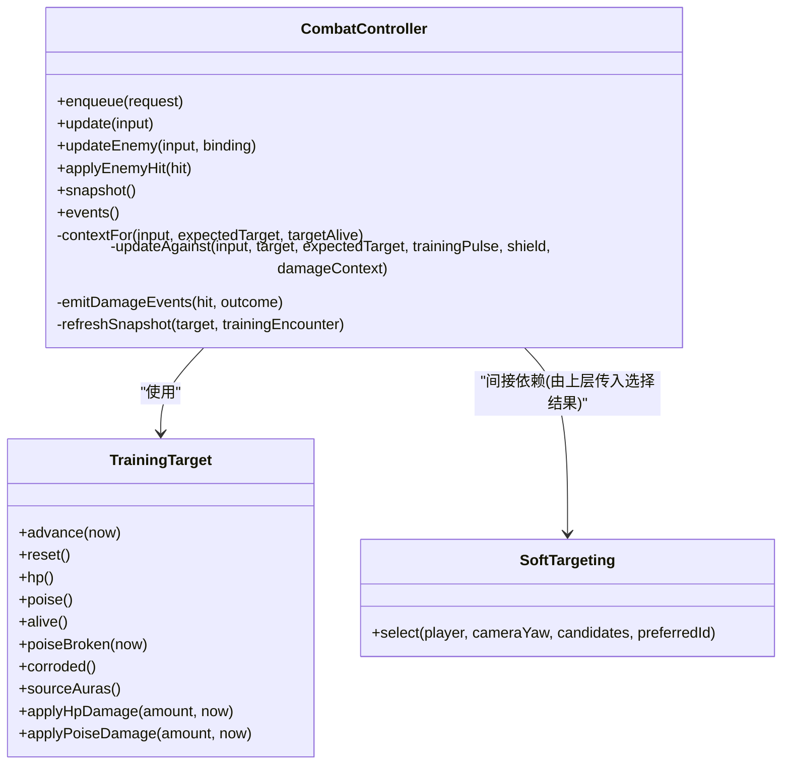
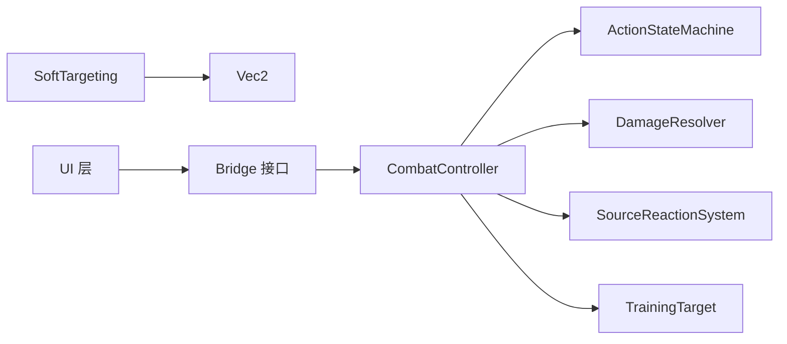

# 目标选择系统

<cite>
**本文引用的文件**   
- [soft_targeting.h](file://native/gameplay/targeting/soft_targeting.h)
- [soft_targeting.cpp](file://native/gameplay/targeting/soft_targeting.cpp)
- [test_soft_targeting.cpp](file://tests/test_soft_targeting.cpp)
- [combat_controller.h](file://native/gameplay/combat/combat_controller.h)
- [combat_controller.cpp](file://native/gameplay/combat/combat_controller.cpp)
- [training_target.h](file://native/gameplay/combat/training_target.h)
- [training_target.cpp](file://native/gameplay/combat/training_target.cpp)
- [player_intent.h](file://native/engine/input/player_intent.h)
- [Hud.ets](file://entry/src/main/ets/ui/Hud.ets)
- [CombatControls.ets](file://entry/src/main/ets/ui/CombatControls.ets)
</cite>

## 目录
1. [简介](#简介)
2. [项目结构](#项目结构)
3. [核心组件](#核心组件)
4. [架构总览](#架构总览)
5. [详细组件分析](#详细组件分析)
6. [依赖关系分析](#依赖关系分析)
7. [性能考量](#性能考量)
8. [故障排查指南](#故障排查指南)
9. [结论](#结论)
10. [附录](#附录)

## 简介
本技术文档围绕 my-world 的目标选择系统展开，重点阐述 SoftTargeting 软目标选择算法的实现细节（距离计算、角度判定、优先级排序与智能筛选）、用户交互设计（自动锁定、手动选择、动态切换），以及与战斗系统的集成方式（攻击判定、技能瞄准、团队协作）。同时给出性能优化策略（空间分割、缓存机制、批量处理）和关键实现细节（目标丢失处理、边界检测、用户体验优化），并提供代码片段路径以便快速定位实现。

## 项目结构
目标选择系统位于 gameplay/targeting 模块，核心为 SoftTargeting 类；战斗系统位于 gameplay/combat 模块，通过 CombatController 将输入与目标状态转化为动作决策与事件；UI 层在 entry/src/main/ets/ui 中提供操作按钮与 HUD 反馈；输入意图通过 engine/input 的 PlayerIntent 传递移动、视角与软锁开关等。

图表来源
- [soft_targeting.h:1-42](file://native/gameplay/targeting/soft_targeting.h#L1-L42)
- [soft_targeting.cpp:1-77](file://native/gameplay/targeting/soft_targeting.cpp#L1-L77)
- [combat_controller.h:1-117](file://native/gameplay/combat/combat_controller.h#L1-L117)
- [combat_controller.cpp:1-309](file://native/gameplay/combat/combat_controller.cpp#L1-L309)
- [training_target.h:1-44](file://native/gameplay/combat/training_target.h#L1-L44)
- [training_target.cpp:1-88](file://native/gameplay/combat/training_target.cpp#L1-L88)
- [player_intent.h:1-13](file://native/engine/input/player_intent.h#L1-L13)
- [Hud.ets:1-145](file://entry/src/main/ets/ui/Hud.ets#L1-L145)
- [CombatControls.ets:1-246](file://entry/src/main/ets/ui/CombatControls.ets#L1-L246)

章节来源
- [soft_targeting.h:1-42](file://native/gameplay/targeting/soft_targeting.h#L1-L42)
- [soft_targeting.cpp:1-77](file://native/gameplay/targeting/soft_targeting.cpp#L1-L77)
- [combat_controller.h:1-117](file://native/gameplay/combat/combat_controller.h#L1-L117)
- [combat_controller.cpp:1-309](file://native/gameplay/combat/combat_controller.cpp#L1-L309)
- [training_target.h:1-44](file://native/gameplay/combat/training_target.h#L1-L44)
- [training_target.cpp:1-88](file://native/gameplay/combat/training_target.cpp#L1-L88)
- [player_intent.h:1-13](file://native/engine/input/player_intent.h#L1-L13)
- [Hud.ets:1-145](file://entry/src/main/ets/ui/Hud.ets#L1-L145)
- [CombatControls.ets:1-246](file://entry/src/main/ets/ui/CombatControls.ets#L1-L246)

## 核心组件
- SoftTargeting：负责从候选目标集合中选择最优目标，支持最大距离、最大角度、ID 唯一性校验、优先目标保持与回退策略。
- CombatController：接收帧输入（含目标 ID 与存活状态），驱动动作状态机、伤害结算、反应系统与快照更新。
- TrainingTarget：训练目标的 HP、韧性、状态衰减与复活重置等生命周期管理。
- PlayerIntent：玩家每帧的移动、视角增量、软锁开关与动作请求队列。
- UI 层：CombatControls 提供技能按钮与冷却环，Hud 显示目标距离、连击窗、精准闪避窗口等调试信息。

章节来源
- [soft_targeting.h:1-42](file://native/gameplay/targeting/soft_targeting.h#L1-L42)
- [soft_targeting.cpp:1-77](file://native/gameplay/targeting/soft_targeting.cpp#L1-L77)
- [combat_controller.h:1-117](file://native/gameplay/combat/combat_controller.h#L1-L117)
- [combat_controller.cpp:1-309](file://native/gameplay/combat/combat_controller.cpp#L1-L309)
- [training_target.h:1-44](file://native/gameplay/combat/training_target.h#L1-L44)
- [training_target.cpp:1-88](file://native/gameplay/combat/training_target.cpp#L1-L88)
- [player_intent.h:1-13](file://native/engine/input/player_intent.h#L1-L13)
- [Hud.ets:1-145](file://entry/src/main/ets/ui/Hud.ets#L1-L145)
- [CombatControls.ets:1-246](file://entry/src/main/ets/ui/CombatControls.ets#L1-L246)

## 架构总览
SoftTargeting 作为纯函数式选择器，不持有外部状态，仅依据玩家位置、相机朝向与候选目标列表进行计算；CombatController 将选择结果与输入序列结合，驱动战斗流程并产出可被 UI 消费的快照与事件。

图表来源
- [soft_targeting.cpp:24-76](file://native/gameplay/targeting/soft_targeting.cpp#L24-L76)
- [combat_controller.cpp:30-151](file://native/gameplay/combat/combat_controller.cpp#L30-L151)
- [training_target.cpp:15-32](file://native/gameplay/combat/training_target.cpp#L15-L32)
- [player_intent.h:7-12](file://native/engine/input/player_intent.h#L7-L12)

## 详细组件分析

### SoftTargeting 软目标选择算法
- 输入参数：玩家二维位置、相机朝向角 yaw、候选目标列表、可选的优先目标 ID。
- 过滤规则：
  - 无效输入（非有限数值）直接返回空。
  - 候选目标必须具有正 ID、位置有限且 ID 唯一（去重）。
  - 距离需小于等于配置的最大距离，且不为零。
  - 角度需小于等于配置的最大角度。
- 优先级排序：按“角度最小 > 距离最小 > ID 升序”的三元组比较，确保稳定且可预测的选择顺序。
- 智能筛选：若存在 preferredId 且在候选集中，则优先返回该目标；否则回退到最佳候选。
- 输出：包含目标 ID、距离、角度与归一化方向的可选结构。

图表来源
- [soft_targeting.cpp:14-76](file://native/gameplay/targeting/soft_targeting.cpp#L14-L76)

章节来源
- [soft_targeting.h:9-28](file://native/gameplay/targeting/soft_targeting.h#L9-L28)
- [soft_targeting.cpp:14-76](file://native/gameplay/targeting/soft_targeting.cpp#L14-L76)
- [test_soft_targeting.cpp:17-166](file://tests/test_soft_targeting.cpp#L17-L166)

### 用户交互设计：自动锁定、手动选择与动态切换
- 自动锁定：当 PlayerIntent.softLock 为真时，上层每帧调用 SoftTargeting.select 基于当前候选集与相机朝向自动选择目标。
- 手动选择：上层可在特定时刻覆盖 preferredId，强制锁定某目标直到其消失（测试用例验证了“保持优先目标直至消失”的行为）。
- 动态切换：当首选目标不在候选集中时，系统自动回退到最佳候选，实现无缝切换。
- UI 反馈：Hud 展示目标距离百分比、连击窗、精准闪避窗口等；CombatControls 提供技能按钮与冷却环，点击后通过 pushAction 发送指令。

章节来源
- [player_intent.h:7-12](file://native/engine/input/player_intent.h#L7-L12)
- [test_soft_targeting.cpp:155-166](file://tests/test_soft_targeting.cpp#L155-L166)
- [Hud.ets:104-135](file://entry/src/main/ets/ui/Hud.ets#L104-L135)
- [CombatControls.ets:154-175](file://entry/src/main/ets/ui/CombatControls.ets#L154-L175)

### 与战斗系统的集成：攻击判定、技能瞄准与团队协作
- 输入绑定：CombatFrameInput 包含 tick、dtMs、moving、targetId、targetAlive 等字段，用于构建 ActionContext。
- 动作决策：CombatController.updateAgainst 先推进资源时间线，再对 pendingActions_ 排序并逐个请求决策，必要时触发精准闪避与洞察。
- 命中与伤害：若 actions_.update 返回 HitRequest，则进行护盾吸收、伤害解析、反应系统应用，并产出 GameplayEvent 与 PresentationEvent。
- 快照刷新：refreshSnapshot 汇总连击段、HP/Poise、耐力、共鸣、无敌、冷却、终极窗口、目标状态等信息供 UI 消费。
- 团队协作：SourceReactionSystem 与 SourceAuraContainer 支持多源附着与共鸣增益，便于团队协同输出。

图表来源
- [combat_controller.h:68-116](file://native/gameplay/combat/combat_controller.h#L68-L116)
- [combat_controller.cpp:30-151](file://native/gameplay/combat/combat_controller.cpp#L30-L151)
- [training_target.h:6-43](file://native/gameplay/combat/training_target.h#L6-L43)
- [training_target.cpp:15-32](file://native/gameplay/combat/training_target.cpp#L15-L32)
- [soft_targeting.h:30-41](file://native/gameplay/targeting/soft_targeting.h#L30-L41)

章节来源
- [combat_controller.h:12-66](file://native/gameplay/combat/combat_controller.h#L12-L66)
- [combat_controller.cpp:19-151](file://native/gameplay/combat/combat_controller.cpp#L19-L151)
- [training_target.h:14-31](file://native/gameplay/combat/training_target.h#L14-L31)
- [training_target.cpp:58-88](file://native/gameplay/combat/training_target.cpp#L58-L88)

### 目标丢失处理、边界检测与用户体验优化
- 目标丢失：当 preferredId 不再存在于候选集时，select 自动回退到最佳候选，保证锁定连续性。
- 边界检测：对玩家位置、相机朝向、候选位置进行有限性检查；距离与角度阈值由配置控制，避免异常值导致崩溃。
- 用户体验：Hud 显示目标距离百分比、精准闪避窗口颜色提示；CombatControls 提供冷却环与呼吸动画，增强可用性与反馈。

章节来源
- [soft_targeting.cpp:24-76](file://native/gameplay/targeting/soft_targeting.cpp#L24-L76)
- [test_soft_targeting.cpp:80-123](file://tests/test_soft_targeting.cpp#L80-L123)
- [Hud.ets:104-135](file://entry/src/main/ets/ui/Hud.ets#L104-L135)
- [CombatControls.ets:28-49](file://entry/src/main/ets/ui/CombatControls.ets#L28-L49)

## 依赖关系分析
- SoftTargeting 依赖 Vec2 数学类型与基础 STL 容器，无外部耦合，适合独立单元测试。
- CombatController 依赖 ActionStateMachine、DamageResolver、SourceReactionSystem、TrainingTarget 等子系统，形成清晰的职责分层。
- UI 层通过 Bridge 接口与原生通信，读取快照并渲染；输入层将玩家意图传递给上层逻辑。

图表来源
- [soft_targeting.h:1-8](file://native/gameplay/targeting/soft_targeting.h#L1-L8)
- [combat_controller.h:1-11](file://native/gameplay/combat/combat_controller.h#L1-L11)
- [training_target.h:1-5](file://native/gameplay/combat/training_target.h#L1-L5)

章节来源
- [soft_targeting.h:1-8](file://native/gameplay/targeting/soft_targeting.h#L1-L8)
- [combat_controller.h:1-11](file://native/gameplay/combat/combat_controller.h#L1-L11)
- [training_target.h:1-5](file://native/gameplay/combat/training_target.h#L1-L5)

## 性能考量
- 空间分割：建议在上层对候选目标进行网格或四叉树划分，减少每帧扫描规模；SoftTargeting 本身为 O(N) 线性扫描，适合配合空间索引使用。
- 缓存机制：可将每帧候选集与上次选择结果做增量对比，仅在变化时重新计算；preferredId 的稳定性可减少不必要的切换。
- 批量处理：将多个玩家的软目标选择合并为一批候选集，统一计算后再分发，降低重复开销。
- 数值安全：利用有限性检查与阈值裁剪，避免 NaN/Inf 导致的分支抖动与额外判断。

[本节为通用指导，不直接分析具体文件]

## 故障排查指南
- 目标无法选择：检查候选 ID 是否为正且唯一、位置是否有限、距离与角度是否在配置范围内。
- 锁定不稳定：确认 preferredId 是否仍在候选集中；若消失会自动回退，属于预期行为。
- 战斗无响应：核查 CombatFrameInput.targetId 与 targetAlive 是否与 SoftTargeting 选择一致；检查 pendingActions_ 排序与决策拒绝原因。
- UI 反馈异常：确认快照字段（如 targetDist、comboWindowMs、cooldown 等）是否正确映射至 HUD 与控件。

章节来源
- [soft_targeting.cpp:24-76](file://native/gameplay/targeting/soft_targeting.cpp#L24-L76)
- [combat_controller.cpp:56-74](file://native/gameplay/combat/combat_controller.cpp#L56-L74)
- [Hud.ets:104-135](file://entry/src/main/ets/ui/Hud.ets#L104-L135)

## 结论
SoftTargeting 以简洁而稳健的算法实现了稳定的软目标选择，结合 CombatController 的动作决策与事件流，形成了从输入到表现的完整闭环。通过合理的配置与上层优化（空间分割、缓存、批量处理），可在大规模目标场景下保持良好性能与流畅体验。UI 层的丰富反馈进一步提升了可用性，使自动锁定、手动选择与动态切换在实际战斗中自然顺畅。

[本节为总结，不直接分析具体文件]

## 附录
- 关键数据结构与接口路径：
  - 候选与选择结构：[soft_targeting.h:9-23](file://native/gameplay/targeting/soft_targeting.h#L9-L23)
  - 选择算法实现：[soft_targeting.cpp:24-76](file://native/gameplay/targeting/soft_targeting.cpp#L24-L76)
  - 战斗帧输入与快照：[combat_controller.h:12-54](file://native/gameplay/combat/combat_controller.h#L12-L54)
  - 训练目标生命周期：[training_target.h:6-43](file://native/gameplay/combat/training_target.h#L6-L43)
  - 玩家意图与软锁开关：[player_intent.h:7-12](file://native/engine/input/player_intent.h#L7-L12)
  - UI 控件与调试信息：[CombatControls.ets:1-246](file://entry/src/main/ets/ui/CombatControls.ets#L1-L246), [Hud.ets:1-145](file://entry/src/main/ets/ui/Hud.ets#L1-L145)

章节来源
- [soft_targeting.h:9-23](file://native/gameplay/targeting/soft_targeting.h#L9-L23)
- [soft_targeting.cpp:24-76](file://native/gameplay/targeting/soft_targeting.cpp#L24-L76)
- [combat_controller.h:12-54](file://native/gameplay/combat/combat_controller.h#L12-L54)
- [training_target.h:6-43](file://native/gameplay/combat/training_target.h#L6-L43)
- [player_intent.h:7-12](file://native/engine/input/player_intent.h#L7-L12)
- [CombatControls.ets:1-246](file://entry/src/main/ets/ui/CombatControls.ets#L1-L246)
- [Hud.ets:1-145](file://entry/src/main/ets/ui/Hud.ets#L1-L145)