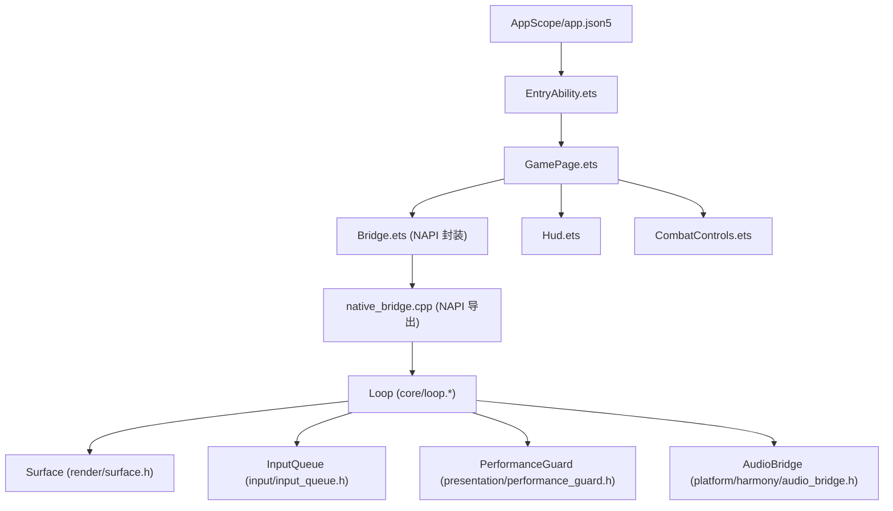
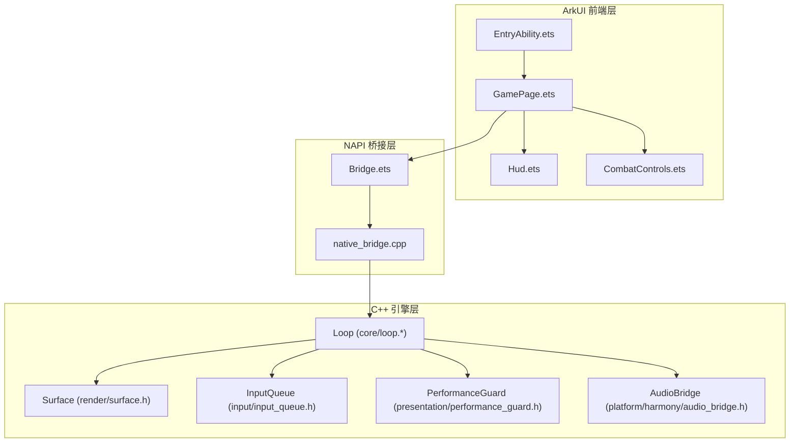
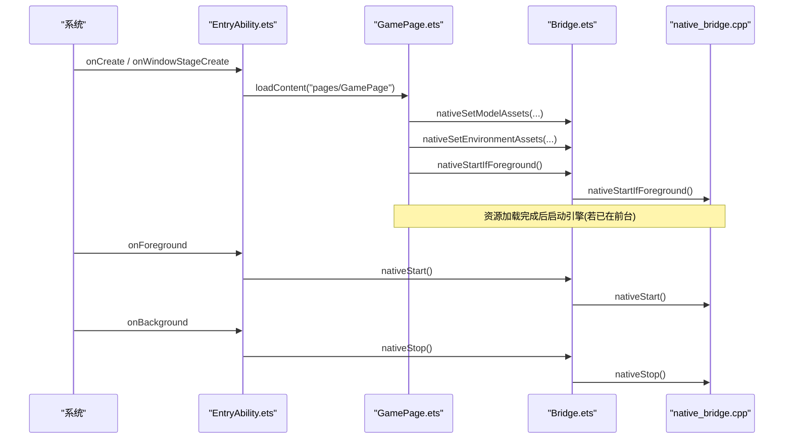
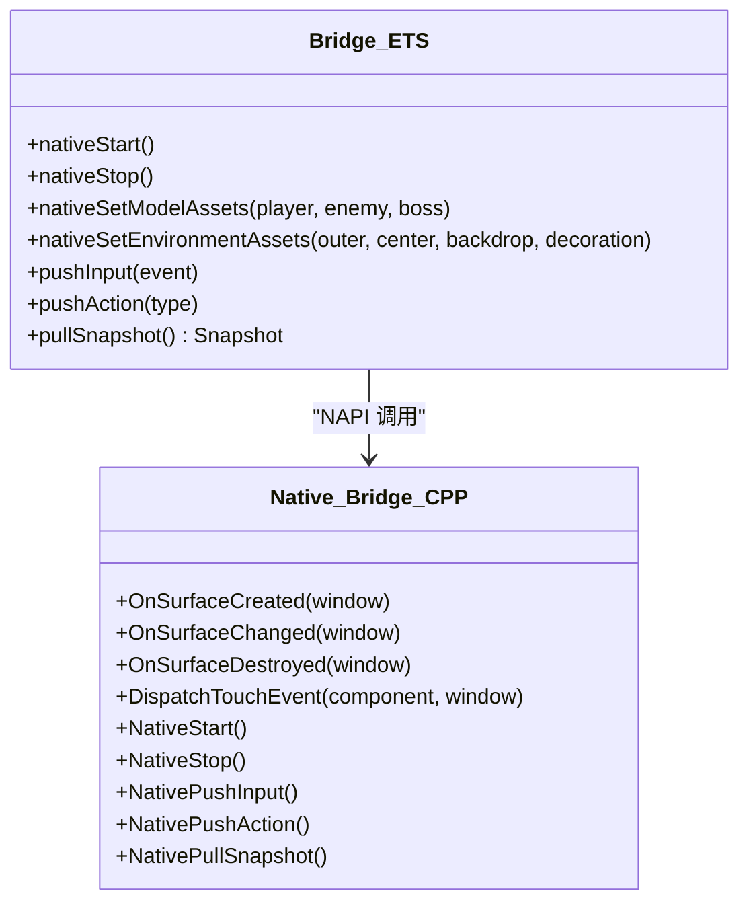
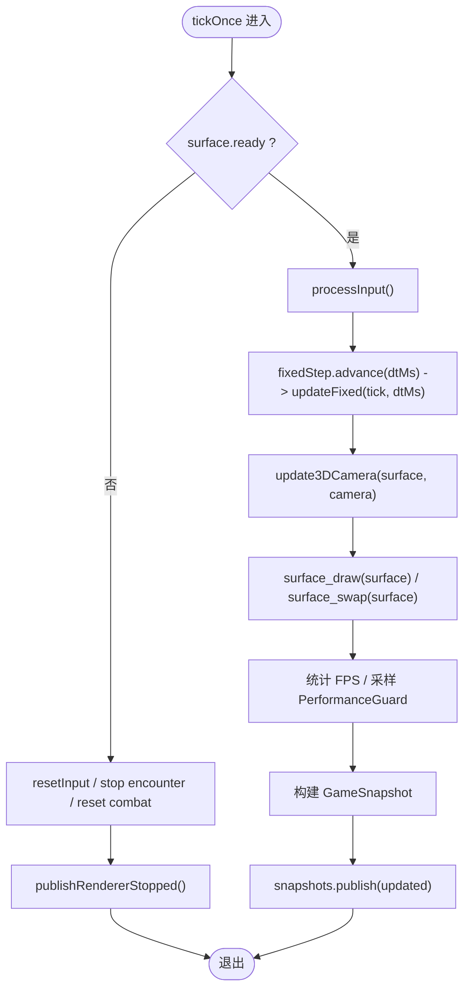
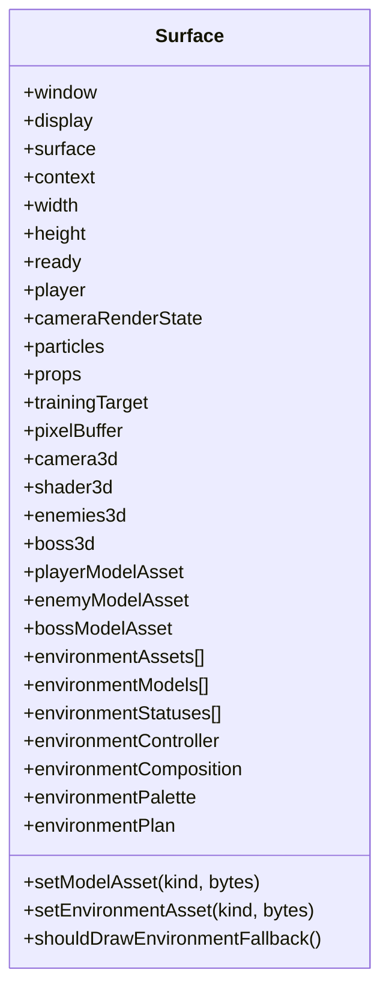
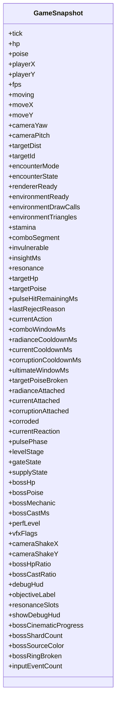
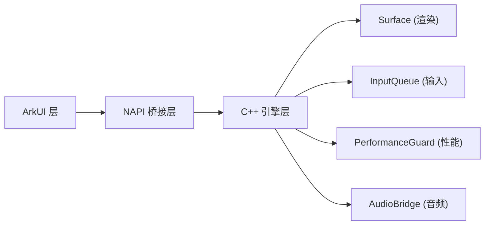

# 整体架构概览

<cite>
**本文引用的文件**   
- [AppScope/app.json5](file://AppScope/app.json5)
- [entry/src/main/ets/EntryAbility.ets](file://entry/src/main/ets/EntryAbility.ets)
- [entry/src/main/ets/pages/GamePage.ets](file://entry/src/main/ets/pages/GamePage.ets)
- [entry/src/main/ets/napi/Bridge.ets](file://entry/src/main/ets/napi/Bridge.ets)
- [entry/src/main/cpp/native_bridge.cpp](file://entry/src/main/cpp/native_bridge.cpp)
- [native/engine/core/loop.h](file://native/engine/core/loop.h)
- [native/engine/core/loop.cpp](file://native/engine/core/loop.cpp)
- [native/engine/render/surface.h](file://native/engine/render/surface.h)
- [native/engine/core/game_snapshot.h](file://native/engine/core/game_snapshot.h)
- [native/platform/harmony/audio_bridge.h](file://native/platform/harmony/audio_bridge.h)
- [native/engine/input/input_queue.h](file://native/engine/input/input_queue.h)
- [native/engine/presentation/performance_guard.h](file://native/engine/presentation/performance_guard.h)
- [entry/src/main/ets/ui/Hud.ets](file://entry/src/main/ets/ui/Hud.ets)
- [entry/src/main/ets/ui/CombatControls.ets](file://entry/src/main/ets/ui/CombatControls.ets)
</cite>

## 目录
1. [简介](#简介)
2. [项目结构](#项目结构)
3. [核心组件](#核心组件)
4. [架构总览](#架构总览)
5. [详细组件分析](#详细组件分析)
6. [依赖关系分析](#依赖关系分析)
7. [性能与优化](#性能与优化)
8. [故障排查指南](#故障排查指南)
9. [结论](#结论)

## 简介
本文件为 my-world 游戏引擎的整体架构文档，面向 HarmonyOS 应用与 C++ 游戏引擎的集成。系统采用分层设计：ArkUI 前端层、NAPI 桥接层、C++ 引擎层。EntryAbility 作为应用入口负责生命周期管理与页面加载；GamePage 通过 XComponent 嵌入原生渲染表面，并通过 NAPI 调用 native_bridge.cpp 暴露的接口驱动 C++ 引擎循环 Loop。数据流以“快照拉取”为主：C++ 引擎每帧生成 GameSnapshot，ArkUI 侧定时 pullSnapshot 并刷新 UI。输入从 ArkUI 经 NAPI 入队到 C++ 引擎，由 InputQueue 缓冲后在固定步长更新中消费。

技术栈选择权衡：
- ArkUI + XComponent 提供跨设备一致的 UI 与原生渲染窗口绑定能力，便于快速构建 HUD 与交互控件。
- NAPI 桥接层保持轻量契约，避免 JS/C++ 类型转换开销过大，使用 ArrayBuffer 传输模型与环境资源。
- C++ 引擎基于 GL/EGL 直接绘制，配合 glm 数学库与自定义 Surface 管理，保证渲染路径可控且可裁剪。
- 固定时间步长（FixedStep）确保逻辑稳定，结合 PerformanceGuard 动态降级保障低端设备体验。

## 项目结构
- AppScope/app.json5：应用包名、版本、API 级别等元信息。
- entry/src/main/ets：ArkTS 前端代码，包含 EntryAbility、GamePage、UI 组件与 NAPI 封装。
- entry/src/main/cpp：NAPI 桥接实现，注册回调、事件转发、资产提交与快照导出。
- native/engine：C++ 引擎核心，包括循环 Loop、渲染 Surface、输入队列、表现层 VFX/性能守卫、平台音频桥等。
- native/platform/harmony：HarmonyOS 平台适配（音频、栅栏等待、资源提交）。
- tests：大量单元测试覆盖引擎子系统。



图表来源
- [AppScope/app.json5:1-13](file://AppScope/app.json5#L1-L13)
- [entry/src/main/ets/EntryAbility.ets:1-44](file://entry/src/main/ets/EntryAbility.ets#L1-L44)
- [entry/src/main/ets/pages/GamePage.ets:1-305](file://entry/src/main/ets/pages/GamePage.ets#L1-L305)
- [entry/src/main/ets/napi/Bridge.ets:1-94](file://entry/src/main/ets/napi/Bridge.ets#L1-L94)
- [entry/src/main/cpp/native_bridge.cpp:1-577](file://entry/src/main/cpp/native_bridge.cpp#L1-L577)
- [native/engine/core/loop.h:1-104](file://native/engine/core/loop.h#L1-L104)
- [native/engine/render/surface.h:1-252](file://native/engine/render/surface.h#L1-L252)
- [native/engine/input/input_queue.h:1-47](file://native/engine/input/input_queue.h#L1-L47)
- [native/engine/presentation/performance_guard.h:1-45](file://native/engine/presentation/performance_guard.h#L1-L45)
- [native/platform/harmony/audio_bridge.h:1-27](file://native/platform/harmony/audio_bridge.h#L1-L27)

章节来源
- [AppScope/app.json5:1-13](file://AppScope/app.json5#L1-L13)
- [entry/src/main/ets/EntryAbility.ets:1-44](file://entry/src/main/ets/EntryAbility.ets#L1-L44)
- [entry/src/main/ets/pages/GamePage.ets:1-305](file://entry/src/main/ets/pages/GamePage.ets#L1-L305)
- [entry/src/main/ets/napi/Bridge.ets:1-94](file://entry/src/main/ets/napi/Bridge.ets#L1-L94)
- [entry/src/main/cpp/native_bridge.cpp:1-577](file://entry/src/main/cpp/native_bridge.cpp#L1-L577)
- [native/engine/core/loop.h:1-104](file://native/engine/core/loop.h#L1-L104)
- [native/engine/render/surface.h:1-252](file://native/engine/render/surface.h#L1-L252)
- [native/engine/input/input_queue.h:1-47](file://native/engine/input/input_queue.h#L1-L47)
- [native/engine/presentation/performance_guard.h:1-45](file://native/engine/presentation/performance_guard.h#L1-L45)
- [native/platform/harmony/audio_bridge.h:1-27](file://native/platform/harmony/audio_bridge.h#L1-L27)

## 核心组件
- EntryAbility：应用入口，创建 WindowStage，加载 GamePage，并在前台/后台时触发 nativeStart/nativeStop。
- GamePage：主页面，XComponent 绑定原生渲染表面，异步加载模型与环境资源，定时 pullSnapshot 驱动 UI 更新。
- Bridge.ets：NAPI 方法封装，定义 Snapshot 类型与输入动作映射。
- native_bridge.cpp：NAPI 模块导出，注册 XComponent 回调，处理输入、资产提交、关卡控制与快照导出。
- Loop：引擎主循环，维护 FixedStep、输入队列、相机、玩家控制器、战斗/AI、VFX、音频桥与性能守卫。
- Surface：EGL/GL 渲染上下文与资源管理，持有 2D/3D 渲染状态、模型与环境批处理、VFX 标志。
- InputQueue：线程安全的输入事件缓冲队列。
- PerformanceGuard：基于滑动窗口的 FPS 采样与性能等级计算。
- AudioBridge：根据战斗事件派发音效，不支持时静默降级。

章节来源
- [entry/src/main/ets/EntryAbility.ets:1-44](file://entry/src/main/ets/EntryAbility.ets#L1-L44)
- [entry/src/main/ets/pages/GamePage.ets:1-305](file://entry/src/main/ets/pages/GamePage.ets#L1-L305)
- [entry/src/main/ets/napi/Bridge.ets:1-94](file://entry/src/main/ets/napi/Bridge.ets#L1-L94)
- [entry/src/main/cpp/native_bridge.cpp:1-577](file://entry/src/main/cpp/native_bridge.cpp#L1-L577)
- [native/engine/core/loop.h:1-104](file://native/engine/core/loop.h#L1-L104)
- [native/engine/core/loop.cpp:1-614](file://native/engine/core/loop.cpp#L1-L614)
- [native/engine/render/surface.h:1-252](file://native/engine/render/surface.h#L1-L252)
- [native/engine/input/input_queue.h:1-47](file://native/engine/input/input_queue.h#L1-L47)
- [native/engine/presentation/performance_guard.h:1-45](file://native/engine/presentation/performance_guard.h#L1-L45)
- [native/platform/harmony/audio_bridge.h:1-27](file://native/platform/harmony/audio_bridge.h#L1-L27)

## 架构总览
系统分为三层：
- ArkUI 前端层：EntryAbility、GamePage、Hud、CombatControls，负责 UI 展示与用户交互。
- NAPI 桥接层：Bridge.ets 与 native_bridge.cpp，定义稳定的 JS/C++ 契约，传递输入、资源与快照。
- C++ 引擎层：Loop、Surface、InputQueue、PerformanceGuard、AudioBridge 等，负责游戏逻辑、渲染与平台适配。



图表来源
- [entry/src/main/ets/EntryAbility.ets:1-44](file://entry/src/main/ets/EntryAbility.ets#L1-L44)
- [entry/src/main/ets/pages/GamePage.ets:1-305](file://entry/src/main/ets/pages/GamePage.ets#L1-L305)
- [entry/src/main/ets/napi/Bridge.ets:1-94](file://entry/src/main/ets/napi/Bridge.ets#L1-L94)
- [entry/src/main/cpp/native_bridge.cpp:1-577](file://entry/src/main/cpp/native_bridge.cpp#L1-L577)
- [native/engine/core/loop.h:1-104](file://native/engine/core/loop.h#L1-L104)
- [native/engine/render/surface.h:1-252](file://native/engine/render/surface.h#L1-L252)
- [native/engine/input/input_queue.h:1-47](file://native/engine/input/input_queue.h#L1-L47)
- [native/engine/presentation/performance_guard.h:1-45](file://native/engine/presentation/performance_guard.h#L1-L45)
- [native/platform/harmony/audio_bridge.h:1-27](file://native/platform/harmony/audio_bridge.h#L1-L27)

## 详细组件分析

### EntryAbility 与页面生命周期
- EntryAbility 在 onWindowStageCreate 中加载 GamePage，onForeground/onBackground 分别调用 nativeStart/nativeStop，确保引擎在前台运行、后台暂停。
- GamePage 通过 XComponent 绑定原生 surface，并在销毁时调用 nativeStop。



图表来源
- [entry/src/main/ets/EntryAbility.ets:1-44](file://entry/src/main/ets/EntryAbility.ets#L1-L44)
- [entry/src/main/ets/pages/GamePage.ets:1-305](file://entry/src/main/ets/pages/GamePage.ets#L1-L305)
- [entry/src/main/ets/napi/Bridge.ets:1-94](file://entry/src/main/ets/napi/Bridge.ets#L1-L94)
- [entry/src/main/cpp/native_bridge.cpp:1-577](file://entry/src/main/cpp/native_bridge.cpp#L1-L577)

章节来源
- [entry/src/main/ets/EntryAbility.ets:1-44](file://entry/src/main/ets/EntryAbility.ets#L1-L44)
- [entry/src/main/ets/pages/GamePage.ets:1-305](file://entry/src/main/ets/pages/GamePage.ets#L1-L305)

### NAPI 桥接层与数据契约
- Bridge.ets 定义 Snapshot 接口与输入事件结构，导出 nativeStart/nativeStop/pullSnapshot/pushInput/pushAction 等方法。
- native_bridge.cpp 注册 OH_NativeXComponent 回调，处理 OnSurfaceCreated/Changed/Destroyed，将触摸事件转换为 InputAction 并入队。
- 资源提交通过 CopyAndCommitModelAssets/CopyAndCommitEnvironmentAssets 将 ArrayBuffer 拷贝到 CPU 缓存，随后在渲染线程替换 GPU 资源。



图表来源
- [entry/src/main/ets/napi/Bridge.ets:1-94](file://entry/src/main/ets/napi/Bridge.ets#L1-L94)
- [entry/src/main/cpp/native_bridge.cpp:1-577](file://entry/src/main/cpp/native_bridge.cpp#L1-L577)

章节来源
- [entry/src/main/ets/napi/Bridge.ets:1-94](file://entry/src/main/ets/napi/Bridge.ets#L1-L94)
- [entry/src/main/cpp/native_bridge.cpp:1-577](file://entry/src/main/cpp/native_bridge.cpp#L1-L577)

### C++ 引擎循环 Loop 与数据流
- Loop 维护 FixedStep 固定步长更新，processInput 消费 InputQueue，更新相机、玩家控制器、软目标选择、战斗与 AI，并驱动 DemoDirector。
- updateFixed 中将战斗与遭遇状态投影到 Surface，更新 VFX 与音频桥，最后发布 GameSnapshot。
- tickOnce 负责渲染与交换缓冲区，统计 FPS，采样性能等级。



图表来源
- [native/engine/core/loop.cpp:1-614](file://native/engine/core/loop.cpp#L1-L614)
- [native/engine/core/loop.h:1-104](file://native/engine/core/loop.h#L1-L104)

章节来源
- [native/engine/core/loop.cpp:1-614](file://native/engine/core/loop.cpp#L1-L614)
- [native/engine/core/loop.h:1-104](file://native/engine/core/loop.h#L1-L104)

### 渲染与资源管理 Surface
- Surface 管理 EGL/GL 上下文、窗口与缓冲区，持有 2D/3D 渲染状态、粒子、道具、训练目标。
- 模型与环境资源通过 setModelAsset/setEnvironmentAsset 暂存字节数组，渲染阶段解析并替换 SkinnedModel/StaticModel。
- environmentController 与 EnvironmentComposition 决定环境布局，environmentPlan 指导绘制顺序与批次。



图表来源
- [native/engine/render/surface.h:1-252](file://native/engine/render/surface.h#L1-L252)

章节来源
- [native/engine/render/surface.h:1-252](file://native/engine/render/surface.h#L1-L252)

### 输入系统与事件队列
- InputQueue 提供线程安全 push/pop/clear，容量上限防止溢出，记录丢弃计数。
- native_bridge.cpp 将 OH_NativeXComponent_TouchEvent 转换为 InputAction，通过 ForwardChangedPointer 路由到 TouchRouter，再入队。
- Loop::processInput 根据角色（移动/相机）分发到 VirtualJoystick/CameraGesture，并累积 intent.actions 给 CombatController。

```mermaid
sequenceDiagram
participant XComp as "OH_NativeXComponent"
participant Bridge as "native_bridge.cpp"
participant Queue as "InputQueue"
participant Loop as "Loop"
XComp->>Bridge : DispatchTouchEvent
Bridge->>Bridge : ForwardChangedPointer(action, id, x, y)
Bridge->>Loop : enqueueInput(action, id, x, y)
Loop->>Queue : push(InputEvent)
Loop->>Loop : processInput() 消费队列
Loop->>Loop : 更新摇杆/相机/动作意图
```

图表来源
- [entry/src/main/cpp/native_bridge.cpp:1-577](file://entry/src/main/cpp/native_bridge.cpp#L1-L577)
- [native/engine/input/input_queue.h:1-47](file://native/engine/input/input_queue.h#L1-L47)
- [native/engine/core/loop.cpp:1-614](file://native/engine/core/loop.cpp#L1-L614)

章节来源
- [entry/src/main/cpp/native_bridge.cpp:1-577](file://entry/src/main/cpp/native_bridge.cpp#L1-L577)
- [native/engine/input/input_queue.h:1-47](file://native/engine/input/input_queue.h#L1-L47)
- [native/engine/core/loop.cpp:1-614](file://native/engine/core/loop.cpp#L1-L614)

### 快照与 UI 同步
- GameSnapshot 聚合玩家、战斗、遭遇、性能、VFX、Boss 电影化进度等字段，供 UI 消费。
- GamePage 每 100ms 调用 pullSnapshot，将字段映射到 @State 变量，驱动 Hud/CombatControls 更新。



图表来源
- [native/engine/core/game_snapshot.h:1-74](file://native/engine/core/game_snapshot.h#L1-L74)

章节来源
- [native/engine/core/game_snapshot.h:1-74](file://native/engine/core/game_snapshot.h#L1-L74)
- [entry/src/main/ets/pages/GamePage.ets:1-305](file://entry/src/main/ets/pages/GamePage.ets#L1-L305)

### 音频桥接
- AudioBridge 根据 CombatEventBatch 派发音效，若无 OHAudioRenderer 支持则静默降级。
- Loop::updateFixed 中 dispatch(frameCombatEvents_) 将事件推送到音频桥。

章节来源
- [native/platform/harmony/audio_bridge.h:1-27](file://native/platform/harmony/audio_bridge.h#L1-L27)
- [native/engine/core/loop.cpp:1-614](file://native/engine/core/loop.cpp#L1-L614)

## 依赖关系分析
- ArkUI 层依赖 NAPI 封装（Bridge.ets），不直接访问 C++。
- NAPI 层依赖 OH_NativeXComponent 与 engine/core/loop.h，解耦平台细节。
- C++ 引擎内部依赖清晰：Loop 组合 Surface、InputQueue、PerformanceGuard、AudioBridge，单向依赖渲染与表现层。



图表来源
- [entry/src/main/ets/EntryAbility.ets:1-44](file://entry/src/main/ets/EntryAbility.ets#L1-L44)
- [entry/src/main/ets/pages/GamePage.ets:1-305](file://entry/src/main/ets/pages/GamePage.ets#L1-L305)
- [entry/src/main/ets/napi/Bridge.ets:1-94](file://entry/src/main/ets/napi/Bridge.ets#L1-L94)
- [entry/src/main/cpp/native_bridge.cpp:1-577](file://entry/src/main/cpp/native_bridge.cpp#L1-L577)
- [native/engine/core/loop.h:1-104](file://native/engine/core/loop.h#L1-L104)
- [native/engine/render/surface.h:1-252](file://native/engine/render/surface.h#L1-L252)
- [native/engine/input/input_queue.h:1-47](file://native/engine/input/input_queue.h#L1-L47)
- [native/engine/presentation/performance_guard.h:1-45](file://native/engine/presentation/performance_guard.h#L1-L45)
- [native/platform/harmony/audio_bridge.h:1-27](file://native/platform/harmony/audio_bridge.h#L1-L27)

章节来源
- [entry/src/main/ets/EntryAbility.ets:1-44](file://entry/src/main/ets/EntryAbility.ets#L1-L44)
- [entry/src/main/ets/pages/GamePage.ets:1-305](file://entry/src/main/ets/pages/GamePage.ets#L1-L305)
- [entry/src/main/ets/napi/Bridge.ets:1-94](file://entry/src/main/ets/napi/Bridge.ets#L1-L94)
- [entry/src/main/cpp/native_bridge.cpp:1-577](file://entry/src/main/cpp/native_bridge.cpp#L1-L577)
- [native/engine/core/loop.h:1-104](file://native/engine/core/loop.h#L1-L104)
- [native/engine/render/surface.h:1-252](file://native/engine/render/surface.h#L1-L252)
- [native/engine/input/input_queue.h:1-47](file://native/engine/input/input_queue.h#L1-L47)
- [native/engine/presentation/performance_guard.h:1-45](file://native/engine/presentation/performance_guard.h#L1-L45)
- [native/platform/harmony/audio_bridge.h:1-27](file://native/platform/harmony/audio_bridge.h#L1-L27)

## 性能与优化
- 固定步长更新：FixedStep 保证逻辑稳定性，避免大 dt 导致的数值漂移。
- 性能守卫：PerformanceGuard 基于 2 秒滑动窗口平均 FPS，划分 Full/Light/Medium/Heavy/Critical 等级，驱动纹理质量与特效开关。
- 渲染路径：surface_draw/surface_swap 在每帧执行，仅在 OHOS_PLATFORM 下启用 3D 阶段，减少非目标平台开销。
- 资源提交：模型与环境资源以 ArrayBuffer 批量提交，CPU 端缓存字节，GPU 端按需替换，避免频繁分配。
- 输入缓冲：InputQueue 容量限制与丢弃计数，防止高负载下阻塞或内存增长。
- 日志与监控：tickOnce 内输出 FPS、环境就绪、draw calls、三角面数与遭遇模式，便于定位瓶颈。

章节来源
- [native/engine/core/loop.cpp:1-614](file://native/engine/core/loop.cpp#L1-L614)
- [native/engine/presentation/performance_guard.h:1-45](file://native/engine/presentation/performance_guard.h#L1-L45)
- [native/engine/render/surface.h:1-252](file://native/engine/render/surface.h#L1-L252)
- [entry/src/main/cpp/native_bridge.cpp:1-577](file://entry/src/main/cpp/native_bridge.cpp#L1-L577)
- [native/engine/input/input_queue.h:1-47](file://native/engine/input/input_queue.h#L1-L47)

## 故障排查指南
- 渲染不可用：当 surface.ready=false 时，Loop 会重置输入与战斗并发布 RendererStopped 快照，UI 显示 GLES 不支持提示。检查 XComponent 初始化与 EGL/GL 上下文。
- 资源加载失败：nativeSetModelAssets/nativeSetEnvironmentAssets 返回 false 时使用回退网格或程序化环境。确认 rawfile 路径与二进制格式。
- 输入无响应：检查 OH_NativeXComponent_GetTouchEvent 是否成功，ForwardChangedPointer 是否正确映射 InputAction，InputQueue 是否满导致丢弃。
- 崩溃或卡顿：关注日志中的 fps、perf_level、environment_ready、draw calls、triangles，必要时降低 vfxFlags 或切换性能等级。
- 音频缺失：AudioBridge 在无 OHAudioRenderer 时静默，不影响主流程。

章节来源
- [entry/src/main/ets/pages/GamePage.ets:1-305](file://entry/src/main/ets/pages/GamePage.ets#L1-L305)
- [entry/src/main/cpp/native_bridge.cpp:1-577](file://entry/src/main/cpp/native_bridge.cpp#L1-L577)
- [native/engine/core/loop.cpp:1-614](file://native/engine/core/loop.cpp#L1-L614)
- [native/platform/harmony/audio_bridge.h:1-27](file://native/platform/harmony/audio_bridge.h#L1-L27)

## 结论
my-world 引擎通过清晰的三层架构与稳定的 NAPI 契约，实现了 ArkUI 与 C++ 引擎的高效集成。EntryAbility 作为应用入口协调生命周期，GamePage 负责资源加载与 UI 同步，Bridge.ets/native_bridge.cpp 承担数据与事件桥接，Loop/Surface/InputQueue/PerformanceGuard/AudioBridge 构成引擎核心。该设计兼顾了开发效率与运行时性能，适合在 HarmonyOS 设备上提供流畅的游戏体验。