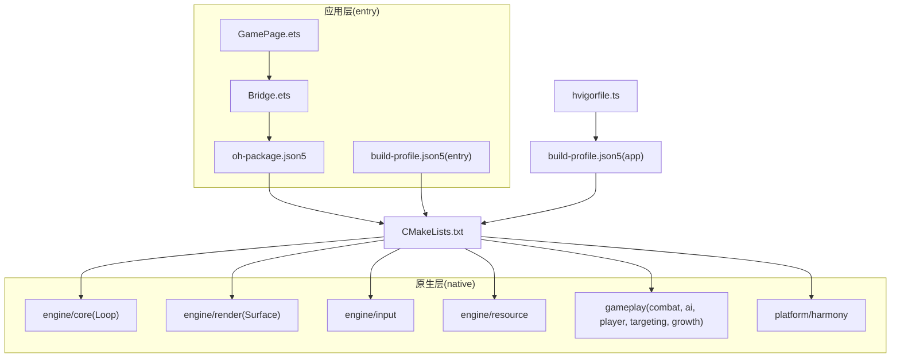
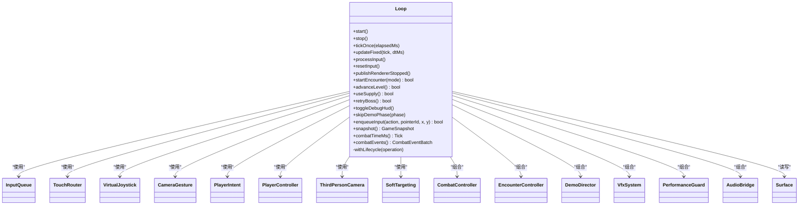
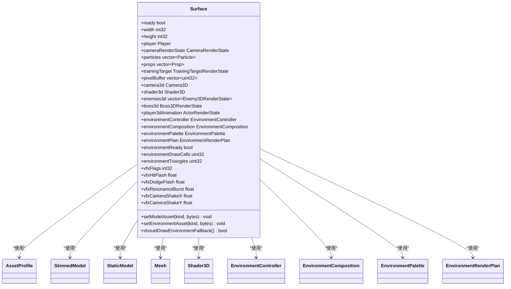
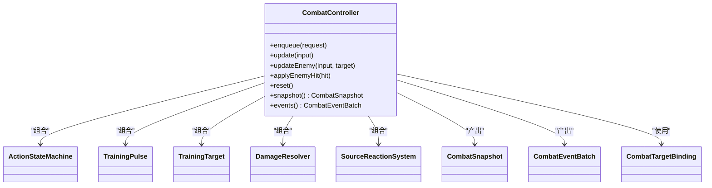
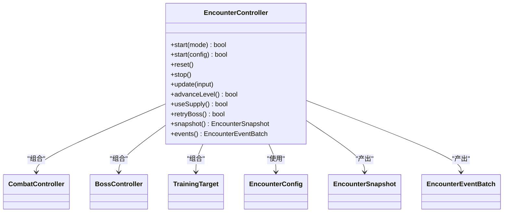
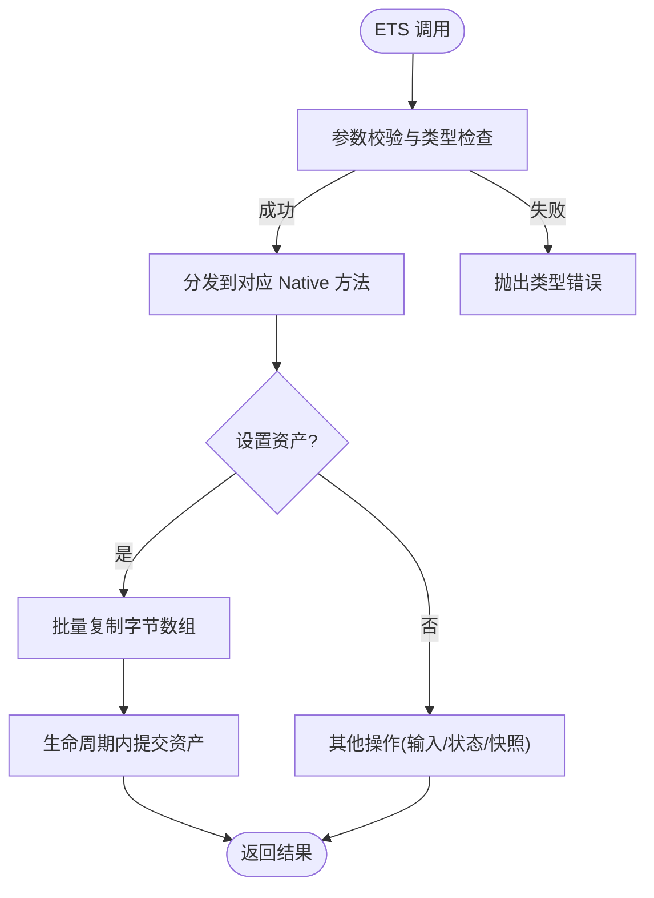
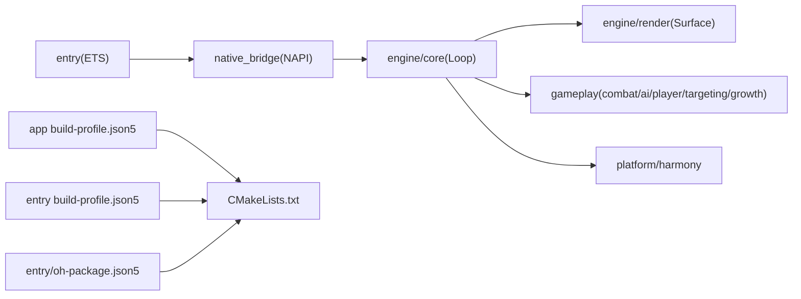

# 模块依赖关系图

<cite>
**本文引用的文件**   
- [build-profile.json5](file://build-profile.json5)
- [hvigorfile.ts](file://hvigorfile.ts)
- [entry/oh-package.json5](file://entry/oh-package.json5)
- [entry/build-profile.json5](file://entry/build-profile.json5)
- [entry/src/main/cpp/CMakeLists.txt](file://entry/src/main/cpp/CMakeLists.txt)
- [entry/src/main/cpp/native_bridge.cpp](file://entry/src/main/cpp/native_bridge.cpp)
- [entry/src/main/ets/napi/Bridge.ets](file://entry/src/main/ets/napi/Bridge.ets)
- [entry/src/main/ets/pages/GamePage.ets](file://entry/src/main/ets/pages/GamePage.ets)
- [native/engine/core/loop.h](file://native/engine/core/loop.h)
- [native/engine/core/loop.cpp](file://native/engine/core/loop.cpp)
- [native/engine/render/surface.h](file://native/engine/render/surface.h)
- [native/gameplay/combat/combat_controller.h](file://native/gameplay/combat/combat_controller.h)
- [native/gameplay/ai/encounter_controller.h](file://native/gameplay/ai/encounter_controller.h)
</cite>

## 目录
1. [简介](#简介)
2. [项目结构](#项目结构)
3. [核心组件](#核心组件)
4. [架构总览](#架构总览)
5. [详细组件分析](#详细组件分析)
6. [依赖分析](#依赖分析)
7. [性能考虑](#性能考虑)
8. [故障排查指南](#故障排查指南)
9. [结论](#结论)
10. [附录](#附录)

## 简介
本文件为 my-world 项目的模块依赖关系与架构文档，聚焦 engine、gameplay、platform 等核心模块的依赖图谱、构建配置中的模块声明与依赖管理、模块加载顺序与初始化流程、资源共享机制，以及通过依赖注入与控制反转降低耦合度的实践。文档同时提供循环依赖检测方案、扩展与插件化开发指导，并给出具体代码示例路径以展示模块间正确引用方式与最佳实践。

## 项目结构
my-world 采用“应用壳 + NAPI 桥接 + C++ 引擎”的分层结构：
- entry（HarmonyOS 应用入口）：负责 UI、资源加载、NAPI 绑定调用与渲染生命周期管理。
- native（C++ 引擎与玩法逻辑）：包含 engine（核心循环、输入、渲染、资源）、gameplay（战斗、AI、实体、玩家、目标选择、成长）、platform（平台适配，如 Harmony）。
- 构建系统：使用 hvigor + CMake，entry 模块通过 oh-package.json5 声明对 libnative_game.so 的依赖；CMakeLists.txt 集中声明 include 路径与源文件集合，统一编译产物为共享库。



图表来源
- [entry/src/main/ets/pages/GamePage.ets:1-305](file://entry/src/main/ets/pages/GamePage.ets#L1-L305)
- [entry/src/main/ets/napi/Bridge.ets:1-94](file://entry/src/main/ets/napi/Bridge.ets#L1-L94)
- [entry/oh-package.json5:1-12](file://entry/oh-package.json5#L1-L12)
- [entry/build-profile.json5:1-17](file://entry/build-profile.json5#L1-L17)
- [entry/src/main/cpp/CMakeLists.txt:1-135](file://entry/src/main/cpp/CMakeLists.txt#L1-L135)
- [build-profile.json5:1-69](file://build-profile.json5#L1-L69)
- [hvigorfile.ts:1-7](file://hvigorfile.ts#L1-L7)

章节来源
- [build-profile.json5:1-69](file://build-profile.json5#L1-L69)
- [hvigorfile.ts:1-7](file://hvigorfile.ts#L1-L7)
- [entry/oh-package.json5:1-12](file://entry/oh-package.json5#L1-L12)
- [entry/build-profile.json5:1-17](file://entry/build-profile.json5#L1-L17)
- [entry/src/main/cpp/CMakeLists.txt:1-135](file://entry/src/main/cpp/CMakeLists.txt#L1-L135)

## 核心组件
- Loop（核心循环）：协调输入、相机、玩家控制、软目标选择、战斗控制器、遭遇控制器、演示导演、VFX、性能守卫、音频桥接，驱动固定步长更新与帧绘制。
- Surface（渲染表面）：封装 EGL/GL 上下文、模型与环境资产、粒子与动画状态、环境渲染计划与性能指标，提供 setModelAsset/setEnvironmentAsset 原子写入接口。
- CombatController（战斗控制器）：维护动作状态机、伤害解析、共鸣反应系统、训练脉冲与目标，输出快照与事件批次。
- EncounterController（遭遇控制器）：编排不同模式（训练、兽群、混战、守卫、流程、首领），聚合敌人 AI、Boss 控制器与候选目标，产出遭遇快照与效果请求。
- Platform/Harmony（平台适配）：音频桥接、生命周期、栅栏等待、资源提交辅助函数。

章节来源
- [native/engine/core/loop.h:1-104](file://native/engine/core/loop.h#L1-L104)
- [native/engine/render/surface.h:1-252](file://native/engine/render/surface.h#L1-L252)
- [native/gameplay/combat/combat_controller.h:1-113](file://native/gameplay/combat/combat_controller.h#L1-L113)
- [native/gameplay/ai/encounter_controller.h:1-151](file://native/gameplay/ai/encounter_controller.h#L1-L151)

## 架构总览
下图展示了从 UI 到原生引擎的关键调用链与数据流，体现“UI 仅轮询快照、不直接修改游戏状态”的单向依赖原则。

```mermaid
sequenceDiagram
participant UI as "GamePage.ets"
participant Bridge as "Bridge.ets"
participant Native as "native_bridge.cpp"
participant Loop as "Loop(engine/core)"
participant Render as "Surface(engine/render)"
participant Combat as "CombatController(gameplay/combat)"
participant Encounter as "EncounterController(gameplay/ai)"
UI->>Bridge : 读取模型/环境资源
Bridge->>Native : nativeSetModelAssets / nativeSetEnvironmentAssets
Native->>Render : setModelAsset / setEnvironmentAsset (原子批处理)
UI->>Bridge : pullSnapshot()
Bridge->>Native : pullSnapshot()
Native->>Loop : snapshot()
Loop-->>Native : GameSnapshot
Native-->>Bridge : JS 对象
Bridge-->>UI : Snapshot
Note over UI,Render : 渲染由 XComponent 回调驱动<br/>OnSurfaceCreated/Changed -> surface_init/resize -> loop.start()
```

图表来源
- [entry/src/main/ets/pages/GamePage.ets:103-152](file://entry/src/main/ets/pages/GamePage.ets#L103-L152)
- [entry/src/main/ets/napi/Bridge.ets:77-94](file://entry/src/main/ets/napi/Bridge.ets#L77-L94)
- [entry/src/main/cpp/native_bridge.cpp:151-210](file://entry/src/main/cpp/native_bridge.cpp#L151-L210)
- [native/engine/core/loop.h:26-104](file://native/engine/core/loop.h#L26-L104)
- [native/engine/render/surface.h:217-239](file://native/engine/render/surface.h#L217-L239)

## 详细组件分析

### 组件A：Loop（核心循环）
- 职责：启动/停止线程、固定步长更新、输入处理、相机更新、玩家移动、软目标选择、战斗与遭遇更新、演示导演推进、VFX/Audio 分发、快照发布。
- 关键依赖：InputQueue、TouchRouter、VirtualJoystick、CameraGesture、PlayerIntent、PlayerController、ThirdPersonCamera、SoftTargeting、CombatController、EncounterController、DemoDirector、VfxSystem、PerformanceGuard、AudioBridge、Surface。
- 设计要点：
  - withLifecycle 保证跨线程安全访问。
  - 固定步长与 FPS 统计分离，避免抖动影响逻辑。
  - 快照只读发布，UI 轮询消费。



图表来源
- [native/engine/core/loop.h:26-104](file://native/engine/core/loop.h#L26-L104)

章节来源
- [native/engine/core/loop.h:1-104](file://native/engine/core/loop.h#L1-L104)
- [native/engine/core/loop.cpp:131-203](file://native/engine/core/loop.cpp#L131-L203)
- [native/engine/core/loop.cpp:311-417](file://native/engine/core/loop.cpp#L311-L417)
- [native/engine/core/loop.cpp:419-598](file://native/engine/core/loop.cpp#L419-L598)

### 组件B：Surface（渲染表面）
- 职责：EGL/GL 生命周期、模型与环境资产缓冲、动画状态、环境渲染计划、性能指标、VFX 标志位。
- 关键接口：setModelAsset、setEnvironmentAsset、surface_init/resize/draw/swap/destroy。
- 设计要点：
  - 资产写入加锁，延迟在 GL 上下文中解析与替换，避免跨线程冲突。
  - 环境资产按批次状态机管理，未就绪时回退到程序化渲染。



图表来源
- [native/engine/render/surface.h:98-245](file://native/engine/render/surface.h#L98-L245)

章节来源
- [native/engine/render/surface.h:1-252](file://native/engine/render/surface.h#L1-L252)

### 组件C：CombatController（战斗控制器）
- 职责：动作队列入队、帧输入更新、敌人与训练目标交互、伤害计算、共鸣反应、事件批次生成。
- 关键数据结构：CombatFrameInput、CombatSnapshot、CombatEventBatch、CombatTargetBinding。
- 设计要点：将 gameplay 与 presentation 两类事件解耦，便于 VFX/Audio 消费。



图表来源
- [native/gameplay/combat/combat_controller.h:1-113](file://native/gameplay/combat/combat_controller.h#L1-L113)

章节来源
- [native/gameplay/combat/combat_controller.h:1-113](file://native/gameplay/combat/combat_controller.h#L1-L113)

### 组件D：EncounterController（遭遇控制器）
- 职责：多模式编排（训练、兽群、混战、守卫、流程、首领）、敌人槽位管理、Boss 控制器集成、候选目标生成、关卡阶段/门/补给状态流转。
- 关键数据结构：EncounterConfig、EncounterFrameInput、EncounterSnapshot、EncounterEventBatch。
- 设计要点：通过组合 CombatController 实现战斗能力复用，自身专注高层流程与状态机。



图表来源
- [native/gameplay/ai/encounter_controller.h:1-151](file://native/gameplay/ai/encounter_controller.h#L1-L151)

章节来源
- [native/gameplay/ai/encounter_controller.h:1-151](file://native/gameplay/ai/encounter_controller.h#L1-L151)

### 组件E：NAPI 桥接与 UI 交互
- 职责：暴露 nativeStart/Stop/SetModelAssets/SetEnvironmentAssets/PushInput/PushAction/StartEncounter/AdvanceLevel/UseSupply/RetryBoss/ToggleDebugHud/SkipDemoPhase/PullSnapshot 等接口给 ETS。
- 关键点：
  - 前台请求标记 g_foregroundRequested，确保 OnSurfaceCreated/Changed 仅在需要前台时启动循环。
  - 资产提交使用 CopyAndCommit* 原子批处理，所有拷贝完成后一次性提交，避免中间态。
  - 快照拉取将 C++ GameSnapshot 映射为 JS 对象，字段完整覆盖 HUD 所需。



图表来源
- [entry/src/main/cpp/native_bridge.cpp:151-210](file://entry/src/main/cpp/native_bridge.cpp#L151-L210)
- [entry/src/main/cpp/native_bridge.cpp:212-250](file://entry/src/main/cpp/native_bridge.cpp#L212-L250)
- [entry/src/main/cpp/native_bridge.cpp:277-319](file://entry/src/main/cpp/native_bridge.cpp#L277-L319)
- [entry/src/main/cpp/native_bridge.cpp:360-516](file://entry/src/main/cpp/native_bridge.cpp#L360-L516)

章节来源
- [entry/src/main/cpp/native_bridge.cpp:1-577](file://entry/src/main/cpp/native_bridge.cpp#L1-L577)
- [entry/src/main/ets/napi/Bridge.ets:1-94](file://entry/src/main/ets/napi/Bridge.ets#L1-L94)
- [entry/src/main/ets/pages/GamePage.ets:103-152](file://entry/src/main/ets/pages/GamePage.ets#L103-L152)

## 依赖分析
- 模块边界与依赖方向：
  - entry（ETS）→ native_bridge（NAPI）→ engine/core（Loop）→ gameplay（Combat/Encounter）→ platform（Harmony）。
  - render（Surface）被 engine/core 与 platform 共同使用，作为渲染与资源载体。
  - gameplay 内部 combat → ai（encounter）单向依赖，避免反向耦合。
- 构建与链接：
  - app build-profile.json5 定义产品签名、ABI 过滤、外部 CMake 路径。
  - entry build-profile.json5 指定 stageMode 与 externalNativeOptions。
  - entry/oh-package.json5 声明对 libnative_game.so 的本地依赖。
  - CMakeLists.txt 集中 include 路径与源文件集合，链接系统库（EGL/GLES3/NAPI/Window）。



图表来源
- [build-profile.json5:1-69](file://build-profile.json5#L1-L69)
- [entry/build-profile.json5:1-17](file://entry/build-profile.json5#L1-L17)
- [entry/oh-package.json5:1-12](file://entry/oh-package.json5#L1-L12)
- [entry/src/main/cpp/CMakeLists.txt:1-135](file://entry/src/main/cpp/CMakeLists.txt#L1-L135)

章节来源
- [build-profile.json5:1-69](file://build-profile.json5#L1-L69)
- [entry/build-profile.json5:1-17](file://entry/build-profile.json5#L1-L17)
- [entry/oh-package.json5:1-12](file://entry/oh-package.json5#L1-L12)
- [entry/src/main/cpp/CMakeLists.txt:1-135](file://entry/src/main/cpp/CMakeLists.txt#L1-L135)

## 性能考虑
- 固定步长与帧率解耦：Loop 使用 FixedStep 保证逻辑稳定，FPS 独立统计。
- 渲染降级：PerformanceGuard 根据采样调整环境纹理级别与绘制开销。
- 资产异步提交：CopyAndCommit* 批量提交，避免频繁切换上下文。
- 事件批处理：CombatEventBatch 与 EncounterEventBatch 合并排序后分发至 VFX/Audio，减少多次遍历。

[本节为通用性能建议，无需特定文件引用]

## 故障排查指南
- 常见问题定位：
  - 渲染未启动：检查 OnSurfaceCreated/Changed 是否调用 surface_init/resize，且 g_foregroundRequested 为真。
  - 资产未生效：确认 CopyAndCommit* 返回值与生命周期内提交是否成功。
  - 输入无响应：验证 pushInput/pushAction 参数校验与 enqueueInput 序列号递增。
  - 快照字段缺失：核对 native_bridge.cpp 中 PullSnapshot 字段映射与 Bridge.ets 导出一致性。
- 调试手段：
  - toggleDebugHud 开启 HUD 显示 perfLevel/vfxFlags/cameraShake 等。
  - skipDemoPhase 快速跳转到指定阶段验证流程。
  - 日志输出：OH_LOG_Print 打印 fps、环境就绪、draw calls、triangles 等。

章节来源
- [entry/src/main/cpp/native_bridge.cpp:59-111](file://entry/src/main/cpp/native_bridge.cpp#L59-L111)
- [entry/src/main/cpp/native_bridge.cpp:360-516](file://entry/src/main/cpp/native_bridge.cpp#L360-L516)
- [native/engine/core/loop.cpp:332-354](file://native/engine/core/loop.cpp#L332-L354)

## 结论
my-world 通过清晰的模块边界与单向依赖，实现了 UI、NAPI 桥接、引擎核心、玩法逻辑与平台适配的松耦合架构。构建系统集中管理依赖与编译选项，Loop 作为调度中枢协调各子系统，Surface 作为渲染与资源载体，Combat/Encounter 分别承担战斗与流程编排。借助依赖注入（组合而非继承）与控制反转（事件与快照单向传播），有效降低了模块间耦合度，提升了可测试性与可扩展性。

[本节为总结性内容，无需特定文件引用]

## 附录

### 模块化设计原则与边界划分策略
- 单一职责：每个模块聚焦一个领域（如 render 仅负责渲染，gameplay 仅负责玩法逻辑）。
- 单向依赖：上层依赖下层，禁止反向；例如 gameplay 不依赖 platform，platform 不依赖 gameplay。
- 数据契约：通过快照与事件批次定义稳定接口，避免头文件强耦合。
- 资源隔离：资产缓冲与渲染管线分离，提交与解析解耦。

[本节为概念性内容，无需特定文件引用]

### 构建配置中的模块声明与依赖管理
- app 级 build-profile.json5：定义签名、产品、ABI 过滤、CMake 路径。
- entry 级 build-profile.json5：stageMode、externalNativeOptions。
- entry/oh-package.json5：声明 libnative_game.so 本地依赖。
- CMakeLists.txt：include_directories 与 add_library 源文件清单，target_link_libraries 链接系统库。

章节来源
- [build-profile.json5:1-69](file://build-profile.json5#L1-L69)
- [entry/build-profile.json5:1-17](file://entry/build-profile.json5#L1-L17)
- [entry/oh-package.json5:1-12](file://entry/oh-package.json5#L1-L12)
- [entry/src/main/cpp/CMakeLists.txt:1-135](file://entry/src/main/cpp/CMakeLists.txt#L1-L135)

### 依赖注入与控制反转实践
- 依赖注入：Loop 组合 CombatController、EncounterController、VfxSystem 等，通过构造函数或成员变量注入，便于替换与测试。
- 控制反转：UI 仅轮询快照与调用桥接 API，不直接操控游戏状态；事件与快照由引擎侧发布，UI 消费。

章节来源
- [native/engine/core/loop.h:26-104](file://native/engine/core/loop.h#L26-L104)
- [entry/src/main/ets/pages/GamePage.ets:219-293](file://entry/src/main/ets/pages/GamePage.ets#L219-L293)

### 模块加载顺序、初始化流程与资源共享机制
- 加载顺序：XComponent 创建 → OnSurfaceCreated → surface_init → Loop.start（若前台请求）→ 资源加载完成 → nativeStartIfForeground。
- 初始化流程：Loop 构造时设置默认环境与训练模式；start 时重置输入、音频、战斗时间、事件批次。
- 资源共享：Surface 持有模型与环境资产缓冲，setModelAsset/setEnvironmentAsset 原子写入，GL 上下文下解析与替换。

章节来源
- [entry/src/main/cpp/native_bridge.cpp:59-111](file://entry/src/main/cpp/native_bridge.cpp#L59-L111)
- [native/engine/core/loop.cpp:131-174](file://native/engine/core/loop.cpp#L131-L174)
- [native/engine/render/surface.h:217-239](file://native/engine/render/surface.h#L217-L239)

### 循环依赖检测方案
- 静态检查：CMake include 路径与源文件清单应遵循单向依赖；可通过脚本扫描 #include 路径，构建依赖图并检测环。
- 运行时断言：在关键模块初始化处添加断言，确保依赖已就绪。
- 单元测试：针对桥接契约与快照字段进行一致性校验（参考 tests/test_bridge_contract.mjs 的模式）。

[本节为方法论内容，无需特定文件引用]

### 模块扩展与插件化开发指导原则
- 扩展点：在 Loop 中预留扩展钩子（如新增系统类成员与 tickOnce 调用点），保持向后兼容。
- 插件接口：通过抽象接口与事件总线（CombatEventBatch/EncounterEventBatch）接入新系统，避免侵入式修改。
- 资源插件：Surface 的 environmentModels 与 assetProfile 支持动态替换，便于热更新与多套资源包。

[本节为概念性内容，无需特定文件引用]

### 具体代码示例与最佳实践
- 正确引用方式：
  - ETS 通过 Bridge.ets 调用 native_* 方法，避免直接依赖 .so。
  - native_bridge.cpp 使用 withLifecycle 保护跨线程操作。
  - Loop 组合 gameplay 与 render，不反向依赖 UI。
- 最佳实践：
  - 资产批量提交，避免中间态。
  - 快照字段完整映射，确保 UI 渲染一致性。
  - 输入事件严格校验，防止非法值进入引擎。

章节来源
- [entry/src/main/ets/napi/Bridge.ets:77-94](file://entry/src/main/ets/napi/Bridge.ets#L77-L94)
- [entry/src/main/cpp/native_bridge.cpp:151-210](file://entry/src/main/cpp/native_bridge.cpp#L151-L210)
- [native/engine/core/loop.cpp:311-417](file://native/engine/core/loop.cpp#L311-L417)