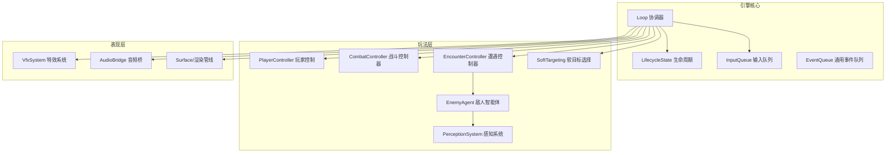
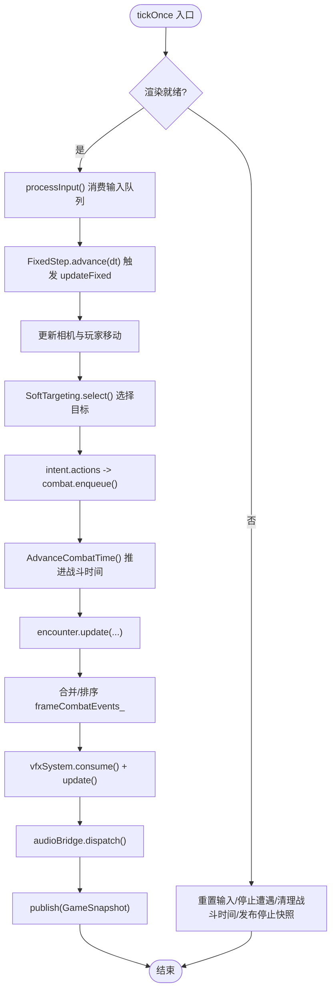
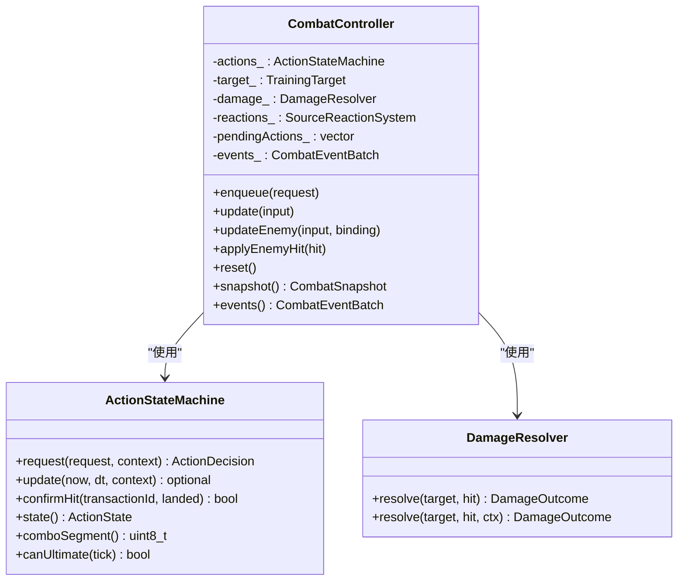
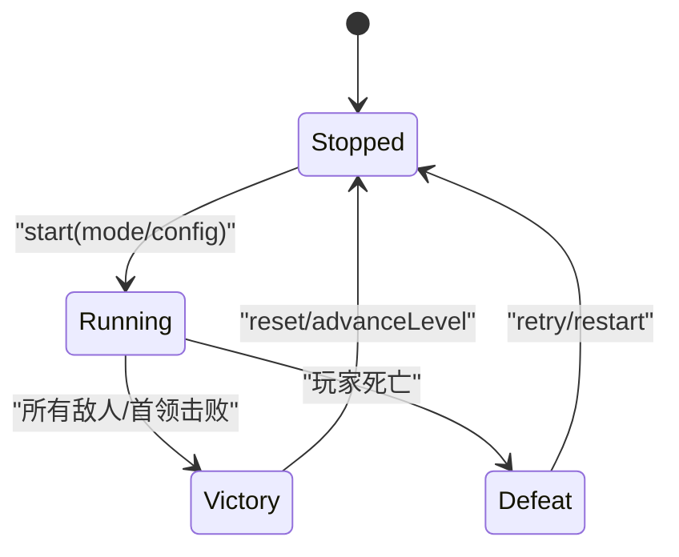
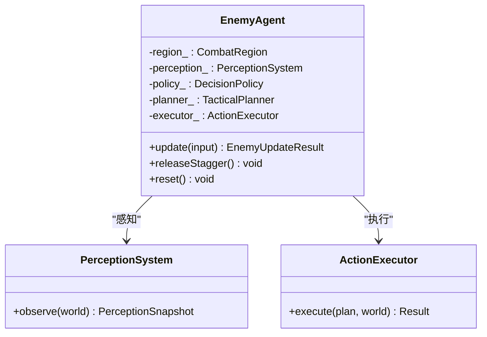
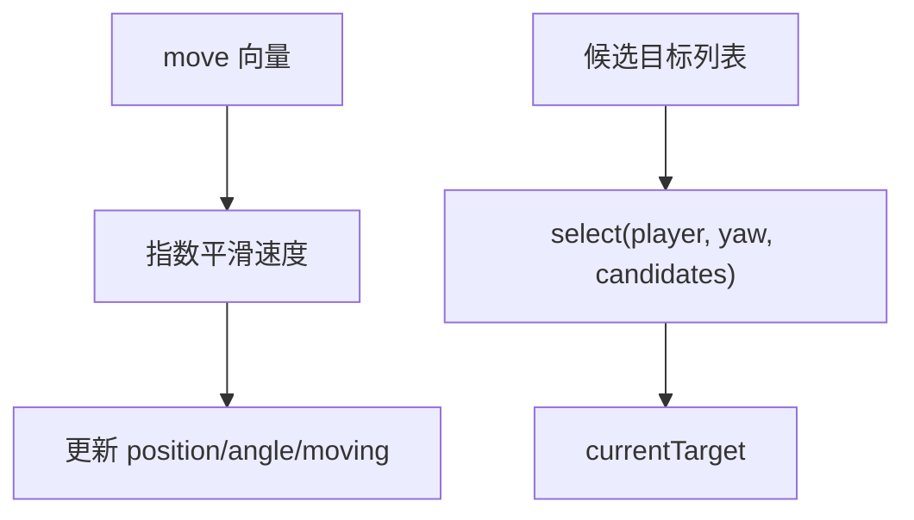
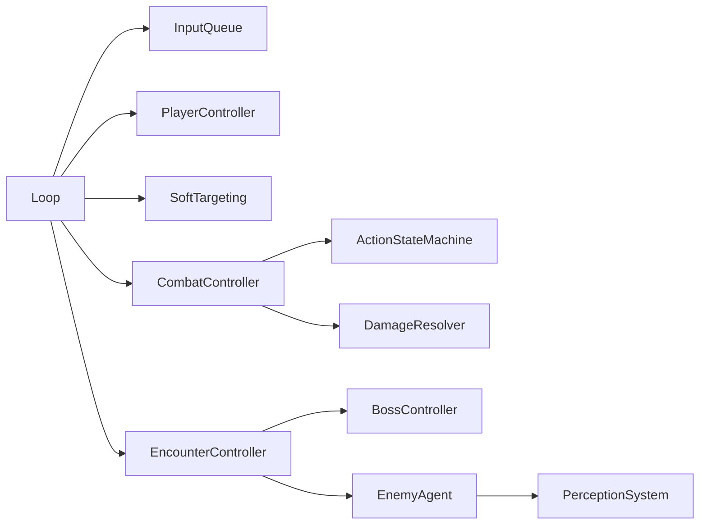
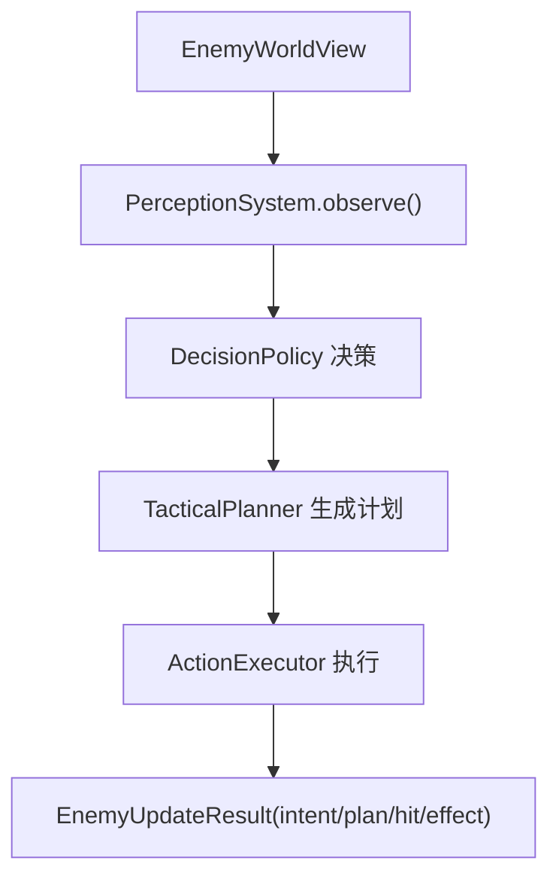

# 组件交互模式

<cite>
**本文引用的文件**   
- [loop.h](file://native/engine/core/loop.h)
- [loop.cpp](file://native/engine/core/loop.cpp)
- [event_queue.h](file://native/engine/core/event_queue.h)
- [lifecycle_state.h](file://native/engine/core/lifecycle_state.h)
- [input_queue.h](file://native/engine/input/input_queue.h)
- [combat_controller.h](file://native/gameplay/combat/combat_controller.h)
- [action_state_machine.h](file://native/gameplay/combat/action_state_machine.h)
- [damage_resolver.h](file://native/gameplay/combat/damage_resolver.h)
- [event.h](file://native/gameplay/combat/event.h)
- [encounter_controller.h](file://native/gameplay/ai/encounter_controller.h)
- [enemy_agent.h](file://native/gameplay/ai/enemy_agent.h)
- [perception_system.h](file://native/gameplay/ai/perception_system.h)
- [soft_targeting.h](file://native/gameplay/targeting/soft_targeting.h)
- [player_controller.h](file://native/gameplay/player/player_controller.h)
</cite>

## 目录
1. [简介](#简介)
2. [项目结构](#项目结构)
3. [核心组件](#核心组件)
4. [架构总览](#架构总览)
5. [详细组件分析](#详细组件分析)
6. [依赖关系分析](#依赖关系分析)
7. [性能考虑](#性能考虑)
8. [故障排查指南](#故障排查指南)
9. [结论](#结论)
10. [附录](#附录)

## 简介
本文件面向 my-world 项目的组件交互模式，系统性阐述 Loop 协调器、CombatController（战斗控制器）、EncounterController（遭遇控制器）等关键组件的协作方式。文档聚焦事件驱动架构的实现细节：事件队列、消息传递与异步处理；记录组件间的依赖关系与生命周期管理；解释观察者模式、命令模式和状态机模式在系统中的具体应用；并提供序列图与状态转换图以可视化关键流程。同时涵盖并发访问、线程安全与数据一致性策略，并通过“战斗流程”“AI 决策”“用户输入处理”等完整数据流示例帮助读者理解系统行为。

## 项目结构
my-world 采用分层组织：引擎核心（循环、输入、渲染、资源）、玩法层（战斗、AI、玩家、目标选择、成长）、平台桥接（Harmony 音频、生命周期）。Loop 作为主循环协调器，统一调度输入、玩家控制、战斗、AI、演示导演、VFX 与音频输出，并将快照发布给上层 UI/渲染。



图表来源
- [loop.h:26-54](file://native/engine/core/loop.h#L26-L54)
- [lifecycle_state.h:6-37](file://native/engine/core/lifecycle_state.h#L6-L37)
- [input_queue.h:8-46](file://native/engine/input/input_queue.h#L8-L46)

章节来源
- [loop.h:26-54](file://native/engine/core/loop.h#L26-L54)
- [loop.cpp:131-174](file://native/engine/core/loop.cpp#L131-L174)

## 核心组件
- Loop 协调器：维护固定步长更新、输入处理、相机与玩家移动、目标选择、战斗与遭遇更新、演示导演推进、VFX/Audio 分发、帧快照发布与渲染同步。
- CombatController：基于 ActionStateMachine 的命令式动作处理、伤害计算、反应系统与脉冲训练目标管理，产出 Gameplay/Presentation 事件批次。
- EncounterController：管理不同遭遇模式（训练、野兽、混合、守卫、关卡流程、首领），驱动敌人槽位与 Boss 控制器，汇总事件并刷新快照。
- EnemyAgent：封装 AI 决策、战术规划、执行器与感知系统，输出意图、计划、移动与攻击请求。
- SoftTargeting：根据玩家位置、相机朝向与候选目标集合进行软目标选择。
- PlayerController：平滑移动与转向，驱动 Surface.player 状态。
- InputQueue：线程安全的输入事件队列，供 UI/平台侧入队，Loop 侧消费。
- EventQueue：通用线程安全事件队列模板，用于跨模块事件缓冲。
- LifecycleState：递归互斥保护的生命周期开关，确保 start/stop 操作原子性。

章节来源
- [loop.h:26-103](file://native/engine/core/loop.h#L26-L103)
- [combat_controller.h:64-112](file://native/gameplay/combat/combat_controller.h#L64-L112)
- [encounter_controller.h:108-150](file://native/gameplay/ai/encounter_controller.h#L108-L150)
- [enemy_agent.h:55-106](file://native/gameplay/ai/enemy_agent.h#L55-L106)
- [soft_targeting.h:30-41](file://native/gameplay/targeting/soft_targeting.h#L30-L41)
- [player_controller.h:25-35](file://native/gameplay/player/player_controller.h#L25-L35)
- [input_queue.h:8-46](file://native/engine/input/input_queue.h#L8-L46)
- [event_queue.h:7-30](file://native/engine/core/event_queue.h#L7-L30)
- [lifecycle_state.h:6-37](file://native/engine/core/lifecycle_state.h#L6-L37)

## 架构总览
下图展示从输入到表现层的端到端数据流，以及各子系统之间的职责边界与事件流向。

```mermaid
sequenceDiagram
participant UI as "UI/平台"
participant LOOP as "Loop"
participant INPUT as "InputQueue"
participant PLAYER as "PlayerController"
participant TARGET as "SoftTargeting"
participant COMBAT as "CombatController"
participant ENC as "EncounterController"
participant AI as "EnemyAgent"
participant VFX as "VfxSystem"
participant AUD as "AudioBridge"
participant REND as "渲染/Surface"
UI->>INPUT : push(InputEvent)
LOOP->>INPUT : pop() -> processInput()
LOOP->>PLAYER : update(player, move, yaw, dt)
LOOP->>TARGET : select(playerPos, yaw, candidates)
LOOP->>COMBAT : enqueue(ActionRequest)
LOOP->>ENC : update(CombatTime, dt, playerPos, moving, targetId)
ENC->>AI : update(worldView, dt, execution, interrupt)
AI-->>ENC : intent/plan/hit/effect
ENC-->>LOOP : events.combat (Gameplay/Presentation)
LOOP->>VFX : consume(events)
LOOP->>AUD : dispatch(events)
LOOP->>REND : publish3DEncounterState()/update3DCamera()
LOOP-->>UI : snapshots.publish(GameSnapshot)
```

图表来源
- [loop.cpp:240-310](file://native/engine/core/loop.cpp#L240-L310)
- [loop.cpp:311-417](file://native/engine/core/loop.cpp#L311-L417)
- [loop.cpp:419-598](file://native/engine/core/loop.cpp#L419-L598)
- [combat_controller.h:64-112](file://native/gameplay/combat/combat_controller.h#L64-L112)
- [encounter_controller.h:108-150](file://native/gameplay/ai/encounter_controller.h#L108-L150)
- [enemy_agent.h:55-106](file://native/gameplay/ai/enemy_agent.h#L55-L106)

## 详细组件分析

### Loop 协调器
- 固定步长更新：通过 FixedStep 将可变帧时延转换为离散 tick，保证确定性。
- 输入处理：从 InputQueue 消费事件，映射为 CombatAction 或触控角色（移动/相机），更新 PlayerIntent。
- 目标选择：基于 SoftTargeting 在当前候选集中选择当前目标，维持稳定性。
- 战斗与遭遇：将动作请求入队至 CombatController，调用 EncounterController.update 推进 AI 与战斗阶段。
- 事件消费：合并 encounter.events().combat 中的 Gameplay/Presentation 事件，排序后交给 VfxSystem 与 AudioBridge。
- 快照发布：聚合 combat.snapshot()、encounter.snapshot()、vfxSystem.snapshot() 与渲染状态，生成 GameSnapshot 并发布。
- 生命周期：使用 LifecycleState 保护 start/stop，避免重复启动与竞态。



图表来源
- [loop.cpp:311-417](file://native/engine/core/loop.cpp#L311-L417)
- [loop.cpp:419-598](file://native/engine/core/loop.cpp#L419-L598)

章节来源
- [loop.h:26-103](file://native/engine/core/loop.h#L26-L103)
- [loop.cpp:131-174](file://native/engine/core/loop.cpp#L131-L174)
- [loop.cpp:240-310](file://native/engine/core/loop.cpp#L240-L310)
- [loop.cpp:311-417](file://native/engine/core/loop.cpp#L311-L417)
- [loop.cpp:419-598](file://native/engine/core/loop.cpp#L419-L598)

### CombatController（战斗控制器）
- 命令模式：ActionRequest 入队，由 ActionStateMachine.request/update 决定是否接受、何时命中、是否连击。
- 状态机：ActionStateMachine 维护当前动作、连击段、无敌窗口、冷却与共鸣资源，支持终极技能窗口。
- 伤害解析：DamageResolver 结合方向防御、护盾与固定点数值计算 HP/Poise 伤害与破势结果。
- 事件批处理：CombatEventBatch 包含 GameplayEvent 与 PresentationEvent，按 tick/source/target/sequence 排序，保证时序一致。
- 快照：CombatSnapshot 暴露玩家/目标状态、冷却、共鸣、脉冲阶段等，供上层 UI/渲染消费。



图表来源
- [combat_controller.h:64-112](file://native/gameplay/combat/combat_controller.h#L64-L112)
- [action_state_machine.h:24-90](file://native/gameplay/combat/action_state_machine.h#L24-L90)
- [damage_resolver.h:28-37](file://native/gameplay/combat/damage_resolver.h#L28-L37)

章节来源
- [combat_controller.h:12-55](file://native/gameplay/combat/combat_controller.h#L12-L55)
- [combat_controller.h:64-112](file://native/gameplay/combat/combat_controller.h#L64-L112)
- [action_state_machine.h:11-22](file://native/gameplay/combat/action_state_machine.h#L11-L22)
- [action_state_machine.h:24-90](file://native/gameplay/combat/action_state_machine.h#L24-L90)
- [damage_resolver.h:9-26](file://native/gameplay/combat/damage_resolver.h#L9-L26)
- [damage_resolver.h:28-37](file://native/gameplay/combat/damage_resolver.h#L28-L37)
- [event.h:42-95](file://native/gameplay/combat/event.h#L42-L95)

### EncounterController（遭遇控制器）
- 模式管理：Training/Beast/Mixed/Guard/LevelFlow/Boss 多种模式，内部维护 EncounterConfig 与敌人槽位。
- 状态机：EncounterState（Stopped/Running/Victory/Defeat）与 LevelStage/GateState/SupplyState 组合描述全局进度。
- 事件聚合：EncounterEventBatch 包含 CombatEventBatch 与效果请求，供 Loop 消费。
- 首领集成：BossController 与 TrainingTarget 配合，提供首领快照与目标候选。



图表来源
- [encounter_controller.h:22-40](file://native/gameplay/ai/encounter_controller.h#L22-L40)
- [encounter_controller.h:108-150](file://native/gameplay/ai/encounter_controller.h#L108-L150)

章节来源
- [encounter_controller.h:13-58](file://native/gameplay/ai/encounter_controller.h#L13-L58)
- [encounter_controller.h:88-106](file://native/gameplay/ai/encounter_controller.h#L88-L106)
- [encounter_controller.h:108-150](file://native/gameplay/ai/encounter_controller.h#L108-L150)

### EnemyAgent（敌人智能体）
- 感知系统：PerceptionSystem 观察世界视图，生成 PerceptionSnapshot 供决策。
- 决策策略：DecisionPolicy 依据威胁、可达性与区域约束生成意图。
- 战术规划：TacticalPlanner 将意图转化为可执行的 EnemyActionPlan。
- 执行器：ActionExecutor 负责能力冷却、位移、攻击与中断处理，输出 HitRequest/CombatEffectRequest。



图表来源
- [enemy_agent.h:55-106](file://native/gameplay/ai/enemy_agent.h#L55-L106)
- [perception_system.h:41-44](file://native/gameplay/ai/perception_system.h#L41-L44)

章节来源
- [enemy_agent.h:20-53](file://native/gameplay/ai/enemy_agent.h#L20-L53)
- [enemy_agent.h:55-106](file://native/gameplay/ai/enemy_agent.h#L55-L106)
- [perception_system.h:17-39](file://native/gameplay/ai/perception_system.h#L17-L39)
- [perception_system.h:41-44](file://native/gameplay/ai/perception_system.h#L41-L44)

### 输入与事件队列
- InputQueue：容量限制与丢弃计数，线程安全 push/pop/clear。
- EventQueue：通用模板，push/drain 互斥，适合跨线程事件缓冲。
- Loop.processInput：将 InputEvent 映射为 CombatAction 或触控角色，更新 PlayerIntent。

```mermaid
sequenceDiagram
participant UI as "UI/平台"
participant INQ as "InputQueue"
participant LOOP as "Loop"
participant INTENT as "PlayerIntent"
UI->>INQ : push(InputEvent)
LOOP->>INQ : pop()
LOOP->>LOOP : TryMapCombatAction / TouchRole
LOOP->>INTENT : actions.push({action, sequence})
LOOP->>LOOP : joystick/cameraGesture 更新
```

图表来源
- [input_queue.h:8-46](file://native/engine/input/input_queue.h#L8-L46)
- [event_queue.h:7-30](file://native/engine/core/event_queue.h#L7-L30)
- [loop.cpp:240-310](file://native/engine/core/loop.cpp#L240-L310)

章节来源
- [input_queue.h:8-46](file://native/engine/input/input_queue.h#L8-L46)
- [event_queue.h:7-30](file://native/engine/core/event_queue.h#L7-L30)
- [loop.cpp:240-310](file://native/engine/core/loop.cpp#L240-L310)

### 玩家控制与目标选择
- PlayerController：平滑速度插值，响应摇杆与相机朝向，更新 Surface.player。
- SoftTargeting：基于距离与角度阈值选择候选目标，保持目标稳定。



图表来源
- [player_controller.h:25-35](file://native/gameplay/player/player_controller.h#L25-L35)
- [soft_targeting.h:30-41](file://native/gameplay/targeting/soft_targeting.h#L30-L41)

章节来源
- [player_controller.h:5-14](file://native/gameplay/player/player_controller.h#L5-L14)
- [player_controller.h:25-35](file://native/gameplay/player/player_controller.h#L25-L35)
- [soft_targeting.h:9-23](file://native/gameplay/targeting/soft_targeting.h#L9-L23)
- [soft_targeting.h:30-41](file://native/gameplay/targeting/soft_targeting.h#L30-L41)

## 依赖关系分析
- Loop 依赖 InputQueue、PlayerController、SoftTargeting、CombatController、EncounterController、DemoDirector、VfxSystem、AudioBridge、LifecycleState。
- EncounterController 依赖 CombatController 与 BossController，内部持有敌人槽位与配置。
- CombatController 依赖 ActionStateMachine、DamageResolver、SourceReactionSystem、TrainingTarget。
- EnemyAgent 依赖 PerceptionSystem、DecisionPolicy、TacticalPlanner、ActionExecutor。



图表来源
- [loop.h:26-54](file://native/engine/core/loop.h#L26-L54)
- [encounter_controller.h:108-150](file://native/gameplay/ai/encounter_controller.h#L108-L150)
- [combat_controller.h:64-112](file://native/gameplay/combat/combat_controller.h#L64-L112)
- [enemy_agent.h:55-106](file://native/gameplay/ai/enemy_agent.h#L55-L106)

章节来源
- [loop.h:26-54](file://native/engine/core/loop.h#L26-L54)
- [encounter_controller.h:108-150](file://native/gameplay/ai/encounter_controller.h#L108-L150)
- [combat_controller.h:64-112](file://native/gameplay/combat/combat_controller.h#L64-L112)
- [enemy_agent.h:55-106](file://native/gameplay/ai/enemy_agent.h#L55-L106)

## 性能考虑
- 固定步长更新：FixedStep 将帧时延离散化，避免物理抖动与不确定性。
- 事件批处理：CombatEventBatch 批量合并与排序，减少频繁锁竞争与分配。
- 渲染优化：Surface 仅读消费快照，避免反向写入逻辑层；按需发射粒子与动画状态。
- 性能监控：PerformanceGuard 采样 FPS 与环境绘制指标，动态调整质量。
- 线程安全：InputQueue/EventQueue/LifecycleState 使用互斥与原子变量，避免竞态。

[本节为通用指导，不直接分析具体文件]

## 故障排查指南
- 输入丢失：检查 InputQueue 容量与 droppedCount，确认 UI 侧 push 频率与 Loop 侧 pop 频率匹配。
- 事件乱序：确认 Loop 中对 frameCombatEvents_ 的稳定排序规则（tick/source/target/sequence）。
- 生命周期异常：使用 LifecycleState.synchronized 包裹 start/stop，避免重复启动或非法停止。
- 渲染未就绪：Loop 检测到 surface.ready=false 时，应重置输入、停止遭遇、清理战斗时间并发布停止快照。
- 目标丢失：当 currentTarget 不在候选集时，需及时 reset 以避免悬空引用。

章节来源
- [input_queue.h:36-39](file://native/engine/input/input_queue.h#L36-L39)
- [loop.cpp:311-324](file://native/engine/core/loop.cpp#L311-L324)
- [loop.cpp:479-486](file://native/engine/core/loop.cpp#L479-L486)
- [lifecycle_state.h:15-32](file://native/engine/core/lifecycle_state.h#L15-L32)

## 结论
my-world 的组件交互以 Loop 为核心，围绕事件驱动与固定步长更新构建稳定的游戏循环。CombatController 与 EncounterController 分别承担战斗与遭遇层面的状态管理与事件生产，EnemyAgent 提供模块化 AI 决策与执行。通过 InputQueue/EventQueue 实现线程安全的事件缓冲，LifecycleState 保障生命周期操作的原子性。整体架构清晰、职责分离明确，便于扩展与维护。

[本节为总结性内容，不直接分析具体文件]

## 附录

### 关键交互场景示例

#### 战斗流程（用户输入到表现反馈）
```mermaid
sequenceDiagram
participant UI as "UI"
participant LOOP as "Loop"
participant COMBAT as "CombatController"
participant ENC as "EncounterController"
participant VFX as "VfxSystem"
participant AUD as "AudioBridge"
UI->>LOOP : 输入事件
LOOP->>COMBAT : enqueue(ActionRequest)
LOOP->>ENC : update(...)
ENC-->>LOOP : events.combat (Gameplay/Presentation)
LOOP->>VFX : consume(events)
LOOP->>AUD : dispatch(events)
LOOP-->>UI : GameSnapshot
```

图表来源
- [loop.cpp:240-310](file://native/engine/core/loop.cpp#L240-L310)
- [loop.cpp:419-598](file://native/engine/core/loop.cpp#L419-L598)
- [combat_controller.h:64-112](file://native/gameplay/combat/combat_controller.h#L64-L112)
- [encounter_controller.h:108-150](file://native/gameplay/ai/encounter_controller.h#L108-L150)

#### AI 决策（感知到行动）


图表来源
- [perception_system.h:41-44](file://native/gameplay/ai/perception_system.h#L41-L44)
- [enemy_agent.h:55-106](file://native/gameplay/ai/enemy_agent.h#L55-L106)

#### 用户输入处理（触控到动作）
```mermaid
sequenceDiagram
participant UI as "UI"
participant INQ as "InputQueue"
participant LOOP as "Loop"
participant INTENT as "PlayerIntent"
participant COMBAT as "CombatController"
UI->>INQ : push(InputEvent)
LOOP->>INQ : pop()
LOOP->>LOOP : TryMapCombatAction / TouchRole
LOOP->>INTENT : actions.push({action, sequence})
LOOP->>COMBAT : enqueue(action)
```

图表来源
- [input_queue.h:8-46](file://native/engine/input/input_queue.h#L8-L46)
- [loop.cpp:240-310](file://native/engine/core/loop.cpp#L240-L310)