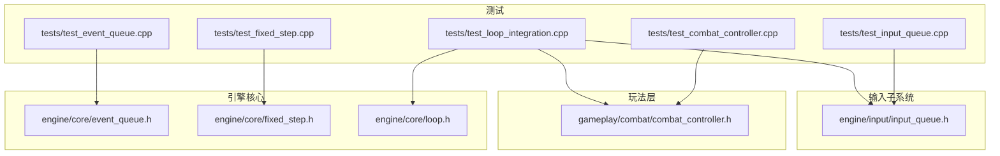
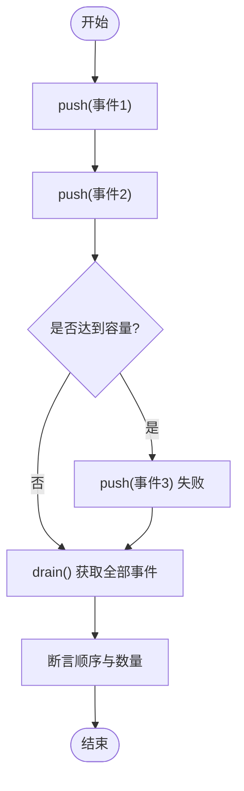
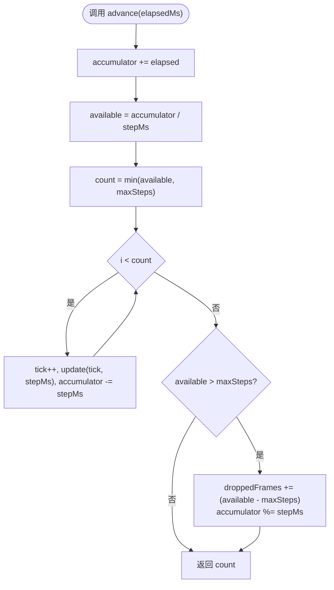
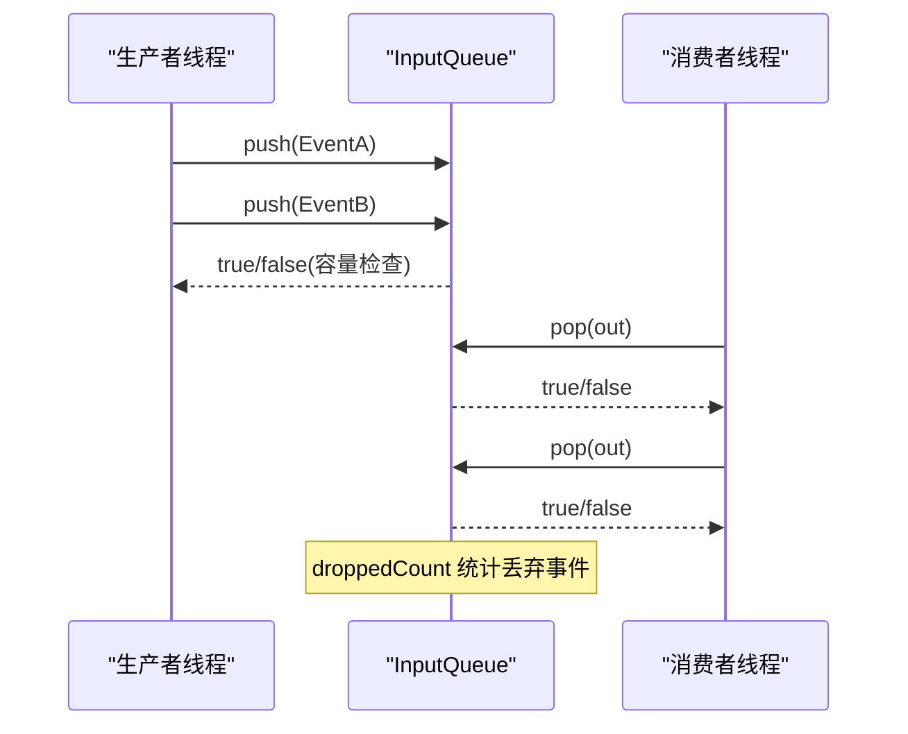
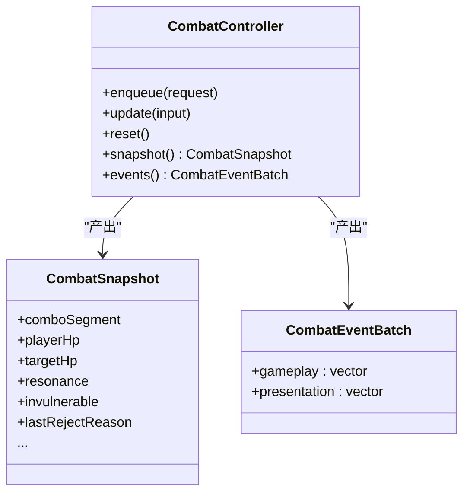
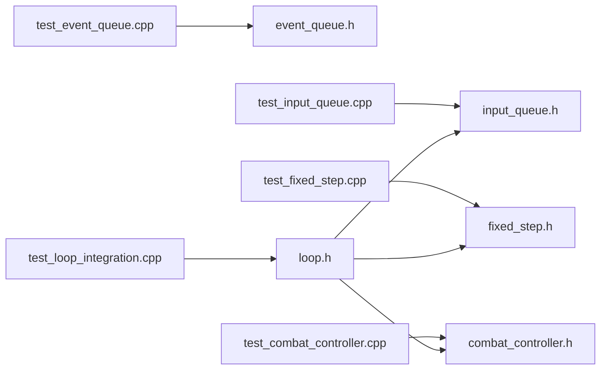

# 单元测试

<cite>
**本文引用的文件**   
- [test_event_queue.cpp](file://tests/test_event_queue.cpp)
- [event_queue.h](file://native/engine/core/event_queue.h)
- [test_fixed_step.cpp](file://tests/test_fixed_step.cpp)
- [fixed_step.h](file://native/engine/core/fixed_step.h)
- [test_combat_controller.cpp](file://tests/test_combat_controller.cpp)
- [combat_controller.h](file://native/gameplay/combat/combat_controller.h)
- [test_input_queue.cpp](file://tests/test_input_queue.cpp)
- [input_queue.h](file://native/engine/input/input_queue.h)
- [test_loop_integration.cpp](file://tests/test_loop_integration.cpp)
- [loop.h](file://native/engine/core/loop.h)
- [CMakeLists.txt](file://entry/src/main/cpp/CMakeLists.txt)
</cite>

## 目录
1. [简介](#简介)
2. [项目结构](#项目结构)
3. [核心组件](#核心组件)
4. [架构总览](#架构总览)
5. [详细组件分析](#详细组件分析)
6. [依赖分析](#依赖分析)
7. [性能考虑](#性能考虑)
8. [故障排查指南](#故障排查指南)
9. [结论](#结论)
10. [附录](#附录)

## 简介
本文件面向 my-world 项目的 C++ 单元测试，系统阐述测试框架使用方法与最佳实践，覆盖游戏引擎核心组件、渲染系统、输入处理等模块的测试编写。文档包含：
- 测试环境搭建与构建配置说明
- Mock 对象创建与测试数据准备方法
- 关键组件的断言使用、异常处理与并发安全验证
- 针对战斗控制器、固定时间步长、事件队列等核心逻辑的具体用例示例与流程解析
- 测试驱动开发（TDD）工作流与调试技巧
- 覆盖率统计建议与性能关注点

## 项目结构
my-world 的 C++ 代码位于 native 目录，测试用例集中在 tests 目录，通过 CMake 将核心库与测试源文件组织在一起。测试以独立 main() 入口形式运行，便于单测隔离与快速迭代。



图表来源
- [test_event_queue.cpp:1-20](file://tests/test_event_queue.cpp#L1-L20)
- [event_queue.h:1-31](file://native/engine/core/event_queue.h#L1-L31)
- [test_fixed_step.cpp:1-68](file://tests/test_fixed_step.cpp#L1-L68)
- [fixed_step.h:1-49](file://native/engine/core/fixed_step.h#L1-L49)
- [test_combat_controller.cpp:1-118](file://tests/test_combat_controller.cpp#L1-L118)
- [combat_controller.h:1-113](file://native/gameplay/combat/combat_controller.h#L1-L113)
- [test_input_queue.cpp:1-50](file://tests/test_input_queue.cpp#L1-L50)
- [input_queue.h:1-47](file://native/engine/input/input_queue.h#L1-L47)
- [test_loop_integration.cpp:1-380](file://tests/test_loop_integration.cpp#L1-L380)
- [loop.h:1-104](file://native/engine/core/loop.h#L1-L104)

章节来源
- [CMakeLists.txt:1-135](file://entry/src/main/cpp/CMakeLists.txt#L1-L135)

## 核心组件
本节聚焦测试中涉及的核心数据结构与算法，并给出复杂度与并发特性分析。

- 事件队列 EventQueue<T>
  - 功能：线程安全的有界事件缓冲，支持 push/drain
  - 复杂度：push O(1)，drain O(n)（n 为当前事件数）
  - 并发：内部互斥锁保护；适合生产者-消费者模型
  - 容量策略：满则丢弃新事件（返回 false）

- 输入队列 InputQueue
  - 功能：线程安全的输入事件 FIFO，支持 push/pop/clear
  - 复杂度：push O(1)，pop O(1)，clear O(1)
  - 并发：互斥锁保护；提供 droppedCount 统计丢包
  - 序列号：用于保证事件顺序一致性

- 固定时间步长 FixedStep
  - 功能：将任意 dtMs 累积并按固定步长推进 tick，限制每帧最大步数
  - 复杂度：advance O(k)，k 为实际执行步数
  - 溢出保护：droppedFrames 计数防溢出；accumulator 取模避免长期漂移
  - 断言：构造时校验 stepMs>0 与 maxSteps>=0

- 战斗控制器 CombatController
  - 功能：接收 ActionRequest，按帧更新状态机、伤害计算、反应系统，输出快照与事件批次
  - 复杂度：update 取决于动作状态机与伤害解析规模
  - 可观测性：snapshot/events 暴露运行时状态与事件

章节来源
- [event_queue.h:1-31](file://native/engine/core/event_queue.h#L1-L31)
- [input_queue.h:1-47](file://native/engine/input/input_queue.h#L1-L47)
- [fixed_step.h:1-49](file://native/engine/core/fixed_step.h#L1-L49)
- [combat_controller.h:1-113](file://native/gameplay/combat/combat_controller.h#L1-L113)

## 架构总览
下图展示测试如何驱动核心组件与子系统，体现从输入到固定步长更新、再到战斗控制与事件输出的完整链路。

```mermaid
sequenceDiagram
participant Test as "测试用例"
participant Loop as "Loop"
participant InputQ as "InputQueue"
participant Fixed as "FixedStep"
participant Combat as "CombatController"
participant Events as "EventBatch"
Test->>Loop : enqueueInput(...)
Loop->>InputQ : push(InputEvent)
Test->>Loop : updateFixed(tick, dtMs)
Loop->>Fixed : advance(elapsedMs, updateFn)
Fixed-->>Loop : count=执行步数
Loop->>Combat : update(frameInput)
Combat-->>Events : gameplay/presentation 事件
Loop-->>Test : snapshot()/combatEvents()
```

图表来源
- [test_loop_integration.cpp:1-380](file://tests/test_loop_integration.cpp#L1-L380)
- [loop.h:1-104](file://native/engine/core/loop.h#L1-L104)
- [input_queue.h:1-47](file://native/engine/input/input_queue.h#L1-L47)
- [fixed_step.h:1-49](file://native/engine/core/fixed_step.h#L1-L49)
- [combat_controller.h:1-113](file://native/gameplay/combat/combat_controller.h#L1-L113)

## 详细组件分析

### 事件队列 EventQueue 测试
- 目标：验证容量限制、事件顺序、drain 清空语义
- 关键点：
  - 容量不足时 push 返回 false
  - drain 返回并清空内部容器
  - 多类型模板实例化（GameplayEvent/PresentationEvent）



图表来源
- [test_event_queue.cpp:1-20](file://tests/test_event_queue.cpp#L1-L20)
- [event_queue.h:1-31](file://native/engine/core/event_queue.h#L1-L31)

章节来源
- [test_event_queue.cpp:1-20](file://tests/test_event_queue.cpp#L1-L20)
- [event_queue.h:1-31](file://native/engine/core/event_queue.h#L1-L31)

### 固定时间步长 FixedStep 测试
- 目标：验证步进累积、最大步数限制、负值/极大值边界、溢出保护
- 关键点：
  - advance 返回实际执行步数
  - tick 单调递增，dt 恒等于 stepMs
  - droppedFrames 统计被跳过的步数
  - 构造参数断言（stepMs>0, maxSteps>=0）



图表来源
- [test_fixed_step.cpp:1-68](file://tests/test_fixed_step.cpp#L1-L68)
- [fixed_step.h:1-49](file://native/engine/core/fixed_step.h#L1-L49)

章节来源
- [test_fixed_step.cpp:1-68](file://tests/test_fixed_step.cpp#L1-L68)
- [fixed_step.h:1-49](file://native/engine/core/fixed_step.h#L1-L49)

### 输入队列 InputQueue 测试
- 目标：验证容量、丢包计数、顺序出队、并发安全
- 关键点：
  - 满时 push 返回 false 且 droppedCount 增加
  - pop 严格遵循 FIFO
  - clear 立即清空
  - 多线程 producer/consumer 场景下 sequence 严格递增



图表来源
- [test_input_queue.cpp:1-50](file://tests/test_input_queue.cpp#L1-L50)
- [input_queue.h:1-47](file://native/engine/input/input_queue.h#L1-L47)

章节来源
- [test_input_queue.cpp:1-50](file://tests/test_input_queue.cpp#L1-L50)
- [input_queue.h:1-47](file://native/engine/input/input_queue.h#L1-L47)

### 战斗控制器 CombatController 测试
- 目标：验证动作入队、帧更新、连击段、资源变化、事件生成与拒绝原因
- 关键点：
  - enqueue(update) 组合模拟真实帧输入
  - snapshot 暴露 HP、连击段、冷却、共鸣等资源状态
  - events().gameplay 可用于断言特定事件发生次数与顺序
  - reset 恢复初始状态



图表来源
- [test_combat_controller.cpp:1-118](file://tests/test_combat_controller.cpp#L1-L118)
- [combat_controller.h:1-113](file://native/gameplay/combat/combat_controller.h#L1-L113)

章节来源
- [test_combat_controller.cpp:1-118](file://tests/test_combat_controller.cpp#L1-L118)
- [combat_controller.h:1-113](file://native/gameplay/combat/combat_controller.h#L1-L113)

### 循环集成 Loop 测试
- 目标：端到端验证输入处理、固定步长推进、战斗事件批处理、相机与粒子效果、遭遇战生命周期
- 关键点：
  - enqueueInput/processInput/updateFixed/tickOnce 协同工作
  - combatEvents() 返回帧内聚合的战斗事件
  - snapshot() 反映渲染就绪、移动状态、目标选择等
  - start()/stop() 控制循环生命周期

```mermaid
sequenceDiagram
participant Test as "测试"
participant Loop as "Loop"
participant Input as "InputQueue"
participant Fixed as "FixedStep"
participant Combat as "CombatController"
Test->>Loop : enqueueInput(...)
Test->>Loop : processInput()
Test->>Loop : updateFixed(tick, dtMs)
Loop->>Fixed : advance(dtMs, updateFn)
Fixed-->>Loop : count
Loop->>Combat : update(frameInput)
Combat-->>Loop : events
Loop-->>Test : snapshot()/combatEvents()
```

图表来源
- [test_loop_integration.cpp:1-380](file://tests/test_loop_integration.cpp#L1-L380)
- [loop.h:1-104](file://native/engine/core/loop.h#L1-L104)

章节来源
- [test_loop_integration.cpp:1-380](file://tests/test_loop_integration.cpp#L1-L380)
- [loop.h:1-104](file://native/engine/core/loop.h#L1-L104)

## 依赖分析
- 测试对头文件的直接依赖清晰，便于定位实现位置
- CMake 配置集中管理 include paths 与源文件集合，确保测试与源码路径一致
- 跨模块依赖（如 Loop 依赖 InputQueue/FixedStep/CombatController）在测试中被端到端验证



图表来源
- [CMakeLists.txt:1-135](file://entry/src/main/cpp/CMakeLists.txt#L1-L135)

章节来源
- [CMakeLists.txt:1-135](file://entry/src/main/cpp/CMakeLists.txt#L1-L135)

## 性能考虑
- 事件队列与输入队列采用互斥锁，避免竞争但存在锁开销；在高吞吐场景可考虑无锁队列或批量操作
- FixedStep 的 accumulate/min 计算为常数级，但在极端大 dtMs 时需关注 droppedFrames 溢出保护
- 战斗控制器的事件生成与状态更新应控制在每帧合理范围内，避免过多动态分配
- 测试中并发场景（多线程 push/pop）需确保内存可见性与顺序一致性

[本节为通用指导，不直接分析具体文件]

## 故障排查指南
- 断言失败定位：优先检查构造参数（如 FixedStep 的 stepMs/maxSteps），再检查容量限制（EventQueue/InputQueue）
- 并发问题：确认 push/pop 的互斥保护与 sequence 单调性；必要时添加日志或简化并发度
- 事件顺序：drain/pop 的顺序应与入队顺序一致；若出现乱序，检查多线程访问点
- 状态重置：CombatController.reset 后快照应回到初始值；未归零通常意味着遗漏清理逻辑
- 构建问题：核对 CMake include paths 与源文件列表，确保测试能正确链接所需头文件与实现

章节来源
- [test_fixed_step.cpp:1-68](file://tests/test_fixed_step.cpp#L1-L68)
- [test_event_queue.cpp:1-20](file://tests/test_event_queue.cpp#L1-L20)
- [test_input_queue.cpp:1-50](file://tests/test_input_queue.cpp#L1-L50)
- [test_combat_controller.cpp:1-118](file://tests/test_combat_controller.cpp#L1-L118)
- [CMakeLists.txt:1-135](file://entry/src/main/cpp/CMakeLists.txt#L1-L135)

## 结论
my-world 的 C++ 单元测试围绕核心数据结构与子系统展开，强调：
- 明确的接口契约与快照/事件输出
- 严格的容量与顺序约束
- 并发安全与边界条件覆盖
- 端到端集成验证（Loop）

遵循本文的最佳实践与流程，可有效提升代码质量与回归稳定性。

[本节为总结，不直接分析具体文件]

## 附录

### 测试环境搭建与构建
- 使用 CMake 管理 include paths 与源文件集合，确保测试与源码路径一致
- 编译选项启用 C++17，定义平台宏 OHOS_PLATFORM
- 链接必要的系统库（EGL/GLESv3/窗口/NAPI 等）

章节来源
- [CMakeLists.txt:1-135](file://entry/src/main/cpp/CMakeLists.txt#L1-L135)

### Mock 对象与测试数据准备
- 使用轻量结构体作为输入（如 CombatFrameInput、InputEvent）
- 通过默认配置（如 CombatConfig::defaults）初始化被测对象
- 利用固定 dtMs 与 tick 序列构造确定性场景

章节来源
- [combat_controller.h:1-113](file://native/gameplay/combat/combat_controller.h#L1-L113)
- [input_queue.h:1-47](file://native/engine/input/input_queue.h#L1-L47)

### 断言与异常处理
- 使用 assert 进行强断言，配合子进程 fork 验证崩溃信号（如 SIGABRT）
- 对非法构造参数进行断言校验
- 对容量限制与空队列行为进行显式断言

章节来源
- [test_fixed_step.cpp:1-68](file://tests/test_fixed_step.cpp#L1-L68)
- [test_event_queue.cpp:1-20](file://tests/test_event_queue.cpp#L1-L20)

### 测试覆盖率统计
- 建议使用 gcov/lcov 或编译器内置覆盖率工具收集分支与行覆盖率
- 针对关键路径（FixedStep.advance、InputQueue.push/pop、CombatController.update）重点覆盖
- 结合 CI 自动化生成覆盖率报告，设定阈值门禁

[本节为通用指导，不直接分析具体文件]

### 测试驱动开发（TDD）工作流
- 先写失败的测试用例，明确期望行为
- 最小实现以满足测试为目标
- 逐步重构并扩展用例，保持断言精确与可维护性

[本节为通用指导，不直接分析具体文件]

### 调试技巧
- 打印关键中间状态（如 tick、dtMs、droppedFrames、snapshot 字段）
- 简化并发场景（降低线程数、减少事件量）定位竞态
- 使用最小复现用例隔离问题

[本节为通用指导，不直接分析具体文件]