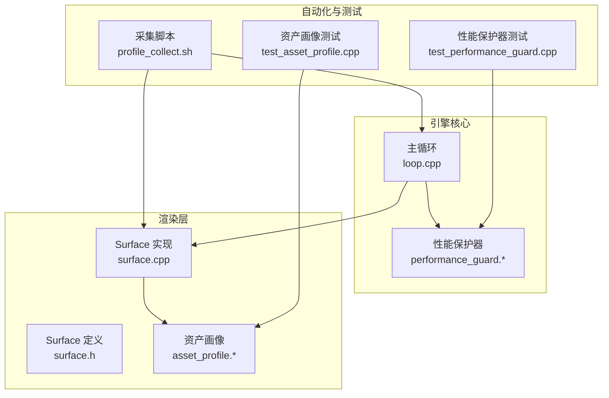
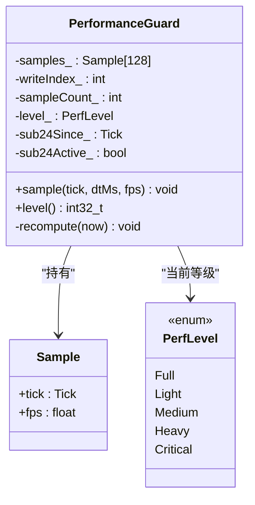
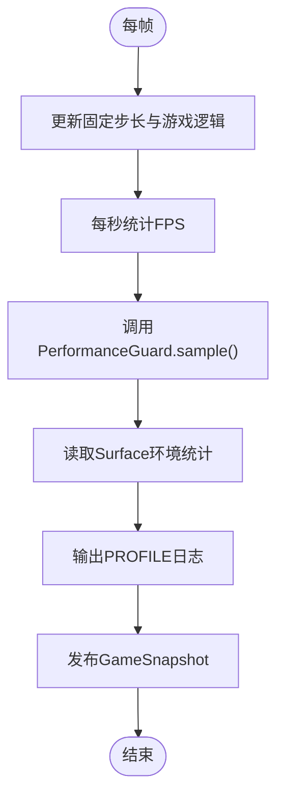
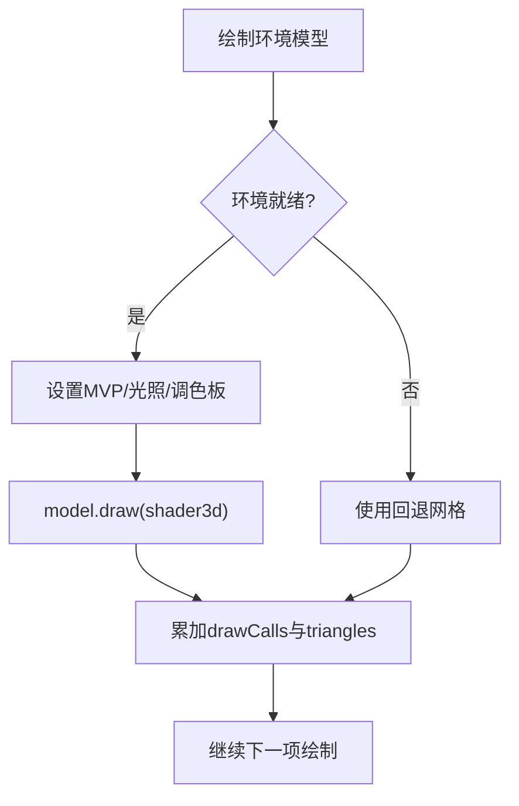
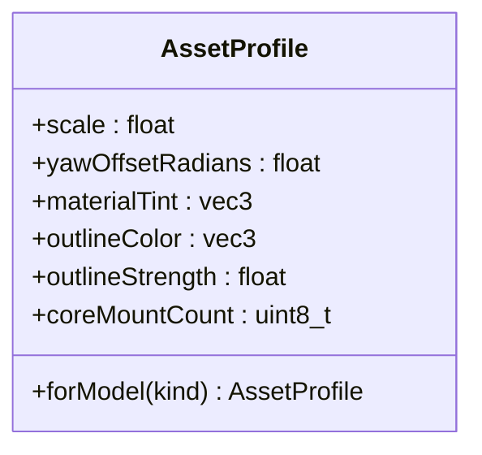
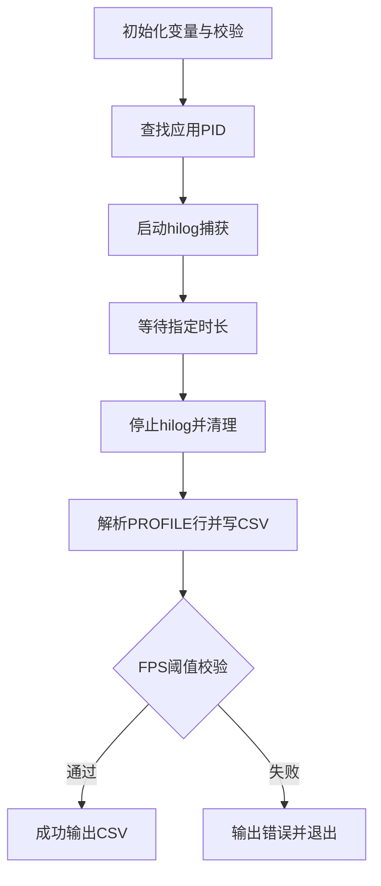
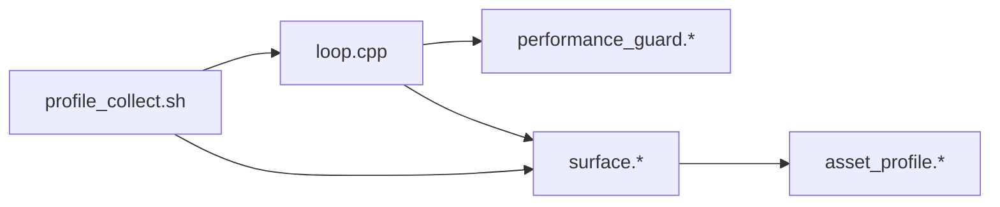

# 性能测试

<cite>
**本文引用的文件**   
- [performance_guard.h](file://native/engine/presentation/performance_guard.h)
- [performance_guard.cpp](file://native/engine/presentation/performance_guard.cpp)
- [loop.cpp](file://native/engine/core/loop.cpp)
- [surface.h](file://native/engine/render/surface.h)
- [surface.cpp](file://native/engine/render/surface.cpp)
- [asset_profile.h](file://native/engine/render/asset_profile.h)
- [asset_profile.cpp](file://native/engine/render/asset_profile.cpp)
- [profile_collect.sh](file://automation/perf/profile_collect.sh)
- [test_performance_guard.cpp](file://tests/test_performance_guard.cpp)
- [test_asset_profile.cpp](file://tests/test_asset_profile.cpp)
</cite>

## 目录
1. [简介](#简介)
2. [项目结构](#项目结构)
3. [核心组件](#核心组件)
4. [架构总览](#架构总览)
5. [详细组件分析](#详细组件分析)
6. [依赖关系分析](#依赖关系分析)
7. [性能考虑](#性能考虑)
8. [故障排查指南](#故障排查指南)
9. [结论](#结论)
10. [附录](#附录)

## 简介
本文件面向 my-world 项目的性能测试与监控，覆盖帧率监控、内存使用分析、GPU 性能分析、性能保护器配置与使用、资产性能分析工具集成，以及渲染、AI 计算与资源加载等典型场景的基准测试方法。文档同时给出数据收集、分析与报告生成流程，并提供优化建议与常见问题诊断方法，特别包含移动端（HarmonyOS）平台特定的调优技巧。

## 项目结构
与性能相关的代码主要分布在以下位置：
- 性能保护器：native/engine/presentation/performance_guard.*
- 主循环与性能日志输出：native/engine/core/loop.cpp
- 渲染层与统计指标：native/engine/render/surface.*
- 资产性能画像：native/engine/render/asset_profile.*
- 自动化采集脚本：automation/perf/profile_collect.sh
- 单元测试验证行为：tests/test_performance_guard.cpp, tests/test_asset_profile.cpp



**图表来源** 
- [loop.cpp:340-360](file://native/engine/core/loop.cpp#L340-L360)
- [performance_guard.h:1-45](file://native/engine/presentation/performance_guard.h#L1-L45)
- [performance_guard.cpp:1-69](file://native/engine/presentation/performance_guard.cpp#L1-L69)
- [surface.h:98-200](file://native/engine/render/surface.h#L98-L200)
- [surface.cpp:440-551](file://native/engine/render/surface.cpp#L440-L551)
- [asset_profile.h:1-19](file://native/engine/render/asset_profile.h#L1-L19)
- [asset_profile.cpp:1-17](file://native/engine/render/asset_profile.cpp#L1-L17)
- [profile_collect.sh:1-97](file://automation/perf/profile_collect.sh#L1-L97)
- [test_performance_guard.cpp:1-96](file://tests/test_performance_guard.cpp#L1-L96)
- [test_asset_profile.cpp:1-40](file://tests/test_asset_profile.cpp#L1-L40)

**章节来源**
- [loop.cpp:340-360](file://native/engine/core/loop.cpp#L340-L360)
- [surface.h:98-200](file://native/engine/render/surface.h#L98-L200)
- [surface.cpp:440-551](file://native/engine/render/surface.cpp#L440-L551)
- [asset_profile.h:1-19](file://native/engine/render/asset_profile.h#L1-L19)
- [asset_profile.cpp:1-17](file://native/engine/render/asset_profile.cpp#L1-L17)
- [profile_collect.sh:1-97](file://automation/perf/profile_collect.sh#L1-L97)

## 核心组件
- 性能保护器 PerformanceGuard：基于滑动窗口（约2秒）平均 FPS 判定性能等级，支持“持续低于阈值”进入严重级别，避免单帧抖动误判。
- 主循环 Loop：每秒统计一次 FPS，并输出结构化 PROFILE 日志，包含环境就绪、绘制调用数、三角形数量、纹理层级、遭遇模式等关键指标。
- 渲染层 Surface：维护环境绘制统计（draw calls、triangles）、纹理层级与环境准备状态，供上层日志与自动化脚本消费。
- 资产画像 AssetProfile：为不同模型类型提供缩放、材质着色、描边强度等参数，影响渲染质量与开销。
- 自动化采集脚本 profile_collect.sh：通过 hdc/hilog 抓取应用进程日志，解析 PROFILE 行，输出 CSV，并进行 FPS 阈值校验。

**章节来源**
- [performance_guard.h:1-45](file://native/engine/presentation/performance_guard.h#L1-L45)
- [performance_guard.cpp:1-69](file://native/engine/presentation/performance_guard.cpp#L1-L69)
- [loop.cpp:340-360](file://native/engine/core/loop.cpp#L340-L360)
- [surface.h:98-200](file://native/engine/render/surface.h#L98-L200)
- [asset_profile.h:1-19](file://native/engine/render/asset_profile.h#L1-L19)
- [asset_profile.cpp:1-17](file://native/engine/render/asset_profile.cpp#L1-L17)
- [profile_collect.sh:1-97](file://automation/perf/profile_collect.sh#L1-L97)

## 架构总览
下图展示性能监控在运行时的数据流：主循环每秒采样 FPS，写入性能保护器；渲染层累计绘制统计；日志以 PROFILE 格式输出；外部脚本抓取日志并生成 CSV 进行阈值校验。

```mermaid
sequenceDiagram
participant Loop as "主循环<br/>loop.cpp"
participant Guard as "性能保护器<br/>performance_guard.*"
participant Render as "渲染层<br/>surface.*"
participant Log as "系统日志<br/>hilog"
participant Script as "采集脚本<br/>profile_collect.sh"
Loop->>Loop : "每秒统计FPS"
Loop->>Guard : "sample(tick, dtMs, fps)"
Guard-->>Loop : "level()"
Loop->>Render : "读取environmentReady/drawCalls/triangles/tier"
Loop->>Log : "输出PROFILE行(含fps, perf_level, 环境指标)"
Script->>Log : "hilog 捕获日志"
Script->>Script : "解析PROFILE行并写入CSV"
Script-->>Script : "阈值校验(FPS<30或<24)"
```

**图表来源** 
- [loop.cpp:340-360](file://native/engine/core/loop.cpp#L340-L360)
- [performance_guard.cpp:18-69](file://native/engine/presentation/performance_guard.cpp#L18-L69)
- [surface.cpp:535-551](file://native/engine/render/surface.cpp#L535-L551)
- [profile_collect.sh:31-97](file://automation/perf/profile_collect.sh#L31-L97)

## 详细组件分析

### 性能保护器 PerformanceGuard
- 设计要点
  - 使用环形缓冲区保存最近约2秒内的 FPS 样本，容量固定，避免动态分配。
  - 根据滑动窗口平均值映射到性能等级：全质量、轻降、中降、重降、临界。
  - 对持续低于临界阈值（如24 FPS）的情况，需要超过窗口时长才进入“临界”，防止瞬时抖动触发降级。
- 复杂度
  - 每次 sample 后重新计算平均 FPS，时间复杂度 O(n)，n 为窗口内样本数（上限128），常数级开销。
- 错误处理与边界
  - 无样本时默认返回全质量等级。
  - 恢复路径从“重降”回到“全质量”，避免直接跳回最高等级导致不稳定。



**图表来源** 
- [performance_guard.h:1-45](file://native/engine/presentation/performance_guard.h#L1-L45)
- [performance_guard.cpp:1-69](file://native/engine/presentation/performance_guard.cpp#L1-L69)

**章节来源**
- [performance_guard.h:1-45](file://native/engine/presentation/performance_guard.h#L1-L45)
- [performance_guard.cpp:1-69](file://native/engine/presentation/performance_guard.cpp#L1-L69)
- [test_performance_guard.cpp:1-96](file://tests/test_performance_guard.cpp#L1-L96)

### 主循环与性能日志 Loop
- 功能
  - 每秒统计 FPS，调用性能保护器的 level() 获取当前性能等级。
  - 输出结构化 PROFILE 日志，包含 fps、perf_level、environment_ready、environment_draw_calls、environment_triangles、environment_texture_tier、encounter_mode。
  - 将上述指标写入 GameSnapshot，便于 UI 或其他子系统消费。
- 关键点
  - 日志频率控制：仅每秒输出一次，避免过多 I/O。
  - 指标来源：来自 Surface 的环境统计与性能保护器等级。



**图表来源** 
- [loop.cpp:340-360](file://native/engine/core/loop.cpp#L340-L360)
- [surface.h:98-200](file://native/engine/render/surface.h#L98-L200)

**章节来源**
- [loop.cpp:340-360](file://native/engine/core/loop.cpp#L340-L360)
- [surface.h:98-200](file://native/engine/render/surface.h#L98-L200)

### 渲染层 Surface 与统计
- 统计字段
  - environmentReady：环境资源是否就绪。
  - environmentDrawCalls：环境绘制调用计数。
  - environmentTriangles：环境三角形总数。
  - loggedEnvironmentTextureTier：当前纹理层级（用于性能分级）。
- 绘制路径
  - 环境模型绘制时累加 draw calls 与 triangles。
  - 失败回退路径记录错误信息，保持程序稳定。



**图表来源** 
- [surface.cpp:535-551](file://native/engine/render/surface.cpp#L535-L551)
- [surface.h:98-200](file://native/engine/render/surface.h#L98-L200)

**章节来源**
- [surface.cpp:535-551](file://native/engine/render/surface.cpp#L535-L551)
- [surface.h:98-200](file://native/engine/render/surface.h#L98-L200)

### 资产性能画像 AssetProfile
- 作用
  - 为 Player、Enemy、Boss 三类模型提供缩放、材质着色、描边强度等参数，影响渲染质量与开销。
  - 通过 forModel(kind) 快速生成对应画像，确保视觉角色区分与性能可控。
- 测试保障
  - 单元测试验证缩放比例、描边强度、材质着色差异等约束。



**图表来源** 
- [asset_profile.h:1-19](file://native/engine/render/asset_profile.h#L1-L19)
- [asset_profile.cpp:1-17](file://native/engine/render/asset_profile.cpp#L1-L17)

**章节来源**
- [asset_profile.h:1-19](file://native/engine/render/asset_profile.h#L1-L19)
- [asset_profile.cpp:1-17](file://native/engine/render/asset_profile.cpp#L1-L17)
- [test_asset_profile.cpp:1-40](file://tests/test_asset_profile.cpp#L1-L40)

### 自动化采集脚本 profile_collect.sh
- 功能
  - 通过 hdc 查找应用 PID，启动 hilog 捕获日志。
  - 解析 PROFILE 行，提取 fps、perf_level、environment_*、encounter_mode 等字段，输出 CSV。
  - 进行 FPS 阈值校验（普通阶段<30，Boss阶段<24），连续多秒低于阈值则失败。
- 使用方式
  - 环境变量：HDC_BIN、BUNDLE_NAME、PHASE、DURATION_SECONDS、OUTPUT_CSV。
  - 执行后检查退出码与 CSV 内容。



**图表来源** 
- [profile_collect.sh:1-97](file://automation/perf/profile_collect.sh#L1-L97)

**章节来源**
- [profile_collect.sh:1-97](file://automation/perf/profile_collect.sh#L1-L97)

## 依赖关系分析
- 主循环依赖性能保护器与渲染层统计，形成“计算-FPS-日志”链路。
- 渲染层依赖资产画像，影响绘制质量与开销。
- 自动化脚本依赖系统日志与 hdc，解析结构化日志进行质量门禁。



**图表来源** 
- [loop.cpp:340-360](file://native/engine/core/loop.cpp#L340-L360)
- [performance_guard.cpp:1-69](file://native/engine/presentation/performance_guard.cpp#L1-L69)
- [surface.cpp:535-551](file://native/engine/render/surface.cpp#L535-L551)
- [asset_profile.cpp:1-17](file://native/engine/render/asset_profile.cpp#L1-L17)
- [profile_collect.sh:1-97](file://automation/perf/profile_collect.sh#L1-L97)

**章节来源**
- [loop.cpp:340-360](file://native/engine/core/loop.cpp#L340-L360)
- [performance_guard.cpp:1-69](file://native/engine/presentation/performance_guard.cpp#L1-L69)
- [surface.cpp:535-551](file://native/engine/render/surface.cpp#L535-L551)
- [asset_profile.cpp:1-17](file://native/engine/render/asset_profile.cpp#L1-L17)
- [profile_collect.sh:1-97](file://automation/perf/profile_collect.sh#L1-L97)

## 性能考虑
- 帧率监控
  - 使用 PerformanceGuard 的滑动窗口平均 FPS 判定等级，避免单帧抖动影响。
  - 主循环每秒输出 PROFILE 日志，便于外部采集与分析。
- 内存使用分析
  - 渲染层使用固定容量环形缓冲与静态数组，减少动态分配。
  - 资产替换路径先释放旧 GPU 资源再创建新资源，避免泄漏。
- GPU 性能分析
  - 通过 environmentDrawCalls、environmentTriangles、loggedEnvironmentTextureTier 评估渲染压力。
  - 纹理层级可随性能等级调整，降低带宽与填充率压力。
- 资源加载性能
  - 异步批量加载模型与环境资源，使用 PendingModelAsset 队列，避免阻塞渲染线程。
  - 加载失败回退到静态 Mesh，保证稳定性。
- AI 计算性能
  - 感知系统与战斗控制器解耦，事件批处理与排序减少 CPU 抖动。
  - 可通过快照与事件计数（inputEventCount）辅助定位瓶颈。

[本节为通用指导，不直接分析具体文件]

## 故障排查指南
- 常见崩溃与异常信号
  - 脚本会检测 SIGSEGV、cppcrash、glGetString invalid、RequestBuffer fail、EGL error 等致命渲染签名，出现即告警。
- 日志不足或采集失败
  - 确认 hdc 路径与应用 PID 正确；确保 hilog 有权限捕获日志。
  - 若 PROFILE 样本不足，检查主循环 FPS 统计与日志输出是否正常。
- 性能等级未恢复
  - 检查 PerformanceGuard 的滑动窗口与临界阈值逻辑；确认 FPS 样本是否持续高于阈值。
- 渲染统计异常
  - 检查 environmentReady 与 textureTier 设置；确认 model.draw 路径是否被调用。

**章节来源**
- [profile_collect.sh:49-53](file://automation/perf/profile_collect.sh#L49-L53)
- [loop.cpp:340-360](file://native/engine/core/loop.cpp#L340-L360)
- [performance_guard.cpp:48-69](file://native/engine/presentation/performance_guard.cpp#L48-L69)
- [surface.cpp:535-551](file://native/engine/render/surface.cpp#L535-L551)

## 结论
my-world 的性能测试体系围绕 PerformanceGuard、主循环日志、渲染统计与自动化采集脚本构建，形成从数据采集到质量门禁的闭环。通过滑动窗口 FPS 判定、环境绘制统计与纹理层级控制，可在移动端平台上实现稳定的性能表现。结合单元测试与脚本校验，可有效保障渲染、AI 与资源加载的性能基线。

[本节为总结性内容，不直接分析具体文件]

## 附录
- 性能测试场景建议
  - 渲染性能：在不同纹理层级与模型数量下测量 environmentDrawCalls 与 triangles，观察 FPS 变化。
  - AI 计算性能：增加敌人数量与复杂决策路径，监控 inputEventCount 与 CPU 占用。
  - 资源加载性能：模拟大模型与环境资源批量加载，观察加载耗时与回退路径。
- 移动端优化建议
  - 降低纹理层级与阴影质量，减少 fill rate 压力。
  - 合并绘制批次，减少 draw calls。
  - 使用硬件加速路径（OpenGL ES），避免软件渲染。
  - 合理设置相机 FOV 与裁剪平面，减少过绘制。
- 平台特定技巧（HarmonyOS）
  - 使用 hdc/hilog 进行日志采集与崩溃检测。
  - 关注 NativeWindow 与 EGL 生命周期，避免上下文切换开销。
  - 利用 XComponent 与 N-API 桥接，确保输入与渲染线程分离。

[本节为通用指导，不直接分析具体文件]