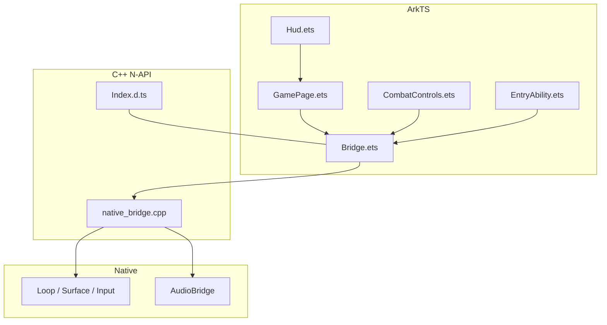
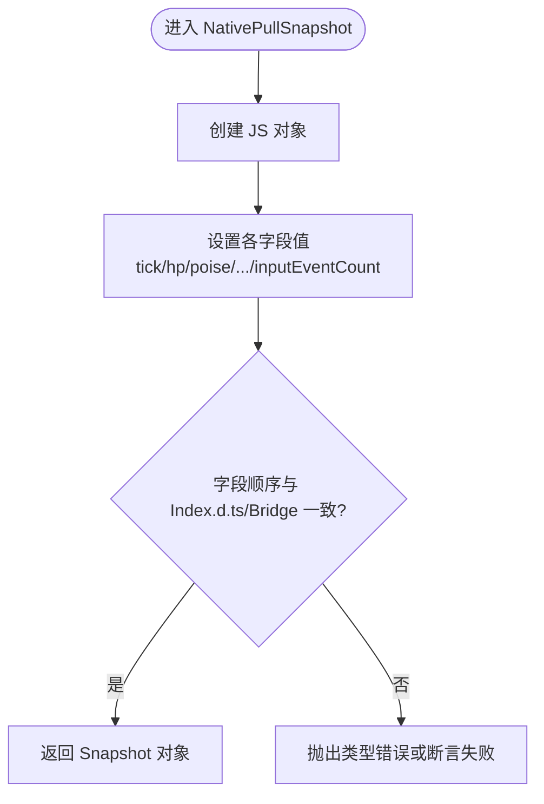
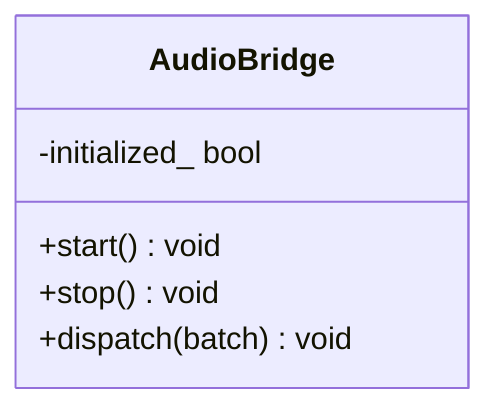
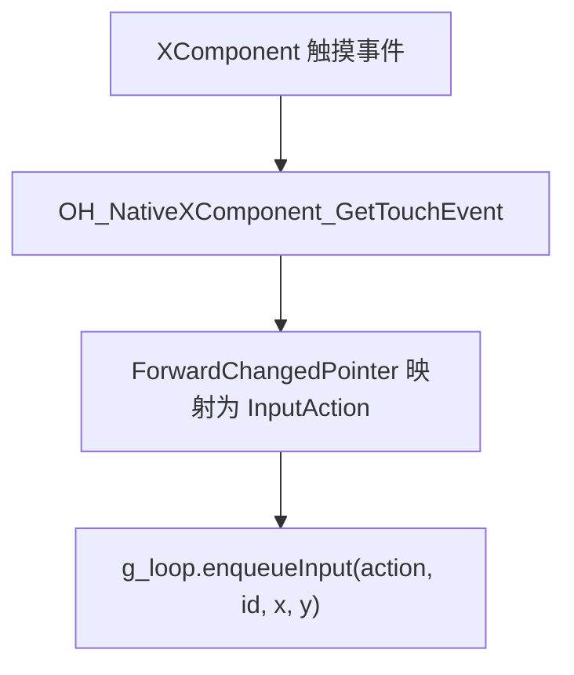
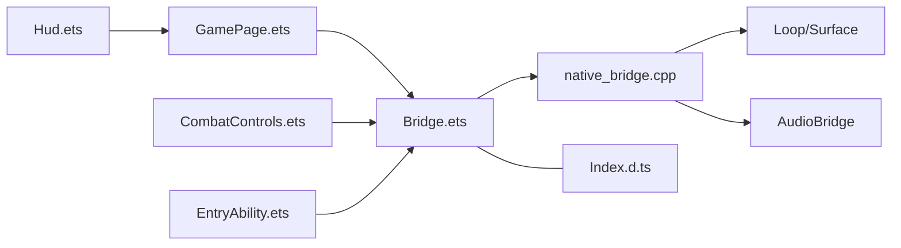

# 桥接测试

<cite>
**本文引用的文件**   
- [Bridge.ets](file://entry/src/main/ets/napi/Bridge.ets)
- [Index.d.ts](file://entry/src/main/cpp/types/libnative_game/Index.d.ts)
- [native_bridge.cpp](file://entry/src/main/cpp/native_bridge.cpp)
- [GamePage.ets](file://entry/src/main/ets/pages/GamePage.ets)
- [Hud.ets](file://entry/src/main/ets/ui/Hud.ets)
- [CombatControls.ets](file://entry/src/main/ets/ui/CombatControls.ets)
- [EntryAbility.ets](file://entry/src/main/ets/EntryAbility.ets)
- [audio_bridge.h](file://native/platform/harmony/audio_bridge.h)
- [audio_bridge.cpp](file://native/platform/harmony/audio_bridge.cpp)
- [test_bridge_contract.mjs](file://tests/test_bridge_contract.mjs)
- [test_audio_bridge.cpp](file://tests/test_audio_bridge.cpp)
</cite>

## 目录
1. [简介](#简介)
2. [项目结构](#项目结构)
3. [核心组件](#核心组件)
4. [架构总览](#架构总览)
5. [详细组件分析](#详细组件分析)
6. [依赖关系分析](#依赖关系分析)
7. [性能与兼容性测试](#性能与兼容性测试)
8. [故障排查指南](#故障排查指南)
9. [结论](#结论)
10. [附录：测试契约与用例清单](#附录测试契约与用例清单)

## 简介
本文件面向 my-world 项目的 NAPI 桥接层，系统性说明 JavaScript（ArkTS）与 C++ 之间的通信接口测试方法。重点覆盖：
- Bridge.ets 中的 NAPI 绑定测试
- 音频桥接（AudioBridge）的接口与行为验证
- 资产提交接口（模型与环境 GLB ArrayBuffer 批量注入）的契约与一致性校验
- 数据序列化/反序列化的断言策略
- 异步操作、错误处理与数据一致性的测试策略
- 桥接层的性能与兼容性测试方法

## 项目结构
NAPI 桥接相关的关键位置如下：
- ArkTS 侧暴露给 UI 的桥接入口：entry/src/main/ets/napi/Bridge.ets
- TypeScript 类型声明：entry/src/main/cpp/types/libnative_game/Index.d.ts
- C++ N-API 实现与生命周期回调：entry/src/main/cpp/native_bridge.cpp
- UI 页面与 HUD：entry/src/main/ets/pages/GamePage.ets, entry/src/main/ets/ui/Hud.ets
- 交互控件：entry/src/main/ets/ui/CombatControls.ets
- 应用生命周期：entry/src/main/ets/EntryAbility.ets
- 音频桥接：native/platform/harmony/audio_bridge.{h,cpp}
- 契约与一致性测试：tests/test_bridge_contract.mjs
- 音频桥接单元测试：tests/test_audio_bridge.cpp



图表来源 
- [Bridge.ets](file://entry/src/main/ets/napi/Bridge.ets)
- [native_bridge.cpp](file://entry/src/main/cpp/native_bridge.cpp)
- [Index.d.ts](file://entry/src/main/cpp/types/libnative_game/Index.d.ts)
- [GamePage.ets](file://entry/src/main/ets/pages/GamePage.ets)
- [Hud.ets](file://entry/src/main/ets/ui/Hud.ets)
- [CombatControls.ets](file://entry/src/main/ets/ui/CombatControls.ets)
- [EntryAbility.ets](file://entry/src/main/ets/EntryAbility.ets)
- [audio_bridge.h](file://native/platform/harmony/audio_bridge.h)

章节来源
- [Bridge.ets](file://entry/src/main/ets/napi/Bridge.ets)
- [native_bridge.cpp](file://entry/src/main/cpp/native_bridge.cpp)
- [Index.d.ts](file://entry/src/main/cpp/types/libnative_game/Index.d.ts)
- [GamePage.ets](file://entry/src/main/ets/pages/GamePage.ets)
- [Hud.ets](file://entry/src/main/ets/ui/Hud.ets)
- [CombatControls.ets](file://entry/src/main/ets/ui/CombatControls.ets)
- [EntryAbility.ets](file://entry/src/main/ets/EntryAbility.ets)
- [audio_bridge.h](file://native/platform/harmony/audio_bridge.h)

## 核心组件
- ArkTS 桥接入口（Bridge.ets）
  - 导出 nativeStart/nativeStop/nativeStartIfForeground
  - 导出 pushInput/pushAction/startEncounter/advanceLevel/useSupply/retryBoss/toggleDebugHud/skipDemoPhase/pullSnapshot
  - 定义 Snapshot 接口，作为 JS/C++ 数据契约的核心
- C++ N-API 实现（native_bridge.cpp）
  - 注册所有导出函数，完成参数校验、类型转换、调用 Loop/Surface
  - 将 GameSnapshot 序列化为 JS 对象字段，确保与 Index.d.ts 和 Bridge.ets 字段顺序一致
  - 通过 XComponent 回调管理渲染生命周期与输入事件分发
- 类型声明（Index.d.ts）
  - 严格定义 pullSnapshot 返回对象的字段集合，作为契约基准
- UI 层（GamePage/Hud/CombatControls）
  - 定时轮询 pullSnapshot，同步到 @State 驱动 UI
  - 按钮映射 pushAction/startEncounter 等控制命令
- 音频桥接（AudioBridge）
  - start/stop/dispatch 接口，按平台能力降级为无声音

章节来源
- [Bridge.ets](file://entry/src/main/ets/napi/Bridge.ets)
- [native_bridge.cpp](file://entry/src/main/cpp/native_bridge.cpp)
- [Index.d.ts](file://entry/src/main/cpp/types/libnative_game/Index.d.ts)
- [GamePage.ets](file://entry/src/main/ets/pages/GamePage.ets)
- [Hud.ets](file://entry/src/main/ets/ui/Hud.ets)
- [CombatControls.ets](file://entry/src/main/ets/ui/CombatControls.ets)
- [audio_bridge.h](file://native/platform/harmony/audio_bridge.h)

## 架构总览
下图展示从 ArkTS 到 C++ 的调用链与数据流，包括输入、状态快照与资源注入路径。

```mermaid
sequenceDiagram
participant UI as "ArkTS UI<br/>GamePage/Hud/Controls"
participant Bridge as "Bridge.ets"
participant NAPI as "native_bridge.cpp"
participant Loop as "Loop/Surface/Input"
participant Audio as "AudioBridge"
UI->>Bridge : 调用 pushAction/startEncounter/...
Bridge->>NAPI : 转发为 N-API 函数
NAPI->>Loop : 入队输入/启动遭遇/推进关卡/使用补给/重试首领
Note over NAPI,Loop : 参数校验与类型安全
UI->>Bridge : 定时 pullSnapshot()
Bridge->>NAPI : NativePullSnapshot
NAPI-->>UI : 返回 Snapshot 对象字段与 Index.d.ts 一致
UI->>Bridge : nativeSetModelAssets(...ArrayBuffer)
Bridge->>NAPI : NativeSetModelAssets
NAPI->>Loop : 原子批量注入模型资源
UI->>Bridge : nativeSetEnvironmentAssets(...ArrayBuffer)
Bridge->>NAPI : NativeSetEnvironmentAssets
NAPI->>Loop : 原子批量注入环境资源
Loop-->>Audio : dispatch(CombatEventBatch)
```

图表来源 
- [Bridge.ets](file://entry/src/main/ets/napi/Bridge.ets)
- [native_bridge.cpp](file://entry/src/main/cpp/native_bridge.cpp)
- [GamePage.ets](file://entry/src/main/ets/pages/GamePage.ets)
- [audio_bridge.h](file://native/platform/harmony/audio_bridge.h)

## 详细组件分析

### NAPI 桥接与 Snapshot 契约测试
- 契约一致性
  - Index.d.ts 中 pullSnapshot 返回字段集合必须与 Bridge.ets 的 Snapshot 接口字段顺序一致；native_bridge.cpp 中 NativePullSnapshot 导出的字段名顺序也必须一致。
  - 测试通过正则抽取并比较三处字段顺序，确保序列化/反序列化稳定。
- 字段完整性
  - 对关键业务字段（如 stamina、comboSegment、invulnerable、insightMs、resonance、targetHp、targetPoise、pulseHitRemainingMs、lastRejectReason、encounterMode、encounterState、objectiveLabel、resonanceSlots、showDebugHud、bossCinematicProgress、bossShardCount、bossSourceColor、bossRingBroken 等）进行存在性断言。
- 输入与动作
  - pushInput 要求对象包含 type/pointerId/x/y 且均为有限数值；pushAction 要求 0..5 的整数类型，映射到 Attack/Dodge/Radiance/Current/Corruption/Ultimate。
- 生命周期与前台请求
  - EntryAbility onForeground/onBackground 分别调用 nativeStart/nativeStop；native_bridge.cpp 维护 g_foregroundRequested 原子标志，OnSurfaceCreated/OnSurfaceChanged 仅在请求前台时启动循环。
- 资源注入
  - nativeSetModelAssets 接收三个 ArrayBuffer，内部 CopyAndCommitModelAssets 保证拷贝完成后一次性提交；nativeSetEnvironmentAssets 同理，四批环境资源原子提交。
- 调试与演示阶段
  - toggleDebugHud 切换 debugHud 字段；skipDemoPhase(phase) 限制 phase 在 0..6 范围。



图表来源 
- [native_bridge.cpp](file://entry/src/main/cpp/native_bridge.cpp)
- [Index.d.ts](file://entry/src/main/cpp/types/libnative_game/Index.d.ts)
- [Bridge.ets](file://entry/src/main/ets/napi/Bridge.ets)

章节来源
- [test_bridge_contract.mjs](file://tests/test_bridge_contract.mjs)
- [native_bridge.cpp](file://entry/src/main/cpp/native_bridge.cpp)
- [Index.d.ts](file://entry/src/main/cpp/types/libnative_game/Index.d.ts)
- [Bridge.ets](file://entry/src/main/ets/napi/Bridge.ets)

### 音频桥接（AudioBridge）测试
- 接口与行为
  - start/stop/dispatch 接口；在非 OHOS 平台或初始化失败时静默降级为 no-op。
  - dispatch 接受 CombatEventBatch，按 Gameplay/Presentation 事件类型映射占位音效（当前为 TODO）。
- 测试要点
  - 空批次不崩溃
  - 包含多种事件类型的批次不崩溃
  - 多次 start/stop/dispatch 不崩溃
  - 高频 dispatch 稳定性



图表来源 
- [audio_bridge.h](file://native/platform/harmony/audio_bridge.h)
- [audio_bridge.cpp](file://native/platform/harmony/audio_bridge.cpp)

章节来源
- [test_audio_bridge.cpp](file://tests/test_audio_bridge.cpp)
- [audio_bridge.h](file://native/platform/harmony/audio_bridge.h)
- [audio_bridge.cpp](file://native/platform/harmony/audio_bridge.cpp)

### 资产提交接口（模型与环境）
- 模型资产（nativeSetModelAssets）
  - 接收 player/enemy/boss 三个 ArrayBuffer
  - 使用 CopyAndCommitModelAssets 独立拷贝后一次性提交，避免部分更新导致的中间态
- 环境资产（nativeSetEnvironmentAssets）
  - 接收 outer/center/backdrop/decoration 四个 ArrayBuffer
  - 使用 CopyAndCommitEnvironmentAssets 原子提交
- UI 加载流程
  - GamePage 并发读取 rawfile 内容，成功后一次调用 nativeSetModelAssets/nativeSetEnvironmentAssets
  - 使用 generation 机制防止页面销毁后的异步回调覆盖旧状态
  - 最终仅当页面活跃且前台请求满足时调用 nativeStartIfForeground

```mermaid
sequenceDiagram
participant Page as "GamePage"
participant RM as "ResourceManager"
participant Bridge as "Bridge.ets"
participant NAPI as "native_bridge.cpp"
participant Loop as "Loop/Surface"
Page->>RM : getRawFileContent(models/*.glb)
RM-->>Page : Uint8Array[]
Page->>Bridge : nativeSetModelAssets(ArrayBuffer[])
Bridge->>NAPI : NativeSetModelAssets
NAPI->>Loop : withLifecycle(setModelAsset x3)
Page->>RM : getRawFileContent(environment/*.glb)
RM-->>Page : Uint8Array[]
Page->>Bridge : nativeSetEnvironmentAssets(ArrayBuffer[])
Bridge->>NAPI : NativeSetEnvironmentAssets
NAPI->>Loop : withLifecycle(setEnvironmentAsset x4)
Page->>Bridge : nativeStartIfForeground()
```

图表来源 
- [GamePage.ets](file://entry/src/main/ets/pages/GamePage.ets)
- [Bridge.ets](file://entry/src/main/ets/napi/Bridge.ets)
- [native_bridge.cpp](file://entry/src/main/cpp/native_bridge.cpp)

章节来源
- [test_bridge_contract.mjs](file://tests/test_bridge_contract.mjs)
- [GamePage.ets](file://entry/src/main/ets/pages/GamePage.ets)
- [native_bridge.cpp](file://entry/src/main/cpp/native_bridge.cpp)

### 输入与触摸事件
- 生产输入源
  - XComponent 的 OnDispatchTouchEvent 是唯一的生产输入源，直接读取 touchEvent.type/id/x/y 并通过 ForwardChangedPointer 转译为 InputAction 入队
- 测试约束
  - GamePage 不得注册 .onTouch 或调用 pushInput
  - native_bridge.cpp 的 OnDispatchTouchEvent 必须使用 OH_NativeXComponent_GetTouchEvent 获取事件，禁止误用 active-point 快照



图表来源 
- [native_bridge.cpp](file://entry/src/main/cpp/native_bridge.cpp)

章节来源
- [test_bridge_contract.mjs](file://tests/test_bridge_contract.mjs)
- [native_bridge.cpp](file://entry/src/main/cpp/native_bridge.cpp)

## 依赖关系分析
- ArkTS 依赖 C++ N-API 模块 libnative_game.so
- Bridge.ets 作为统一入口，屏蔽底层细节，向上提供稳定 API
- native_bridge.cpp 依赖 engine/core/loop.h 及 platform 相关头文件
- Index.d.ts 作为契约基线，被 Bridge.ets 与测试脚本共同引用



图表来源 
- [GamePage.ets](file://entry/src/main/ets/pages/GamePage.ets)
- [Bridge.ets](file://entry/src/main/ets/napi/Bridge.ets)
- [native_bridge.cpp](file://entry/src/main/cpp/native_bridge.cpp)
- [Index.d.ts](file://entry/src/main/cpp/types/libnative_game/Index.d.ts)
- [audio_bridge.h](file://native/platform/harmony/audio_bridge.h)

章节来源
- [Bridge.ets](file://entry/src/main/ets/napi/Bridge.ets)
- [native_bridge.cpp](file://entry/src/main/cpp/native_bridge.cpp)
- [Index.d.ts](file://entry/src/main/cpp/types/libnative_game/Index.d.ts)

## 性能与兼容性测试
- 性能测试建议
  - 拉取快照频率：以 100ms 间隔轮询 pullSnapshot，评估帧率与 UI 刷新开销
  - 资源注入吞吐：模拟大体积 GLB ArrayBuffer 注入，测量 CopyAndCommit 耗时与内存峰值
  - 输入队列压力：高频 pushAction/pushInput 压测，观察 Loop::enqueueInput 的延迟与丢包
  - 音频 dispatch 压力：高频 CombatEventBatch 投递，验证 AudioBridge 是否阻塞主循环
- 兼容性测试建议
  - 平台差异：非 OHOS 平台 AudioBridge 应静默降级；surface 不可用时需回退 UI 提示
  - 设备分辨率变化：OnSurfaceChanged 重绘路径需正确 resize，避免崩溃
  - 版本演进：Index.d.ts 字段增删需保持向后兼容，测试脚本需覆盖新增字段

[本节为通用指导，不直接分析具体文件]

## 故障排查指南
- 常见错误与定位
  - 参数类型错误：pushInput/pushAction/skipDemoPhase 等会抛出类型错误，检查 ArkTS 传入类型与范围
  - 资源注入失败：nativeSetModelAssets/nativeSetEnvironmentAssets 返回 false 时，检查 ArrayBuffer 内容与格式
  - 前台请求冲突：nativeStop 后再次启动需等待 surface ready，注意 g_foregroundRequested 标志
  - 触摸事件异常：确认 OnDispatchTouchEvent 使用正确的 API，避免误读 active-point 快照
- 日志与断点
  - native_bridge.cpp 中使用 LOGI/LOGE 输出关键路径
  - ArkTS 侧 console.error 记录资源加载失败

章节来源
- [native_bridge.cpp](file://entry/src/main/cpp/native_bridge.cpp)
- [GamePage.ets](file://entry/src/main/ets/pages/GamePage.ets)

## 结论
通过对 Bridge.ets、Index.d.ts 与 native_bridge.cpp 的契约一致性校验，结合 UI 层轮询与控件映射，可全面覆盖 NAPI 桥接的输入、状态与资源注入场景。音频桥接提供稳定的占位接口与降级策略。配合 test_bridge_contract.mjs 与 test_audio_bridge.cpp，可实现从契约到实现的端到端验证，并为性能与兼容性测试奠定基础。

[本节为总结，不直接分析具体文件]

## 附录：测试契约与用例清单
- 契约断言（来自 test_bridge_contract.mjs）
  - Bridge.ets 导出必要函数与 Snapshot 字段
  - Index.d.ts 声明 pullSnapshot 返回字段集合
  - native_bridge.cpp 导出字段顺序与 ArkTS 一致
  - GamePage 不注册 .onTouch 且不直接调用 pushInput
  - OnDispatchTouchEvent 使用 OH_NativeXComponent_GetTouchEvent
  - 按钮与 pushAction/startEncounter/advanceLevel/useSupply/retryBoss/toggleDebugHud/skipDemoPhase 的映射关系
  - 资源加载并发与 generation 机制的正确性
- 音频桥接用例（来自 test_audio_bridge.cpp）
  - 空批次、含事件批次、多次 start/stop/dispatch、高频 dispatch 均不崩溃

章节来源
- [test_bridge_contract.mjs](file://tests/test_bridge_contract.mjs)
- [test_audio_bridge.cpp](file://tests/test_audio_bridge.cpp)