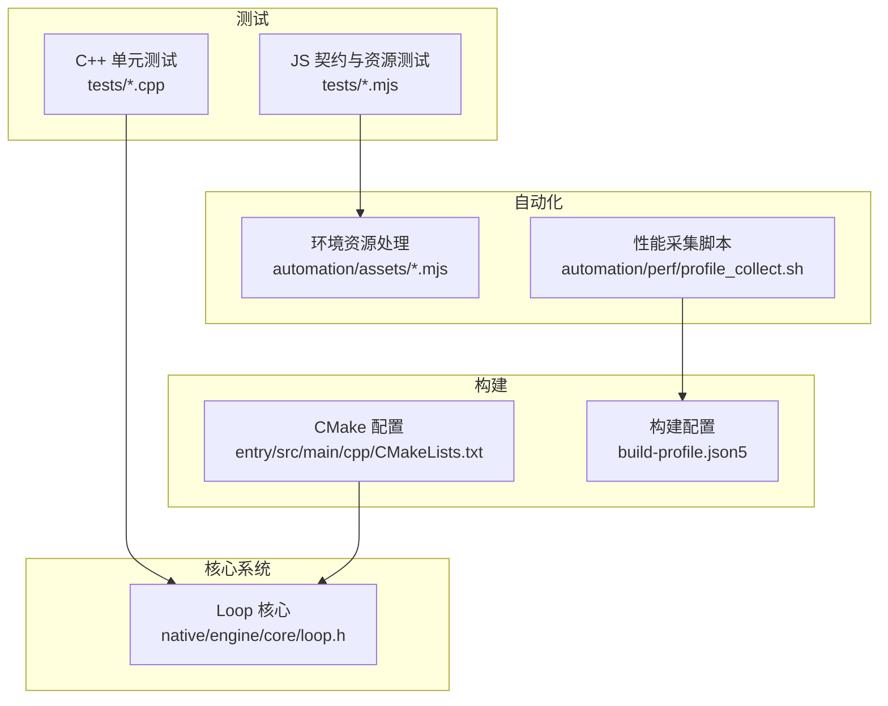
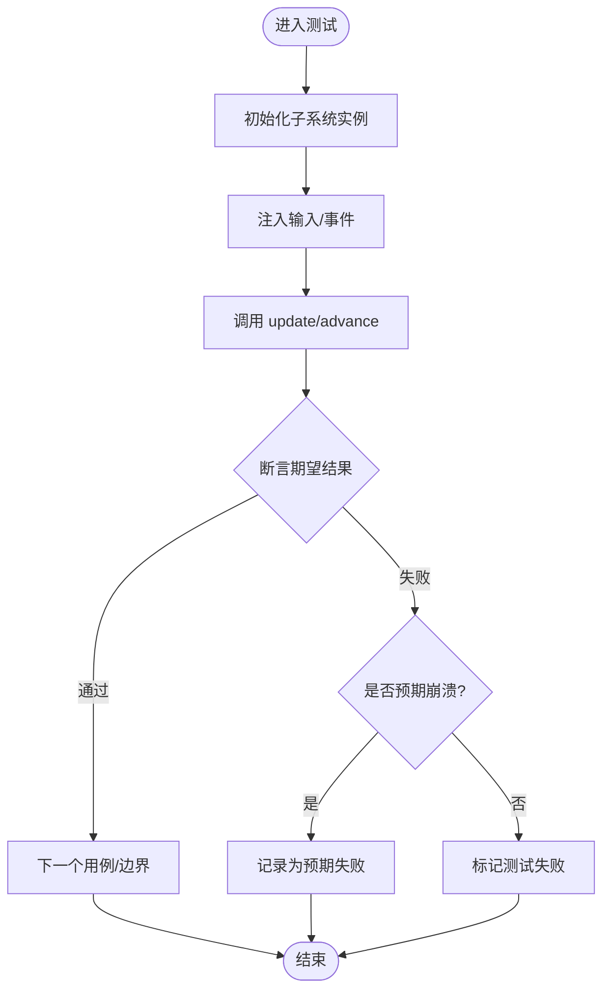
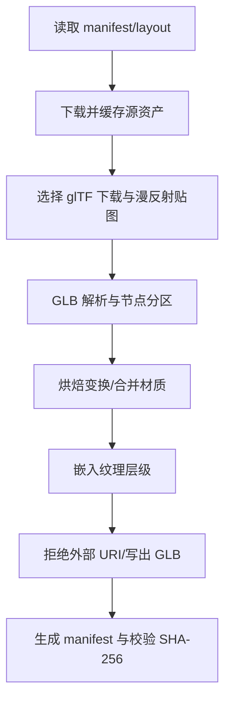
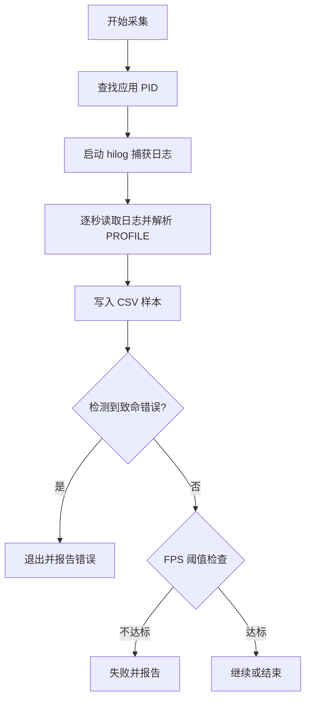
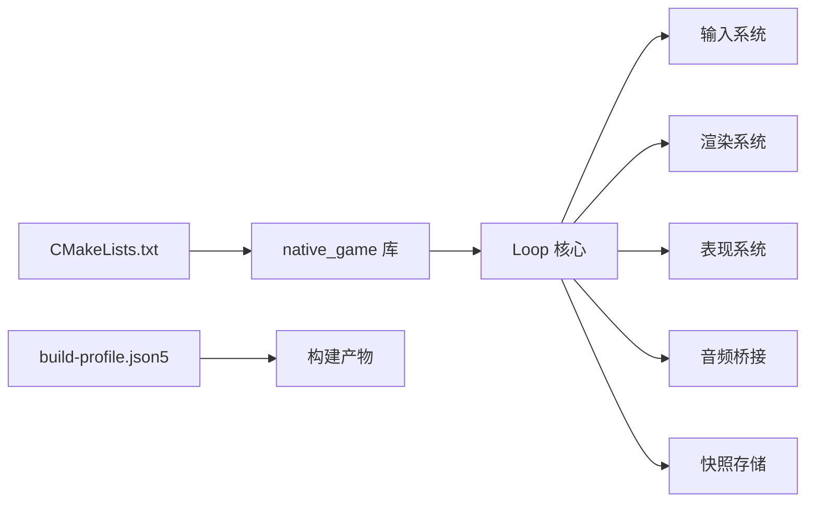

# 测试策略

<cite>
**本文引用的文件**   
- [tests/test_bridge_contract.mjs](file://tests/test_bridge_contract.mjs)
- [tests/test_environment_assets.mjs](file://tests/test_environment_assets.mjs)
- [automation/perf/profile_collect.sh](file://automation/perf/profile_collect.sh)
- [automation/assets/fetch_environment_assets.mjs](file://automation/assets/fetch_environment_assets.mjs)
- [automation/assets/validate_environment_assets.mjs](file://automation/assets/validate_environment_assets.mjs)
- [entry/src/main/cpp/CMakeLists.txt](file://entry/src/main/cpp/CMakeLists.txt)
- [build-profile.json5](file://build-profile.json5)
- [native/engine/core/loop.h](file://native/engine/core/loop.h)
- [tests/test_fixed_step.cpp](file://tests/test_fixed_step.cpp)
- [tests/test_event_queue.cpp](file://tests/test_event_queue.cpp)
- [tests/test_combat_controller.cpp](file://tests/test_combat_controller.cpp)
</cite>

## 目录
1. [简介](#简介)
2. [项目结构](#项目结构)
3. [核心组件](#核心组件)
4. [架构总览](#架构总览)
5. [详细组件分析](#详细组件分析)
6. [依赖关系分析](#依赖关系分析)
7. [性能考量](#性能考量)
8. [故障排查指南](#故障排查指南)
9. [结论](#结论)
10. [附录](#附录)

## 简介
本测试策略文档面向 my-world 项目的开发与质量保障团队，系统化阐述单元测试、集成测试与自动化测试流程。内容覆盖 C++ 单元测试编写方法、JavaScript 桥接契约测试、环境资源构建与校验脚本、移动端性能基准采集与分析、测试环境与数据准备、持续集成建议、移动端特殊考虑、性能基准测试以及测试驱动开发（TDD）与调试技巧。目标是让不同技术背景的读者都能理解并落地执行该项目的测试体系。

## 项目结构
my-world 的测试相关代码主要分布在以下区域：
- tests: C++ 单元测试与 JavaScript 契约/资源测试
- automation: 环境资源处理脚本与性能数据采集脚本
- entry/src/main/cpp: CMake 构建配置，定义原生库与测试可依赖的头文件路径
- build-profile.json5: HarmonyOS 应用构建配置，包含 ABI 过滤与编译器选项
- native/engine/core: 游戏循环、固定步长、事件队列等核心系统头文件，被大量测试引用



**图表来源**
- [entry/src/main/cpp/CMakeLists.txt:1-135](file://entry/src/main/cpp/CMakeLists.txt#L1-L135)
- [build-profile.json5:1-69](file://build-profile.json5#L1-L69)
- [native/engine/core/loop.h:1-104](file://native/engine/core/loop.h#L1-L104)

**章节来源**
- [entry/src/main/cpp/CMakeLists.txt:1-135](file://entry/src/main/cpp/CMakeLists.txt#L1-L135)
- [build-profile.json5:1-69](file://build-profile.json5#L1-L69)

## 核心组件
- C++ 单元测试框架与实践
  - 使用标准 assert 与 fork+waitpid 验证断言崩溃行为，确保关键前置条件与边界值触发预期失败。
  - 针对固定步长、事件队列、战斗控制器等子系统编写用例，覆盖正常路径、异常输入与极端数值场景。
- JavaScript 桥接契约测试
  - 通过读取 ArkTS/N-API 声明与实现，校验跨语言接口一致性、字段顺序、参数类型与返回值。
  - 校验 HUD 展示字段、按钮映射、生命周期控制与前台/后台状态管理。
- 环境资源处理与校验
  - 提供 glTF/GLB 解析、节点分区、纹理嵌入、材质合并与外部资源下载校验工具。
  - 生成 manifest.json 并校验源资产与派生资产的 SHA-256 一致性。
- 性能基准采集
  - 基于 hdc/hilog 抓取 PROFILE 日志，输出 CSV 指标，进行 FPS 阈值判定与致命错误检测。

**章节来源**
- [tests/test_fixed_step.cpp:1-68](file://tests/test_fixed_step.cpp#L1-L68)
- [tests/test_event_queue.cpp:1-20](file://tests/test_event_queue.cpp#L1-L20)
- [tests/test_combat_controller.cpp:1-118](file://tests/test_combat_controller.cpp#L1-L118)
- [tests/test_bridge_contract.mjs:1-415](file://tests/test_bridge_contract.mjs#L1-L415)
- [tests/test_environment_assets.mjs:1-171](file://tests/test_environment_assets.mjs#L1-L171)
- [automation/assets/fetch_environment_assets.mjs:1-812](file://automation/assets/fetch_environment_assets.mjs#L1-L812)
- [automation/assets/validate_environment_assets.mjs:1-80](file://automation/assets/validate_environment_assets.mjs#L1-L80)
- [automation/perf/profile_collect.sh:1-97](file://automation/perf/profile_collect.sh#L1-L97)

## 架构总览
下图展示了从 UI 到原生循环的数据流与测试切入点：ArkTS Bridge 暴露 N-API 函数，C++ Loop 负责输入、更新、渲染与快照发布；测试分别覆盖契约、资源与性能。

```mermaid
sequenceDiagram
participant UI as "ArkTS 页面/控件"
participant Bridge as "N-API Bridge"
participant Loop as "C++ Loop"
participant Render as "渲染系统"
participant Test as "测试套件"
UI->>Bridge : pushAction/startEncounter/advanceLevel/useSupply/retryBoss
Bridge->>Loop : enqueueInput/startEncounter/advanceLevel/useSupply/retryBoss
Loop->>Loop : processInput/updateFixed/tickOnce
Loop->>Render : 提交帧/绘制
Loop-->>UI : pullSnapshot(字段一致性与顺序)
Test->>Bridge : 契约校验(字段/类型/顺序)
Test->>Loop : 集成测试(输入/事件/快照)
Test->>Automation : 资源处理/校验
Test->>Perf : 性能采集(CSV/FPS阈值)
```

**图表来源**
- [tests/test_bridge_contract.mjs:1-415](file://tests/test_bridge_contract.mjs#L1-L415)
- [native/engine/core/loop.h:1-104](file://native/engine/core/loop.h#L1-L104)

## 详细组件分析

### C++ 单元测试框架与最佳实践
- 断言与崩溃验证
  - 使用 fork+waitpid 捕获子进程 SIGABRT，确保构造参数非法时立即失败。
  - 对固定步长、事件队列、战斗控制器等进行正向与反向用例设计。
- 典型用例
  - 固定步长：时间推进、丢帧计数、溢出保护、负数与极大值边界。
  - 事件队列：容量限制、序列号递增、多类型事件隔离。
  - 战斗控制器：连击段、脉冲窗口、伤害计算、目标有效性、重置状态。



**图表来源**
- [tests/test_fixed_step.cpp:1-68](file://tests/test_fixed_step.cpp#L1-L68)
- [tests/test_event_queue.cpp:1-20](file://tests/test_event_queue.cpp#L1-L20)
- [tests/test_combat_controller.cpp:1-118](file://tests/test_combat_controller.cpp#L1-L118)

**章节来源**
- [tests/test_fixed_step.cpp:1-68](file://tests/test_fixed_step.cpp#L1-L68)
- [tests/test_event_queue.cpp:1-20](file://tests/test_event_queue.cpp#L1-L20)
- [tests/test_combat_controller.cpp:1-118](file://tests/test_combat_controller.cpp#L1-L118)

### JavaScript 桥接契约测试
- 契约校验要点
  - 导出函数存在性、参数数量与类型、返回值类型。
  - Snapshot 字段在 ArkTS、Index.d.ts、NativePullSnapshot 中顺序与名称一致。
  - HUD 属性绑定与渲染逻辑约束（如精确窗口高亮、调试开关）。
  - 触摸事件仅由原生回调作为唯一生产源，禁止 ArkTS 层重复注册。
- 典型断言
  - 按钮标签与动作映射、阶段模式与 startEncounter 参数对应。
  - 前台/后台生命周期控制、surface 初始化失败回退。
  - ArrayBuffer 模型与环境资源批量注入的原子提交。

```mermaid
sequenceDiagram
participant Test as "契约测试"
participant ArkTS as "Bridge.ets/GamePage.ets/Hud.ets"
participant Dts as "Index.d.ts"
participant Native as "native_bridge.cpp"
participant Loop as "Loop"
Test->>ArkTS : 读取源码/声明
Test->>Dts : 读取类型声明
Test->>Native : 读取 N-API 实现
Test->>Test : 断言导出/参数/返回/字段顺序
Test->>Loop : 校验委托调用(startEncounter/advanceLevel/...)
Test-->>Test : 输出断言结果
```

**图表来源**
- [tests/test_bridge_contract.mjs:1-415](file://tests/test_bridge_contract.mjs#L1-L415)
- [native/engine/core/loop.h:1-104](file://native/engine/core/loop.h#L1-L104)

**章节来源**
- [tests/test_bridge_contract.mjs:1-415](file://tests/test_bridge_contract.mjs#L1-L415)

### 环境资源处理与校验
- 功能概览
  - 下载 Poly Haven 资源索引，选择分辨率与格式，解析 GLB/GLTF，节点分区与变换烘焙，材质合并，纹理层级嵌入。
  - 生成 manifest.json，记录源资产与派生资产元数据，校验 SHA-256 与排序。
- 测试覆盖
  - readGlb/writeGlb 往返一致性、分区布局合法性、纹理嵌入命名与 MIME 类型。
  - manifest 许可证、下载 URL、sourceFiles 完整性与去重、派生资产哈希匹配。



**图表来源**
- [automation/assets/fetch_environment_assets.mjs:1-812](file://automation/assets/fetch_environment_assets.mjs#L1-L812)
- [automation/assets/validate_environment_assets.mjs:1-80](file://automation/assets/validate_environment_assets.mjs#L1-L80)
- [tests/test_environment_assets.mjs:1-171](file://tests/test_environment_assets.mjs#L1-L171)

**章节来源**
- [automation/assets/fetch_environment_assets.mjs:1-812](file://automation/assets/fetch_environment_assets.mjs#L1-L812)
- [automation/assets/validate_environment_assets.mjs:1-80](file://automation/assets/validate_environment_assets.mjs#L1-L80)
- [tests/test_environment_assets.mjs:1-171](file://tests/test_environment_assets.mjs#L1-L171)

### 性能基准采集与分析
- 采集流程
  - 通过 hdc 获取应用 PID，启动 hilog 抓取日志，按秒采样 PROFILE 行，输出 CSV。
  - 检测致命渲染错误签名，统计 FPS、perf_level、环境就绪、绘制调用、三角面数、纹理等级、遭遇模式。
- 阈值判定
  - normal/boss 阶段设置不同 FPS 阈值，连续低于阈值超过两秒即失败。



**图表来源**
- [automation/perf/profile_collect.sh:1-97](file://automation/perf/profile_collect.sh#L1-L97)

**章节来源**
- [automation/perf/profile_collect.sh:1-97](file://automation/perf/profile_collect.sh#L1-L97)

## 依赖关系分析
- 构建与依赖
  - CMake 列出原生库源文件与 include 路径，链接 ACE NAPI/EGL/GLES/HiLog 等系统库。
  - build-profile 指定 ABI 过滤与编译器，便于在多平台运行测试与打包。
- 模块耦合
  - Loop 聚合输入、渲染、表现、音频、快照存储与生命周期，是测试集成的核心枢纽。
  - 契约测试将 ArkTS、TypeScript 声明与 N-API 实现强绑定，避免接口漂移。



**图表来源**
- [entry/src/main/cpp/CMakeLists.txt:1-135](file://entry/src/main/cpp/CMakeLists.txt#L1-L135)
- [build-profile.json5:1-69](file://build-profile.json5#L1-L69)
- [native/engine/core/loop.h:1-104](file://native/engine/core/loop.h#L1-L104)

**章节来源**
- [entry/src/main/cpp/CMakeLists.txt:1-135](file://entry/src/main/cpp/CMakeLists.txt#L1-L135)
- [build-profile.json5:1-69](file://build-profile.json5#L1-L69)
- [native/engine/core/loop.h:1-104](file://native/engine/core/loop.h#L1-L104)

## 性能考量
- 固定步长与丢帧
  - 固定步长确保确定性更新，丢帧计数用于评估卡顿与负载压力。
- 渲染与资源
  - 环境资源分批次加载与原子提交，避免中间态导致的渲染不一致。
  - 纹理层级（full/half）降低带宽与内存占用。
- 性能监控
  - 通过 PROFILE 日志采集 FPS、绘制调用、三角面数等指标，结合阈值判定快速定位瓶颈。

[本节为通用指导，不直接分析具体文件]

## 故障排查指南
- 契约不一致
  - 若 ArkTS/Bridge/Index.d.ts/Native 字段顺序或名称不一致，契约测试会失败。需同步修改并重新运行测试。
- 资源校验失败
  - manifest 许可证或 SHA-256 不匹配、sourceFiles 未排序或缺失，需重新生成或修正下载记录。
- 性能不达标
  - 检查 FPS 阈值、致命错误签名、设备负载与资源大小；必要时调整 vfxFlags 或纹理层级。
- 生命周期问题
  - 前台/后台切换导致 Loop 启动/停止异常，需确认 surface 就绪与 g_foregroundRequested 状态。

**章节来源**
- [tests/test_bridge_contract.mjs:1-415](file://tests/test_bridge_contract.mjs#L1-L415)
- [automation/assets/validate_environment_assets.mjs:1-80](file://automation/assets/validate_environment_assets.mjs#L1-L80)
- [automation/perf/profile_collect.sh:1-97](file://automation/perf/profile_collect.sh#L1-L97)

## 结论
my-world 的测试策略以契约测试保证跨语言接口稳定，以 C++ 单元测试覆盖核心逻辑与边界，以资源脚本确保资产一致性与可追溯性，以性能采集脚本量化运行时表现。通过 CMake 与构建配置的协同，测试可在多 ABI 环境下稳定执行。建议将上述测试与脚本纳入持续集成流水线，形成“开发-测试-发布”闭环，持续提升质量与效率。

[本节为总结，不直接分析具体文件]

## 附录

### 测试驱动开发（TDD）与调试技巧
- 先写失败的测试，再实现最小可用代码，逐步完善。
- 使用断言与子进程崩溃验证确保前置条件与异常路径。
- 对复杂逻辑拆分小单元，提高可测性与可维护性。
- 利用契约测试防止接口漂移，减少回归风险。

[本节为通用指导，不直接分析具体文件]

### 移动端测试特殊考虑
- 触摸输入统一由原生回调处理，避免 ArkTS 层重复注册导致语义冲突。
- 前台/后台生命周期影响 Loop 启动与渲染，需在测试中模拟切换。
- 资源加载采用并发与原子提交，确保页面活跃性与版本隔离。

**章节来源**
- [tests/test_bridge_contract.mjs:1-415](file://tests/test_bridge_contract.mjs#L1-L415)
- [native/engine/core/loop.h:1-104](file://native/engine/core/loop.h#L1-L104)

### 持续集成配置建议
- 在 CI 中安装 hdc/hilog，配置环境变量 HDC_BIN、BUNDLE_NAME、PHASE、DURATION_SECONDS、OUTPUT_CSV。
- 并行执行 C++ 单元测试与 JS 契约/资源测试，最后运行性能采集脚本。
- 收集 CSV 与测试报告，设置阈值告警与失败阻断。

[本节为通用指导，不直接分析具体文件]