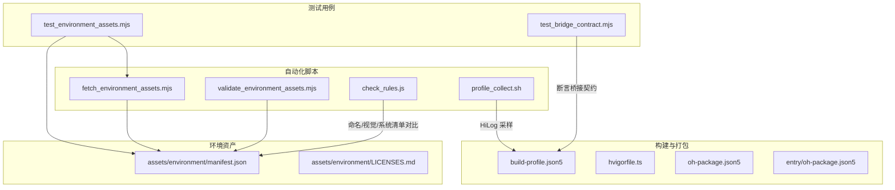
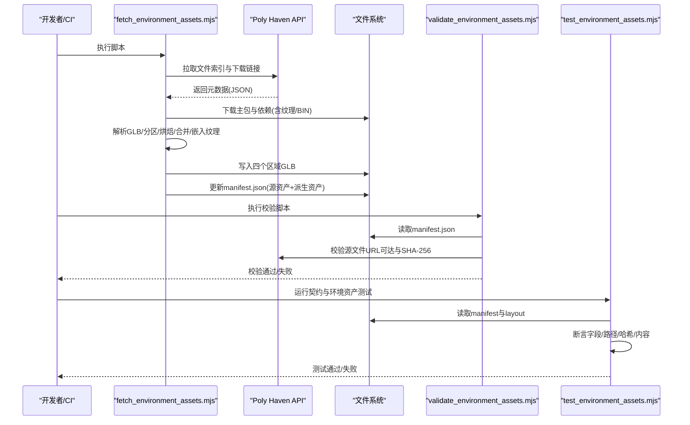
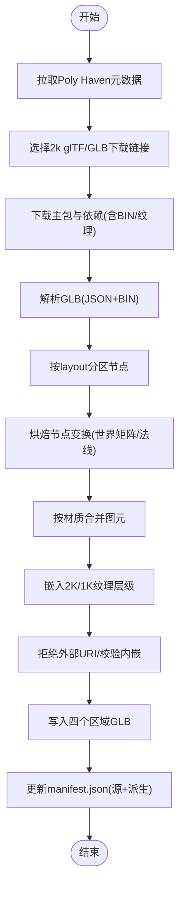
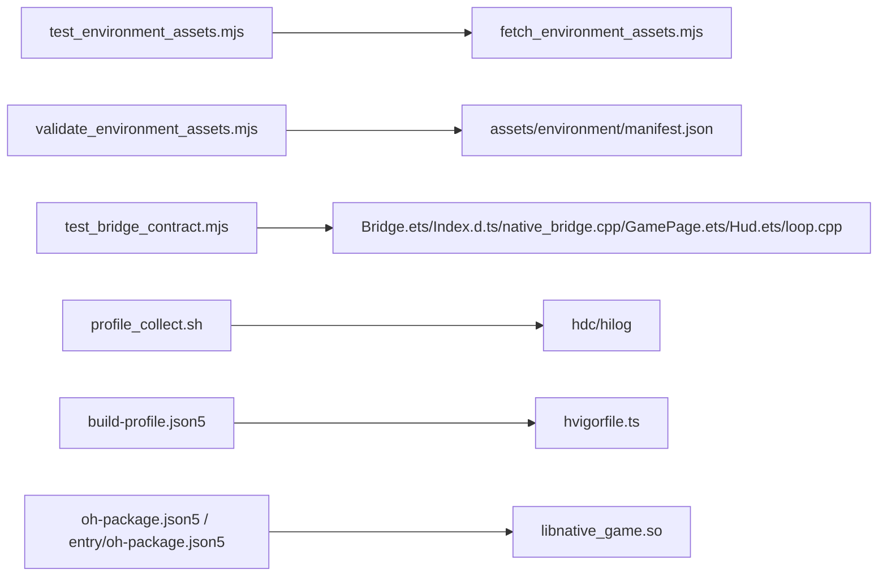

# 测试自动化

<cite>
**本文引用的文件**   
- [automation/assets/fetch_environment_assets.mjs](file://automation/assets/fetch_environment_assets.mjs)
- [automation/assets/validate_environment_assets.mjs](file://automation/assets/validate_environment_assets.mjs)
- [tests/test_environment_assets.mjs](file://tests/test_environment_assets.mjs)
- [tests/test_bridge_contract.mjs](file://tests/test_bridge_contract.mjs)
- [assets/environment/manifest.json](file://assets/environment/manifest.json)
- [assets/environment/LICENSES.md](file://assets/environment/LICENSES.md)
- [automation/hvigor/check_rules.js](file://automation/hvigor/check_rules.js)
- [automation/perf/profile_collect.sh](file://automation/perf/profile_collect.sh)
- [build-profile.json5](file://build-profile.json5)
- [hvigorfile.ts](file://hvigorfile.ts)
- [oh-package.json5](file://oh-package.json5)
- [entry/oh-package.json5](file://entry/oh-package.json5)
</cite>

## 目录
1. [简介](#简介)
2. [项目结构](#项目结构)
3. [核心组件](#核心组件)
4. [架构总览](#架构总览)
5. [详细组件分析](#详细组件分析)
6. [依赖分析](#依赖分析)
7. [性能考量](#性能考量)
8. [故障排除指南](#故障排除指南)
9. [结论](#结论)
10. [附录](#附录)

## 简介
本文件面向 my-world 项目的测试自动化，系统化说明：
- 自动化测试脚本的编写与执行流程
- 环境资产获取、验证与代码检查规则的配置
- 持续集成流水线的设置（自动化测试执行、结果收集与报告生成）
- 使用 Node.js 脚本进行资产管理与质量检查的具体示例
- 测试环境的自动部署、数据准备与清理流程
- 最佳实践与常见问题排查方法

## 项目结构
my-world 的测试自动化主要分布在以下目录与文件：
- automation/assets：环境资产下载与处理脚本、校验脚本
- tests：Node 契约测试与 C++ 单元测试（C++ 测试由外部构建系统驱动）
- assets/environment：环境资产的清单与许可证说明
- automation/hvigor：HVIGOR 自定义检查规则入口
- automation/perf：性能采集脚本
- 根级构建配置：build-profile.json5、hvigorfile.ts、包管理配置 oh-package.json5 与 entry/oh-package.json5

图表来源
- [automation/assets/fetch_environment_assets.mjs:1-800](file://automation/assets/fetch_environment_assets.mjs#L1-L800)
- [automation/assets/validate_environment_assets.mjs:1-80](file://automation/assets/validate_environment_assets.mjs#L1-L80)
- [tests/test_environment_assets.mjs:1-171](file://tests/test_environment_assets.mjs#L1-L171)
- [tests/test_bridge_contract.mjs:1-415](file://tests/test_bridge_contract.mjs#L1-L415)
- [assets/environment/manifest.json:1-163](file://assets/environment/manifest.json#L1-L163)
- [assets/environment/LICENSES.md:1-27](file://assets/environment/LICENSES.md#L1-L27)
- [automation/hvigor/check_rules.js:1-3](file://automation/hvigor/check_rules.js#L1-L3)
- [automation/perf/profile_collect.sh:1-97](file://automation/perf/profile_collect.sh#L1-L97)
- [build-profile.json5:1-57](file://build-profile.json5#L1-L57)
- [hvigorfile.ts:1-7](file://hvigorfile.ts#L1-L7)
- [oh-package.json5:1-10](file://oh-package.json5#L1-L10)
- [entry/oh-package.json5:1-12](file://entry/oh-package.json5#L1-L12)

章节来源
- [build-profile.json5:1-57](file://build-profile.json5#L1-L57)
- [hvigorfile.ts:1-7](file://hvigorfile.ts#L1-L7)
- [oh-package.json5:1-10](file://oh-package.json5#L1-L10)
- [entry/oh-package.json5:1-12](file://entry/oh-package.json5#L1-L12)

## 核心组件
- 环境资产获取与处理脚本（Node.js）
  - 从 Poly Haven API 拉取元数据，选择 glTF/GLB 下载链接，递归下载主包与依赖，解析 GLB 二进制，按布局分区、烘焙节点变换、合并同材质图元、嵌入纹理层级、输出最终 GLB 并生成 manifest 派生项。
- 环境资产校验脚本（Node.js）
  - 校验 manifest 许可声明、SHA-256 完整性、sourceFiles 排序与覆盖范围、远程资源可访问性与哈希一致性、派生产物 SHA-256 一致性。
- 契约测试（Node.js）
  - 断言 Bridge、Index.d.ts、Native 实现、ArkTS 页面/HUD/控件之间的接口契约一致，确保快照字段、输入事件、生命周期控制等跨层契约稳定。
- 性能采集（Shell）
  - 通过 hdc + hilog 采集应用运行时的 FPS、绘制调用、三角面数、纹理等级等指标，输出 CSV 并进行阈值判定。
- HVIGOR 检查规则（JS）
  - 扫描配置与资产命名，标记与参考作品专有称呼重叠的条目，辅助原创性评审。

章节来源
- [automation/assets/fetch_environment_assets.mjs:1-800](file://automation/assets/fetch_environment_assets.mjs#L1-L800)
- [automation/assets/validate_environment_assets.mjs:1-80](file://automation/assets/validate_environment_assets.mjs#L1-L80)
- [tests/test_environment_assets.mjs:1-171](file://tests/test_environment_assets.mjs#L1-L171)
- [tests/test_bridge_contract.mjs:1-415](file://tests/test_bridge_contract.mjs#L1-L415)
- [automation/perf/profile_collect.sh:1-97](file://automation/perf/profile_collect.sh#L1-L97)
- [automation/hvigor/check_rules.js:1-3](file://automation/hvigor/check_rules.js#L1-L3)

## 架构总览
下图展示“环境资产流水线”的整体交互：从元数据拉取到最终 GLB 产出与清单更新，再到校验与测试验证。

图表来源
- [automation/assets/fetch_environment_assets.mjs:1-800](file://automation/assets/fetch_environment_assets.mjs#L1-L800)
- [automation/assets/validate_environment_assets.mjs:1-80](file://automation/assets/validate_environment_assets.mjs#L1-L80)
- [tests/test_environment_assets.mjs:1-171](file://tests/test_environment_assets.mjs#L1-L171)
- [assets/environment/manifest.json:1-163](file://assets/environment/manifest.json#L1-L163)

## 详细组件分析

### 环境资产获取与处理（fetch_environment_assets.mjs）
- 功能要点
  - 从 Poly Haven API 获取文件索引，选择 2k 分辨率的 glTF/GLB 下载链接
  - 递归下载主包与 include 依赖，记录每个文件的 URL、下载时间与 SHA-256
  - 解析 GLB 二进制，支持 JSON 与 BIN 分块、访问器解码、顶点属性与索引重建
  - 根据 layout.json 将节点分区为 outerRing/centerRift/backdrop/decoration
  - 烘焙节点变换（世界矩阵、法线变换），合并同材质图元以减少 draw call
  - 嵌入 2K/1K 漫反射纹理层级，统一材质与采样器，输出合规 GLB
  - 拒绝外部 URI，确保所有缓冲与图片内嵌
  - 生成或更新 assets/environment/manifest.json，包含 sourceAssets 与 derivedAssets
- 复杂度与性能
  - GLB 解析与重建为线性于顶点与图元数量；纹理重采样依赖 sips 工具
  - 并行下载与 Promise.all 提升吞吐
- 错误处理
  - 对非法 GLB、未知区域、重复 ID、不安全路径、缺失依赖、外部 URI 等进行明确报错
- 关键函数与导出
  - chooseGltfDownload、chooseDiffuseDependency、readGlb、writeGlb、partitionNodes、bakeNodeTransforms、mergePrimitivesByMaterial、embedTextureLevels、sha256

图表来源
- [automation/assets/fetch_environment_assets.mjs:1-800](file://automation/assets/fetch_environment_assets.mjs#L1-L800)

章节来源
- [automation/assets/fetch_environment_assets.mjs:1-800](file://automation/assets/fetch_environment_assets.mjs#L1-L800)

### 环境资产校验（validate_environment_assets.mjs）
- 校验目标
  - manifest 许可与许可地址必须为 CC0-1.0 与指定 URL
  - 所有 sourceAssets 与 derivedAssets 的 sha256 格式正确
  - sourceFiles 列表非空、无重复、路径安全、按路径排序
  - 与 Poly Haven API 元数据比对，确认下载记录存在且覆盖完整
  - 随机抽取源文件进行在线校验（HTTP 可达性与 SHA-256 一致）
  - 派生产物本地 SHA-256 与 manifest 一致
- 典型失败原因
  - 源文件路径未排序或不安全
  - 源文件 SHA-256 不匹配或网络不可达
  - 派生产物被修改导致哈希不一致

章节来源
- [automation/assets/validate_environment_assets.mjs:1-80](file://automation/assets/validate_environment_assets.mjs#L1-L80)
- [assets/environment/manifest.json:1-163](file://assets/environment/manifest.json#L1-L163)

### 环境资产测试（test_environment_assets.mjs）
- 测试范围
  - 导入 fetch_environment_assets.mjs 的导出函数，进行单元级断言（如 GLB 读写、分区、烘焙、合并、纹理嵌入）
  - 校验 manifest.json 的许可、作者、URL、日期、sourceFiles 排序与覆盖范围
  - 在线拉取 Poly Haven 元数据，校验 downloadUrl 与 include 列表一致性
  - 校验派生 GLB 文件头与大小、SHA-256 与 manifest 一致
- 设计要点
  - 使用 assert/strict 进行严格断言
  - 并发请求与 Promise.all 提升效率
  - 对 layout.json 中的特定放置进行业务断言（如 outerRing 的柱体）

章节来源
- [tests/test_environment_assets.mjs:1-171](file://tests/test_environment_assets.mjs#L1-L171)
- [assets/environment/manifest.json:1-163](file://assets/environment/manifest.json#L1-L163)

### 桥接契约测试（test_bridge_contract.mjs）
- 断言范围
  - ArkTS Bridge、C++ N-API 导出、TypeScript 类型声明 Index.d.ts、GamePage/Hud/CombatControls 的字段与行为一致性
  - pushAction/startEncounter/advanceLevel/useSupply/retryBoss/toggleDebugHud/skipDemoPhase/nativeSetModelAssets/nativeSetEnvironmentAssets 等导出与参数校验
  - 触摸事件回调、生命周期控制（前台/后台）、快照字段映射
- 价值
  - 防止跨语言/跨层契约漂移，保障 UI 与 Native 的数据流稳定

章节来源
- [tests/test_bridge_contract.mjs:1-415](file://tests/test_bridge_contract.mjs#L1-L415)

### 性能采集（profile_collect.sh）
- 功能
  - 通过 hdc 查找进程 PID，启动 hilog 抓取日志
  - 解析 PROFILE 行，提取 fps、perf_level、environment_ready/draw_calls/triangles/texture_tier、encounter_mode
  - 输出 CSV，统计样本量，进行 FPS 阈值判定（normal/boss 不同阈值）
  - 检测致命渲染错误（SIGSEGV、EGL error 等）
- 适用场景
  - CI 中真机或模拟器性能回归检测

章节来源
- [automation/perf/profile_collect.sh:1-97](file://automation/perf/profile_collect.sh#L1-L97)

### HVIGOR 检查规则（check_rules.js）
- 作用
  - 扫描 config/ 与 assets/ 名称，标记与参考作品专有称呼重叠的条目，输出评审记录
- 扩展点
  - 可在 HVIGOR 插件中接入更严格的命名/视觉/系统清单对比逻辑

章节来源
- [automation/hvigor/check_rules.js:1-3](file://automation/hvigor/check_rules.js#L1-L3)

## 依赖分析
- 模块耦合
  - test_environment_assets.mjs 强依赖 fetch_environment_assets.mjs 的导出函数
  - validate_environment_assets.mjs 依赖 assets/environment/manifest.json 的结构与内容
  - test_bridge_contract.mjs 依赖多份源码（Bridge.ets、Index.d.ts、native_bridge.cpp、GamePage.ets、Hud.ets、loop.cpp）
- 外部依赖
  - Poly Haven API（元数据与资源下载）
  - macOS sips 工具（纹理重采样）
  - hdc/hilog（性能采集）
- 构建与打包
  - build-profile.json5 定义产品、SDK 版本、ABI 过滤、编译器选项
  - hvigorfile.ts 启用 appTasks
  - oh-package.json5 与 entry/oh-package.json5 声明模块与本地库依赖

图表来源
- [tests/test_environment_assets.mjs:1-171](file://tests/test_environment_assets.mjs#L1-L171)
- [automation/assets/fetch_environment_assets.mjs:1-800](file://automation/assets/fetch_environment_assets.mjs#L1-L800)
- [automation/assets/validate_environment_assets.mjs:1-80](file://automation/assets/validate_environment_assets.mjs#L1-L80)
- [assets/environment/manifest.json:1-163](file://assets/environment/manifest.json#L1-L163)
- [tests/test_bridge_contract.mjs:1-415](file://tests/test_bridge_contract.mjs#L1-L415)
- [automation/perf/profile_collect.sh:1-97](file://automation/perf/profile_collect.sh#L1-L97)
- [build-profile.json5:1-57](file://build-profile.json5#L1-L57)
- [hvigorfile.ts:1-7](file://hvigorfile.ts#L1-L7)
- [oh-package.json5:1-10](file://oh-package.json5#L1-L10)
- [entry/oh-package.json5:1-12](file://entry/oh-package.json5#L1-L12)

章节来源
- [build-profile.json5:1-57](file://build-profile.json5#L1-L57)
- [hvigorfile.ts:1-7](file://hvigorfile.ts#L1-L7)
- [oh-package.json5:1-10](file://oh-package.json5#L1-L10)
- [entry/oh-package.json5:1-12](file://entry/oh-package.json5#L1-L12)

## 性能考量
- 资源下载与处理
  - 使用 Promise.all 并行下载与处理，减少 I/O 等待
  - GLB 重建与纹理嵌入尽量在内存中进行，避免频繁磁盘写入
- 测试执行
  - Node 测试应尽可能无状态、幂等，便于并行执行
  - 对外部 API（Poly Haven）的请求需具备重试与超时保护
- 性能采集
  - profile_collect.sh 建议限制采样时长与频率，避免影响被测应用稳定性
  - 阈值可根据设备能力与阶段（normal/boss）动态调整

## 故障排除指南
- 环境资产获取失败
  - 现象：无法拉取元数据或下载失败
  - 排查：检查网络连通性、API 限流、URL 是否有效；查看脚本抛出的 HTTP 状态码
  - 常见错误：缺少 2k 下载链接、include 依赖缺失、外部 URI 残留
- 校验失败
  - 现象：validate 脚本报错
  - 排查：核对 manifest 许可与 URL、sourceFiles 排序与安全、SHA-256 一致性；重新运行 fetch 脚本以刷新派生产物
- 契约测试失败
  - 现象：test_bridge_contract.mjs 断言失败
  - 排查：检查 Bridge/类型声明/Native 导出名与参数顺序是否一致；确认 HUD 字段与 GamePage 同步赋值
- 性能采集异常
  - 现象：profile_collect.sh 样本不足或 FPS 低于阈值
  - 排查：确认 hdc 可用、PID 稳定、hilog 权限；检查应用是否崩溃或退出；调整阈值或采样时长

章节来源
- [automation/assets/fetch_environment_assets.mjs:1-800](file://automation/assets/fetch_environment_assets.mjs#L1-L800)
- [automation/assets/validate_environment_assets.mjs:1-80](file://automation/assets/validate_environment_assets.mjs#L1-L80)
- [tests/test_bridge_contract.mjs:1-415](file://tests/test_bridge_contract.mjs#L1-L415)
- [automation/perf/profile_collect.sh:1-97](file://automation/perf/profile_collect.sh#L1-L97)

## 结论
my-world 的测试自动化围绕“环境资产管线 + 契约测试 + 性能采集”三大支柱展开：
- 通过 Node.js 脚本实现环境资产的自动化获取、处理与校验，确保资源可追溯、可验证、可复现
- 通过契约测试保障跨语言/跨层接口稳定，降低回归风险
- 通过性能采集脚本在 CI 中快速发现性能退化
结合 HVIGOR 检查规则与构建配置，形成完整的自动化闭环，支撑高质量交付。

## 附录

### 持续集成流水线建议（步骤与命令）
- 前置条件
  - 安装 Node.js、macOS SDK、DevEco Studio（含 hdc/hilog）
  - 仓库已拉取最新代码，缓存 Poly Haven 资源（可选）
- 步骤
  - 编译并运行 C++ 单元测试（按依赖逐个编译与执行）
  - 执行 Node 契约与环境资产测试：node tests/test_bridge_contract.mjs 与 node tests/test_environment_assets.mjs
  - 执行 git diff --check 确保无格式问题
  - 执行 HVIGOR 检查规则（如有自定义任务）
  - 执行环境资产获取脚本（如需更新 manifest）：node automation/assets/fetch_environment_assets.mjs
  - 执行环境资产校验脚本：node automation/assets/validate_environment_assets.mjs
  - 执行性能采集脚本（可选，需连接设备/模拟器）：bash automation/perf/profile_collect.sh
  - 执行生产构建：DEVECO_SDK_HOME=... hvigorw.js assembleHap ...
- 产物与报告
  - 测试结果（控制台输出/日志文件）
  - 性能 CSV（/tmp/my-world-profile-*.csv）
  - 签名 HAP（构建目录）

章节来源
- [automation/assets/fetch_environment_assets.mjs:1-800](file://automation/assets/fetch_environment_assets.mjs#L1-L800)
- [automation/assets/validate_environment_assets.mjs:1-80](file://automation/assets/validate_environment_assets.mjs#L1-L80)
- [tests/test_environment_assets.mjs:1-171](file://tests/test_environment_assets.mjs#L1-L171)
- [tests/test_bridge_contract.mjs:1-415](file://tests/test_bridge_contract.mjs#L1-L415)
- [automation/perf/profile_collect.sh:1-97](file://automation/perf/profile_collect.sh#L1-L97)
- [build-profile.json5:1-57](file://build-profile.json5#L1-L57)

### 最佳实践
- 资源管理
  - 始终记录源文件 URL、下载时间与 SHA-256，保证可审计与可复现
  - 派生产物必须内嵌所有缓冲与纹理，禁止外部 URI
- 测试设计
  - 契约测试覆盖所有跨层导出与字段映射，保持严格顺序与类型一致
  - 环境资产测试同时覆盖单元级函数与端到端清单校验
- 性能采集
  - 区分 normal/boss 阶段阈值，避免误报
  - 采集期间监控进程存活与日志关键字，及时中断异常
- 构建与发布
  - 使用固定 SDK 版本与 ABI 过滤，确保构建可重现
  - 在 CI 中缓存依赖与中间产物，缩短反馈时间