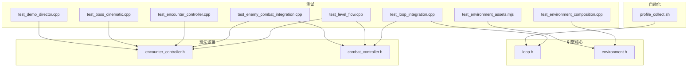
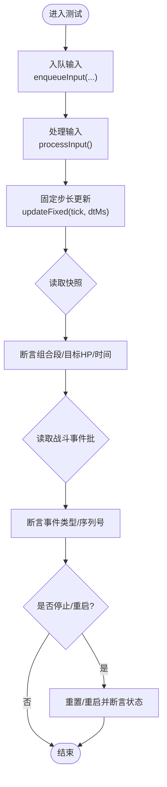
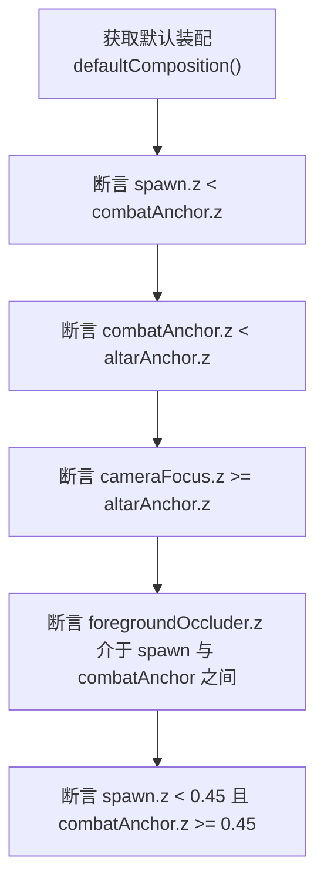
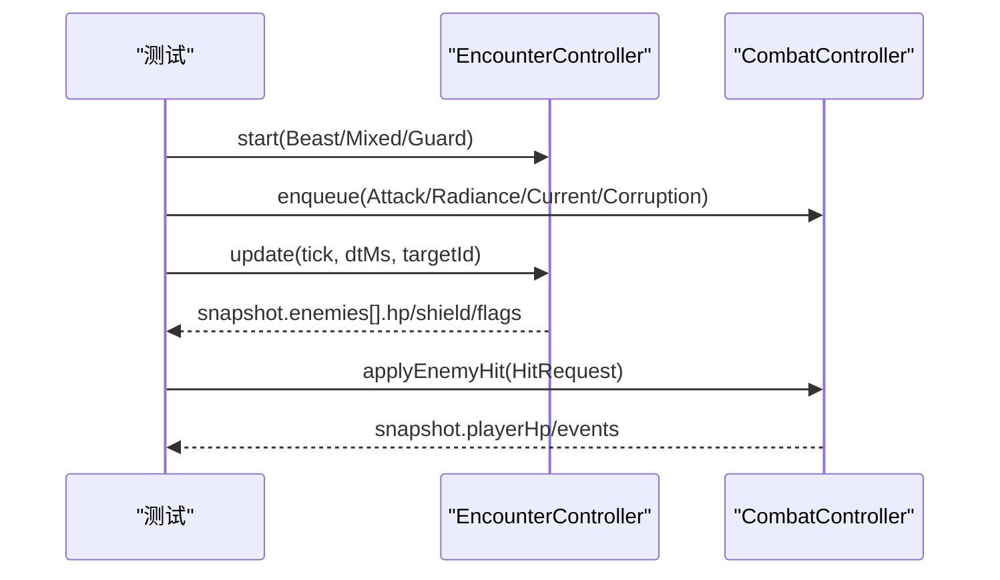
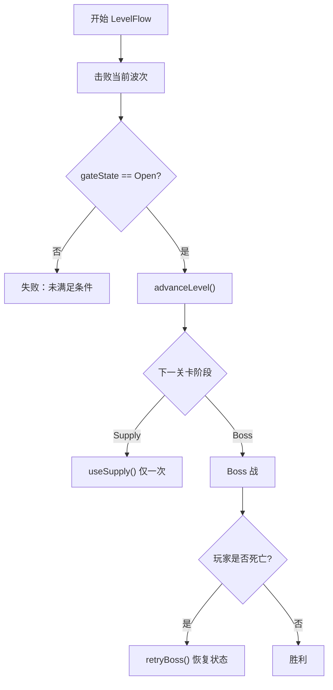
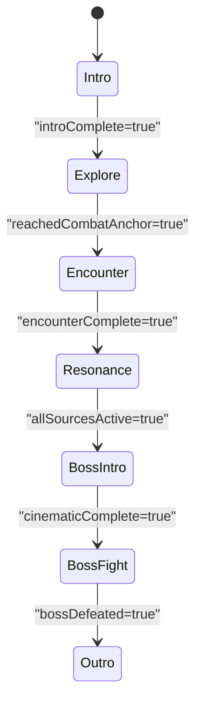
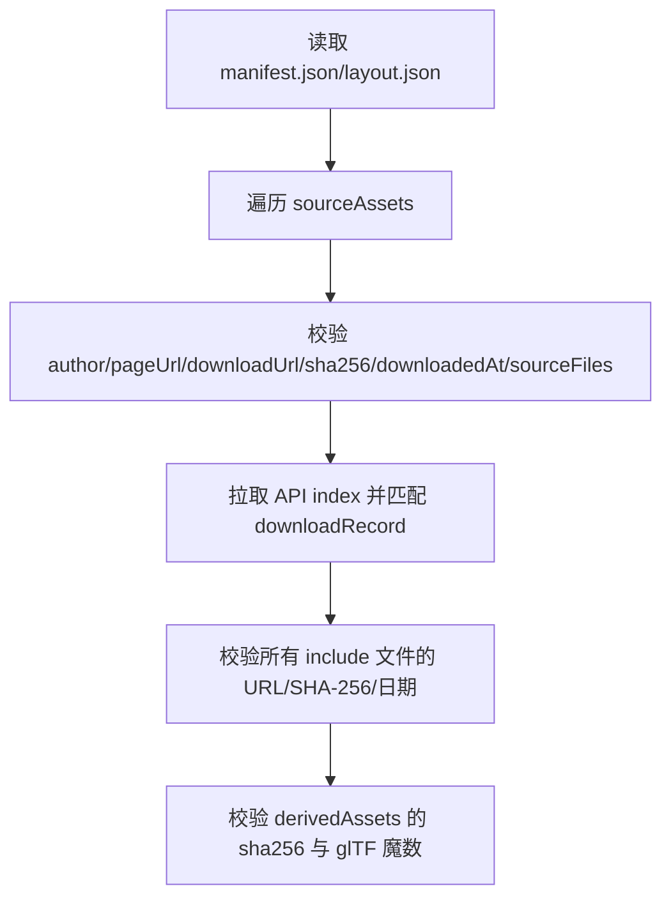
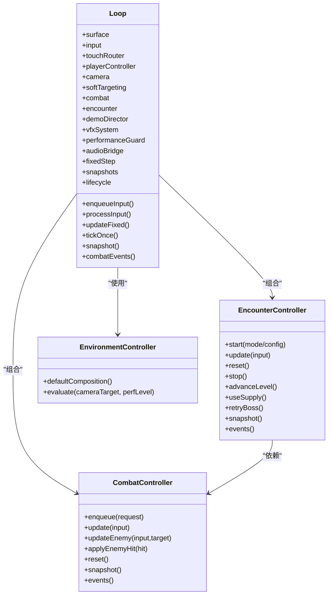

# 集成测试

<cite>
**本文引用的文件**   
- [test_loop_integration.cpp](file://tests/test_loop_integration.cpp)
- [test_level_flow.cpp](file://tests/test_level_flow.cpp)
- [test_enemy_combat_integration.cpp](file://tests/test_enemy_combat_integration.cpp)
- [test_encounter_controller.cpp](file://tests/test_encounter_controller.cpp)
- [test_environment_composition.cpp](file://tests/test_environment_composition.cpp)
- [test_boss_cinematic.cpp](file://tests/test_boss_cinematic.cpp)
- [test_demo_director.cpp](file://tests/test_demo_director.cpp)
- [test_environment_assets.mjs](file://tests/test_environment_assets.mjs)
- [loop.h](file://native/engine/core/loop.h)
- [encounter_controller.h](file://native/gameplay/ai/encounter_controller.h)
- [combat_controller.h](file://native/gameplay/combat/combat_controller.h)
- [environment.h](file://native/engine/render/environment.h)
- [profile_collect.sh](file://automation/perf/profile_collect.sh)
</cite>

## 目录
1. [简介](#简介)
2. [项目结构](#项目结构)
3. [核心组件](#核心组件)
4. [架构总览](#架构总览)
5. [详细组件分析](#详细组件分析)
6. [依赖关系分析](#依赖关系分析)
7. [性能考量](#性能考量)
8. [故障排查指南](#故障排查指南)
9. [结论](#结论)
10. [附录](#附录)

## 简介
本文件面向 my-world 项目的集成测试，系统性说明如何验证多个子系统之间的交互与协作。内容覆盖：
- 游戏循环集成测试（输入、固定步长更新、快照发布、事件批处理）
- 环境系统集成（场景装配、资源清单校验、渲染计划评估）
- 战斗系统集成（玩家动作、敌人 AI、伤害结算、状态机与反应系统）
- 端到端关卡流程（训练→遭遇→补给→Boss 的完整链路）
- 异步操作、资源加载与状态同步的处理策略
- 性能基准与回归测试方法

## 项目结构
my-world 的测试分布在 tests 目录下，包含 C++ 单元测试/集成测试与 Node.js 脚本测试；引擎与玩法逻辑位于 native 目录；自动化与性能采集在 automation 目录。关键测试入口与核心头文件如下：
- 游戏循环与输入：Loop（C++）
- 遭遇战与关卡流：EncounterController（C++）
- 战斗系统与动作：CombatController（C++）
- 环境与资源：EnvironmentController（C++）、Node 脚本（MJS）
- 演示导演与 Boss 过场：DemoDirector、BossCinematicState（C++）
- 性能采集：shell 脚本（Bash）



图表来源
- [test_loop_integration.cpp:1-380](file://tests/test_loop_integration.cpp#L1-L380)
- [test_level_flow.cpp:1-92](file://tests/test_level_flow.cpp#L1-L92)
- [test_enemy_combat_integration.cpp:1-117](file://tests/test_enemy_combat_integration.cpp#L1-L117)
- [test_encounter_controller.cpp:1-203](file://tests/test_encounter_controller.cpp#L1-L203)
- [test_environment_composition.cpp:1-40](file://tests/test_environment_composition.cpp#L1-L40)
- [test_boss_cinematic.cpp:1-35](file://tests/test_boss_cinematic.cpp#L1-L35)
- [test_demo_director.cpp:1-94](file://tests/test_demo_director.cpp#L1-L94)
- [test_environment_assets.mjs:1-171](file://tests/test_environment_assets.mjs#L1-L171)
- [loop.h:1-104](file://native/engine/core/loop.h#L1-L104)
- [encounter_controller.h:1-151](file://native/gameplay/ai/encounter_controller.h#L1-L151)
- [combat_controller.h:1-113](file://native/gameplay/combat/combat_controller.h#L1-L113)
- [environment.h:1-46](file://native/engine/render/environment.h#L1-L46)
- [profile_collect.sh:1-97](file://automation/perf/profile_collect.sh#L1-L97)

章节来源
- [test_loop_integration.cpp:1-380](file://tests/test_loop_integration.cpp#L1-L380)
- [test_level_flow.cpp:1-92](file://tests/test_level_flow.cpp#L1-L92)
- [test_enemy_combat_integration.cpp:1-117](file://tests/test_enemy_combat_integration.cpp#L1-L117)
- [test_encounter_controller.cpp:1-203](file://tests/test_encounter_controller.cpp#L1-L203)
- [test_environment_composition.cpp:1-40](file://tests/test_environment_composition.cpp#L1-L40)
- [test_boss_cinematic.cpp:1-35](file://tests/test_boss_cinematic.cpp#L1-L35)
- [test_demo_director.cpp:1-94](file://tests/test_demo_director.cpp#L1-L94)
- [test_environment_assets.mjs:1-171](file://tests/test_environment_assets.mjs#L1-L171)
- [loop.h:1-104](file://native/engine/core/loop.h#L1-L104)
- [encounter_controller.h:1-151](file://native/gameplay/ai/encounter_controller.h#L1-L151)
- [combat_controller.h:1-113](file://native/gameplay/combat/combat_controller.h#L1-L113)
- [environment.h:1-46](file://native/engine/render/environment.h#L1-L46)
- [profile_collect.sh:1-97](file://automation/perf/profile_collect.sh#L1-L97)

## 核心组件
- Loop（游戏循环）
  - 职责：输入入队与处理、固定步长更新、快照发布、战斗事件批处理、运行/停止生命周期管理、帧率统计、粒子与音频桥接等。
  - 关键接口：enqueueInput/processInput/updateFixed/tickOnce/snapshot/combatEvents/start/stop。
- EncounterController（遭遇控制器）
  - 职责：管理不同模式（训练、野兽、混合、守卫、关卡流、Boss），维护敌人实体、候选目标、关卡阶段、门状态、补给状态，以及事件批输出。
  - 关键接口：start/update/reset/stop/advanceLevel/useSupply/retryBoss/snapshot/events。
- CombatController（战斗控制器）
  - 职责：玩家动作状态机、伤害结算、源反应系统、训练脉冲、目标绑定与事件生成。
  - 关键接口：enqueue/update/updateEnemy/applyEnemyHit/reset/snapshot/events。
- EnvironmentController（环境控制器）
  - 职责：默认场景装配（出生点、前景遮挡、战斗锚点、祭坛锚点、相机焦点）、渲染计划评估（按相机目标与性能等级）。
- DemoDirector/BossCinematicState（演示导演与 Boss 过场）
  - 职责：阶段推进信号驱动、超时保护、跳过恢复输入与相机、Boss 过场就绪判定。

章节来源
- [loop.h:1-104](file://native/engine/core/loop.h#L1-L104)
- [encounter_controller.h:1-151](file://native/gameplay/ai/encounter_controller.h#L1-L151)
- [combat_controller.h:1-113](file://native/gameplay/combat/combat_controller.h#L1-L113)
- [environment.h:1-46](file://native/engine/render/environment.h#L1-L46)
- [test_boss_cinematic.cpp:1-35](file://tests/test_boss_cinematic.cpp#L1-L35)
- [test_demo_director.cpp:1-94](file://tests/test_demo_director.cpp#L1-L94)

## 架构总览
下图展示了从输入到战斗与遭遇、再到环境渲染与演示导演的整体数据流与调用顺序。

```mermaid
sequenceDiagram
participant Test as "测试用例"
participant Loop as "Loop(游戏循环)"
participant Input as "输入队列/触摸路由"
participant Player as "玩家控制器"
participant Combat as "CombatController"
participant Encounter as "EncounterController"
participant Env as "EnvironmentController"
participant Demo as "DemoDirector"
Test->>Loop : enqueueInput(...)
Loop->>Input : processInput()
Loop->>Player : updateFixed(tick, dtMs)
Loop->>Combat : update(CombatFrameInput)
Loop->>Encounter : update(EncounterFrameInput)
Loop-->>Test : snapshot()/combatEvents()
Test->>Env : defaultComposition()
Test->>Demo : tick(signals)/skipTo(phase)
```

图表来源
- [test_loop_integration.cpp:1-380](file://tests/test_loop_integration.cpp#L1-L380)
- [test_level_flow.cpp:1-92](file://tests/test_level_flow.cpp#L1-L92)
- [test_encounter_controller.cpp:1-203](file://tests/test_encounter_controller.cpp#L1-L203)
- [test_demo_director.cpp:1-94](file://tests/test_demo_director.cpp#L1-L94)
- [loop.h:1-104](file://native/engine/core/loop.h#L1-L104)
- [encounter_controller.h:1-151](file://native/gameplay/ai/encounter_controller.h#L1-L151)
- [combat_controller.h:1-113](file://native/gameplay/combat/combat_controller.h#L1-L113)
- [environment.h:1-46](file://native/engine/render/environment.h#L1-L46)

## 详细组件分析

### 游戏循环集成测试（Loop）
- 目标：验证输入入队与处理、固定步长更新、快照一致性、事件批处理、暂停/重启、并发输入安全。
- 关键点：
  - 多步固定更新累积效果（连击段数、目标血量变化）。
  - 毫秒级 tick 累计战斗时间与 HP 衰减。
  - 事件批在同一帧内保持序列号一致。
  - 启动/停止后快照回滚或清空。
  - 并发生产者对输入队列的有序性保证。
  - 渲染器不可用时的行为（重置移动与目标）。
  - 粒子计时与生命周期。



图表来源
- [test_loop_integration.cpp:1-380](file://tests/test_loop_integration.cpp#L1-L380)
- [loop.h:1-104](file://native/engine/core/loop.h#L1-L104)

章节来源
- [test_loop_integration.cpp:1-380](file://tests/test_loop_integration.cpp#L1-L380)
- [loop.h:1-104](file://native/engine/core/loop.h#L1-L104)

### 环境系统集成测试（Environment）
- 目标：验证默认场景装配的几何关系、前景遮挡与远焦、出生点与战斗触发位置关系。
- 关键点：
  - spawn.z < combatAnchor.z < altarAnchor.z 的顺序约束。
  - foregroundOccluder 位于 spawn 与 combatAnchor 之间。
  - cameraFocus 不低于 altarAnchor。
  - spawn 与 combatTrigger 的相对阈值。



图表来源
- [test_environment_composition.cpp:1-40](file://tests/test_environment_composition.cpp#L1-L40)
- [environment.h:1-46](file://native/engine/render/environment.h#L1-L46)

章节来源
- [test_environment_composition.cpp:1-40](file://tests/test_environment_composition.cpp#L1-L40)
- [environment.h:1-46](file://native/engine/render/environment.h#L1-L46)

### 战斗系统集成测试（Combat + Encounter）
- 目标：验证玩家各源攻击对当前敌人的影响、敌人反击伤害、训练脉冲洞察机制、护盾边界应用。
- 关键点：
  - 多种战斗动作（光耀、电流、腐化）均能作用于当前目标并附加对应状态。
  - 敌人攻击会减少玩家 HP 并产生 Damage 事件。
  - 遭遇模式下不授予训练脉冲洞察。
  - 护盾请求在边界生效，后续攻击先消耗护盾再扣血。



图表来源
- [test_enemy_combat_integration.cpp:1-117](file://tests/test_enemy_combat_integration.cpp#L1-L117)
- [test_encounter_controller.cpp:1-203](file://tests/test_encounter_controller.cpp#L1-L203)
- [encounter_controller.h:1-151](file://native/gameplay/ai/encounter_controller.h#L1-L151)
- [combat_controller.h:1-113](file://native/gameplay/combat/combat_controller.h#L1-L113)

章节来源
- [test_enemy_combat_integration.cpp:1-117](file://tests/test_enemy_combat_integration.cpp#L1-L117)
- [test_encounter_controller.cpp:1-203](file://tests/test_encounter_controller.cpp#L1-L203)
- [encounter_controller.h:1-151](file://native/gameplay/ai/encounter_controller.h#L1-L151)
- [combat_controller.h:1-113](file://native/gameplay/combat/combat_controller.h#L1-L113)

### 关卡流程端到端测试（Level Flow）
- 目标：验证“胜利才开门”“补给仅可消耗一次”“Boss 失败重试”。
- 关键点：
  - 每波击败后 gateState 由 Closed 变为 Open，方可 advanceLevel。
  - Supply 阶段 useSupply 后状态变为 Consumed，再次使用无效。
  - Boss 被击败前若玩家死亡，可 retryBoss 并恢复 Gate 关闭与 Boss HP。



图表来源
- [test_level_flow.cpp:1-92](file://tests/test_level_flow.cpp#L1-L92)
- [encounter_controller.h:1-151](file://native/gameplay/ai/encounter_controller.h#L1-L151)

章节来源
- [test_level_flow.cpp:1-92](file://tests/test_level_flow.cpp#L1-L92)
- [encounter_controller.h:1-151](file://native/gameplay/ai/encounter_controller.h#L1-L151)

### 演示导演与 Boss 过场（Demo Director & Cinematic）
- 目标：阶段推进信号驱动、超时安全推进、跳过恢复输入与相机、Boss 过场就绪与最大生命值配置。
- 关键点：
  - Intro → Explore → Encounter → Resonance → BossIntro → BossFight → Outro 的信号链。
  - Explore 超时提供安全推进，标记 usedTimeoutFallback。
  - skipTo 恢复输入与相机控制。
  - BossIntro 超时相对于阶段进入时间计算。
  - 过场 readyForFight 与 shardCount 判定。



图表来源
- [test_demo_director.cpp:1-94](file://tests/test_demo_director.cpp#L1-L94)
- [test_boss_cinematic.cpp:1-35](file://tests/test_boss_cinematic.cpp#L1-L35)

章节来源
- [test_demo_director.cpp:1-94](file://tests/test_demo_director.cpp#L1-L94)
- [test_boss_cinematic.cpp:1-35](file://tests/test_boss_cinematic.cpp#L1-L35)

### 环境资源与清单校验（Node 脚本）
- 目标：校验 glTF 下载选择、纹理依赖解析、GLB 读写往返、节点分区与材质合并、纹理层级嵌入、manifest 元数据与 SHA-256 一致性。
- 关键点：
  - chooseGltfDownload/chooseDiffuseDependency 的异常路径覆盖。
  - readGlb/writeGlb 的 round-trip 正确性与魔数校验。
  - partitionNodes 的区域合法性与矩阵烘焙。
  - manifest.sourceAssets 的字段完整性与远程 API 校验。
  - derivedAssets 的 sha256 与 glTF 魔数检查。



图表来源
- [test_environment_assets.mjs:1-171](file://tests/test_environment_assets.mjs#L1-L171)

章节来源
- [test_environment_assets.mjs:1-171](file://tests/test_environment_assets.mjs#L1-L171)

## 依赖关系分析
- Loop 依赖：
  - 输入子系统（InputQueue、TouchRouter、VirtualJoystick、CameraGesture、PlayerIntent）
  - 玩法子系统（PlayerController、SoftTargeting、CombatController、EncounterController、DemoDirector）
  - 表现子系统（VfxSystem、PerformanceGuard、AudioBridge）
  - 核心工具（FixedStep、SnapshotStore、LifecycleState）
- EncounterController 依赖：
  - CombatController（伤害与状态）、Targeting（软锁定）、Boss 控制器、TrainingTarget
- CombatController 依赖：
  - ActionStateMachine、DamageResolver、SourceReactionSystem、TrainingPulse



图表来源
- [loop.h:1-104](file://native/engine/core/loop.h#L1-L104)
- [encounter_controller.h:1-151](file://native/gameplay/ai/encounter_controller.h#L1-L151)
- [combat_controller.h:1-113](file://native/gameplay/combat/combat_controller.h#L1-L113)
- [environment.h:1-46](file://native/engine/render/environment.h#L1-L46)

章节来源
- [loop.h:1-104](file://native/engine/core/loop.h#L1-L104)
- [encounter_controller.h:1-151](file://native/gameplay/ai/encounter_controller.h#L1-L151)
- [combat_controller.h:1-113](file://native/gameplay/combat/combat_controller.h#L1-L113)
- [environment.h:1-46](file://native/engine/render/environment.h#L1-L46)

## 性能考量
- 基准采集
  - 通过 shell 脚本采集 HiLog 中的 PROFILE 日志，过滤关键字段（fps、perf_level、environment_ready、draw_calls、triangles、texture_tier、encounter_mode）。
  - 支持 normal/boss 两种阶段，分别设置 FPS 阈值（normal 30，boss 24），连续低于阈值超过两秒即失败。
  - 自动检测致命渲染错误（SIGSEGV、EGL 错误等）并中断。
- 建议
  - 在 CI 中定期执行 profile_collect.sh，记录 CSV 并归档。
  - 结合 snapshot 与 combatEvents 的采样频率，避免过度频繁 I/O。
  - 针对高负载阶段（Boss）降低纹理级别或剔除装饰批次。

章节来源
- [profile_collect.sh:1-97](file://automation/perf/profile_collect.sh#L1-L97)

## 故障排查指南
- 输入与事件
  - 确认 inputSequence 单调递增，确保并发入队顺序稳定。
  - 检查 combatEvents 的 sequence 是否与 gameplay 事件一致。
- 快照一致性
  - 在 stop/pause/rendererNotReady 时，快照应反映冻结或清零的状态。
  - 重启后初始快照应与默认装配一致。
- 遭遇与战斗
  - 遇到“无候选目标”或“目标已死亡”时，需检查 encounter.update 的目标 ID 与 alive 标志。
  - 护盾与伤害顺序：先消耗 shield，再扣 hp，注意事件类型区分。
- 环境资源
  - glTF 魔数校验失败通常表示二进制损坏或写入错误。
  - manifest 字段缺失会导致资源校验失败，需核对 API 返回与本地记录。

章节来源
- [test_loop_integration.cpp:1-380](file://tests/test_loop_integration.cpp#L1-L380)
- [test_encounter_controller.cpp:1-203](file://tests/test_encounter_controller.cpp#L1-L203)
- [test_enemy_combat_integration.cpp:1-117](file://tests/test_enemy_combat_integration.cpp#L1-L117)
- [test_environment_assets.mjs:1-171](file://tests/test_environment_assets.mjs#L1-L171)

## 结论
通过围绕 Loop、EncounterController、CombatController、EnvironmentController 与 DemoDirector 的多维度集成测试，my-world 能够在输入、固定步长更新、战斗结算、遭遇管理与环境装配等方面形成闭环验证。配合 Node 脚本的资源校验与 Bash 脚本的性能采集，项目具备完善的端到端质量保障能力。建议在持续集成中常态化运行这些测试，以捕获回归问题并维持稳定的性能基线。

## 附录
- 测试环境配置要点
  - 构建与运行：确保 HDC 可用，bundle 名称与 PHASE/DURATION_SECONDS 环境变量正确。
  - 资源准备：assets/environment/manifest.json 与 layout.json 必须存在且有效。
  - 设备/模拟器：确保应用进程 PID 稳定，HiLog 权限正常。
- 常见用例模板
  - 输入+固定步长+快照断言：参考 test_loop_integration.cpp。
  - 遭遇模式切换与状态清理：参考 test_encounter_controller.cpp。
  - 关卡流程推进与补给限制：参考 test_level_flow.cpp。
  - 环境装配几何约束：参考 test_environment_composition.cpp。
  - 演示阶段推进与超时保护：参考 test_demo_director.cpp。
  - 资源清单与 GLB 校验：参考 test_environment_assets.mjs。