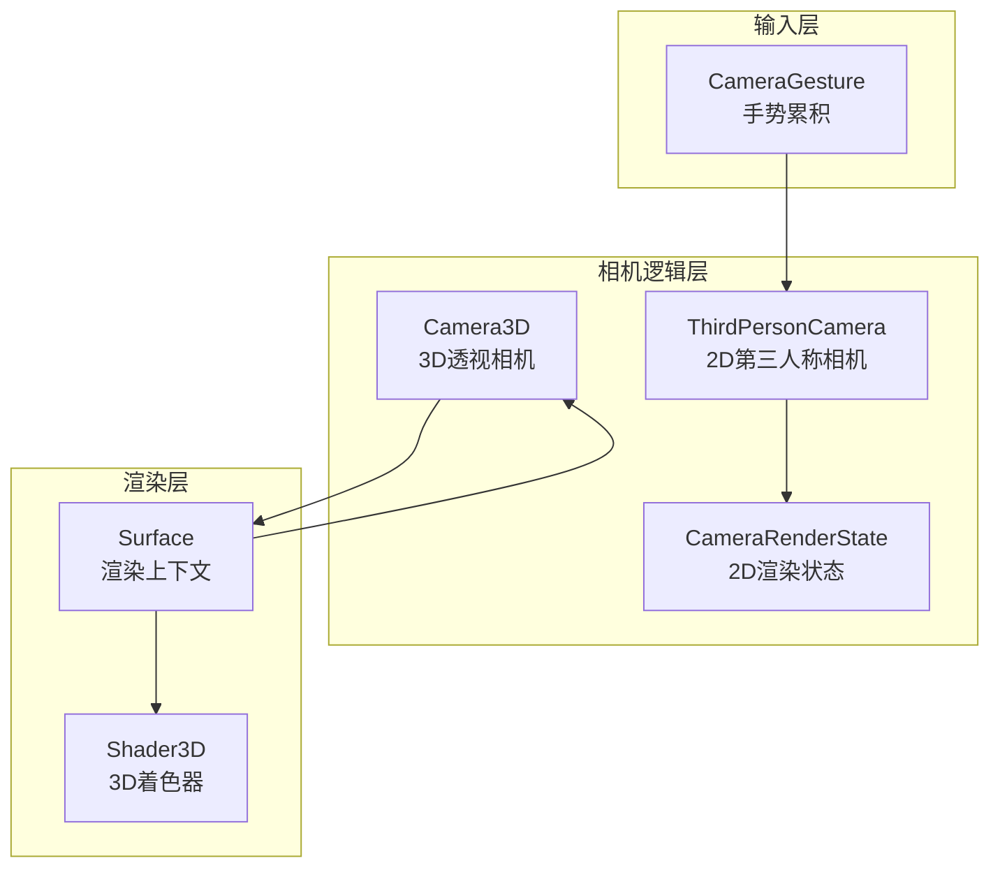
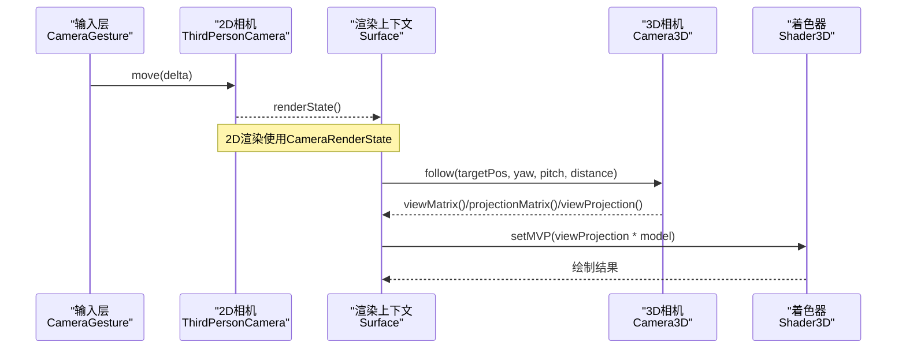
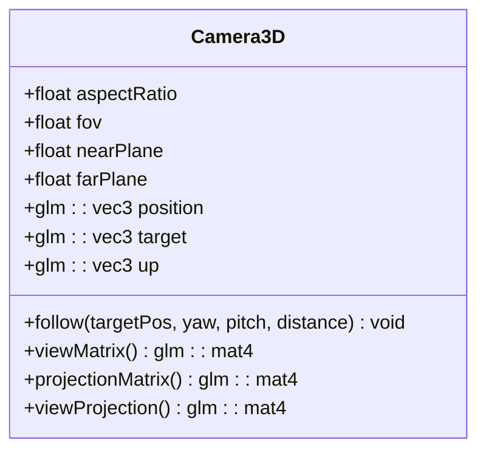
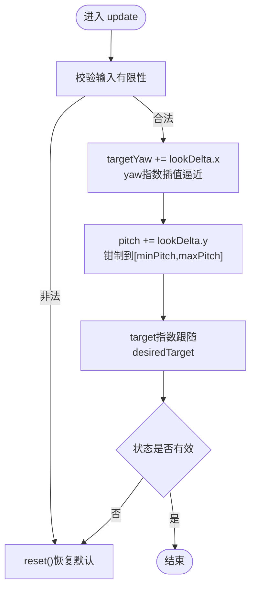
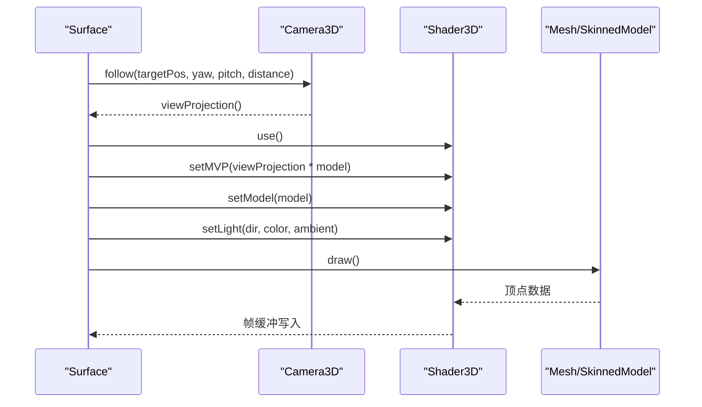
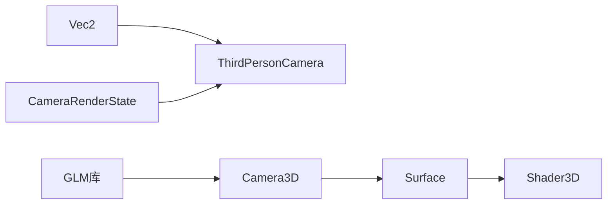

# 3D相机系统

<cite>
**本文引用的文件**   
- [camera.h](file://native/engine/render/camera.h)
- [camera.cpp](file://native/engine/render/camera.cpp)
- [camera3d.h](file://native/engine/render/camera3d.h)
- [camera3d.cpp](file://native/engine/render/camera3d.cpp)
- [camera_render_state.h](file://native/engine/render/camera_render_state.h)
- [surface.h](file://native/engine/render/surface.h)
- [surface.cpp](file://native/engine/render/surface.cpp)
- [shader_3d.h](file://native/engine/render/shader_3d.h)
- [vec2.h](file://native/engine/math/vec2.h)
- [camera_gesture.h](file://native/engine/input/camera_gesture.h)
- [test_camera3d.cpp](file://tests/test_camera3d.cpp)
- [test_camera.cpp](file://tests/test_camera.cpp)
</cite>

## 目录
1. [简介](#简介)
2. [项目结构](#项目结构)
3. [核心组件](#核心组件)
4. [架构总览](#架构总览)
5. [详细组件分析](#详细组件分析)
6. [依赖关系分析](#依赖关系分析)
7. [性能考虑](#性能考虑)
8. [故障排查指南](#故障排查指南)
9. [结论](#结论)
10. [附录：操作示例与数学原理](#附录操作示例与数学原理)

## 简介
本技术文档围绕 my-world 的 3D 相机系统，系统性阐述 Camera3D 类的实现与集成方式，包括透视投影矩阵计算、视锥体裁剪、视图矩阵生成、相机状态管理与视角控制、镜头效果（如缩放、跟随）以及与渲染管线的衔接。同时给出平滑过渡与动画策略、性能优化建议以及调试与可视化方法，帮助读者从概念到代码层面全面掌握该子系统。

## 项目结构
相机系统由“2D第三人称相机”和“3D透视相机”两部分组成：
- 2D 第三人称相机负责输入处理、目标跟随与视角平滑，输出 CameraRenderState 供 2D 渲染管线使用。
- 3D 透视相机 Camera3D 基于球坐标在目标周围定位相机位置，并生成 view/projection/viewProjection 矩阵供 3D 渲染管线使用。
- Surface 作为渲染上下文，持有 Camera3D 实例并在 3D 阶段计算 MVP 矩阵，驱动 Shader3D 完成绘制。

图表来源 
- [camera_gesture.h:1-54](file://native/engine/input/camera_gesture.h#L1-L54)
- [camera.h:1-46](file://native/engine/render/camera.h#L1-L46)
- [camera.cpp:1-130](file://native/engine/render/camera.cpp#L1-L130)
- [camera_render_state.h:1-61](file://native/engine/render/camera_render_state.h#L1-L61)
- [camera3d.h:1-37](file://native/engine/render/camera3d.h#L1-L37)
- [camera3d.cpp:1-32](file://native/engine/render/camera3d.cpp#L1-L32)
- [surface.h:98-176](file://native/engine/render/surface.h#L98-L176)
- [surface.cpp:606-618](file://native/engine/render/surface.cpp#L606-L618)
- [shader_3d.h:1-82](file://native/engine/render/shader_3d.h#L1-L82)

章节来源
- [camera.h:1-46](file://native/engine/render/camera.h#L1-L46)
- [camera.cpp:1-130](file://native/engine/render/camera.cpp#L1-L130)
- [camera3d.h:1-37](file://native/engine/render/camera3d.h#L1-L37)
- [camera3d.cpp:1-32](file://native/engine/render/camera3d.cpp#L1-L32)
- [camera_render_state.h:1-61](file://native/engine/render/camera_render_state.h#L1-L61)
- [surface.h:98-176](file://native/engine/render/surface.h#L98-L176)
- [surface.cpp:606-618](file://native/engine/render/surface.cpp#L606-L618)
- [shader_3d.h:1-82](file://native/engine/render/shader_3d.h#L1-L82)

## 核心组件
- ThirdPersonCamera：维护 yaw/pitch/distance/target，提供 update/setDistance/reset 接口，内部通过指数插值实现平滑跟随与转向。
- CameraRenderState：封装 2D 渲染所需的 target/yaw/pitch/distance/neutralPitch/neutralDistance，并提供 worldToView/worldVectorToView/billboardNdcRadii 等变换工具。
- Camera3D：维护 position/target/up 及 FOV/near/far/aspectRatio，提供 follow() 设置球坐标位置，viewMatrix()/projectionMatrix()/viewProjection() 生成矩阵。
- Surface：持有 Camera3D 实例，在 3D 渲染阶段计算 VP 矩阵并传递给 Shader3D 进行绘制。
- Shader3D：提供 setMVP/setModel/setLight 等接口，将相机与模型矩阵传入 GPU 执行 3D 渲染。

章节来源
- [camera.h:1-46](file://native/engine/render/camera.h#L1-L46)
- [camera.cpp:1-130](file://native/engine/render/camera.cpp#L1-L130)
- [camera_render_state.h:1-61](file://native/engine/render/camera_render_state.h#L1-L61)
- [camera3d.h:1-37](file://native/engine/render/camera3d.h#L1-L37)
- [camera3d.cpp:1-32](file://native/engine/render/camera3d.cpp#L1-L32)
- [surface.h:98-176](file://native/engine/render/surface.h#L98-L176)
- [shader_3d.h:1-82](file://native/engine/render/shader_3d.h#L1-L82)

## 架构总览
下图展示 3D 相机系统与渲染管线的交互流程：输入手势经 CameraGesture 累积 delta，驱动 ThirdPersonCamera 更新状态；Surface 在 3D 阶段调用 Camera3D::follow() 设置相机位置，随后计算 view/projection/viewProjection 矩阵，并通过 Shader3D 设置给 GPU 完成绘制。

图表来源 
- [camera_gesture.h:1-54](file://native/engine/input/camera_gesture.h#L1-L54)
- [camera.h:1-46](file://native/engine/render/camera.h#L1-L46)
- [camera.cpp:1-130](file://native/engine/render/camera.cpp#L1-L130)
- [camera3d.h:1-37](file://native/engine/render/camera3d.h#L1-L37)
- [camera3d.cpp:1-32](file://native/engine/render/camera3d.cpp#L1-L32)
- [surface.h:98-176](file://native/engine/render/surface.h#L98-L176)
- [surface.cpp:606-618](file://native/engine/render/surface.cpp#L606-L618)
- [shader_3d.h:1-82](file://native/engine/render/shader_3d.h#L1-L82)

## 详细组件分析

### Camera3D 类分析
- 球坐标定位：follow() 根据 targetPos、yaw、pitch、distance 计算 position，约定与 2D 第三人称相机一致（yaw增大向右侧轨道）。
- 视图矩阵：viewMatrix() 使用 lookAt(position, target, up)。
- 投影矩阵：projectionMatrix() 使用 glm::perspective(fovRadians, aspectRatio, nearPlane, farPlane)，fov 以度为单位转换为弧度。
- 组合矩阵：viewProjection() = projectionMatrix() * viewMatrix()。

图表来源 
- [camera3d.h:1-37](file://native/engine/render/camera3d.h#L1-L37)
- [camera3d.cpp:1-32](file://native/engine/render/camera3d.cpp#L1-L32)

章节来源
- [camera3d.h:1-37](file://native/engine/render/camera3d.h#L1-L37)
- [camera3d.cpp:1-32](file://native/engine/render/camera3d.cpp#L1-L32)

### ThirdPersonCamera 与 CameraRenderState
- 配置校验：sanitizeConfig() 对默认值、范围、有效性进行修复与钳制，确保 minPitch<=maxPitch、距离区间合法、sharpness非负等。
- 状态更新：update() 对 yaw 进行指数插值逼近目标，pitch 钳制于[minPitch,maxPitch]，target 按 followSharpness 指数跟随 desiredTarget。
- 距离设置：setDistance() 钳制于[minDistance,maxDistance]。
- 渲染状态：renderState() 输出 CameraRenderState，包含 neutralPitch/neutralDistance 用于 2D 世界到屏幕空间的缩放与旋转。
- 世界到视图转换：worldToView()/worldVectorToView()/billboardNdcRadii() 提供统一的 2D 投影工具。

图表来源 
- [camera.cpp:1-130](file://native/engine/render/camera.cpp#L1-L130)
- [camera_render_state.h:1-61](file://native/engine/render/camera_render_state.h#L1-L61)

章节来源
- [camera.h:1-46](file://native/engine/render/camera.h#L1-L46)
- [camera.cpp:1-130](file://native/engine/render/camera.cpp#L1-L130)
- [camera_render_state.h:1-61](file://native/engine/render/camera_render_state.h#L1-L61)

### Surface 与 3D 渲染管线集成
- Surface 持有 Camera3D 实例，在 draw3DPhase() 中启用深度测试，计算 VP 矩阵并设置给 Shader3D。
- Shader3D 提供 setMVP/setModel/setLight 等接口，将相机与模型矩阵上传至 GPU。
- 环境/角色/BOSS 等实体通过各自的 Mesh/SkinnedModel 与 Shader3D 协作完成绘制。

图表来源 
- [surface.h:98-176](file://native/engine/render/surface.h#L98-L176)
- [surface.cpp:606-618](file://native/engine/render/surface.cpp#L606-L618)
- [shader_3d.h:1-82](file://native/engine/render/shader_3d.h#L1-L82)

章节来源
- [surface.h:98-176](file://native/engine/render/surface.h#L98-L176)
- [surface.cpp:606-618](file://native/engine/render/surface.cpp#L606-L618)
- [shader_3d.h:1-82](file://native/engine/render/shader_3d.h#L1-L82)

### 输入与手势处理
- CameraGesture 累积指针移动 delta，乘以灵敏度得到 lookDelta，供 ThirdPersonCamera.update() 使用。
- 支持 begin/move/end/clear/consumeDelta 生命周期，保证多指与异常输入的鲁棒性。

章节来源
- [camera_gesture.h:1-54](file://native/engine/input/camera_gesture.h#L1-L54)

## 依赖关系分析
- ThirdPersonCamera 依赖 Vec2 与 CameraRenderState，用于状态与空间变换。
- Camera3D 依赖 GLM 库进行向量与矩阵运算。
- Surface 依赖 Camera3D 与 Shader3D，协调 3D 渲染阶段。
- Shader3D 依赖 GL 平台 API（条件编译），在非平台侧为空操作。

图表来源 
- [vec2.h:1-24](file://native/engine/math/vec2.h#L1-L24)
- [camera.h:1-46](file://native/engine/render/camera.h#L1-L46)
- [camera_render_state.h:1-61](file://native/engine/render/camera_render_state.h#L1-L61)
- [camera3d.h:1-37](file://native/engine/render/camera3d.h#L1-L37)
- [surface.h:98-176](file://native/engine/render/surface.h#L98-L176)
- [shader_3d.h:1-82](file://native/engine/render/shader_3d.h#L1-L82)

章节来源
- [vec2.h:1-24](file://native/engine/math/vec2.h#L1-L24)
- [camera.h:1-46](file://native/engine/render/camera.h#L1-L46)
- [camera_render_state.h:1-61](file://native/engine/render/camera_render_state.h#L1-L61)
- [camera3d.h:1-37](file://native/engine/render/camera3d.h#L1-L37)
- [surface.h:98-176](file://native/engine/render/surface.h#L98-L176)
- [shader_3d.h:1-82](file://native/engine/render/shader_3d.h#L1-L82)

## 性能考虑
- 指数插值平滑：ThirdPersonCamera 使用 exp(-sharpness*dt) 避免瞬时跳变，减少抖动与视觉突兀。
- 矩阵计算频率：Camera3D::viewProjection() 每帧仅一次，避免重复计算。
- 深度测试仅在 3D 阶段开启，降低不必要的状态切换开销。
- 资源初始化延迟：Surface 中的模型与环境资产采用“标脏+延迟解析”，避免每帧重复尝试。
- 可配置 FOV/Aspect/Near/Far：合理设置 nearPlane/farPlane 可减少精度问题与过裁剪。

[本节为通用指导，不直接分析具体文件]

## 故障排查指南
- 输入非法导致复位：当 update() 接收到 NaN/Inf 或 dtSeconds 非法时，ThirdPersonCamera 会 reset() 恢复默认状态，检查输入源与时间步长。
- 配置无效自动修复：sanitizeConfig() 会修正越界、NaN/Inf、逆序区间等，确保最小化崩溃风险。
- 投影矩阵有限性：测试用例验证 projectionMatrix() 所有元素为有限值，若出现非有限值需检查 FOV/Aspect/Near/Far 参数。
- 3D 渲染不可用：若 shader3dReady 为 false 或 program 句柄为 0，3D 阶段跳过绘制，检查平台 GL 上下文与着色器初始化。

章节来源
- [camera.cpp:1-130](file://native/engine/render/camera.cpp#L1-L130)
- [test_camera.cpp:1-189](file://tests/test_camera.cpp#L1-L189)
- [test_camera3d.cpp:1-78](file://tests/test_camera3d.cpp#L1-L78)
- [surface.cpp:606-618](file://native/engine/render/surface.cpp#L606-L618)

## 结论
my-world 的 3D 相机系统通过清晰的职责划分与稳健的状态管理，实现了从输入到渲染的完整链路。ThirdPersonCamera 提供平滑的 2D 视角控制，Camera3D 提供稳定的 3D 透视投影与视图矩阵，Surface 与 Shader3D 协同完成高效渲染。配合完善的配置校验、错误恢复与测试覆盖，系统在易用性与稳定性方面表现良好。

[本节为总结，不直接分析具体文件]

## 附录：操作示例与数学原理

### 相机操作示例
- 设置目标与视角：调用 Camera3D::follow(targetPos, yaw, pitch, distance) 更新相机位置与朝向。
- 获取矩阵：调用 viewMatrix()/projectionMatrix()/viewProjection() 获得视图、投影与组合矩阵。
- 2D 视角控制：使用 ThirdPersonCamera::update(desiredTarget, lookDelta, dtSeconds) 与 setDistance(distance) 调整视角与距离。
- 2D 世界到屏幕：使用 CameraRenderState::worldToView()/worldVectorToView()/billboardNdcRadii() 进行统一投影。

章节来源
- [camera3d.h:1-37](file://native/engine/render/camera3d.h#L1-L37)
- [camera3d.cpp:1-32](file://native/engine/render/camera3d.cpp#L1-L32)
- [camera.h:1-46](file://native/engine/render/camera.h#L1-L46)
- [camera.cpp:1-130](file://native/engine/render/camera.cpp#L1-L130)
- [camera_render_state.h:1-61](file://native/engine/render/camera_render_state.h#L1-L61)

### 数学变换原理
- 球坐标定位：position = target + distance * (sin(yaw)*cos(pitch), sin(pitch), -cos(yaw)*cos(pitch))，与 2D 第三人称相机方向约定一致。
- 视图矩阵：lookAt(position, target, up) 将世界坐标变换到相机坐标系。
- 投影矩阵：perspective(fovRadians, aspectRatio, nearPlane, farPlane) 将相机坐标映射到标准化设备坐标（NDC），实现透视裁剪。
- 组合矩阵：viewProjection = projection * view，用于将世界坐标一次性变换到 NDC。

章节来源
- [camera3d.cpp:1-32](file://native/engine/render/camera3d.cpp#L1-L32)

### 平滑过渡与动画策略
- 指数插值：yawFollow = 1 - exp(-yawSharpness*dt)，targetFollow = 1 - exp(-followSharpness*dt)，使角度与目标位置平滑收敛。
- 钳制与边界：pitch 限制在[minPitch,maxPitch]，distance 限制在[minDistance,maxDistance]，防止极端视角与距离。
- 重置保护：遇到非法输入或状态失效时自动 reset()，保证系统稳定。

章节来源
- [camera.cpp:1-130](file://native/engine/render/camera.cpp#L1-L130)

### 调试与可视化
- 单元测试：test_camera3d.cpp 验证 follow() 设置位置与目标、viewMatrix() 行为、projectionMatrix() 响应 FOV、有限性等。
- 2D 相机测试：test_camera.cpp 验证配置修复、平滑跟随、reset 行为与边界情况。
- 渲染路径：Surface 的 3D 阶段打印/记录关键矩阵与状态，便于定位问题。

章节来源
- [test_camera3d.cpp:1-78](file://tests/test_camera3d.cpp#L1-L78)
- [test_camera.cpp:1-189](file://tests/test_camera.cpp#L1-L189)
- [surface.cpp:606-618](file://native/engine/render/surface.cpp#L606-L618)