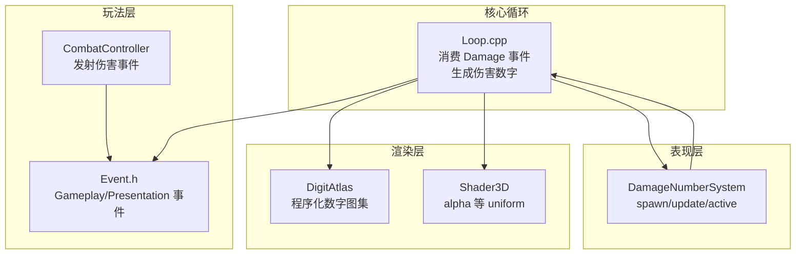
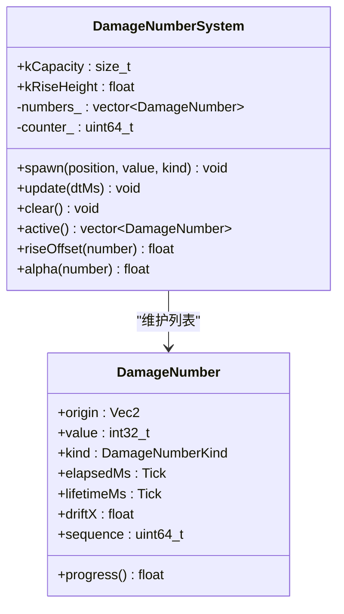
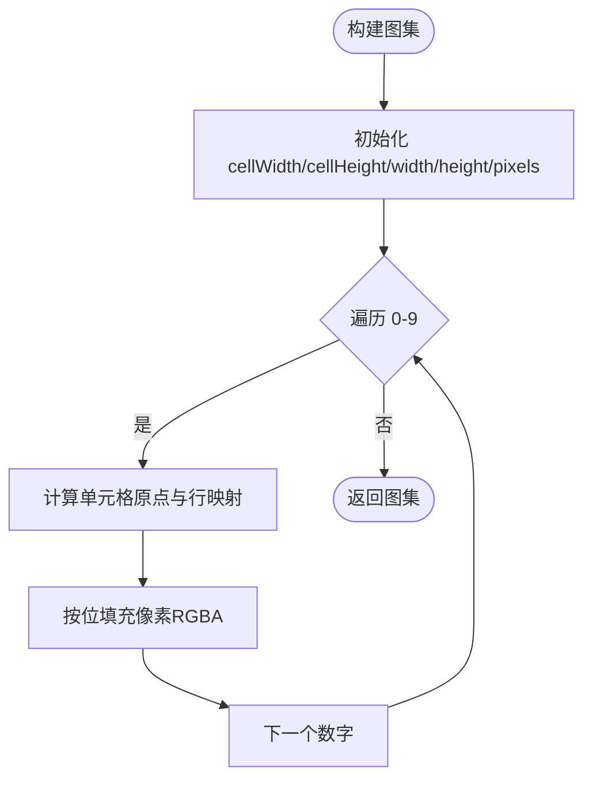
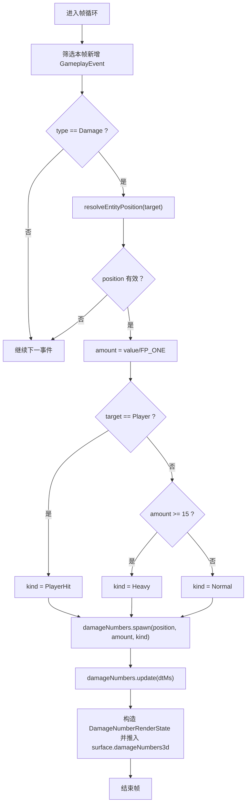
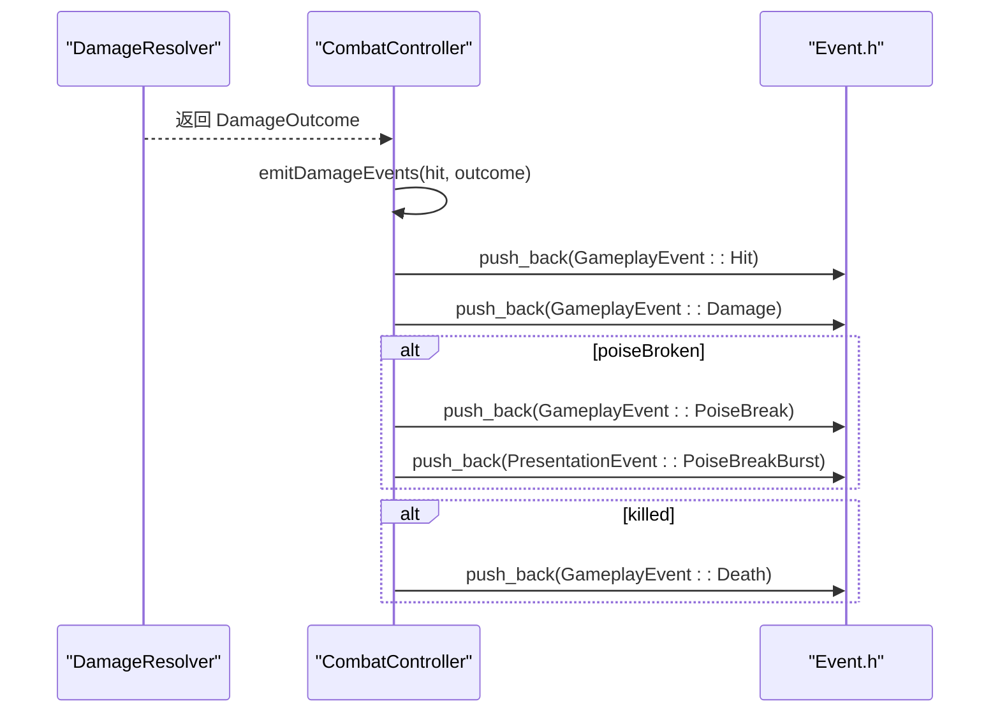
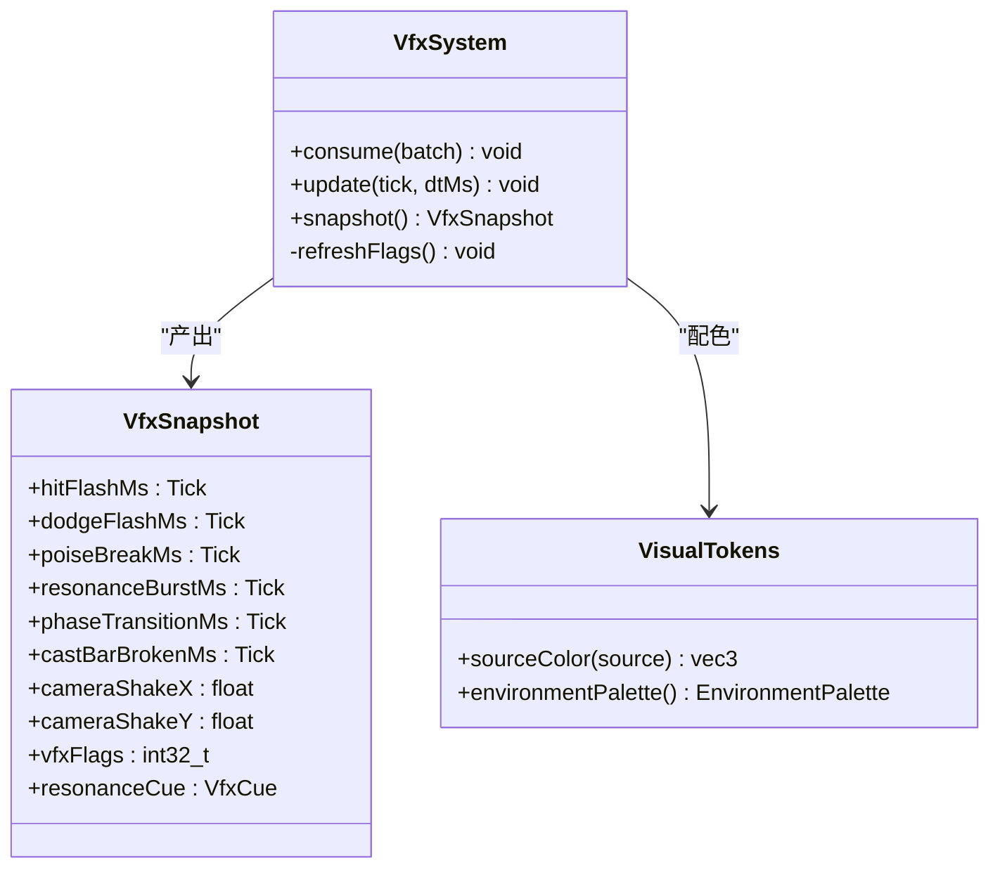
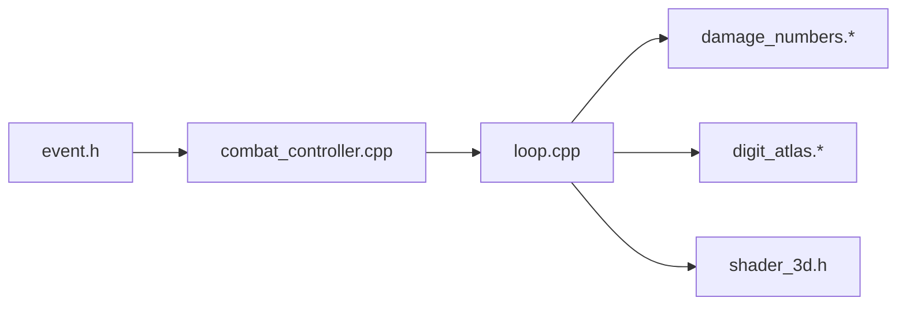

# 伤害数字系统

<cite>
**本文引用的文件**
- [damage_numbers.h](file://native/engine/presentation/damage_numbers.h)
- [damage_numbers.cpp](file://native/engine/presentation/damage_numbers.cpp)
- [digit_atlas.h](file://native/engine/render/digit_atlas.h)
- [digit_atlas.cpp](file://native/engine/render/digit_atlas.cpp)
- [loop.cpp](file://native/engine/core/loop.cpp)
- [event.h](file://native/gameplay/combat/event.h)
- [combat_controller.h](file://native/gameplay/combat/combat_controller.h)
- [combat_controller.cpp](file://native/gameplay/combat/combat_controller.cpp)
- [vfx_system.h](file://native/engine/presentation/vfx_system.h)
- [visual_tokens.h](file://native/engine/presentation/visual_tokens.h)
- [shader_3d.h](file://native/engine/render/shader_3d.h)
- [test_damage_numbers.cpp](file://tests/test_damage_numbers.cpp)
</cite>

## 目录
1. [简介](#简介)
2. [项目结构](#项目结构)
3. [核心组件](#核心组件)
4. [架构总览](#架构总览)
5. [详细组件分析](#详细组件分析)
6. [依赖关系分析](#依赖关系分析)
7. [性能考量](#性能考量)
8. [故障排查指南](#故障排查指南)
9. [结论](#结论)
10. [附录](#附录)

## 简介
本文件系统化梳理“伤害数字系统”的设计与实现，覆盖从战斗事件到渲染输出的完整链路：战斗控制器产生伤害事件，循环层消费事件并生成伤害飘字条目，呈现系统计算上浮与透明度，最终通过程序化数字图集在 3D 渲染管线中绘制。文档同时给出类图、时序图与流程图，帮助读者快速理解数据流、处理逻辑与扩展点。

## 项目结构
围绕伤害数字系统的代码主要分布在以下模块：
- 表现层（presentation）：伤害飘字数据结构与系统更新逻辑
- 渲染层（render）：程序化数字字形图集与 3D 着色器接口
- 核心循环（core）：事件消费、位置解析、伤害数字生成与状态传递
- 玩法层（gameplay/combat）：战斗事件定义与伤害事件发射
- 测试（tests）：对伤害数字系统与数字图集的单元测试



**图表来源**
- [combat_controller.cpp:197-217](file://native/gameplay/combat/combat_controller.cpp#L197-L217)
- [event.h:42-89](file://native/gameplay/combat/event.h#L42-L89)
- [loop.cpp:592-623](file://native/engine/core/loop.cpp#L592-L623)
- [damage_numbers.h:35-56](file://native/engine/presentation/damage_numbers.h#L35-L56)
- [digit_atlas.h:8-32](file://native/engine/render/digit_atlas.h#L8-L32)
- [shader_3d.h:46-48](file://native/engine/render/shader_3d.h#L46-L48)

**章节来源**
- [combat_controller.h:20-54](file://native/gameplay/combat/combat_controller.h#L20-L54)
- [combat_controller.cpp:197-217](file://native/gameplay/combat/combat_controller.cpp#L197-L217)
- [event.h:42-89](file://native/gameplay/combat/event.h#L42-L89)
- [loop.cpp:592-623](file://native/engine/core/loop.cpp#L592-L623)
- [damage_numbers.h:35-56](file://native/engine/presentation/damage_numbers.h#L35-L56)
- [digit_atlas.h:8-32](file://native/engine/render/digit_atlas.h#L8-L32)
- [shader_3d.h:46-48](file://native/engine/render/shader_3d.h#L46-L48)

## 核心组件
- 伤害飘字条目与系统
  - 条目包含世界坐标、数值、类型、生命周期、水平散布偏移与序列号；提供进度、上升偏移与透明度计算。
  - 系统负责生成、更新、清理与容量控制，保证确定性散布与淘汰策略。
- 程序化数字图集
  - 基于内置 5x7 点阵构建 RGBA 像素纹理，支持字符 UV 查询与点亮像素统计。
- 核心循环集成
  - 消费 Gameplay 中的 Damage 事件，按目标实体定位世界坐标，判定伤害类型并生成飘字；每帧推进时间并输出渲染状态。
- 3D 渲染接口
  - Shader3D 提供 alpha 等 uniform 设置，供飘字淡出使用。

**章节来源**
- [damage_numbers.h:16-56](file://native/engine/presentation/damage_numbers.h#L16-L56)
- [damage_numbers.cpp:7-46](file://native/engine/presentation/damage_numbers.cpp#L7-L46)
- [digit_atlas.h:8-32](file://native/engine/render/digit_atlas.h#L8-L32)
- [digit_atlas.cpp:21-60](file://native/engine/render/digit_atlas.cpp#L21-L60)
- [loop.cpp:592-623](file://native/engine/core/loop.cpp#L592-L623)
- [shader_3d.h:46-48](file://native/engine/render/shader_3d.h#L46-L48)

## 架构总览
伤害数字系统采用“事件驱动 + 表现层纯逻辑 + 渲染只读消费”的分层设计：
- 玩法层仅负责产生标准化事件（Hit/Damage/PoiseBreak 等）。
- 核心循环将事件转换为表现层可消费的中间状态（DamageNumberRenderState），并调用 DamageNumberSystem 管理生命周期。
- 渲染层通过 DigitAtlas 与 Shader3D 完成数字绘制与透明度控制。

```mermaid
sequenceDiagram
participant CC as "CombatController"
participant LOOP as "核心循环"
participant DNS as "DamageNumberSystem"
participant DA as "DigitAtlas"
participant S3D as "Shader3D"
CC->>LOOP : 推送 GameplayEvent(Damage)
LOOP->>LOOP : 解析目标位置/判定伤害类型
LOOP->>DNS : spawn(position, value, kind)
LOOP->>DNS : update(dtMs)
DNS-->>LOOP : active() 列表
LOOP->>DA : uvRect(数字字符)
LOOP->>S3D : setAlpha(alpha)
LOOP-->>LOOP : 输出 damageNumbers3d 渲染状态
```

**图表来源**
- [combat_controller.cpp:197-217](file://native/gameplay/combat/combat_controller.cpp#L197-L217)
- [loop.cpp:592-623](file://native/engine/core/loop.cpp#L592-L623)
- [damage_numbers.h:35-56](file://native/engine/presentation/damage_numbers.h#L35-L56)
- [digit_atlas.h:26-32](file://native/engine/render/digit_atlas.h#L26-L32)
- [shader_3d.h:46-48](file://native/engine/render/shader_3d.h#L46-L48)

## 详细组件分析

### 伤害飘字条目与系统（DamageNumber / DamageNumberSystem）
- 数据结构
  - origin：世界 2D 坐标
  - value：显示整型数值（四舍五入且至少为 1）
  - kind：Normal/Heavy/PlayerHit 三类
  - elapsedMs/lifetimeMs：生命周期计时
  - driftX：确定性水平散布偏移
  - sequence：全局递增序号，用于确定性与容量淘汰
- 行为
  - spawn：校验输入、分配漂移偏移、容量上限淘汰最旧条目
  - update：推进 elapsedMs，移除过期条目
  - riseOffset：ease-out 上浮曲线
  - alpha：前 60% 不透明，后 40% 线性淡出
- 复杂度
  - spawn O(1)，update O(n)（n 为当前活跃数量），clear O(1)



**图表来源**
- [damage_numbers.h:16-56](file://native/engine/presentation/damage_numbers.h#L16-L56)
- [damage_numbers.cpp:7-46](file://native/engine/presentation/damage_numbers.cpp#L7-L46)

**章节来源**
- [damage_numbers.h:16-56](file://native/engine/presentation/damage_numbers.h#L16-L56)
- [damage_numbers.cpp:7-46](file://native/engine/presentation/damage_numbers.cpp#L7-L46)
- [test_damage_numbers.cpp:15-96](file://tests/test_damage_numbers.cpp#L15-L96)

### 程序化数字图集（DigitAtlas）
- 功能
  - 基于内置 5x7 点阵构建 RGBA 像素纹理，每个数字占一个单元
  - 提供 uvRect 查询字符 UV 矩形（OpenGL v=0 在底部）
  - 提供 litPixels 辅助统计点亮像素数（便于单测）
- 关键参数
  - kGlyphColumns=5, kGlyphRows=7, kScale=2
  - 单元格尺寸 (5*2+6) x (7*2+6) = 16x20，共 10 格



**图表来源**
- [digit_atlas.cpp:21-60](file://native/engine/render/digit_atlas.cpp#L21-L60)

**章节来源**
- [digit_atlas.h:8-32](file://native/engine/render/digit_atlas.h#L8-L32)
- [digit_atlas.cpp:21-60](file://native/engine/render/digit_atlas.cpp#L21-L60)

### 核心循环集成（Loop 消费 Damage 事件）
- 流程要点
  - 仅消费本步新增的 Damage 事件，避免重复
  - 根据 target 解析世界坐标，若失败则跳过
  - 依据 amount 阈值与 target 身份判定 kind（玩家受击红色、大额金色、其余近白）
  - 调用 spawn 生成飘字，update 推进时间，输出渲染状态
- 渲染状态字段
  - x/z 对应 origin.x/y，rise 由 riseOffset 计算，driftX 来自条目，alpha 由 alpha 计算，value/kind 透传



**图表来源**
- [loop.cpp:592-623](file://native/engine/core/loop.cpp#L592-L623)

**章节来源**
- [loop.cpp:592-623](file://native/engine/core/loop.cpp#L592-L623)

### 战斗事件与伤害事件发射（CombatController & Event）
- 事件类型
  - GameplayEventType：Hit/Damage/Dodge/Interrupt/PoiseBreak/AuraApplied/Resonance/PhaseChanged/Death/EncounterReset
  - PresentationEventType：HitFlash/CameraShake/DodgeFlash/CastBarBroken/PoiseBreakBurst/ResonanceBurst/PhaseTransition
- 伤害事件发射
  - emitDamageEvents 在 hpDamage 或 poiseDamage 非零时推送 Hit/Damage 事件，并在破韧/击杀时追加相应事件



**图表来源**
- [combat_controller.cpp:197-217](file://native/gameplay/combat/combat_controller.cpp#L197-L217)
- [event.h:42-89](file://native/gameplay/combat/event.h#L42-L89)

**章节来源**
- [combat_controller.h:20-54](file://native/gameplay/combat/combat_controller.h#L20-L54)
- [combat_controller.cpp:197-217](file://native/gameplay/combat/combat_controller.cpp#L197-L217)
- [event.h:42-89](file://native/gameplay/combat/event.h#L42-L89)

### VFX 与视觉令牌（VfxSystem & VisualTokens）
- VFX 快照
  - 记录各类特效剩余时间与标志位，如 HitFlash、PoiseBreak、ResonanceBurst 等
- 视觉令牌
  - 提供 SourceType 对应的颜色与环境调色板，供 UI/VFX 统一配色



**图表来源**
- [vfx_system.h:45-69](file://native/engine/presentation/vfx_system.h#L45-L69)
- [visual_tokens.h:15-35](file://native/engine/presentation/visual_tokens.h#L15-L35)

**章节来源**
- [vfx_system.h:45-69](file://native/engine/presentation/vfx_system.h#L45-L69)
- [visual_tokens.h:15-35](file://native/engine/presentation/visual_tokens.h#L15-L35)

## 依赖关系分析
- 耦合与内聚
  - DamageNumberSystem 与 loop 强耦合（消费事件、输出渲染状态），但内部高内聚（生命周期管理、缓动与透明度）
  - DigitAtlas 独立于渲染管线，仅提供 UV 查询与像素构建，便于替换与测试
  - CombatController 仅依赖事件定义，不感知表现层细节
- 外部依赖
  - glm/vec2、tick_clock 等基础数学与时钟类型
  - GLES3 仅在平台侧生效，非平台侧为空操作，利于跨平台开发



**图表来源**
- [event.h:42-89](file://native/gameplay/combat/event.h#L42-L89)
- [combat_controller.cpp:197-217](file://native/gameplay/combat/combat_controller.cpp#L197-L217)
- [loop.cpp:592-623](file://native/engine/core/loop.cpp#L592-L623)
- [damage_numbers.h:35-56](file://native/engine/presentation/damage_numbers.h#L35-L56)
- [digit_atlas.h:8-32](file://native/engine/render/digit_atlas.h#L8-L32)
- [shader_3d.h:46-48](file://native/engine/render/shader_3d.h#L46-L48)

**章节来源**
- [event.h:42-89](file://native/gameplay/combat/event.h#L42-L89)
- [combat_controller.cpp:197-217](file://native/gameplay/combat/combat_controller.cpp#L197-L217)
- [loop.cpp:592-623](file://native/engine/core/loop.cpp#L592-L623)
- [damage_numbers.h:35-56](file://native/engine/presentation/damage_numbers.h#L35-L56)
- [digit_atlas.h:8-32](file://native/engine/render/digit_atlas.h#L8-L32)
- [shader_3d.h:46-48](file://native/engine/render/shader_3d.h#L46-L48)

## 性能考量
- 生成与更新
  - spawn 为 O(1)，update 为 O(n)，n 受 kCapacity 限制（默认 24），峰值稳定
  - 淘汰策略直接 erase(begin())，避免频繁重排
- 内存与 CPU
  - 数字图集一次性构建，UV 查询 O(1)
  - 浮点运算集中在 riseOffset/alpha，开销极低
- 渲染
  - 每帧仅遍历 active() 列表，push_back 渲染状态，GPU 侧批量绘制
- 建议
  - 若高频伤害场景，可考虑对象池减少分配
  - 可将 kCapacity 与 kRiseHeight 配置化以适配不同设备

[本节为通用指导，无需特定文件引用]

## 故障排查指南
- 症状：无伤害数字出现
  - 检查 GameplayEvent::Damage 是否被推送（emitDamageEvents）
  - 确认 resolveEntityPosition 是否能解析目标位置
  - 验证 spawn 输入合法性（非 NaN、非负值）
- 症状：飘字不消失或堆积
  - 检查 update(dtMs) 是否每帧调用且 dtMs > 0
  - 核对 lifetimeMs 与 elapsedMs 比较逻辑
- 症状：飘字重叠严重
  - 调整 driftX 范围或增加 kCapacity
- 症状：数字显示异常
  - 检查 DigitAtlas::uvRect 是否正确映射字符
  - 确认 Shader3D::setAlpha 调用顺序与恢复

**章节来源**
- [combat_controller.cpp:197-217](file://native/gameplay/combat/combat_controller.cpp#L197-L217)
- [loop.cpp:592-623](file://native/engine/core/loop.cpp#L592-L623)
- [damage_numbers.cpp:7-46](file://native/engine/presentation/damage_numbers.cpp#L7-L46)
- [digit_atlas.cpp:62-73](file://native/engine/render/digit_atlas.cpp#L62-L73)
- [shader_3d.h:46-48](file://native/engine/render/shader_3d.h#L46-L48)

## 结论
伤害数字系统以清晰的事件驱动与分层架构实现了高性能、可测试、可扩展的飘字展示方案。通过 DamageNumberSystem 的生命周期管理、DigitAtlas 的程序化字体与 Loop 的事件消费，系统在保持低耦合的同时提供了稳定的表现力。未来可在容量、曲线与配置化方面进一步优化，以适配更多设备与玩法需求。

[本节为总结性内容，无需特定文件引用]

## 附录
- 相关单测
  - 伤害数字系统：覆盖非法输入拒绝、数值四舍五入、到期清理、容量上限、缓动与透明度、确定性散布、非正 dt 保护等
  - 数字图集：覆盖 uvRect 与点亮像素统计

**章节来源**
- [test_damage_numbers.cpp:15-96](file://tests/test_damage_numbers.cpp#L15-L96)