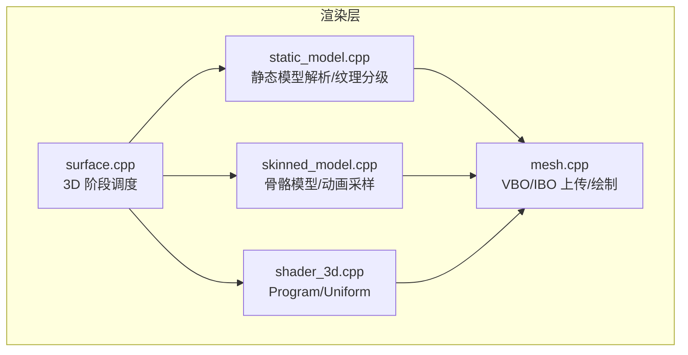
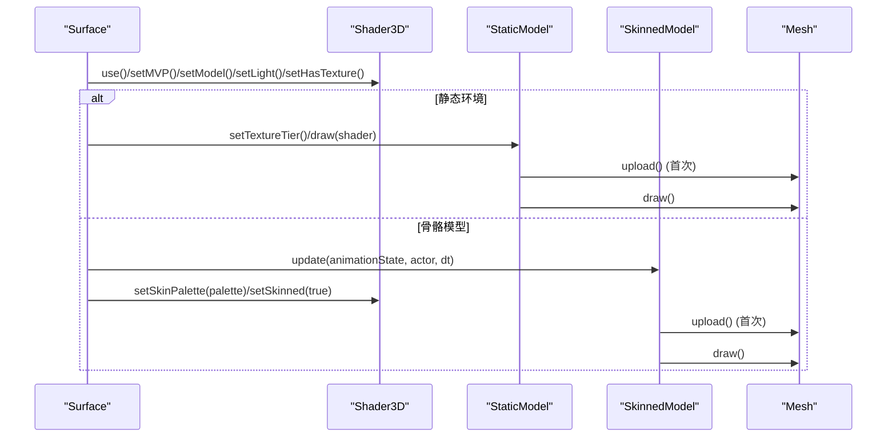
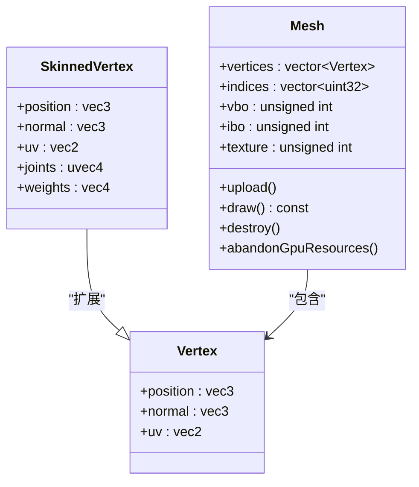
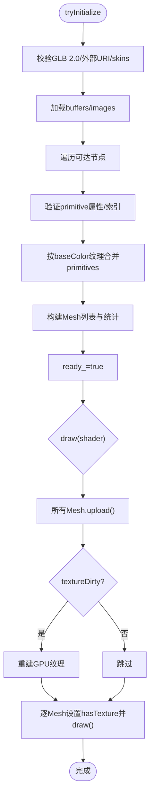
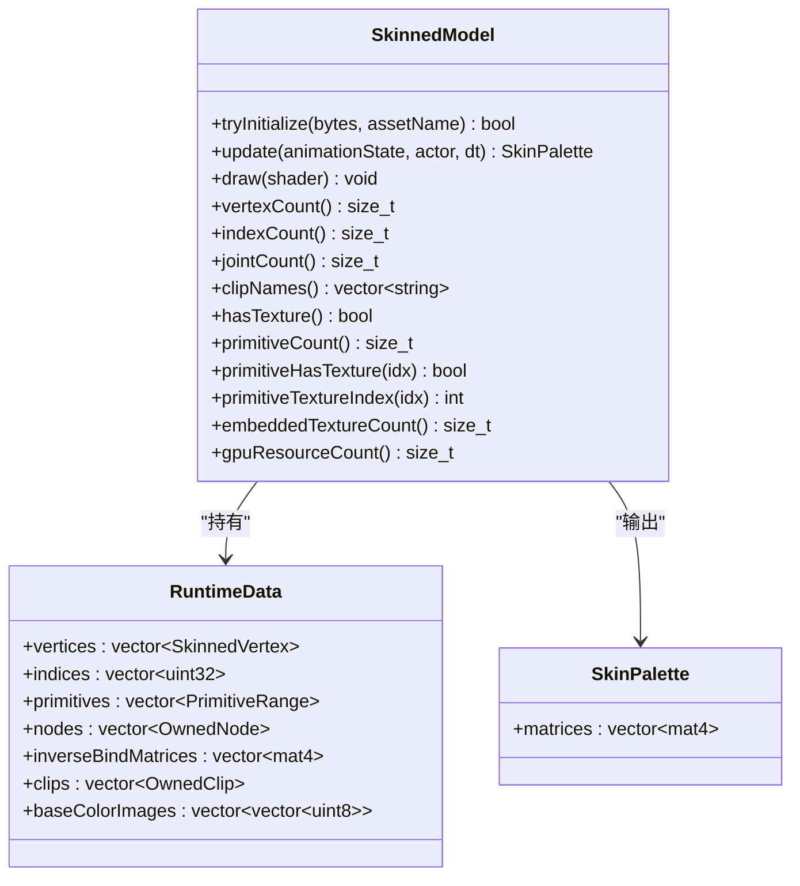
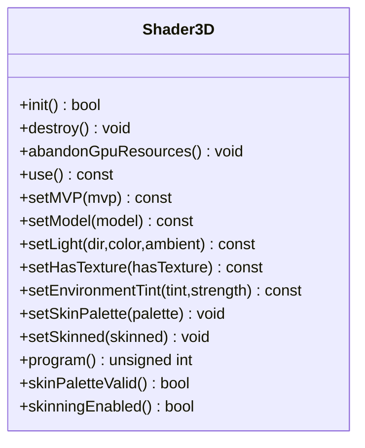
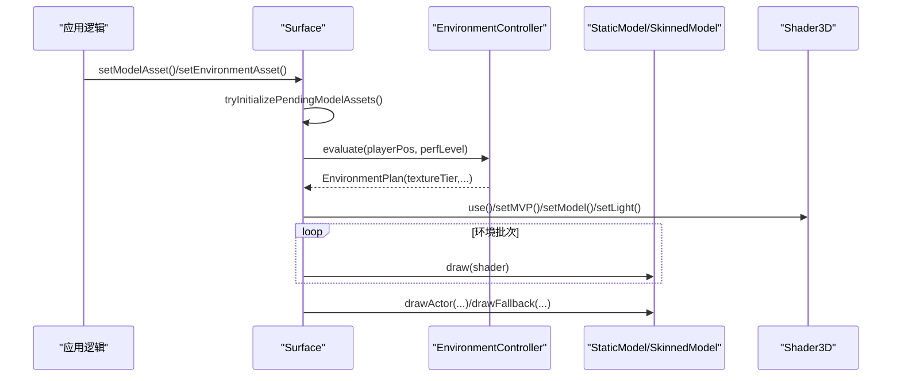
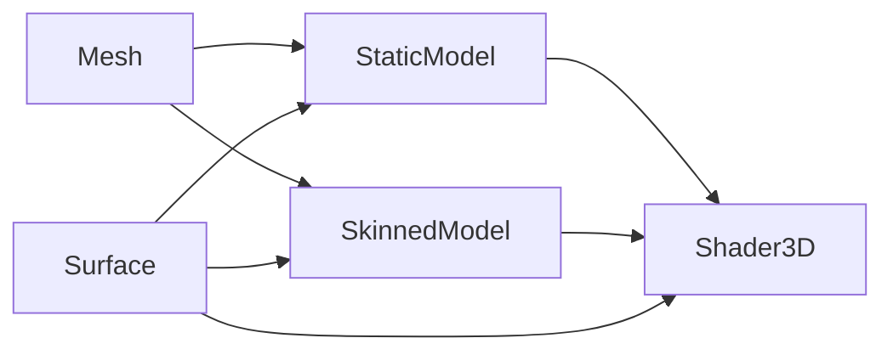

# 几何体系统

<cite>
**本文引用的文件**   
- [native/engine/render/mesh.h](file://native/engine/render/mesh.h)
- [native/engine/render/mesh.cpp](file://native/engine/render/mesh.cpp)
- [native/engine/render/static_model.h](file://native/engine/render/static_model.h)
- [native/engine/render/static_model.cpp](file://native/engine/render/static_model.cpp)
- [native/engine/render/skinned_model.h](file://native/engine/render/skinned_model.h)
- [native/engine/render/skinned_model.cpp](file://native/engine/render/skinned_model.cpp)
- [native/engine/render/shader_3d.h](file://native/engine/render/shader_3d.h)
- [native/engine/render/shader_3d.cpp](file://native/engine/render/shader_3d.cpp)
- [native/engine/render/surface.h](file://native/engine/render/surface.h)
- [native/engine/render/surface.cpp](file://native/engine/render/surface.cpp)
- [tests/test_mesh.cpp](file://tests/test_mesh.cpp)
- [tests/test_static_model.cpp](file://tests/test_static_model.cpp)
- [tests/test_skinned_model.cpp](file://tests/test_skinned_model.cpp)
</cite>

## 目录
1. [简介](#简介)
2. [项目结构](#项目结构)
3. [核心组件](#核心组件)
4. [架构总览](#架构总览)
5. [详细组件分析](#详细组件分析)
6. [依赖关系分析](#依赖关系分析)
7. [性能考量](#性能考量)
8. [故障排查指南](#故障排查指南)
9. [结论](#结论)
10. [附录](#附录)

## 简介
本技术文档聚焦 my-world 的几何体系统，系统性阐述 Mesh、StaticModel、SkinnedModel 与 Shader3D 的实现与协作方式。重点覆盖：
- 顶点缓冲对象(VBO)、索引缓冲对象(IBO)与顶点数组对象(VAO)的管理策略（当前实现使用 VBO/IBO + glVertexAttribPointer，未显式创建 VAO）。
- 几何体数据格式与顶点属性布局（静态 Mesh 与蒙皮 SkinnedVertex）。
- 渲染调用优化（批处理、纹理合并、层级化环境渲染、按需上传与延迟初始化）。
- 静态模型与动态模型的渲染差异（含实例化/批处理的扩展建议）。
- 与着色器的数据绑定方式、Uniform 设置与性能监控方法。
- 调试工具与内存分析技巧（CPU 侧测试、错误信息、资源句柄追踪）。

## 项目结构
几何体系统位于 native/engine/render 目录下，核心文件包括：
- mesh.{h,cpp}：硬编码几何体生成与 GL 缓冲区管理。
- static_model.{h,cpp}：glTF 静态场景解析、纹理分级、批量合并与 GPU 资源管理。
- skinned_model.{h,cpp}：glTF 骨骼动画模型解析、动画采样、调色板构建与 GPU 绘制。
- shader_3d.{h,cpp}：3D 着色器程序编译链接、Uniform 设置与蒙皮支持。
- surface.{h,cpp}：渲染管线编排、3D 阶段调度、环境与角色绘制流程。
- tests/*：单元测试验证几何体生成、模型解析与行为一致性。

图表来源
- [native/engine/render/surface.cpp:606-718](file://native/engine/render/surface.cpp#L606-L718)
- [native/engine/render/shader_3d.cpp:73-160](file://native/engine/render/shader_3d.cpp#L73-L160)
- [native/engine/render/static_model.cpp:400-562](file://native/engine/render/static_model.cpp#L400-L562)
- [native/engine/render/skinned_model.cpp:741-749](file://native/engine/render/skinned_model.cpp#L741-L749)
- [native/engine/render/mesh.cpp:153-205](file://native/engine/render/mesh.cpp#L153-L205)

章节来源
- [native/engine/render/surface.h:98-245](file://native/engine/render/surface.h#L98-L245)
- [native/engine/render/surface.cpp:606-718](file://native/engine/render/surface.cpp#L606-L718)

## 核心组件
- Mesh：封装顶点/索引数据与可选 GPU 资源句柄（vbo/ibo/texture），提供 upload/draw/destroy/abandonGpuResources。
- StaticModel：解析 glTF 静态场景，按纹理合并 primitive，支持 Full/Half 纹理分级，延迟上传并批量绘制。
- SkinnedModel：解析 glTF 骨骼模型，维护 RuntimeData（顶点/索引/primitives/nodes/skin/clips/images），每帧更新 SkinPalette 并绘制。
- Shader3D：编译链接 3D Program，缓存 uniform 位置，支持 MVP/Model/光照/纹理开关/环境染色/蒙皮调色板。

章节来源
- [native/engine/render/mesh.h:20-74](file://native/engine/render/mesh.h#L20-L74)
- [native/engine/render/static_model.h:20-53](file://native/engine/render/static_model.h#L20-L53)
- [native/engine/render/skinned_model.h:98-136](file://native/engine/render/skinned_model.h#L98-L136)
- [native/engine/render/shader_3d.h:18-82](file://native/engine/render/shader_3d.h#L18-L82)

## 架构总览
几何体系统的渲染路径由 Surface 统一编排：
- 3D 阶段开始：清理深度、启用深度测试、设置 Shader3D。
- 环境渲染：根据 EnvironmentController 评估结果选择纹理分级与环境批次，必要时回退到程序化网格。
- 角色/敌人/首领：优先尝试 SkinnedModel；若不可用则回退到静态 Mesh。
- 每个 Mesh 在首次 draw() 前进行 upload()，避免重复创建。

图表来源
- [native/engine/render/surface.cpp:606-718](file://native/engine/render/surface.cpp#L606-L718)
- [native/engine/render/static_model.cpp:451-510](file://native/engine/render/static_model.cpp#L451-L510)
- [native/engine/render/skinned_model.cpp:741-749](file://native/engine/render/skinned_model.cpp#L741-L749)
- [native/engine/render/mesh.cpp:153-205](file://native/engine/render/mesh.cpp#L153-L205)

## 详细组件分析

### Mesh：VBO/IBO 管理与顶点属性布局
- 数据结构：
  - Vertex：position(3f), normal(3f), uv(2f)。
  - SkinnedVertex：在 Vertex 基础上增加 joints(uvec4) 与 weights(vec4)。
- 属性槽位：
  - kPositionAttribute=0, kNormalAttribute=1, kUvAttribute=2, kJointsAttribute=3, kWeightsAttribute=4。
- 缓冲区管理：
  - upload()：创建 VBO/IBO，使用 GL_STATIC_DRAW 上传 CPU 数据。
  - draw()：绑定 VBO/IBO，启用 0–2 号属性（静态 Mesh），可选绑定 texture，调用 glDrawElements。
  - destroy()/abandonGpuResources()：释放或丢弃 GPU 句柄，确保上下文丢失安全。
- 几何体生成：
  - createCube/createPlane/createCylinder/createRing：纯 CPU 生成，便于单测与回退。

图表来源
- [native/engine/render/mesh.h:20-74](file://native/engine/render/mesh.h#L20-L74)
- [native/engine/render/mesh.cpp:153-205](file://native/engine/render/mesh.cpp#L153-L205)

章节来源
- [native/engine/render/mesh.h:20-74](file://native/engine/render/mesh.h#L20-L74)
- [native/engine/render/mesh.cpp:153-205](file://native/engine/render/mesh.cpp#L153-L205)
- [tests/test_mesh.cpp:1-133](file://tests/test_mesh.cpp#L1-L133)

### StaticModel：静态模型解析与批处理
- 解析流程：
  - tryInitialize(bytes, assetName)：校验 GLB 2.0、无外部 URI、无 skins/animations，加载 buffers/images，遍历可达节点，合并相同 baseColor 纹理的 primitives，生成 Mesh 列表与统计信息。
  - 纹理分级：Full/Half 两种纹理字节集，切换时标记 dirty，下次 draw() 重建 GPU 纹理。
- 渲染流程：
  - draw(shader)：先对所有 Mesh 执行 upload()，再按 primitiveUsesTexture_ 设置 hasTexture，最后逐个 draw()。
  - 资源管理：destroy() 释放纹理与 Mesh GPU 资源；abandonGpuResources() 仅清空句柄。
- 批处理优化：
  - 共享纹理合并为单一 Mesh，减少状态切换。
  - 纹理分级降低带宽与显存占用。

图表来源
- [native/engine/render/static_model.cpp:170-396](file://native/engine/render/static_model.cpp#L170-L396)
- [native/engine/render/static_model.cpp:400-562](file://native/engine/render/static_model.cpp#L400-L562)

章节来源
- [native/engine/render/static_model.h:20-53](file://native/engine/render/static_model.h#L20-L53)
- [native/engine/render/static_model.cpp:170-396](file://native/engine/render/static_model.cpp#L170-L396)
- [native/engine/render/static_model.cpp:400-562](file://native/engine/render/static_model.cpp#L400-L562)
- [tests/test_static_model.cpp:1-124](file://tests/test_static_model.cpp#L1-L124)

### SkinnedModel：骨骼动画与调色板构建
- 数据结构：
  - RuntimeData：vertices(SkinnedVertex)/indices/primitives/nodes/inverseBindMatrices/clips/baseColorImages。
  - SkinPalette：每关节一个 mat4，用于顶点着色器蒙皮计算。
- 解析流程：
  - parseGlb：严格校验 GLB、不支持扩展/稀疏访问器/外部 URI，复制 nodes/skin/meshes/animations，归一化权重，记录纹理索引。
- 动画采样：
  - update(animationState, actor, dt)：根据 ActorRenderState 与 clip 时间采样 TRS，构建 pose，计算全局矩阵与逆绑定矩阵乘积得到 palette。
- 渲染流程：
  - draw(shader)：设置 Shader3D 的 uSkinned/uJoints，按 primitives 分别绘制（可能带不同纹理）。

图表来源
- [native/engine/render/skinned_model.h:98-136](file://native/engine/render/skinned_model.h#L98-L136)
- [native/engine/render/skinned_model.cpp:741-749](file://native/engine/render/skinned_model.cpp#L741-L749)

章节来源
- [native/engine/render/skinned_model.h:98-136](file://native/engine/render/skinned_model.h#L98-L136)
- [native/engine/render/skinned_model.cpp:563-739](file://native/engine/render/skinned_model.cpp#L563-L739)
- [tests/test_skinned_model.cpp:1-200](file://tests/test_skinned_model.cpp#L1-L200)

### Shader3D：着色器程序与 Uniform 绑定
- 程序生命周期：init() 编译链接 vs/fs，缓存 uniform 位置；destroy() 释放 program；abandonGpuResources() 重置句柄。
- Uniform 接口：
  - setMVP/setModel：传递投影视图模型与法线变换矩阵。
  - setLight：方向光方向、颜色与环境光。
  - setHasTexture：控制片段着色器是否采样纹理。
  - setEnvironmentTint：环境染色混合强度。
  - setSkinPalette/setSkinned：上传最多 64 个关节矩阵，启用/禁用蒙皮。
- 着色器特性：
  - 顶点着色器支持 aPosition/aNormal/aUV/aJoints/aWeights，uSkinned 分支决定蒙皮路径。
  - 片段着色器支持基础色/光照/纹理/环境染色混合。

图表来源
- [native/engine/render/shader_3d.h:18-82](file://native/engine/render/shader_3d.h#L18-L82)
- [native/engine/render/shader_3d.cpp:73-160](file://native/engine/render/shader_3d.cpp#L73-L160)

章节来源
- [native/engine/render/shader_3d.h:18-82](file://native/engine/render/shader_3d.h#L18-L82)
- [native/engine/render/shader_3d.cpp:73-160](file://native/engine/render/shader_3d.cpp#L73-L160)

### Surface：渲染阶段编排与回退机制
- 3D 阶段：
  - 清理深度、启用深度测试、设置 Camera3D 与 Shader3D。
  - 环境渲染：根据 EnvironmentController 评估结果选择纹理分级与批次，必要时回退到程序化网格。
  - 角色/敌人/首领：优先 SkinnedModel，失败回退到静态 Mesh。
- 资源同步：
  - PendingModelAsset：跨线程/异步传入的模型字节，render 阶段 take() 并初始化。
  - environmentStatuses：跟踪各环境批次的准备状态。

图表来源
- [native/engine/render/surface.cpp:481-533](file://native/engine/render/surface.cpp#L481-L533)
- [native/engine/render/surface.cpp:606-718](file://native/engine/render/surface.cpp#L606-L718)

章节来源
- [native/engine/render/surface.h:98-245](file://native/engine/render/surface.h#L98-L245)
- [native/engine/render/surface.cpp:481-533](file://native/engine/render/surface.cpp#L481-L533)
- [native/engine/render/surface.cpp:606-718](file://native/engine/render/surface.cpp#L606-L718)

## 依赖关系分析
- Mesh 被 StaticModel 与 SkinnedModel 共同使用，作为底层几何体载体。
- StaticModel 依赖 cgltf/stb_image 解析 glTF 与纹理，依赖 Shader3D 设置渲染状态。
- SkinnedModel 依赖 cgltf/stb_image 与 glm 进行数学运算，输出 SkinPalette 给 Shader3D。
- Surface 协调三者，并通过 EnvironmentController 与 AssetProfile 控制渲染策略。

图表来源
- [native/engine/render/mesh.h:42-74](file://native/engine/render/mesh.h#L42-L74)
- [native/engine/render/static_model.h:20-53](file://native/engine/render/static_model.h#L20-L53)
- [native/engine/render/skinned_model.h:98-136](file://native/engine/render/skinned_model.h#L98-L136)
- [native/engine/render/shader_3d.h:18-82](file://native/engine/render/shader_3d.h#L18-L82)
- [native/engine/render/surface.h:98-245](file://native/engine/render/surface.h#L98-L245)

章节来源
- [native/engine/render/mesh.h:42-74](file://native/engine/render/mesh.h#L42-L74)
- [native/engine/render/static_model.h:20-53](file://native/engine/render/static_model.h#L20-L53)
- [native/engine/render/skinned_model.h:98-136](file://native/engine/render/skinned_model.h#L98-L136)
- [native/engine/render/shader_3d.h:18-82](file://native/engine/render/shader_3d.h#L18-L82)
- [native/engine/render/surface.h:98-245](file://native/engine/render/surface.h#L98-L245)

## 性能考量
- 延迟上传与去重：
  - Mesh::upload() 仅在首次 draw() 前调用，避免重复创建。
  - StaticModel 合并相同纹理的 primitives，减少状态切换。
- 纹理分级：
  - StaticModel 支持 Full/Half 纹理，动态切换以降低带宽与显存占用。
- 批处理与实例化：
  - 当前实现通过合并 primitive 实现批处理；可进一步引入实例化（如 glDrawArraysInstanced）以渲染大量相同几何体（例如植被、碎石）。
- 资源生命周期：
  - abandonGpuResources() 确保上下文丢失后不发出 GL 删除，避免崩溃。
- 监控指标：
  - StaticModelStats 提供 primitive/triangle/textureBytes 统计。
  - Surface 中 environmentDrawCalls/environmentTriangles 用于环境渲染计数。

[本节为通用指导，无需特定文件引用]

## 故障排查指南
- 常见错误与定位：
  - StaticModel：拒绝包含 skins/external URI/非 TRIANGLES 的资产，lastError() 提供详细原因。
  - SkinnedModel：拒绝 unsupported interpolation/cubic spline/sparses/external images/multiple skins/zero weights 等。
  - Shader3D：编译/链接失败会打印日志，检查 #version 300 es 语法与 layout(location) 绑定。
- 调试工具：
  - CPU 侧测试：test_mesh.cpp/test_static_model.cpp/test_skinned_model.cpp 验证几何体生成与解析正确性。
  - 资源句柄追踪：Mesh.vbo/ibo/texture 初始为 0，upload() 后非零；destroy()/abandonGpuResources() 后清零。
  - 日志输出：Surface/Shader3D 使用 OH_LOG_Print 记录关键步骤与错误。

章节来源
- [native/engine/render/static_model.cpp:170-396](file://native/engine/render/static_model.cpp#L170-L396)
- [native/engine/render/skinned_model.cpp:563-739](file://native/engine/render/skinned_model.cpp#L563-L739)
- [native/engine/render/shader_3d.cpp:73-160](file://native/engine/render/shader_3d.cpp#L73-L160)
- [tests/test_mesh.cpp:1-133](file://tests/test_mesh.cpp#L1-L133)
- [tests/test_static_model.cpp:1-124](file://tests/test_static_model.cpp#L1-L124)
- [tests/test_skinned_model.cpp:1-200](file://tests/test_skinned_model.cpp#L1-L200)

## 结论
my-world 的几何体系统以 Mesh 为核心，结合 StaticModel 与 SkinnedModel 分别处理静态与动态模型，通过 Shader3D 统一渲染接口。系统在资源管理上采用延迟上传、纹理分级与批处理优化，在错误处理与调试方面提供完善的 CPU 侧测试与日志输出。未来可扩展实例化渲染以提升大规模几何体的绘制效率。

[本节为总结，无需特定文件引用]

## 附录
- 几何体创建示例：
  - 立方体：createCube(size)，24 顶点/36 索引，法线朝外。
  - 平面：createPlane(width, depth)，4 顶点/6 索引，法线朝上。
  - 圆柱/圆环：createCylinder(radius, height, segments)/createRing(radius, thickness, segments)。
- 渲染优化策略：
  - 合并共享纹理的 primitives，减少状态切换。
  - 使用 Half 纹理降低带宽与显存占用。
  - 延迟上传 Mesh 资源，避免重复创建。
  - 考虑实例化渲染以批量绘制相同几何体。
- 着色器数据绑定：
  - 属性槽位 0–2（静态）或 0–4（蒙皮），Uniform 包括 MVP/Model/光照/纹理开关/环境染色/蒙皮调色板。
- 性能监控方法：
  - 使用 StaticModelStats 与 Surface 中的环境计数统计三角形与绘制次数。
  - 通过 lastError() 与日志快速定位解析与渲染问题。

[本节为补充说明，无需特定文件引用]