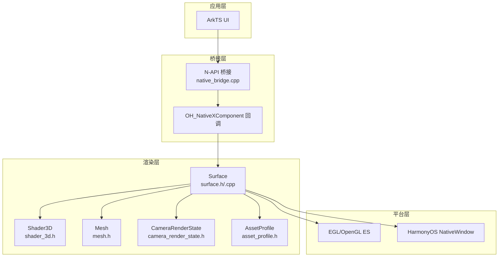
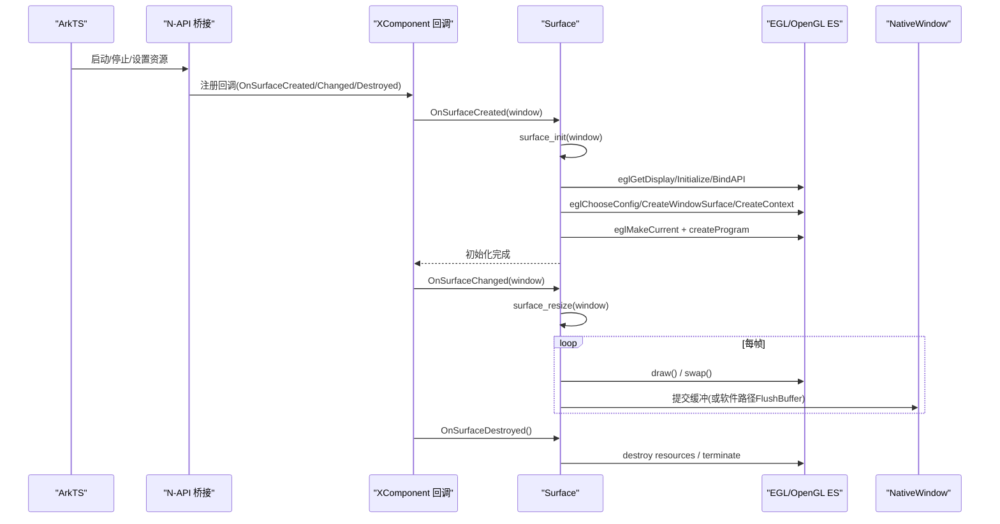
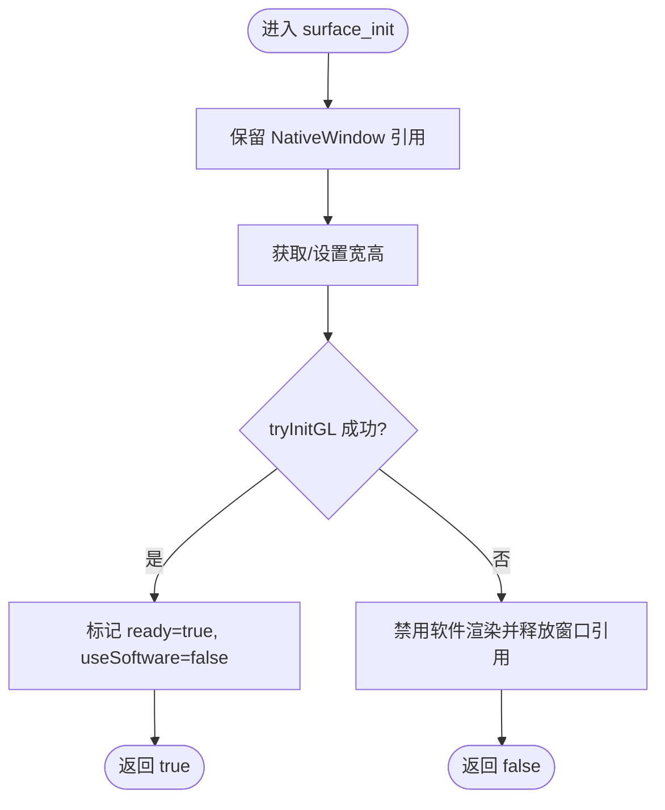
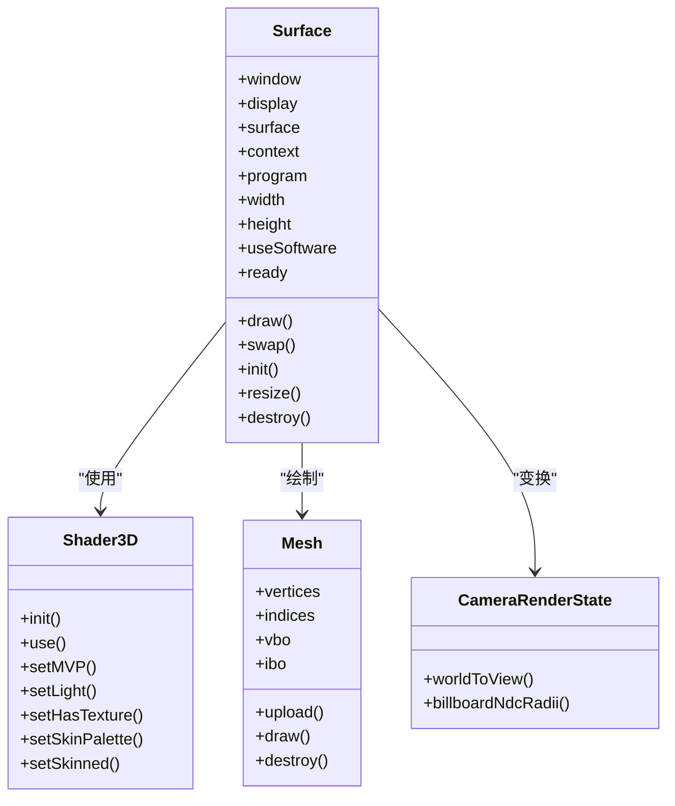
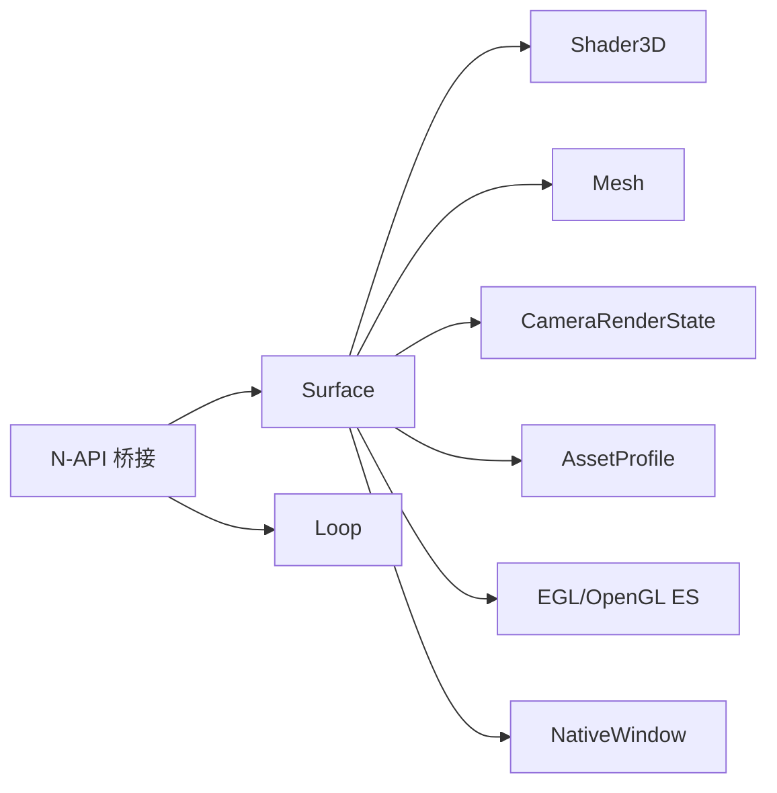

# 渲染上下文管理

<cite>
**本文引用的文件**   
- [surface.h](file://native/engine/render/surface.h)
- [surface.cpp](file://native/engine/render/surface.cpp)
- [native_bridge.cpp](file://entry/src/main/cpp/native_bridge.cpp)
- [shader_3d.h](file://native/engine/render/shader_3d.h)
- [mesh.h](file://native/engine/render/mesh.h)
- [camera_render_state.h](file://native/engine/render/camera_render_state.h)
- [asset_profile.h](file://native/engine/render/asset_profile.h)
- [lifecycle.cpp](file://native/platform/harmony/lifecycle.cpp)
</cite>

## 目录
1. [简介](#简介)
2. [项目结构](#项目结构)
3. [核心组件](#核心组件)
4. [架构总览](#架构总览)
5. [详细组件分析](#详细组件分析)
6. [依赖关系分析](#依赖关系分析)
7. [性能考量](#性能考量)
8. [故障排查指南](#故障排查指南)
9. [结论](#结论)
10. [附录](#附录)

## 简介
本技术文档聚焦 my-world 的渲染上下文管理系统，围绕 Surface 类与 EGL/OpenGL ES 初始化、窗口绑定、生命周期管理、渲染状态与缓冲区管理、线程安全机制展开。同时覆盖 HarmonyOS 原生窗口集成、跨平台兼容（软件光栅化回退）、资源分配与内存管理策略，并提供创建渲染上下文的示例流程、错误处理机制、性能优化建议与调试工具使用指南。

## 项目结构
- 渲染层核心位于 native/engine/render，包含 Surface、Mesh、Shader3D、CameraRenderState、AssetProfile 等关键类型与实现。
- 平台桥接位于 entry/src/main/cpp/native_bridge.cpp，负责 N-API 暴露、XComponent 回调注册、Surface 生命周期事件分发。
- 平台相关能力在 native/platform/harmony，如 fence_wait、lifecycle 等。

**图表来源** 
- [native_bridge.cpp:552-558](file://entry/src/main/cpp/native_bridge.cpp#L552-L558)
- [surface.h:98-245](file://native/engine/render/surface.h#L98-L245)
- [surface.cpp:1207-1306](file://native/engine/render/surface.cpp#L1207-L1306)

**章节来源**
- [native_bridge.cpp:59-111](file://entry/src/main/cpp/native_bridge.cpp#L59-L111)
- [surface.h:98-245](file://native/engine/render/surface.h#L98-L245)

## 核心组件
- Surface：封装 EGL Display/Surface/Context、OpenGL Program、窗口句柄、像素缓冲参数、2D/3D 渲染状态与资源，提供 surface_init/resize/draw/swap/destroy 接口。
- Shader3D：封装 3D 着色器程序与 uniform 设置（MVP、光照、纹理开关、环境色相、蒙皮调色板）。
- Mesh：顶点/索引数据与 GPU VBO/IBO 上传绘制。
- CameraRenderState：2D 相机变换、世界到视图映射、billboard 半径计算。
- AssetProfile：模型缩放、朝向偏移、材质染色等属性。

**章节来源**
- [surface.h:98-245](file://native/engine/render/surface.h#L98-L245)
- [shader_3d.h:18-82](file://native/engine/render/shader_3d.h#L18-L82)
- [mesh.h:42-74](file://native/engine/render/mesh.h#L42-L74)
- [camera_render_state.h:7-61](file://native/engine/render/camera_render_state.h#L7-L61)
- [asset_profile.h:9-19](file://native/engine/render/asset_profile.h#L9-L19)

## 架构总览
Surface 作为渲染上下文的核心，向上通过 N-API 暴露控制入口，向下通过 EGL/OpenGL ES 驱动图形管线，并与 HarmonyOS NativeWindow 进行窗口绑定与帧缓冲交换。当 GLES 不可用时，提供软件光栅化回退路径以维持 UI 可用。

**图表来源** 
- [native_bridge.cpp:552-558](file://entry/src/main/cpp/native_bridge.cpp#L552-L558)
- [surface.cpp:1207-1306](file://native/engine/render/surface.cpp#L1207-L1306)
- [surface.cpp:1308-1353](file://native/engine/render/surface.cpp#L1308-L1353)

## 详细组件分析

### Surface 类与 EGL/OpenGL ES 上下文
- 字段与职责
  - 窗口与缓冲：window、nativeBuffer、width/height/stride/bufferFormat。
  - EGL 对象：display、surface、context、config。
  - 渲染状态：program、locPosition、locColor、useSoftware、ready、glWindowCreated。
  - 2D/3D 渲染数据：player、cameraRenderState、particles、props、trainingTarget、pixelBuffer；以及 3D 阶段的 camera3d、meshes、shader3d、lighting、environment 等。
  - 资源管理：modelAssetMutex、PendingModelAsset、StaticModel、EnvironmentController 等。
- 初始化流程
  - surface_init：保留 NativeWindow、获取/设置几何尺寸、尝试 GLES 初始化（tryInitGL），失败则禁用软件路径并返回 false。
  - tryInitGL：eglGetDisplay/Initialize/BindAPI、选择配置、创建 WindowSurface/Context、eglMakeCurrent、校验 GL 功能、创建 Program、生成世界与 3D 资源。
- 生命周期
  - surface_resize：校验窗口一致性与 ready 状态，更新尺寸。
  - surface_draw：根据 useSoftware 分支执行 GLES 或软件光栅化绘制。
  - surface_swap：交换前后缓冲（GLES）或 FlushBuffer（软件）。
  - surface_destroy：按顺序销毁 GL 资源、EGL 对象、释放窗口引用、清理状态。

**图表来源** 
- [surface.cpp:1308-1353](file://native/engine/render/surface.cpp#L1308-L1353)
- [surface.cpp:1207-1306](file://native/engine/render/surface.cpp#L1207-L1306)

**章节来源**
- [surface.h:98-245](file://native/engine/render/surface.h#L98-L245)
- [surface.cpp:1207-1306](file://native/engine/render/surface.cpp#L1207-L1306)
- [surface.cpp:1308-1353](file://native/engine/render/surface.cpp#L1308-L1353)

### 渲染状态管理与绘制管线
- 2D 管线
  - 使用独立 Program（a_position/a_color），绘制天空渐变、网格、道具、训练目标、粒子、玩家与 VFX 叠加。
  - 关闭深度测试，启用混合，按 billboard 半径投影到 NDC。
- 3D 管线（OHOS_PLATFORM）
  - 清深度、开启深度测试与背面剔除，设置 Shader3D MVP/Model/光照/纹理开关与环境色相。
  - 地面、环境批处理（outer_ring/center_rift/backdrop/decoration）、回退网格、裂隙平面、角色与敌人、首领及电影化几何体。
  - 动画与蒙皮：SkinnedModel 与 SkinnedAnimationState，若不可用回退到静态 Mesh。
- 软件光栅化回退
  - Canvas 直接写入 NativeWindow 像素缓冲，支持 BGRA 字节序翻转，逐帧绘制后 FlushBuffer。

**图表来源** 
- [surface.h:98-245](file://native/engine/render/surface.h#L98-L245)
- [shader_3d.h:18-82](file://native/engine/render/shader_3d.h#L18-L82)
- [mesh.h:42-74](file://native/engine/render/mesh.h#L42-L74)
- [camera_render_state.h:7-61](file://native/engine/render/camera_render_state.h#L7-L61)

**章节来源**
- [surface.cpp:22-139](file://native/engine/render/surface.cpp#L22-L139)
- [surface.cpp:606-719](file://native/engine/render/surface.cpp#L606-L719)
- [surface.cpp:962-1033](file://native/engine/render/surface.cpp#L962-L1033)

### 资源分配与内存管理
- 模型与环境资产
  - setModelAsset/setEnvironmentAsset：原子拷贝与标脏，渲染阶段消费 PendingModelAsset 并替换 GPU 资源。
  - tryInitializePendingModelAssets/tryInitializePendingEnvironmentAssets：在当前 GL context 下释放旧资源、解析/上传新资源、失败回退。
- 资源销毁与废弃
  - destroy3DResource：按类别销毁 SkinnedModels、StaticEnvironmentModels、StaticMeshes、Shader3D。
  - abandon3DResources：当 eglMakeCurrent 失败时仅丢弃 CPU 句柄跟踪，避免非法 GL 删除。
  - clearModelAssets：清空待处理资产与状态标志。
- 像素缓冲与格式
  - stride/bufferFormat 记录 NativeWindow 缓冲布局，软件路径根据像素格式决定字节序翻转。

**章节来源**
- [surface.cpp:481-533](file://native/engine/render/surface.cpp#L481-L533)
- [surface.cpp:1115-1190](file://native/engine/render/surface.cpp#L1115-L1190)
- [surface.cpp:1192-1205](file://native/engine/render/surface.cpp#L1192-L1205)
- [surface.cpp:999-1033](file://native/engine/render/surface.cpp#L999-L1033)

### 线程安全机制
- windowMutex：保护 NativeWindow 指针与尺寸操作，防止并发修改。
- modelAssetMutex：保护模型与环境资产的原子替换与标脏，确保渲染线程安全消费。
- 生命周期回调：通过 Loop::withLifecycle 保证在正确的线程/上下文内执行资源操作。

**章节来源**
- [surface.h:99-101](file://native/engine/render/surface.h#L99-L101)
- [surface.cpp:1317-1329](file://native/engine/render/surface.cpp#L1317-L1329)
- [surface.cpp:463-479](file://native/engine/render/surface.cpp#L463-L479)

### 与 HarmonyOS 原生窗口的集成
- XComponent 回调注册：OnSurfaceCreated/Changed/Destroyed、DispatchTouchEvent。
- NativeWindow 操作：请求缓冲、等待 fence、映射缓冲、FlushBuffer、AbortBuffer。
- 生命周期联动：前台/后台切换时启动/停止渲染循环。

**章节来源**
- [native_bridge.cpp:552-558](file://entry/src/main/cpp/native_bridge.cpp#L552-L558)
- [surface.cpp:962-1033](file://native/engine/render/surface.cpp#L962-L1033)
- [lifecycle.cpp:1-5](file://native/platform/harmony/lifecycle.cpp#L1-L5)

### 跨平台兼容性处理
- OHOS_PLATFORM 条件编译：非平台侧对 GL 调用为空操作，便于 macOS 单元测试。
- 软件光栅化回退：当 GLES 初始化失败时，禁用软件路径以避免模拟器崩溃，保持 UI 可用。

**章节来源**
- [surface.cpp:1338-1353](file://native/engine/render/surface.cpp#L1338-L1353)
- [mesh.h:16-18](file://native/engine/render/mesh.h#L16-L18)

## 依赖关系分析
- Surface 依赖：
  - Shader3D：用于 3D 渲染管线。
  - Mesh：静态几何体与 GPU 缓冲。
  - CameraRenderState：2D 相机变换。
  - AssetProfile：模型外观配置。
  - Platform：EGL/OpenGL ES、NativeWindow、fence_wait。
- 桥接依赖：
  - N-API：暴露 API、复制 ArrayBuffer、注册 XComponent 回调。
  - Loop：生命周期控制与渲染循环调度。

**图表来源** 
- [surface.h:98-245](file://native/engine/render/surface.h#L98-L245)
- [native_bridge.cpp:518-561](file://entry/src/main/cpp/native_bridge.cpp#L518-L561)

**章节来源**
- [surface.h:98-245](file://native/engine/render/surface.h#L98-L245)
- [native_bridge.cpp:518-561](file://entry/src/main/cpp/native_bridge.cpp#L518-L561)

## 性能考量
- 减少重复上传：Mesh::upload 检查 vbo/ibo 是否已存在，避免重复创建导致泄漏。
- 批量绘制与环境评估：EnvironmentController 评估纹理层级与绘制计划，降低 DrawCall。
- 深度测试与剔除：仅在 3D 阶段开启深度测试与背面剔除，避免影响 2D 阶段。
- 软件路径限制：模拟器 GLES 不可用时禁用软件路径，避免 ProducerSurface 崩溃。
- 资源重建标记：context 重建后标记资产为 dirty，延迟到渲染阶段重建，避免阻塞。

[本节为通用指导，不直接分析具体文件]

## 故障排查指南
- 常见错误点
  - eglGetDisplay/Initialize/BindAPI 失败：检查驱动与权限。
  - eglChooseConfig 失败：确认 ES3 位与像素格式匹配。
  - eglCreateWindowSurface/Context 失败：验证窗口句柄有效性。
  - glCreateProgram/Link 失败：查看 shader 源码与版本兼容性。
  - eglMakeCurrent 失败：确保当前线程拥有正确上下文。
  - FlushBuffer/AbortBuffer 失败：检查缓冲映射与区域矩形。
- 日志定位
  - LOGI/LOGE 输出关键步骤与错误码，关注“EGL initialized”、“Program linked”、“SW frame”等关键字。
- 回退策略
  - GLES 初始化失败时禁用软件路径，保持 ArkUI 存活，呈现可恢复的“不支持渲染器”状态。

**章节来源**
- [surface.cpp:1207-1306](file://native/engine/render/surface.cpp#L1207-L1306)
- [surface.cpp:1338-1353](file://native/engine/render/surface.cpp#L1338-L1353)
- [surface.cpp:999-1033](file://native/engine/render/surface.cpp#L999-L1033)

## 结论
Surface 类在 my-world 中承担渲染上下文管理的核心职责，通过 EGL/OpenGL ES 与 HarmonyOS NativeWindow 紧密集成，提供健壮的初始化、生命周期管理、资源分配与线程安全保障。其设计兼顾了高性能渲染与跨平台兼容性，并在异常情况下提供明确的回退策略与日志诊断，便于开发与维护。

[本节为总结性内容，不直接分析具体文件]

## 附录
- 渲染上下文创建示例（步骤摘要）
  - 在 OnSurfaceCreated 中调用 surface_init(window)。
  - 若成功，启动渲染循环；否则终止并提示不支持渲染器。
  - 在 OnSurfaceChanged 中调用 surface_resize(window) 更新尺寸。
  - 每帧调用 surface_draw()/surface_swap() 完成绘制与缓冲交换。
  - 在 OnSurfaceDestroyed 中调用 surface_destroy() 清理资源。

**章节来源**
- [native_bridge.cpp:59-111](file://entry/src/main/cpp/native_bridge.cpp#L59-L111)
- [surface.cpp:1308-1353](file://native/engine/render/surface.cpp#L1308-L1353)
- [surface.cpp:1421-1481](file://native/engine/render/surface.cpp#L1421-L1481)