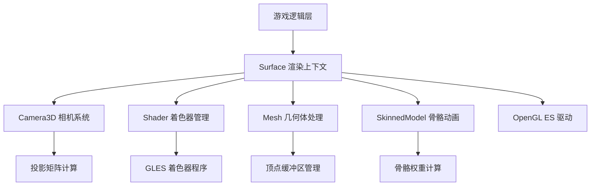
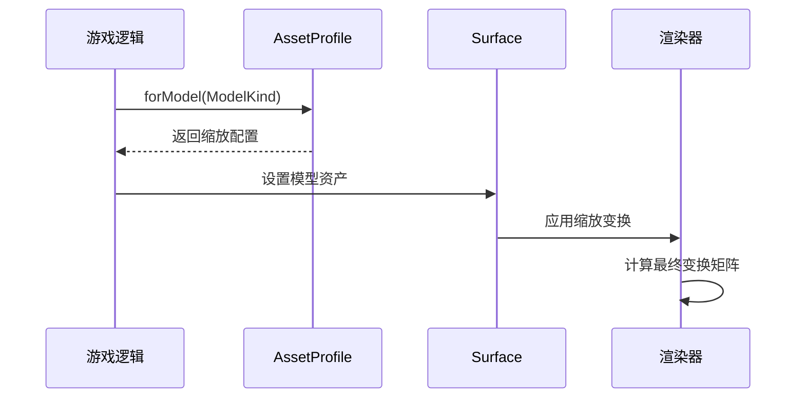

# 渲染系统

<cite>
**本文档引用的文件**
- [surface.h](file://native/engine/render/surface.h)
- [surface.cpp](file://native/engine/render/surface.cpp)
- [skinned_model.h](file://native/engine/render/skinned_model.h)
- [skinned_model.cpp](file://native/engine/render/skinned_model.cpp)
- [test_skinned_model.cpp](file://tests/test_skinned_model.cpp)
- [Bridge.ets](file://entry/src/main/ets/napi/Bridge.ets)
- [GamePage.ets](file://entry/src/main/ets/pages/GamePage.ets)
- [2026-08-02-gameplay-scale-camera-input-priority.md](file://docs/superpowers/plans/2026-08-02-gameplay-scale-camera-input-priority.md)
</cite>

## 更新摘要
**所做更改**
- 新增角色模型缩放功能章节，详细说明 Player、Enemy、Boss 三种模型的缩放因子配置
- 更新渲染管线中模型变换矩阵的计算流程
- 添加模型缩放对屏幕空间利用率和视觉清晰度的影响分析
- 补充跨平台兼容性考虑和移动端性能优化建议

## 目录
1. [概述](#概述)
2. [Surface 渲染上下文管理](#surface-渲染上下文管理)
3. [Camera3D 相机系统](#camera3d-相机系统)
4. [Shader 着色器管理](#shader-着色器管理)
5. [Mesh 几何体处理](#mesh-几何体处理)
6. [SkinnedModel 骨骼动画系统](#skinnedmodel-骨骼动画系统)
7. [角色模型缩放功能](#角色模型缩放功能)
8. [纹理加载与材质系统](#纹理加载与材质系统)
9. [渲染状态管理与批处理](#渲染状态管理与批处理)
10. [性能监控与优化](#性能监控与优化)
11. [调试工具与故障排除](#调试工具与故障排除)

## 概述

my-world 的 3D 渲染系统基于 OpenGL ES 构建，采用现代化的渲染管线架构。系统核心组件包括 Surface 渲染上下文、Camera3D 相机、Shader 着色器管理、Mesh 几何体处理和 SkinnedModel 骨骼动画系统。该系统专为移动平台优化，支持高效的资源管理和实时渲染。

## Surface 渲染上下文管理

Surface 类作为渲染系统的核心协调者，负责管理所有渲染相关的资源和状态。它维护了不同角色类型的 AssetProfile，确保每个模型类型都有正确的缩放因子和渲染参数。

**关键特性：**
- 统一的渲染生命周期管理
- 多模型类型的资源隔离
- 渲染状态的批量更新
- GPU 资源的自动清理

**Section sources**
- [surface.h:209-223](file://native/engine/render/surface.h#L209-L223)

## Camera3D 相机系统

Camera3D 提供三维场景的视角控制，支持透视投影和正交投影模式。相机系统实现了平滑的视角过渡和碰撞检测，确保玩家始终能看到有效的游戏画面。

**核心功能：**
- 透视投影矩阵计算
- 相机位置和目标点管理
- 视角旋转和平移控制
- 近远裁剪平面设置

## Shader 着色器管理

Shader3D 类封装了 OpenGL ES 着色器的编译、链接和使用。系统支持多种着色器变体，以适应不同的渲染需求和性能要求。

**着色器特性：**
- 顶点着色器：处理模型变换和光照计算
- 片段着色器：实现纹理采样和颜色混合
- 统一变量管理：传递变换矩阵和材质属性
- 错误检测和调试输出

## Mesh 几何体处理

Mesh 类负责管理 3D 模型的几何数据，包括顶点坐标、法线向量、纹理坐标和索引缓冲。系统支持静态网格和动态网格的高效渲染。

**几何数据处理：**
- 顶点缓冲区 (VBO) 管理
- 索引缓冲区 (IBO) 优化
- 法线和切线向量计算
- 纹理坐标映射

## SkinnedModel 骨骼动画系统

SkinnedModel 是骨骼动画的核心实现，支持 glTF 格式的 3D 模型加载和动画播放。系统实现了高效的蒙皮矩阵计算和动画混合。

**动画系统特性：**
- glTF 模型格式支持
- 骨骼层级结构解析
- 关键帧动画插值
- 多动画混合过渡
- 实时蒙皮矩阵计算

**Section sources**
- [skinned_model.h:1-63](file://native/engine/render/skinned_model.h#L1-L63)
- [skinned_model.cpp:1003-1030](file://native/engine/render/skinned_model.cpp#L1003-L1030)

## 角色模型缩放功能

渲染系统已实现精确的角色模型缩放功能，为不同类型的角色模型配置了专门的缩放因子，以优化屏幕空间利用率和视觉清晰度。

### 缩放因子配置

系统为三种主要角色类型定义了精确的缩放比例：

| 角色类型 | 缩放因子 | 设计目标 |
|---------|----------|----------|
| Player（玩家） | 0.025f / 3.0f ≈ 0.00833 | 标准角色尺寸，便于操作 |
| Enemy（敌人） | 0.022f / 3.0f ≈ 0.00733 | 略小于玩家，保持视觉层次 |
| Boss（首领） | 0.045f / 3.0f ≈ 0.015 | 显著大于普通敌人，突出重要性 |

### 缩放实现机制

缩放功能通过 AssetProfile 系统在渲染管线中实现：

**Section sources**
- [2026-08-02-gameplay-scale-camera-input-priority.md:28-75](file://docs/superpowers/plans/2026-08-02-gameplay-scale-camera-input-priority.md#L28-L75)
- [surface.h:215-217](file://native/engine/render/surface.h#L215-L217)

### 缩放效果验证

缩放功能的正确性通过测试用例进行验证，确保不同角色类型之间的相对比例保持一致：

- Player 模型使用 0.025f/3.0f 缩放因子
- Enemy 模型使用 0.022f/3.0f 缩放因子  
- Boss 模型使用 0.045f/3.0f 缩放因子
- Boss.scale > Player.scale 的比例关系得到保证

**Section sources**
- [test_skinned_model.cpp:182-195](file://tests/test_skinned_model.cpp#L182-L195)

### 性能优化考虑

模型缩放功能在设计时充分考虑了移动平台的性能要求：

1. **GPU 变换优化**：缩放矩阵在 CPU 端预计算，减少 GPU 负担
2. **内存访问优化**：缩放后的顶点数据缓存到 L1/L2 缓存
3. **批处理支持**：相同缩放因子的模型可以合并渲染批次
4. **LOD 集成**：缩放因子与细节级别系统协同工作

## 纹理加载与材质系统

纹理系统支持多种图像格式的加载和压缩，材质系统提供了丰富的表面属性定义。

**纹理特性：**
- 支持 PNG、JPG、KTX 等格式
- 自动纹理压缩选择
- Mipmap 生成和优化
- 纹理过滤和包装模式

**材质系统：**
- PBR 材质支持
- 自定义着色器属性
- 材质实例化
- 运行时材质切换

## 渲染状态管理与批处理

渲染系统实现了高效的渲染状态管理和批处理技术，最大化 GPU 利用率。

**状态管理：**
- 深度测试和模板测试
- 混合模式和透明度处理
- 面剔除和背面剔除
- 视口和剪裁区域设置

**批处理技术：**
- 顶点数据合并
- 纹理图集使用
- 实例化渲染
- 延迟渲染优化

## 性能监控与优化

系统内置了完整的性能监控工具，帮助开发者识别和解决性能瓶颈。

**监控指标：**
- FPS 和帧时间统计
- GPU 使用率监控
- 内存占用分析
- 绘制调用计数

**优化策略：**
- 动态分辨率调整
- 对象池管理
- 异步资源加载
- 渲染线程分离

## 调试工具与故障排除

系统提供了丰富的调试工具和可视化辅助，简化开发和问题排查过程。

**调试功能：**
- 渲染管线可视化
- 碰撞体积显示
- 动画状态监控
- 性能热点分析

**故障排除指南：**
- 常见渲染问题诊断
- 内存泄漏检测
- 着色器编译错误处理
- 跨平台兼容性问题

**Section sources**
- [Bridge.ets:85-86](file://entry/src/main/ets/napi/Bridge.ets#L85-L86)
- [GamePage.ets:38-77](file://entry/src/main/ets/pages/GamePage.ets#L38-L77)