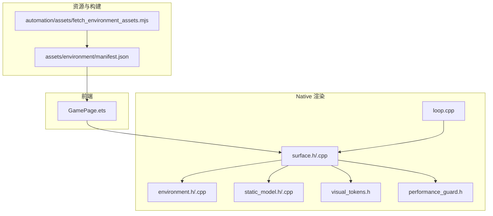
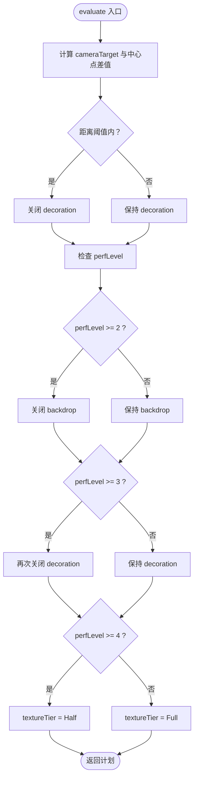
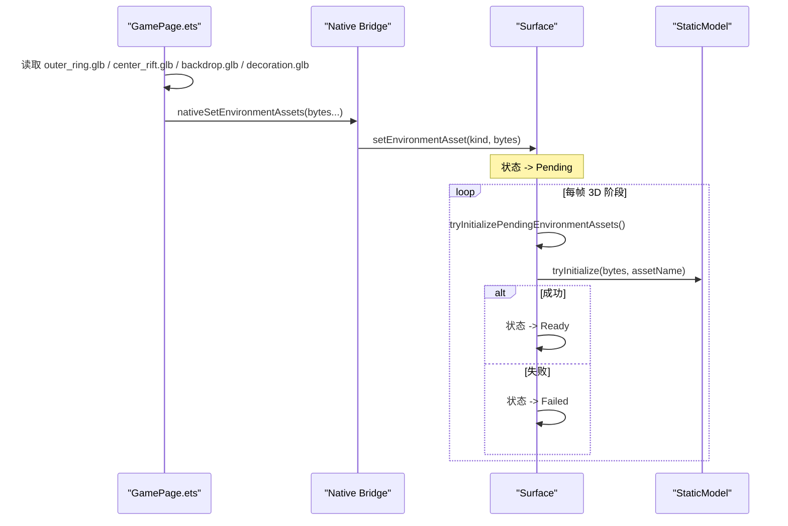
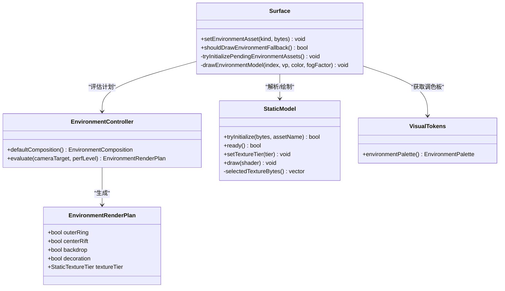
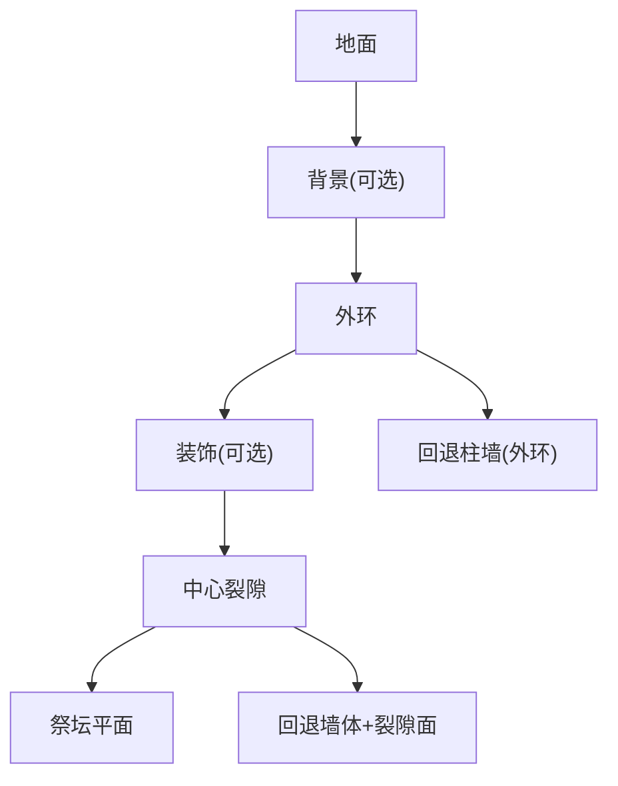
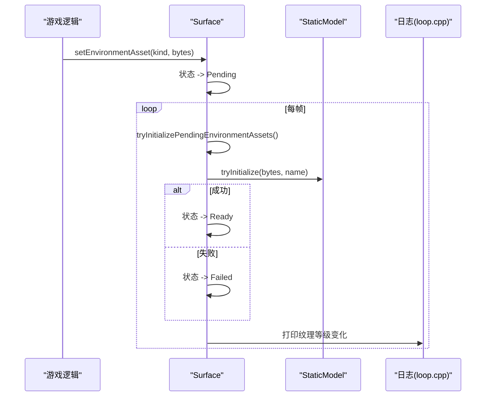
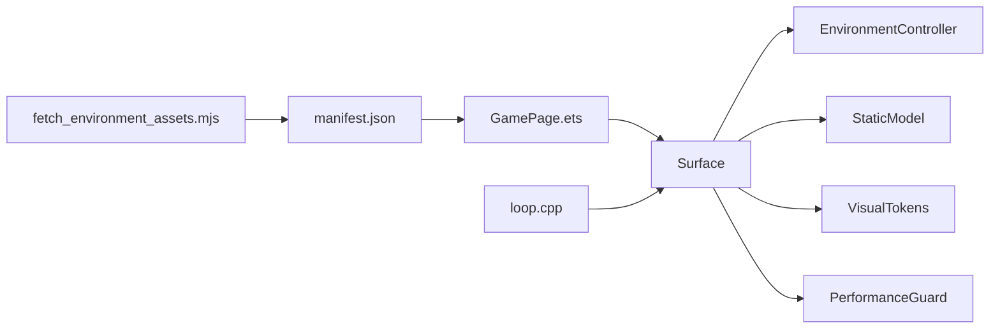

# 环境渲染

<cite>
**本文引用的文件**   
- [environment.h](file://native/engine/render/environment.h)
- [environment.cpp](file://native/engine/render/environment.cpp)
- [surface.h](file://native/engine/render/surface.h)
- [surface.cpp](file://native/engine/render/surface.cpp)
- [static_model.h](file://native/engine/render/static_model.h)
- [static_model.cpp](file://native/engine/render/static_model.cpp)
- [visual_tokens.h](file://native/engine/presentation/visual_tokens.h)
- [performance_guard.h](file://native/engine/presentation/performance_guard.h)
- [loop.cpp](file://native/engine/core/loop.cpp)
- [GamePage.ets](file://entry/src/main/ets/pages/GamePage.ets)
- [manifest.json](file://assets/environment/manifest.json)
- [fetch_environment_assets.mjs](file://automation/assets/fetch_environment_assets.mjs)
- [test_environment.cpp](file://tests/test_environment.cpp)
- [test_environment_composition.cpp](file://tests/test_environment_composition.cpp)
</cite>

## 目录
1. [引言](#引言)
2. [项目结构](#项目结构)
3. [核心组件](#核心组件)
4. [架构总览](#架构总览)
5. [详细组件分析](#详细组件分析)
6. [依赖关系分析](#依赖关系分析)
7. [性能考量](#性能考量)
8. [故障排查指南](#故障排查指南)
9. [结论](#结论)
10. [附录](#附录)

## 引言
本技术文档聚焦 my-world 的环境渲染系统，围绕 EnvironmentController 类展开，系统性阐述场景图管理、批量渲染、LOD（纹理等级）策略、环境资产加载与材质调色板、渲染计划生成、对象层次结构与可见性裁剪、渲染优化、与主渲染管线的集成及动态更新机制，并提供调试工具与可视化方法。目标是帮助读者快速理解并高效调优环境渲染子系统。

## 项目结构
环境渲染相关代码主要分布在 native/engine/render 与 presentation 层，配合前端资源加载与自动化构建脚本：
- 渲染核心：surface.h/cpp 负责帧循环中的 3D 阶段绘制与环境批处理
- 控制器与计划：environment.h/cpp 提供默认构图与渲染计划评估
- 静态模型与纹理层级：static_model.h/cpp 负责 GLB 解析、合并与纹理选择
- 视觉令牌：visual_tokens.h 提供环境调色板
- 性能监控：performance_guard.h 提供性能降级级别
- 主循环日志：loop.cpp 输出环境渲染统计
- 前端加载：GamePage.ets 读取 GLB 资源并下发至 Native
- 资产清单与构建：assets/environment/manifest.json 与 automation/assets/fetch_environment_assets.mjs 负责派生资产与校验



**图表来源** 
- [surface.h:1-252](file://native/engine/render/surface.h#L1-L252)
- [surface.cpp:600-799](file://native/engine/render/surface.cpp#L600-L799)
- [environment.h:1-46](file://native/engine/render/environment.h#L1-L46)
- [environment.cpp:1-31](file://native/engine/render/environment.cpp#L1-L31)
- [static_model.h:1-53](file://native/engine/render/static_model.h#L1-L53)
- [static_model.cpp:192-216](file://native/engine/render/static_model.cpp#L192-L216)
- [visual_tokens.h:1-35](file://native/engine/presentation/visual_tokens.h#L1-L35)
- [performance_guard.h:1-45](file://native/engine/presentation/performance_guard.h#L1-L45)
- [loop.cpp:339-354](file://native/engine/core/loop.cpp#L339-L354)
- [GamePage.ets:103-181](file://entry/src/main/ets/pages/GamePage.ets#L103-L181)
- [manifest.json:1-44](file://assets/environment/manifest.json#L1-L44)
- [fetch_environment_assets.mjs:739-772](file://automation/assets/fetch_environment_assets.mjs#L739-L772)

**章节来源**
- [surface.h:1-252](file://native/engine/render/surface.h#L1-L252)
- [surface.cpp:600-799](file://native/engine/render/surface.cpp#L600-L799)
- [environment.h:1-46](file://native/engine/render/environment.h#L1-L46)
- [environment.cpp:1-31](file://native/engine/render/environment.cpp#L1-L31)
- [static_model.h:1-53](file://native/engine/render/static_model.h#L1-L53)
- [static_model.cpp:192-216](file://native/engine/render/static_model.cpp#L192-L216)
- [visual_tokens.h:1-35](file://native/engine/presentation/visual_tokens.h#L1-L35)
- [performance_guard.h:1-45](file://native/engine/presentation/performance_guard.h#L1-L45)
- [loop.cpp:339-354](file://native/engine/core/loop.cpp#L339-L354)
- [GamePage.ets:103-181](file://entry/src/main/ets/pages/GamePage.ets#L103-L181)
- [manifest.json:1-44](file://assets/environment/manifest.json#L1-L44)
- [fetch_environment_assets.mjs:739-772](file://automation/assets/fetch_environment_assets.mjs#L739-L772)

## 核心组件
- EnvironmentController：提供默认构图与环境渲染计划评估，依据相机目标位置与性能等级决定各批次是否启用以及纹理等级。
- Surface 环境状态：维护环境资产缓冲、模型实例、批次状态、渲染计划、调色板与回退网格，驱动每帧的 3D 阶段绘制。
- StaticModel：GLB 静态模型解析、顶点/索引合并、纹理选择（Full/Half）、GPU 资源管理与绘制。
- VisualTokens：环境调色板（背景色、环境光、雾色、祭坛辉光、雾密度）。
- PerformanceGuard：基于滑动窗口的 FPS 采样，输出性能降级级别（Full/Light/Medium/Heavy/Critical）。
- Loop：每秒输出 PROFILE 日志，包含环境就绪、绘制调用数、三角面数与纹理等级等关键指标。

**章节来源**
- [environment.h:1-46](file://native/engine/render/environment.h#L1-L46)
- [environment.cpp:1-31](file://native/engine/render/environment.cpp#L1-L31)
- [surface.h:98-252](file://native/engine/render/surface.h#L98-L252)
- [surface.cpp:511-533](file://native/engine/render/surface.cpp#L511-L533)
- [static_model.h:1-53](file://native/engine/render/static_model.h#L1-L53)
- [static_model.cpp:319-348](file://native/engine/render/static_model.cpp#L319-L348)
- [visual_tokens.h:1-35](file://native/engine/presentation/visual_tokens.h#L1-L35)
- [performance_guard.h:1-45](file://native/engine/presentation/performance_guard.h#L1-L45)
- [loop.cpp:339-354](file://native/engine/core/loop.cpp#L339-L354)

## 架构总览
环境渲染在 3D 阶段由 Surface::draw3DPhase 驱动，流程如下：
- 尝试初始化待处理的模型与环境资产（异步桥接数据）
- 计算投影视图矩阵 VP
- 根据玩家位置与性能等级生成环境渲染计划
- 按顺序绘制地面、背景、外环、装饰、中心裂隙与祭坛平面
- 若批次未就绪则使用回退网格保证画面完整
- 设置环境就绪标志位，供上层逻辑判断

```mermaid
sequenceDiagram
participant Loop as "主循环(loop.cpp)"
participant Surface as "Surface(surface.cpp)"
participant EnvCtrl as "EnvironmentController(environment.cpp)"
participant Model as "StaticModel(static_model.cpp)"
participant Tokens as "VisualTokens(visual_tokens.h)"
Loop->>Surface : draw3DPhase()
Surface->>Surface : tryInitializePendingEnvironmentAssets()
Surface->>EnvCtrl : evaluate(cameraTarget, perfLevel)
EnvCtrl-->>Surface : EnvironmentRenderPlan
Surface->>Surface : 计算VP矩阵
Surface->>Model : drawEnvironmentModel(批次)
alt 批次未就绪
Surface->>Surface : drawEnvironmentFallback()/drawCenterFallback()
end
Surface->>Tokens : environmentPalette()
Surface-->>Loop : environmentReady + 统计信息
```

**图表来源** 
- [surface.cpp:600-799](file://native/engine/render/surface.cpp#L600-L799)
- [environment.cpp:13-30](file://native/engine/render/environment.cpp#L13-L30)
- [static_model.cpp:319-348](file://native/engine/render/static_model.cpp#L319-L348)
- [visual_tokens.h:28-34](file://native/engine/presentation/visual_tokens.h#L28-L34)

**章节来源**
- [surface.cpp:600-799](file://native/engine/render/surface.cpp#L600-L799)
- [environment.cpp:13-30](file://native/engine/render/environment.cpp#L13-L30)
- [static_model.cpp:319-348](file://native/engine/render/static_model.cpp#L319-L348)
- [visual_tokens.h:28-34](file://native/engine/presentation/visual_tokens.h#L28-L34)

## 详细组件分析

### EnvironmentController：场景图管理与渲染计划
- 默认构图：提供 spawn、前景遮挡、战斗锚点、祭坛锚点、相机焦点等关键坐标，用于控制镜头与布局。
- 渲染计划评估：
  - 根据相机目标与中心点的距离决定是否关闭装饰批次
  - 根据性能等级逐步禁用背景与装饰，并在临界级别切换纹理等级为 Half
- 结果：EnvironmentRenderPlan 控制 backdrop/decoration 开关与 textureTier



**图表来源** 
- [environment.cpp:13-30](file://native/engine/render/environment.cpp#L13-L30)

**章节来源**
- [environment.h:24-45](file://native/engine/render/environment.h#L24-L45)
- [environment.cpp:5-30](file://native/engine/render/environment.cpp#L5-L30)
- [test_environment_composition.cpp:1-39](file://tests/test_environment_composition.cpp#L1-L39)

### 环境资产加载与材质调色板
- 前端加载：GamePage.ets 通过资源管理器读取四个环境 GLB 文件，并通过 nativeSetEnvironmentAssets 下发到 Native。
- Native 接收与状态标记：Surface::setEnvironmentAsset 将字节数组放入 PendingModelAsset，并将对应批次状态置为 Pending。
- 解析与准备：tryInitializePendingEnvironmentAssets 在 3D 阶段消费标脏数据，调用 StaticModel::tryInitialize 解析 GLB，成功后状态置为 Ready，失败则记录错误并保持回退。
- 材质调色板：VisualTokens::environmentPalette 提供背景、环境光、雾色、祭坛辉光与雾密度，用于着色器与回退网格配色。



**图表来源** 
- [GamePage.ets:126-152](file://entry/src/main/ets/pages/GamePage.ets#L126-L152)
- [surface.h:232-245](file://native/engine/render/surface.h#L232-L245)
- [surface.cpp:511-533](file://native/engine/render/surface.cpp#L511-L533)
- [static_model.h:20-34](file://native/engine/render/static_model.h#L20-L34)
- [visual_tokens.h:28-34](file://native/engine/presentation/visual_tokens.h#L28-L34)

**章节来源**
- [GamePage.ets:126-152](file://entry/src/main/ets/pages/GamePage.ets#L126-L152)
- [surface.h:232-245](file://native/engine/render/surface.h#L232-L245)
- [surface.cpp:511-533](file://native/engine/render/surface.cpp#L511-L533)
- [static_model.h:20-34](file://native/engine/render/static_model.h#L20-L34)
- [visual_tokens.h:28-34](file://native/engine/presentation/visual_tokens.h#L28-L34)

### 批量渲染与 LOD 系统
- 批次划分：OuterRing、CenterRift、Backdrop、Decoration 四类，分别对应不同空间区域与视觉重要性。
- 渲染顺序：先绘制 Backdrop（可选），再 OuterRing，然后 Decoration（可选），最后 CenterRift；每个批次未就绪时回退到几何占位。
- LOD 策略：
  - 纹理等级：StaticTextureTier 支持 Full/Half，Critical 级别自动切换为 Half
  - 批次开关：Medium/Heavy 级别逐步关闭 Backdrop 与 Decoration
- 纹理选择：StaticModel 内部维护 full/half 纹理字节，根据 textureTier 选择上传与绑定



**图表来源** 
- [environment.h:10-45](file://native/engine/render/environment.h#L10-L45)
- [static_model.h:1-53](file://native/engine/render/static_model.h#L1-L53)
- [surface.h:98-252](file://native/engine/render/surface.h#L98-L252)
- [visual_tokens.h:1-35](file://native/engine/presentation/visual_tokens.h#L1-L35)

**章节来源**
- [surface.cpp:643-671](file://native/engine/render/surface.cpp#L643-L671)
- [static_model.cpp:319-348](file://native/engine/render/static_model.cpp#L319-L348)
- [test_environment.cpp:1-38](file://tests/test_environment.cpp#L1-L38)

### 环境对象的层次结构与可见性裁剪
- 层次结构：
  - 地面：覆盖可玩区域的平面
  - 背景（Backdrop）：远景元素，可按性能关闭
  - 外环（OuterRing）：环形结构，作为主要环境骨架
  - 装饰（Decoration）：细节装饰，近距离或低性能时关闭
  - 中心裂隙（CenterRift）：核心视觉焦点，雾色叠加
  - 祭坛平面（Altar Plane）：位于 altarAnchor 上方的小平面，强调焦点
- 可见性与裁剪：
  - 深度测试开启，背面剔除用于角色模型
  - 当批次未就绪时使用回退网格（柱子与墙体）确保视觉完整性
  - 环境就绪标志位综合 shader3dReady 与内外覆盖情况



**图表来源** 
- [surface.cpp:643-671](file://native/engine/render/surface.cpp#L643-L671)
- [surface.cpp:567-588](file://native/engine/render/surface.cpp#L567-L588)

**章节来源**
- [surface.cpp:643-671](file://native/engine/render/surface.cpp#L643-L671)
- [surface.cpp:567-588](file://native/engine/render/surface.cpp#L567-L588)

### 与主渲染管线的集成与动态更新
- 集成点：
  - 3D 阶段开始：清理深度缓冲、开启深度测试、设置 Shader3D
  - 每帧评估：根据玩家位置与性能等级重新评估渲染计划
  - 资源更新：PendingModelAsset 在 context current 时解析并替换 GPU 资源
- 动态更新机制：
  - 前端通过 nativeSetEnvironmentAssets 下发新 GLB 字节流
  - Surface 将状态置为 Pending，下一帧 3D 阶段尝试解析
  - 解析成功则状态置为 Ready，失败则记录错误并保持回退
  - 纹理等级变化时打印日志，便于调试



**图表来源** 
- [surface.h:232-245](file://native/engine/render/surface.h#L232-L245)
- [surface.cpp:511-533](file://native/engine/render/surface.cpp#L511-L533)
- [loop.cpp:339-354](file://native/engine/core/loop.cpp#L339-L354)

**章节来源**
- [surface.h:232-245](file://native/engine/render/surface.h#L232-L245)
- [surface.cpp:511-533](file://native/engine/render/surface.cpp#L511-L533)
- [loop.cpp:339-354](file://native/engine/core/loop.cpp#L339-L354)

### 环境构建示例与性能调优策略
- 构建示例：
  - 使用 fetch_environment_assets.mjs 对源 GLTF/GLB 进行分区、合并、嵌入纹理与导出为四个环境 GLB
  - manifest.json 记录派生资产的 ID、路径与 SHA256，便于校验与缓存
- 性能调优策略：
  - 调整性能等级阈值以平衡画质与帧率
  - 优先关闭装饰与背景，保留核心外环与中心裂隙
  - 在 Critical 级别切换纹理等级为 Half，降低显存带宽压力
  - 利用回退网格保证弱设备上的基本可视性

**章节来源**
- [fetch_environment_assets.mjs:739-772](file://automation/assets/fetch_environment_assets.mjs#L739-L772)
- [manifest.json:1-44](file://assets/environment/manifest.json#L1-L44)
- [performance_guard.h:1-45](file://native/engine/presentation/performance_guard.h#L1-L45)

### 环境调试工具与可视化方法
- 日志输出：
  - 每帧统计 environment_draw_calls、environment_triangles、environment_texture_tier
  - 环境就绪状态 environment_ready
  - 性能等级 performanceGuard.level()
- 可视化辅助：
  - 回退网格（柱子、墙体、裂隙平面）用于快速定位缺失批次
  - 调色板颜色区分不同区域（环境光、雾色、祭坛辉光）
- 测试用例：
  - test_environment.cpp 验证渲染计划退化顺序
  - test_environment_composition.cpp 验证默认构图的相对位置约束

**章节来源**
- [loop.cpp:339-354](file://native/engine/core/loop.cpp#L339-L354)
- [surface.cpp:643-671](file://native/engine/render/surface.cpp#L643-L671)
- [test_environment.cpp:1-38](file://tests/test_environment.cpp#L1-L38)
- [test_environment_composition.cpp:1-39](file://tests/test_environment_composition.cpp#L1-L39)

## 依赖关系分析
- Surface 依赖：
  - EnvironmentController：评估渲染计划
  - StaticModel：解析与绘制环境模型
  - VisualTokens：获取环境调色板
  - PerformanceGuard：获取当前性能等级
- 前端依赖：
  - GamePage.ets 依赖资源管理器与原生桥接函数
- 构建依赖：
  - fetch_environment_assets.mjs 依赖源资产与纹理处理工具
  - manifest.json 依赖派生资产列表与校验信息



**图表来源** 
- [GamePage.ets:126-152](file://entry/src/main/ets/pages/GamePage.ets#L126-L152)
- [surface.h:98-252](file://native/engine/render/surface.h#L98-L252)
- [environment.h:1-46](file://native/engine/render/environment.h#L1-L46)
- [static_model.h:1-53](file://native/engine/render/static_model.h#L1-L53)
- [visual_tokens.h:1-35](file://native/engine/presentation/visual_tokens.h#L1-L35)
- [performance_guard.h:1-45](file://native/engine/presentation/performance_guard.h#L1-L45)
- [loop.cpp:339-354](file://native/engine/core/loop.cpp#L339-L354)
- [fetch_environment_assets.mjs:739-772](file://automation/assets/fetch_environment_assets.mjs#L739-L772)
- [manifest.json:1-44](file://assets/environment/manifest.json#L1-L44)

**章节来源**
- [surface.h:98-252](file://native/engine/render/surface.h#L98-L252)
- [environment.h:1-46](file://native/engine/render/environment.h#L1-L46)
- [static_model.h:1-53](file://native/engine/render/static_model.h#L1-L53)
- [visual_tokens.h:1-35](file://native/engine/presentation/visual_tokens.h#L1-L35)
- [performance_guard.h:1-45](file://native/engine/presentation/performance_guard.h#L1-L45)
- [loop.cpp:339-354](file://native/engine/core/loop.cpp#L339-L354)
- [GamePage.ets:126-152](file://entry/src/main/ets/pages/GamePage.ets#L126-L152)
- [fetch_environment_assets.mjs:739-772](file://automation/assets/fetch_environment_assets.mjs#L739-L772)
- [manifest.json:1-44](file://assets/environment/manifest.json#L1-L44)

## 性能考量
- 纹理等级切换：在 Critical 级别自动切换为 Half，减少显存占用与带宽
- 批次开关：Medium/Heavy 级别逐步关闭 Backdrop 与 Decoration，降低绘制负载
- 回退网格：确保弱设备上仍有基本可视性，避免黑屏
- 日志监控：每秒输出 FPS、环境就绪、绘制调用、三角面数与纹理等级，便于定位瓶颈
- 建议：
  - 根据目标设备调整性能等级阈值
  - 优化 GLB 模型合并与纹理压缩
  - 减少不必要的批次数量与复杂度

[本节为通用指导，不直接分析具体文件]

## 故障排查指南
- 常见问题：
  - 环境资产解析失败：检查 GLB 结构、外部 URI、扩展支持
  - 批次未就绪：确认前端是否正确下发字节流，Native 是否处于 context current
  - 纹理等级未切换：检查性能等级与日志输出
- 排查步骤：
  - 查看日志中的 lastError 与状态码
  - 使用回退网格确认缺失批次
  - 验证 manifest.json 中资产路径与 SHA256
- 参考实现：
  - StaticModel 解析失败路径与错误消息
  - Surface 状态机与回退逻辑

**章节来源**
- [static_model.cpp:192-216](file://native/engine/render/static_model.cpp#L192-L216)
- [surface.cpp:511-533](file://native/engine/render/surface.cpp#L511-L533)
- [surface.cpp:567-588](file://native/engine/render/surface.cpp#L567-L588)

## 结论
my-world 的环境渲染系统通过 EnvironmentController 与 Surface 的协作，实现了灵活的渲染计划评估、稳定的批量渲染与自适应的 LOD 策略。结合前端资源加载、自动化构建与完善的调试工具，系统在多平台上具备良好的一致性与可维护性。通过合理调优性能等级与资产质量，可在不同设备上取得平衡的视觉效果与帧率表现。

[本节为总结性内容，不直接分析具体文件]

## 附录
- 术语表：
  - 批次（Batch）：环境渲染的基本单位，如外环、中心裂隙等
  - 纹理等级（Texture Tier）：Full/Half，影响纹理分辨率与显存占用
  - 回退网格（Fallback Mesh）：几何占位，确保弱设备可视性
  - 性能等级（Perf Level）：Full/Light/Medium/Heavy/Critical，驱动渲染降级
- 参考测试：
  - test_environment.cpp：验证渲染计划退化顺序
  - test_environment_composition.cpp：验证默认构图约束

[本节为补充信息，不直接分析具体文件]