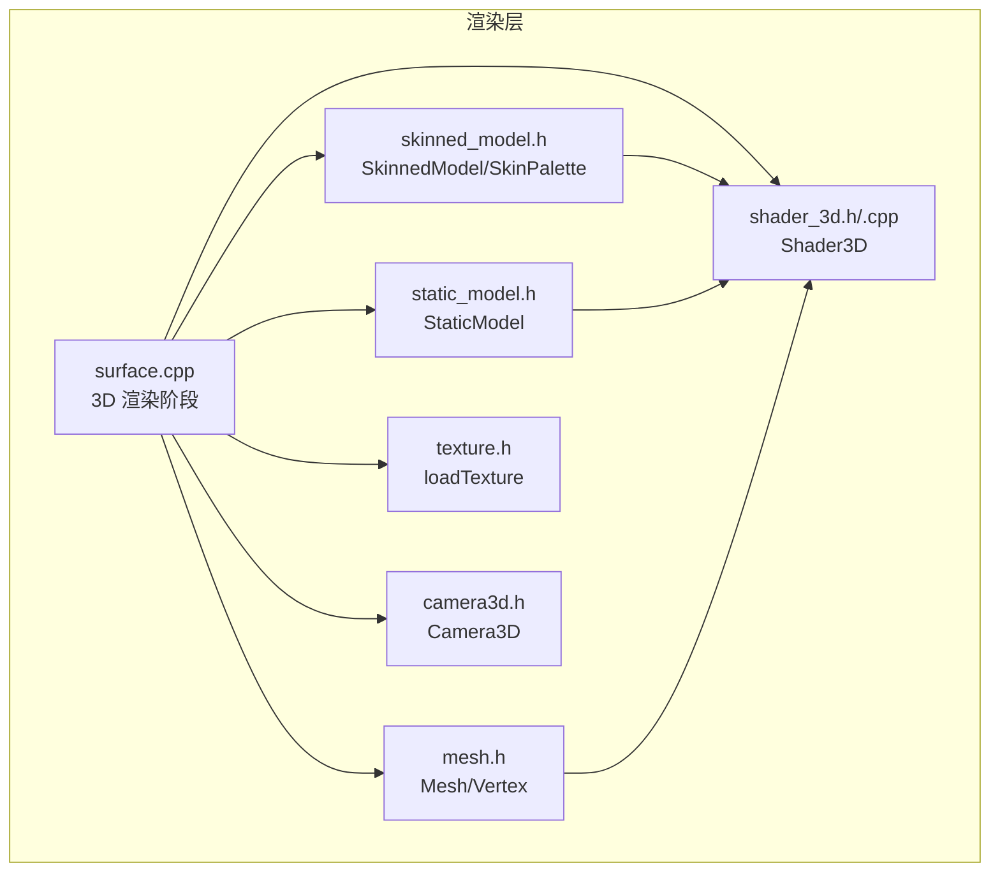
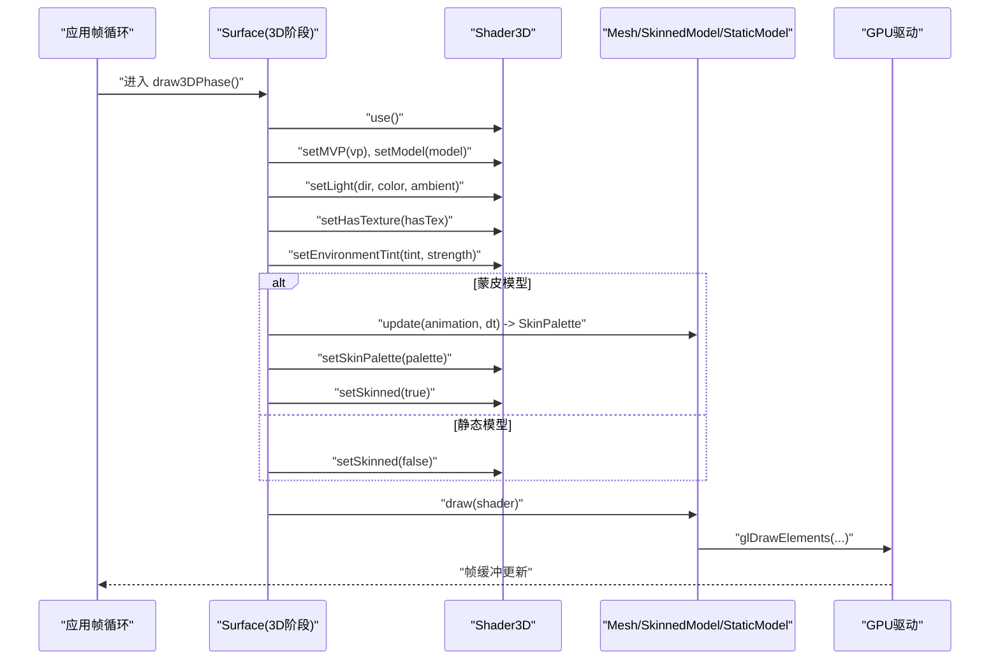
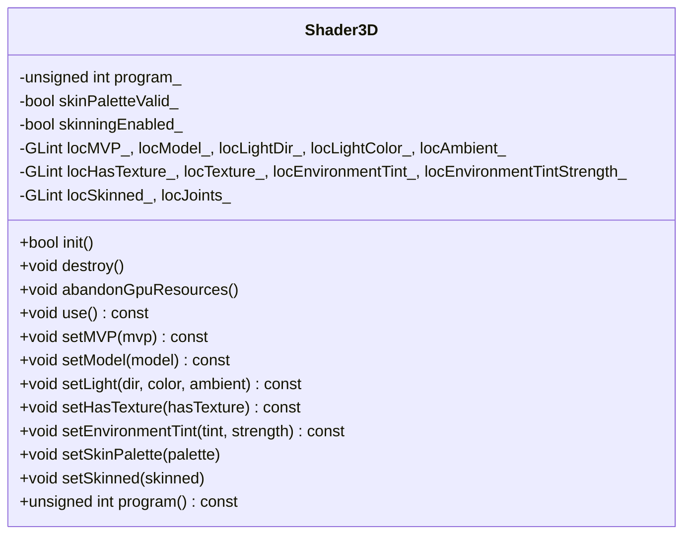
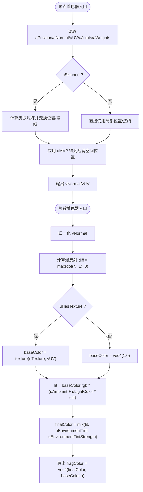
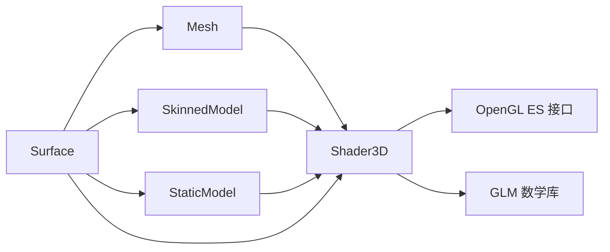

# 着色器系统

<cite>
**本文引用的文件**   
- [shader_3d.h](file://native/engine/render/shader_3d.h)
- [shader_3d.cpp](file://native/engine/render/shader_3d.cpp)
- [mesh.h](file://native/engine/render/mesh.h)
- [skinned_model.h](file://native/engine/render/skinned_model.h)
- [static_model.h](file://native/engine/render/static_model.h)
- [texture.h](file://native/engine/render/texture.h)
- [camera3d.h](file://native/engine/render/camera3d.h)
- [surface.cpp](file://native/engine/render/surface.cpp)
- [test_shader_3d.cpp](file://tests/test_shader_3d.cpp)
</cite>

## 目录
1. [简介](#简介)
2. [项目结构](#项目结构)
3. [核心组件](#核心组件)
4. [架构总览](#架构总览)
5. [详细组件分析](#详细组件分析)
6. [依赖关系分析](#依赖关系分析)
7. [性能考量](#性能考量)
8. [故障排查指南](#故障排查指南)
9. [结论](#结论)
10. [附录：着色器编写示例与调试技巧](#附录着色器编写示例与调试技巧)

## 简介
本技术文档聚焦 my-world 的 3D 着色器系统，围绕 Shader3D 类的实现展开，涵盖 GLSL 着色器编译、程序链接、uniform 变量管理、顶点/片段着色器功能（光照计算、纹理采样、动画混合）、参数传递与状态管理、渲染管线集成、以及热重载与动态更新机制。文档同时提供具体的着色器编写示例与调试技巧，帮助开发者快速理解并高效扩展该子系统。

## 项目结构
与着色器系统直接相关的代码主要位于 native/engine/render 目录下，包括：
- shader_3d.h/.cpp：Shader3D 类定义与实现，内嵌 GLSL 源码，负责编译、链接与 uniform 设置。
- mesh.h：顶点数据结构与硬编码几何体生成，定义属性槽位布局。
- skinned_model.h：骨骼动画与蒙皮数据模型，提供 SkinPalette 等关键结构。
- static_model.h：静态模型封装，支持纹理层级切换与绘制。
- texture.h：纹理加载接口（PNG）。
- camera3d.h：3D 相机矩阵计算，为着色器提供投影与视图矩阵。
- surface.cpp：渲染主循环与 3D 阶段调用，演示如何绑定 Shader3D 与 Mesh/SkinnedModel/StaticModel。
- tests/test_shader_3d.cpp：对 Shader3D 的状态机与边界条件进行验证。

图表来源
- [surface.cpp:606-670](file://native/engine/render/surface.cpp#L606-L670)
- [shader_3d.h:18-81](file://native/engine/render/shader_3d.h#L18-L81)
- [mesh.h:20-41](file://native/engine/render/mesh.h#L20-L41)
- [skinned_model.h:33-36](file://native/engine/render/skinned_model.h#L33-L36)
- [static_model.h:20-52](file://native/engine/render/static_model.h#L20-L52)
- [texture.h:1-11](file://native/engine/render/texture.h#L1-L11)
- [camera3d.h:10-36](file://native/engine/render/camera3d.h#L10-L36)

章节来源
- [shader_3d.h:1-82](file://native/engine/render/shader_3d.h#L1-L82)
- [shader_3d.cpp:1-305](file://native/engine/render/shader_3d.cpp#L1-L305)
- [mesh.h:1-74](file://native/engine/render/mesh.h#L1-L74)
- [skinned_model.h:1-136](file://native/engine/render/skinned_model.h#L1-L136)
- [static_model.h:1-53](file://native/engine/render/static_model.h#L1-L53)
- [texture.h:1-11](file://native/engine/render/texture.h#L1-L11)
- [camera3d.h:1-37](file://native/engine/render/camera3d.h#L1-L37)
- [surface.cpp:606-670](file://native/engine/render/surface.cpp#L606-L670)

## 核心组件
- Shader3D：封装 GL Program 生命周期与 uniform 设置接口，包含 MVP、模型矩阵、光照、纹理开关、环境染色、蒙皮调色板与蒙皮开关。
- Mesh：定义顶点布局与属性槽位（位置、法线、UV、关节索引、权重），并提供上传与绘制接口。
- SkinnedModel：维护骨骼动画状态与蒙皮矩阵（SkinPalette），在每帧更新后通过 Shader3D 上传到 GPU。
- StaticModel：静态网格封装，支持纹理层级切换与绘制。
- Texture：加载 PNG 纹理至 GPU 纹理对象。
- Camera3D：计算 view/projection 矩阵，供 Shader3D 使用。

章节来源
- [shader_3d.h:18-81](file://native/engine/render/shader_3d.h#L18-L81)
- [mesh.h:20-41](file://native/engine/render/mesh.h#L20-L41)
- [skinned_model.h:33-36](file://native/engine/render/skinned_model.h#L33-L36)
- [static_model.h:20-52](file://native/engine/render/static_model.h#L20-L52)
- [texture.h:1-11](file://native/engine/render/texture.h#L1-L11)
- [camera3d.h:10-36](file://native/engine/render/camera3d.h#L10-L36)

## 架构总览
Shader3D 作为 3D 渲染管线中的“着色器管理器”，在每一帧由 Surface 的 3D 阶段调用 use() 激活，并通过 setMVP/setModel/setLight/setHasTexture/setEnvironmentTint/setSkinPalette/setSkinned 等方法完成状态设置。Mesh/SkinnedModel/StaticModel 在绘制前绑定相应资源，最终调用 glDrawElements 完成绘制。

图表来源
- [surface.cpp:606-670](file://native/engine/render/surface.cpp#L606-L670)
- [shader_3d.cpp:73-159](file://native/engine/render/shader_3d.cpp#L73-L159)
- [mesh.h:42-63](file://native/engine/render/mesh.h#L42-L63)
- [skinned_model.h:98-135](file://native/engine/render/skinned_model.h#L98-L135)

## 详细组件分析

### Shader3D 类实现
- 初始化与销毁
  - init()：创建并编译顶点/片段着色器，链接 Program，缓存 uniform 位置；失败时清理中间资源。
  - destroy()：删除 Program 句柄并重置 uniform 位置。
  - abandonGpuResources()：在上下文不可 current 时仅清除 CPU 侧跟踪，避免非法 GL 调用。
- Uniform 设置
  - setMVP/setModel：设置变换矩阵。
  - setLight：设置方向光、颜色与环境光。
  - setHasTexture：控制片段着色器是否采样纹理。
  - setEnvironmentTint：环境染色混合强度。
  - setSkinPalette/setSkinned：上传骨骼调色板并启用/禁用蒙皮。
- 平台隔离
  - 所有 GL 调用被 #ifdef OHOS_PLATFORM 包裹，非平台侧为空操作，便于跨平台开发与测试。

图表来源
- [shader_3d.h:18-81](file://native/engine/render/shader_3d.h#L18-L81)
- [shader_3d.cpp:73-305](file://native/engine/render/shader_3d.cpp#L73-L305)

章节来源
- [shader_3d.h:18-81](file://native/engine/render/shader_3d.h#L18-L81)
- [shader_3d.cpp:73-305](file://native/engine/render/shader_3d.cpp#L73-L305)

### 顶点着色器与片段着色器
- 顶点着色器
  - 输入属性：位置、法线、UV、关节索引、权重。
  - 蒙皮处理：根据 uSkinned 与 uJoints[64] 计算皮肤变换矩阵，对位置与法线进行变换。
  - 输出：世界空间法线、UV 坐标，传递给片段着色器。
- 片段着色器
  - 光照计算：基于归一化法线与方向光进行漫反射计算，结合环境光。
  - 纹理采样：根据 uHasTexture 决定是否采样 uTexture。
  - 环境染色：将结果与环境染色混合，输出最终颜色与透明度。

图表来源
- [shader_3d.cpp:22-69](file://native/engine/render/shader_3d.cpp#L22-L69)

章节来源
- [shader_3d.cpp:22-69](file://native/engine/render/shader_3d.cpp#L22-L69)

### 与模型数据的绑定方式
- Mesh
  - 属性槽位：位置(0)、法线(1)、UV(2)，可选关节索引(3)、权重(4)。
  - 静态网格仅绑定前三个槽位，简化绘制路径。
- SkinnedModel
  - 每帧通过 update(animation, dt) 计算 SkinPalette（最多 64 个矩阵），并由 Shader3D::setSkinPalette 上传。
  - setSkinned(true) 启用蒙皮分支，否则回退到静态变换。
- StaticModel
  - 支持纹理层级切换（Full/Half），在绘制前设置纹理状态。

章节来源
- [mesh.h:20-41](file://native/engine/render/mesh.h#L20-L41)
- [skinned_model.h:94-112](file://native/engine/render/skinned_model.h#L94-L112)
- [static_model.h:20-52](file://native/engine/render/static_model.h#L20-L52)

### 渲染管线集成
- Surface::draw3DPhase
  - 清深度缓冲并开启深度测试。
  - 调用 Shader3D::use() 激活程序，设置 MVP、模型矩阵、光照、纹理开关、环境染色。
  - 对于蒙皮模型，先更新动画并上传 SkinPalette，再调用 setSkinned(true)。
  - 调用模型的 draw(shader) 完成绘制。
- 相机矩阵
  - 使用 Camera3D 计算 projectionMatrix 与 viewMatrix，组合为 vp 传入 Shader3D。

章节来源
- [surface.cpp:606-670](file://native/engine/render/surface.cpp#L606-L670)
- [camera3d.h:28-36](file://native/engine/render/camera3d.h#L28-L36)

## 依赖关系分析
- Shader3D 依赖 GL 接口与 GLM 数学库，用于矩阵运算与向量类型。
- Mesh/SkinnedModel/StaticModel 依赖 Shader3D 提供的 uniform 设置接口以完成渲染状态配置。
- Surface 协调各模块，负责生命周期管理与帧级状态更新。

图表来源
- [shader_3d.cpp:1-16](file://native/engine/render/shader_3d.cpp#L1-L16)
- [mesh.h:16-18](file://native/engine/render/mesh.h#L16-L18)
- [surface.cpp:12-14](file://native/engine/render/surface.cpp#L12-L14)

章节来源
- [shader_3d.cpp:1-16](file://native/engine/render/shader_3d.cpp#L1-L16)
- [mesh.h:16-18](file://native/engine/render/mesh.h#L16-L18)
- [surface.cpp:12-14](file://native/engine/render/surface.cpp#L12-L14)

## 性能考量
- Uniform 缓存：init() 中缓存所有 uniform 位置，避免每帧查询开销。
- 属性槽位最小化：静态网格仅绑定必要属性，减少带宽与状态切换。
- 蒙皮上限：限制关节数量不超过 64，防止过大调色板导致性能下降。
- 纹理层级：StaticModel 支持 Full/Half 纹理层级，按场景需求切换以降低内存与带宽压力。
- 深度测试仅在 3D 阶段开启，避免影响 2D 绘制。

章节来源
- [shader_3d.cpp:139-156](file://native/engine/render/shader_3d.cpp#L139-L156)
- [mesh.h:35-41](file://native/engine/render/mesh.h#L35-L41)
- [skinned_model.h:19](file://native/engine/render/skinned_model.h#L19)
- [static_model.h:12-18](file://native/engine/render/static_model.h#L12-L18)
- [surface.cpp:615-617](file://native/engine/render/surface.cpp#L615-L617)

## 故障排查指南
- 着色器编译失败
  - 检查 GLSL 版本与语法兼容性（#version 300 es）。
  - 查看编译日志（getShaderInfoLog）定位错误行与原因。
- 程序链接失败
  - 确认 uniform 名称与类型一致，属性槽位正确绑定。
  - 检查链接日志（getProgramInfoLog）获取详细信息。
- 运行时崩溃或无输出
  - 确保在上下文 current 时调用 GL 函数。
  - 验证 MVP、模型矩阵与光照参数合理。
  - 检查纹理是否成功加载并绑定。
- 蒙皮异常
  - 确认 SkinPalette 有效且关节数不超过上限。
  - setSkinned(true) 仅在 palette 有效时生效。

章节来源
- [shader_3d.cpp:84-112](file://native/engine/render/shader_3d.cpp#L84-L112)
- [shader_3d.cpp:128-136](file://native/engine/render/shader_3d.cpp#L128-L136)
- [surface.cpp:1059-1077](file://native/engine/render/surface.cpp#L1059-L1077)
- [test_shader_3d.cpp:15-35](file://tests/test_shader_3d.cpp#L15-L35)

## 结论
Shader3D 为 my-world 提供了稳定高效的 3D 着色器管理能力，涵盖 GLSL 编译、程序链接、uniform 管理与蒙皮支持。通过与 Mesh/SkinnedModel/StaticModel 的紧密集成，实现了灵活的光照、纹理与环境染色效果。合理的性能优化与完善的错误处理机制确保了在不同平台上的健壮性与可移植性。

## 附录：着色器编写示例与调试技巧
- 编写顶点着色器
  - 使用 layout(location) 显式绑定属性槽位，确保与 Mesh 定义一致。
  - 蒙皮分支需正确处理位置与法线变换，避免法线缩放失真。
- 编写片段着色器
  - 统一使用 mediump float 精度，平衡质量与性能。
  - 纹理采样前检查 uHasTexture，避免无效采样。
  - 环境染色混合强度应控制在合理范围，避免过曝或过暗。
- 调试技巧
  - 打印 uniform 位置与属性槽位，确认绑定正确。
  - 使用 glGetError() 捕获 OpenGL 错误码。
  - 逐步注释 GLSL 代码定位问题片段。
  - 在非平台侧运行单元测试，验证逻辑正确性。

章节来源
- [shader_3d.cpp:22-69](file://native/engine/render/shader_3d.cpp#L22-L69)
- [mesh.h:35-41](file://native/engine/render/mesh.h#L35-L41)
- [surface.cpp:1059-1077](file://native/engine/render/surface.cpp#L1059-L1077)