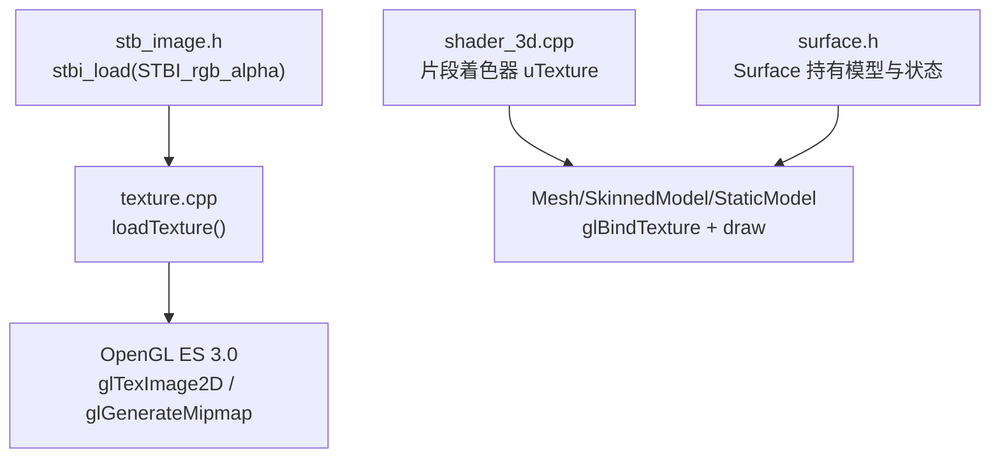
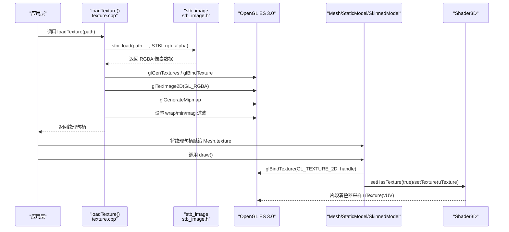
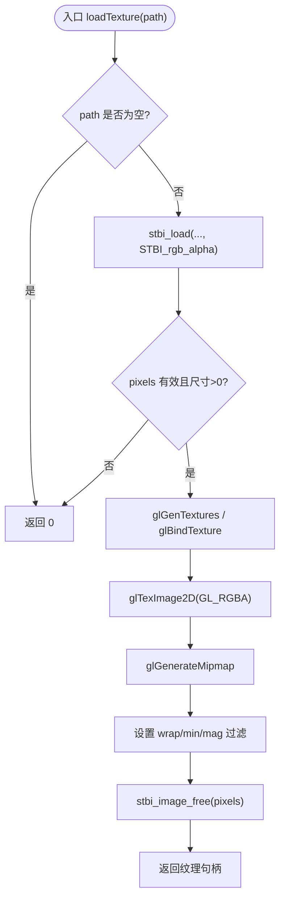
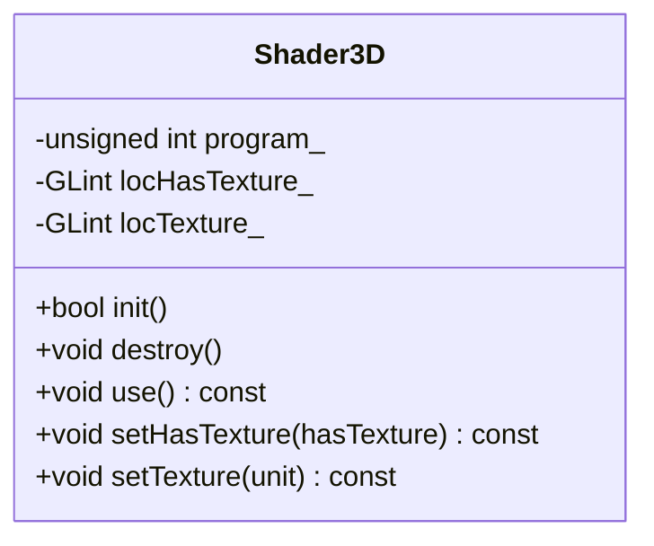
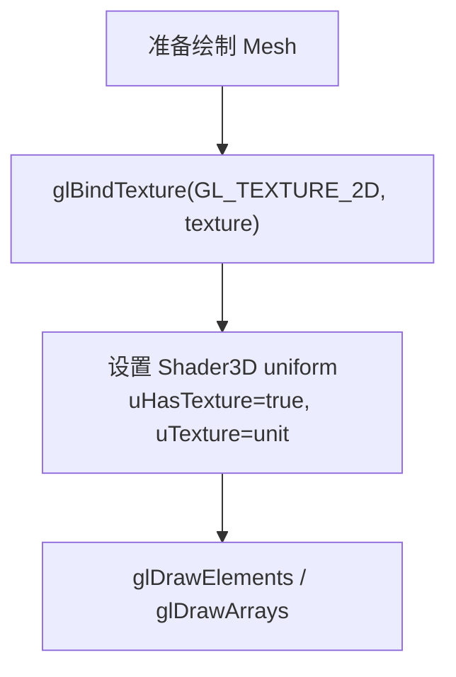
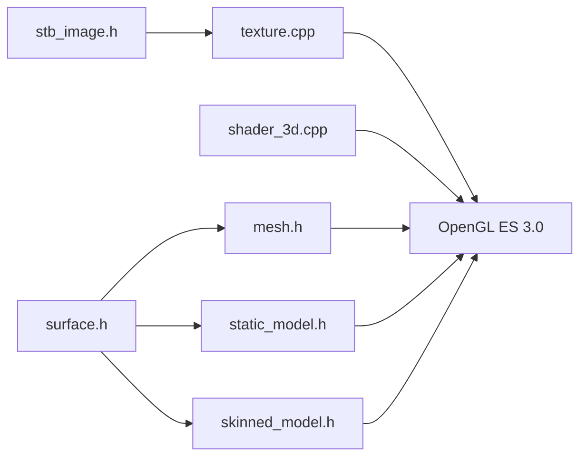

# 纹理系统

<cite>
**本文引用的文件**   
- [texture.h](file://native/engine/render/texture.h)
- [texture.cpp](file://native/engine/render/texture.cpp)
- [stb_image.h](file://native/engine/render/stb_image.h)
- [shader_3d.h](file://native/engine/render/shader_3d.h)
- [shader_3d.cpp](file://native/engine/render/shader_3d.cpp)
- [mesh.h](file://native/engine/render/mesh.h)
- [static_model.h](file://native/engine/render/static_model.h)
- [skinned_model.h](file://native/engine/render/skinned_model.h)
- [surface.h](file://native/engine/render/surface.h)
</cite>

## 目录
1. [简介](#简介)
2. [项目结构](#项目结构)
3. [核心组件](#核心组件)
4. [架构总览](#架构总览)
5. [详细组件分析](#详细组件分析)
6. [依赖关系分析](#依赖关系分析)
7. [性能考量](#性能考量)
8. [故障排查指南](#故障排查指南)
9. [结论](#结论)
10. [附录](#附录)

## 简介
本技术文档围绕 my-world 的纹理系统，系统性阐述 Texture 加载与上传流程、格式转换、GPU 纹理创建、mipmap 生成、采样模式与过滤策略、多纹理绑定方式，以及与着色器的采样接口。同时给出内存管理策略、调试工具与性能优化建议，帮助开发者在 HarmonyOS GLES3 环境下高效使用纹理资源。

## 项目结构
纹理相关代码集中在渲染子系统：
- 纹理加载与上传：texture.h/.cpp（基于 stb_image）
- 着色器与采样接口：shader_3d.h/.cpp（GLES3 ES 3.0）
- 网格与模型：mesh.h、static_model.h、skinned_model.h（纹理绑定与替换）
- 渲染上下文：surface.h（持有模型与状态，驱动绘制）

图表来源
- [texture.cpp:15-45](file://native/engine/render/texture.cpp#L15-L45)
- [stb_image.h:129-200](file://native/engine/render/stb_image.h#L129-L200)
- [shader_3d.cpp:47-70](file://native/engine/render/shader_3d.cpp#L47-L70)
- [mesh.h:42-63](file://native/engine/render/mesh.h#L42-L63)
- [surface.h:123-176](file://native/engine/render/surface.h#L123-L176)

章节来源
- [texture.h:1-11](file://native/engine/render/texture.h#L1-L11)
- [texture.cpp:1-46](file://native/engine/render/texture.cpp#L1-L46)
- [stb_image.h:129-200](file://native/engine/render/stb_image.h#L129-L200)
- [shader_3d.h:18-82](file://native/engine/render/shader_3d.h#L18-L82)
- [shader_3d.cpp:1-200](file://native/engine/render/shader_3d.cpp#L1-L200)
- [mesh.h:1-74](file://native/engine/render/mesh.h#L1-L74)
- [static_model.h:1-53](file://native/engine/render/static_model.h#L1-L53)
- [skinned_model.h:1-136](file://native/engine/render/skinned_model.h#L1-L136)
- [surface.h:1-252](file://native/engine/render/surface.h#L1-L252)

## 核心组件
- 纹理加载器 loadTexture(path)
  - 输入：PNG 路径字符串
  - 输出：GL 纹理句柄；失败返回 0
  - 行为：通过 stb_image 解码为 RGBA，创建 GL 纹理，设置 wrap/min/mag 过滤，生成 mipmap，释放像素内存
- 3D 着色器 Shader3D
  - 提供 uniform 接口 setHasTexture(bool)、setTexture(sampler2D) 等
  - 片段着色器根据 uHasTexture 决定是否采样 uTexture
- 网格与模型
  - Mesh 持有 texture 字段并在 draw 前 glBindTexture
  - StaticModel/SkinnedModel 支持纹理字节级替换与 GPU 重建（含 mipmap）
- 渲染上下文 Surface
  - 持有各类模型实例与动画状态，组织绘制流程

章节来源
- [texture.h:1-11](file://native/engine/render/texture.h#L1-L11)
- [texture.cpp:15-45](file://native/engine/render/texture.cpp#L15-L45)
- [shader_3d.h:43-46](file://native/engine/render/shader_3d.h#L43-L46)
- [shader_3d.cpp:47-70](file://native/engine/render/shader_3d.cpp#L47-L70)
- [mesh.h:42-63](file://native/engine/render/mesh.h#L42-L63)
- [static_model.h:20-53](file://native/engine/render/static_model.h#L20-L53)
- [skinned_model.h:98-136](file://native/engine/render/skinned_model.h#L98-L136)
- [surface.h:123-176](file://native/engine/render/surface.h#L123-L176)

## 架构总览
纹理从磁盘到 GPU 的完整链路如下：

图表来源
- [texture.cpp:15-45](file://native/engine/render/texture.cpp#L15-L45)
- [stb_image.h:129-200](file://native/engine/render/stb_image.h#L129-L200)
- [shader_3d.cpp:47-70](file://native/engine/render/shader_3d.cpp#L47-L70)
- [mesh.h:42-63](file://native/engine/render/mesh.h#L42-L63)

## 详细组件分析

### 纹理加载与上传（loadTexture）
- 输入校验：空指针直接返回 0
- 图像解码：统一以 STBI_rgb_alpha 输出 RGBA，简化后续 GL 上传
- GPU 上传：
  - 创建并绑定 2D 纹理
  - glTexImage2D 指定 GL_RGBA/GL_UNSIGNED_BYTE
  - glGenerateMipmap 自动生成多级渐远纹理
  - 设置 wrapS/wrapT 为 CLAMP_TO_EDGE
  - minFilter 为 LINEAR_MIPMAP_LINEAR，magFilter 为 LINEAR
- 内存管理：stbi_image_free 释放 CPU 侧像素内存

图表来源
- [texture.cpp:15-45](file://native/engine/render/texture.cpp#L15-L45)

章节来源
- [texture.cpp:15-45](file://native/engine/render/texture.cpp#L15-L45)

### 着色器与纹理采样接口（Shader3D）
- 顶点着色器：传递 UV 至片段着色器
- 片段着色器：
  - 声明 sampler2D uTexture
  - 通过 uniform bool uHasTexture 控制是否采样
  - 基础颜色 baseColor = uHasTexture ? texture(uTexture, vUV) : vec4(1.0)
- API：
  - setHasTexture(bool)：切换采样开关
  - setTexture(...)：绑定纹理单元到 uTexture（由调用方完成）

图表来源
- [shader_3d.h:18-82](file://native/engine/render/shader_3d.h#L18-L82)
- [shader_3d.cpp:47-70](file://native/engine/render/shader_3d.cpp#L47-L70)

章节来源
- [shader_3d.h:18-82](file://native/engine/render/shader_3d.h#L18-L82)
- [shader_3d.cpp:1-200](file://native/engine/render/shader_3d.cpp#L1-L200)

### 网格与模型的纹理绑定
- Mesh
  - 成员 texture：保存 GL 纹理句柄
  - draw() 中 glBindTexture(GL_TEXTURE_2D, texture) 后执行绘制
- StaticModel
  - 支持 Full/Half 纹理层级，可在运行时替换纹理字节并重建 GPU 纹理（包含 mipmap）
- SkinnedModel
  - 在特定路径下也会进行 glTexImage2D 与 mipmap 生成，确保蒙皮模型纹理可用

图表来源
- [mesh.h:42-63](file://native/engine/render/mesh.h#L42-L63)
- [static_model.h:20-53](file://native/engine/render/static_model.h#L20-L53)
- [skinned_model.h:98-136](file://native/engine/render/skinned_model.h#L98-L136)

章节来源
- [mesh.h:1-74](file://native/engine/render/mesh.h#L1-L74)
- [static_model.h:1-53](file://native/engine/render/static_model.h#L1-L53)
- [skinned_model.h:1-136](file://native/engine/render/skinned_model.h#L1-L136)

### 纹理压缩与格式支持
- 当前实现未启用硬件纹理压缩（如 ASTC/ETC2），而是使用 GL_RGBA 无压缩格式
- 支持的源图像格式由 stb_image 决定（PNG/JPEG/BMP/TGA/GIF/PNM 等），但统一解码为 RGBA 再上传
- 如需压缩：
  - 在离线管线中将 PNG 转换为平台最优压缩格式（例如 Android ASTC、iOS PVRTC/ASTC）
  - 在运行时按设备能力选择对应压缩纹理并上传

章节来源
- [texture.cpp:30-41](file://native/engine/render/texture.cpp#L30-L41)
- [stb_image.h:129-200](file://native/engine/render/stb_image.h#L129-L200)

### mipmap 生成与采样模式
- mipmap：glGenerateMipmap 自动构建多级渐远纹理
- 采样模式：
  - wrapS/wrapT：CLAMP_TO_EDGE
  - minFilter：LINEAR_MIPMAP_LINEAR（三线性过滤）
  - magFilter：LINEAR
- 效果：减少远处闪烁与锯齿，提升视觉质量

章节来源
- [texture.cpp:33-39](file://native/engine/render/texture.cpp#L33-L39)

### 多纹理绑定
- 通过 OpenGL 纹理单元机制：
  - glActiveTexture(GL_TEXTUREi)
  - glBindTexture(GL_TEXTURE_2D, handle)
  - glUniform1i(locTexture_, i)
- 本项目中，Mesh/SkinnedModel/StaticModel 在绘制前绑定纹理，Shader3D 通过 uTexture 采样

章节来源
- [shader_3d.h:43-46](file://native/engine/render/shader_3d.h#L43-L46)
- [mesh.h:42-63](file://native/engine/render/mesh.h#L42-L63)

### 纹理加载示例与使用流程
- 典型流程：
  1) 调用 loadTexture("assets/xxx.png") 获取纹理句柄
  2) 将句柄赋值给 Mesh.texture
  3) 绘制前确保 Shader3D::setHasTexture(true) 并设置 uTexture
  4) 调用 Mesh.draw() 完成绘制

章节来源
- [texture.cpp:15-45](file://native/engine/render/texture.cpp#L15-L45)
- [mesh.h:42-63](file://native/engine/render/mesh.h#L42-L63)
- [shader_3d.cpp:47-70](file://native/engine/render/shader_3d.cpp#L47-L70)

## 依赖关系分析
- texture.cpp 依赖 stb_image.h 进行图像解码
- shader_3d.cpp 定义片段着色器中的 uTexture 采样逻辑
- mesh.h 定义 Mesh.texture 字段并在绘制时绑定
- static_model.h 与 skinned_model.h 支持纹理字节级替换与 GPU 重建
- surface.h 聚合模型与状态，驱动渲染流程

图表来源
- [texture.cpp:1-46](file://native/engine/render/texture.cpp#L1-L46)
- [stb_image.h:129-200](file://native/engine/render/stb_image.h#L129-L200)
- [shader_3d.cpp:1-200](file://native/engine/render/shader_3d.cpp#L1-L200)
- [mesh.h:1-74](file://native/engine/render/mesh.h#L1-L74)
- [static_model.h:1-53](file://native/engine/render/static_model.h#L1-L53)
- [skinned_model.h:1-136](file://native/engine/render/skinned_model.h#L1-L136)
- [surface.h:1-252](file://native/engine/render/surface.h#L1-L252)

章节来源
- [texture.cpp:1-46](file://native/engine/render/texture.cpp#L1-L46)
- [stb_image.h:129-200](file://native/engine/render/stb_image.h#L129-L200)
- [shader_3d.cpp:1-200](file://native/engine/render/shader_3d.cpp#L1-L200)
- [mesh.h:1-74](file://native/engine/render/mesh.h#L1-L74)
- [static_model.h:1-53](file://native/engine/render/static_model.h#L1-L53)
- [skinned_model.h:1-136](file://native/engine/render/skinned_model.h#L1-L136)
- [surface.h:1-252](file://native/engine/render/surface.h#L1-L252)

## 性能考量
- 纹理大小与带宽
  - 优先使用合适分辨率，避免过大纹理导致带宽瓶颈
  - 对远距离物体使用较小纹理或更低层级
- mipmap 与过滤
  - 已启用三线性过滤与 mipmap，可减少走样与闪烁
  - 若场景静态为主，可考虑预烘焙光照贴图以减少采样次数
- 纹理压缩
  - 当前为 GL_RGBA 无压缩，建议引入 ASTC/ETC2 等压缩格式以降低显存占用与带宽
- 批量绘制与状态切换
  - 合并相同纹理的绘制批次，减少 glBindTexture 切换
- 异步加载与缓存
  - 将纹理加载移至后台线程，主循环仅做上传与绑定
  - 建立纹理缓存，避免重复加载同一资源

[本节为通用指导，不直接分析具体文件]

## 故障排查指南
- 加载失败（返回 0）
  - 检查路径是否存在与可读
  - 确认 stb_image 支持该格式
  - 查看 stbi_failure_reason（若启用）
- 黑屏或全白
  - 确认 setHasTexture(true) 已设置
  - 确认 uTexture 已正确绑定到纹理单元
  - 检查 UV 坐标是否正确
- 模糊或锯齿严重
  - 确认已生成 mipmap
  - 检查 minFilter/magFilter 配置
- 内存泄漏
  - 确保 stbi_image_free 被调用
  - 模型销毁时释放 GPU 纹理（由上层生命周期管理）

章节来源
- [texture.cpp:15-45](file://native/engine/render/texture.cpp#L15-L45)
- [shader_3d.cpp:47-70](file://native/engine/render/shader_3d.cpp#L47-L70)

## 结论
my-world 的纹理系统以简洁可靠的 loadTexture 为核心，结合 stb_image 解码与 GLES3 上传，实现了稳定的纹理加载与采样流程。通过 mipmap 与三线性过滤保证视觉质量，并通过 Mesh/StaticModel/SkinnedModel 的纹理绑定与替换机制满足动态需求。未来可通过引入纹理压缩、异步加载与缓存进一步优化性能与内存占用。

## 附录
- 常用 OpenGL 参数参考
  - 纹理格式：GL_RGBA
  - 数据类型：GL_UNSIGNED_BYTE
  - 过滤：minFilter=LINEAR_MIPMAP_LINEAR，magFilter=LINEAR
  - 环绕：wrapS=wrapT=CLAMP_TO_EDGE
- 调试技巧
  - 打印纹理句柄与 uniform 位置，确认绑定正确
  - 使用帧捕获工具（如 RenderDoc）观察纹理采样与 mipmap 使用情况
  - 统计纹理字节数与三角形数量，评估内存与带宽压力

[本节为通用指导，不直接分析具体文件]