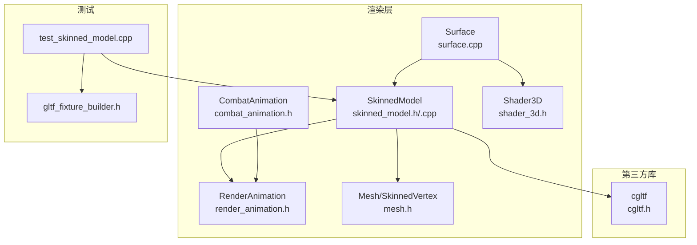
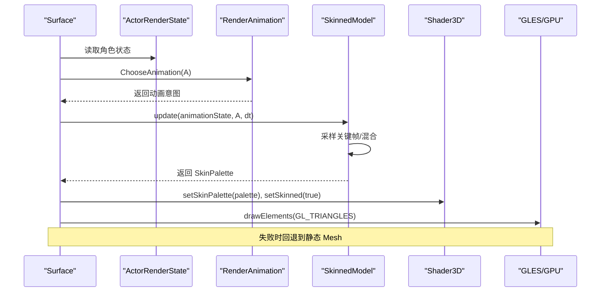
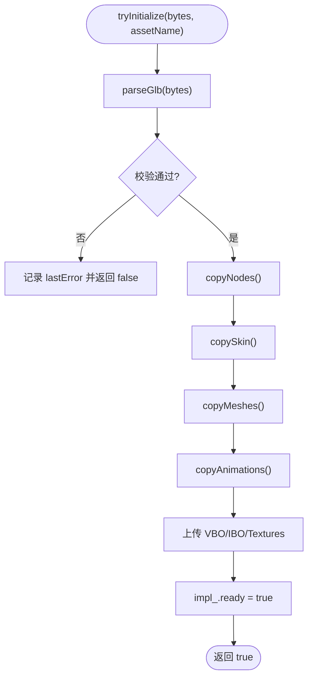
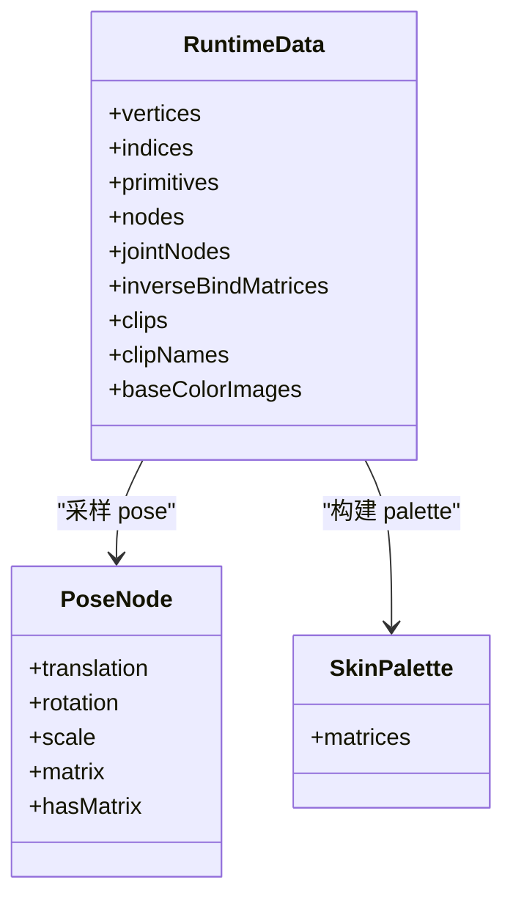
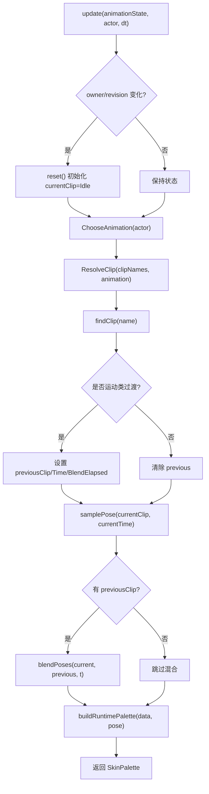
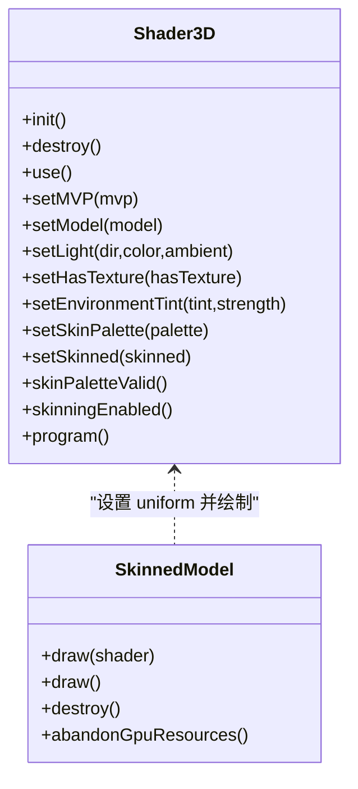
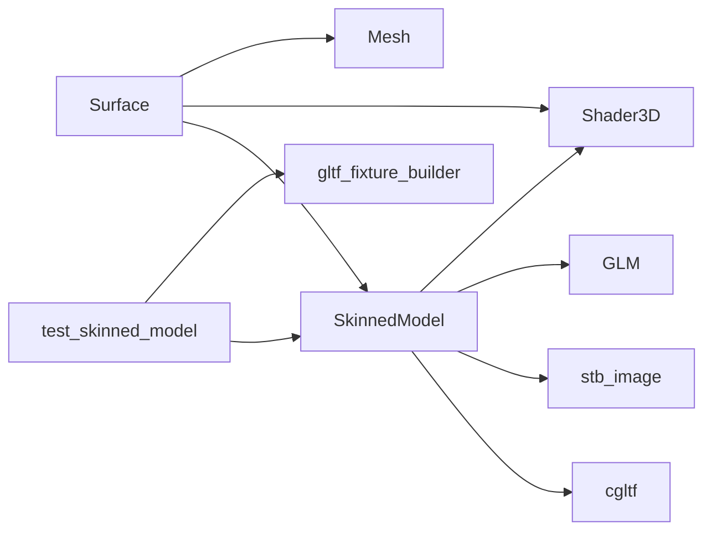

# 骨骼动画系统

<cite>
**本文引用的文件**   
- [skinned_model.h](file://native/engine/render/skinned_model.h)
- [skinned_model.cpp](file://native/engine/render/skinned_model.cpp)
- [render_animation.h](file://native/engine/render/render_animation.h)
- [combat_animation.h](file://native/engine/render/combat_animation.h)
- [mesh.h](file://native/engine/render/mesh.h)
- [shader_3d.h](file://native/engine/render/shader_3d.h)
- [surface.cpp](file://native/engine/render/surface.cpp)
- [cgltf.h](file://native/third_party/cgltf/cgltf.h)
- [test_skinned_model.cpp](file://tests/test_skinned_model.cpp)
- [gltf_fixture_builder.h](file://tests/gltf_fixture_builder.h)
- [2026-07-20-gltf-skeletal-animation.md](file://docs/superpowers/plans/2026-07-20-gltf-skeletal-animation.md)
</cite>

## 目录
1. [简介](#简介)
2. [项目结构](#项目结构)
3. [核心组件](#核心组件)
4. [架构总览](#架构总览)
5. [详细组件分析](#详细组件分析)
6. [依赖关系分析](#依赖关系分析)
7. [性能考量](#性能考量)
8. [故障排查指南](#故障排查指南)
9. [结论](#结论)
10. [附录：模型加载与动画控制示例](#附录模型加载与动画控制示例)

## 简介
本技术文档围绕 my-world 的骨骼动画系统，重点解析 SkinnedModel 类的实现与数据流，涵盖 GLTF/GLB 模型解析、骨骼层级结构、蒙皮权重计算、动画状态管理、关键帧插值与混合、GPU 蒙皮渲染与优化策略。同时提供与游戏逻辑的状态同步机制说明、调试工具与可视化方法，以及具体的模型加载与动画控制接口使用方式。

## 项目结构
骨骼动画相关代码主要位于 native/engine/render 与 tests 目录，第三方 glTF 解析器 cgltf 以单头文件形式引入。核心文件职责如下：
- skinned_model.h/.cpp：GLB 解析、运行时数据结构、动画采样与混合、GPU 资源上传与绘制。
- render_animation.h：渲染层动画意图枚举、选择与 clip 名称映射。
- combat_animation.h：战斗动作状态到渲染动画意图的映射。
- mesh.h：顶点布局（含 SkinnedVertex）与属性槽位定义。
- shader_3d.h：3D 着色器程序封装，支持设置骨骼调色板与蒙皮开关。
- surface.cpp：将 ActorRenderState 转换为渲染意图，调用 SkinnedModel 更新并绘制，失败回退到静态 Mesh。
- cgltf.h：glTF 2.0 解析库。
- tests/*：单元测试与测试夹具，覆盖 GLB 输入验证、动画采样、混合与边界条件。

**图表来源** 
- [skinned_model.h:1-136](file://native/engine/render/skinned_model.h#L1-L136)
- [skinned_model.cpp:1-1189](file://native/engine/render/skinned_model.cpp#L1-L1189)
- [render_animation.h:1-111](file://native/engine/render/render_animation.h#L1-L111)
- [combat_animation.h:1-47](file://native/engine/render/combat_animation.h#L1-L47)
- [mesh.h:1-74](file://native/engine/render/mesh.h#L1-L74)
- [shader_3d.h:1-82](file://native/engine/render/shader_3d.h#L1-L82)
- [surface.cpp:440-461](file://native/engine/render/surface.cpp#L440-L461)
- [cgltf.h:1-200](file://native/third_party/cgltf/cgltf.h#L1-L200)
- [test_skinned_model.cpp:1-428](file://tests/test_skinned_model.cpp#L1-L428)
- [gltf_fixture_builder.h:1-478](file://tests/gltf_fixture_builder.h#L1-L478)

**章节来源**
- [skinned_model.h:1-136](file://native/engine/render/skinned_model.h#L1-L136)
- [skinned_model.cpp:1-1189](file://native/engine/render/skinned_model.cpp#L1-L1189)
- [render_animation.h:1-111](file://native/engine/render/render_animation.h#L1-L111)
- [combat_animation.h:1-47](file://native/engine/render/combat_animation.h#L1-L47)
- [mesh.h:1-74](file://native/engine/render/mesh.h#L1-L74)
- [shader_3d.h:1-82](file://native/engine/render/shader_3d.h#L1-L82)
- [surface.cpp:440-461](file://native/engine/render/surface.cpp#L440-L461)
- [cgltf.h:1-200](file://native/third_party/cgltf/cgltf.h#L1-L200)
- [test_skinned_model.cpp:1-428](file://tests/test_skinned_model.cpp#L1-L428)
- [gltf_fixture_builder.h:1-478](file://tests/gltf_fixture_builder.h#L1-L478)

## 核心组件
- SkinnedModel：GLB 骨骼模型的纯数据核心与 GPU 运行时，负责解析、采样、构建皮肤调色板、绘制。
- SkinPalette：每帧计算的骨骼变换矩阵数组（global * inverseBind）。
- SkinnedAnimationState：每个渲染实体独立持有的播放状态（当前/上一 clip、时间、混合时长等）。
- RenderAnimation/ActorRenderState：渲染层动画意图与 actor 状态，用于选择 clip。
- Shader3D：3D 着色器封装，支持设置 uJoints[64]、uSkinned 等 uniform。
- Mesh/SkinnedVertex：顶点布局与属性槽位，包含位置、法线、UV、关节索引与权重。

**章节来源**
- [skinned_model.h:1-136](file://native/engine/render/skinned_model.h#L1-L136)
- [mesh.h:20-41](file://native/engine/render/mesh.h#L20-L41)
- [shader_3d.h:18-82](file://native/engine/render/shader_3d.h#L18-L82)
- [render_animation.h:1-111](file://native/engine/render/render_animation.h#L1-L111)

## 架构总览
整体流程从 Surface 层获取 ActorRenderState，通过 ChooseAnimation 与 ResolveClip 确定目标 clip，再调用 SkinnedModel::update 进行动画采样与混合，生成 SkinPalette，最后由 Shader3D 设置 uJoints 并绘制。若 SkinnedModel 未就绪或 GPU 资源不可用，则回退到静态 Mesh。

**图表来源** 
- [surface.cpp:440-461](file://native/engine/render/surface.cpp#L440-L461)
- [render_animation.h:57-111](file://native/engine/render/render_animation.h#L57-L111)
- [skinned_model.cpp:1003-1062](file://native/engine/render/skinned_model.cpp#L1003-L1062)
- [shader_3d.h:48-59](file://native/engine/render/shader_3d.h#L48-L59)

## 详细组件分析

### SkinnedModel 类与 GLB 解析
- tryInitialize：接收 GLB 字节流，使用 cgltf 解析，校验格式与约束（仅 GLB、TRIANGLES、单 skin、POSITION/NORMAL/TEXCOORD_0/JOINTS_0/WEIGHTS_0、最大 64 关节、不支持 CUBICSPLINE/扩展/外部 URI 等），随后解码嵌入纹理并上传 VBO/IBO/Texture。
- RuntimeData：存储顶点、索引、原语范围、节点、关节节点、逆绑定矩阵、动画片段与名称、嵌入图像。
- parseGlb：严格校验与拷贝 nodes/skin/meshes/animations，错误信息包含资产名以便定位。
- copyPrimitive：复制顶点属性与索引，归一化权重，检查 JOINTS_0/WEIGHTS_0 类型与数量，拒绝不支持的属性与模式。
- copyNodes：复制节点父子关系与 TRS 或矩阵。
- copySkin：校验 joints_count ≤ 64，读取 inverse_bind_matrices。
- copyAnimations：校验 sampler 与 channel，仅支持 LINEAR/STEP，拒绝 CUBICSPLINE。

**图表来源** 
- [skinned_model.cpp:894-999](file://native/engine/render/skinned_model.cpp#L894-L999)
- [skinned_model.cpp:563-626](file://native/engine/render/skinned_model.cpp#L563-L626)
- [skinned_model.cpp:236-368](file://native/engine/render/skinned_model.cpp#L236-L368)
- [skinned_model.cpp:370-439](file://native/engine/render/skinned_model.cpp#L370-L439)
- [skinned_model.cpp:441-540](file://native/engine/render/skinned_model.cpp#L441-L540)

**章节来源**
- [skinned_model.cpp:894-999](file://native/engine/render/skinned_model.cpp#L894-L999)
- [skinned_model.cpp:563-626](file://native/engine/render/skinned_model.cpp#L563-L626)
- [skinned_model.cpp:236-368](file://native/engine/render/skinned_model.cpp#L236-L368)
- [skinned_model.cpp:370-439](file://native/engine/render/skinned_model.cpp#L370-L439)
- [skinned_model.cpp:441-540](file://native/engine/render/skinned_model.cpp#L441-L540)

### 骨骼层级结构与蒙皮权重计算
- 节点层级：nodes 保存 parent、TRS 或 matrix；jointNodes 为 skin.joints 映射到 node 索引。
- 全局矩阵计算：composeNode 合成局部矩阵，递归 resolve 父链得到 globals[node]。
- 皮肤调色板：palette.matrices[joint] = globals[joint] * inverseBindMatrices[joint]。
- 权重处理：JOINTS_0/WEIGHTS_0 必须存在且权重和 > 0，按四影响关节归一化。

**图表来源** 
- [skinned_model.cpp:90-108](file://native/engine/render/skinned_model.cpp#L90-L108)
- [skinned_model.cpp:689-726](file://native/engine/render/skinned_model.cpp#L689-L726)
- [skinned_model.h:33-36](file://native/engine/render/skinned_model.h#L33-L36)

**章节来源**
- [skinned_model.cpp:628-726](file://native/engine/render/skinned_model.cpp#L628-L726)
- [skinned_model.cpp:845-888](file://native/engine/render/skinned_model.cpp#L845-L888)
- [skinned_model.h:33-36](file://native/engine/render/skinned_model.h#L33-L36)

### 动画状态管理与关键帧插值
- SkinnedAnimationState：维护 owner、assetRevision、currentClip、previousClip、currentTime、previousTime、blendElapsed、logState。
- ChooseAnimation：根据 alive/action/hit/moving 优先级选择 Idle/Run/Attack/Dodge/Radiance/Current/Corruption/Ultimate/Hit/Death。
- ResolveClip：按意图候选列表匹配 clip 名称，支持 Dodge→run、法术→attack、非 Idle→idle 回退。
- SampleVec3/SampleQuat：线性插值 mix/slerp 或 STEP 取左关键帧；WrapAnimationTime 循环时间。
- blendPoses：对位移/旋转/缩放分别 mix/slerp，跳过 hasMatrix 节点。

**图表来源** 
- [skinned_model.cpp:1003-1062](file://native/engine/render/skinned_model.cpp#L1003-L1062)
- [render_animation.h:57-111](file://native/engine/render/render_animation.h#L57-L111)
- [skinned_model.cpp:815-843](file://native/engine/render/skinned_model.cpp#L815-L843)
- [skinned_model.cpp:677-687](file://native/engine/render/skinned_model.cpp#L677-L687)

**章节来源**
- [skinned_model.cpp:1003-1062](file://native/engine/render/skinned_model.cpp#L1003-L1062)
- [render_animation.h:57-111](file://native/engine/render/render_animation.h#L57-L111)
- [skinned_model.cpp:815-843](file://native/engine/render/skinned_model.cpp#L815-L843)
- [skinned_model.cpp:677-687](file://native/engine/render/skinned_model.cpp#L677-L687)

### GPU 蒙皮渲染与优化
- 顶点布局：SkinnedVertex 包含 position/normal/uv/joints(weights)，属性槽位 0–4。
- Shader3D：setSkinPalette 上传 uJoints[64]，setSkinned 启用蒙皮分支；无效调色板时禁用蒙皮。
- drawInternal：绑定 VBO/IBO，设置各属性指针，逐原语绘制，按 primitive.textureIndex 切换纹理。
- 生命周期：destroy/abandonGpuResources 清理 GPU 句柄，避免在 context 不可用时发出 GL 删除。

**图表来源** 
- [shader_3d.h:18-82](file://native/engine/render/shader_3d.h#L18-L82)
- [skinned_model.cpp:1074-1117](file://native/engine/render/skinned_model.cpp#L1074-L1117)
- [mesh.h:20-41](file://native/engine/render/mesh.h#L20-L41)

**章节来源**
- [mesh.h:20-41](file://native/engine/render/mesh.h#L20-L41)
- [shader_3d.h:18-82](file://native/engine/render/shader_3d.h#L18-L82)
- [skinned_model.cpp:1074-1117](file://native/engine/render/skinned_model.cpp#L1074-L1117)

### 与游戏逻辑的状态同步
- Surface 层在 drawActor 中读取 ActorRenderState，调用 ChooseAnimation 与 ResolveClip，然后更新 SkinnedModel 并绘制。
- 若 model.ready() 为假或 GPU 资源不可用，回退到 fallback Mesh 并保持死亡实体隐藏。
- 日志输出动画切换（action/clip），便于调试。

**章节来源**
- [surface.cpp:440-461](file://native/engine/render/surface.cpp#L440-L461)
- [render_animation.h:57-111](file://native/engine/render/render_animation.h#L57-L111)

## 依赖关系分析
- SkinnedModel 依赖 cgltf 解析 GLB，依赖 stb_image 解码嵌入纹理，依赖 GLM 进行数学运算。
- Shader3D 依赖 GLES3 接口（OHOS_PLATFORM），在非平台侧为空操作。
- Surface 依赖 SkinnedModel、Shader3D、Mesh，协调渲染生命周期与回退。
- 测试用例依赖 gltf_fixture_builder 构造最小 GLB 与异常场景。

**图表来源** 
- [skinned_model.cpp:1-24](file://native/engine/render/skinned_model.cpp#L1-L24)
- [shader_3d.h:14-16](file://native/engine/render/shader_3d.h#L14-L16)
- [surface.cpp:440-461](file://native/engine/render/surface.cpp#L440-L461)
- [test_skinned_model.cpp:1-10](file://tests/test_skinned_model.cpp#L1-L10)
- [gltf_fixture_builder.h:1-20](file://tests/gltf_fixture_builder.h#L1-L20)

**章节来源**
- [skinned_model.cpp:1-24](file://native/engine/render/skinned_model.cpp#L1-L24)
- [shader_3d.h:14-16](file://native/engine/render/shader_3d.h#L14-L16)
- [surface.cpp:440-461](file://native/engine/render/surface.cpp#L440-L461)
- [test_skinned_model.cpp:1-10](file://tests/test_skinned_model.cpp#L1-L10)
- [gltf_fixture_builder.h:1-20](file://tests/gltf_fixture_builder.h#L1-L20)

## 性能考量
- 每帧 CPU 侧：采样 pose 与混合，复杂度 O(N_channels + N_nodes)。
- GPU 侧：VBO/IBO 一次上传，纹理按原语切换；uJoints[64] 每帧上传，注意批量绘制减少状态切换。
- 混合过渡：运动类 clip 过渡固定时长（如 0.15s），避免频繁切换导致的抖动。
- 资源管理：destroy/abandonGpuResources 及时释放 GPU 资源，避免上下文丢失时的非法调用。
- 限制与优化：最多 64 关节、每顶点 4 影响，符合常见移动端 GPU 能力；嵌入纹理去重以减少内存占用。

[本节为通用指导，不直接分析具体文件]

## 故障排查指南
- 常见错误：
  - 非 GLB 或模式非 TRIANGLES：解析失败，lastError 包含资产名与原因。
  - 缺少必需属性（POSITION/NORMAL/TEXCOORD_0/JOINTS_0/WEIGHTS_0）：拒绝加载。
  - 关节数超过 64 或权重和为零：拒绝加载。
  - CUBICSPLINE 插值或扩展：拒绝加载。
  - 外部 buffer/image URI：拒绝加载。
- 调试建议：
  - 使用 test_skinned_model 构造最小 GLB 与异常场景验证。
  - 观察 Surface 日志中的 action/clip 切换。
  - 检查 Shader3D::skinPaletteValid()/skinningEnabled() 确认蒙皮生效。

**章节来源**
- [skinned_model.cpp:762-813](file://native/engine/render/skinned_model.cpp#L762-L813)
- [test_skinned_model.cpp:53-129](file://tests/test_skinned_model.cpp#L53-L129)
- [surface.cpp:440-461](file://native/engine/render/surface.cpp#L440-L461)

## 结论
my-world 的骨骼动画系统以 SkinnedModel 为核心，结合 cgltf 解析 GLB、GLM 数学运算与 GLES 蒙皮渲染，实现了严格的输入校验、高效的动画采样与混合、稳定的 GPU 资源管理。通过 RenderAnimation 与 CombatAnimation 将 gameplay 状态映射到渲染意图，确保动画切换平滑与回退可靠。测试覆盖全面，便于持续集成与真机验证。

[本节为总结，不直接分析具体文件]

## 附录：模型加载与动画控制示例
- 模型加载：
  - 从 rawfile 读取 player/enemy/boss 的 GLB 字节流，调用 SkinnedModel::tryInitialize(bytes, assetName)。
  - 成功后可用 vertexCount/indexCount/jointCount/clipNames 等接口查询。
- 动画控制：
  - 每帧构造 ActorRenderState（alive/action/hit/moving），调用 ChooseAnimation 与 ResolveClip。
  - 调用 SkinnedModel::update(animationState, actor, dt) 获取 SkinPalette。
  - 通过 Shader3D::setSkinPalette(palette)、setSkinned(true) 后绘制。
- 回退策略：
  - 若 model.ready() 为假或 GPU 资源不可用，使用 fallback Mesh 绘制并保持死亡实体隐藏。

**章节来源**
- [2026-07-20-gltf-skeletal-animation.md:1-326](file://docs/superpowers/plans/2026-07-20-gltf-skeletal-animation.md#L1-L326)
- [surface.cpp:440-461](file://native/engine/render/surface.cpp#L440-L461)
- [skinned_model.cpp:894-999](file://native/engine/render/skinned_model.cpp#L894-L999)