# AI 系统

<cite>
**本文引用的文件**   
- [encounter_controller.h](file://native/gameplay/ai/encounter_controller.h)
- [enemy_agent.h](file://native/gameplay/ai/enemy_agent.h)
- [perception_system.h](file://native/gameplay/ai/perception_system.h)
- [tactical_planner.h](file://native/gameplay/ai/tactical_planner.h)
- [decision_policy.h](file://native/gameplay/ai/decision_policy.h)
- [action_executor.h](file://native/gameplay/ai/action_executor.h)
- [combat_region.h](file://native/gameplay/ai/combat_region.h)
- [enemy_archetypes.h](file://native/gameplay/ai/enemy_archetypes.h)
- [enemy_ai_config.h](file://native/gameplay/ai/enemy_ai_config.h)
- [enemy_ai_types.h](file://native/gameplay/ai/enemy_ai_types.h)
- [enemy_agent.cpp](file://native/gameplay/ai/enemy_agent.cpp)
- [perception_system.cpp](file://native/gameplay/ai/perception_system.cpp)
- [tactical_planner.cpp](file://native/gameplay/ai/tactical_planner.cpp)
- [decision_policy.cpp](file://native/gameplay/ai/decision_policy.cpp)
- [action_executor.cpp](file://native/gameplay/ai/action_executor.cpp)
</cite>

## 目录
1. [简介](#简介)
2. [项目结构](#项目结构)
3. [核心组件](#核心组件)
4. [架构总览](#架构总览)
5. [详细组件分析](#详细组件分析)
6. [依赖关系分析](#依赖关系分析)
7. [性能考量](#性能考量)
8. [故障排查指南](#故障排查指南)
9. [结论](#结论)
10. [附录](#附录)

## 简介
本文件为 my-world 的 AI 系统提供全面文档，覆盖遭遇战管理、敌人行为控制、感知系统、战术规划与决策策略。重点说明：
- EncounterController 的遭遇战生命周期与关卡流程
- EnemyAgent 的状态机、冷却与打断、路径与分离避让
- PerceptionSystem 的感知快照生成与威胁评估输入
- TacticalPlanner 的动作计划生成（移动/攻击/支援/撤退）
- DecisionPolicy 的意图选择（巡逻、追击、躲避、协作）
- ActionExecutor 的动作执行阶段、中断与失衡处理
- CombatRegion 的战斗区域管理与投影
- EnemyArchetypes 的原型配置与能力定义

## 项目结构
AI 子系统位于 native/gameplay/ai 目录，围绕“感知—决策—规划—执行”的闭环设计，配合战斗区域与遭遇控制器组织多敌协同与关卡流程。

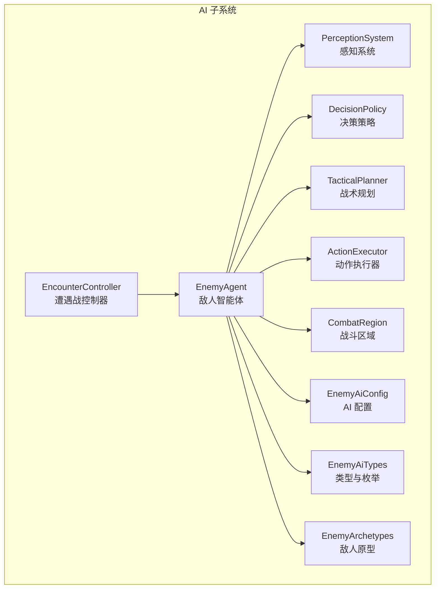

**图表来源**
- [encounter_controller.h:108-151](file://native/gameplay/ai/encounter_controller.h#L108-L151)
- [enemy_agent.h:55-107](file://native/gameplay/ai/enemy_agent.h#L55-L107)
- [perception_system.h:41-45](file://native/gameplay/ai/perception_system.h#L41-L45)
- [decision_policy.h:5-9](file://native/gameplay/ai/decision_policy.h#L5-L9)
- [tactical_planner.h:7-12](file://native/gameplay/ai/tactical_planner.h#L7-L12)
- [action_executor.h:33-67](file://native/gameplay/ai/action_executor.h#L33-L67)
- [combat_region.h:8-26](file://native/gameplay/ai/combat_region.h#L8-L26)
- [enemy_archetypes.h:1-19](file://native/gameplay/ai/enemy_archetypes.h#L1-L19)
- [enemy_ai_config.h:16-124](file://native/gameplay/ai/enemy_ai_config.h#L16-L124)
- [enemy_ai_types.h:12-160](file://native/gameplay/ai/enemy_ai_types.h#L12-L160)

**章节来源**
- [encounter_controller.h:108-151](file://native/gameplay/ai/encounter_controller.h#L108-L151)
- [enemy_agent.h:55-107](file://native/gameplay/ai/enemy_agent.h#L55-L107)

## 核心组件
- EncounterController：管理遭遇模式、敌人槽位、事件批处理、Boss 流程与关卡推进。
- EnemyAgent：封装单敌 AI 循环，整合感知、决策、规划、执行与区域约束，维护冷却、失衡与逃逸状态。
- PerceptionSystem：将世界视图转换为稳定的感知快照，计算角度、可见性、区域内状态与盟友信息。
- DecisionPolicy：基于感知快照与原型，输出意图（Idle/Chase/Attack/Retreat/ReturnToArea/BreakFree/Support）。
- TacticalPlanner：根据意图与可用能力生成动作计划（移动或行动），处理目标选择与回退原因。
- ActionExecutor：驱动动作的阶段推进（前摇/活跃/恢复）、命中/护盾效果派发、中断与失衡处理。
- CombatRegion：区域包含判断、内部投影与稳定分离向量计算。
- EnemyArchetypes：提供不同原型的默认配置与方向防御特性。
- EnemyAiConfig：能力与区域的校验、合法性检查与默认值。
- EnemyAiTypes：统一枚举、数据结构（意图、状态、能力、计划、感知快照等）。

**章节来源**
- [encounter_controller.h:108-151](file://native/gameplay/ai/encounter_controller.h#L108-L151)
- [enemy_agent.h:55-107](file://native/gameplay/ai/enemy_agent.h#L55-L107)
- [perception_system.h:41-45](file://native/gameplay/ai/perception_system.h#L41-L45)
- [decision_policy.h:5-9](file://native/gameplay/ai/decision_policy.h#L5-L9)
- [tactical_planner.h:7-12](file://native/gameplay/ai/tactical_planner.h#L7-L12)
- [action_executor.h:33-67](file://native/gameplay/ai/action_executor.h#L33-L67)
- [combat_region.h:8-26](file://native/gameplay/ai/combat_region.h#L8-L26)
- [enemy_archetypes.h:1-19](file://native/gameplay/ai/enemy_archetypes.h#L1-L19)
- [enemy_ai_config.h:16-124](file://native/gameplay/ai/enemy_ai_config.h#L16-L124)
- [enemy_ai_types.h:12-160](file://native/gameplay/ai/enemy_ai_types.h#L12-L160)

## 架构总览
AI 子系统遵循“数据驱动 + 规则决策”的模式：
- 遭遇控制器负责编排与生命周期，向每个敌人 Agent 注入世界视图。
- 敌人 Agent 每帧调用感知系统生成快照，交由决策策略选择意图，再由战术规划生成可执行计划，最后由执行器推进动作并产出命中/效果请求。
- 战斗区域确保所有行为在合法范围内，并提供分离向量避免拥挤。

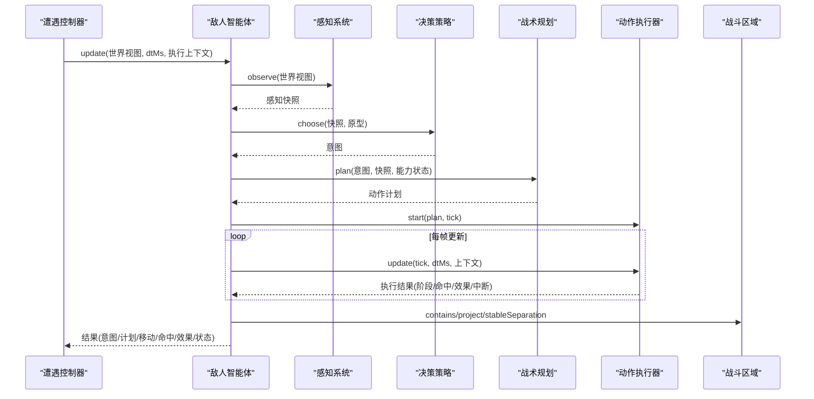

**图表来源**
- [encounter_controller.h:108-151](file://native/gameplay/ai/encounter_controller.h#L108-L151)
- [enemy_agent.h:55-107](file://native/gameplay/ai/enemy_agent.h#L55-L107)
- [perception_system.h:41-45](file://native/gameplay/ai/perception_system.h#L41-L45)
- [decision_policy.h:5-9](file://native/gameplay/ai/decision_policy.h#L5-L9)
- [tactical_planner.h:7-12](file://native/gameplay/ai/tactical_planner.h#L7-L12)
- [action_executor.h:33-67](file://native/gameplay/ai/action_executor.h#L33-L67)
- [combat_region.h:8-26](file://native/gameplay/ai/combat_region.h#L8-L26)

## 详细组件分析

### EncounterController（遭遇战控制器）
- 职责：启动/重置/停止遭遇；按模式生成配置；维护敌人槽位与事件批；支持 Boss 流程与补给使用；推进关卡阶段。
- 关键数据：模式、最大敌人数量、区域配置、敌人列表、快照、事件批次、Boss 控制器、训练目标。
- 关键接口：start/update/reset/stop/advanceLevel/useSupply/retryBoss/snapshot/events。

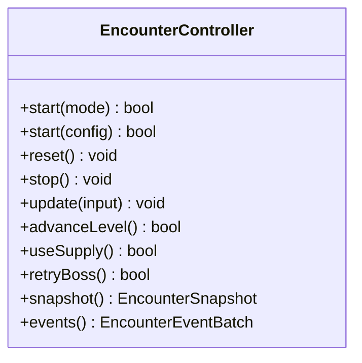

**图表来源**
- [encounter_controller.h:108-151](file://native/gameplay/ai/encounter_controller.h#L108-L151)

**章节来源**
- [encounter_controller.h:108-151](file://native/gameplay/ai/encounter_controller.h#L108-L151)

### EnemyAgent（敌人智能体）
- 职责：整合感知、决策、规划、执行与区域约束；管理冷却、失衡、逃逸状态；输出移动、命中、效果与状态。
- 关键数据：原型、配置、调优参数、区域、能力状态、感知记忆、上次计划、逃逸状态、进度跟踪。
- 关键接口：update/releaseStagger/reset/escapeState。

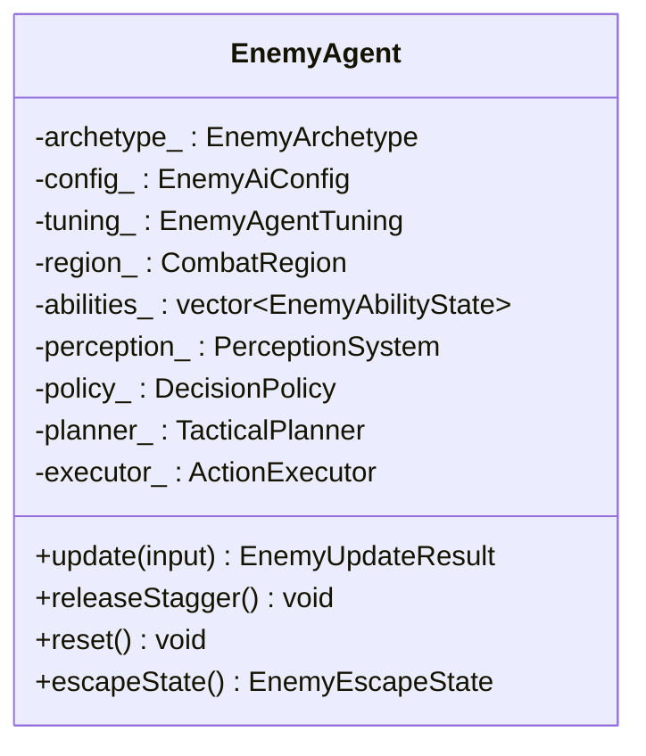

**图表来源**
- [enemy_agent.h:55-107](file://native/gameplay/ai/enemy_agent.h#L55-L107)

**章节来源**
- [enemy_agent.h:55-107](file://native/gameplay/ai/enemy_agent.h#L55-L107)
- [enemy_agent.cpp:53-90](file://native/gameplay/ai/enemy_agent.cpp#L53-L90)

### PerceptionSystem（感知系统）
- 职责：将 EnemyWorldView 转换为 PerceptionSnapshot，计算距离、角度、可见性、区域内状态、盟友排序。
- 关键方法：observe(world)。

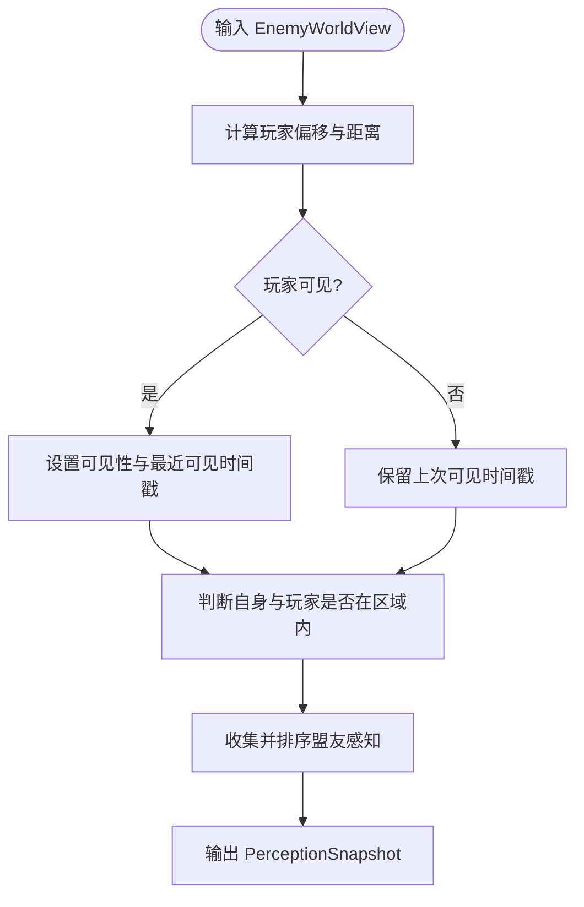

**图表来源**
- [perception_system.cpp:32-74](file://native/gameplay/ai/perception_system.cpp#L32-L74)

**章节来源**
- [perception_system.h:41-45](file://native/gameplay/ai/perception_system.h#L41-L45)
- [perception_system.cpp:32-74](file://native/gameplay/ai/perception_system.cpp#L32-L74)

### DecisionPolicy（决策策略）
- 职责：依据感知快照与原型选择意图（Idle/Chase/Attack/Retreat/ReturnToArea/BreakFree/Support）。
- 关键点：区域外返回、不可达则挣脱、失衡则空闲、牧师优先支援低护盾盟友、近战与远程阈值区分。

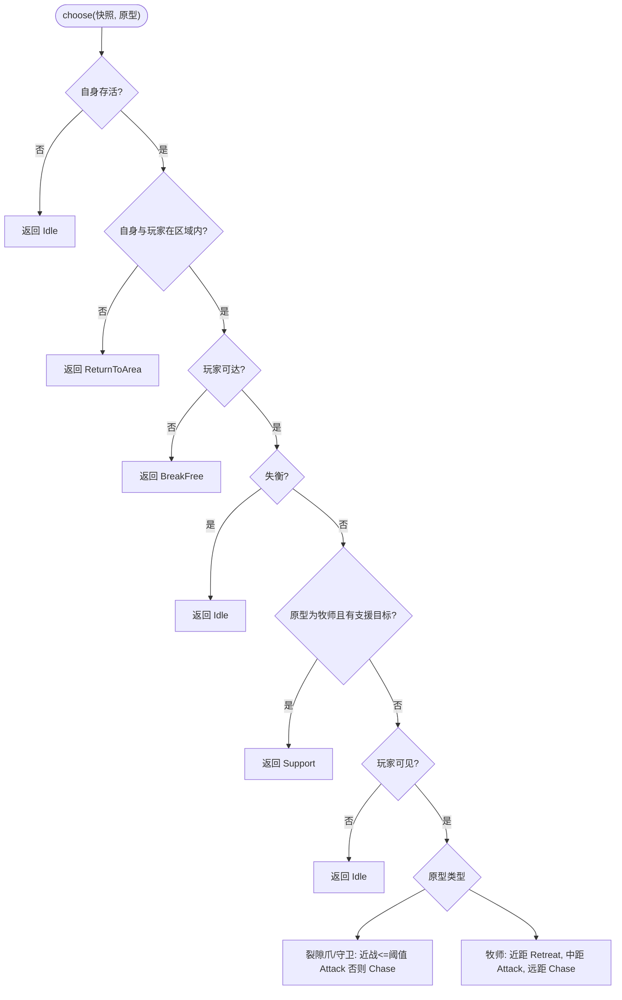

**图表来源**
- [decision_policy.cpp:25-47](file://native/gameplay/ai/decision_policy.cpp#L25-L47)

**章节来源**
- [decision_policy.h:5-9](file://native/gameplay/ai/decision_policy.h#L5-L9)
- [decision_policy.cpp:25-47](file://native/gameplay/ai/decision_policy.cpp#L25-L47)

### TacticalPlanner（战术规划）
- 职责：根据意图与感知快照生成动作计划（移动或行动），处理目标选择与回退原因。
- 关键点：区域外强制返回；Chase/Retreat/Idle/BreakFree 直接生成移动或空闲；Attack/Support 从可用能力中选择最佳（权重优先、剩余射程最小、ID 稳定）。

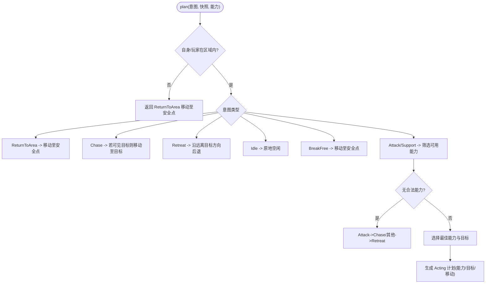

**图表来源**
- [tactical_planner.cpp:124-198](file://native/gameplay/ai/tactical_planner.cpp#L124-L198)

**章节来源**
- [tactical_planner.h:7-12](file://native/gameplay/ai/tactical_planner.h#L7-L12)
- [tactical_planner.cpp:124-198](file://native/gameplay/ai/tactical_planner.cpp#L124-L198)

### ActionExecutor（动作执行器）
- 职责：驱动动作阶段（前摇/活跃/恢复），在命中时刻派发 HitRequest 或 CombatEffectRequest，支持中断与失衡。
- 关键点：开始校验、阶段判定、取消策略、目标死亡进入恢复、事务 ID 去重、失衡标记。

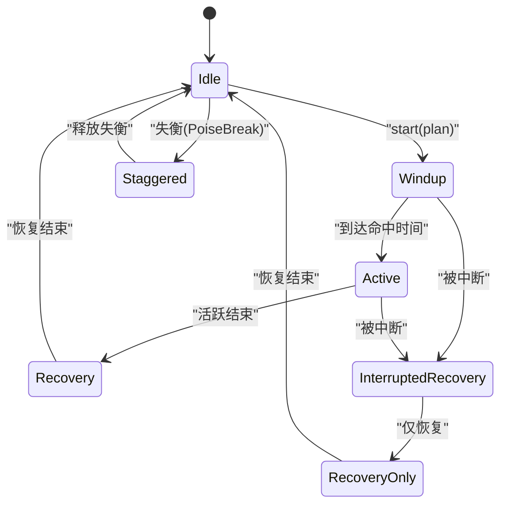

**图表来源**
- [action_executor.cpp:39-122](file://native/gameplay/ai/action_executor.cpp#L39-L122)
- [action_executor.cpp:124-190](file://native/gameplay/ai/action_executor.cpp#L124-L190)

**章节来源**
- [action_executor.h:33-67](file://native/gameplay/ai/action_executor.h#L33-L67)
- [action_executor.cpp:39-122](file://native/gameplay/ai/action_executor.cpp#L39-L122)
- [action_executor.cpp:124-190](file://native/gameplay/ai/action_executor.cpp#L124-L190)

### CombatRegion（战斗区域）
- 职责：判断点是否在区域内、将点投影到区域内、计算稳定分离向量。
- 关键点：中心与半径配置；tolerance/inset 容差；分离向量用于避免拥挤。

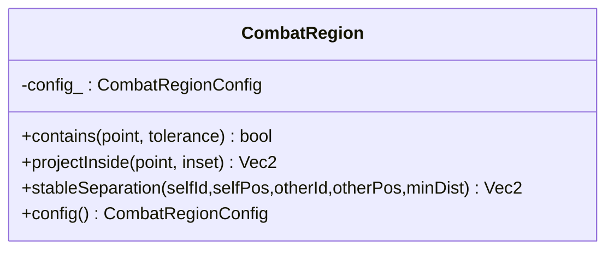

**图表来源**
- [combat_region.h:8-26](file://native/gameplay/ai/combat_region.h#L8-L26)

**章节来源**
- [combat_region.h:8-26](file://native/gameplay/ai/combat_region.h#L8-L26)

### EnemyArchetypes（敌人原型）
- 职责：提供不同原型的默认 AI 配置与方向防御特性，定义能力 ID 命名空间。
- 关键点：RiftClaw/Priest/Guard 默认配置；能力 ID 常量；方向防御曲线。

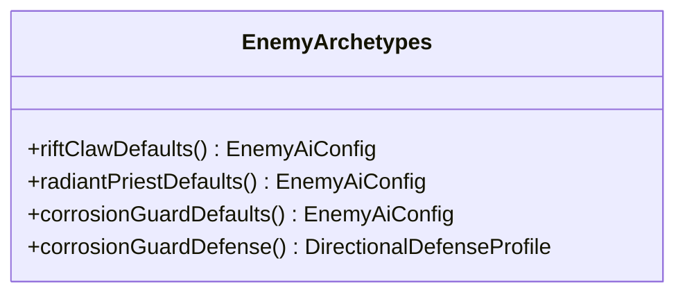

**图表来源**
- [enemy_archetypes.h:1-19](file://native/gameplay/ai/enemy_archetypes.h#L1-L19)

**章节来源**
- [enemy_archetypes.h:1-19](file://native/gameplay/ai/enemy_archetypes.h#L1-L19)

### EnemyAiConfig（AI 配置）
- 职责：能力与区域合法性校验，默认值与上限约束。
- 关键点：maxEnemies 上限；区域有效性；能力字段校验（范围/冷却/前摇/活跃/恢复/权重/类别/目标策略/效果/取消策略/预兆/中断阈值）。

**章节来源**
- [enemy_ai_config.h:16-124](file://native/gameplay/ai/enemy_ai_config.h#L16-L124)

### EnemyAiTypes（类型与枚举）
- 职责：统一 AI 相关枚举与数据结构（意图、状态、阶段、目标策略、能力类别/效果/取消策略/预兆、能力、能力状态、盟友感知、感知快照、计划与回退原因）。

**章节来源**
- [enemy_ai_types.h:12-160](file://native/gameplay/ai/enemy_ai_types.h#L12-L160)

## 依赖关系分析
- EnemyAgent 依赖 PerceptionSystem、DecisionPolicy、TacticalPlanner、ActionExecutor、CombatRegion、EnemyAiConfig、EnemyAiTypes、EnemyArchetypes。
- EncounterController 依赖 CombatController、SoftTargeting、Boss 控制器与训练目标，协调多敌与关卡流程。
- PerceptionSystem 依赖 EnemyAiTypes 中的世界视图与盟友结构。
- TacticalPlanner 依赖 EnemyAiTypes 的能力与感知快照。
- ActionExecutor 依赖 EnemyAiTypes 的能力与阶段枚举。

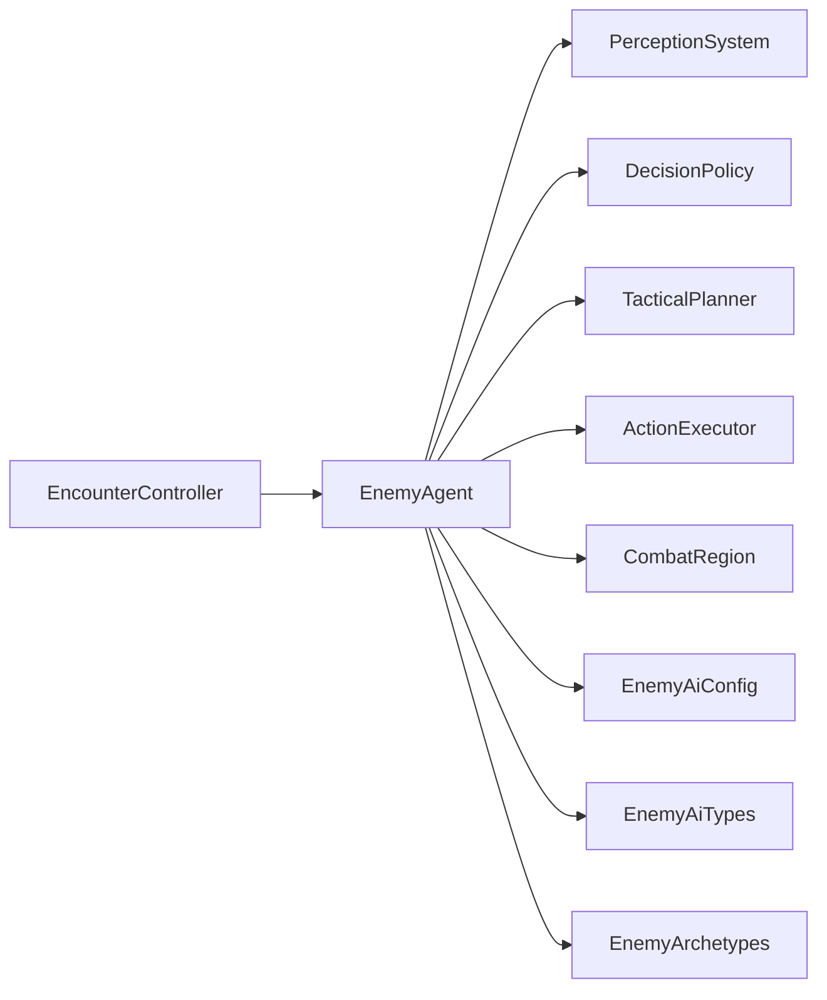

**图表来源**
- [enemy_agent.h:55-107](file://native/gameplay/ai/enemy_agent.h#L55-L107)
- [encounter_controller.h:108-151](file://native/gameplay/ai/encounter_controller.h#L108-L151)

**章节来源**
- [enemy_agent.h:55-107](file://native/gameplay/ai/enemy_agent.h#L55-L107)
- [encounter_controller.h:108-151](file://native/gameplay/ai/encounter_controller.h#L108-L151)

## 性能考量
- 感知快照构建：对盟友进行排序与去重，复杂度 O(n log n)，建议限制盟友数量与剔除无效项。
- 能力筛选：遍历能力集合，按权重与剩余射程比较，O(m)；建议合理分组能力类别以减少遍历。
- 区域判断与投影：常数时间操作，注意浮点容差避免抖动。
- 执行器阶段推进：每帧简单状态机，开销极低；事务 ID 防重复派发。
- 调优参数：决策周期、最小进展、无进展次数限制、追击容差、安全点容差、分离距离影响 CPU 与稳定性。

[本节为通用指导，不直接分析具体文件]

## 故障排查指南
- 敌人不动或频繁切换意图：检查 PerceptionSnapshot 的可见性与区域内状态；确认 DecisionPolicy 阈值是否合理。
- 无法攻击或总是撤退：查看 TacticalPlanner 的可用能力筛选与目标选择逻辑；确认能力范围、冷却与目标策略。
- 动作未生效或重复触发：检查 ActionExecutor 的事务 ID 与命中时机；确认目标存活与执行上下文。
- 失衡卡住：确认失衡释放机制与冷却；检查 Poise 伤害与中断阈值。
- 区域越界：验证 CombatRegion 配置与投影逻辑；确保 safeReturnPosition 有效。

**章节来源**
- [perception_system.cpp:32-74](file://native/gameplay/ai/perception_system.cpp#L32-L74)
- [tactical_planner.cpp:124-198](file://native/gameplay/ai/tactical_planner.cpp#L124-L198)
- [action_executor.cpp:39-122](file://native/gameplay/ai/action_executor.cpp#L39-L122)
- [action_executor.cpp:124-190](file://native/gameplay/ai/action_executor.cpp#L124-L190)
- [combat_region.h:8-26](file://native/gameplay/ai/combat_region.h#L8-L26)

## 结论
my-world 的 AI 系统以清晰的数据流与模块化设计实现可控且可扩展的敌人行为。通过 EncounterController 编排、EnemyAgent 闭环、PerceptionSystem 标准化感知、DecisionPolicy/TacticalPlanner 的规则化决策与规划、ActionExecutor 的执行保障，以及 CombatRegion 的区域约束，能够稳定实现巡逻、追击、躲避、协作攻击等复杂行为。配置与原型机制便于快速扩展新敌人类型与战术风格。

[本节为总结，不直接分析具体文件]

## 附录

### AI 行为示例
- 巡逻：Idle/ReturnToArea 结合区域投影与安全点返回，保持位置稳定。
- 追击：Chase 移动至目标位置，直至进入攻击范围。
- 躲避：Retreat 沿远离目标方向后退，避免被集火。
- 协作攻击：Priest 检测低护盾盟友并在范围内施放护盾支援。

[本节为概念性说明，不直接分析具体文件]

### 敌人感知范围与威胁评估
- 感知范围：CombatRegionConfig.center/radius 决定区域；PerceptionSnapshot.selfInsideRegion/playerInsideRegion 指示内外状态。
- 威胁评估：PerceptionSnapshot.playerThreat 与 playerDistance、playerVisible、lastPlayerVisibleTick 共同影响意图选择。

**章节来源**
- [enemy_ai_config.h:11-14](file://native/gameplay/ai/enemy_ai_config.h#L11-L14)
- [perception_system.cpp:32-74](file://native/gameplay/ai/perception_system.cpp#L32-L74)

### 路径规划与攻击决策逻辑
- 路径规划：TacticalPlanner 根据意图生成 desiredPosition 与 movement；区域外强制返回安全点。
- 攻击决策：DecisionPolicy 基于阈值与原型选择意图；TacticalPlanner 从可用能力中选择最佳目标与能力。

**章节来源**
- [tactical_planner.cpp:124-198](file://native/gameplay/ai/tactical_planner.cpp#L124-L198)
- [decision_policy.cpp:25-47](file://native/gameplay/ai/decision_policy.cpp#L25-L47)

### AI 配置参数调优方法
- 决策周期与最小进展：调整 noProgressDecisions 与 minimumProgress，避免死锁与卡顿。
- 追击容差与安全点容差：chaseTolerance/safePointTolerance 影响行为切换灵敏度。
- 分离距离：separationDistance 控制拥挤程度。
- 能力配置：range/cooldown/windup/active/recovery/weight/interruptThreshold 等需平衡强度与节奏。

**章节来源**
- [enemy_agent.h:20-27](file://native/gameplay/ai/enemy_agent.h#L20-L27)
- [enemy_ai_config.h:16-124](file://native/gameplay/ai/enemy_ai_config.h#L16-L124)

### 自定义敌人类型的开发指南
- 新增原型：在 EnemyArchetypes 中添加默认配置与能力 ID。
- 定义能力：在 EnemyAiTypes 中明确类别、目标策略、效果与取消策略，确保通过 EnemyAiConfig 校验。
- 调整策略：根据需要修改 DecisionPolicy 阈值或扩展意图分支。
- 测试与调优：使用 PerceptionSystem 与 TacticalPlanner 的输出验证行为，逐步调优参数。

**章节来源**
- [enemy_archetypes.h:1-19](file://native/gameplay/ai/enemy_archetypes.h#L1-L19)
- [enemy_ai_types.h:12-160](file://native/gameplay/ai/enemy_ai_types.h#L12-L160)
- [enemy_ai_config.h:16-124](file://native/gameplay/ai/enemy_ai_config.h#L16-L124)