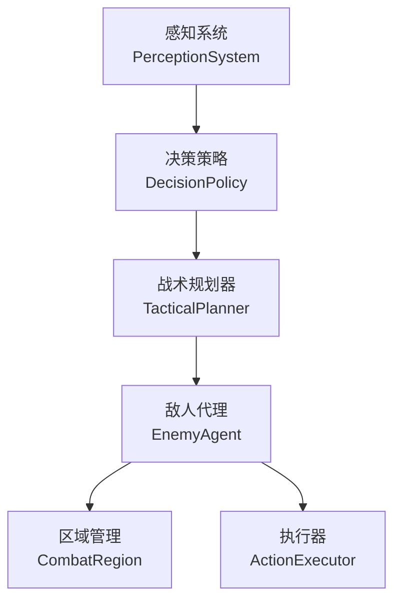
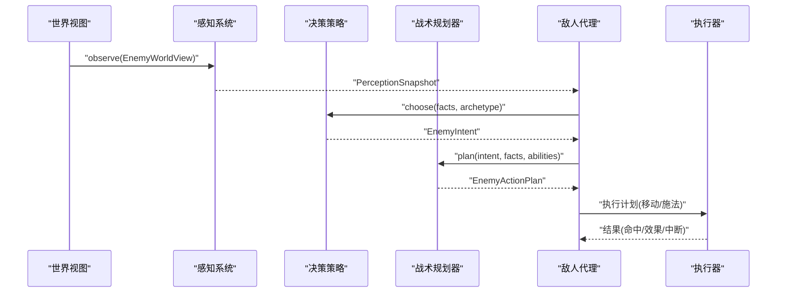
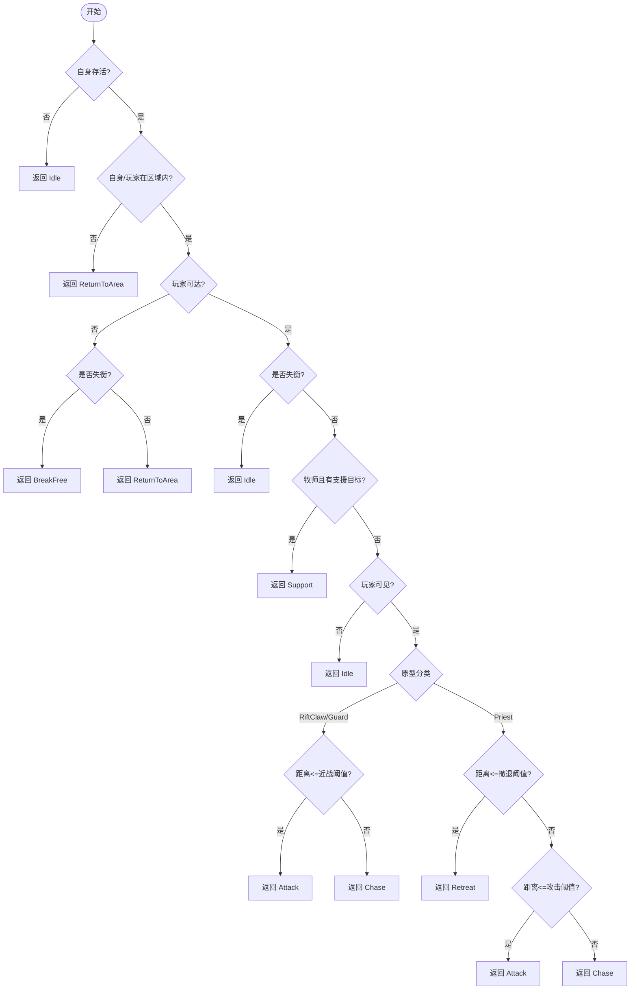
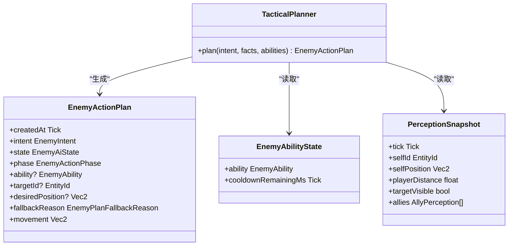
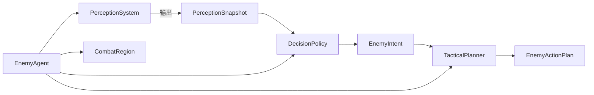

# 决策策略

<cite>
**本文档引用的文件**
- [decision_policy.h](file://native/gameplay/ai/decision_policy.h)
- [decision_policy.cpp](file://native/gameplay/ai/decision_policy.cpp)
- [enemy_ai_types.h](file://native/gameplay/ai/enemy_ai_types.h)
- [perception_system.h](file://native/gameplay/ai/perception_system.h)
- [perception_system.cpp](file://native/gameplay/ai/perception_system.cpp)
- [tactical_planner.h](file://native/gameplay/ai/tactical_planner.h)
- [tactical_planner.cpp](file://native/gameplay/ai/tactical_planner.cpp)
- [enemy_agent.h](file://native/gameplay/ai/enemy_agent.h)
- [combat_region.h](file://native/gameplay/ai/combat_region.h)
- [enemy_archetypes.h](file://native/gameplay/ai/enemy_archetypes.h)
- [enemy_archetypes.cpp](file://native/gameplay/ai/enemy_archetypes.cpp)
- [test_enemy_decision.cpp](file://tests/test_enemy_decision.cpp)
</cite>

## 目录
1. [简介](#简介)
2. [项目结构](#项目结构)
3. [核心组件](#核心组件)
4. [架构总览](#架构总览)
5. [详细组件分析](#详细组件分析)
6. [依赖关系分析](#依赖关系分析)
7. [性能考量](#性能考量)
8. [故障排查指南](#故障排查指南)
9. [结论](#结论)
10. [附录](#附录)

## 简介
本文件为 DecisionPolicy 决策策略系统的完整技术文档，覆盖基于规则的决策引擎、权重评分系统与战术规划流程。重点解释追击、逃跑、攻击、防御等行为的选择逻辑，记录决策因子的计算方法（距离、血量、技能冷却、地形等），并给出策略的动态调整机制、学习算法集成思路与效果量化评估方法。同时提供策略配置模板与调试工具建议，帮助策划与程序快速迭代与验证 AI 行为。

## 项目结构
AI 子系统围绕“感知—决策—规划—执行”的流水线组织：
- 感知系统负责将世界状态转换为结构化快照 PerceptionSnapshot
- 决策策略根据快照与敌人原型选择高层意图 EnemyIntent
- 战术规划器将意图转化为具体行动计划 EnemyActionPlan（移动或施放技能）
- 敌人代理协调上述模块，驱动状态机与执行器完成动作

**图表来源**
- [perception_system.h:41-44](file://native/gameplay/ai/perception_system.h#L41-L44)
- [decision_policy.h:5-8](file://native/gameplay/ai/decision_policy.h#L5-L8)
- [tactical_planner.h:7-11](file://native/gameplay/ai/tactical_planner.h#L7-L11)
- [enemy_agent.h:55-106](file://native/gameplay/ai/enemy_agent.h#L55-L106)
- [combat_region.h:8-25](file://native/gameplay/ai/combat_region.h#L8-L25)

**章节来源**
- [perception_system.h:1-45](file://native/gameplay/ai/perception_system.h#L1-L45)
- [decision_policy.h:1-9](file://native/gameplay/ai/decision_policy.h#L1-L9)
- [tactical_planner.h:1-12](file://native/gameplay/ai/tactical_planner.h#L1-L12)
- [enemy_agent.h:1-107](file://native/gameplay/ai/enemy_agent.h#L1-L107)
- [combat_region.h:1-26](file://native/gameplay/ai/combat_region.h#L1-L26)

## 核心组件
- 决策策略 DecisionPolicy：基于规则从感知快照与敌人原型输出高层意图
- 感知系统 PerceptionSystem：计算距离、角度、可见性、区域内外等信息
- 战术规划器 TacticalPlanner：依据意图与可用技能集生成可执行的行动计划
- 敌人代理 EnemyAgent：整合感知、决策、规划与执行，维护状态与冷却
- 类型与配置 enemy_ai_types.h / enemy_ai_config.h：定义意图、能力、目标策略、区域配置等

关键数据结构与职责：
- PerceptionSnapshot：包含自身与玩家位置、距离、可见性、区域内外、盟友列表、失衡状态等
- EnemyAbilityState：封装技能及其冷却剩余时间
- EnemyActionPlan：描述意图、状态、阶段、目标、期望位置、移动向量、回退原因等

**章节来源**
- [enemy_ai_types.h:12-160](file://native/gameplay/ai/enemy_ai_types.h#L12-L160)
- [perception_system.cpp:32-74](file://native/gameplay/ai/perception_system.cpp#L32-L74)
- [tactical_planner.cpp:124-199](file://native/gameplay/ai/tactical_planner.cpp#L124-L199)
- [enemy_agent.h:55-106](file://native/gameplay/ai/enemy_agent.h#L55-L106)

## 架构总览
下图展示一次完整的决策到行动的时序：

**图表来源**
- [perception_system.cpp:32-74](file://native/gameplay/ai/perception_system.cpp#L32-L74)
- [decision_policy.cpp:25-47](file://native/gameplay/ai/decision_policy.cpp#L25-L47)
- [tactical_planner.cpp:124-199](file://native/gameplay/ai/tactical_planner.cpp#L124-L199)
- [enemy_agent.h:60-91](file://native/gameplay/ai/enemy_agent.h#L60-L91)

## 详细组件分析

### 决策策略 DecisionPolicy
- 输入：PerceptionSnapshot 与 EnemyArchetype
- 输出：EnemyIntent（Idle/Chase/Attack/Retreat/ReturnToArea/BreakFree/Support）
- 规则要点：
  - 若自身死亡或不在区域内/玩家不在区域内，优先返回区域或空闲
  - 若玩家不可达则尝试挣脱或返回区域
  - 若处于失衡状态则进入空闲（部分原型例外）
  - 牧师在满足支援条件时优先支援
  - 近战原型按距离决定攻击或追击；牧师按距离决定撤退/攻击/追击

**图表来源**
- [decision_policy.cpp:25-47](file://native/gameplay/ai/decision_policy.cpp#L25-L47)

**章节来源**
- [decision_policy.h:5-8](file://native/gameplay/ai/decision_policy.h#L5-L8)
- [decision_policy.cpp:1-48](file://native/gameplay/ai/decision_policy.cpp#L1-L48)
- [test_enemy_decision.cpp:17-84](file://tests/test_enemy_decision.cpp#L17-L84)

### 感知系统 PerceptionSystem
- 负责计算：
  - 玩家相对位置与距离、角度、朝向差
  - 可见性与最后可见帧
  - 威胁度、可达性、最近受击标记
  - 自身与玩家是否在战斗区域内
  - 盟友列表（含生命、护盾、位置、距离、存活与区域内外）
- 排序与稳定性：对盟友按 ID 排序以保证确定性

复杂度与性能：
- O(N) 遍历盟友集合，N 为同阵营单位数量
- 使用固定精度浮点与简单几何运算，开销低

**章节来源**
- [perception_system.h:1-45](file://native/gameplay/ai/perception_system.h#L1-L45)
- [perception_system.cpp:1-75](file://native/gameplay/ai/perception_system.cpp#L1-L75)

### 战术规划器 TacticalPlanner
- 输入：意图、感知快照、可用技能状态
- 输出：可执行的行动计划（移动或施法）
- 核心逻辑：
  - 区域外强制返回安全点
  - 非技能类意图直接生成移动或空闲计划
  - 技能类意图按类别筛选可用技能（冷却、范围、目标策略）
  - 目标选择：
    - 支援类：最低护盾且位于区域内的盟友
    - 攻击类：当前目标/最近敌对/最低生命敌对/自身
  - 技能优选：权重优先，其次剩余射程更小，再按 ID 稳定排序
  - 无合法技能时的回退：攻击意图退化为追击或空闲；其他退化为撤退

**图表来源**
- [tactical_planner.h:7-11](file://native/gameplay/ai/tactical_planner.h#L7-L11)
- [tactical_planner.cpp:124-199](file://native/gameplay/ai/tactical_planner.cpp#L124-L199)
- [enemy_ai_types.h:149-160](file://native/gameplay/ai/enemy_ai_types.h#L149-L160)
- [enemy_ai_types.h:97-101](file://native/gameplay/ai/enemy_ai_types.h#L97-L101)
- [enemy_ai_types.h:113-139](file://native/gameplay/ai/enemy_ai_types.h#L113-L139)

**章节来源**
- [tactical_planner.h:1-12](file://native/gameplay/ai/tactical_planner.h#L1-L12)
- [tactical_planner.cpp:1-199](file://native/gameplay/ai/tactical_planner.cpp#L1-L199)

### 敌人代理 EnemyAgent
- 职责：
  - 周期性地调用感知、决策、规划，产出移动与动作请求
  - 管理冷却、失衡恢复、脱离状态（重定位/返回安全点）
  - 分离避免拥挤、进度跟踪与无进展判定
- 调优参数：
  - 决策周期、最小进度、无进展次数上限、追击容差、安全点容差、分离距离

**章节来源**
- [enemy_agent.h:1-107](file://native/gameplay/ai/enemy_agent.h#L1-L107)

### 战斗区域 CombatRegion
- 提供包含判断、投影入内、稳定分离等基础几何操作
- 用于区域内外判定与安全点回归

**章节来源**
- [combat_region.h:1-26](file://native/gameplay/ai/combat_region.h#L1-L26)

### 原型与能力配置 enemy_archetypes
- 定义各原型的默认能力配置（伤害/支援、范围、冷却、前摇、激活、恢复、权重、取消策略、打断阈值等）
- 提供方向性防御配置（如腐蚀守卫的前向减伤）

**章节来源**
- [enemy_archetypes.h:1-19](file://native/gameplay/ai/enemy_archetypes.h#L1-L19)
- [enemy_archetypes.cpp:1-84](file://native/gameplay/ai/enemy_archetypes.cpp#L1-L84)

## 依赖关系分析
- DecisionPolicy 依赖 PerceptionSnapshot 与 EnemyArchetype
- TacticalPlanner 依赖 PerceptionSnapshot、EnemyAbilityState 与 EnemyIntent
- EnemyAgent 组合 PerceptionSystem、DecisionPolicy、TacticalPlanner、CombatRegion、ActionExecutor
- PerceptionSystem 依赖 EnemyWorldView 与 CombatRegionConfig

**图表来源**
- [perception_system.h:41-44](file://native/gameplay/ai/perception_system.h#L41-L44)
- [decision_policy.h:5-8](file://native/gameplay/ai/decision_policy.h#L5-L8)
- [tactical_planner.h:7-11](file://native/gameplay/ai/tactical_planner.h#L7-L11)
- [enemy_agent.h:55-106](file://native/gameplay/ai/enemy_agent.h#L55-L106)

**章节来源**
- [enemy_ai_types.h:12-160](file://native/gameplay/ai/enemy_ai_types.h#L12-L160)
- [perception_system.h:1-45](file://native/gameplay/ai/perception_system.h#L1-L45)
- [decision_policy.h:1-9](file://native/gameplay/ai/decision_policy.h#L1-L9)
- [tactical_planner.h:1-12](file://native/gameplay/ai/tactical_planner.h#L1-L12)
- [enemy_agent.h:1-107](file://native/gameplay/ai/enemy_agent.h#L1-L107)

## 性能考量
- 感知系统每帧 O(N) 遍历盟友，N 通常较小；注意避免频繁分配与排序
- 决策策略为常数时间规则分支，开销极低
- 战术规划器遍历可用技能集合，复杂度 O(M)，M 为技能数量；通过权重与范围剪枝减少比较
- 敌人代理的冷却更新与状态机切换应批量处理，避免热点路径中的动态内存分配
- 建议在调试模式下启用日志与可视化，生产模式关闭以优化帧率

[本节为通用指导，不直接分析具体文件]

## 故障排查指南
- 常见问题与定位：
  - 意图异常：检查 PerceptionSnapshot 的距离、可见性、区域内外标志是否正确
  - 无法施放技能：确认技能冷却、范围、目标策略与目标可见性
  - 行为不稳定：核查盟友排序与 ID 稳定性、随机种子与抖动
  - 陷入循环：关注无进展判定与分离距离设置
- 调试建议：
  - 使用测试用例覆盖边界场景（如玩家不可见、区域外、失衡、无支援目标）
  - 打印关键中间值（距离、角度、冷却剩余、选择的目标 ID）
  - 逐步缩小问题范围（先验证感知，再验证决策，最后验证规划）

**章节来源**
- [test_enemy_decision.cpp:17-84](file://tests/test_enemy_decision.cpp#L17-L84)
- [tactical_planner.cpp:124-199](file://native/gameplay/ai/tactical_planner.cpp#L124-L199)

## 结论
DecisionPolicy 以简洁高效的规则引擎为核心，结合感知快照与原型差异，实现稳定的高层意图选择；TacticalPlanner 在此基础上进行技能级规划，确保行为符合配置约束与战场态势。通过 EnemyAgent 的状态管理与调优参数，系统具备良好的可配置性与可扩展性。未来可在保持现有架构的前提下引入概率选择与学习算法，进一步提升行为的多样性与适应性。

[本节为总结性内容，不直接分析具体文件]

## 附录

### 决策因子与计算方法
- 距离：玩家与自身距离、目标距离、盟友与自身距离；用于追击/攻击/支援判定
- 可见性：玩家与目标可见性影响是否发起攻击或支援
- 区域内外：自身与玩家是否在战斗区域内，决定返回区域或继续交互
- 可达性：玩家是否可达，影响挣脱或退回策略
- 失衡状态：失衡时多数原型进入空闲，特定原型可能挣脱
- 盟友状态：生命、护盾、存活、区域内外与距离，用于支援目标选择
- 技能冷却：仅考虑冷却结束的技能
- 权重与范围：技能优选以权重为主，辅以剩余射程更小的偏好

**章节来源**
- [perception_system.cpp:32-74](file://native/gameplay/ai/perception_system.cpp#L32-L74)
- [tactical_planner.cpp:79-86](file://native/gameplay/ai/tactical_planner.cpp#L79-L86)
- [enemy_ai_types.h:113-139](file://native/gameplay/ai/enemy_ai_types.h#L113-L139)

### 策略配置模板（示例字段说明）
- 区域配置：中心坐标、半径
- 技能条目：ID、标签、范围、冷却、前摇、激活、恢复、权重、类别、目标策略、效果、效果量、预兆、取消策略、打断阈值
- 原型默认：不同原型的能力集合与特殊属性（如失衡恢复时间、方向性防御）

**章节来源**
- [enemy_ai_config.h:11-124](file://native/gameplay/ai/enemy_ai_config.h#L11-L124)
- [enemy_archetypes.cpp:25-76](file://native/gameplay/ai/enemy_archetypes.cpp#L25-L76)

### 动态调整机制与学习算法集成思路
- 动态调整：
  - 基于表现指标（命中率、生存时间、支援成功率）在线调节权重或阈值
  - 环境自适应：根据区域大小、敌方密度调整追击容差与分离距离
- 学习算法集成：
  - 离线训练：收集对战数据，训练策略网络输出意图或技能选择
  - 在线微调：使用强化学习对权重与阈值进行小步长更新，限制变化幅度保证稳定性
  - 混合策略：规则为主，学习为辅；当规则置信度低时切换到学习模型

[本节为概念性扩展，不直接分析具体文件]

### 策略效果量化评估
- 指标建议：
  - 平均击杀时间、被击杀次数、技能命中率、支援成功率、区域控制时长
  - 行为多样性指数（意图分布熵）、策略稳定性（方差）
- 评估方法：
  - 回放对比：同一关卡多轮运行统计指标
  - A/B 测试：不同配置并行运行，比较关键指标
  - 压力测试：高并发敌人场景下观察性能与行为退化

[本节为通用指导，不直接分析具体文件]

### 调试工具建议
- 可视化：绘制区域、目标线、技能范围、盟友连线
- 日志：记录每次决策的输入快照、选择的意图与技能、回退原因
- 断点与单步：在 choose/plan/update 关键路径设置断点
- 自动化测试：覆盖典型场景与边界条件，确保回归稳定

[本节为通用指导，不直接分析具体文件]