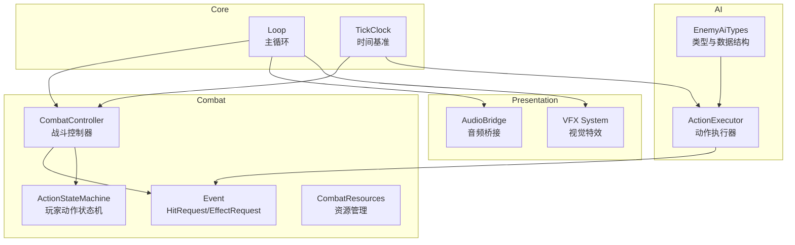
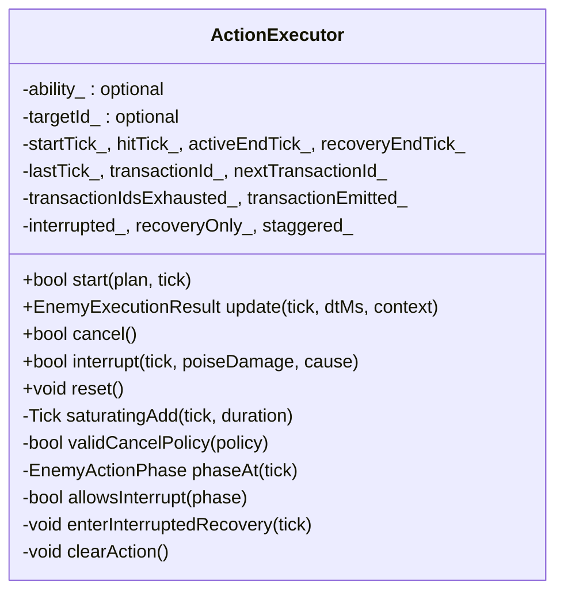
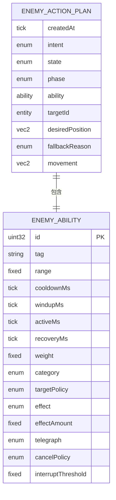
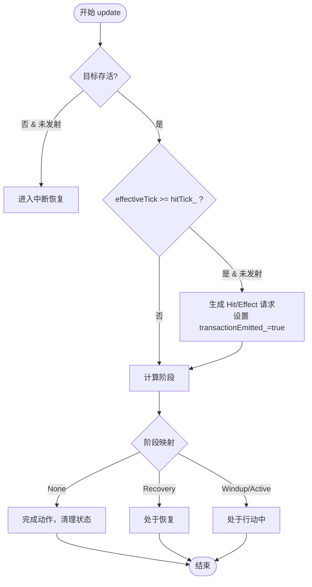
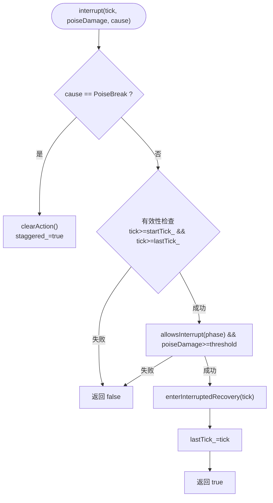
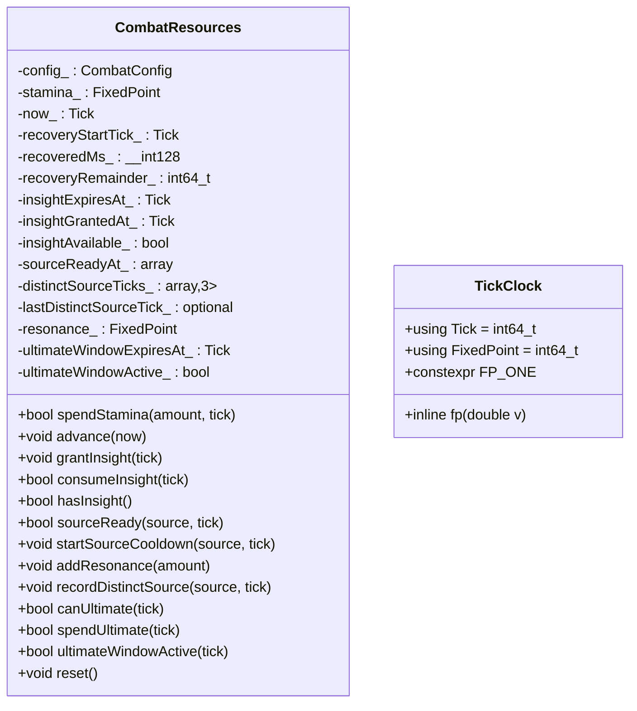
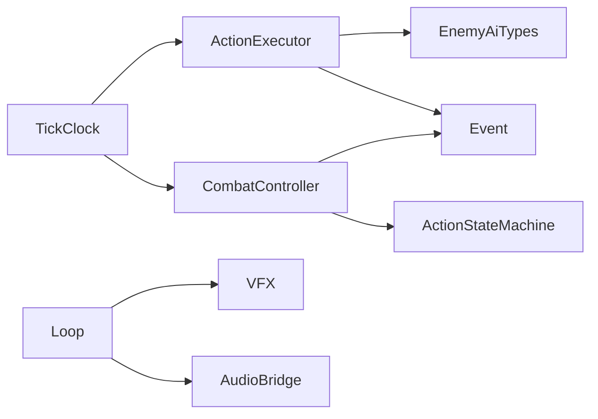

# 动作执行器

<cite>
**本文引用的文件**   
- [action_executor.h](file://native/gameplay/ai/action_executor.h)
- [action_executor.cpp](file://native/gameplay/ai/action_executor.cpp)
- [enemy_ai_types.h](file://native/gameplay/ai/enemy_ai_types.h)
- [event.h](file://native/gameplay/combat/event.h)
- [combat_controller.h](file://native/gameplay/combat/combat_controller.h)
- [action_state_machine.h](file://native/gameplay/combat/action_state_machine.h)
- [combat_resources.h](file://native/gameplay/combat/combat_resources.h)
- [tick_clock.h](file://native/engine/core/tick_clock.h)
- [loop.cpp](file://native/engine/core/loop.cpp)
- [audio_bridge.h](file://native/platform/harmony/audio_bridge.h)
- [vfx_system.cpp](file://native/engine/presentation/vfx_system.cpp)
- [test_enemy_action_executor.cpp](file://tests/test_enemy_action_executor.cpp)
</cite>

## 目录
1. [简介](#简介)
2. [项目结构](#项目结构)
3. [核心组件](#核心组件)
4. [架构总览](#架构总览)
5. [详细组件分析](#详细组件分析)
6. [依赖关系分析](#依赖关系分析)
7. [性能考量](#性能考量)
8. [故障排查指南](#故障排查指南)
9. [结论](#结论)
10. [附录](#附录)

## 简介
本文件为 ActionExecutor（动作执行器）的全面技术文档，聚焦于敌人侧动作的执行与生命周期管理。内容涵盖：
- 动作队列与状态机：固定时间轴、阶段划分（准备、生效、恢复）、中断与失衡（Staggered）。
- 同步与异步执行：基于 Tick 的确定性推进，事件批处理与表现层解耦。
- 优先级与冲突解决：通过能力配置（取消策略、打断阈值）与执行上下文控制。
- 资源预分配与事务：交易 ID 用于命中/效果请求的去重与回滚。
- 动画与音效联动：战斗事件到 VFX/Audio 的分发流程。
- 自定义动作开发规范与性能优化建议。

## 项目结构
ActionExecutor 位于 AI 子系统，负责将“敌人能力计划”转换为可执行的阶段化动作，并在每帧更新中产出命中或效果请求。它与战斗系统的事件协议紧密耦合，并通过循环框架统一调度。



**图表来源** 
- [action_executor.h:1-67](file://native/gameplay/ai/action_executor.h#L1-L67)
- [action_executor.cpp:1-216](file://native/gameplay/ai/action_executor.cpp#L1-L216)
- [enemy_ai_types.h:1-160](file://native/gameplay/ai/enemy_ai_types.h#L1-L160)
- [event.h:1-96](file://native/gameplay/combat/event.h#L1-L96)
- [combat_controller.h:1-117](file://native/gameplay/combat/combat_controller.h#L1-L117)
- [action_state_machine.h:24-55](file://native/gameplay/combat/action_state_machine.h#L24-L55)
- [combat_resources.h:1-52](file://native/gameplay/combat/combat_resources.h#L1-L52)
- [tick_clock.h:1-7](file://native/engine/core/tick_clock.h#L1-L7)
- [loop.cpp:514-530](file://native/engine/core/loop.cpp#L514-L530)
- [audio_bridge.h:1-26](file://native/platform/harmony/audio_bridge.h#L1-L26)
- [vfx_system.cpp:1-26](file://native/engine/presentation/vfx_system.cpp#L1-L26)

**章节来源**
- [action_executor.h:1-67](file://native/gameplay/ai/action_executor.h#L1-L67)
- [action_executor.cpp:1-216](file://native/gameplay/ai/action_executor.cpp#L1-L216)
- [enemy_ai_types.h:1-160](file://native/gameplay/ai/enemy_ai_types.h#L1-L160)
- [event.h:1-96](file://native/gameplay/combat/event.h#L1-L96)
- [combat_controller.h:1-117](file://native/gameplay/combat/combat_controller.h#L1-L117)
- [action_state_machine.h:24-55](file://native/gameplay/combat/action_state_machine.h#L24-L55)
- [combat_resources.h:1-52](file://native/gameplay/combat/combat_resources.h#L1-L52)
- [tick_clock.h:1-7](file://native/engine/core/tick_clock.h#L1-L7)
- [loop.cpp:514-530](file://native/engine/core/loop.cpp#L514-L530)
- [audio_bridge.h:1-26](file://native/platform/harmony/audio_bridge.h#L1-L26)
- [vfx_system.cpp:1-26](file://native/engine/presentation/vfx_system.cpp#L1-L26)

## 核心组件
- ActionExecutor：根据 EnemyActionPlan 驱动能力的时间轴，输出 HitRequest 或 CombatEffectRequest，并维护阶段、中断、恢复与失衡状态。
- EnemyAbility/EnemyActionPlan：能力定义与执行计划，包含时间参数、目标策略、效果类型、取消策略与打断阈值。
- Event 协议：HitRequest、CombatEffectRequest、Gameplay/Presentation 事件，贯穿战斗与表现层。
- CombatController/ActionStateMachine：玩家侧动作状态机与战斗控制器，与敌人侧执行器通过事件交互。
- TickClock：统一的 Tick 时间与定点数 FixedPoint，保证确定性。

**章节来源**
- [action_executor.h:1-67](file://native/gameplay/ai/action_executor.h#L1-L67)
- [action_executor.cpp:1-216](file://native/gameplay/ai/action_executor.cpp#L1-L216)
- [enemy_ai_types.h:1-160](file://native/gameplay/ai/enemy_ai_types.h#L1-L160)
- [event.h:1-96](file://native/gameplay/combat/event.h#L1-L96)
- [combat_controller.h:1-117](file://native/gameplay/combat/combat_controller.h#L1-L117)
- [action_state_machine.h:24-55](file://native/gameplay/combat/action_state_machine.h#L24-L55)
- [tick_clock.h:1-7](file://native/engine/core/tick_clock.h#L1-L7)

## 架构总览
ActionExecutor 在每帧被 update(tick, dtMs, context) 推进，依据能力的时间轴计算当前阶段，并在命中时刻生成事务化的命中/效果请求。结果由上层战斗系统消费，最终进入表现层进行动画与音效触发。

```mermaid
sequenceDiagram
participant Loop as "主循环"
participant CC as "战斗控制器"
participant AE as "动作执行器"
participant EVT as "事件协议"
participant VFX as "VFX系统"
participant AUD as "音频桥接"
Loop->>CC : update(input)
CC->>AE : start(plan, tick)
Loop->>AE : update(tick, dtMs, context)
AE-->>EVT : HitRequest/CombatEffectRequest(带transactionId)
CC-->>Loop : CombatEventBatch(gameplay,presentation)
Loop->>VFX : consume(batch)
Loop->>AUD : dispatch(batch)
VFX-->>Loop : 动画/特效
AUD-->>Loop : 音效播放
```

**图表来源** 
- [action_executor.cpp:124-190](file://native/gameplay/ai/action_executor.cpp#L124-L190)
- [event.h:16-40](file://native/gameplay/combat/event.h#L16-L40)
- [combat_controller.h:56-59](file://native/gameplay/combat/combat_controller.h#L56-L59)
- [loop.cpp:514-530](file://native/engine/core/loop.cpp#L514-L530)
- [audio_bridge.h:22-22](file://native/platform/harmony/audio_bridge.h#L22-L22)
- [vfx_system.cpp:1-26](file://native/engine/presentation/vfx_system.cpp#L1-L26)

## 详细组件分析

### ActionExecutor 类与状态机
- 能力时间轴：windup -> active -> recovery，使用 saturatingAdd 避免溢出。
- 阶段判定：phaseAt(tick) 返回 None/Windup/Active/Recovery。
- 中断机制：interrupt(tick, poiseDamage, cause) 支持普通打断与失衡（PoiseBreak），后者强制进入 Staggered。
- 事务化：transactionId_ 自增，确保同一帧内只产生一次命中/效果；recoveryOnly_ 与 interrupted_ 标记恢复路径。
- 生命周期：start/update/cancel/reset 完整覆盖启动、推进、取消与重置。



**图表来源** 
- [action_executor.h:33-66](file://native/gameplay/ai/action_executor.h#L33-L66)
- [action_executor.cpp:23-69](file://native/gameplay/ai/action_executor.cpp#L23-L69)
- [action_executor.cpp:71-122](file://native/gameplay/ai/action_executor.cpp#L71-L122)
- [action_executor.cpp:124-216](file://native/gameplay/ai/action_executor.cpp#L124-L216)

**章节来源**
- [action_executor.h:1-67](file://native/gameplay/ai/action_executor.h#L1-L67)
- [action_executor.cpp:1-216](file://native/gameplay/ai/action_executor.cpp#L1-L216)

### 动作定义与计划（EnemyAbility / EnemyActionPlan）
- EnemyAbility：id、tag、范围、冷却、三段时长、权重、类别、目标策略、效果类型与数值、提示样式、取消策略、打断阈值。
- EnemyActionPlan：创建时间、意图、AI状态、阶段、能力快照、目标ID、期望位置、回退原因、移动向量。
- 校验规则：validEffectPayload 对 Shield/Damage/AreaDamage/Move/Control 的效果数值合法性进行检查；validCancelPolicy 限制取消策略枚举。



**图表来源** 
- [enemy_ai_types.h:79-95](file://native/gameplay/ai/enemy_ai_types.h#L79-L95)
- [enemy_ai_types.h:149-160](file://native/gameplay/ai/enemy_ai_types.h#L149-L160)
- [action_executor.cpp:8-19](file://native/gameplay/ai/action_executor.cpp#L8-L19)

**章节来源**
- [enemy_ai_types.h:1-160](file://native/gameplay/ai/enemy_ai_types.h#L1-L160)
- [action_executor.cpp:8-19](file://native/gameplay/ai/action_executor.cpp#L8-L19)

### 事件协议与事务化（HitRequest / CombatEffectRequest）
- HitRequest：攻击者、目标、能力ID、来源类型、基础伤害、霸体伤害、Tick、序列号、来源倍率、事务ID。
- CombatEffectRequest：目标、效果类型（如护盾）、数值、Tick、序列号、事务ID。
- 事务化：每个 start 分配唯一 transactionId_，update 中仅当 effectiveTick >= hitTick_ 且未发射时生成一次请求，重复调用不重复产出。



**图表来源** 
- [action_executor.cpp:124-190](file://native/gameplay/ai/action_executor.cpp#L124-L190)
- [event.h:16-40](file://native/gameplay/combat/event.h#L16-L40)

**章节来源**
- [action_executor.cpp:124-190](file://native/gameplay/ai/action_executor.cpp#L124-L190)
- [event.h:16-40](file://native/gameplay/combat/event.h#L16-L40)

### 中断与失衡（Interrupt & Staggered）
- 普通打断：需要满足取消策略（Uninterruptible/WindupOnly/WindupAndActive）、当前阶段允许、poiseDamage >= interruptThreshold。
- 失衡打断：cause=PoiseBreak 直接清空动作并进入 Staggered，无视取消策略。
- 恢复路径：enterInterruptedRecovery 设置 recoveryOnly_ 与新的 recoveryEndTick_，后续 update 仅推进恢复阶段。



**图表来源** 
- [action_executor.cpp:103-122](file://native/gameplay/ai/action_executor.cpp#L103-L122)
- [action_executor.cpp:96-101](file://native/gameplay/ai/action_executor.cpp#L96-L101)

**章节来源**
- [action_executor.cpp:103-122](file://native/gameplay/ai/action_executor.cpp#L103-L122)
- [action_executor.cpp:96-101](file://native/gameplay/ai/action_executor.cpp#L96-L101)

### 与战斗系统的集成（CombatController / ActionStateMachine）
- CombatController 维护玩家侧 ActionStateMachine 与事件批处理，向表现层分发 Gameplay/Presentation 事件。
- ActionExecutor 产出的 HitRequest/CombatEffectRequest 会被战斗系统消费，转化为 GameplayEvent，再由 loop 推送至 VFX/Audio。

```mermaid
sequenceDiagram
participant CC as "CombatController"
participant AE as "ActionExecutor"
participant Loop as "主循环"
participant VFX as "VFX"
participant AUD as "AudioBridge"
CC->>AE : update(tick, dtMs, context)
AE-->>CC : HitRequest/CombatEffectRequest
CC-->>Loop : CombatEventBatch
Loop->>VFX : consume(batch)
Loop->>AUD : dispatch(batch)
```

**图表来源** 
- [combat_controller.h:56-59](file://native/gameplay/combat/combat_controller.h#L56-L59)
- [loop.cpp:514-530](file://native/engine/core/loop.cpp#L514-L530)
- [action_executor.cpp:124-190](file://native/gameplay/ai/action_executor.cpp#L124-L190)

**章节来源**
- [combat_controller.h:1-117](file://native/gameplay/combat/combat_controller.h#L1-L117)
- [loop.cpp:514-530](file://native/engine/core/loop.cpp#L514-L530)

### 资源管理与时序（CombatResources / TickClock）
- CombatResources：耐力、洞察、源技能冷却、共鸣与终极窗口管理，提供 advance(tick) 推进与 spendStamina 等接口。
- TickClock：Tick 与 FixedPoint 定义，fp() 辅助函数，确保数值一致性。



**图表来源** 
- [combat_resources.h:1-52](file://native/gameplay/combat/combat_resources.h#L1-L52)
- [tick_clock.h:1-7](file://native/engine/core/tick_clock.h#L1-L7)

**章节来源**
- [combat_resources.h:1-52](file://native/gameplay/combat/combat_resources.h#L1-L52)
- [tick_clock.h:1-7](file://native/engine/core/tick_clock.h#L1-L7)

### 测试用例与行为验证
- 固定时间轴与单次命中：验证 Windup/Active/Recovery 阶段转换与命中仅在 hitTick_ 产生一次。
- 护盾效果：Shield 类型能力不产生命中，仅产生效果请求。
- 大帧推进：跨越多阶段仍保持原始 hitTick_，并正确过渡到 None。
- 恢复期拒绝新动作：Recovery 期间 start 返回 false。
- 打断策略：WindupOnly/WindupAndActive 与阈值校验；PoiseBreak 强制失衡。
- 不可变快照：执行期间修改 plan/ability 不影响已生成的事务。
- 目标死亡：无能力或目标死亡不会产生事务；目标在命中后死亡不延长恢复。
- 饱和边界：Tick 最大值下 saturatingAdd 防止溢出。

**章节来源**
- [test_enemy_action_executor.cpp:1-256](file://tests/test_enemy_action_executor.cpp#L1-L256)

## 依赖关系分析
- ActionExecutor 依赖 enemy_ai_types.h 的能力与计划结构，以及 event.h 的事件协议。
- 与 combat_controller.h 和 action_state_machine.h 间接协作，通过事件批处理与主循环整合。
- 使用 tick_clock.h 的 Tick/FixedPoint 保证确定性。
- 表现层通过 loop.cpp 消费事件，驱动 vfx_system.cpp 与 audio_bridge.h。



**图表来源** 
- [action_executor.h:1-67](file://native/gameplay/ai/action_executor.h#L1-L67)
- [enemy_ai_types.h:1-160](file://native/gameplay/ai/enemy_ai_types.h#L1-L160)
- [event.h:1-96](file://native/gameplay/combat/event.h#L1-L96)
- [combat_controller.h:1-117](file://native/gameplay/combat/combat_controller.h#L1-L117)
- [action_state_machine.h:24-55](file://native/gameplay/combat/action_state_machine.h#L24-L55)
- [tick_clock.h:1-7](file://native/engine/core/tick_clock.h#L1-L7)
- [loop.cpp:514-530](file://native/engine/core/loop.cpp#L514-L530)
- [audio_bridge.h:1-26](file://native/platform/harmony/audio_bridge.h#L1-L26)
- [vfx_system.cpp:1-26](file://native/engine/presentation/vfx_system.cpp#L1-L26)

**章节来源**
- [action_executor.h:1-67](file://native/gameplay/ai/action_executor.h#L1-L67)
- [enemy_ai_types.h:1-160](file://native/gameplay/ai/enemy_ai_types.h#L1-L160)
- [event.h:1-96](file://native/gameplay/combat/event.h#L1-L96)
- [combat_controller.h:1-117](file://native/gameplay/combat/combat_controller.h#L1-L117)
- [action_state_machine.h:24-55](file://native/gameplay/combat/action_state_machine.h#L24-L55)
- [tick_clock.h:1-7](file://native/engine/core/tick_clock.h#L1-L7)
- [loop.cpp:514-530](file://native/engine/core/loop.cpp#L514-L530)
- [audio_bridge.h:1-26](file://native/platform/harmony/audio_bridge.h#L1-L26)
- [vfx_system.cpp:1-26](file://native/engine/presentation/vfx_system.cpp#L1-L26)

## 性能考量
- 确定性推进：使用 saturatingAdd 避免 Tick 溢出，减少分支与异常路径。
- 事务去重：transactionEmitted_ 确保每帧只生成一次命中/效果，降低重复计算与事件风暴。
- 阶段快速判定：phaseAt 采用简单比较，O(1) 复杂度。
- 资源回收：clearAction/reset 及时释放状态，避免内存与状态泄漏。
- 事件批处理：CombatEventBatch 聚合 gameplay/presentation 事件，减少跨层调用开销。
- 表现层解耦：VFX/Audio 通过统一接口消费事件，避免阻塞游戏逻辑。

[本节为通用指导，无需特定文件引用]

## 故障排查指南
- 无法启动动作：检查 plan.ability/targetId 是否有效，能力时间参数与取消策略是否合法。
- 命中未产生：确认 effectiveTick >= hitTick_ 且 transactionEmitted_ 为 false；目标存活与否影响恢复路径。
- 打断无效：核对 cancelPolicy、当前阶段与 poiseDamage 是否达到 interruptThreshold。
- 恢复期过长：检查 recoveryEndTick_ 是否正确设置；目标死亡不会延长恢复。
- 事务重复：确认 transactionEmitted_ 标志位；重复 update 不应再次产出请求。
- 溢出问题：Tick 接近最大值时使用 saturatingAdd，避免 UB。

**章节来源**
- [action_executor.cpp:39-69](file://native/gameplay/ai/action_executor.cpp#L39-L69)
- [action_executor.cpp:124-190](file://native/gameplay/ai/action_executor.cpp#L124-L190)
- [action_executor.cpp:103-122](file://native/gameplay/ai/action_executor.cpp#L103-L122)
- [test_enemy_action_executor.cpp:127-183](file://tests/test_enemy_action_executor.cpp#L127-L183)

## 结论
ActionExecutor 以固定时间轴与事务化事件为核心，提供了稳定、可预测的动作执行机制。通过取消策略与打断阈值实现精细的冲突控制，结合事件批处理与表现层解耦，确保了高性能与良好体验。建议在自定义动作开发中严格遵循能力定义规范，合理配置时间参数与策略，并利用测试用例验证行为。

[本节为总结性内容，无需特定文件引用]

## 附录

### 动作定义标准格式（参考）
- 必填字段：id、windupMs、activeMs、recoveryMs、effect、cancelPolicy、interruptThreshold。
- 可选字段：tag、range、cooldownMs、weight、category、targetPolicy、telegraph、effectAmount。
- 校验规则：validEffectPayload 与 validCancelPolicy 必须通过。

**章节来源**
- [enemy_ai_types.h:79-95](file://native/gameplay/ai/enemy_ai_types.h#L79-L95)
- [action_executor.cpp:8-19](file://native/gameplay/ai/action_executor.cpp#L8-L19)

### 自定义动作开发指南
- 设计能力：明确效果类型（Damage/AreaDamage/Shield/Move/Control），设定合理时长与阈值。
- 目标策略：选择 CurrentTarget/NearestHostile/LowestHealthHostile/LowestShieldAlly/Self。
- 取消策略：根据手感与平衡选择 Uninterruptible/WindupOnly/WindupAndActive。
- 测试验证：使用 test_enemy_action_executor.cpp 中的模式构造计划与上下文，覆盖正常、恢复、打断、失衡与边界场景。

**章节来源**
- [enemy_ai_types.h:45-75](file://native/gameplay/ai/enemy_ai_types.h#L45-L75)
- [test_enemy_action_executor.cpp:1-256](file://tests/test_enemy_action_executor.cpp#L1-L256)

### 动作性能优化方法
- 最小化 update 分支：优先判断阶段与事务发射条件。
- 批量事件：合并多源事件，减少跨层调用。
- 资源复用：缓存能力元数据，避免频繁分配。
- 确定性模拟：使用 Tick/FixedPoint，避免浮点误差累积。

[本节为通用指导，无需特定文件引用]