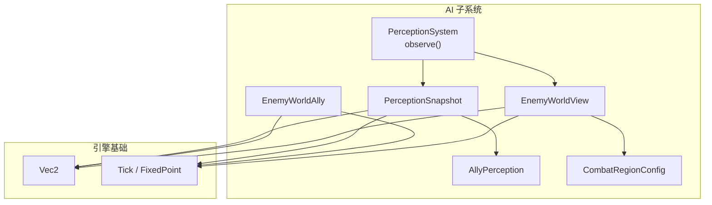
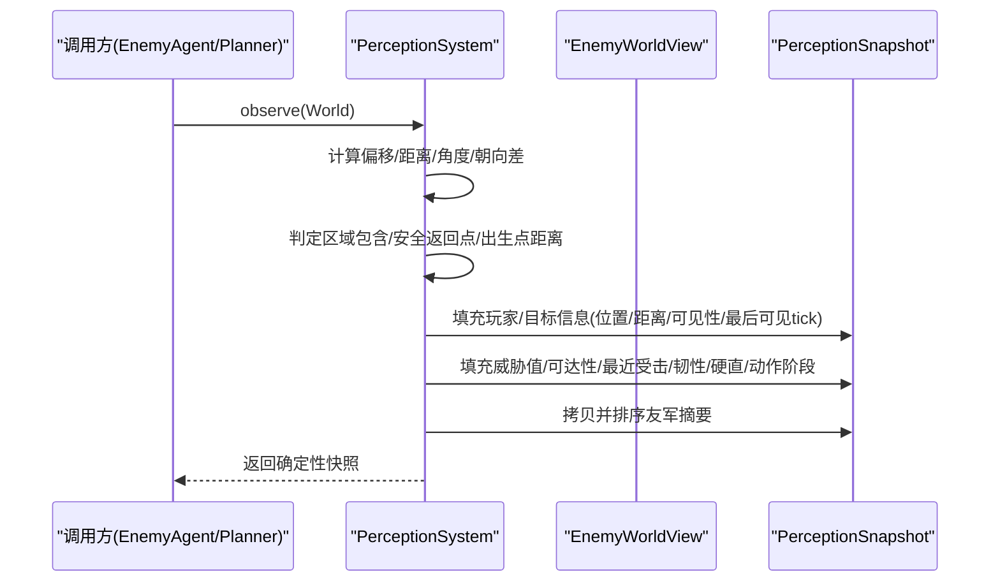
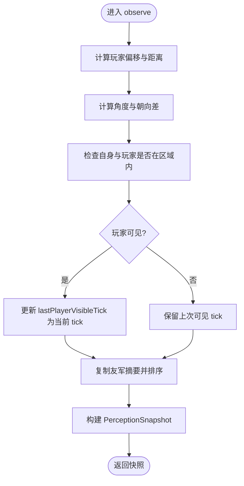
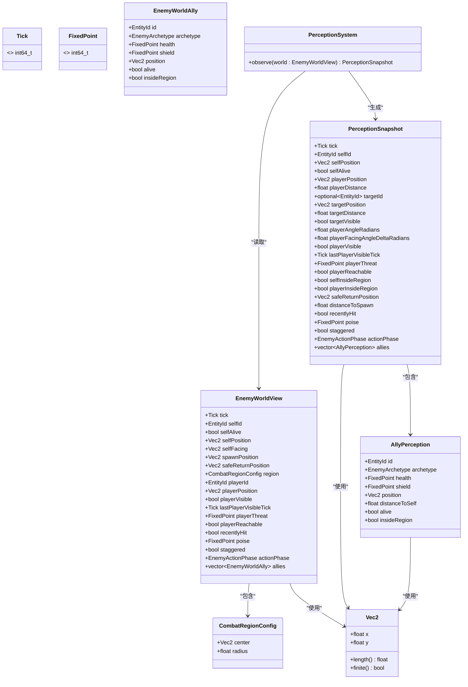
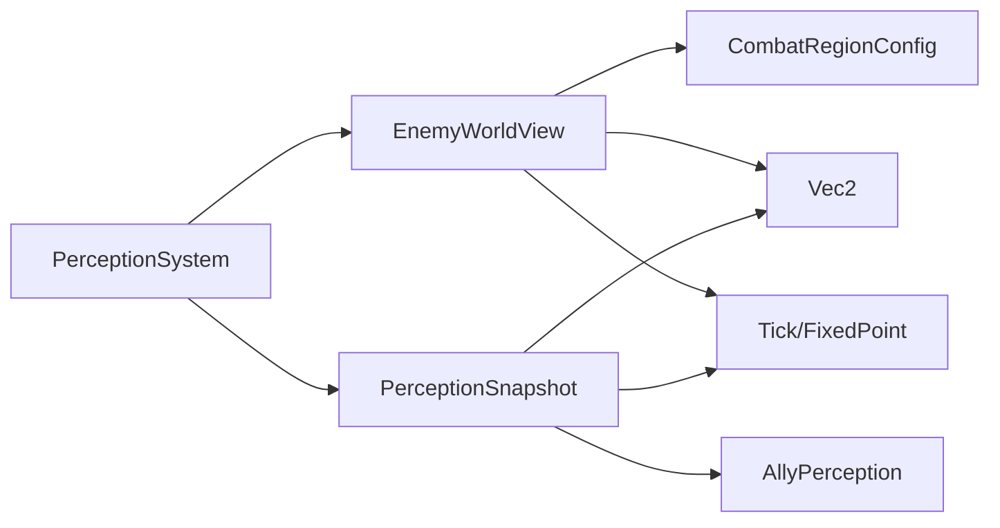

# 感知系统

<cite>
**本文引用的文件**   
- [perception_system.h](file://native/gameplay/ai/perception_system.h)
- [perception_system.cpp](file://native/gameplay/ai/perception_system.cpp)
- [enemy_ai_types.h](file://native/gameplay/ai/enemy_ai_types.h)
- [enemy_ai_config.h](file://native/gameplay/ai/enemy_ai_config.h)
- [vec2.h](file://native/engine/math/vec2.h)
- [tick_clock.h](file://native/engine/core/tick_clock.h)
- [test_enemy_perception.cpp](file://tests/test_enemy_perception.cpp)
- [2026-07-17-enemy-ai-design.md](file://docs/superpowers/specs/2026-07-17-enemy-ai-design.md)
</cite>

## 目录
1. [简介](#简介)
2. [项目结构](#项目结构)
3. [核心组件](#核心组件)
4. [架构总览](#架构总览)
5. [详细组件分析](#详细组件分析)
6. [依赖关系分析](#依赖关系分析)
7. [性能与更新频率](#性能与更新频率)
8. [配置与阈值](#配置与阈值)
9. [多目标感知与优先级](#多目标感知与优先级)
10. [误报处理机制](#误报处理机制)
11. [调试与可视化](#调试与可视化)
12. [结论](#结论)

## 简介
本文件为 PerceptionSystem 感知系统的技术文档，聚焦于敌人对玩家的视觉、听觉感知范围与检测算法。当前实现以“事实收集”为核心：将世界状态（位置、朝向、可见性、威胁值、可达性、区域关系、友军摘要等）聚合为一份不可变快照 PerceptionSnapshot，供上层决策层与战术规划使用。该设计明确职责边界：感知层不做策略判断，未来扩展（如听觉、潜行、遮挡、环境感知）通过新增字段或版本化扩展完成。

## 项目结构
感知系统位于 AI 子系统内，围绕以下关键文件组织：
- 感知系统与输入视图定义：perception_system.h/.cpp
- 感知快照与类型定义：enemy_ai_types.h
- 战斗区域配置：enemy_ai_config.h
- 数学基础类型：vec2.h、tick_clock.h
- 单元测试：test_enemy_perception.cpp
- 设计规格：2026-07-17-enemy-ai-design.md

图表来源
- [perception_system.h:1-44](file://native/gameplay/ai/perception_system.h#L1-L44)
- [perception_system.cpp:32-74](file://native/gameplay/ai/perception_system.cpp#L32-L74)
- [enemy_ai_types.h:102-139](file://native/gameplay/ai/enemy_ai_types.h#L102-L139)
- [enemy_ai_config.h:11-14](file://native/gameplay/ai/enemy_ai_config.h#L11-L14)
- [vec2.h:4-16](file://native/engine/math/vec2.h#L4-L16)
- [tick_clock.h:1-6](file://native/engine/core/tick_clock.h#L1-L6)

章节来源
- [perception_system.h:1-44](file://native/gameplay/ai/perception_system.h#L1-L44)
- [perception_system.cpp:32-74](file://native/gameplay/ai/perception_system.cpp#L32-L74)
- [enemy_ai_types.h:102-139](file://native/gameplay/ai/enemy_ai_types.h#L102-L139)
- [enemy_ai_config.h:11-14](file://native/gameplay/ai/enemy_ai_config.h#L11-L14)
- [vec2.h:4-16](file://native/engine/math/vec2.h#L4-L16)
- [tick_clock.h:1-6](file://native/engine/core/tick_clock.h#L1-L6)

## 核心组件
- PerceptionSystem：提供 observe(world) 方法，将 EnemyWorldView 转换为 PerceptionSnapshot。
- EnemyWorldView：描述敌人在某一帧的世界视角，包含自身状态、玩家信息、区域与安全点、友军列表等。
- PerceptionSnapshot：只读的事实快照，包含距离、角度、可见性、威胁值、可达性、区域关系、最近受击、韧性、硬直、动作阶段及友军摘要。
- AllyPerception：友军的感知摘要，含 ID、原型、生命/护盾、位置、到自身的距离、存活与区域状态。
- CombatRegionConfig：战斗区域的中心与半径，用于计算是否处于区域内。
- Vec2 / Tick / FixedPoint：二维向量、时间刻度与定点数类型。

章节来源
- [perception_system.h:7-39](file://native/gameplay/ai/perception_system.h#L7-L39)
- [enemy_ai_types.h:102-139](file://native/gameplay/ai/enemy_ai_types.h#L102-L139)
- [enemy_ai_config.h:11-14](file://native/gameplay/ai/enemy_ai_config.h#L11-L14)
- [vec2.h:4-16](file://native/engine/math/vec2.h#L4-L16)
- [tick_clock.h:1-6](file://native/engine/core/tick_clock.h#L1-L6)

## 架构总览
感知系统作为纯函数式的数据聚合器，不持有状态，也不做策略判断。其调用流程如下：

图表来源
- [perception_system.cpp:32-74](file://native/gameplay/ai/perception_system.cpp#L32-L74)
- [enemy_ai_types.h:113-139](file://native/gameplay/ai/enemy_ai_types.h#L113-L139)

## 详细组件分析

### PerceptionSystem::observe 算法
- 输入：EnemyWorldView（包含 tick、自身位置/朝向、玩家位置/可见性/威胁值/可达性、区域与安全点、友军列表等）。
- 输出：PerceptionSnapshot（包含上述信息的标准化快照）。
- 关键计算：
  - 玩家偏移与距离：playerOffset = playerPosition - selfPosition；distance = length(playerOffset)。
  - 角度与朝向差：angleOf(offset) 得到弧度角；normalizedAngle(angle - angleOf(selfFacing)) 得到归一化的朝向差。
  - 区域包含：insideRegion(point, region) 基于 center 与 radius 的圆内判定。
  - 友军摘要：复制并稳定排序（按 id 升序），确保确定性。
  - 可见性时间戳：若当前可见则更新 lastPlayerVisibleTick 为当前 tick，否则保持原值。
- 复杂度：O(N)，N 为友军数量（仅一次线性遍历与排序）。

图表来源
- [perception_system.cpp:32-74](file://native/gameplay/ai/perception_system.cpp#L32-L74)

章节来源
- [perception_system.cpp:32-74](file://native/gameplay/ai/perception_system.cpp#L32-L74)
- [test_enemy_perception.cpp:76-107](file://tests/test_enemy_perception.cpp#L76-L107)

### 数据结构与关系

图表来源
- [perception_system.h:7-39](file://native/gameplay/ai/perception_system.h#L7-L39)
- [enemy_ai_types.h:102-139](file://native/gameplay/ai/enemy_ai_types.h#L102-L139)
- [enemy_ai_config.h:11-14](file://native/gameplay/ai/enemy_ai_config.h#L11-L14)
- [vec2.h:4-16](file://native/engine/math/vec2.h#L4-L16)

章节来源
- [perception_system.h:7-39](file://native/gameplay/ai/perception_system.h#L7-L39)
- [enemy_ai_types.h:102-139](file://native/gameplay/ai/enemy_ai_types.h#L102-L139)
- [enemy_ai_config.h:11-14](file://native/gameplay/ai/enemy_ai_config.h#L11-L14)
- [vec2.h:4-16](file://native/engine/math/vec2.h#L4-L16)

## 依赖关系分析
- PerceptionSystem 依赖 EnemyWorldView 提供的全部事实输入，不依赖外部状态。
- PerceptionSnapshot 由 EnemyWorldView 派生而来，包含所有必要事实，供决策层与战术规划使用。
- 区域判定依赖 CombatRegionConfig（center、radius）。
- 数值类型依赖 Vec2、Tick、FixedPoint。

图表来源
- [perception_system.cpp:32-74](file://native/gameplay/ai/perception_system.cpp#L32-L74)
- [enemy_ai_types.h:102-139](file://native/gameplay/ai/enemy_ai_types.h#L102-L139)
- [enemy_ai_config.h:11-14](file://native/gameplay/ai/enemy_ai_config.h#L11-L14)
- [vec2.h:4-16](file://native/engine/math/vec2.h#L4-L16)
- [tick_clock.h:1-6](file://native/engine/core/tick_clock.h#L1-L6)

章节来源
- [perception_system.cpp:32-74](file://native/gameplay/ai/perception_system.cpp#L32-L74)
- [enemy_ai_types.h:102-139](file://native/gameplay/ai/enemy_ai_types.h#L102-L139)
- [enemy_ai_config.h:11-14](file://native/gameplay/ai/enemy_ai_config.h#L11-L14)
- [vec2.h:4-16](file://native/engine/math/vec2.h#L4-L16)
- [tick_clock.h:1-6](file://native/engine/core/tick_clock.h#L1-L6)

## 性能与更新频率
- 更新频率：由调用方在每帧或固定步长中调用 observe(world) 产生新的快照。由于 PerceptionSystem 无状态且操作为 O(N)，适合高频调用。
- 缓存机制：PerceptionSystem 本身不缓存结果；调用方可按需缓存 PerceptionSnapshot（例如在决策周期内复用），避免重复计算。
- 性能优化建议：
  - 批量观察：若多个敌人共享相同 world 视图，可复用中间计算（如玩家偏移、角度）。
  - 友军列表裁剪：仅在需要时传入必要的盟友子集，减少排序开销。
  - 避免不必要的拷贝：在高层消费快照时尽量引用而非深拷贝。

[本节为通用指导，不直接分析具体文件]

## 配置与阈值
- 当前感知系统不包含显式的视觉/听觉阈值参数（如视野角度、距离衰减系数）。这些应由上层（如 EnemyAgent/DecisionPolicy）根据 PerceptionSnapshot 中的事实进行判断。
- 区域配置 CombatRegionConfig.center 与 radius 可用于“是否在区域内”的判断，影响行为（如返回安全点、追击范围）。
- 威胁值 playerThreat、可达性 playerReachable、最近受击 recentlyHit、韧性 poise、硬直 staggered、动作阶段 actionPhase 等均为事实字段，供上层策略使用。

章节来源
- [enemy_ai_config.h:11-14](file://native/gameplay/ai/enemy_ai_config.h#L11-L14)
- [enemy_ai_types.h:113-139](file://native/gameplay/ai/enemy_ai_types.h#L113-L139)
- [2026-07-17-enemy-ai-design.md:74-85](file://docs/superpowers/specs/2026-07-17-enemy-ai-design.md#L74-L85)

## 多目标感知与优先级
- 当前实现聚焦单一目标（玩家）感知，并通过 targetId/targetPosition/targetDistance/targetVisible 表达目标信息。
- 友军摘要 AllyPerception 支持多目标（盟友）感知，并按 id 稳定排序，便于上层进行优先级选择（如最低护盾、最近距离等）。
- 未来如需多目标敌人感知，可在 PerceptionSnapshot 中扩展 targets 列表，并在 observe 中统一计算距离、角度、可见性等事实，再由上层策略进行优先级排序。

章节来源
- [enemy_ai_types.h:102-139](file://native/gameplay/ai/enemy_ai_types.h#L102-L139)
- [perception_system.cpp:64-73](file://native/gameplay/ai/perception_system.cpp#L64-L73)

## 误报处理机制
- 可见性时间戳：lastPlayerVisibleTick 记录最后一次可见的 tick，当 playerVisible 为 false 时保持不变，供上层判断“丢失目标的时间长度”，从而降低瞬时遮挡导致的误报。
- 可达性与区域约束：playerReachable 与 selfInsideRegion/playerInsideRegion 可作为过滤条件，避免对不可达或越界目标做出错误决策。
- 最近受击与硬直：recentlyHit 与 staggered 可抑制短期内的攻击意图，减少因短暂受击造成的行为抖动。

章节来源
- [perception_system.cpp:52-56](file://native/gameplay/ai/perception_system.cpp#L52-L56)
- [enemy_ai_types.h:113-139](file://native/gameplay/ai/enemy_ai_types.h#L113-L139)

## 调试与可视化
- 单元测试覆盖：test_enemy_perception.cpp 验证了 observe 的确定性、角度计算、可见性时间戳、友军排序等关键路径。
- 调试建议：
  - 打印 PerceptionSnapshot 关键字段（tick、playerDistance、playerVisible、lastPlayerVisibleTick、selfInsideRegion、playerInsideRegion、allies.size() 与排序顺序）。
  - 可视化区域与位置：绘制 CombatRegionConfig.center 与 radius，以及 selfPosition、playerPosition、safeReturnPosition、spawnPosition。
  - 角度与朝向差：绘制 selfFacing 与 playerOffset 的角度，辅助调试视线方向与朝向差。
  - 稳定性验证：多次调用 observe 并断言快照一致，确保无随机性或迭代顺序依赖。

章节来源
- [test_enemy_perception.cpp:76-107](file://tests/test_enemy_perception.cpp#L76-L107)
- [2026-07-17-enemy-ai-design.md:74-85](file://docs/superpowers/specs/2026-07-17-enemy-ai-design.md#L74-L85)

## 结论
PerceptionSystem 以“事实收集”为核心，提供确定性的感知快照，支撑上层决策与战术规划。当前实现未内置视觉/听觉阈值与遮挡计算，但通过 playerVisible、lastPlayerVisibleTick、playerReachable、区域包含等事实字段，为上层策略提供了足够的信息以降低误报与抖动。未来扩展（听觉、潜行、遮挡、环境感知）可通过新增字段或版本化扩展完成，保持职责边界清晰与系统可扩展性。