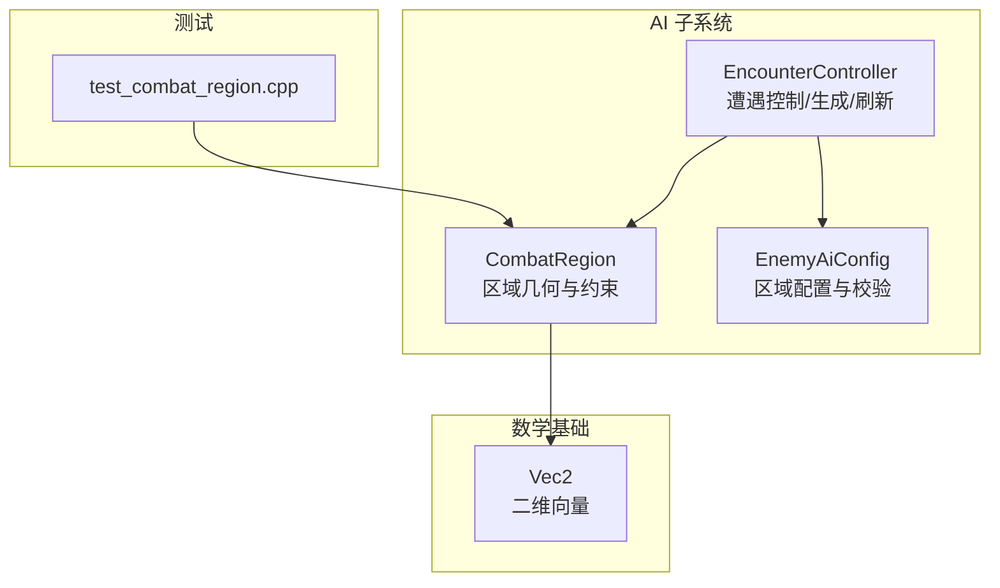
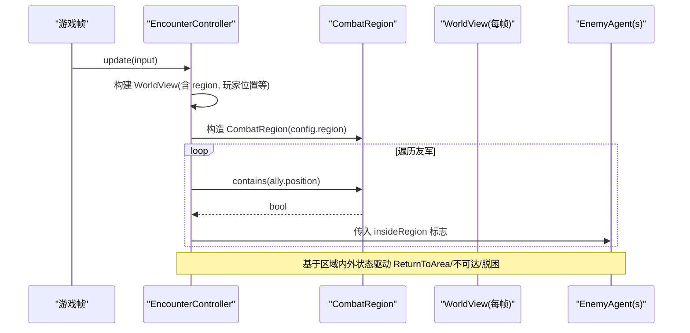
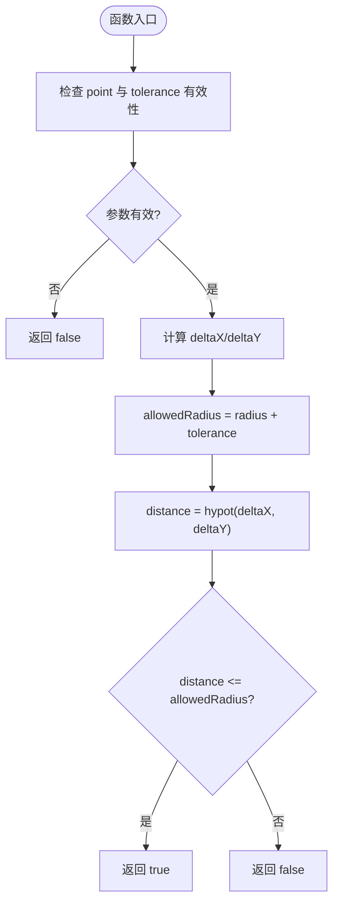
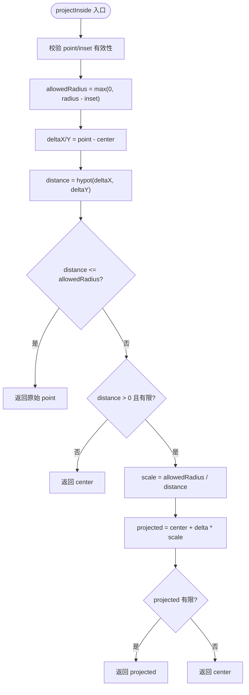
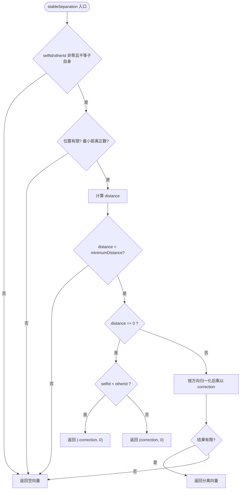
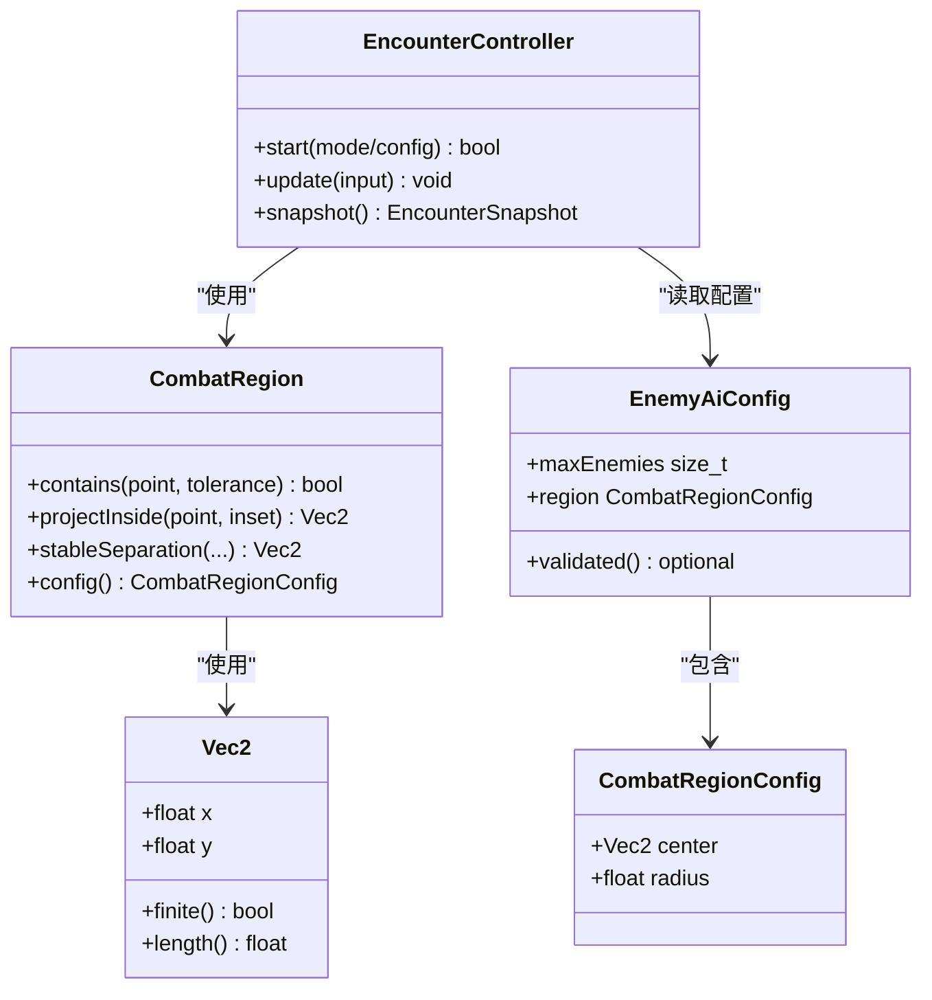

# 战斗区域

<cite>
**本文引用的文件**   
- [combat_region.h](file://native/gameplay/ai/combat_region.h)
- [combat_region.cpp](file://native/gameplay/ai/combat_region.cpp)
- [enemy_ai_config.h](file://native/gameplay/ai/enemy_ai_config.h)
- [encounter_controller.h](file://native/gameplay/ai/encounter_controller.h)
- [encounter_controller.cpp](file://native/gameplay/ai/encounter_controller.cpp)
- [vec2.h](file://native/engine/math/vec2.h)
- [test_combat_region.cpp](file://tests/test_combat_region.cpp)
- [2026-07-17-enemy-ai-design.md](file://docs/superpowers/specs/2026-07-17-enemy-ai-design.md)
</cite>

## 目录
1. [简介](#简介)
2. [项目结构](#项目结构)
3. [核心组件](#核心组件)
4. [架构总览](#架构总览)
5. [详细组件分析](#详细组件分析)
6. [依赖关系分析](#依赖关系分析)
7. [性能考虑](#性能考虑)
8. [故障排查指南](#故障排查指南)
9. [结论](#结论)
10. [附录](#附录)

## 简介
本文件围绕 CombatRegion（战斗区域）进行系统化文档化，覆盖几何形状定义、边界检测与碰撞计算、区域内敌人生成与刷新机制、数量限制、状态管理、进入退出条件与触发事件。同时说明当前实现的多边形支持现状、圆形区域的实现差异，并提供区域配置的 JSON 格式建议、动态区域调整方法与可视化方案。

## 项目结构
CombatRegion 位于 AI 子系统内，作为区域几何与约束的核心类型；EncounterController 负责遭遇生命周期、敌人创建与销毁、区域与出生点管理；Vec2 提供基础向量运算；测试用例验证包含与投影等关键行为。

图表来源
- [combat_region.h:1-26](file://native/gameplay/ai/combat_region.h#L1-L26)
- [combat_region.cpp:1-78](file://native/gameplay/ai/combat_region.cpp#L1-L78)
- [enemy_ai_config.h:11-44](file://native/gameplay/ai/enemy_ai_config.h#L11-L44)
- [encounter_controller.h:51-58](file://native/gameplay/ai/encounter_controller.h#L51-L58)
- [encounter_controller.cpp:403-427](file://native/gameplay/ai/encounter_controller.cpp#L403-L427)
- [vec2.h:1-24](file://native/engine/math/vec2.h#L1-L24)
- [test_combat_region.cpp:1-81](file://tests/test_combat_region.cpp#L1-L81)

章节来源
- [combat_region.h:1-26](file://native/gameplay/ai/combat_region.h#L1-L26)
- [combat_region.cpp:1-78](file://native/gameplay/ai/combat_region.cpp#L1-L78)
- [enemy_ai_config.h:11-44](file://native/gameplay/ai/enemy_ai_config.h#L11-L44)
- [encounter_controller.h:51-58](file://native/gameplay/ai/encounter_controller.h#L51-L58)
- [encounter_controller.cpp:403-427](file://native/gameplay/ai/encounter_controller.cpp#L403-L427)
- [vec2.h:1-24](file://native/engine/math/vec2.h#L1-L24)
- [test_combat_region.cpp:1-81](file://tests/test_combat_region.cpp#L1-L81)

## 核心组件
- CombatRegion：封装圆形战斗区域的中心与半径，提供点是否在区域内、将点投影到区域内的能力，以及稳定的实体间分离计算。
- EnemyAiConfig::CombatRegionConfig：定义区域中心与半径，并在校验时确保数值有效性与合法性。
- EncounterController：在每帧更新中构建世界视图，使用 CombatRegion 判断友军是否处于区域内，驱动返回区域、不可达判定与脱困流程。

章节来源
- [combat_region.h:8-25](file://native/gameplay/ai/combat_region.h#L8-L25)
- [combat_region.cpp:17-51](file://native/gameplay/ai/combat_region.cpp#L17-L51)
- [enemy_ai_config.h:11-44](file://native/gameplay/ai/enemy_ai_config.h#L11-L44)
- [encounter_controller.cpp:403-427](file://native/gameplay/ai/encounter_controller.cpp#L403-L427)

## 架构总览
CombatRegion 被 EncounterController 在每帧更新时构造并使用，用于：
- 判断友军是否在区域内（影响感知快照中的 insideRegion 字段）
- 为“返回区域”和“不可达”决策提供几何依据
- 结合稳定分离算法避免重叠抖动

图表来源
- [encounter_controller.cpp:403-427](file://native/gameplay/ai/encounter_controller.cpp#L403-L427)
- [combat_region.h:12-13](file://native/gameplay/ai/combat_region.h#L12-L13)
- [combat_region.cpp:24-51](file://native/gameplay/ai/combat_region.cpp#L24-L51)

## 详细组件分析

### CombatRegion：几何、边界与碰撞
- 几何模型：当前实现为圆形区域，由 center 与 radius 定义。
- 包含检测：contains(point, tolerance) 使用欧氏距离比较，支持容差扩展。
- 投影入内：projectInside(point, inset) 将外部点沿径向投影至允许半径内，处理无穷/NaN 输入并回退到中心。
- 稳定分离：stableSeparation(selfId, selfPos, otherId, otherPos, minDist) 对重叠或过近的实体给出对称且稳定的分离向量，按 ID 大小决定方向以避免零向量与非确定性抖动。

图表来源
- [combat_region.cpp:24-31](file://native/gameplay/ai/combat_region.cpp#L24-L31)

图表来源
- [combat_region.cpp:33-51](file://native/gameplay/ai/combat_region.cpp#L33-L51)

图表来源
- [combat_region.cpp:53-77](file://native/gameplay/ai/combat_region.cpp#L53-L77)

章节来源
- [combat_region.h:8-25](file://native/gameplay/ai/combat_region.h#L8-L25)
- [combat_region.cpp:17-77](file://native/gameplay/ai/combat_region.cpp#L17-L77)
- [test_combat_region.cpp:9-41](file://tests/test_combat_region.cpp#L9-L41)

### 区域配置与校验
- CombatRegionConfig：包含 center 与 radius，默认半径为正值。
- EnemyAiConfig.validated()：对 region 的 center 有限性、radius 为正数进行校验；非法则拒绝启动相关遭遇。
- EncounterConfig：默认区域中心与半径，供 EncounterController 初始化时使用。

章节来源
- [enemy_ai_config.h:11-44](file://native/gameplay/ai/enemy_ai_config.h#L11-L44)
- [encounter_controller.h:51-58](file://native/gameplay/ai/encounter_controller.h#L51-L58)

### 区域与遭遇控制集成
- EncounterController.update() 每帧构建 WorldView，其中包含 region 与玩家信息，并通过 CombatRegion.contains 判断友军是否在区域内，填充感知快照中的 insideRegion 字段。
- 设计文档指出：敌人不得越过战斗区域攻击；玩家离开追击容差后进入 ReturnToArea；连续若干周期未接近目标标记不可达，先尝试区域内重新定位，失败再移动到安全点并重新警戒。

章节来源
- [encounter_controller.cpp:403-427](file://native/gameplay/ai/encounter_controller.cpp#L403-L427)
- [2026-07-17-enemy-ai-design.md:226-237](file://docs/superpowers/specs/2026-07-17-enemy-ai-design.md#L226-L237)

### 多边形、圆形与矩形支持的差异
- 当前实现：CombatRegion 仅支持圆形区域（center + radius）。
- 多边形支持：代码库未提供多边形区域实现；如需支持，可在 CombatRegion 中扩展多边形表示与射线/点包含检测。
- 矩形支持：可通过两个对角点或中心+半长宽表示，但需新增包含与投影逻辑。

[本节为概念性说明，不直接分析具体文件]

### 敌人生成、刷新与数量限制
- 数量限制：EnemyAiConfig::kMaxEnemies 与 EncounterConfig.maxEnemies 共同限制最大敌人数量。
- 生成与刷新：EncounterController.start()/update() 负责创建与销毁敌人，维护稳定实体 ID 与生命周期；区域与出生点在配置中提供。
- 刷新策略：遭遇完成后保留最终快照，不自动切换下一场；stop() 后不再产生 AI 命中或表现事件。

章节来源
- [enemy_ai_config.h:16-24](file://native/gameplay/ai/enemy_ai_config.h#L16-L24)
- [encounter_controller.h:51-58](file://native/gameplay/ai/encounter_controller.h#L51-L58)
- [encounter_controller.cpp:250-294](file://native/gameplay/ai/encounter_controller.cpp#L250-L294)
- [2026-07-17-enemy-ai-design.md:218-224](file://docs/superpowers/specs/2026-07-17-enemy-ai-design.md#L218-L224)

### 区域状态管理、进入退出条件与触发事件
- 进入/退出：通过 contains(point, tolerance) 判定；inset 可用于收缩投影范围。
- 触发事件：EncounterController 根据 insideRegion 状态驱动 ReturnToArea、不可达与脱困流程；事件与快照统一输出。
- 设计文档强调：所有区域投影、阈值与安全点必须由合法强类型配置提供，避免运行时歧义。

章节来源
- [encounter_controller.cpp:403-427](file://native/gameplay/ai/encounter_controller.cpp#L403-L427)
- [2026-07-17-enemy-ai-design.md:226-237](file://docs/superpowers/specs/2026-07-17-enemy-ai-design.md#L226-L237)

### 区域效果的可视化方法
- 灰盒渲染：设计文档要求用形状、颜色、读条与诊断文字区分不同状态；关键状态不能仅依赖颜色，需多重视觉差异。
- 建议：在 HUD 层绘制区域轮廓（圆）、投影路径与分离向量；对超出区域的敌人高亮提示返回区域。

章节来源
- [2026-07-17-enemy-ai-design.md:239-257](file://docs/superpowers/specs/2026-07-17-enemy-ai-design.md#L239-L257)

## 依赖关系分析
- CombatRegion 依赖 Vec2 进行向量运算与有限性检查。
- EncounterController 依赖 CombatRegion 进行区域包含判断，并在每帧更新中传递 insideRegion 给 AI 子系统。
- EnemyAiConfig 提供区域配置与校验，确保区域参数合法。

图表来源
- [vec2.h:1-24](file://native/engine/math/vec2.h#L1-L24)
- [combat_region.h:8-25](file://native/gameplay/ai/combat_region.h#L8-L25)
- [encounter_controller.h:51-58](file://native/gameplay/ai/encounter_controller.h#L51-L58)
- [enemy_ai_config.h:11-44](file://native/gameplay/ai/enemy_ai_config.h#L11-L44)

章节来源
- [vec2.h:1-24](file://native/engine/math/vec2.h#L1-L24)
- [combat_region.h:8-25](file://native/gameplay/ai/combat_region.h#L8-L25)
- [encounter_controller.h:51-58](file://native/gameplay/ai/encounter_controller.h#L51-L58)
- [enemy_ai_config.h:11-44](file://native/gameplay/ai/enemy_ai_config.h#L11-L44)

## 性能考虑
- 包含检测与投影均为 O(1) 计算，开销极低。
- stableSeparation 在每对重叠实体上调用，若敌人数量较多，建议在更高层做粗粒度筛选以减少不必要的细粒度计算。
- 投影与分离均进行有限性检查，避免 NaN/Inf 传播导致的额外分支。

[本节为通用指导，不直接分析具体文件]

## 故障排查指南
- 包含检测异常：确认 point 与 tolerance 的有效性；检查 center/radius 是否为有限值。
- 投影结果异常：检查 inset 是否非负；当 distance 为零或非有限时，预期返回 center。
- 分离向量异常：确认 selfId/otherId 非零且不等于自身；minimumDistance 必须为正；位置有限。
- 遭遇无法启动：检查 EnemyAiConfig.validated() 是否返回 nullopt；确认 region 合法与 maxEnemies 合理。

章节来源
- [combat_region.cpp:24-51](file://native/gameplay/ai/combat_region.cpp#L24-L51)
- [combat_region.cpp:53-77](file://native/gameplay/ai/combat_region.cpp#L53-L77)
- [enemy_ai_config.h:26-44](file://native/gameplay/ai/enemy_ai_config.h#L26-L44)

## 结论
CombatRegion 在当前实现中以圆形区域为核心，提供高效的包含检测、投影入内与稳定分离能力，并与 EncounterController 紧密集成以驱动 AI 的区域约束与脱困流程。未来如需支持多边形或矩形区域，应在保持现有接口一致性的基础上扩展几何表示与检测逻辑。区域配置应严格校验，确保运行期稳定性与可预测性。

[本节为总结性内容，不直接分析具体文件]

## 附录

### 区域配置的 JSON 格式建议
- 推荐字段：
  - center: [x, y]
  - radius: number
- 示例（示意）：
  - {"center": [0.5, 0.5], "radius": 2.0}
- 校验规则：
  - center.x/center.y 为有限数值
  - radius > 0

[本节为概念性说明，不直接分析具体文件]

### 动态区域调整
- 运行时可通过修改 EncounterConfig.region 并重建 CombatRegion 来调整区域。
- 注意：调整需在遭遇生命周期内安全进行，避免在帧中间导致不一致状态。

章节来源
- [encounter_controller.h:51-58](file://native/gameplay/ai/encounter_controller.h#L51-L58)
- [encounter_controller.cpp:403-427](file://native/gameplay/ai/encounter_controller.cpp#L403-L427)

### 可视化方法
- 绘制区域轮廓（圆）、投影路径与分离向量。
- 对超出区域的敌人高亮提示返回区域；对不可达目标显示重定位或脱困状态。
- 使用形状、颜色与文本组合表达关键状态，避免单一颜色依赖。

章节来源
- [2026-07-17-enemy-ai-design.md:239-257](file://docs/superpowers/specs/2026-07-17-enemy-ai-design.md#L239-L257)