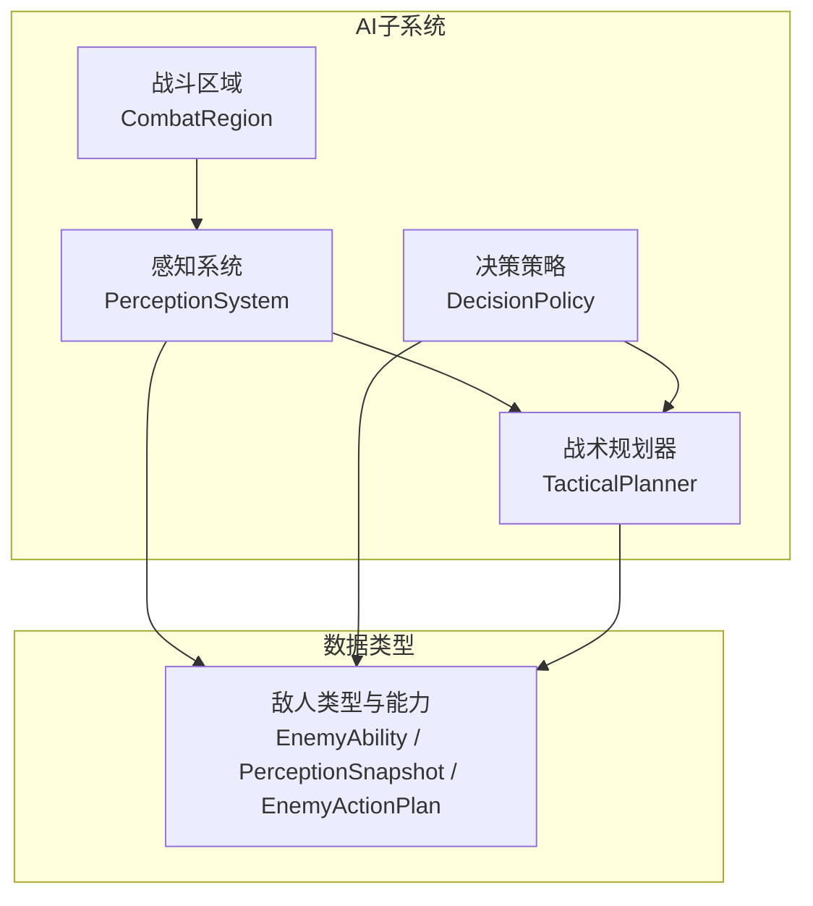
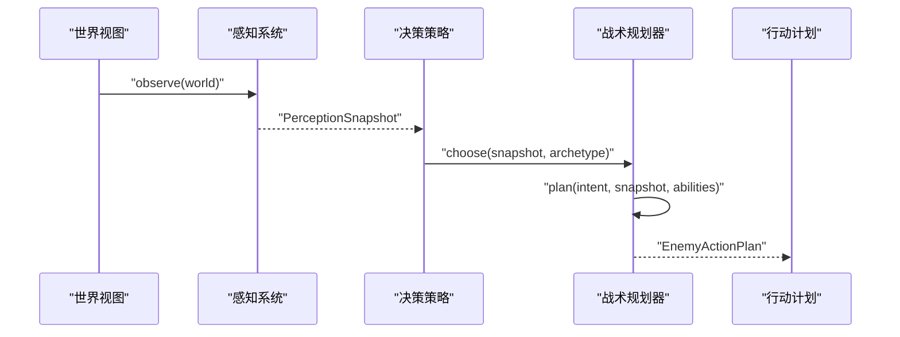
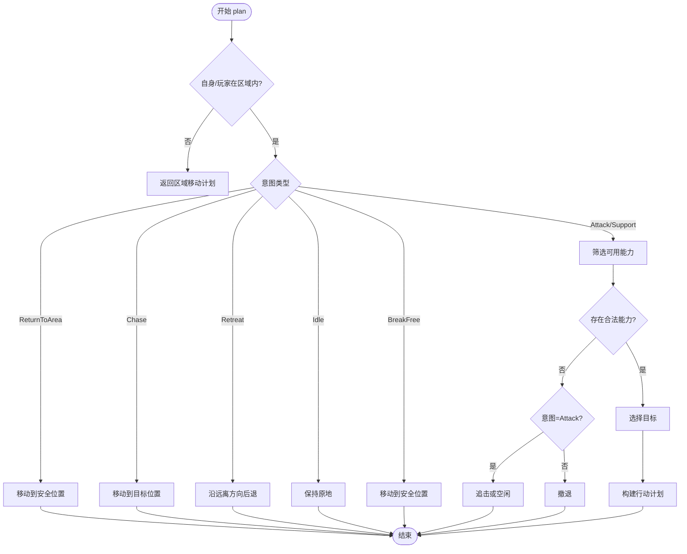
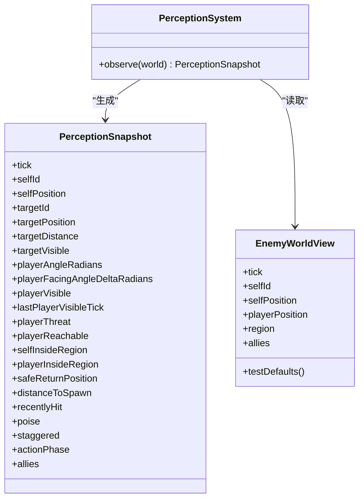
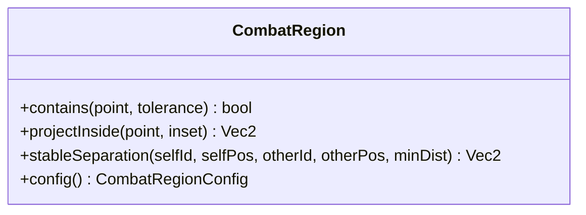
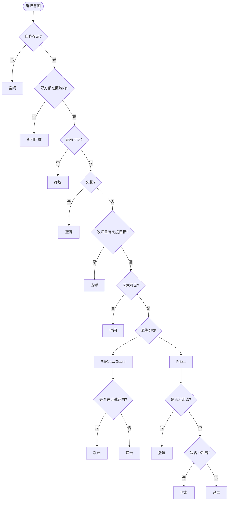
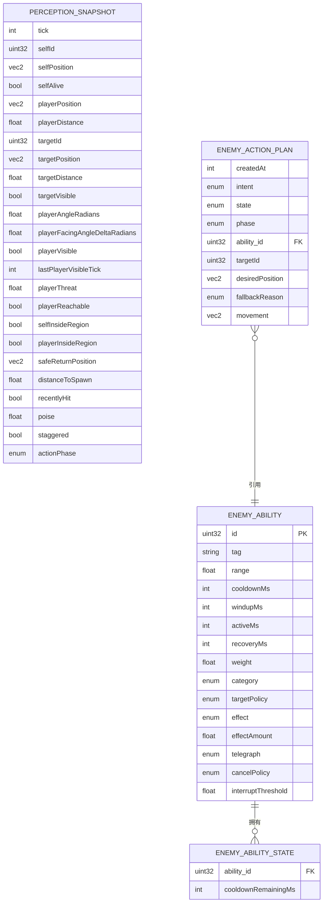
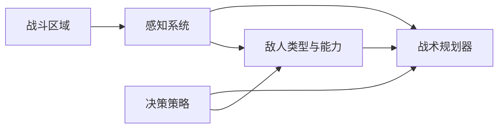

# 战术规划器

<cite>
**本文引用的文件**   
- [tactical_planner.h](file://native/gameplay/ai/tactical_planner.h)
- [tactical_planner.cpp](file://native/gameplay/ai/tactical_planner.cpp)
- [enemy_ai_types.h](file://native/gameplay/ai/enemy_ai_types.h)
- [perception_system.h](file://native/gameplay/ai/perception_system.h)
- [perception_system.cpp](file://native/gameplay/ai/perception_system.cpp)
- [combat_region.h](file://native/gameplay/ai/combat_region.h)
- [combat_region.cpp](file://native/gameplay/ai/combat_region.cpp)
- [decision_policy.h](file://native/gameplay/ai/decision_policy.h)
- [decision_policy.cpp](file://native/gameplay/ai/decision_policy.cpp)
- [test_tactical_planner.cpp](file://tests/test_tactical_planner.cpp)
</cite>

## 目录
1. [简介](#简介)
2. [项目结构](#项目结构)
3. [核心组件](#核心组件)
4. [架构总览](#架构总览)
5. [详细组件分析](#详细组件分析)
6. [依赖关系分析](#依赖关系分析)
7. [性能考量](#性能考量)
8. [故障排查指南](#故障排查指南)
9. [结论](#结论)
10. [附录](#附录)

## 简介
本文件为 TacticalPlanner 战术规划器的全面技术文档，聚焦于敌对单位的战术决策生成、战斗区域评估与战术执行计划。内容涵盖：
- 战术决策的生成流程与判定逻辑
- 战斗区域的包含判断与投影算法
- 不同战术模式（包围、撤退、集火、分散）的适用场景与实现要点
- 战术参数的动态调整机制、风险评估模型与成功率计算建议
- 战术库扩展方法、自定义战术开发流程与效果验证测试
- 可视化与性能分析指南

## 项目结构
TacticalPlanner 位于 AI 子系统内，围绕“感知快照—意图选择—能力筛选—行动规划”的流水线组织代码。关键模块包括：
- 类型与数据结构定义：敌人能力、目标策略、感知快照、行动计划等
- 感知系统：将世界视图转换为结构化感知快照
- 战斗区域：区域包含判断、点投影到区域内、稳定分离
- 决策策略：根据感知快照与敌人原型选择高层意图
- 战术规划器：基于意图与可用能力集合生成具体行动计划

图表来源
- [perception_system.h:1-45](file://native/gameplay/ai/perception_system.h#L1-L45)
- [perception_system.cpp:1-75](file://native/gameplay/ai/perception_system.cpp#L1-L75)
- [combat_region.h:1-26](file://native/gameplay/ai/combat_region.h#L1-L26)
- [combat_region.cpp:1-78](file://native/gameplay/ai/combat_region.cpp#L1-L78)
- [decision_policy.h:1-9](file://native/gameplay/ai/decision_policy.h#L1-L9)
- [decision_policy.cpp:1-48](file://native/gameplay/ai/decision_policy.cpp#L1-L48)
- [tactical_planner.h:1-12](file://native/gameplay/ai/tactical_planner.h#L1-L12)
- [tactical_planner.cpp:1-199](file://native/gameplay/ai/tactical_planner.cpp#L1-L199)
- [enemy_ai_types.h:1-160](file://native/gameplay/ai/enemy_ai_types.h#L1-L160)

章节来源
- [perception_system.h:1-45](file://native/gameplay/ai/perception_system.h#L1-L45)
- [perception_system.cpp:1-75](file://native/gameplay/ai/perception_system.cpp#L1-L75)
- [combat_region.h:1-26](file://native/gameplay/ai/combat_region.h#L1-L26)
- [combat_region.cpp:1-78](file://native/gameplay/ai/combat_region.cpp#L1-L78)
- [decision_policy.h:1-9](file://native/gameplay/ai/decision_policy.h#L1-L9)
- [decision_policy.cpp:1-48](file://native/gameplay/ai/decision_policy.cpp#L1-L48)
- [tactical_planner.h:1-12](file://native/gameplay/ai/tactical_planner.h#L1-L12)
- [tactical_planner.cpp:1-199](file://native/gameplay/ai/tactical_planner.cpp#L1-L199)
- [enemy_ai_types.h:1-160](file://native/gameplay/ai/enemy_ai_types.h#L1-L160)

## 核心组件
- 战术规划器（TacticalPlanner）
  - 输入：当前意图、感知快照、可用能力状态列表
  - 输出：行动计划（包含状态、阶段、能力、目标、期望位置、移动向量、回退原因）
  - 职责：依据意图与能力约束，选择最佳能力与目标，生成可执行的行动计划
- 感知系统（PerceptionSystem）
  - 将世界视图（自身、玩家、盟友、区域配置）转换为感知快照
  - 计算角度、距离、可见性、区域内外、最近受击、失衡等
- 战斗区域（CombatRegion）
  - 提供包含判断、点投影到区域内、稳定分离等几何工具
- 决策策略（DecisionPolicy）
  - 根据感知快照与敌人原型选择高层意图（如攻击、追击、撤退、支援、返回区域等）

章节来源
- [tactical_planner.h:1-12](file://native/gameplay/ai/tactical_planner.h#L1-L12)
- [tactical_planner.cpp:1-199](file://native/gameplay/ai/tactical_planner.cpp#L1-L199)
- [perception_system.h:1-45](file://native/gameplay/ai/perception_system.h#L1-L45)
- [perception_system.cpp:1-75](file://native/gameplay/ai/perception_system.cpp#L1-L75)
- [combat_region.h:1-26](file://native/gameplay/ai/combat_region.h#L1-L26)
- [combat_region.cpp:1-78](file://native/gameplay/ai/combat_region.cpp#L1-L78)
- [decision_policy.h:1-9](file://native/gameplay/ai/decision_policy.h#L1-L9)
- [decision_policy.cpp:1-48](file://native/gameplay/ai/decision_policy.cpp#L1-L48)
- [enemy_ai_types.h:1-160](file://native/gameplay/ai/enemy_ai_types.h#L1-L160)

## 架构总览
下图展示了从世界视图到行动计划的关键调用链：感知系统构建快照，决策策略确定意图，战术规划器结合能力集合生成行动计划。

图表来源
- [perception_system.cpp:32-74](file://native/gameplay/ai/perception_system.cpp#L32-L74)
- [decision_policy.cpp:25-47](file://native/gameplay/ai/decision_policy.cpp#L25-L47)
- [tactical_planner.cpp:124-198](file://native/gameplay/ai/tactical_planner.cpp#L124-L198)

## 详细组件分析

### 战术规划器（TacticalPlanner）
- 功能概述
  - 根据意图与感知快照，筛选可用的能力（冷却、范围、类别），并选择最优目标
  - 生成移动或行动的计划，明确期望位置、移动向量与回退原因
- 关键逻辑
  - 区域检查：若自身或玩家不在战斗区域，优先返回安全位置
  - 意图分支：追击、撤退、空闲、挣脱、支援、攻击等
  - 能力选择：按权重、剩余射程（越接近上限越好）、ID稳定性进行排序
  - 目标选择：支持当前目标、最近敌方、最低生命敌方、最低护盾友方、自身
  - 回退策略：无合法能力时，攻击意图转为追击或空闲；支援意图转为撤退
- 复杂度
  - 能力遍历 O(N)，目标选择常数时间，整体线性于可用能力数量
- 错误处理
  - 非法距离、不可达目标、无效坐标均被过滤
  - 明确的回退原因便于调试与可视化

图表来源
- [tactical_planner.cpp:124-198](file://native/gameplay/ai/tactical_planner.cpp#L124-L198)

章节来源
- [tactical_planner.cpp:1-199](file://native/gameplay/ai/tactical_planner.cpp#L1-L199)
- [enemy_ai_types.h:1-160](file://native/gameplay/ai/enemy_ai_types.h#L1-L160)

### 感知系统（PerceptionSystem）
- 功能概述
  - 将世界视图转换为感知快照，计算角度、距离、可见性、区域内外、盟友信息等
- 关键点
  - 角度归一化与朝向差值用于后续行为判定
  - 区域包含使用半径与中心点判断
  - 盟友信息排序以保证确定性

图表来源
- [perception_system.h:1-45](file://native/gameplay/ai/perception_system.h#L1-L45)
- [perception_system.cpp:1-75](file://native/gameplay/ai/perception_system.cpp#L1-L75)
- [enemy_ai_types.h:1-160](file://native/gameplay/ai/enemy_ai_types.h#L1-L160)

章节来源
- [perception_system.h:1-45](file://native/gameplay/ai/perception_system.h#L1-L45)
- [perception_system.cpp:1-75](file://native/gameplay/ai/perception_system.cpp#L1-L75)

### 战斗区域（CombatRegion）
- 功能概述
  - 提供包含判断、点投影到区域内、稳定分离等几何工具
- 关键点
  - 包含判断考虑容差
  - 投影保证结果有限且有效
  - 稳定分离避免单位重叠

图表来源
- [combat_region.h:1-26](file://native/gameplay/ai/combat_region.h#L1-L26)
- [combat_region.cpp:1-78](file://native/gameplay/ai/combat_region.cpp#L1-L78)

章节来源
- [combat_region.h:1-26](file://native/gameplay/ai/combat_region.h#L1-L26)
- [combat_region.cpp:1-78](file://native/gameplay/ai/combat_region.cpp#L1-L78)

### 决策策略（DecisionPolicy）
- 功能概述
  - 根据感知快照与敌人原型选择高层意图
- 关键点
  - 牧师在满足条件时优先支援低护盾友方
  - 近战单位在范围内攻击，否则追击
  - 牧师在近距离撤退，中距离攻击，远距离追击

图表来源
- [decision_policy.cpp:25-47](file://native/gameplay/ai/decision_policy.cpp#L25-L47)

章节来源
- [decision_policy.h:1-9](file://native/gameplay/ai/decision_policy.h#L1-L9)
- [decision_policy.cpp:1-48](file://native/gameplay/ai/decision_policy.cpp#L1-L48)

### 数据模型与关系
- 敌人能力与状态
  - 能力属性：范围、冷却、前摇、激活、恢复、权重、类别、目标策略、效果、取消策略、打断阈值
  - 状态：当前冷却剩余时间
- 感知快照
  - 包含自身、目标、玩家、盟友、区域、相位、失衡等信息
- 行动计划
  - 包含创建时间、意图、状态、阶段、能力、目标、期望位置、回退原因、移动向量

图表来源
- [enemy_ai_types.h:1-160](file://native/gameplay/ai/enemy_ai_types.h#L1-L160)

章节来源
- [enemy_ai_types.h:1-160](file://native/gameplay/ai/enemy_ai_types.h#L1-L160)

## 依赖关系分析
- 战术规划器依赖：
  - 敌人类型与能力定义（能力类别、目标策略、感知快照、行动计划）
  - 感知系统提供的快照数据
  - 战斗区域的几何工具（用于区域判断与投影）
- 决策策略依赖：
  - 感知快照与敌人原型，决定高层意图
- 感知系统依赖：
  - 世界视图与战斗区域配置

图表来源
- [tactical_planner.cpp:1-199](file://native/gameplay/ai/tactical_planner.cpp#L1-L199)
- [perception_system.cpp:1-75](file://native/gameplay/ai/perception_system.cpp#L1-L75)
- [combat_region.cpp:1-78](file://native/gameplay/ai/combat_region.cpp#L1-L78)
- [decision_policy.cpp:1-48](file://native/gameplay/ai/decision_policy.cpp#L1-L48)
- [enemy_ai_types.h:1-160](file://native/gameplay/ai/enemy_ai_types.h#L1-L160)

章节来源
- [tactical_planner.cpp:1-199](file://native/gameplay/ai/tactical_planner.cpp#L1-L199)
- [perception_system.cpp:1-75](file://native/gameplay/ai/perception_system.cpp#L1-L75)
- [combat_region.cpp:1-78](file://native/gameplay/ai/combat_region.cpp#L1-L78)
- [decision_policy.cpp:1-48](file://native/gameplay/ai/decision_policy.cpp#L1-L48)
- [enemy_ai_types.h:1-160](file://native/gameplay/ai/enemy_ai_types.h#L1-L160)

## 性能考量
- 时间复杂度
  - 战术规划器能力筛选为 O(N)，N 为可用能力数量；目标选择为常数时间
  - 感知系统构造快照为 O(M)，M 为盟友数量（含排序）
- 空间复杂度
  - 快照与能力列表占用线性空间
- 优化建议
  - 预过滤能力（冷却、范围、类别）减少比较次数
  - 对盟友列表进行增量更新与局部排序
  - 缓存常用几何计算结果（如距离平方）

[本节为通用指导，不直接分析具体文件]

## 故障排查指南
- 常见问题定位
  - 无合法能力：检查能力冷却、范围、类别与目标策略
  - 目标不可见或不可达：检查可见性与可达性标志
  - 区域外行为：确认区域配置与位置计算
- 调试手段
  - 打印回退原因与选择的意图
  - 输出选择的能力 ID、目标 ID、期望位置与移动向量
  - 对比多次迭代的结果一致性

章节来源
- [tactical_planner.cpp:124-198](file://native/gameplay/ai/tactical_planner.cpp#L124-L198)
- [test_tactical_planner.cpp:1-205](file://tests/test_tactical_planner.cpp#L1-L205)

## 结论
TacticalPlanner 通过清晰的意图—能力—目标—行动的流水线，实现了稳定、可扩展的战术决策。配合感知系统与战斗区域工具，能够覆盖多种战术模式（追击、撤退、支援、返回区域等）。通过权重与剩余射程的选择策略，能够在多能力场景中做出合理决策。测试用例覆盖了主要路径与边界情况，有助于持续改进与扩展。

[本节为总结，不直接分析具体文件]

## 附录

### 战术模式与适用场景
- 追击（Chase）
  - 适用于目标可见但超出能力范围的情况
  - 目标是缩短距离以进入能力范围
- 撤退（Retreat）
  - 适用于近距离威胁或无合法能力时的防御性策略
  - 沿远离目标的方向移动至安全位置
- 集火（Focus Fire）
  - 通过目标策略（最近敌方、最低生命敌方）实现集中伤害
  - 需要高权重能力与合适的目标策略
- 分散（Disperse）
  - 通过稳定分离与区域投影避免单位重叠
  - 适用于多单位协同与阵型维持
- 包围（Encircle）
  - 通过区域投影与稳定分离形成包围圈
  - 需要精确的位置控制与协调

[本节为概念说明，不直接分析具体文件]

### 战术参数动态调整与风险评估
- 动态调整
  - 权重：根据战况（如目标血量、护盾、威胁度）动态调整
  - 范围：根据站位与地形动态调整
  - 冷却：根据技能释放频率与资源管理调整
- 风险评估
  - 威胁度：基于玩家距离、朝向、可见性、最近受击
  - 成功率：基于能力范围、目标可见性、自身状态（失衡、相位）
  - 风险收益比：权衡伤害输出与自身生存概率

[本节为概念说明，不直接分析具体文件]

### 战术库扩展与自定义战术开发
- 扩展步骤
  - 新增能力定义（类别、目标策略、效果、权重）
  - 更新目标策略支持（如新增最低护盾友方）
  - 在战术规划器中添加相应分支与选择逻辑
- 开发流程
  - 设计能力与目标策略
  - 实现选择与回退逻辑
  - 编写单元测试覆盖正常与边界路径
- 效果验证
  - 使用测试用例验证能力选择、目标选择与行动计划
  - 对比多次迭代的一致性

章节来源
- [enemy_ai_types.h:1-160](file://native/gameplay/ai/enemy_ai_types.h#L1-L160)
- [tactical_planner.cpp:1-199](file://native/gameplay/ai/tactical_planner.cpp#L1-L199)
- [test_tactical_planner.cpp:1-205](file://tests/test_tactical_planner.cpp#L1-L205)

### 可视化工具与性能分析指南
- 可视化
  - 绘制区域包含与投影结果
  - 显示能力范围与目标选择
  - 输出行动计划的状态与阶段
- 性能分析
  - 统计能力筛选与目标选择耗时
  - 监控快照构造与排序开销
  - 识别热点函数与优化机会

[本节为概念说明，不直接分析具体文件]