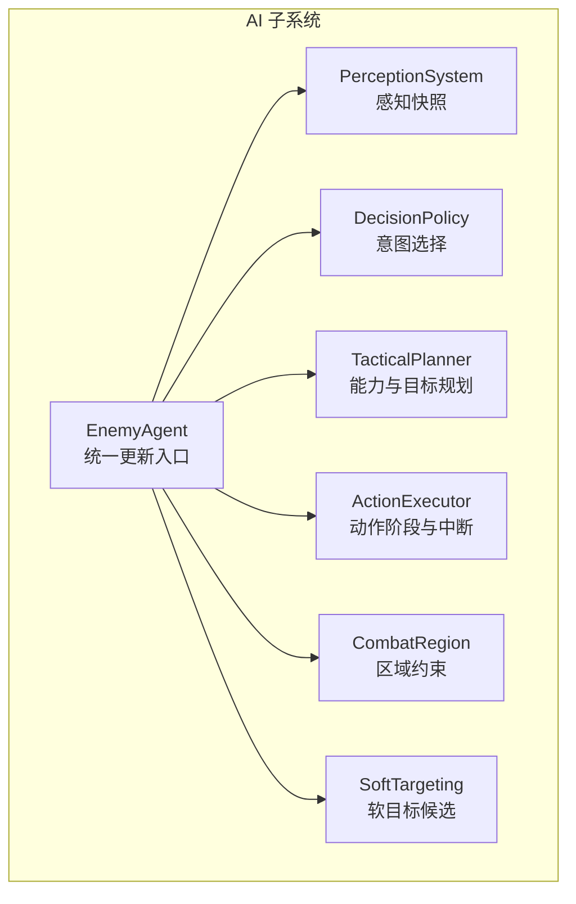
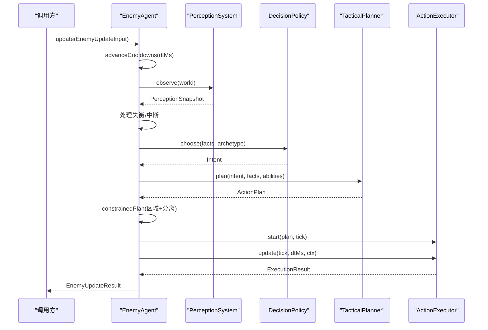
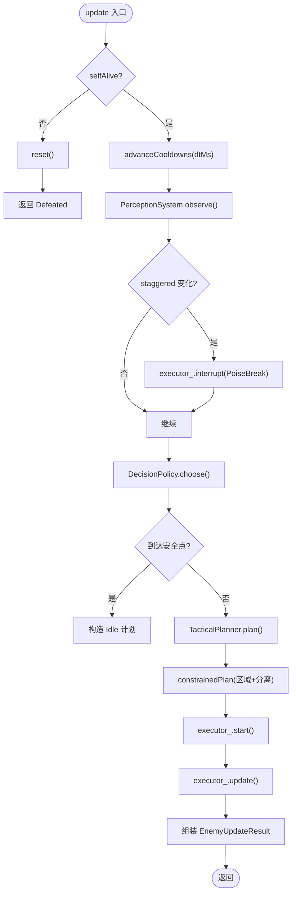
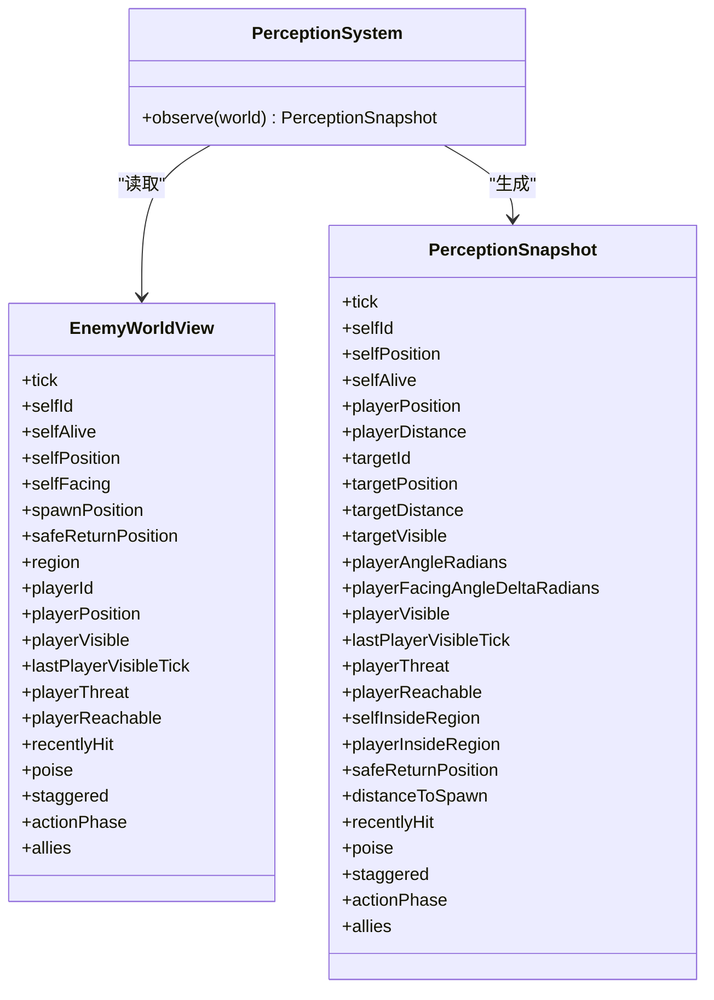
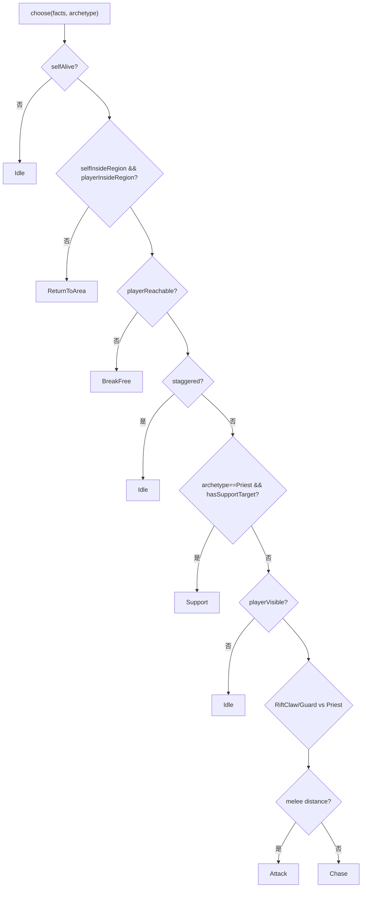
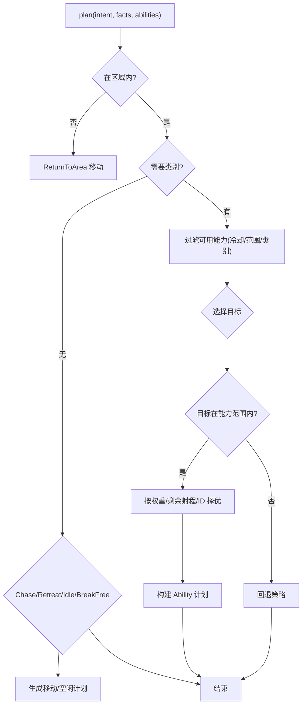
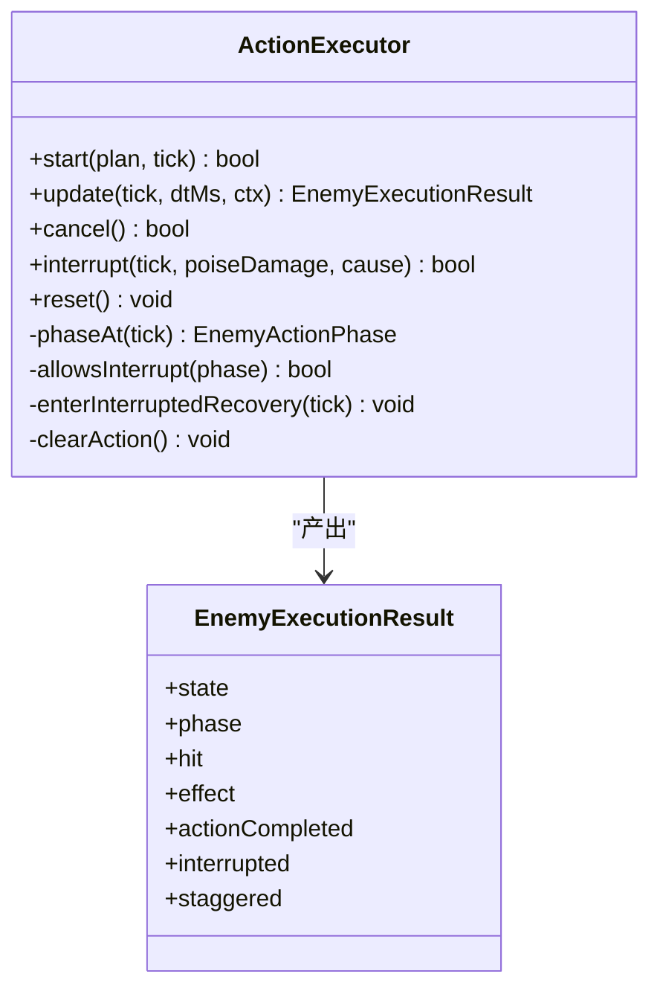
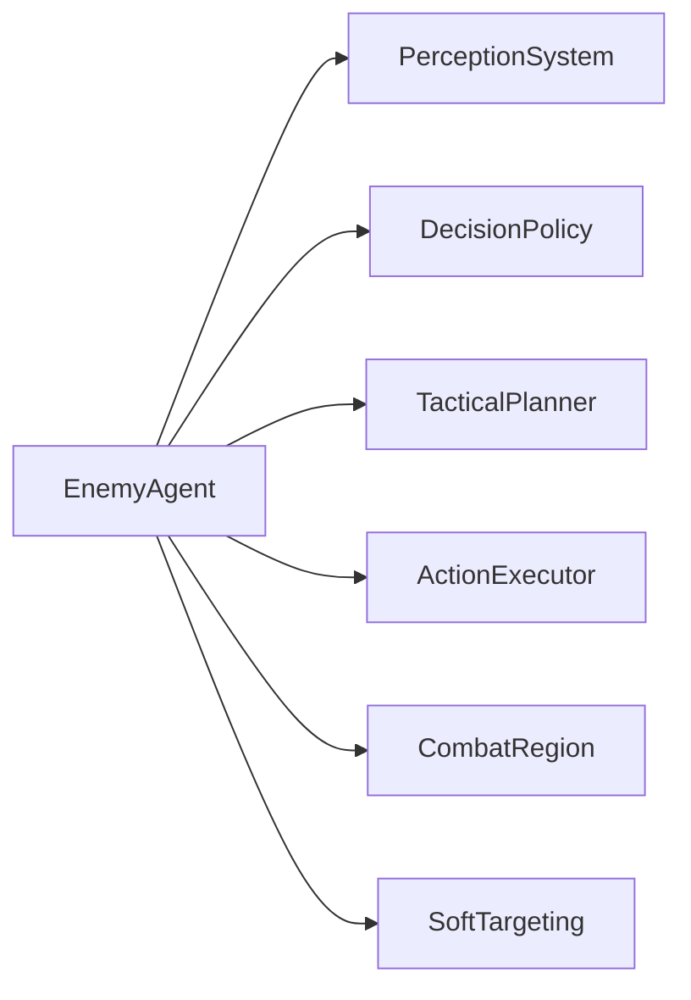

# 敌人代理

<cite>
**本文引用的文件**   
- [enemy_agent.h](file://native/gameplay/ai/enemy_agent.h)
- [enemy_agent.cpp](file://native/gameplay/ai/enemy_agent.cpp)
- [enemy_ai_types.h](file://native/gameplay/ai/enemy_ai_types.h)
- [enemy_archetypes.h](file://native/gameplay/ai/enemy_archetypes.h)
- [enemy_archetypes.cpp](file://native/gameplay/ai/enemy_archetypes.cpp)
- [perception_system.h](file://native/gameplay/ai/perception_system.h)
- [perception_system.cpp](file://native/gameplay/ai/perception_system.cpp)
- [decision_policy.h](file://native/gameplay/ai/decision_policy.h)
- [decision_policy.cpp](file://native/gameplay/ai/decision_policy.cpp)
- [tactical_planner.h](file://native/gameplay/ai/tactical_planner.h)
- [tactical_planner.cpp](file://native/gameplay/ai/tactical_planner.cpp)
- [action_executor.h](file://native/gameplay/ai/action_executor.h)
- [action_executor.cpp](file://native/gameplay/ai/action_executor.cpp)
- [enemy_ai_config.h](file://native/gameplay/ai/enemy_ai_config.h)
- [combat_region.h](file://native/gameplay/ai/combat_region.h)
- [soft_targeting.h](file://native/gameplay/targeting/soft_targeting.h)
</cite>

## 目录
1. [简介](#简介)
2. [项目结构](#项目结构)
3. [核心组件](#核心组件)
4. [架构总览](#架构总览)
5. [详细组件分析](#详细组件分析)
6. [依赖关系分析](#依赖关系分析)
7. [性能考量](#性能考量)
8. [故障排查指南](#故障排查指南)
9. [结论](#结论)
10. [附录](#附录)

## 简介
本文件为 EnemyAgent 敌人代理的完整技术文档，覆盖行为状态机、移动与攻击逻辑、防御机制、感知范围检测、威胁评估、路径规划与目标选择策略，以及生命值、护盾值、韧性值的计算与恢复机制。同时记录 RiftClaw、Priest、Guard 等原型的行为差异，并提供 AI 调优参数与自定义敌人类型的开发指南。

## 项目结构
敌人 AI 子系统位于 native/gameplay/ai 目录，围绕 EnemyAgent 组织，包含感知系统、决策策略、战术规划器、动作执行器与类型配置等模块。关键入口为 EnemyAgent::update，它将世界视图输入转化为意图、计划与执行结果。

图表来源
- [enemy_agent.h:55-106](file://native/gameplay/ai/enemy_agent.h#L55-L106)
- [perception_system.h:41-44](file://native/gameplay/ai/perception_system.h#L41-L44)
- [decision_policy.h:5-8](file://native/gameplay/ai/decision_policy.h#L5-L8)
- [tactical_planner.h:7-11](file://native/gameplay/ai/tactical_planner.h#L7-L11)
- [action_executor.h:33-66](file://native/gameplay/ai/action_executor.h#L33-L66)

章节来源
- [enemy_agent.h:1-107](file://native/gameplay/ai/enemy_agent.h#L1-L107)
- [enemy_agent.cpp:271-373](file://native/gameplay/ai/enemy_agent.cpp#L271-L373)

## 核心组件
- EnemyAgent：整合感知、决策、规划与执行，维护冷却、失衡（stagger）与脱战回归等状态，输出每帧的意图、计划、移动向量与命中/效果请求。
- PerceptionSystem：将 EnemyWorldView 转换为 PerceptionSnapshot，计算距离、角度、可见性、区域内外、盟友信息等。
- DecisionPolicy：基于感知快照与敌人原型选择高层意图（Idle/Chase/Attack/Retreat/ReturnToArea/BreakFree/Support）。
- TacticalPlanner：根据意图与可用能力集，选择具体能力与目标，生成 ActionPlan（含期望位置与移动向量）。
- ActionExecutor：驱动动作生命周期（Windup/Active/Recovery），处理中断、失衡与效果派发（伤害/护盾）。
- CombatRegion：提供区域投影与包含判断，确保目标与移动在合法区域内。
- SoftTargeting：生成目标候选（如自身作为目标），供上层使用。

章节来源
- [enemy_agent.h:55-106](file://native/gameplay/ai/enemy_agent.h#L55-L106)
- [perception_system.cpp:32-74](file://native/gameplay/ai/perception_system.cpp#L32-L74)
- [decision_policy.cpp:25-47](file://native/gameplay/ai/decision_policy.cpp#L25-L47)
- [tactical_planner.cpp:124-198](file://native/gameplay/ai/tactical_planner.cpp#L124-L198)
- [action_executor.cpp:124-190](file://native/gameplay/ai/action_executor.cpp#L124-L190)
- [enemy_ai_config.h:11-24](file://native/gameplay/ai/enemy_ai_config.h#L11-L24)
- [soft_targeting.h](file://native/gameplay/targeting/soft_targeting.h)

## 架构总览
EnemyAgent 每帧接收 EnemyUpdateInput，内部稳定化世界视图后，依次进行：
- 冷却推进与感知观察
- 失衡与中断处理
- 意图选择（考虑区域、可见性与原型特性）
- 战术规划（能力选择与目标定位）
- 区域约束与分离力修正
- 动作执行与结果汇总

图表来源
- [enemy_agent.cpp:271-373](file://native/gameplay/ai/enemy_agent.cpp#L271-L373)
- [perception_system.cpp:32-74](file://native/gameplay/ai/perception_system.cpp#L32-L74)
- [decision_policy.cpp:25-47](file://native/gameplay/ai/decision_policy.cpp#L25-L47)
- [tactical_planner.cpp:124-198](file://native/gameplay/ai/tactical_planner.cpp#L124-L198)
- [action_executor.cpp:124-190](file://native/gameplay/ai/action_executor.cpp#L124-L190)

## 详细组件分析

### EnemyAgent 行为状态机与主循环
- 状态机：Idle/Evaluating/Moving/Acting/Recovering/Staggered/Defeated。由 ActionExecutor 与 EnemyAgent 共同决定最终状态。
- 主循环要点：
  - 若 selfAlive 为假则 reset 并返回 Defeated。
  - 推进能力冷却；观察感知快照；标记玩家是否在区域内外。
  - 处理失衡锁存与释放时间窗；外部打断（韧性伤害或破韧）触发中断或进入 Staggered。
  - 意图选择：优先 ReturnToArea/BreakFree/Idle，再按原型规则选择 Chase/Attack/Retreat/Support。
  - 规划：对非 Idle/Staggered/已到达安全点的情况生成计划，并进行区域投影与分离修正。
  - 执行：启动动作，推进执行器，汇总 hit/effect/movement/interrupted 等结果。

图表来源
- [enemy_agent.cpp:271-373](file://native/gameplay/ai/enemy_agent.cpp#L271-L373)

章节来源
- [enemy_agent.cpp:271-373](file://native/gameplay/ai/enemy_agent.cpp#L271-L373)
- [enemy_ai_types.h:28-36](file://native/gameplay/ai/enemy_ai_types.h#L28-L36)

### 感知系统与威胁评估
- 输入 EnemyWorldView，输出 PerceptionSnapshot，包含：
  - 自身与玩家位置、距离、角度、可见性与最近可见时间戳
  - 目标 ID/位置/距离/可见性
  - 区域内外判定、到出生点距离、是否刚受击、韧性值与失衡状态
  - 盟友列表（ID、原型、生命/护盾、位置、距离、存活与区域内外）
- 威胁评估：playerThreat 直接来自输入 world.playerThreat，用于上层策略（当前实现中主要用于记录）。

图表来源
- [perception_system.h:17-39](file://native/gameplay/ai/perception_system.h#L17-L39)
- [perception_system.cpp:32-74](file://native/gameplay/ai/perception_system.cpp#L32-L74)
- [enemy_ai_types.h:113-139](file://native/gameplay/ai/enemy_ai_types.h#L113-L139)

章节来源
- [perception_system.cpp:32-74](file://native/gameplay/ai/perception_system.cpp#L32-L74)
- [enemy_ai_types.h:113-139](file://native/gameplay/ai/enemy_ai_types.h#L113-L139)

### 意图选择与原型差异化
- 通用优先级：不在区域/玩家不可达/失衡时分别返回 ReturnToArea/BreakFree/Idle。
- Priest 特殊：当存在需要支援的友军（区域内、无护盾、距离满足阈值）时优先 Support。
- RiftClaw/Guard：近战型，距离小于阈值 Attack，否则 Chase。
- Priest：近距 Retreat，中距 Attack，远距 Chase。

图表来源
- [decision_policy.cpp:25-47](file://native/gameplay/ai/decision_policy.cpp#L25-L47)

章节来源
- [decision_policy.cpp:25-47](file://native/gameplay/ai/decision_policy.cpp#L25-L47)

### 战术规划与目标选择
- 非行动类意图（Chase/Retreat/Idle/BreakFree）直接生成移动或空闲计划。
- 行动类意图（Attack/Support）从可用能力集中筛选：
  - 支持类：仅支持 LowestShieldAlly，且需范围内有护盾为 0 的友军。
  - 攻击类：支持 CurrentTarget/NearestHostile/LowestHealthHostile/Self。
  - 选择标准：权重更高 > 剩余射程更小 > 能力 ID 更小（确定性）。
- 若无合法能力：Attack 退化为 Chase（若有目标）或 Idle（无目标）；其他意图退化为 Retreat。

图表来源
- [tactical_planner.cpp:124-198](file://native/gameplay/ai/tactical_planner.cpp#L124-L198)

章节来源
- [tactical_planner.cpp:124-198](file://native/gameplay/ai/tactical_planner.cpp#L124-L198)

### 动作执行与中断/失衡
- 动作阶段：Windup → Active → Recovery，结束后清理并返回 Idle。
- 中断：
  - PoiseBreak：立即清空动作并进入 Staggered。
  - PoiseDamage：依据 cancelPolicy 与 interruptThreshold 决定是否进入“仅恢复”模式。
- 效果派发：
  - Damage/AreaDamage：生成 HitRequest（含攻击者、目标、能力、基础伤害、韧性伤害、时间戳与事务 ID）。
  - Shield：生成 CombatEffectRequest（护盾量、目标、时间戳与事务 ID）。
- 目标死亡：若目标不再存活且未发射事务，进入“仅恢复”模式。

图表来源
- [action_executor.h:33-66](file://native/gameplay/ai/action_executor.h#L33-L66)
- [action_executor.cpp:124-190](file://native/gameplay/ai/action_executor.cpp#L124-L190)

章节来源
- [action_executor.cpp:124-190](file://native/gameplay/ai/action_executor.cpp#L124-L190)

### 区域约束、分离与脱战回归
- 区域约束：所有期望位置经 CombatRegion.projectInside 投影，保证在战斗区域内。
- 分离力：聚合盟友间的稳定分离向量，避免拥挤；合并后再次投影。
- 脱战回归：
  - 若持续无进展（最小进度阈值与最大无进展决策次数），进入 ReturningToSafePoint。
  - 到达安全点后取消执行、重置记忆与计划，意图回到 Idle。

章节来源
- [enemy_agent.cpp:132-145](file://native/gameplay/ai/enemy_agent.cpp#L132-L145)
- [enemy_agent.cpp:147-212](file://native/gameplay/ai/enemy_agent.cpp#L147-L212)
- [enemy_agent.cpp:230-242](file://native/gameplay/ai/enemy_agent.cpp#L230-L242)

### 不同敌人原型的特定行为
- RiftClaw：近战攻击，单技能“斩击”，可被前摇中断，带韧性打断阈值。
- Priest：远程法术与护盾支援，具备“护盾”与“闪电”两个技能；当友军无护盾且在支援范围内时优先 Support。
- Guard：近战重击，不可中断，具有方向性减伤（正面伤害减半）与较长的失衡恢复时间。

章节来源
- [enemy_archetypes.cpp:25-84](file://native/gameplay/ai/enemy_archetypes.cpp#L25-L84)
- [enemy_archetypes.h:15-19](file://native/gameplay/ai/enemy_archetypes.h#L15-L19)

### 生命值、护盾值、韧性值与恢复机制
- 生命值与护盾值：
  - 通过 PerceptionSnapshot.allies 中的 health/shield 字段反映；敌人自身健康状态由 selfAlive 控制。
  - 护盾恢复由 ActionExecutor 的 Shield 效果派发 CombatEffectRequest，由上层战斗系统应用。
- 韧性值与失衡：
  - world.poise 与 staggered 字段表示韧性及失衡状态。
  - 失衡触发：PoiseBreak 导致立即失衡；PoiseDamage 可能中断动作。
  - 失衡恢复：config.staggerRecoveryMs 定义恢复窗口，到期后自动解除并重置执行器。

章节来源
- [enemy_ai_types.h:113-139](file://native/gameplay/ai/enemy_ai_types.h#L113-L139)
- [action_executor.cpp:103-122](file://native/gameplay/ai/action_executor.cpp#L103-L122)
- [enemy_agent.cpp:287-301](file://native/gameplay/ai/enemy_agent.cpp#L287-L301)
- [enemy_ai_config.h:16-24](file://native/gameplay/ai/enemy_ai_config.h#L16-L24)

### 路径规划与目标选择策略
- 路径规划：
  - Chase：移动到目标位置。
  - Retreat：沿背离目标方向后退一步（归一化反方向）。
  - ReturnToArea/BreakFree：移动到 safeReturnPosition。
- 目标选择：
  - 支持类：LowestShieldAlly（区域内、无护盾、距离满足）。
  - 攻击类：CurrentTarget/NearestHostile/LowestHealthHostile/Self。
  - 能力选择：权重优先，其次剩余射程更短，最后以能力 ID 排序保证稳定性。

章节来源
- [tactical_planner.cpp:88-121](file://native/gameplay/ai/tactical_planner.cpp#L88-L121)
- [tactical_planner.cpp:33-77](file://native/gameplay/ai/tactical_planner.cpp#L33-L77)
- [tactical_planner.cpp:79-86](file://native/gameplay/ai/tactical_planner.cpp#L79-L86)

## 依赖关系分析
- EnemyAgent 依赖 PerceptionSystem、DecisionPolicy、TacticalPlanner、ActionExecutor、CombatRegion 与 SoftTargeting。
- 数据流：EnemyUpdateInput → PerceptionSnapshot → Intent → ActionPlan → ExecutionResult。
- 耦合度：各模块职责清晰，低耦合高内聚；EnemyAgent 作为协调层，不直接实现复杂算法。

图表来源
- [enemy_agent.h:55-106](file://native/gameplay/ai/enemy_agent.h#L55-L106)

章节来源
- [enemy_agent.h:55-106](file://native/gameplay/ai/enemy_agent.h#L55-L106)

## 性能考量
- 每帧操作复杂度：
  - 感知：O(N) 遍历盟友。
  - 分离力：O(M) 聚合盟友分离向量。
  - 能力选择：O(K) 遍历能力集，K 通常较小。
- 数值稳定性：大量使用有限数检查与饱和加法，避免溢出与 NaN 传播。
- 建议：
  - 合理设置 decisionPeriodMs 与 noProgressDecisionLimit 以降低频繁决策开销。
  - 控制 allies 数量与 region 半径，减少分离力计算压力。
  - 使用固定步长与 Tick 管理，避免浮点累积误差。

[本节为通用指导，无需引用具体文件]

## 故障排查指南
- 敌人无法行动：
  - 检查 selfAlive 是否为真；确认区域内外与玩家可达性。
  - 查看是否有合法能力（冷却、范围、类别匹配）。
- 频繁退回安全点：
  - 调整 minimumProgress 与 noProgressDecisionLimit，允许更多无进展容忍。
  - 检查 separationDistance 是否过大导致无法靠近目标。
- 失衡卡住：
  - 确认 config.staggerRecoveryMs 是否设置；检查 PoiseBreak/PoiseDamage 是否正确传入。
- 动作未被中断：
  - 核对 cancelPolicy 与 interruptThreshold；确认 phase 处于允许中断的阶段。

章节来源
- [enemy_agent.cpp:271-373](file://native/gameplay/ai/enemy_agent.cpp#L271-L373)
- [action_executor.cpp:103-122](file://native/gameplay/ai/action_executor.cpp#L103-L122)
- [tactical_planner.cpp:178-187](file://native/gameplay/ai/tactical_planner.cpp#L178-L187)

## 结论
EnemyAgent 通过清晰的模块化设计实现了敌人 AI 的核心闭环：感知→决策→规划→执行→反馈。其状态机、区域约束、分离力与脱战回归机制保证了行为的稳定性与可预测性。不同类型原型通过能力配置与决策策略实现差异化行为。开发者可通过 EnemyAiConfig 与 EnemyAgentTuning 灵活调优，快速扩展新的敌人类型。

[本节为总结，无需引用具体文件]

## 附录

### 敌人 AI 调优参数
- EnemyAgentTuning
  - decisionPeriodMs：进度决策周期（毫秒）
  - minimumProgress：最小进展阈值
  - noProgressDecisionLimit：最大无进展决策次数
  - chaseTolerance：追击容差
  - safePointTolerance：安全点容差
  - separationDistance：分离距离
- EnemyAiConfig
  - maxEnemies：最大敌人数
  - abilities：能力列表（范围、冷却、前摇、激活、恢复、权重、类别、目标策略、效果、中断策略、韧性阈值）
  - region：战斗区域中心与半径
  - staggerRecoveryMs：失衡恢复时间

章节来源
- [enemy_agent.h:20-27](file://native/gameplay/ai/enemy_agent.h#L20-L27)
- [enemy_ai_config.h:16-24](file://native/gameplay/ai/enemy_ai_config.h#L16-L24)
- [enemy_ai_types.h:79-95](file://native/gameplay/ai/enemy_ai_types.h#L79-L95)

### 自定义敌人类型开发指南
- 新增原型：
  - 在 enemy_ai_types.h 的 EnemyArchetype 中添加新枚举值。
  - 在 decision_policy.cpp 中为该原型添加意图分支。
- 定义能力：
  - 在 enemy_archetypes.cpp 中创建 EnemyAbility（类别、目标策略、效果、权重、中断策略等）。
  - 通过 EnemyAiConfig::abilities 注入该原型的能力集。
- 配置区域与恢复：
  - 设置 CombatRegionConfig（中心与半径）。
  - 根据需要设置 staggerRecoveryMs。
- 验证与测试：
  - 使用 validated() 校验配置合法性。
  - 通过单元测试与集成测试验证行为是否符合预期。

章节来源
- [enemy_ai_types.h:12-16](file://native/gameplay/ai/enemy_ai_types.h#L12-L16)
- [decision_policy.cpp:25-47](file://native/gameplay/ai/decision_policy.cpp#L25-L47)
- [enemy_archetypes.cpp:25-84](file://native/gameplay/ai/enemy_archetypes.cpp#L25-L84)
- [enemy_ai_config.h:26-39](file://native/gameplay/ai/enemy_ai_config.h#L26-L39)