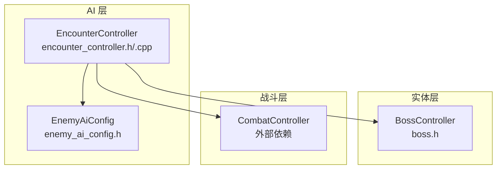
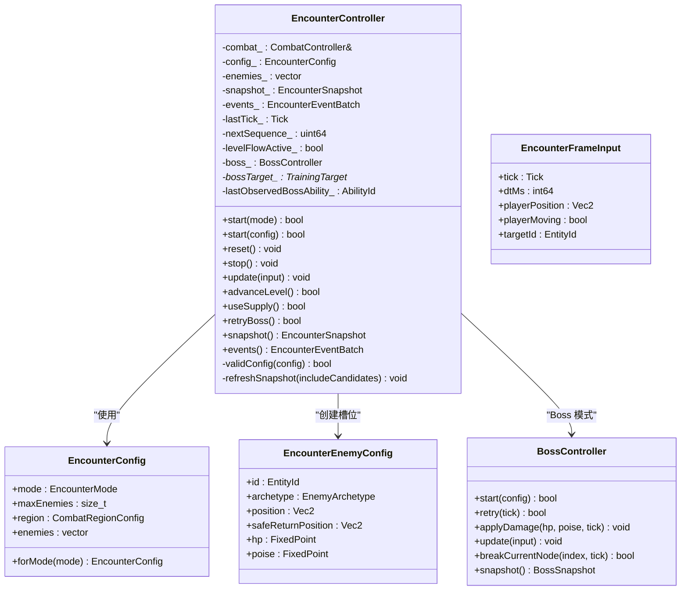
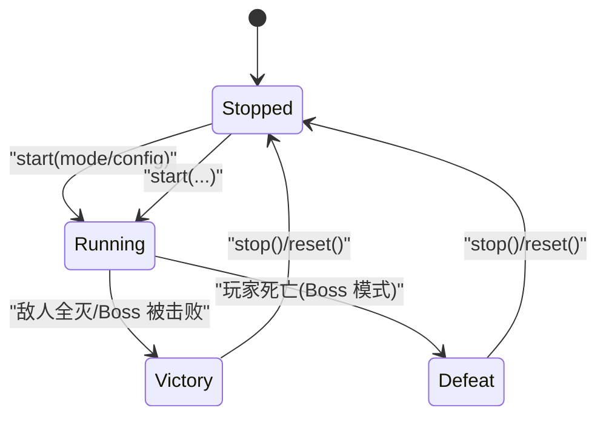
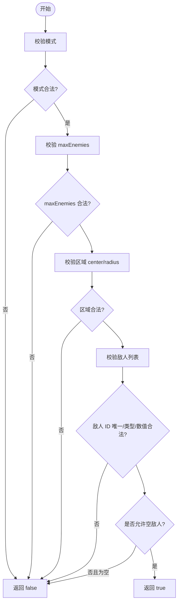
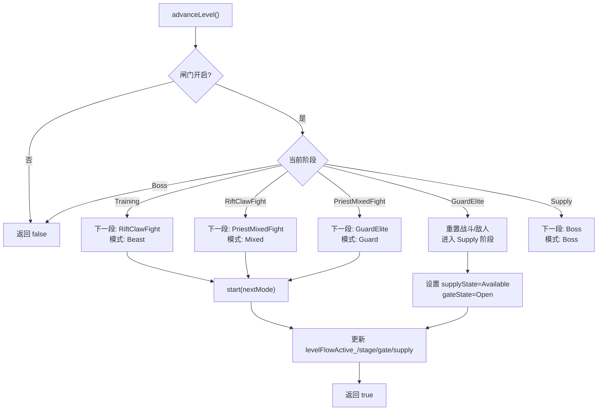
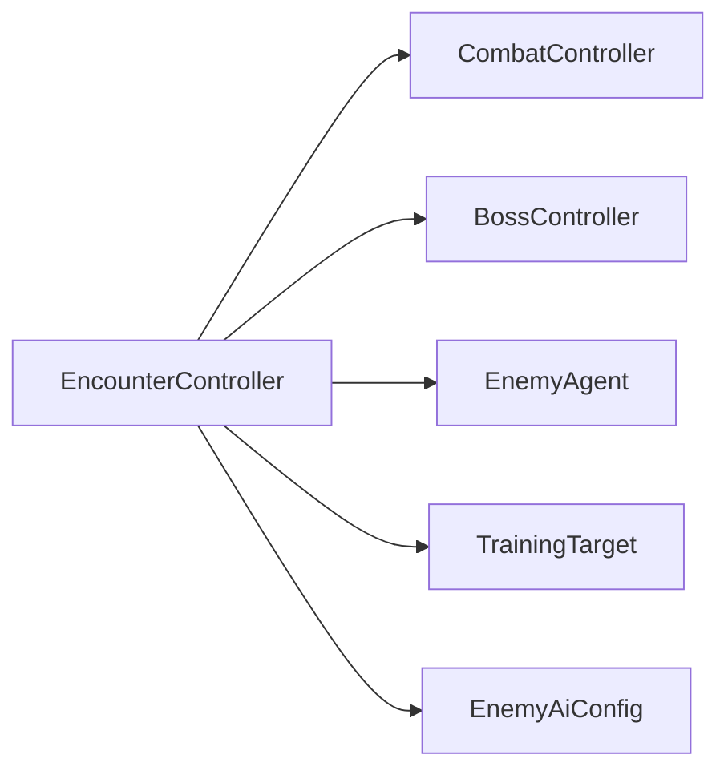

# 遭遇战控制器

<cite>
**本文引用的文件**   
- [encounter_controller.h](file://native/gameplay/ai/encounter_controller.h)
- [encounter_controller.cpp](file://native/gameplay/ai/encounter_controller.cpp)
- [enemy_ai_config.h](file://native/gameplay/ai/enemy_ai_config.h)
- [boss.h](file://native/gameplay/entities/boss.h)
- [test_encounter_controller.cpp](file://tests/test_encounter_controller.cpp)
</cite>

## 目录
1. [简介](#简介)
2. [项目结构](#项目结构)
3. [核心组件](#核心组件)
4. [架构总览](#架构总览)
5. [详细组件分析](#详细组件分析)
6. [依赖关系分析](#依赖关系分析)
7. [性能考量](#性能考量)
8. [故障排查指南](#故障排查指南)
9. [结论](#结论)
10. [附录](#附录)

## 简介
本文件为 EncounterController（遭遇战控制器）的详细技术文档，覆盖遭遇战的启动、停止与状态管理，以及 Training、Beast、Mixed、Guard、LevelFlow、Boss 等模式。文档还详细说明 EncounterConfig 配置结构、EncounterEnemyConfig 敌人配置、EncounterFrameInput 帧输入处理；记录遭遇战的生命周期管理、敌人槽位管理、关卡流程控制（advanceLevel）、补给系统（useSupply）和 Boss 重试机制（retryBoss），并给出配置示例与状态转换图。

## 项目结构
围绕遭遇战的核心代码位于 gameplay/ai 与 entities 模块：
- encounter_controller.h/.cpp：遭遇战控制器定义与实现
- enemy_ai_config.h：敌人 AI 配置与战斗区域配置
- boss.h：Boss 控制器与配置、快照
- tests/test_encounter_controller.cpp：遭遇战控制器测试用例

图表来源
- [encounter_controller.h:108-151](file://native/gameplay/ai/encounter_controller.h#L108-L151)
- [encounter_controller.cpp:187-273](file://native/gameplay/ai/encounter_controller.cpp#L187-L273)
- [enemy_ai_config.h:11-24](file://native/gameplay/ai/enemy_ai_config.h#L11-L24)
- [boss.h:69-94](file://native/gameplay/entities/boss.h#L69-L94)

章节来源
- [encounter_controller.h:1-151](file://native/gameplay/ai/encounter_controller.h#L1-L151)
- [encounter_controller.cpp:1-629](file://native/gameplay/ai/encounter_controller.cpp#L1-L629)
- [enemy_ai_config.h:1-124](file://native/gameplay/ai/enemy_ai_config.h#L1-L124)
- [boss.h:1-94](file://native/gameplay/entities/boss.h#L1-L94)

## 核心组件
- 模式与状态
  - 模式：Training、Beast、Mixed、Guard、LevelFlow、Boss
  - 状态：Stopped、Running、Victory、Defeat
  - 关卡阶段：Training、RiftClawFight、PriestMixedFight、GuardElite、Supply、Boss
  - 闸门状态：Closed、Open
  - 补给状态：Unavailable、Available、Consumed
- 配置与快照
  - EncounterConfig：包含 mode、maxEnemies、region、enemies 列表及 forMode 工厂方法
  - EncounterEnemyConfig：单个敌人 id、archetype、position、safeReturnPosition、hp、poise
  - EncounterFrameInput：tick、dtMs、playerPosition、playerMoving、targetId
  - EncounterSnapshot：当前模式、状态、胜利标志、玩家 HP、关卡阶段、闸门/补给状态、Boss 快照、敌人快照与候选目标
- 内部槽位
  - EnemySlot：封装 Enemy、TrainingTarget、EnemyAgent、朝向、动作阶段、移动/攻击/受击标记

章节来源
- [encounter_controller.h:13-41](file://native/gameplay/ai/encounter_controller.h#L13-L41)
- [encounter_controller.h:42-106](file://native/gameplay/ai/encounter_controller.h#L42-L106)
- [encounter_controller.cpp:110-132](file://native/gameplay/ai/encounter_controller.cpp#L110-L132)

## 架构总览
EncounterController 作为遭遇战编排中枢，协调 CombatController（战斗系统）、BossController（Boss 逻辑）与敌人 Agent（AI）。其职责包括：
- 根据模式生成或加载配置
- 初始化敌人槽位与训练目标
- 每帧接收输入并驱动战斗与敌人 AI
- 维护快照与事件批次供上层消费
- 在 LevelFlow 模式下推进关卡阶段、管理闸门与补给
- 在 Boss 模式下处理伤害、阶段切换与重试

图表来源
- [encounter_controller.h:51-106](file://native/gameplay/ai/encounter_controller.h#L51-L106)
- [encounter_controller.h:108-151](file://native/gameplay/ai/encounter_controller.h#L108-L151)
- [boss.h:21-94](file://native/gameplay/entities/boss.h#L21-L94)

## 详细组件分析

### 遭遇战生命周期与状态机
- 启动
  - start(mode)：校验模式，若为 LevelFlow 则进入训练阶段并设置 levelFlowActive_
  - start(config)：校验配置，重建敌人槽位，重置战斗与事件，设置初始快照状态 Running
- 运行
  - update(input)：按模式分支执行不同逻辑
    - Training：委托 CombatController 更新训练目标与脉冲
    - Boss：绑定 Boss 目标，应用伤害，更新 Boss 阶段与失败/胜利条件
    - 其他模式：遍历敌人槽位，计算世界视图，调用 EnemyAgent.update，收集命中与效果，排序后提交到战斗系统，更新位置与朝向，判定胜利
- 停止与重置
  - stop()：清空事件，重置敌人 Agent，快照置 Stopped
  - reset()：清理所有槽位与状态，重置战斗系统
- 胜利/失败
  - 非 Boss 模式：任一敌人存活则继续，否则 Victory
  - Boss 模式：玩家 HP<=0 则 Defeat；Boss 被击败则 Victory，LevelFlow 下打开闸门

图表来源
- [encounter_controller.cpp:222-273](file://native/gameplay/ai/encounter_controller.cpp#L222-L273)
- [encounter_controller.cpp:289-294](file://native/gameplay/ai/encounter_controller.cpp#L289-L294)
- [encounter_controller.cpp:275-287](file://native/gameplay/ai/encounter_controller.cpp#L275-L287)
- [encounter_controller.cpp:481-492](file://native/gameplay/ai/encounter_controller.cpp#L481-L492)
- [encounter_controller.cpp:346-356](file://native/gameplay/ai/encounter_controller.cpp#L346-L356)

章节来源
- [encounter_controller.cpp:222-273](file://native/gameplay/ai/encounter_controller.cpp#L222-L273)
- [encounter_controller.cpp:275-294](file://native/gameplay/ai/encounter_controller.cpp#L275-L294)
- [encounter_controller.cpp:481-492](file://native/gameplay/ai/encounter_controller.cpp#L481-L492)
- [encounter_controller.cpp:346-356](file://native/gameplay/ai/encounter_controller.cpp#L346-L356)

### 模式与配置：EncounterConfig 与 EncounterEnemyConfig
- forMode(mode) 提供各模式的默认敌人配置：
  - Beast：单只 RiftClaw
  - Mixed：RiftClaw + Priest + Guard
  - Guard：单只 Guard
  - Training/LevelFlow/Boss：空敌人列表（由流程或 Boss 控制）
- 配置校验 validConfig：
  - 模式合法、maxEnemies 范围、区域中心与半径有效
  - 敌人数量不超过上限，ID 唯一且不与玩家/训练目标冲突
  - 位置与安全返回点有限，HP/Poise 为正
  - Training/LevelFlow/Boss 允许空敌人列表

图表来源
- [encounter_controller.cpp:192-220](file://native/gameplay/ai/encounter_controller.cpp#L192-L220)
- [encounter_controller.cpp:134-164](file://native/gameplay/ai/encounter_controller.cpp#L134-L164)

章节来源
- [encounter_controller.cpp:134-164](file://native/gameplay/ai/encounter_controller.cpp#L134-L164)
- [encounter_controller.cpp:192-220](file://native/gameplay/ai/encounter_controller.cpp#L192-L220)

### 帧输入处理：EncounterFrameInput
- 字段含义
  - tick/dtMs：时间步长与增量毫秒
  - playerPosition/playerMoving：玩家位置与移动状态
  - targetId：当前选中目标（训练目标、敌人或 Boss）
- 处理要点
  - Training：将输入传递给 CombatController，并根据目标存活情况推进 LevelFlow
  - Boss：仅当选中 Boss 且处于脆弱期时绑定目标，累计伤害并触发 Boss 能力观察
  - 其他模式：选择目标后构建 CombatTargetBinding，传入 combat_.updateEnemy，随后统一更新敌人 AI 与位置

章节来源
- [encounter_controller.h:60-66](file://native/gameplay/ai/encounter_controller.h#L60-L66)
- [encounter_controller.cpp:296-356](file://native/gameplay/ai/encounter_controller.cpp#L296-L356)
- [encounter_controller.cpp:358-492](file://native/gameplay/ai/encounter_controller.cpp#L358-L492)

### 敌人槽位管理与 AI 更新
- EnemySlot 封装
  - Enemy：基础属性（id、archetype、hp、poise、position、spawn/safeReturn）
  - TrainingTarget：训练目标（HP/Poise 与存活状态）
  - EnemyAgent：AI 行为（移动、攻击、打断、命中/效果）
  - facing/moving/attacking/hit：动画与表现相关标记
- 更新流程
  - 构造世界视图 world（自身、队友、玩家可见性、区域、姿态、行动阶段）
  - 调用 agent.update 获取 movement、hit/effect、phase
  - 对 effects 中的护盾进行累加（上限保护）
  - 对 hits 排序后提交给 combat_.applyEnemyHit
  - 基于 region 投影更新位置，朝向面向玩家

章节来源
- [encounter_controller.cpp:110-132](file://native/gameplay/ai/encounter_controller.cpp#L110-L132)
- [encounter_controller.cpp:404-492](file://native/gameplay/ai/encounter_controller.cpp#L404-L492)

### 关卡流程控制：advanceLevel
- 触发条件：levelFlowActive_ 为真且 gateState == Open
- 阶段推进顺序：Training → RiftClawFight → PriestMixedFight → GuardElite → Supply → Boss
- 特殊阶段：
  - GuardElite 结束后进入 Supply 阶段，重置战斗与敌人，开放补给
  - Supply 阶段可消耗补给恢复玩家 HP
  - Boss 阶段为最终挑战

图表来源
- [encounter_controller.cpp:550-596](file://native/gameplay/ai/encounter_controller.cpp#L550-L596)

章节来源
- [encounter_controller.cpp:550-596](file://native/gameplay/ai/encounter_controller.cpp#L550-L596)

### 补给系统：useSupply
- 触发条件：levelFlowActive_ 且 stage==Supply 且 supplyState==Available
- 效果：重置战斗系统以恢复玩家 HP，标记 supplyState=Consumed

章节来源
- [encounter_controller.cpp:598-607](file://native/gameplay/ai/encounter_controller.cpp#L598-L607)

### Boss 重试机制：retryBoss
- 触发条件：当前模式为 Boss 且 state==Defeat
- 流程：调用 boss_.retry(tick) 重置运行时状态，重建训练目标，清空事件，恢复 Running 状态并刷新快照

章节来源
- [encounter_controller.cpp:609-628](file://native/gameplay/ai/encounter_controller.cpp#L609-L628)
- [boss.h:21-38](file://native/gameplay/entities/boss.h#L21-L38)

### 快照与候选目标
- refreshSnapshot(includeCandidates)
  - Training：若 Running 且目标存活，添加训练目标候选
  - Boss：若 Running 且未击败，添加 Boss 候选
  - 其他模式：遍历敌人槽位填充 enemies，并在 Running 且存活时加入 candidates
- 快照包含：模式、状态、victory、玩家 HP、关卡阶段、闸门/补给状态、Boss 快照、敌人快照、候选目标

章节来源
- [encounter_controller.cpp:494-548](file://native/gameplay/ai/encounter_controller.cpp#L494-L548)

### 配置示例（基于 forMode）
- Training：无敌人，用于训练目标与脉冲练习
- Beast：一个 RiftClaw，位置 (0.5, 0.7)，默认 HP/Poise
- Mixed：RiftClaw(0.46, 0.7)、Priest(0.54, 0.7)、Guard(0.5, 0.72)
- Guard：一个 Guard，位置 (0.5, 0.7)
- LevelFlow/Boss：空敌人列表，由流程或 Boss 控制

章节来源
- [encounter_controller.cpp:134-164](file://native/gameplay/ai/encounter_controller.cpp#L134-L164)

## 依赖关系分析
- EncounterController 依赖
  - CombatController：战斗系统（玩家/目标/事件/伤害）
  - BossController：Boss 阶段与机制
  - EnemyAgent/TrainingTarget：敌人 AI 与训练目标
  - EnemyAiConfig：最大敌人数量与区域配置
- 耦合与内聚
  - EncounterController 高内聚地管理遭遇战生命周期与流程
  - 通过 CombatTargetBinding 与 CombatController 解耦具体战斗细节
  - Boss 模式通过独立的 BossController 管理复杂阶段与机制

图表来源
- [encounter_controller.h:108-151](file://native/gameplay/ai/encounter_controller.h#L108-L151)
- [enemy_ai_config.h:16-24](file://native/gameplay/ai/enemy_ai_config.h#L16-L24)

章节来源
- [encounter_controller.h:108-151](file://native/gameplay/ai/encounter_controller.h#L108-L151)
- [enemy_ai_config.h:16-24](file://native/gameplay/ai/enemy_ai_config.h#L16-L24)

## 性能考量
- 每帧更新复杂度
  - 非 Boss 模式：O(N) 遍历敌人槽位，N≤kMaxEnemies（默认 3）
  - 排序：effects 与 hits 分别排序，复杂度 O(E log E) 与 O(H log H)，E/H 通常较小
- 内存与对象分配
  - 槽位使用 unique_ptr，避免重复分配
  - 快照与事件批量输出，减少频繁 UI/渲染开销
- 数值稳定性
  - nextStableSequence 保证事件序列稳定
  - 护盾上限保护防止溢出

[本节为通用指导，不直接分析具体文件]

## 故障排查指南
- 启动失败
  - 检查模式是否合法、maxEnemies 是否在范围内、区域中心与半径是否有效
  - 敌人 ID 是否唯一且不冲突，HP/Poise 是否为正
- 无法推进关卡
  - 确认闸门状态为 Open，且 levelFlowActive_ 为真
  - 检查对应阶段的胜利条件是否达成（敌人全灭/Boss 被击败）
- 补给不可用
  - 确保 stage==Supply 且 supplyState==Available
- Boss 重试失败
  - 仅在 Boss 模式且 state==Defeat 时可用
  - 确认 boss_.retry 成功并重建训练目标

章节来源
- [encounter_controller.cpp:192-220](file://native/gameplay/ai/encounter_controller.cpp#L192-L220)
- [encounter_controller.cpp:550-596](file://native/gameplay/ai/encounter_controller.cpp#L550-L596)
- [encounter_controller.cpp:598-607](file://native/gameplay/ai/encounter_controller.cpp#L598-L607)
- [encounter_controller.cpp:609-628](file://native/gameplay/ai/encounter_controller.cpp#L609-L628)

## 结论
EncounterController 提供了统一的遭遇战编排框架，支持多种模式与关卡流程，结合 CombatController 与 BossController 实现了完整的战斗体验。其清晰的配置结构、稳定的快照与事件输出、以及对训练与 Boss 的专门处理，使得开发者可快速扩展新的敌人类型与关卡阶段。

[本节为总结，不直接分析具体文件]

## 附录

### 关键 API 速查
- 启动/停止/重置
  - start(mode/config)、stop、reset
- 帧更新
  - update(EncounterFrameInput)
- 流程控制
  - advanceLevel、useSupply、retryBoss
- 数据访问
  - snapshot()、events()

章节来源
- [encounter_controller.h:121-131](file://native/gameplay/ai/encounter_controller.h#L121-L131)
- [encounter_controller.cpp:222-273](file://native/gameplay/ai/encounter_controller.cpp#L222-L273)
- [encounter_controller.cpp:296-356](file://native/gameplay/ai/encounter_controller.cpp#L296-L356)
- [encounter_controller.cpp:550-628](file://native/gameplay/ai/encounter_controller.cpp#L550-L628)

### 测试要点参考
- 多模式启动稳定性与候选目标数量限制
- 无效配置的原子拒绝（快照不变）
- 敌人死亡后的候选移除与最终快照保持
- 停止与重置的状态清理
- Training 模式下的脉冲语义保持
- 独立模式清除 LevelFlow 状态
- 敌人动画事实发布与快照相等性包含动画标记

章节来源
- [test_encounter_controller.cpp:22-191](file://tests/test_encounter_controller.cpp#L22-L191)