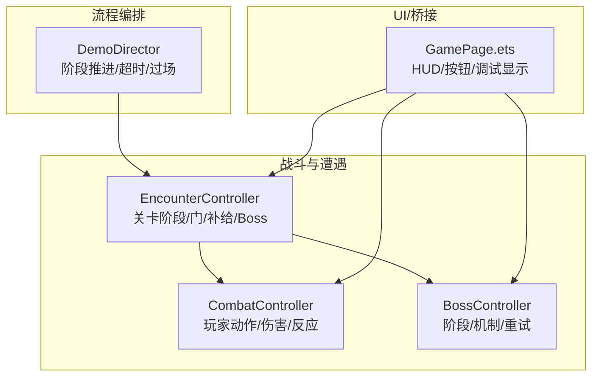
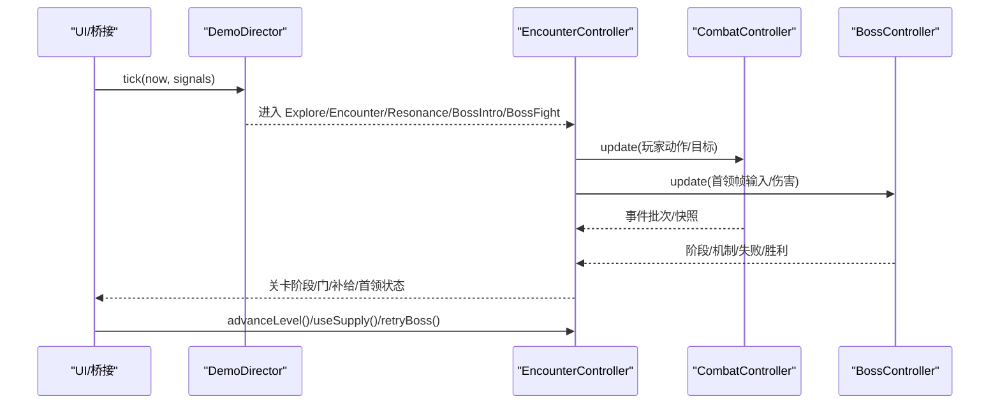
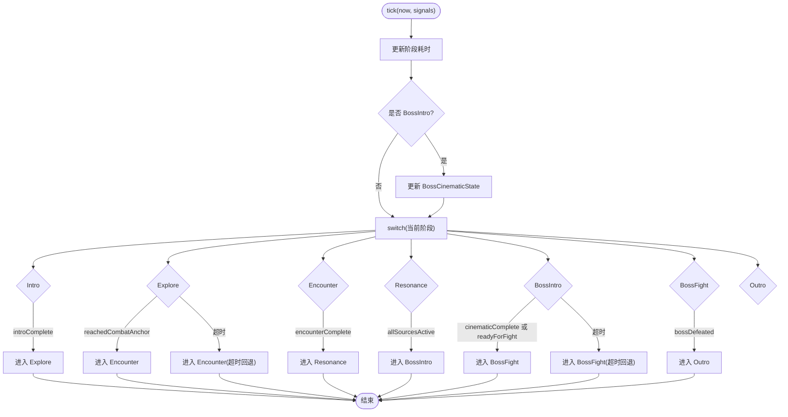
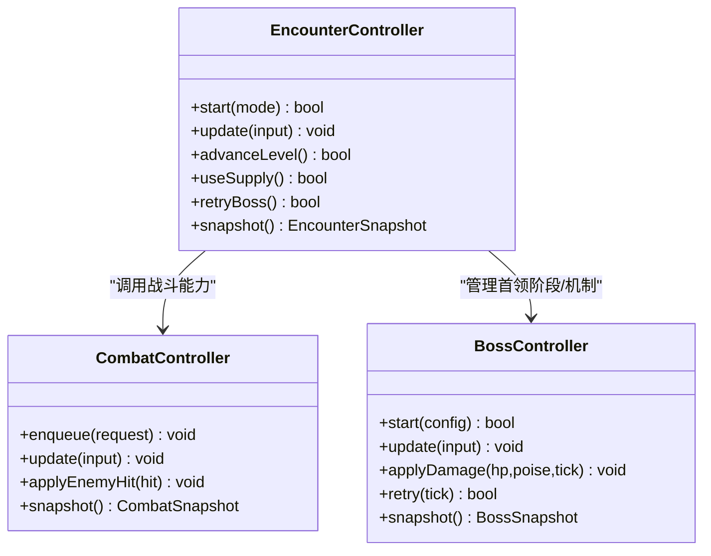
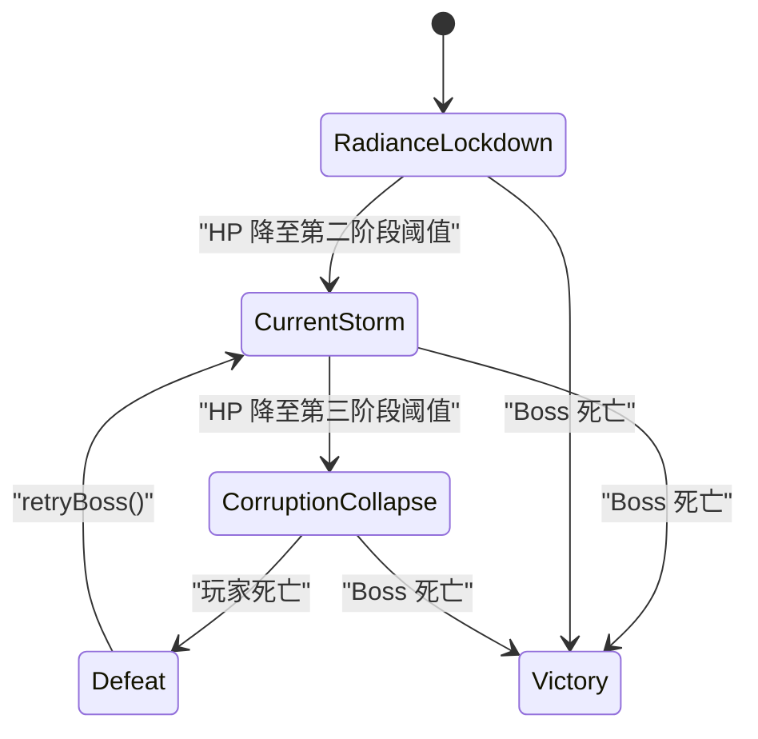
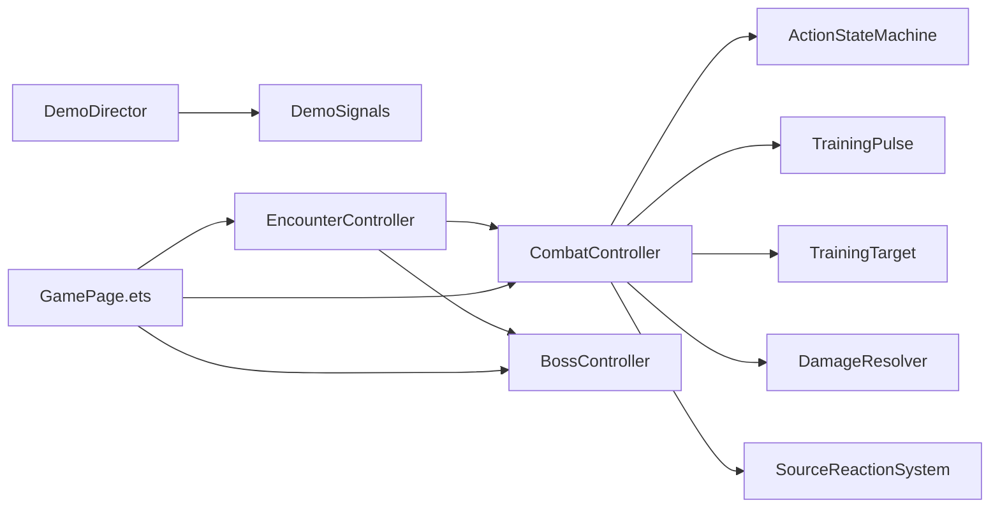

# 关卡流程控制

<cite>
**本文引用的文件**
- [demo_director.h](file://native/gameplay/flow/demo_director.h)
- [demo_director.cpp](file://native/gameplay/flow/demo_director.cpp)
- [test_demo_director.cpp](file://tests/test_demo_director.cpp)
- [encounter_controller.h](file://native/gameplay/ai/encounter_controller.h)
- [test_level_flow.cpp](file://tests/test_level_flow.cpp)
- [combat_controller.h](file://native/gameplay/combat/combat_controller.h)
- [boss.h](file://native/gameplay/entities/boss.h)
- [GamePage.ets](file://entry/src/main/ets/pages/GamePage.ets)
- [2026-07-18-boss-level-flow.md](file://docs/superpowers/plans/2026-07-18-boss-level-flow.md)
- [enemies.json](file://config/dev/enemies.json)
</cite>

## 目录
1. [简介](#简介)
2. [项目结构](#项目结构)
3. [核心组件](#核心组件)
4. [架构总览](#架构总览)
5. [详细组件分析](#详细组件分析)
6. [依赖关系分析](#依赖关系分析)
7. [性能考量](#性能考量)
8. [故障排查指南](#故障排查指南)
9. [结论](#结论)
10. [附录](#附录)

## 简介
本文件面向 my-world 的关卡流程控制系统，围绕 DemoDirector 的流程管理器、关卡状态切换、场景加载与资源管理进行系统化说明。文档覆盖训练模式、探索模式和 Boss 战的流程控制逻辑，记录关卡事件触发机制、条件判断与结果处理，并提供完整的流程示例（开场动画、战斗触发、胜利结算、失败重试等）。同时解释关卡配置文件的格式与动态加载机制，给出新关卡类型的开发指南与流程调试工具使用方法，帮助开发者快速扩展与维护关卡系统。

## 项目结构
关卡流程控制由“高层流程编排”和“底层战斗/遭遇系统”两部分组成：
- 高层流程编排：DemoDirector 负责阶段推进、超时保护、Boss 过场动画进度与输入/相机恢复控制。
- 底层战斗/遭遇系统：EncounterController 组织训练、普通敌人、精英、补给与 Boss 战；CombatController 驱动玩家动作、伤害计算与反应系统；BossController 管理首领阶段、机制门控与重试复位。
- UI 与桥接：ArkTS 页面通过 N-API 暴露调试入口与 HUD 字段，便于真机验证与流程调试。

图表来源
- [demo_director.h:7-15](file://native/gameplay/flow/demo_director.h#L7-L15)
- [encounter_controller.h:13-36](file://native/gameplay/ai/encounter_controller.h#L13-L36)
- [combat_controller.h:12-50](file://native/gameplay/combat/combat_controller.h#L12-L50)
- [boss.h:8-31](file://native/gameplay/entities/boss.h#L8-L31)
- [GamePage.ets:200-217](file://entry/src/main/ets/pages/GamePage.ets#L200-L217)

章节来源
- [demo_director.h:7-15](file://native/gameplay/flow/demo_director.h#L7-L15)
- [encounter_controller.h:13-36](file://native/gameplay/ai/encounter_controller.h#L13-L36)
- [combat_controller.h:12-50](file://native/gameplay/combat/combat_controller.h#L12-L50)
- [boss.h:8-31](file://native/gameplay/entities/boss.h#L8-L31)
- [GamePage.ets:200-217](file://entry/src/main/ets/pages/GamePage.ets#L200-L217)

## 核心组件
- DemoDirector：维护当前阶段、阶段计时、Boss 过场状态、输入/相机恢复标记，提供 tick 推进与 skipTo 跳转能力。
- EncounterController：管理 LevelFlow 各阶段（训练、普通敌人、精英、补给、Boss）、门开关、补给消费与 Boss 重试。
- CombatController：玩家动作队列、训练脉冲、目标绑定、伤害解析与反应系统，输出战斗快照与事件批次。
- BossController：三阶段阈值、节点门控、终末熔铸读条、失败状态与快速重试。

章节来源
- [demo_director.h:7-15](file://native/gameplay/flow/demo_director.h#L7-L15)
- [demo_director.cpp:50-94](file://native/gameplay/flow/demo_director.cpp#L50-L94)
- [encounter_controller.h:13-36](file://native/gameplay/ai/encounter_controller.h#L13-L36)
- [combat_controller.h:12-50](file://native/gameplay/combat/combat_controller.h#L12-L50)
- [boss.h:8-31](file://native/gameplay/entities/boss.h#L8-L31)

## 架构总览
DemoDirector 作为顶层流程控制器，依据外部信号推进阶段；EncounterController 在 LevelFlow 模式下串联不同战斗阶段并控制门与补给；BossController 独立管理首领阶段与机制；CombatController 提供战斗基础能力。UI 层通过 N-API 暴露调试入口，支持快速推进、重试与 HUD 展示。

图表来源
- [demo_director.cpp:50-94](file://native/gameplay/flow/demo_director.cpp#L50-L94)
- [encounter_controller.h:108-151](file://native/gameplay/ai/encounter_controller.h#L108-L151)
- [combat_controller.h:64-113](file://native/gameplay/combat/combat_controller.h#L64-L113)
- [boss.h:69-94](file://native/gameplay/entities/boss.h#L69-L94)

## 详细组件分析

### DemoDirector 流程管理器
- 阶段枚举：Intro、Explore、Encounter、Resonance、BossIntro、BossFight、Outro。
- 信号驱动：根据 DemoSignals 推进阶段（如 introComplete、reachedCombatAnchor、encounterComplete、allSourcesActive、cinematicComplete、bossDefeated）。
- 超时保护：Explore 阶段默认超时进入 Encounter；BossIntro 阶段超时进入 BossFight。
- Boss 过场：BossCinematicState 维护 ringProgress、shardCount、sourceColor、broken、readyForFight、elapsedMs，按固定时长推进并在 readyForFight 时恢复输入与相机。
- 跳转与恢复：skipTo(phase) 可跳过阶段并重置 phaseElapsedMs，确保 inputRestored/cameraRestored 正确。

图表来源
- [demo_director.cpp:50-94](file://native/gameplay/flow/demo_director.cpp#L50-L94)
- [demo_director.h:7-15](file://native/gameplay/flow/demo_director.h#L7-L15)

章节来源
- [demo_director.h:7-15](file://native/gameplay/flow/demo_director.h#L7-L15)
- [demo_director.cpp:50-94](file://native/gameplay/flow/demo_director.cpp#L50-L94)
- [test_demo_director.cpp:7-36](file://tests/test_demo_director.cpp#L7-L36)

### 关卡流程与遭遇系统（LevelFlow）
- 模式与阶段：EncounterMode::LevelFlow 串联 LevelStage 序列 Training -> RiftClawFight -> PriestMixedFight -> GuardElite -> Supply -> Boss。
- 门控：GateState Closed/Open 仅在当前阶段胜利后打开；advanceLevel() 只在门打开时推进。
- 补给：SupplyState Unavailable/Available/Consumed，useSupply() 仅消费一次，不改变模式。
- Boss 接入：使用固定 EntityId，作为软锁定候选；玩家攻击走 TrainingTarget 伤害管线；Boss 命中玩家复用 applyEnemyHit；Defeat 后 retryBoss() 从 Boss 入口快速重试。

图表来源
- [encounter_controller.h:108-151](file://native/gameplay/ai/encounter_controller.h#L108-L151)
- [combat_controller.h:64-113](file://native/gameplay/combat/combat_controller.h#L64-L113)
- [boss.h:69-94](file://native/gameplay/entities/boss.h#L69-L94)

章节来源
- [encounter_controller.h:13-36](file://native/gameplay/ai/encounter_controller.h#L13-L36)
- [test_level_flow.cpp:25-43](file://tests/test_level_flow.cpp#L25-L43)
- [test_level_flow.cpp:45-84](file://tests/test_level_flow.cpp#L45-L84)

### Boss 战流程控制
- 阶段与机制：BossPhase（RadianceLockdown、CurrentStorm、CorruptionCollapse），BossMechanic（JudgmentBeam、CurrentNodes、FinalForge）。
- 阈值与门控：HP 阈值触发阶段转换（单次触发），节点门控影响机制可用性，终末熔铸读条决定最终阶段行为。
- 失败与重试：Defeat 后 retryBoss() 在 5 秒内复位状态，恢复默认 HP/韧性，不重置前置关卡阶段。

图表来源
- [boss.h:8-31](file://native/gameplay/entities/boss.h#L8-L31)
- [boss.h:69-94](file://native/gameplay/entities/boss.h#L69-L94)

章节来源
- [boss.h:8-31](file://native/gameplay/entities/boss.h#L8-L31)
- [2026-07-18-boss-level-flow.md:38-96](file://docs/superpowers/plans/2026-07-18-boss-level-flow.md#L38-L96)

### 训练模式与探索模式
- 训练模式：TrainingPulse 生成警告与命中事件，TrainingTarget 提供受击反馈与复活重置；CombatController 将玩家动作映射到目标伤害。
- 探索模式：Explore 阶段等待 reachedCombatAnchor 信号或超时进入 Encounter；超时路径用于保障流程推进。

章节来源
- [combat_controller.h:12-50](file://native/gameplay/combat/combat_controller.h#L12-L50)
- [demo_director.cpp:64-70](file://native/gameplay/flow/demo_director.cpp#L64-L70)

### 场景加载与资源管理
- 资源清单与环境资产：assets/manifest.json 与环境资源清单用于声明模型、纹理等资源；原生层通过 loader/save 模块加载与保存资源。
- 运行时加载：Boss 过场与 VFX 相关资源在 BossIntro 阶段按需加载，避免主循环阻塞。
- 配置数据：config/dev/enemies.json 定义敌人基础属性（id、hp、resist），供 AI 与战斗系统读取。

章节来源
- [enemies.json:1-2](file://config/dev/enemies.json#L1-L2)
- [2026-07-18-boss-level-flow.md:24-37](file://docs/superpowers/plans/2026-07-18-boss-level-flow.md#L24-L37)

## 依赖关系分析
- DemoDirector 依赖 TickClock 与 DemoSignals，不直接耦合战斗细节，保持高层解耦。
- EncounterController 依赖 CombatController 与 BossController，封装关卡阶段与门控逻辑。
- CombatController 依赖 ActionStateMachine、TrainingPulse、TrainingTarget、DamageResolver、SourceReactionSystem。
- UI 层通过 N-API 暴露方法，避免直接访问 C++ 容器，保证契约稳定。

图表来源
- [demo_director.h:7-15](file://native/gameplay/flow/demo_director.h#L7-L15)
- [encounter_controller.h:108-151](file://native/gameplay/ai/encounter_controller.h#L108-L151)
- [combat_controller.h:64-113](file://native/gameplay/combat/combat_controller.h#L64-L113)
- [GamePage.ets:200-217](file://entry/src/main/ets/pages/GamePage.ets#L200-L217)

章节来源
- [demo_director.h:7-15](file://native/gameplay/flow/demo_director.h#L7-L15)
- [encounter_controller.h:108-151](file://native/gameplay/ai/encounter_controller.h#L108-L151)
- [combat_controller.h:64-113](file://native/gameplay/combat/combat_controller.h#L64-L113)
- [GamePage.ets:200-217](file://entry/src/main/ets/pages/GamePage.ets#L200-L217)

## 性能考量
- 阶段推进采用 O(1) 状态机，tick 中仅更新计时与信号判断，无复杂计算。
- Boss 过场动画按固定时长推进，ringProgress 线性插值，sourceColor 周期切换，开销极低。
- EncounterController 每帧更新敌人与玩家状态，建议限制每帧事件批大小，避免 UI 渲染抖动。
- 资源加载建议在异步线程或空闲帧进行，避免主循环卡顿。

## 故障排查指南
- 流程卡住：检查 DemoSignals 是否正确设置（introComplete、reachedCombatAnchor、encounterComplete、allSourcesActive、cinematicComplete、bossDefeated）。
- 超时异常：确认 Explore 与 BossIntro 超时阈值是否符合预期，必要时调整 kExploreTimeoutMs 与 kBossIntroTimeoutMs。
- 门未打开：确保当前阶段胜利后 GateState 变为 Open，再调用 advanceLevel()。
- 补给重复消费：useSupply() 应仅允许一次，检查 SupplyState 是否为 Consumed。
- Boss 重试失败：确认 retryBoss() 在 Defeat 后调用，且 5 秒内可重新开始。

章节来源
- [test_demo_director.cpp:30-44](file://tests/test_demo_director.cpp#L30-L44)
- [test_level_flow.cpp:25-43](file://tests/test_level_flow.cpp#L25-L43)
- [test_level_flow.cpp:45-84](file://tests/test_level_flow.cpp#L45-L84)

## 结论
DemoDirector 与 EncounterController 共同构建了清晰的关卡流程控制体系：高层阶段推进与超时保护、低层战斗与 Boss 机制解耦，配合 UI 调试入口与配置文件，形成可扩展、可测试、可维护的关卡系统。开发者可通过新增阶段、门控与机制快速扩展内容，利用测试与桥接接口进行高效验证。

## 附录

### 关卡配置文件格式与动态加载
- enemies.json：数组对象，包含 id、hp、resist 字段，用于敌人基础属性配置。
- 动态加载：原生层在初始化时读取 manifest 与环境资源清单，按需加载模型与纹理；Boss 过场资源在 BossIntro 阶段加载。

章节来源
- [enemies.json:1-2](file://config/dev/enemies.json#L1-L2)
- [2026-07-18-boss-level-flow.md:24-37](file://docs/superpowers/plans/2026-07-18-boss-level-flow.md#L24-L37)

### 新关卡类型开发指南
- 新增阶段：在 EncounterMode 中添加新枚举，在 LevelStage 中定义新环节。
- 门控与推进：实现 GateState 逻辑，确保胜利后打开门，advanceLevel() 仅在门打开时推进。
- 资源与配置：在 config/dev 下添加对应 JSON 配置，并在资源清单中声明。
- 测试覆盖：编写单元测试覆盖阶段推进、门控、补给与 Boss 重试逻辑。

章节来源
- [encounter_controller.h:13-36](file://native/gameplay/ai/encounter_controller.h#L13-L36)
- [2026-07-18-boss-level-flow.md:98-147](file://docs/superpowers/plans/2026-07-18-boss-level-flow.md#L98-L147)

### 流程调试工具使用方法
- UI 入口：GamePage.ets 暴露 startEncounter、advanceLevel、useSupply、retryBoss 等方法，HUD 显示 levelStage、gateState、supplyState、bossHp、bossPoise、bossPhase、bossMechanic、bossCastMs。
- 快速跳转：使用 DemoDirector::skipTo(phase) 跳过阶段，验证后续流程。
- 日志与快照：通过 snapshot() 获取当前状态，结合 UI 显示定位问题。

章节来源
- [GamePage.ets:200-217](file://entry/src/main/ets/pages/GamePage.ets#L200-L217)
- [2026-07-18-boss-level-flow.md:198-241](file://docs/superpowers/plans/2026-07-18-boss-level-flow.md#L198-L241)