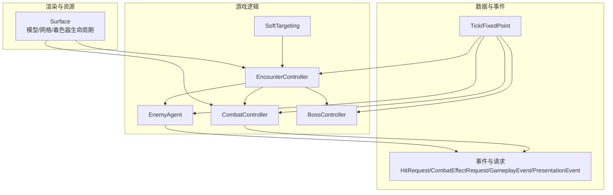
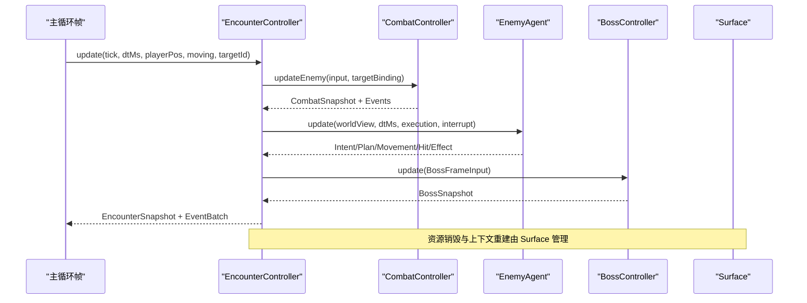
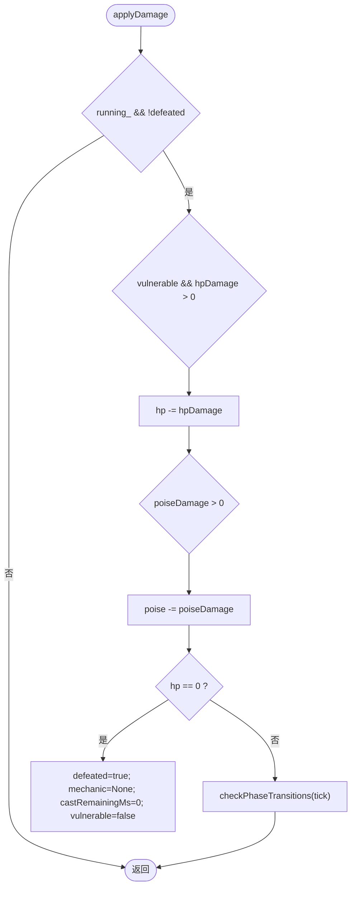
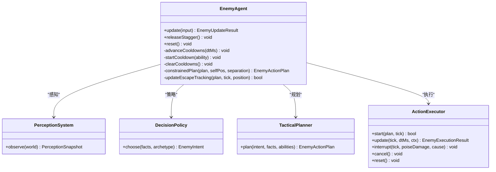
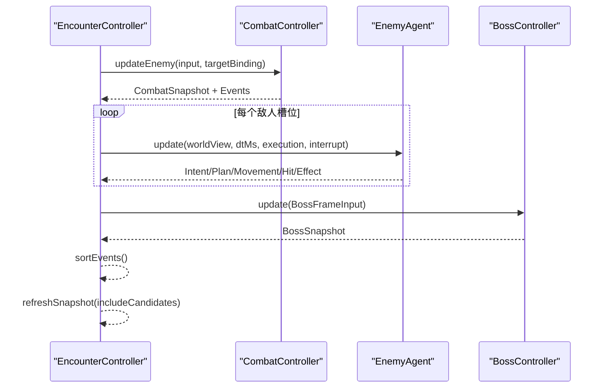
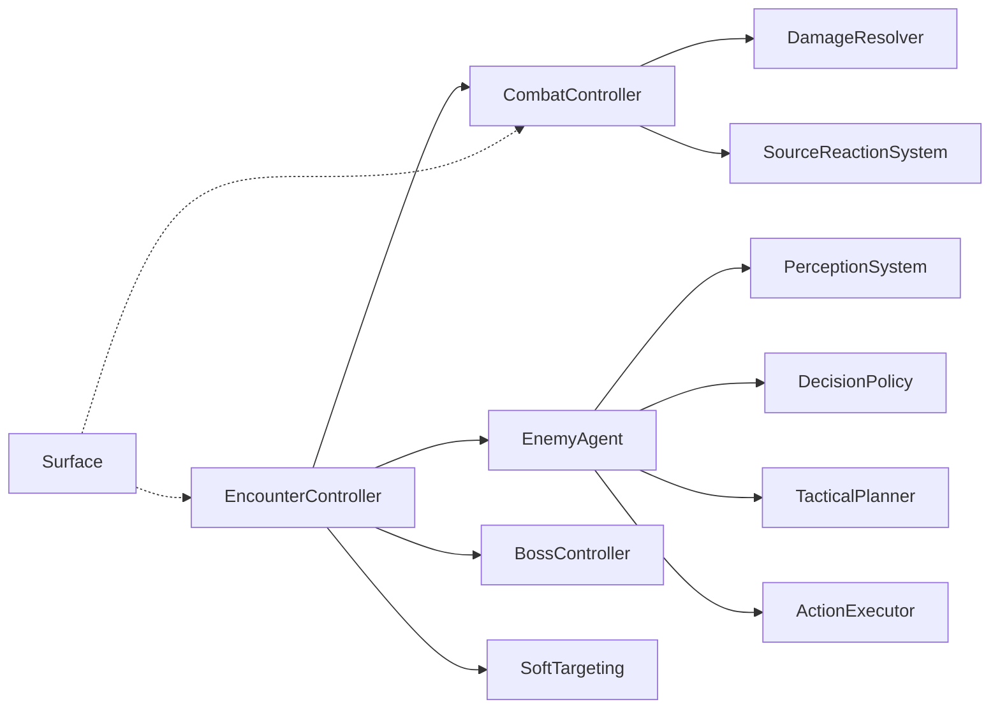
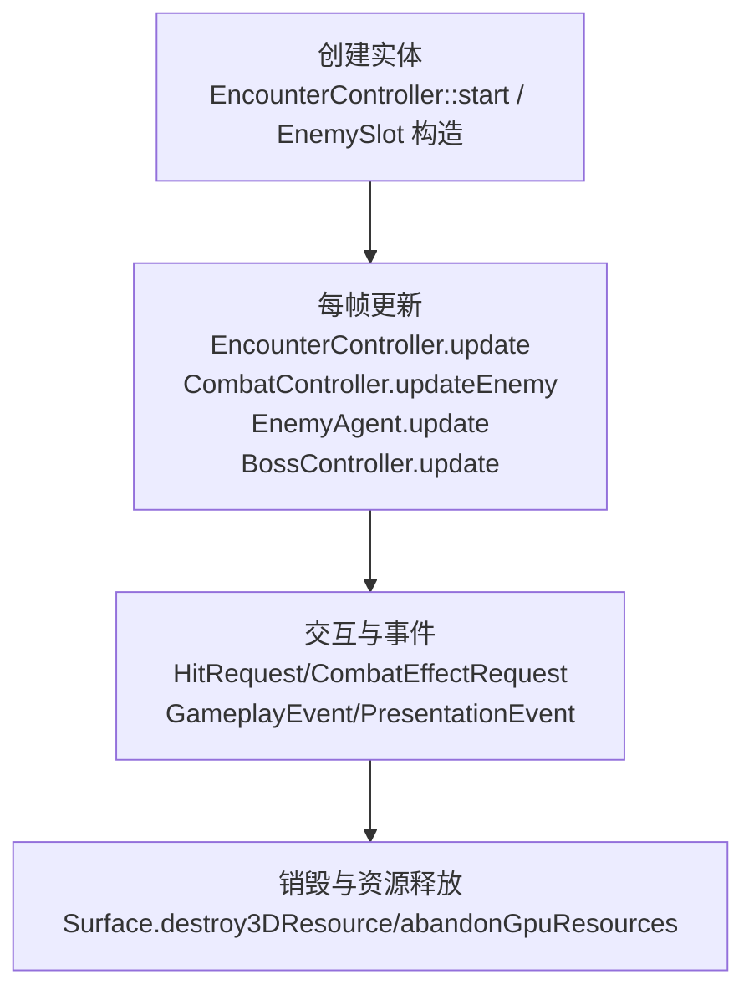

# 实体管理系统

<cite>
**本文引用的文件**   
- [boss.h](file://native/gameplay/entities/boss.h)
- [boss.cpp](file://native/gameplay/entities/boss.cpp)
- [enemy.h](file://native/gameplay/entities/enemy.h)
- [encounter_controller.h](file://native/gameplay/ai/encounter_controller.h)
- [encounter_controller.cpp](file://native/gameplay/ai/encounter_controller.cpp)
- [enemy_agent.h](file://native/gameplay/ai/enemy_agent.h)
- [enemy_agent.cpp](file://native/gameplay/ai/enemy_agent.cpp)
- [event.h](file://native/gameplay/combat/event.h)
- [combat_controller.h](file://native/gameplay/combat/combat_controller.h)
- [soft_targeting.h](file://native/gameplay/targeting/soft_targeting.h)
- [tick_clock.h](file://native/engine/core/tick_clock.h)
- [surface.cpp](file://native/engine/render/surface.cpp)
</cite>

## 目录
1. [简介](#简介)
2. [项目结构](#项目结构)
3. [核心组件](#核心组件)
4. [架构总览](#架构总览)
5. [详细组件分析](#详细组件分析)
6. [依赖关系分析](#依赖关系分析)
7. [性能考量](#性能考量)
8. [故障排查指南](#故障排查指南)
9. [结论](#结论)
10. [附录](#附录)

## 简介
本文件为 my-world 的实体管理系统提供系统化文档，聚焦以下目标：
- Boss 实体的特殊行为模式与多阶段机制（血量阈值触发、技能释放、节点破坏、脆弱期）
- Enemy 基类的通用属性、状态管理与 AI 决策流程
- 实体生命周期管理（创建、更新、销毁）
- 实体间交互机制（碰撞检测、软目标选择、事件系统）
- 资源管理与渲染集成（模型与网格的生命周期）
- 自定义实体类型的开发指南与性能优化建议

## 项目结构
围绕实体管理的代码主要分布在 gameplay/ai、gameplay/entities、gameplay/combat、gameplay/targeting 以及 engine/render 等模块。关键职责划分如下：
- 实体数据与基础类型：Enemy、BossConfig/BossSnapshot、Tick/FixedPoint
- 战斗与事件：CombatController、Event 定义、DamageResolver、SourceReactionSystem
- 遭遇战编排：EncounterController（敌人槽位、Boss 控制、快照与事件聚合）
- 敌人 AI：EnemyAgent（感知、策略、战术规划、动作执行）
- 目标选择：SoftTargeting（基于距离与角度的候选目标筛选）
- 渲染资源：Surface（模型/网格/着色器生命周期与上下文重建）

图表来源
- [encounter_controller.h:1-151](file://native/gameplay/ai/encounter_controller.h#L1-L151)
- [combat_controller.h:1-113](file://native/gameplay/combat/combat_controller.h#L1-L113)
- [enemy_agent.h:1-107](file://native/gameplay/ai/enemy_agent.h#L1-L107)
- [boss.h:1-94](file://native/gameplay/entities/boss.h#L1-L94)
- [soft_targeting.h:1-42](file://native/gameplay/targeting/soft_targeting.h#L1-L42)
- [event.h:1-96](file://native/gameplay/combat/event.h#L1-L96)
- [tick_clock.h:1-7](file://native/engine/core/tick_clock.h#L1-L7)
- [surface.cpp:511-1481](file://native/engine/render/surface.cpp#L511-L1481)

章节来源
- [encounter_controller.h:1-151](file://native/gameplay/ai/encounter_controller.h#L1-L151)
- [combat_controller.h:1-113](file://native/gameplay/combat/combat_controller.h#L1-L113)
- [enemy_agent.h:1-107](file://native/gameplay/ai/enemy_agent.h#L1-L107)
- [boss.h:1-94](file://native/gameplay/entities/boss.h#L1-L94)
- [soft_targeting.h:1-42](file://native/gameplay/targeting/soft_targeting.h#L1-L42)
- [event.h:1-96](file://native/gameplay/combat/event.h#L1-L96)
- [tick_clock.h:1-7](file://native/engine/core/tick_clock.h#L1-L7)
- [surface.cpp:511-1481](file://native/engine/render/surface.cpp#L511-L1481)

## 核心组件
- EncounterController：编排整场遭遇战，维护敌人槽位、Boss 控制器、玩家战斗控制器、事件批次与快照；负责模式切换、关卡推进、补给使用与 Boss 重试。
- CombatController：处理玩家输入队列、动作状态机、训练脉冲、伤害解析、源反应系统，输出战斗快照与事件。
- EnemyAgent：每个敌人的独立 AI 单元，包含感知系统、决策策略、战术规划、动作执行、冷却与失衡恢复、区域约束与分离避让。
- BossController：Boss 多阶段状态机，支持血量阈值阶段转换、机制计时、节点破坏与脆弱期刷新。
- SoftTargeting：根据玩家朝向与相机角度从候选目标中选择最佳目标。
- Surface：管理 3D 模型、网格、着色器的创建、销毁与上下文重建，确保 GPU 资源安全回收。

章节来源
- [encounter_controller.h:1-151](file://native/gameplay/ai/encounter_controller.h#L1-L151)
- [combat_controller.h:1-113](file://native/gameplay/combat/combat_controller.h#L1-L113)
- [enemy_agent.h:1-107](file://native/gameplay/ai/enemy_agent.h#L1-L107)
- [boss.h:1-94](file://native/gameplay/entities/boss.h#L1-L94)
- [soft_targeting.h:1-42](file://native/gameplay/targeting/soft_targeting.h#L1-L42)
- [surface.cpp:511-1481](file://native/engine/render/surface.cpp#L511-L1481)

## 架构总览
整体数据流与控制流如下：
- 每帧输入进入 EncounterController.update，内部调用 CombatController.updateEnemy 与 EnemyAgent.update，同时驱动 BossController.update。
- 伤害与效果通过 HitRequest/CombatEffectRequest 传递至 DamageResolver 与 SourceReactionSystem，生成 GameplayEvent 与 PresentationEvent。
- 渲染层 Surface 在生命周期结束时统一销毁模型与网格，并在上下文重建时标记资产脏以重新上传。

图表来源
- [encounter_controller.cpp:1-200](file://native/gameplay/ai/encounter_controller.cpp#L1-L200)
- [combat_controller.h:1-113](file://native/gameplay/combat/combat_controller.h#L1-L113)
- [enemy_agent.cpp:1-392](file://native/gameplay/ai/enemy_agent.cpp#L1-L392)
- [boss.cpp:1-146](file://native/gameplay/entities/boss.cpp#L1-L146)
- [surface.cpp:511-1481](file://native/engine/render/surface.cpp#L511-L1481)

## 详细组件分析

### Boss 控制器与多阶段机制
- 阶段枚举与机制枚举：RadianceLockdown、CurrentStorm、CorruptionCollapse；JudgmentBeam、CurrentNodes、FinalForge。
- 配置项：最大生命、韧性、阶段阈值、最终机制施法时间、节点数量。
- 运行时快照：当前阶段、机制、HP/POISE、脆弱性、失败标志、过渡计数、节点破坏计数、剩余施法时间、最后过渡时间戳、重试时间戳。
- 核心流程：
  - start/retry：校验配置并重置运行态。
  - applyDamage：仅在脆弱期扣减 HP，降低 POISE，HP=0 时标记 defeated 并清理机制。
  - checkPhaseTransitions：按阈值进入下一阶段。
  - enterPhase：初始化阶段特定状态（如 CurrentStorm 重置节点、CorruptionCollapse 启动 FinalForge 计时）。
  - refreshVulnerability：根据阶段与节点破坏情况刷新脆弱期。
  - breakCurrentNode：在 CurrentStorm 阶段破坏节点，累计破坏数并刷新脆弱期。
  - update：在 CorruptionCollapse+FinalForge 阶段进行倒计时，若未成功打断则失败并恢复脆弱期。

图表来源
- [boss.cpp:1-146](file://native/gameplay/entities/boss.cpp#L1-L146)
- [boss.h:1-94](file://native/gameplay/entities/boss.h#L1-L94)

章节来源
- [boss.h:1-94](file://native/gameplay/entities/boss.h#L1-L94)
- [boss.cpp:1-146](file://native/gameplay/entities/boss.cpp#L1-L146)

### Enemy 基类与通用属性
- 字段：id、hp、poise、抗性（SourceType）、原型（EnemyArchetype）、位置（position/spawnPosition/safeReturnPosition）、护盾、碰撞半径。
- 存活判定：alive() 基于 id 非零且 hp>0。
- 受击处理：takeHit(HitEvent) 扣除 baseDamage 与固定 POISE 值。

章节来源
- [enemy.h:1-24](file://native/gameplay/entities/enemy.h#L1-L24)

### 敌人 AI：EnemyAgent
- 输入输出：EnemyUpdateInput（世界视图、dtMs、执行上下文、可选中断），EnemyUpdateResult（意图、计划、状态、相位、期望位置、移动向量、分离向量、命中/特效请求、中断标志、目标候选、逃脱状态）。
- 核心能力：
  - 感知系统：观察自身、玩家、盟友、区域边界、可见性与威胁度。
  - 决策策略：基于感知快照与原型选择意图。
  - 战术规划：生成动作计划（移动、攻击、回退等），并进行区域投影与分离避让。
  - 动作执行：开始/更新/取消/重置，支持冷却与失衡恢复。
  - 逃脱跟踪：无进展时退回安全点，避免卡死。
- 关键流程：
  - update：稳定化世界视图、推进冷却、感知、失衡处理、意图选择、计划约束、执行更新、结果组装。
  - releaseStagger/reset：恢复失衡与重置状态。

图表来源
- [enemy_agent.h:1-107](file://native/gameplay/ai/enemy_agent.h#L1-L107)
- [enemy_agent.cpp:1-392](file://native/gameplay/ai/enemy_agent.cpp#L1-L392)

章节来源
- [enemy_agent.h:1-107](file://native/gameplay/ai/enemy_agent.h#L1-L107)
- [enemy_agent.cpp:1-392](file://native/gameplay/ai/enemy_agent.cpp#L1-L392)

### 遭遇战编排：EncounterController
- 模式与状态：Training/Beast/Mixed/Guard/LevelFlow/Boss；Stopped/Running/Victory/Defeat。
- 关卡阶段：Training/RiftClawFight/PriestMixedFight/GuardElite/Supply/Boss。
- 敌人槽位：每个槽位包含 Enemy、TrainingTarget、EnemyAgent、朝向、动画事实（moving/attacking/hit）。
- 核心流程：
  - start(mode/config)：校验配置、初始化敌人槽位、设置战斗配置（含 Boss 配置）。
  - update：推进玩家战斗、敌人 AI、Boss 控制器，收集事件与效果，刷新快照。
  - advanceLevel/useSupply/retryBoss：关卡推进、补给使用、Boss 重试。
  - 事件排序：HitRequest/CombatEffectRequest 按 tick/target/sequence/transactionId 排序保证确定性。

图表来源
- [encounter_controller.cpp:1-200](file://native/gameplay/ai/encounter_controller.cpp#L1-L200)
- [encounter_controller.h:1-151](file://native/gameplay/ai/encounter_controller.h#L1-L151)

章节来源
- [encounter_controller.h:1-151](file://native/gameplay/ai/encounter_controller.h#L1-L151)
- [encounter_controller.cpp:1-200](file://native/gameplay/ai/encounter_controller.cpp#L1-L200)

### 目标选择：SoftTargeting
- 输入：玩家位置、相机偏航角、候选目标列表、首选 ID。
- 输出：最佳目标（ID、距离、角度、方向）。
- 作用：为 UI 或战斗系统提供稳定的目标选择逻辑。

章节来源
- [soft_targeting.h:1-42](file://native/gameplay/targeting/soft_targeting.h#L1-L42)

### 事件系统与战斗数据
- 事件类型：GameplayEventType（Hit/Damage/Dodge/Interrupt/PoiseBreak/AuraApplied/Resonance/PhaseChanged/Death/EncounterReset）、PresentationEventType（HitFlash/CameraShake/DodgeFlash/CastBarBroken/PoiseBreakBurst/ResonanceBurst/PhaseTransition）。
- 数据结构：HitRequest、CombatEffectRequest、GameplayEvent、PresentationEvent、CombatResult。
- 用途：跨系统通信、表现层反馈、回放与调试。

章节来源
- [event.h:1-96](file://native/gameplay/combat/event.h#L1-L96)

### 时间与数值基础
- Tick：int64_t 时间单位（毫秒级）。
- FixedPoint：定点数（1.0 == 1<<16），fp(double) 转换函数。

章节来源
- [tick_clock.h:1-7](file://native/engine/core/tick_clock.h#L1-L7)

## 依赖关系分析
- EncounterController 依赖 CombatController、EnemyAgent、BossController、SoftTargeting。
- CombatController 依赖 ActionStateMachine、DamageResolver、SourceReactionSystem、TrainingPulse。
- EnemyAgent 依赖 PerceptionSystem、DecisionPolicy、TacticalPlanner、ActionExecutor。
- Surface 与渲染管线解耦于 gameplay 逻辑，但影响实体模型的创建与销毁。

图表来源
- [encounter_controller.h:1-151](file://native/gameplay/ai/encounter_controller.h#L1-L151)
- [combat_controller.h:1-113](file://native/gameplay/combat/combat_controller.h#L1-L113)
- [enemy_agent.h:1-107](file://native/gameplay/ai/enemy_agent.h#L1-L107)
- [boss.h:1-94](file://native/gameplay/entities/boss.h#L1-L94)
- [soft_targeting.h:1-42](file://native/gameplay/targeting/soft_targeting.h#L1-L42)
- [surface.cpp:511-1481](file://native/engine/render/surface.cpp#L511-L1481)

章节来源
- [encounter_controller.h:1-151](file://native/gameplay/ai/encounter_controller.h#L1-L151)
- [combat_controller.h:1-113](file://native/gameplay/combat/combat_controller.h#L1-L113)
- [enemy_agent.h:1-107](file://native/gameplay/ai/enemy_agent.h#L1-L107)
- [boss.h:1-94](file://native/gameplay/entities/boss.h#L1-L94)
- [soft_targeting.h:1-42](file://native/gameplay/targeting/soft_targeting.h#L1-L42)
- [surface.cpp:511-1481](file://native/engine/render/surface.cpp#L511-L1481)

## 性能考量
- 事件排序稳定性：HitRequest/CombatEffectRequest 使用 tick/target/sequence/transactionId 排序，保证确定性且避免频繁重排。
- 敌人 AI 节流：决策周期、最小进展阈值、无进展决策上限防止过度计算。
- 区域约束与分离：将目标投影到区域内并叠加分离向量，减少不必要的寻路与重叠计算。
- 资源管理：Surface 在 EGL 上下文重建时仅标记资产脏，避免重复上传；销毁时按组释放，确保顺序正确。
- 数值精度：FixedPoint 定点数避免浮点误差累积，提升一致性。

[本节为通用指导，不直接分析具体文件]

## 故障排查指南
- Boss 机制失败：检查 CorruptionCollapse+FinalForge 阶段的 castRemainingMs 是否归零、failedMechanic 标志是否置位、vulnerable 是否恢复。
- 节点破坏无效：确认当前阶段为 CurrentStorm、节点索引有效、未被破坏过、config_.currentNodeCount 正确。
- 敌人卡住：查看 escapeState 是否为 ReturningToSafePoint、noProgressDecisions 是否达到上限、separationDistance 是否合理。
- 事件顺序异常：核对 HitRequest/CombatEffectRequest 的 tick/target/sequence/transactionId 排序规则。
- 渲染崩溃：EGL 绑定失败时不应调用 destroy3DResource；需先 abandonGpuResources 再销毁。

章节来源
- [boss.cpp:1-146](file://native/gameplay/entities/boss.cpp#L1-L146)
- [enemy_agent.cpp:1-392](file://native/gameplay/ai/enemy_agent.cpp#L1-L392)
- [encounter_controller.cpp:1-200](file://native/gameplay/ai/encounter_controller.cpp#L1-L200)
- [surface.cpp:511-1481](file://native/engine/render/surface.cpp#L511-L1481)

## 结论
my-world 的实体管理系统以 EncounterController 为核心编排者，结合 CombatController、EnemyAgent、BossController 与 SoftTargeting，形成清晰的职责分层与数据流。通过事件系统与定点数保障一致性与可观测性，借助 Surface 的资源管理确保渲染安全。Boss 的多阶段机制与节点的脆弱期设计提供了丰富的战斗体验。遵循本文的开发指南与优化建议，可高效扩展自定义实体类型并保持性能与稳定性。

[本节为总结，不直接分析具体文件]

## 附录

### 实体生命周期流程图

图表来源
- [encounter_controller.cpp:1-200](file://native/gameplay/ai/encounter_controller.cpp#L1-L200)
- [combat_controller.h:1-113](file://native/gameplay/combat/combat_controller.h#L1-L113)
- [enemy_agent.cpp:1-392](file://native/gameplay/ai/enemy_agent.cpp#L1-L392)
- [boss.cpp:1-146](file://native/gameplay/entities/boss.cpp#L1-L146)
- [surface.cpp:511-1481](file://native/engine/render/surface.cpp#L511-L1481)

### 自定义实体开发指南
- 新增实体类型步骤：
  - 定义实体数据结构（参考 Enemy 结构），包含必要属性与存活判定。
  - 如需 AI，实现 EnemyAgent 的配置与行为（感知、策略、规划、执行）。
  - 在 EncounterController 中注册新槽位或 Boss 控制器，提供配置工厂方法。
  - 在 CombatController 中适配伤害与事件，确保事件排序与快照一致性。
  - 在 Surface 中注册模型/网格资源，确保生命周期与上下文重建正确。
- 注意事项：
  - 保持 Tick/FixedPoint 的一致性，避免溢出与精度问题。
  - 事件排序键必须唯一且稳定，避免随机性。
  - 区域约束与分离参数需调优，避免卡顿或穿透。
  - Boss 机制需明确脆弱期与失败恢复路径，保证可玩性。

[本节为通用指导，不直接分析具体文件]