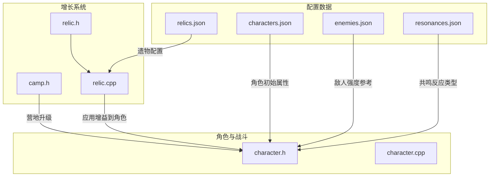
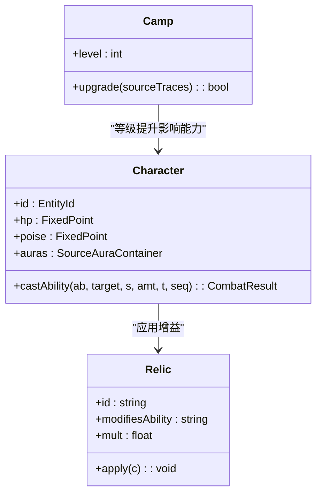
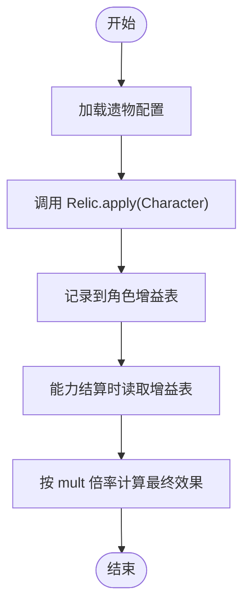
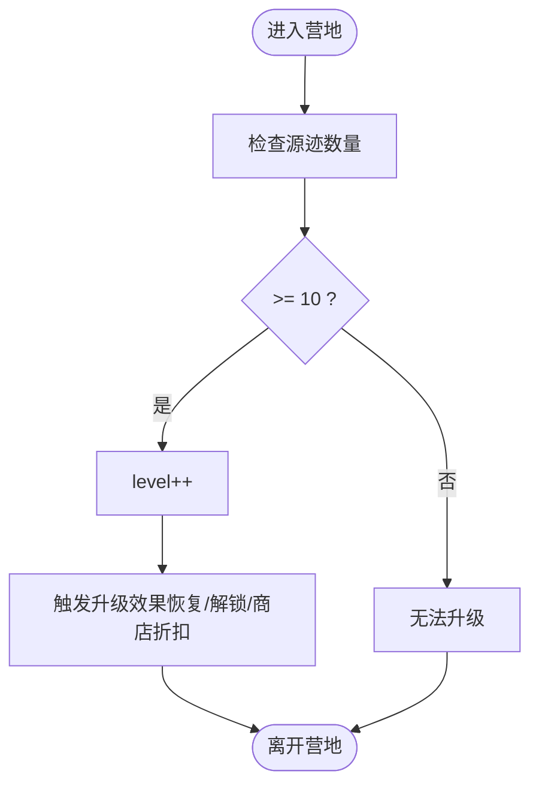
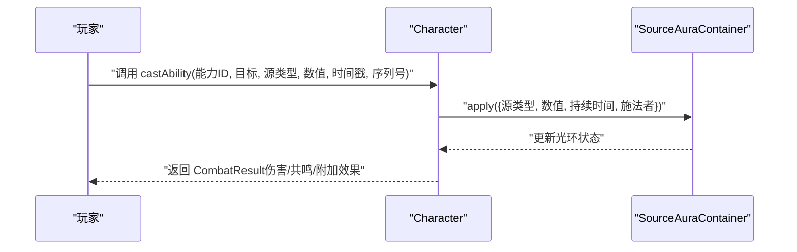
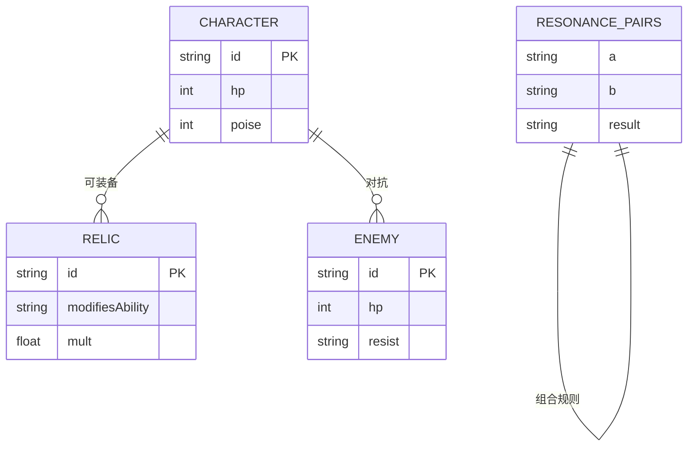
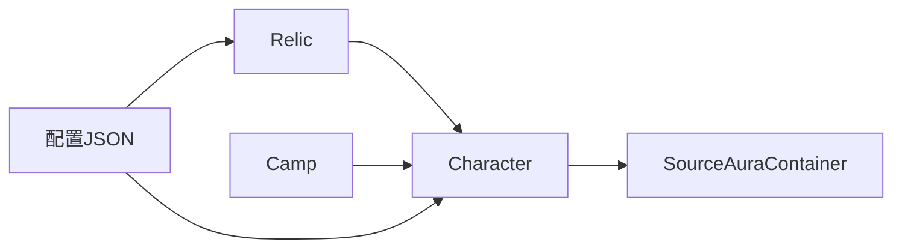

# 成长系统

<cite>
**本文引用的文件**   
- [relic.h](file://native/gameplay/growth/relic.h)
- [relic.cpp](file://native/gameplay/growth/relic.cpp)
- [camp.h](file://native/gameplay/growth/camp.h)
- [characters.json](file://config/dev/characters.json)
- [relics.json](file://config/dev/relics.json)
- [enemies.json](file://config/dev/enemies.json)
- [resonances.json](file://config/dev/resonances.json)
- [character.h](file://native/gameplay/player/character.h)
- [character.cpp](file://native/gameplay/player/character.cpp)
</cite>

## 目录
1. [简介](#简介)
2. [项目结构](#项目结构)
3. [核心组件](#核心组件)
4. [架构总览](#架构总览)
5. [详细组件分析](#详细组件分析)
6. [依赖关系分析](#依赖关系分析)
7. [性能考量](#性能考量)
8. [故障排查指南](#故障排查指南)
9. [结论](#结论)
10. [附录](#附录)

## 简介
本文件为 my-world 的成长系统提供系统化文档，重点覆盖以下方面：
- Relic（遗物）系统的属性加成、效果触发与装备机制
- Camp（营地）系统的功能：休息恢复、技能学习、商店交易等
- 角色成长曲线、经验值计算、等级提升与技能解锁机制
- 具体成长流程示例：击败敌人获得经验、使用遗物增强能力、在营地升级技能
- 数值平衡设计思路、随机生成算法与存档保存机制
- 自定义成长元素的开发指南与数值调优方法

当前仓库处于 MVP 阶段，成长系统以最小可用实现为主，后续可扩展为更丰富的数据驱动与规则引擎。

## 项目结构
与成长系统直接相关的代码与配置分布如下：
- 增长逻辑核心：native/gameplay/growth/ 下的 relic 与 camp
- 角色与战斗基础：native/gameplay/player/ 下的 character
- 配置数据：config/dev/ 下的 characters、relics、enemies、resonances

**图表来源** 
- [relic.h:1-6](file://native/gameplay/growth/relic.h#L1-L6)
- [relic.cpp:1-3](file://native/gameplay/growth/relic.cpp#L1-L3)
- [camp.h:1-3](file://native/gameplay/growth/camp.h#L1-L3)
- [character.h:1-6](file://native/gameplay/player/character.h#L1-L6)
- [character.cpp:1-6](file://native/gameplay/player/character.cpp#L1-L6)
- [characters.json:1-2](file://config/dev/characters.json#L1-L2)
- [relics.json:1-2](file://config/dev/relics.json#L1-L2)
- [enemies.json:1-2](file://config/dev/enemies.json#L1-L2)
- [resonances.json:1-5](file://config/dev/resonances.json#L1-L5)

**章节来源**
- [relic.h:1-6](file://native/gameplay/growth/relic.h#L1-L6)
- [relic.cpp:1-3](file://native/gameplay/growth/relic.cpp#L1-L3)
- [camp.h:1-3](file://native/gameplay/growth/camp.h#L1-L3)
- [character.h:1-6](file://native/gameplay/player/character.h#L1-L6)
- [character.cpp:1-6](file://native/gameplay/player/character.cpp#L1-L6)
- [characters.json:1-2](file://config/dev/characters.json#L1-L2)
- [relics.json:1-2](file://config/dev/relics.json#L1-L2)
- [enemies.json:1-2](file://config/dev/enemies.json#L1-L2)
- [resonances.json:1-5](file://config/dev/resonances.json#L1-L5)

## 核心组件
- 遗物（Relic）
  - 数据结构包含 id、modifiesAbility、mult，用于标识目标能力与倍率
  - apply 方法将增益记录到角色的增益表，结算时按倍率生效
- 营地（Camp）
  - 维护 level 与升级条件（如消耗源迹）
  - upgrade 方法根据输入资源判断是否升级并更新等级
- 角色（Character）
  - 持有 hp、poise、SourceAuraContainer 等状态
  - castAbility 通过 SourceAura 施加增益或伤害，并返回战斗结果

**章节来源**
- [relic.h:1-6](file://native/gameplay/growth/relic.h#L1-L6)
- [relic.cpp:1-3](file://native/gameplay/growth/relic.cpp#L1-L3)
- [camp.h:1-3](file://native/gameplay/growth/camp.h#L1-L3)
- [character.h:1-6](file://native/gameplay/player/character.h#L1-L6)
- [character.cpp:1-6](file://native/gameplay/player/character.cpp#L1-L6)

## 架构总览
成长系统围绕“角色—遗物—营地”的三角关系展开：
- 角色是状态中心，承载生命、架势与各种光环（aura）
- 遗物作为可装配的数据对象，对特定能力进行倍率修正
- 营地提供资源消费与等级提升，间接影响角色能力上限或解锁

**图表来源** 
- [character.h:1-6](file://native/gameplay/player/character.h#L1-L6)
- [relic.h:1-6](file://native/gameplay/growth/relic.h#L1-L6)
- [camp.h:1-3](file://native/gameplay/growth/camp.h#L1-L3)

## 详细组件分析

### 遗物系统（Relic）
- 数据结构
  - id：唯一标识
  - modifiesAbility：目标能力名称（如 primary、dash、guard）
  - mult：倍率系数（例如 1.2 表示 20% 提升）
- 应用流程
  - apply(Character& c) 将增益写入角色的增益表
  - 结算时统一读取增益表并按倍率计算最终效果
- 配置驱动
  - relics.json 定义多件遗物的 id、目标能力与倍率

**图表来源** 
- [relic.h:1-6](file://native/gameplay/growth/relic.h#L1-L6)
- [relic.cpp:1-3](file://native/gameplay/growth/relic.cpp#L1-L3)
- [relics.json:1-2](file://config/dev/relics.json#L1-L2)

**章节来源**
- [relic.h:1-6](file://native/gameplay/growth/relic.h#L1-L6)
- [relic.cpp:1-3](file://native/gameplay/growth/relic.cpp#L1-L3)
- [relics.json:1-2](file://config/dev/relics.json#L1-L2)

### 营地系统（Camp）
- 功能要点
  - 维护等级 level
  - upgrade(sourceTraces) 检查资源是否足够（MVP 阈值 10），成功则提升等级
- 扩展方向
  - 休息恢复：根据等级提升回血或架势恢复
  - 技能学习：消耗资源解锁新能力或强化现有能力
  - 商店交易：使用货币购买遗物或材料

**图表来源** 
- [camp.h:1-3](file://native/gameplay/growth/camp.h#L1-L3)

**章节来源**
- [camp.h:1-3](file://native/gameplay/growth/camp.h#L1-L3)

### 角色系统与能力释放
- 角色状态
  - hp、poise 为基础生存指标
  - auras 为光环容器，承载各类增益/减益
- 能力释放
  - castAbility 向 auras 施加效果，并返回战斗结果（含伤害、共鸣类型等）

**图表来源** 
- [character.h:1-6](file://native/gameplay/player/character.h#L1-L6)
- [character.cpp:1-6](file://native/gameplay/player/character.cpp#L1-L6)

**章节来源**
- [character.h:1-6](file://native/gameplay/player/character.h#L1-L6)
- [character.cpp:1-6](file://native/gameplay/player/character.cpp#L1-L6)

### 配置数据与数值体系
- 角色初始属性
  - characters.json 定义角色 id、hp、poise 等基础值
- 敌人强度参考
  - enemies.json 定义敌人 id、hp、抗性类型，用于平衡战斗难度
- 共鸣反应
  - resonances.json 定义元素对组合及其反应结果，影响战斗策略与成长路径

**图表来源** 
- [characters.json:1-2](file://config/dev/characters.json#L1-L2)
- [relics.json:1-2](file://config/dev/relics.json#L1-L2)
- [enemies.json:1-2](file://config/dev/enemies.json#L1-L2)
- [resonances.json:1-5](file://config/dev/resonances.json#L1-L5)

**章节来源**
- [characters.json:1-2](file://config/dev/characters.json#L1-L2)
- [relics.json:1-2](file://config/dev/relics.json#L1-L2)
- [enemies.json:1-2](file://config/dev/enemies.json#L1-L2)
- [resonances.json:1-5](file://config/dev/resonances.json#L1-L5)

## 依赖关系分析
- 模块耦合
  - Relic 依赖 Character 接口以应用增益
  - Camp 与 Character 存在间接耦合（升级后影响角色能力）
  - Character 依赖 SourceAuraContainer 管理增益/减益
- 外部依赖
  - 配置 JSON 驱动数值与行为，便于调参与扩展
  - 战斗系统通过 CombatResult 反馈能力释放结果

**图表来源** 
- [relic.h:1-6](file://native/gameplay/growth/relic.h#L1-L6)
- [character.h:1-6](file://native/gameplay/player/character.h#L1-L6)
- [camp.h:1-3](file://native/gameplay/growth/camp.h#L1-L3)
- [relics.json:1-2](file://config/dev/relics.json#L1-L2)
- [characters.json:1-2](file://config/dev/characters.json#L1-L2)

**章节来源**
- [relic.h:1-6](file://native/gameplay/growth/relic.h#L1-L6)
- [character.h:1-6](file://native/gameplay/player/character.h#L1-L6)
- [camp.h:1-3](file://native/gameplay/growth/camp.h#L1-L3)
- [relics.json:1-2](file://config/dev/relics.json#L1-L2)
- [characters.json:1-2](file://config/dev/characters.json#L1-L2)

## 性能考量
- 增益表聚合
  - 建议将多个 Relic 的增益合并到统一的增益表中，减少重复计算
- 结算时机
  - 在能力释放或回合结束时集中结算，避免每帧频繁更新
- 配置加载
  - 启动时一次性加载 JSON 配置，运行时只读访问
- 内存与缓存
  - 对高频查询的增益表采用局部缓存，降低查找开销

[本节为通用指导，不直接分析具体文件]

## 故障排查指南
- 遗物未生效
  - 检查 Relic.apply 是否正确写入角色增益表
  - 确认结算逻辑是否读取增益表并应用倍率
- 营地升级失败
  - 验证 sourceTraces 是否达到阈值（MVP 为 10）
  - 检查升级后的效果分支是否被触发
- 能力释放异常
  - 核对 castAbility 的参数类型与顺序
  - 检查 SourceAuraContainer 的 apply 是否成功更新状态

**章节来源**
- [relic.cpp:1-3](file://native/gameplay/growth/relic.cpp#L1-L3)
- [camp.h:1-3](file://native/gameplay/growth/camp.h#L1-L3)
- [character.cpp:1-6](file://native/gameplay/player/character.cpp#L1-L6)

## 结论
当前成长系统以最小可用为核心，实现了遗物增益、营地升级与角色能力释放的基础闭环。后续可在以下方向扩展：
- 完善经验值与等级曲线，引入技能树与解锁条件
- 丰富营地功能（休息恢复、商店交易、技能学习）
- 增加更多遗物类型与复合效果
- 引入存档与随机生成算法，支持关卡与掉落控制

[本节为总结性内容，不直接分析具体文件]

## 附录

### 成长流程示例
- 击败敌人获得经验
  - 敌人配置提供 hp 与抗性，角色通过能力释放造成伤害
  - 胜利后根据敌人强度与表现分配经验值（待实现）
- 使用遗物增强能力
  - 装备遗物后，对应能力的倍率生效
  - 结算时从增益表读取并应用
- 在营地升级技能
  - 消耗源迹升级营地等级
  - 等级提升后可解锁新技能或强化现有技能（待实现）

[本节为概念性说明，不直接分析具体文件]

### 数值平衡设计
- 基础曲线
  - 角色 hp/poise 随等级线性或指数增长
  - 敌人 hp 与抗性随区域推进递增
- 遗物平衡
  - 控制 mult 范围（如 1.1~1.5），避免过度叠加
  - 限制同类型遗物数量或互斥规则
- 共鸣策略
  - 通过 resonances.json 引导元素搭配，影响输出与生存

[本节为通用指导，不直接分析具体文件]

### 随机生成算法
- 遗物掉落
  - 基于权重随机选择，考虑稀有度与区域适配
- 营地事件
  - 随机触发特殊事件（双倍经验、限时折扣等）

[本节为通用指导，不直接分析具体文件]

### 存档保存机制
- 保存内容
  - 角色状态（hp、poise、已装备遗物、已解锁技能）
  - 营地等级与资源
  - 世界进度与关键事件标记
- 保存格式
  - 建议使用 JSON 或二进制序列化，确保可读性与兼容性

[本节为通用指导，不直接分析具体文件]

### 自定义成长元素开发指南
- 新增遗物类型
  - 在 relics.json 添加条目，实现新的 applies 逻辑
- 扩展营地功能
  - 在 Camp 中增加新方法（如 rest、buy、learnSkill）
- 调整数值
  - 修改 characters.json、enemies.json、relics.json 中的参数
  - 通过测试验证平衡性

[本节为通用指导，不直接分析具体文件]