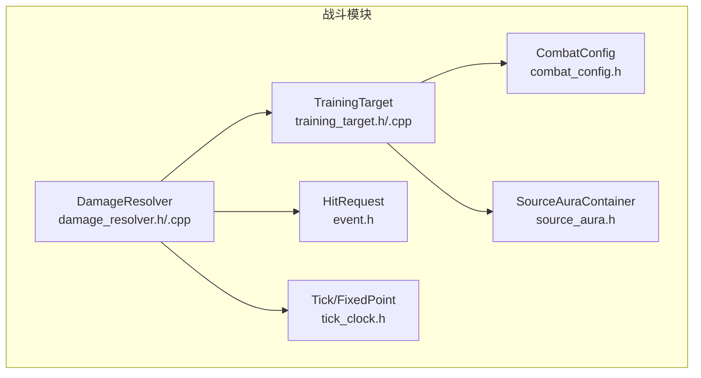
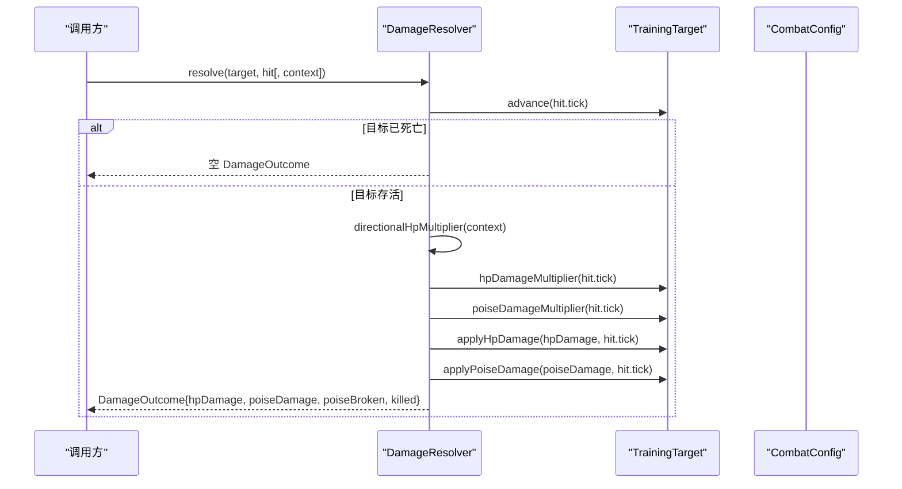
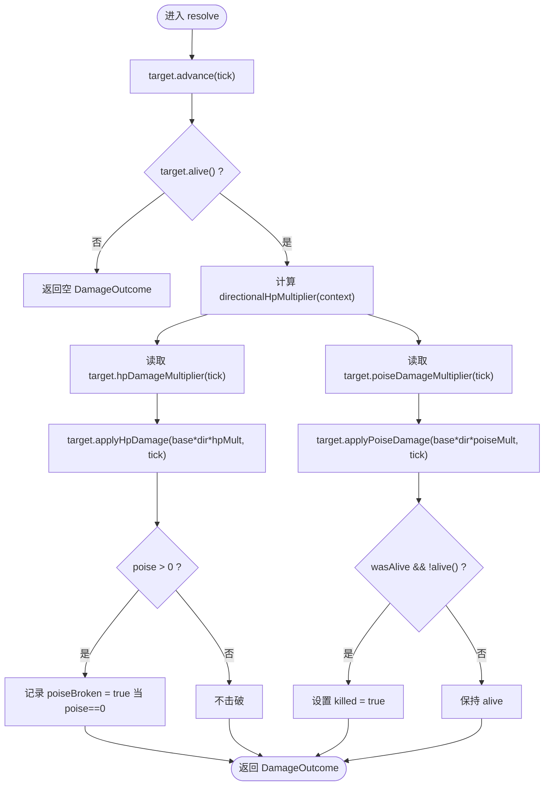
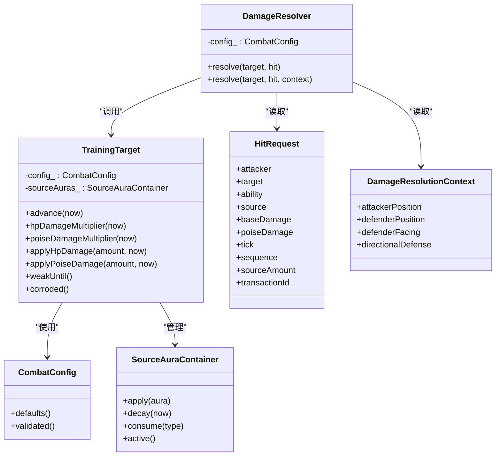

# 伤害计算系统

<cite>
**本文引用的文件**   
- [damage_resolver.h](file://native/gameplay/combat/damage_resolver.h)
- [damage_resolver.cpp](file://native/gameplay/combat/damage_resolver.cpp)
- [training_target.h](file://native/gameplay/combat/training_target.h)
- [training_target.cpp](file://native/gameplay/combat/training_target.cpp)
- [combat_config.h](file://native/gameplay/combat/combat_config.h)
- [event.h](file://native/gameplay/combat/event.h)
- [tick_clock.h](file://native/engine/core/tick_clock.h)
- [source_aura.h](file://native/gameplay/combat/source_aura.h)
- [test_damage_resolver.cpp](file://tests/test_damage_resolver.cpp)
</cite>

## 目录
1. [简介](#简介)
2. [项目结构](#项目结构)
3. [核心组件](#核心组件)
4. [架构总览](#架构总览)
5. [详细组件分析](#详细组件分析)
6. [依赖关系分析](#依赖关系分析)
7. [性能考量](#性能考量)
8. [故障排查指南](#故障排查指南)
9. [结论](#结论)
10. [附录：平衡性调整与自定义公式](#附录：平衡性调整与自定义公式)

## 简介
本文件围绕 DamageResolver 类及其相关数据结构，系统化阐述伤害计算的算法与流程。内容涵盖：
- 基础伤害、属性加成、护盾/方向防御、弱点/僵直等状态对最终伤害的影响
- HitRequest 命中请求的结构与语义
- DamageOutcome 伤害结果的生成过程
- DamageResolutionContext 解析上下文字段含义（攻击者/防御者位置、朝向、方向防御配置）
- 不同伤害类型的处理差异（物理/元素/真实伤害在当前实现中的抽象方式）
- 从攻击发起、命中检测到最终伤害数值的完整流程示例
- 平衡性调整与自定义伤害公式的方法

## 项目结构
伤害计算系统位于 native/gameplay/combat 目录下，核心由以下文件组成：
- damage_resolver.h/.cpp：DamageResolver 类与伤害解析主逻辑
- training_target.h/.cpp：训练目标的状态与受击应用
- combat_config.h：战斗全局配置（含训练目标、弱点击破、源光环等）
- event.h：HitRequest 定义
- tick_clock.h：时间 Tick 与定点数 FixedPoint 类型定义
- source_aura.h：源光环容器（用于腐蚀等状态）
- tests/test_damage_resolver.cpp：单元测试，覆盖基本伤害、击破、死亡重置等场景

图表来源
- [damage_resolver.h:28-37](file://native/gameplay/combat/damage_resolver.h#L28-L37)
- [damage_resolver.cpp:40-64](file://native/gameplay/combat/damage_resolver.cpp#L40-L64)
- [training_target.h:6-43](file://native/gameplay/combat/training_target.h#L6-L43)
- [training_target.cpp:15-88](file://native/gameplay/combat/training_target.cpp#L15-L88)
- [combat_config.h:9-56](file://native/gameplay/combat/combat_config.h#L9-L56)
- [event.h:16-27](file://native/gameplay/combat/event.h#L16-L27)
- [tick_clock.h:2-6](file://native/engine/core/tick_clock.h#L2-L6)
- [source_aura.h:3-10](file://native/gameplay/combat/source_aura.h#L3-L10)

章节来源
- [damage_resolver.h:1-38](file://native/gameplay/combat/damage_resolver.h#L1-L38)
- [damage_resolver.cpp:1-65](file://native/gameplay/combat/damage_resolver.cpp#L1-L65)
- [training_target.h:1-44](file://native/gameplay/combat/training_target.h#L1-L44)
- [training_target.cpp:1-88](file://native/gameplay/combat/training_target.cpp#L1-L88)
- [combat_config.h:1-153](file://native/gameplay/combat/combat_config.h#L1-L153)
- [event.h:16-27](file://native/gameplay/combat/event.h#L16-L27)
- [tick_clock.h:1-7](file://native/engine/core/tick_clock.h#L1-L7)
- [source_aura.h:1-11](file://native/gameplay/combat/source_aura.h#L1-L11)

## 核心组件
- DamageResolver：接收 TrainingTarget 与 HitRequest，结合可选的 DamageResolutionContext 计算并返回 DamageOutcome。内部使用定点数乘法与方向防御乘区。
- TrainingTarget：维护 HP、架势（Poise）、弱点/僵直/腐蚀等状态，提供 hpDamageMultiplier/poiseDamageMultiplier 以及 applyHpDamage/applyPoiseDamage 等方法。
- CombatConfig：集中管理战斗数值与行为参数，包括训练目标初始值、弱点击破倍率、僵直倍率、死亡重置时长等。
- HitRequest：描述一次命中请求，包含攻击者/目标 ID、技能/来源、基础伤害、架势伤害、时间戳、序列号等。
- DamageResolutionContext：描述解析时的空间与环境信息，如攻击者与防御者位置、防御者朝向、方向防御配置。
- SourceAuraContainer：管理源光环（如腐蚀），影响目标状态。

章节来源
- [damage_resolver.h:9-37](file://native/gameplay/combat/damage_resolver.h#L9-L37)
- [training_target.h:6-43](file://native/gameplay/combat/training_target.h#L6-L43)
- [combat_config.h:9-56](file://native/gameplay/combat/combat_config.h#L9-L56)
- [event.h:16-27](file://native/gameplay/combat/event.h#L16-L27)
- [source_aura.h:3-10](file://native/gameplay/combat/source_aura.h#L3-L10)

## 架构总览
DamageResolver 是伤害计算的核心入口，其调用链如下：
- 输入：TrainingTarget、HitRequest、可选 DamageResolutionContext
- 步骤：
  1) 推进目标时间状态（advance）
  2) 若目标已死亡则直接返回空结果
  3) 计算方向防御乘区（directionalHpMultiplier）
  4) 应用目标 HP 倍率（hpDamageMultiplier）与架势倍率（poiseDamageMultiplier）
  5) 通过 applyHpDamage/applyPoiseDamage 实际扣减并记录是否击破/击杀
- 输出：DamageOutcome（HP 伤害、架势伤害、是否击破、是否击杀）

图表来源
- [damage_resolver.cpp:40-64](file://native/gameplay/combat/damage_resolver.cpp#L40-L64)
- [training_target.cpp:15-88](file://native/gameplay/combat/training_target.cpp#L15-L88)
- [combat_config.h:9-56](file://native/gameplay/combat/combat_config.h#L9-L56)

## 详细组件分析

### DamageResolver 类与伤害解析流程
- 构造函数接受 CombatConfig，并在内部进行 validated() 校验，确保数值安全。
- resolve 重载支持无上下文与带上下文两种调用方式；带上下文时可使用方向防御乘区。
- 内部定点数乘法 multiply 使用 __int128 中间类型避免溢出，再除以 FP_ONE 还原精度。
- 方向防御乘区基于点积判断攻击方向是否在“正面”阈值内，满足条件时使用 frontalHpDamageMultiplier，否则为 1.0。

图表来源
- [damage_resolver.cpp:5-36](file://native/gameplay/combat/damage_resolver.cpp#L5-L36)
- [damage_resolver.cpp:40-64](file://native/gameplay/combat/damage_resolver.cpp#L40-L64)
- [training_target.cpp:58-74](file://native/gameplay/combat/training_target.cpp#L58-L74)

章节来源
- [damage_resolver.h:28-37](file://native/gameplay/combat/damage_resolver.h#L28-L37)
- [damage_resolver.cpp:1-65](file://native/gameplay/combat/damage_resolver.cpp#L1-L65)

### HitRequest 命中请求结构
- attacker/target：攻击者与目标实体 ID
- ability：技能标识
- source：可选的来源类型（如源光环类型）
- baseDamage/poiseDamage：基础伤害与架势伤害
- tick：命中时间戳
- sequence：动作序列号，用于排序或去重
- sourceAmount：来源倍率（在部分测试中可见）
- transactionId：事务 ID（用于一致性）

章节来源
- [event.h:16-27](file://native/gameplay/combat/event.h#L16-L27)

### DamageOutcome 伤害结果结构
- hpDamage：实际造成的生命值伤害
- poiseDamage：实际造成的架势伤害
- poiseBroken：本次是否导致架势被击破
- killed：本次是否导致目标死亡

章节来源
- [damage_resolver.h:9-14](file://native/gameplay/combat/damage_resolver.h#L9-L14)

### DamageResolutionContext 解析上下文
- attackerPosition/defenderPosition：攻击者与防御者二维位置
- defenderFacing：防御者朝向向量（单位化参与点积）
- directionalDefense：可选的方向防御配置
  - frontalHpDamageMultiplier：正面伤害倍率（范围限制与有效性检查）
  - minimumFrontDot：最小正面点积阈值（[-1,1]）

章节来源
- [damage_resolver.h:16-26](file://native/gameplay/combat/damage_resolver.h#L16-L26)

### TrainingTarget 状态与倍率
- 状态字段：HP、Poise、reactionWeakUntil、breakUntil、stagnationUntil、corrosionUntil、deathResetAt
- 倍率方法：
  - hpDamageMultiplier(now)：根据反应弱点与击破状态取最大值倍率
  - poiseDamageMultiplier(now)：僵直期间提升架势伤害倍率
- 应用方法：
  - applyHpDamage(amount, now)：扣减 HP，死亡时设置死亡重置时间
  - applyPoiseDamage(amount, now)：扣减 Poise，归零时设置击破持续时间
- 其他：
  - weakUntil(now)：综合反应弱点与击破的结束时间
  - corroded()：是否存在腐蚀光环
  - applyWeakness/applyStagnation/applyCorrosion：施加状态

章节来源
- [training_target.h:6-43](file://native/gameplay/combat/training_target.h#L6-L43)
- [training_target.cpp:15-88](file://native/gameplay/combat/training_target.cpp#L15-L88)

### CombatConfig 关键参数
- 训练目标：初始 HP/Poise、击破持续时间、击破伤害倍率、死亡重置时长
- 弱点与僵直：弱点击破伤害倍率、僵直架势倍率
- 源光环：持续时间、腐蚀状态
- 其他战斗参数（连击、闪避、洞察、共鸣等）

章节来源
- [combat_config.h:9-56](file://native/gameplay/combat/combat_config.h#L9-L56)

### 定点数与时间类型
- Tick：int64_t，表示毫秒级时间戳
- FixedPoint：int64_t，定点数，1.0 == 1<<16，fp(double) 辅助转换
- 定点乘法：multiply(value, multiplier) 使用 __int128 中间类型避免溢出

章节来源
- [tick_clock.h:2-6](file://native/engine/core/tick_clock.h#L2-L6)
- [damage_resolver.cpp:5-8](file://native/gameplay/combat/damage_resolver.cpp#L5-L8)

## 依赖关系分析
- DamageResolver 依赖：
  - TrainingTarget：状态更新与伤害应用
  - HitRequest：伤害输入
  - DamageResolutionContext：方向防御与环境信息
  - CombatConfig：初始化与校验
  - FixedPoint/Tick：数值与时间类型
- TrainingTarget 依赖：
  - CombatConfig：默认值与倍率参数
  - SourceAuraContainer：腐蚀等光环状态

图表来源
- [damage_resolver.h:28-37](file://native/gameplay/combat/damage_resolver.h#L28-L37)
- [training_target.h:6-43](file://native/gameplay/combat/training_target.h#L6-L43)
- [combat_config.h:9-56](file://native/gameplay/combat/combat_config.h#L9-L56)
- [event.h:16-27](file://native/gameplay/combat/event.h#L16-L27)
- [source_aura.h:3-10](file://native/gameplay/combat/source_aura.h#L3-L10)

章节来源
- [damage_resolver.h:1-38](file://native/gameplay/combat/damage_resolver.h#L1-L38)
- [training_target.h:1-44](file://native/gameplay/combat/training_target.h#L1-L44)
- [combat_config.h:1-153](file://native/gameplay/combat/combat_config.h#L1-L153)
- [event.h:16-27](file://native/gameplay/combat/event.h#L16-L27)
- [source_aura.h:1-11](file://native/gameplay/combat/source_aura.h#L1-L11)

## 性能考量
- 定点数运算：使用 __int128 中间类型保证乘法精度与安全性，避免浮点误差与溢出。
- 方向防御计算：仅涉及向量差、长度与点积，复杂度 O(1)，且存在大量快速失败路径（非法值、非有限值）。
- 目标状态推进：advance 操作为常数时间，衰减与状态清理按阈值比较。
- 倍率查询：hpDamageMultiplier/poiseDamageMultiplier 为简单分支判断，O(1)。
- 建议：
  - 批量处理多个命中请求时，复用 DamageResolver 实例以减少构造开销
  - 避免频繁创建临时向量对象，尽量使用栈上变量
  - 在高频路径中缓存方向防御配置（若稳定）

[本节为通用指导，无需特定文件引用]

## 故障排查指南
- 常见问题定位：
  - 结果为空：目标已死亡或未存活，检查 target.alive() 与 deathResetAt
  - 方向防御无效：检查 DirectionalDefenseProfile 的取值范围与 finite 校验
  - 未触发击破：确认 poiseDamage 是否足够，以及 stagnation 是否生效
  - 死亡后未重置：检查 deathResetAt 是否到达当前 tick
- 调试建议：
  - 打印 HitRequest 各字段与 DamageOutcome
  - 验证 CombatConfig.validated() 返回值是否符合预期
  - 检查 TrainingTarget 的状态时间线（weakUntil/breakUntil/stagnationUntil/corrosionUntil）

章节来源
- [damage_resolver.cpp:10-36](file://native/gameplay/combat/damage_resolver.cpp#L10-L36)
- [training_target.cpp:15-32](file://native/gameplay/combat/training_target.cpp#L15-L32)
- [combat_config.h:58-134](file://native/gameplay/combat/combat_config.h#L58-L134)

## 结论
DamageResolver 以简洁清晰的流程完成伤害计算：先推进目标状态，再依据方向防御与目标倍率计算最终伤害，并通过 TrainingTarget 的应用方法更新状态与结果标志。该设计将数值计算与状态管理解耦，便于扩展与调优。

[本节为总结，无需特定文件引用]

## 附录：平衡性调整与自定义公式

### 平衡性调整要点
- 基础伤害与架势伤害：通过 HitRequest.baseDamage/poiseDamage 控制
- 方向防御：调整 DirectionalDefenseProfile.frontalHpDamageMultiplier 与 minimumFrontDot
- 弱点与击破：调整 CombatConfig.weakDamageMultiplier、trainingBreakDamageMultiplier
- 僵直：调整 stagnationPoiseMultiplier
- 死亡重置：调整 trainingDeathResetMs

章节来源
- [combat_config.h:30-56](file://native/gameplay/combat/combat_config.h#L30-L56)
- [damage_resolver.h:16-26](file://native/gameplay/combat/damage_resolver.h#L16-L26)

### 自定义伤害公式扩展建议
- 新增伤害类型（物理/元素/真实）：
  - 在 HitRequest 中增加 type 字段，或在 resolve 前对 baseDamage/poiseDamage 做预处理
  - 在 DamageResolver::resolve 中根据类型选择不同乘区（例如元素抗性、真实伤害无视防御）
- 引入抗性与穿透：
  - 在 TrainingTarget 中增加抗性与穿透字段，修改 hpDamageMultiplier/poiseDamageMultiplier 的计算
- 环境因素：
  - 扩展 DamageResolutionContext，加入地形、天气等环境变量，影响倍率或附加效果

[本节为概念性扩展建议，不直接映射到现有代码结构]

### 完整计算示例（从攻击到结果）
- 输入：
  - HitRequest：baseDamage=8, poiseDamage=4, tick=0
  - TrainingTarget：默认 HP=300, Poise=100
  - DamageResolutionContext：无方向防御
- 步骤：
  1) target.advance(0)
  2) 方向防御乘区=1.0（无配置）
  3) hpDamageMultiplier=1.0（无弱点/击破）
  4) poiseDamageMultiplier=1.0（无僵直）
  5) applyHpDamage(8*1.0*1.0)=8 → HP 剩余 292
  6) applyPoiseDamage(4*1.0*1.0)=4 → Poise 剩余 96
  7) 未击破、未击杀
- 输出：
  - DamageOutcome：hpDamage=8, poiseDamage=4, poiseBroken=false, killed=false

章节来源
- [test_damage_resolver.cpp:15-31](file://tests/test_damage_resolver.cpp#L15-L31)
- [training_target.cpp:58-74](file://native/gameplay/combat/training_target.cpp#L58-L74)