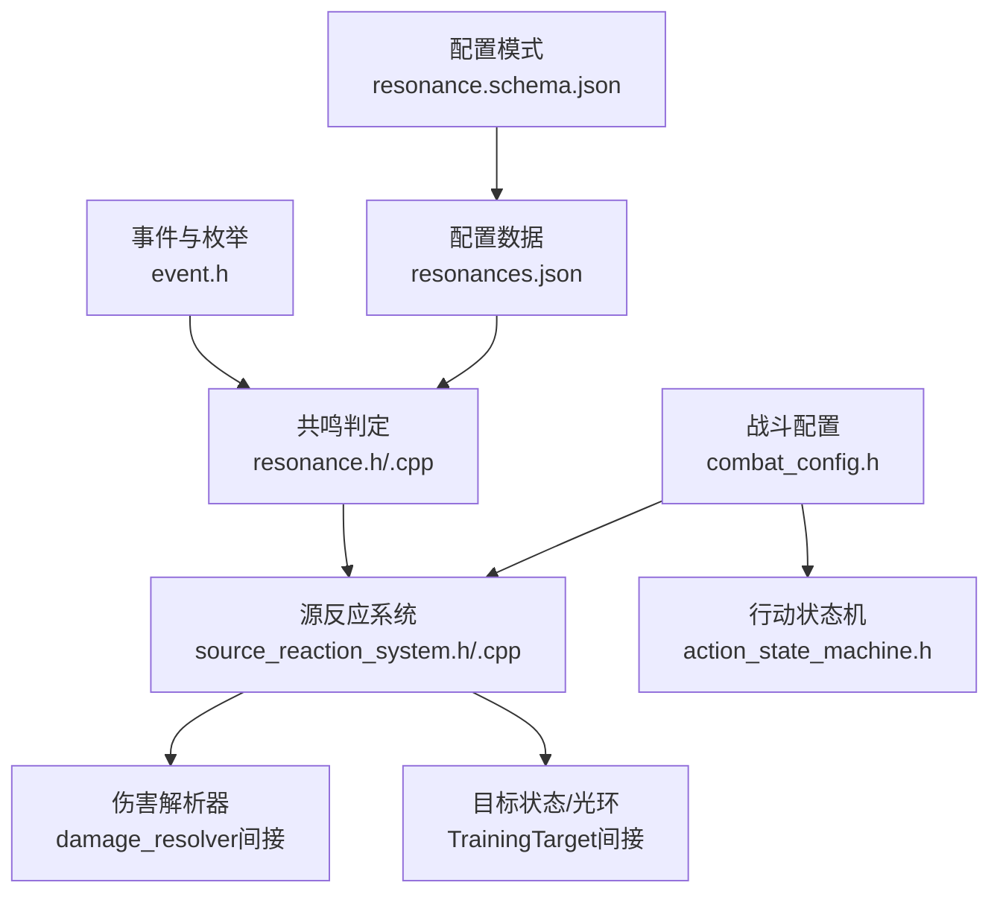
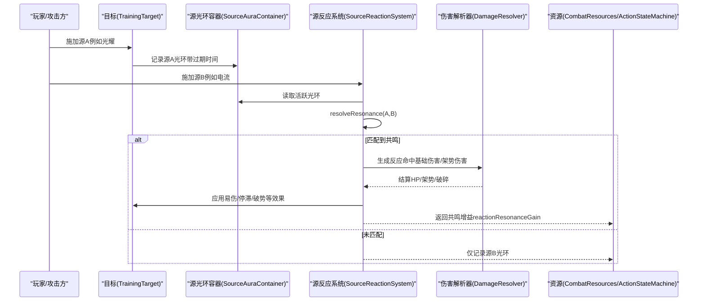
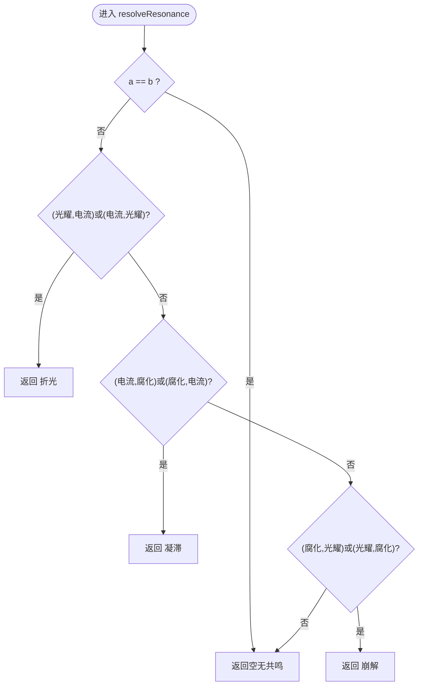
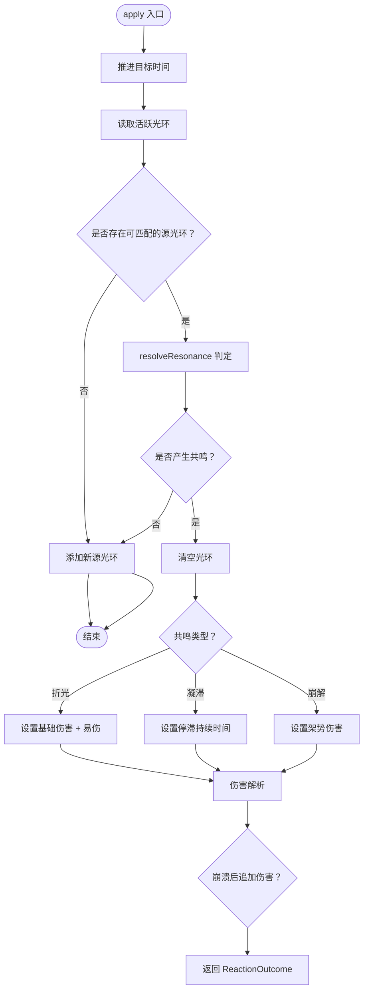
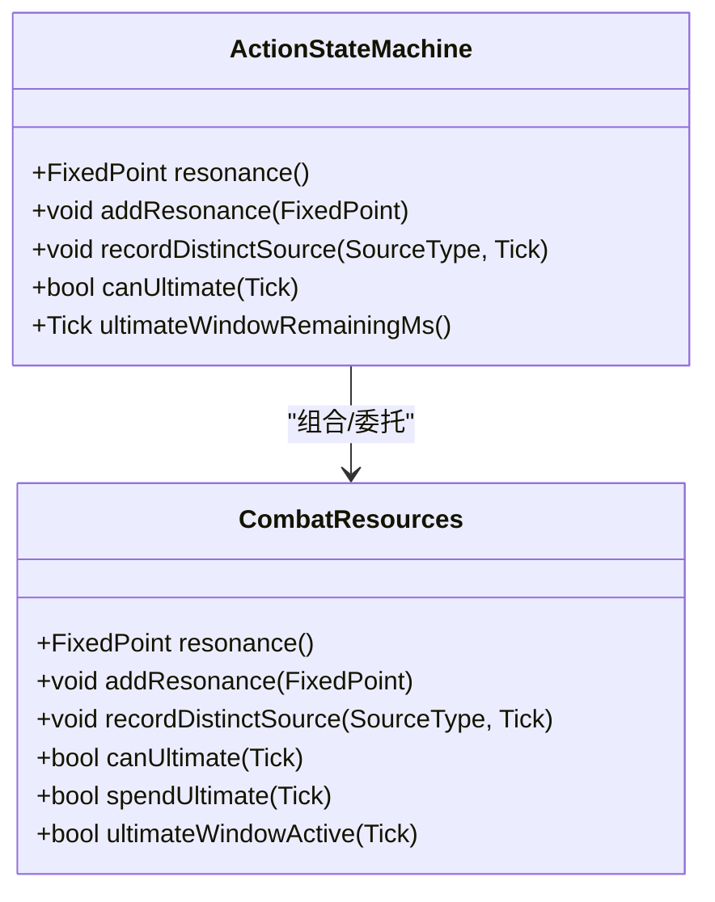
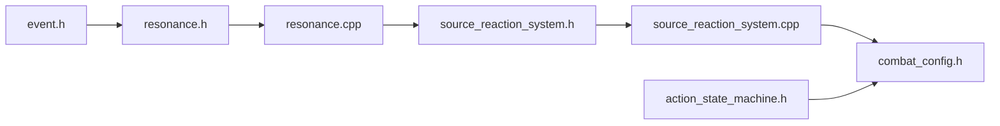

# 共鸣系统

<cite>
**本文引用的文件**   
- [resonance.h](file://native/gameplay/combat/resonance.h)
- [resonance.cpp](file://native/gameplay/combat/resonance.cpp)
- [event.h](file://native/gameplay/combat/event.h)
- [source_reaction_system.h](file://native/gameplay/combat/source_reaction_system.h)
- [source_reaction_system.cpp](file://native/gameplay/combat/source_reaction_system.cpp)
- [combat_config.h](file://native/gameplay/combat/combat_config.h)
- [action_state_machine.h](file://native/gameplay/combat/action_state_machine.h)
- [resonances.json](file://config/dev/resonances.json)
- [resonance.schema.json](file://config/schema/resonance.schema.json)
- [test_resonance.cpp](file://tests/test_resonance.cpp)
- [test_resonance_window.cpp](file://tests/test_resonance_window.cpp)
</cite>

## 目录
1. [简介](#简介)
2. [项目结构](#项目结构)
3. [核心组件](#核心组件)
4. [架构总览](#架构总览)
5. [详细组件分析](#详细组件分析)
6. [依赖关系分析](#依赖关系分析)
7. [性能考量](#性能考量)
8. [故障排查指南](#故障排查指南)
9. [结论](#结论)
10. [附录](#附录)

## 简介
本文件为 Resonance（共鸣）系统的完整技术文档，聚焦以下目标：
- 解释共鸣能量的积累、消耗与效果触发机制
- 说明共鸣等级、共鸣值与共鸣技能的关系
- 记录共鸣状态管理：激活、持续时间与衰减
- 阐述共鸣与战斗属性的关联：攻击力加成、防御力提升、技能效果增强
- 提供从能量积累到技能释放的完整使用示例
- 给出共鸣效果的配置方法与扩展新共鸣类型的步骤

## 项目结构
与共鸣系统直接相关的代码与配置分布如下：
- 核心类型与判定：resonance.h/cpp、event.h
- 反应系统与伤害结算：source_reaction_system.h/cpp、damage_resolver（通过头文件间接引用）
- 资源与状态：action_state_machine.h（对外暴露共鸣相关接口）、combat_config.h（全部数值配置）
- 配置数据与校验：config/dev/resonances.json、config/schema/resonance.schema.json
- 测试用例：tests/test_resonance.cpp、tests/test_resonance_window.cpp

图表来源
- [event.h:1-96](file://native/gameplay/combat/event.h#L1-L96)
- [resonance.h:1-5](file://native/gameplay/combat/resonance.h#L1-L5)
- [resonance.cpp:1-12](file://native/gameplay/combat/resonance.cpp#L1-L12)
- [source_reaction_system.h:1-28](file://native/gameplay/combat/source_reaction_system.h#L1-L28)
- [source_reaction_system.cpp:1-68](file://native/gameplay/combat/source_reaction_system.cpp#L1-L68)
- [combat_config.h:1-153](file://native/gameplay/combat/combat_config.h#L1-L153)
- [action_state_machine.h:24-55](file://native/gameplay/combat/action_state_machine.h#L24-L55)
- [resonances.json:1-5](file://config/dev/resonances.json#L1-L5)
- [resonance.schema.json:1-5](file://config/schema/resonance.schema.json#L1-L5)

章节来源
- [event.h:1-96](file://native/gameplay/combat/event.h#L1-L96)
- [resonance.h:1-5](file://native/gameplay/combat/resonance.h#L1-L5)
- [resonance.cpp:1-12](file://native/gameplay/combat/resonance.cpp#L1-L12)
- [source_reaction_system.h:1-28](file://native/gameplay/combat/source_reaction_system.h#L1-L28)
- [source_reaction_system.cpp:1-68](file://native/gameplay/combat/source_reaction_system.cpp#L1-L68)
- [combat_config.h:1-153](file://native/gameplay/combat/combat_config.h#L1-L153)
- [action_state_machine.h:24-55](file://native/gameplay/combat/action_state_machine.h#L24-L55)
- [resonances.json:1-5](file://config/dev/resonances.json#L1-L5)
- [resonance.schema.json:1-5](file://config/schema/resonance.schema.json#L1-L5)

## 核心组件
- 事件与类型定义（event.h）
  - SourceType：三种源类型（光耀、电流、腐化）
  - ResonanceType：四种共鸣类型（折光、凝滞、崩解、共鸣爆发）
  - SourceAura：目标身上的源光环（类型、量、过期时间、施加者）
  - HitRequest/CombatResult：命中请求与结果，包含共鸣类型字段
- 共鸣判定（resonance.h/.cpp）
  - resolveResonance(a, b)：根据两个源类型返回对应的共鸣类型或无
- 源反应系统（source_reaction_system.h/.cpp）
  - apply(target, source, amount, now, applier)：将源作用于目标，检测是否产生共鸣并结算效果
  - 产出 ReactionOutcome：包含共鸣类型、HP/架势伤害、共鸣增益、架势是否破碎
- 战斗配置（combat_config.h）
  - 控制共鸣增益、窗口时长、伤害倍率、持续时间和阈值等关键数值
- 行动状态机（action_state_machine.h）
  - 对外暴露共鸣值查询、累计、三源窗口与终极技能可用性接口

章节来源
- [event.h:1-96](file://native/gameplay/combat/event.h#L1-L96)
- [resonance.h:1-5](file://native/gameplay/combat/resonance.h#L1-L5)
- [resonance.cpp:1-12](file://native/gameplay/combat/resonance.cpp#L1-L12)
- [source_reaction_system.h:1-28](file://native/gameplay/combat/source_reaction_system.h#L1-L28)
- [source_reaction_system.cpp:1-68](file://native/gameplay/combat/source_reaction_system.cpp#L1-L68)
- [combat_config.h:1-153](file://native/gameplay/combat/combat_config.h#L1-L153)
- [action_state_machine.h:24-55](file://native/gameplay/combat/action_state_machine.h#L24-L55)

## 架构总览
共鸣系统围绕“源光环 + 反应判定 + 伤害/状态效果”展开。源攻击在目标上留下光环；当新的源与已有光环组合满足规则时，触发对应共鸣，产生伤害、易伤、停滞、破势等效果，同时为施法者增加共鸣能量。

图表来源
- [source_reaction_system.cpp:12-67](file://native/gameplay/combat/source_reaction_system.cpp#L12-L67)
- [resonance.cpp:2-11](file://native/gameplay/combat/resonance.cpp#L2-L11)
- [event.h:9-14](file://native/gameplay/combat/event.h#L9-L14)

## 详细组件分析

### 共鸣判定模块（resolveResonance）
- 输入：两个源类型 a、b
- 输出：可选的共鸣类型（相同源不产生共鸣）
- 规则：
  - 光耀+电流 → 折光
  - 电流+腐化 → 凝滞
  - 腐化+光耀 → 崩解
- 复杂度：O(1)，固定分支判断

图表来源
- [resonance.cpp:2-11](file://native/gameplay/combat/resonance.cpp#L2-L11)

章节来源
- [resonance.h:1-5](file://native/gameplay/combat/resonance.h#L1-L5)
- [resonance.cpp:1-12](file://native/gameplay/combat/resonance.cpp#L1-L12)
- [test_resonance.cpp:1-13](file://tests/test_resonance.cpp#L1-L13)

### 源反应系统（SourceReactionSystem）
- 职责：
  - 推进目标时间，读取活跃光环
  - 按优先级顺序尝试与当前源产生共鸣
  - 若产生共鸣：清空光环、计算反应伤害/效果、附加易伤/停滞/破势、返回共鸣增益
  - 若无共鸣：仅追加新源的光环
- 关键流程：
  - 优先级：光耀 > 电流 > 腐化
  - 折光：造成固定伤害，并为目标施加易伤（伤害倍率）
  - 凝滞：为目标施加停滞（持续一段时间）
  - 崩解：造成架势伤害，若导致架势破碎则追加额外HP伤害
  - 所有反应均返回 reactionResonanceGain 作为共鸣能量

图表来源
- [source_reaction_system.cpp:12-67](file://native/gameplay/combat/source_reaction_system.cpp#L12-L67)

章节来源
- [source_reaction_system.h:1-28](file://native/gameplay/combat/source_reaction_system.h#L1-L28)
- [source_reaction_system.cpp:1-68](file://native/gameplay/combat/source_reaction_system.cpp#L1-L68)

### 资源与状态（CombatResources / ActionStateMachine）
- 共鸣值与等级：
  - addResonance(amount)：累加共鸣值，上限由 maxResonance 限制
  - resonance()：查询当前共鸣值
- 三源窗口与终极技能：
  - recordDistinctSource(source, tick)：记录不同源类型的时间戳
  - 若在 triSourceWindowMs 内集齐三种源，则共鸣值达到满值并开启 ultimateWindowMs 的终极窗口
  - canUltimate(tick)、ultimateWindowActive(tick)、spendUltimate(tick)：检查与消费终极技能
- 行动状态机对外接口：
  - resonance()/addResonance()/recordDistinctSource()/canUltimate() 等

图表来源
- [action_state_machine.h:24-55](file://native/gameplay/combat/action_state_machine.h#L24-L55)

章节来源
- [action_state_machine.h:24-55](file://native/gameplay/combat/action_state_machine.h#L24-L55)
- [test_resonance_window.cpp:1-145](file://tests/test_resonance_window.cpp#L1-L145)

### 配置与数据驱动
- 数值配置（combat_config.h）
  - 共鸣增益：sourceResonanceGain、reactionResonanceGain
  - 上限与窗口：maxResonance、triSourceWindowMs、ultimateWindowMs
  - 反应效果：refractionDamage、weakDurationMs、weakDamageMultiplier、stagnationDurationMs、disintegrationPoiseDamage、disintegrationBreakDamage
- 规则配置（resonances.json）
  - pairs 数组定义源对与结果映射（用于外部化配置）
- 模式校验（resonance.schema.json）
  - 约束 pairs 中每个条目必须包含 a、b、result 字段

章节来源
- [combat_config.h:1-153](file://native/gameplay/combat/combat_config.h#L1-L153)
- [resonances.json:1-5](file://config/dev/resonances.json#L1-L5)
- [resonance.schema.json:1-5](file://config/schema/resonance.schema.json#L1-L5)

## 依赖关系分析
- 低耦合设计：
  - 共鸣判定独立于反应系统，便于扩展新规则
  - 反应系统通过 DamageResolver 统一结算伤害，避免硬编码
  - 配置集中管理，便于调参与验证
- 关键依赖链：
  - event.h → resonance.h/.cpp → source_reaction_system.h/.cpp → combat_config.h
  - action_state_machine.h 通过资源接口与共鸣系统交互

图表来源
- [event.h:1-96](file://native/gameplay/combat/event.h#L1-L96)
- [resonance.h:1-5](file://native/gameplay/combat/resonance.h#L1-L5)
- [resonance.cpp:1-12](file://native/gameplay/combat/resonance.cpp#L1-L12)
- [source_reaction_system.h:1-28](file://native/gameplay/combat/source_reaction_system.h#L1-L28)
- [source_reaction_system.cpp:1-68](file://native/gameplay/combat/source_reaction_system.cpp#L1-L68)
- [combat_config.h:1-153](file://native/gameplay/combat/combat_config.h#L1-L153)
- [action_state_machine.h:24-55](file://native/gameplay/combat/action_state_machine.h#L24-L55)

## 性能考量
- 判定与循环：
  - resolveResonance 为 O(1) 分支判断
  - 反应系统遍历活跃光环，通常数量很小，开销可控
- 时间推进与过期：
  - 目标 advance(now) 与光环过期清理保证内存稳定
- 配置验证：
  - validated() 确保数值合法，避免运行时异常

[本节为通用指导，无需特定文件来源]

## 故障排查指南
- 常见现象与定位：
  - 未触发共鸣：检查目标是否有活跃光环、当前源是否与已有光环匹配
  - 共鸣值不增长：确认 reactionResonanceGain 是否正确返回并被累加
  - 终极技能不可用：检查 triSourceWindowMs 内是否集齐三种源，以及窗口是否已过期
- 调试建议：
  - 打印 ReactionOutcome.type 与 hp/poise 伤害
  - 检查 distinctSourceTicks 是否被正确更新与过期
  - 核对 config.validated() 后的实际数值

章节来源
- [source_reaction_system.cpp:12-67](file://native/gameplay/combat/source_reaction_system.cpp#L12-L67)
- [test_resonance_window.cpp:1-145](file://tests/test_resonance_window.cpp#L1-L145)

## 结论
共鸣系统以“源光环 + 反应判定 + 伤害/状态效果”为核心，配合集中式配置与严格校验，实现了可扩展、可平衡的战斗体验。通过三源窗口与终极技能机制，玩家在合理节奏下可获得显著的战斗收益。

[本节为总结性内容，无需特定文件来源]

## 附录

### 共鸣能量积累、消耗与效果触发机制
- 积累：
  - 普通源命中：sourceResonanceGain
  - 共鸣反应：reactionResonanceGain
  - 三源窗口：在 triSourceWindowMs 内集齐三种源，共鸣值达上限并开启终极窗口
- 消耗：
  - 终极技能：在窗口期内消费，成功命中后清零共鸣值
- 效果触发：
  - 折光：固定伤害 + 易伤（伤害倍率）
  - 凝滞：停滞（持续）
  - 崩解：架势伤害，若破碎则追加HP伤害

章节来源
- [combat_config.h:1-153](file://native/gameplay/combat/combat_config.h#L1-L153)
- [source_reaction_system.cpp:12-67](file://native/gameplay/combat/source_reaction_system.cpp#L12-L67)
- [test_resonance_window.cpp:1-145](file://tests/test_resonance_window.cpp#L1-L145)

### 共鸣等级、共鸣值与共鸣技能的关系
- 共鸣值：累积至 maxResonance 即满级
- 等级体现：满级后开启终极窗口，允许释放终极技能
- 技能消耗：成功命中后清零，需重新积累

章节来源
- [action_state_machine.h:24-55](file://native/gameplay/combat/action_state_machine.h#L24-L55)
- [combat_config.h:1-153](file://native/gameplay/combat/combat_config.h#L1-L153)

### 共鸣状态管理（激活、持续时间、衰减）
- 激活：源命中时在目标上创建 SourceAura（含过期时间）
- 持续时间：由 sourceAuraDurationMs 控制
- 衰减：advance(now) 时清理过期光环

章节来源
- [source_reaction_system.cpp:12-67](file://native/gameplay/combat/source_reaction_system.cpp#L12-L67)
- [event.h:9-14](file://native/gameplay/combat/event.h#L9-L14)

### 与战斗属性的关联
- 攻击力加成：折光施加易伤（weakDamageMultiplier）
- 防御力提升：凝滞影响对手动作（停滞），间接降低其输出能力
- 技能效果增强：崩解在架势破碎时追加HP伤害

章节来源
- [combat_config.h:1-153](file://native/gameplay/combat/combat_config.h#L1-L153)
- [source_reaction_system.cpp:12-67](file://native/gameplay/combat/source_reaction_system.cpp#L12-L67)

### 完整使用示例（从能量积累到技能释放）
- 步骤：
  1) 对目标施加光耀源，记录光环
  2) 再施加电流源，触发折光共鸣，获得 reactionResonanceGain
  3) 继续施加其他源，在 triSourceWindowMs 内集齐三种源，共鸣值满并开启终极窗口
  4) 在窗口期内发起终极技能，命中后共鸣值清零
- 参考测试：
  - 反应与积累：见 test_resonance_window.cpp 中的 NormalAndReactionResonanceAccumulate
  - 三源边界与过期：见 TriSourceBoundaryAndExpiredHistory
  - 窗口过期保持满能量：见 WindowExpirationKeepsFullEnergy
  - 终极技能原子拒绝与命中消费：见 UltimateRejectsAtomicallyAndConsumesOnHit

章节来源
- [test_resonance_window.cpp:1-145](file://tests/test_resonance_window.cpp#L1-L145)

### 配置方法与扩展新共鸣类型
- 数值配置：
  - 修改 combat_config.h 中的增益、窗口、伤害与倍率等参数
- 规则配置：
  - 在 resonances.json 中添加新的 pairs 映射（需符合 schema）
  - 在 resolveResonance 中实现新规则的判定逻辑
- 校验：
  - 使用 resonance.schema.json 进行配置合法性校验

章节来源
- [combat_config.h:1-153](file://native/gameplay/combat/combat_config.h#L1-L153)
- [resonances.json:1-5](file://config/dev/resonances.json#L1-L5)
- [resonance.schema.json:1-5](file://config/schema/resonance.schema.json#L1-L5)
- [resonance.cpp:2-11](file://native/gameplay/combat/resonance.cpp#L2-L11)