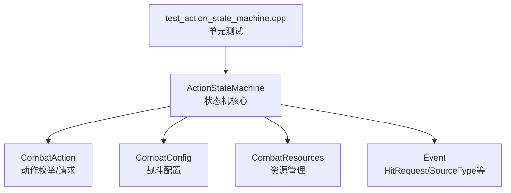
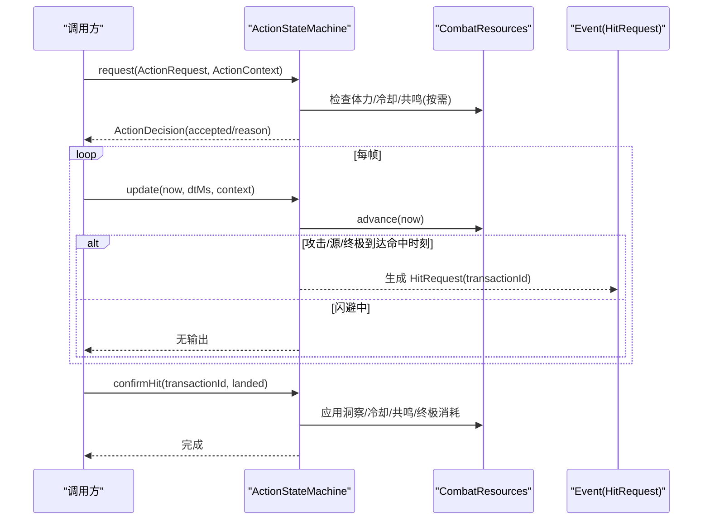
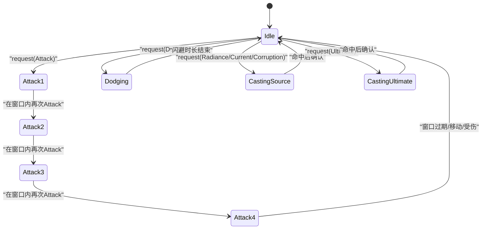
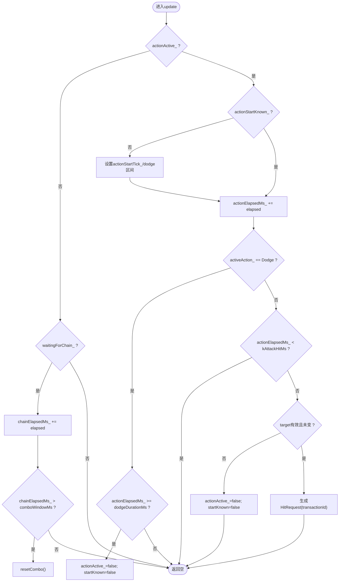
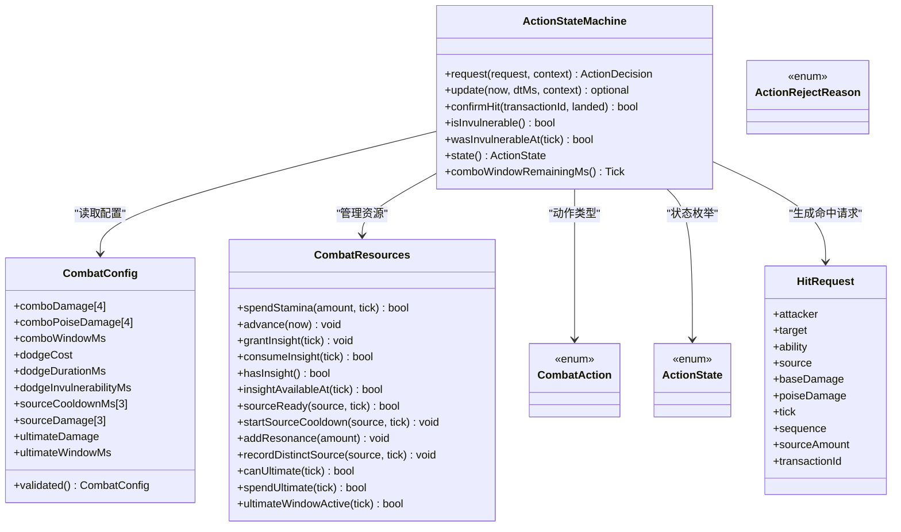

# 动作状态机

<cite>
**本文引用的文件**   
- [action_state_machine.h](file://native/gameplay/combat/action_state_machine.h)
- [action_state_machine.cpp](file://native/gameplay/combat/action_state_machine.cpp)
- [combat_action.h](file://native/gameplay/combat/combat_action.h)
- [combat_config.h](file://native/gameplay/combat/combat_config.h)
- [combat_resources.h](file://native/gameplay/combat/combat_resources.h)
- [event.h](file://native/gameplay/combat/event.h)
- [test_action_state_machine.cpp](file://tests/test_action_state_machine.cpp)
</cite>

## 目录
1. [简介](#简介)
2. [项目结构](#项目结构)
3. [核心组件](#核心组件)
4. [架构总览](#架构总览)
5. [详细组件分析](#详细组件分析)
6. [依赖关系分析](#依赖关系分析)
7. [性能考量](#性能考量)
8. [故障排查指南](#故障排查指南)
9. [结论](#结论)
10. [附录](#附录)

## 简介
本文件围绕 ActionStateMachine 类，系统化阐述动作状态机的设计模式与实现原理。内容涵盖：
- 状态定义与转换规则
- 动作请求 ActionRequest 的结构与处理流程
- 上下文 ActionContext 的构建与使用
- 拒绝原因 ActionRejectReason 的含义与触发条件
- 动作序列验证逻辑（连击窗口、冷却时间、前置条件）
- 典型状态转换示例（Idle → Attack/Dodge/CastingSource/CastingUltimate）
- 扩展新动作类型的最佳实践

## 项目结构
ActionStateMachine 位于 native/gameplay/combat 模块，与战斗配置、资源管理、事件结构紧密协作。测试用例位于 tests 目录，用于覆盖关键行为边界。

图示来源
- [action_state_machine.h:24-90](file://native/gameplay/combat/action_state_machine.h#L24-L90)
- [combat_action.h:7-41](file://native/gameplay/combat/combat_action.h#L7-L41)
- [combat_config.h:9-56](file://native/gameplay/combat/combat_config.h#L9-L56)
- [combat_resources.h:9-51](file://native/gameplay/combat/combat_resources.h#L9-L51)
- [event.h:16-27](file://native/gameplay/combat/event.h#L16-L27)
- [test_action_state_machine.cpp:1-20](file://tests/test_action_state_machine.cpp#L1-L20)

章节来源
- [action_state_machine.h:24-90](file://native/gameplay/combat/action_state_machine.h#L24-L90)
- [combat_action.h:7-41](file://native/gameplay/combat/combat_action.h#L7-L41)
- [combat_config.h:9-56](file://native/gameplay/combat/combat_config.h#L9-L56)
- [combat_resources.h:9-51](file://native/gameplay/combat/combat_resources.h#L9-L51)
- [event.h:16-27](file://native/gameplay/combat/event.h#L16-L27)
- [test_action_state_machine.cpp:1-20](file://tests/test_action_state_machine.cpp#L1-L20)

## 核心组件
- ActionStateMachine：维护当前动作状态、连击计数、时间线、待结算命中事务，并驱动 HitRequest 生成与确认。
- CombatAction/ActionState/ActionRejectReason：动作类型、状态枚举与拒绝原因。
- ActionRequest/ActionContext：输入请求与运行时上下文。
- CombatConfig：所有数值与窗口参数，含校验逻辑。
- CombatResources：体力、洞察、源技能冷却、共鸣值、终极窗口等资源管理。
- Event：HitRequest、SourceType、AbilityId 等事件相关结构。

章节来源
- [action_state_machine.h:11-46](file://native/gameplay/combat/action_state_machine.h#L11-L46)
- [combat_action.h:7-41](file://native/gameplay/combat/combat_action.h#L7-L41)
- [combat_config.h:9-56](file://native/gameplay/combat/combat_config.h#L9-L56)
- [combat_resources.h:9-51](file://native/gameplay/combat/combat_resources.h#L9-L51)
- [event.h:16-27](file://native/gameplay/combat/event.h#L16-L27)

## 架构总览
ActionStateMachine 作为“请求-更新-确认”三阶段的核心控制器：
- request：接收 ActionRequest + ActionContext，执行前置校验（目标、锁定、资源、冷却），设置 activeAction_ 与计时状态。
- update：推进时间，计算连击窗口、攻击命中时刻、闪避无敌区间，产出 HitRequest 或返回空。
- confirmHit：根据 transactionId 确认命中结果，应用洞察消耗、源冷却、共鸣增益、终极消耗等副作用。

图示来源
- [action_state_machine.cpp:29-106](file://native/gameplay/combat/action_state_machine.cpp#L29-L106)
- [action_state_machine.cpp:108-220](file://native/gameplay/combat/action_state_machine.cpp#L108-L220)
- [action_state_machine.cpp:222-241](file://native/gameplay/combat/action_state_machine.cpp#L222-L241)
- [combat_resources.h:13-26](file://native/gameplay/combat/combat_resources.h#L13-L26)
- [event.h:16-27](file://native/gameplay/combat/event.h#L16-L27)

## 详细组件分析

### 状态定义与转换
- 状态枚举 ActionState：Idle、Attack1~Attack4、Dodging、CastingSource、CastingUltimate。
- 内部动作类型 CombatAction：Attack、Dodge、Radiance、Current、Corruption、Ultimate。
- 状态判定 state()：基于 actionActive_、waitingForChain_、activeAction_ 决定当前状态；连击段数映射到 Attack1~Attack4。

图示来源
- [combat_action.h:16-25](file://native/gameplay/combat/combat_action.h#L16-L25)
- [action_state_machine.cpp:309-320](file://native/gameplay/combat/action_state_machine.cpp#L309-L320)

章节来源
- [combat_action.h:7-25](file://native/gameplay/combat/combat_action.h#L7-L25)
- [action_state_machine.cpp:309-320](file://native/gameplay/combat/action_state_machine.cpp#L309-L320)

### 动作请求 ActionRequest 与上下文 ActionContext
- ActionRequest：包含动作类型与序列号 sequence，用于追踪一次完整动作链。
- ActionContext：描述攻击者/目标、目标存活、是否移动/受伤，影响连击重置与目标有效性校验。

章节来源
- [combat_action.h:38-41](file://native/gameplay/combat/combat_action.h#L38-L41)
- [action_state_machine.h:11-17](file://native/gameplay/combat/action_state_machine.h#L11-L17)

### 拒绝原因 ActionRejectReason
- None：通过
- NoTarget：非闪避动作且无目标
- TargetDead：非闪避动作且目标死亡
- Cooldown：源技能处于冷却
- InsufficientStamina：体力不足
- InsufficientResonance：共鸣不足
- ActionLocked：已有动作进行中或有待结算命中
- InvalidAction：非法动作或交易ID耗尽

章节来源
- [combat_action.h:27-36](file://native/gameplay/combat/combat_action.h#L27-L36)
- [action_state_machine.cpp:29-47](file://native/gameplay/combat/action_state_machine.cpp#L29-L47)

### 动作序列验证与连击窗口
- 连击段数：Attack1~Attack4，段数由 comboIndex_ 控制，每次成功 Attack 递增。
- 窗口限制：chainElapsedMs_ 累计自首次命中起的时间，超过 config_.comboWindowMs 则重置为 Attack1。
- 中断条件：context.moving 或 context.damageTaken（除非正在闪避）会立即重置连击。
- 固定命中时刻：kAttackHitMs=160ms，从 actionStartTick_ 计算 hitTick，支持 Tick 溢出饱和。

图示来源
- [action_state_machine.cpp:108-220](file://native/gameplay/combat/action_state_machine.cpp#L108-L220)
- [combat_config.h:10-12](file://native/gameplay/combat/combat_config.h#L10-L12)

章节来源
- [action_state_machine.cpp:108-220](file://native/gameplay/combat/action_state_machine.cpp#L108-L220)
- [combat_config.h:10-12](file://native/gameplay/combat/combat_config.h#L10-L12)

### 闪避与无敌区间
- 闪避消耗体力：config_.dodgeCost，失败时原子性拒绝（不扣体）。
- 无敌区间：dodgeInvulnerabilityMs，从 actionStartTick_ 开始，支持历史查询 wasInvulnerableAt(tick)。
- 移动/受伤不会取消闪避，确保防御窗口稳定。

章节来源
- [action_state_machine.cpp:49-78](file://native/gameplay/combat/action_state_machine.cpp#L49-L78)
- [action_state_machine.cpp:276-284](file://native/gameplay/combat/action_state_machine.cpp#L276-L284)
- [combat_config.h:14-21](file://native/gameplay/combat/combat_config.h#L14-L21)

### 源技能与终极
- 源技能（Radiance/Current/Corruption）：
  - 需要 sourceReady(sourceType(action), tick) 通过。
  - 命中时记录 distinctSource 并增加共鸣，若洞察可用则伤害与 amount 乘以 insightDamageMultiplier。
- 终极（Ultimate）：
  - 需要 canUltimate(tick) 通过。
  - 命中后消费共鸣（spendUltimate）。

章节来源
- [action_state_machine.cpp:54-60](file://native/gameplay/combat/action_state_machine.cpp#L54-L60)
- [action_state_machine.cpp:151-194](file://native/gameplay/combat/action_state_machine.cpp#L151-L194)
- [combat_resources.h:19-26](file://native/gameplay/combat/combat_resources.h#L19-L26)

### 命中确认与副作用
- confirmHit(transactionId, landed)：
  - 仅匹配 pendingHit_->transactionId 的事务。
  - 源技能命中：消耗洞察（如已应用）、启动冷却、增加共鸣、记录 distinctSource。
  - 终极命中：消费共鸣。
  - 普通攻击：无额外副作用。

章节来源
- [action_state_machine.cpp:222-241](file://native/gameplay/combat/action_state_machine.cpp#L222-L241)
- [event.h:16-27](file://native/gameplay/combat/event.h#L16-L27)

### 数据流与事务机制
- 每个可能产生副作用的动作（源/终极）都会分配唯一 transactionId，并在 confirmHit 时回写资源状态，保证一致性。
- 当 nextTransactionId_ 达到上限时，transactionIdsExhausted_ 置位，后续源/终极请求将被拒绝。

章节来源
- [action_state_machine.cpp:243-251](file://native/gameplay/combat/action_state_machine.cpp#L243-L251)
- [action_state_machine.cpp:44-47](file://native/gameplay/combat/action_state_machine.cpp#L44-L47)

### 时序与边界处理
- hitTickFrom(start)：start+160，防止 Tick 溢出。
- saturatingAdd：安全加法，避免 Tick 溢出。
- 大帧更新：单次 dtMs 可能跨越命中时刻，仍按固定 kAttackHitMs 计算 hitTick，剩余时间继续推进。

章节来源
- [action_state_machine.cpp:12-22](file://native/gameplay/combat/action_state_machine.cpp#L12-L22)
- [action_state_machine.cpp:140-142](file://native/gameplay/combat/action_state_machine.cpp#L140-L142)

## 依赖关系分析
ActionStateMachine 依赖以下组件：
- CombatAction：动作与状态枚举、请求结构。
- CombatConfig：所有数值与窗口参数，含 validated() 安全化。
- CombatResources：体力恢复、洞察窗口、源冷却、共鸣与终极窗口。
- Event：HitRequest、SourceType、AbilityId 等。

图示来源
- [action_state_machine.h:24-90](file://native/gameplay/combat/action_state_machine.h#L24-L90)
- [combat_config.h:9-56](file://native/gameplay/combat/combat_config.h#L9-L56)
- [combat_resources.h:9-51](file://native/gameplay/combat/combat_resources.h#L9-L51)
- [combat_action.h:7-41](file://native/gameplay/combat/combat_action.h#L7-L41)
- [event.h:16-27](file://native/gameplay/combat/event.h#L16-L27)

章节来源
- [action_state_machine.h:24-90](file://native/gameplay/combat/action_state_machine.h#L24-L90)
- [combat_config.h:9-56](file://native/gameplay/combat/combat_config.h#L9-L56)
- [combat_resources.h:9-51](file://native/gameplay/combat/combat_resources.h#L9-L51)
- [combat_action.h:7-41](file://native/gameplay/combat/combat_action.h#L7-L41)
- [event.h:16-27](file://native/gameplay/combat/event.h#L16-L27)

## 性能考量
- 固定命中时刻 kAttackHitMs=160ms，减少复杂调度开销。
- Tick 安全加法与饱和，避免溢出分支。
- 连击窗口以简单计数器与累计时间判断，O(1) 复杂度。
- 资源管理采用数组与可选时间戳，访问高效。
- 事务 ID 单调递增，避免哈希与锁竞争。

[本节为通用指导，无需引用具体文件]

## 故障排查指南
常见拒绝原因与定位要点：
- ActionLocked：检查是否已有动作进行中或 pendingHit_ 未确认。
- NoTarget/TargetDead：确认 ActionContext.target 与 targetAlive。
- InsufficientStamina：检查 stamina 与 dodgeCost。
- Cooldown：检查对应 SourceType 的冷却时间。
- InsufficientResonance：检查共鸣值与终极窗口。
- InvalidAction：检查动作类型合法性与 transactionIdsExhausted_。

调试建议：
- 打印 state() 与 activeAction_ 观察状态流转。
- 使用 wasInvulnerableAt(tick) 验证无敌区间。
- 确认 HitRequest.transactionId 与 confirmHit 匹配。

章节来源
- [combat_action.h:27-36](file://native/gameplay/combat/combat_action.h#L27-L36)
- [action_state_machine.cpp:29-47](file://native/gameplay/combat/action_state_machine.cpp#L29-L47)
- [action_state_machine.cpp:276-284](file://native/gameplay/combat/action_state_machine.cpp#L276-L284)

## 结论
ActionStateMachine 以简洁的状态机模型实现了稳定的动作序列、连击窗口、资源约束与命中确认机制。其设计强调确定性（固定命中时刻、安全 Tick 运算）、可观测性（state()/activeAction_）与可扩展性（新增动作类型只需扩展枚举与校验逻辑）。配合 CombatConfig 与 CombatResources，能够灵活调整战斗节奏与数值平衡。

[本节为总结，无需引用具体文件]

## 附录

### 典型状态转换示例
- Idle → Attack1：调用 request(Attack)，成功后进入 Attack1；160ms 后生成 HitRequest。
- Attack1 → Attack2：在 comboWindowMs 内再次 Attack，进入 Attack2。
- AttackN → Idle：窗口过期或移动/受伤，重置连击。
- Idle → Dodging：调用 request(Dodge)，进入 Dodging，持续 dodgeDurationMs，前 dodgeInvulnerabilityMs 无敌。
- Idle → CastingSource：调用 request(Radiance/Current/Corruption)，命中后确认并应用冷却与共鸣。
- Idle → CastingUltimate：调用 request(Ultimate)，命中后确认并消费共鸣。

章节来源
- [action_state_machine.cpp:92-106](file://native/gameplay/combat/action_state_machine.cpp#L92-L106)
- [action_state_machine.cpp:151-194](file://native/gameplay/combat/action_state_machine.cpp#L151-L194)
- [action_state_machine.cpp:309-320](file://native/gameplay/combat/action_state_machine.cpp#L309-L320)

### 扩展新动作类型的最佳实践
步骤：
1. 在 CombatAction 中添加新动作枚举值。
2. 如需归类为“源技能”，在 isSourceAction/sourceIndex/sourceType 中补充映射。
3. 在 request() 中补充前置校验（如资源、冷却、窗口）。
4. 在 update() 中补充命中时机与 HitRequest 字段（ability、damage、poiseDamage、source 等）。
5. 在 confirmHit() 中补充命中后的副作用（如资源消耗、增益、冷却）。
6. 在 state() 中补充状态映射（如新的 CastingXxx）。
7. 编写单元测试覆盖正常路径、边界条件与拒绝原因。

参考位置：
- 枚举定义：combat_action.h
- 动作分类与映射：action_state_machine.cpp 中的 isSourceAction/sourceIndex/sourceType
- 请求校验与状态设置：action_state_machine.cpp 中的 request()
- 命中生成与窗口处理：action_state_machine.cpp 中的 update()
- 命中确认与副作用：action_state_machine.cpp 中的 confirmHit()
- 状态映射：action_state_machine.cpp 中的 state()

章节来源
- [combat_action.h:7-14](file://native/gameplay/combat/combat_action.h#L7-L14)
- [action_state_machine.cpp:253-274](file://native/gameplay/combat/action_state_machine.cpp#L253-L274)
- [action_state_machine.cpp:29-106](file://native/gameplay/combat/action_state_machine.cpp#L29-L106)
- [action_state_machine.cpp:108-220](file://native/gameplay/combat/action_state_machine.cpp#L108-L220)
- [action_state_machine.cpp:222-241](file://native/gameplay/combat/action_state_machine.cpp#L222-L241)
- [action_state_machine.cpp:309-320](file://native/gameplay/combat/action_state_machine.cpp#L309-L320)

### 单元测试要点（来自 test_action_state_machine.cpp）
- 四段连击与每段仅一次命中
- 移动/受伤/窗口过期导致连击重置
- 无效目标不改变状态
- 大帧更新下的命中时刻与剩余时间传递
- 单帧同时命中与窗口过期
- 攻击命中时刻饱和至 Tick 最大值
- 连击窗口边界（480ms 包含，481ms 不包含）
- 闪避体力消耗与无敌区间
- 闪避原子性拒绝（体力不足）
- 移动/受伤不取消闪避
- reset 恢复资源与清除闪避
- 历史无敌区间查询
- 接受动作发布精确的 CombatAction

章节来源
- [test_action_state_machine.cpp:27-282](file://tests/test_action_state_machine.cpp#L27-L282)