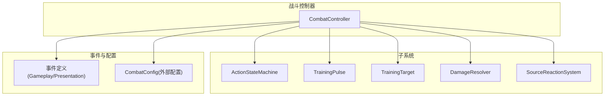
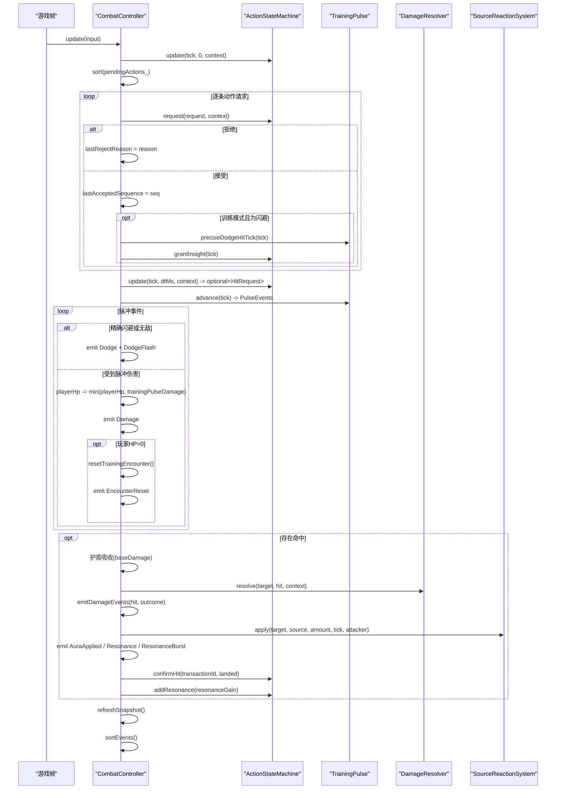
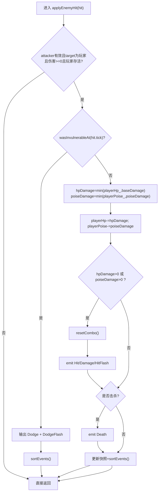
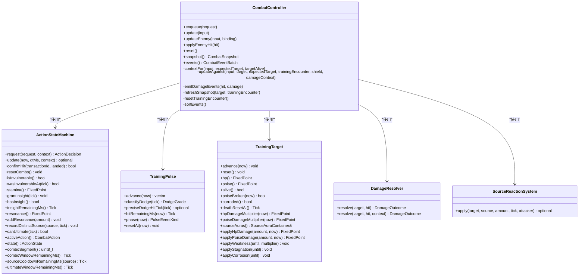

# 战斗控制器

<cite>
**本文引用的文件**   
- [combat_controller.h](file://native/gameplay/combat/combat_controller.h)
- [combat_controller.cpp](file://native/gameplay/combat/combat_controller.cpp)
- [event.h](file://native/gameplay/combat/event.h)
- [action_state_machine.h](file://native/gameplay/combat/action_state_machine.h)
- [training_pulse.h](file://native/gameplay/combat/training_pulse.h)
- [damage_resolver.h](file://native/gameplay/combat/damage_resolver.h)
- [test_combat_controller.cpp](file://tests/test_combat_controller.cpp)
</cite>

## 目录
1. [简介](#简介)
2. [项目结构](#项目结构)
3. [核心组件](#核心组件)
4. [架构总览](#架构总览)
5. [详细组件分析](#详细组件分析)
6. [依赖关系分析](#依赖关系分析)
7. [性能考量](#性能考量)
8. [故障排查指南](#故障排查指南)
9. [结论](#结论)
10. [附录](#附录)

## 简介
本文件围绕 CombatController 类展开，系统化阐述其在战斗系统中的职责与实现：帧更新逻辑、动作请求处理、目标绑定机制、事件批处理；并深入解析输入结构 CombatFrameInput、状态快照 CombatSnapshot、事件批次 CombatEventBatch 的用途与字段含义。文档还详细说明 update() 与 updateEnemy() 的实现差异、applyEnemyHit() 的伤害应用流程、resetTrainingEncounter() 的训练重置机制，并通过完整数据流示例展示从输入到输出的全过程。最后给出性能优化建议与调试技巧，帮助读者高效定位问题与提升运行效率。

## 项目结构
CombatController 位于 native/gameplay/combat 模块，与以下关键组件协作：
- ActionStateMachine：玩家动作状态机，负责动作决策、连击窗口、资源管理与命中时间线。
- TrainingPulse：训练脉冲系统，提供周期性伤害与精确闪避判定。
- TrainingTarget：训练目标实体，承载 HP/架势值、弱点/凝滞/腐蚀等状态。
- DamageResolver：伤害计算与结果产出（HP/架势/破势/击杀）。
- SourceReactionSystem：源属性反应系统，产生共鸣效果与额外数值。
- Event 定义：GameplayEvent/PresentationEvent 等通用事件类型。



图表来源
- [combat_controller.h:64-112](file://native/gameplay/combat/combat_controller.h#L64-L112)
- [action_state_machine.h:24-91](file://native/gameplay/combat/action_state_machine.h#L24-L91)
- [training_pulse.h:17-35](file://native/gameplay/combat/training_pulse.h#L17-L35)
- [damage_resolver.h:28-38](file://native/gameplay/combat/damage_resolver.h#L28-L38)
- [event.h:42-96](file://native/gameplay/combat/event.h#L42-L96)

章节来源
- [combat_controller.h:1-113](file://native/gameplay/combat/combat_controller.h#L1-L113)
- [combat_controller.cpp:1-306](file://native/gameplay/combat/combat_controller.cpp#L1-L306)

## 核心组件
- CombatController：战斗控制器的核心类，协调帧更新、动作队列、训练脉冲、伤害计算、反应系统与事件输出。
- CombatFrameInput：每帧输入结构，包含 tick、dtMs、移动标志、目标ID与目标存活状态。
- CombatSnapshot：每帧状态快照，暴露给上层用于 UI/回放/调试，包含连击段、双方 HP/架势、耐力、共鸣、洞察、无敌、冷却窗口、附着状态、当前反应、脉冲阶段、最近能力等。
- CombatEventBatch：事件批次，包含 gameplay 与 presentation 两类事件向量，按 tick/source/target/sequence 排序后供渲染与逻辑消费。
- CombatTargetBinding：敌人侧目标绑定结构，携带目标实体 ID、指针、护盾引用与伤害上下文。

章节来源
- [combat_controller.h:12-62](file://native/gameplay/combat/combat_controller.h#L12-L62)
- [combat_controller.h:64-112](file://native/gameplay/combat/combat_controller.h#L64-L112)
- [event.h:42-96](file://native/gameplay/combat/event.h#L42-L96)

## 架构总览
CombatController 在每帧执行如下主流程：
- 构造时初始化各子系统与默认状态。
- enqueue 将动作请求入队，update/updateEnemy 统一走 updateAgainst 分支。
- updateAgainst 中：
  - 推进资源时间线与动作状态机。
  - 对 pendingActions_ 按 sequence 稳定排序后逐一决策。
  - 训练模式下处理 TrainingPulse 事件（警告/命中），支持精确闪避与洞察。
  - 若存在命中 HitRequest，进行护盾吸收、伤害解析、反应系统应用、确认命中与共鸣增益。
  - 刷新快照并排序事件。
- applyEnemyHit 处理敌方对玩家的伤害，考虑无敌、伤害/架势、死亡事件。
- reset/resetTrainingEncounter 分别用于全局重置与训练遭遇失败后的重置。



图表来源
- [combat_controller.cpp:30-151](file://native/gameplay/combat/combat_controller.cpp#L30-L151)
- [action_state_machine.h:24-91](file://native/gameplay/combat/action_state_machine.h#L24-L91)
- [training_pulse.h:17-35](file://native/gameplay/combat/training_pulse.h#L17-L35)
- [damage_resolver.h:28-38](file://native/gameplay/combat/damage_resolver.h#L28-L38)
- [event.h:42-96](file://native/gameplay/combat/event.h#L42-L96)

## 详细组件分析

### 输入结构：CombatFrameInput
- 字段说明
  - tick：当前帧时间戳（Tick）
  - dtMs：自上一帧以来的毫秒增量
  - moving：玩家是否处于移动状态（影响连击窗口与动作决策）
  - targetId：期望的目标实体ID
  - targetAlive：目标是否存活（影响动作合法性）
- 用途
  - 作为 update()/updateEnemy() 的统一输入，驱动上下文构建与动作决策。
  - 在训练模式中，targetId 通常固定为 kTrainingTargetId，targetAlive 由 TrainingTarget 决定。

章节来源
- [combat_controller.h:12-18](file://native/gameplay/combat/combat_controller.h#L12-L18)

### 状态快照：CombatSnapshot
- 关键字段
  - comboSegment：当前连击段索引
  - playerHp/playerPoise：玩家生命与架势
  - targetHp/targetPoise：目标生命与架势
  - stamina/resonance：耐力与共鸣值
  - hasInsight/invulnerable/insightMs：洞察状态与剩余时长
  - pulseHitRemainingMs：训练脉冲命中倒计时
  - lastRejectReason：最近一次动作拒绝原因
  - targetAlive：目标存活状态
  - lastAcceptedSequence：最近一次被接受的请求序列号
  - currentAction/activeCombatAction：当前动作状态与活动战斗动作
  - comboWindowMs/radianceCooldownMs/currentCooldownMs/corruptionCooldownMs/ultimateWindowMs：各类窗口与冷却剩余
  - targetPoiseBroken：目标架势是否破碎
  - radianceAttached/currentAttached/corruptionAttached：源属性附着状态
  - corroded：目标是否处于腐蚀状态
  - currentReaction：当前反应类型
  - pulsePhase：训练脉冲阶段（None/Warning/Hit）
  - lastAbility：最近使用的能力ID
- 用途
  - 提供给 UI/回放/调试层读取当前战斗状态，避免直接访问内部可变状态。

章节来源
- [combat_controller.h:20-50](file://native/gameplay/combat/combat_controller.h#L20-L50)
- [combat_controller.cpp:219-261](file://native/gameplay/combat/combat_controller.cpp#L219-L261)

### 事件批次：CombatEventBatch
- 字段
  - gameplay：游戏逻辑事件（伤害、闪避、破势、共鸣、死亡、遭遇重置等）
  - presentation：表现层事件（受击闪烁、镜头抖动、共鸣爆发等）
- 排序规则
  - 按 tick 升序，其次 source、target、sequence 升序，保证跨子系统事件时序一致。
- 用途
  - 将一帧内所有事件集中输出，便于上层批量消费与渲染。

章节来源
- [combat_controller.h:52-55](file://native/gameplay/combat/combat_controller.h#L52-L55)
- [combat_controller.cpp:296-305](file://native/gameplay/combat/combat_controller.cpp#L296-L305)
- [event.h:42-96](file://native/gameplay/combat/event.h#L42-L96)

### 目标绑定：CombatTargetBinding
- 字段
  - id：目标实体ID
  - target：TrainingTarget 指针（可为空）
  - shield：指向护盾值的指针（可选，用于伤害吸收）
  - damageContext：伤害上下文（攻击者/防御者位置、朝向、方向性防御）
- 用途
  - 在 updateEnemy() 中传入真实目标与上下文，使伤害计算与反应系统能基于实际空间信息工作。

章节来源
- [combat_controller.h:57-62](file://native/gameplay/combat/combat_controller.h#L57-L62)

### 帧更新：update() 与 updateEnemy()
- update()
  - 面向训练模式，固定使用内部 TrainingTarget 与 kTrainingTargetId。
  - 调用 updateAgainst(...) 完成训练脉冲、动作决策、伤害与反应处理。
- updateEnemy()
  - 面向敌我对抗，通过 CombatTargetBinding 注入目标、护盾与伤害上下文。
  - 当 binding.target 为空或 id 无效时，退化为无目标处理。
- 共同路径 updateAgainst()
  - 构建 ActionContext（选择目标、移动/存活标志）。
  - 先推进资源时间线（actions_.update(tick, 0, context)），再处理动作请求。
  - 对 pendingActions_ 按 sequence 稳定排序，依次 request() 决策。
  - 训练模式下处理 TrainingPulse 事件，支持精确闪避与洞察授予。
  - 若 actions_.update() 返回 HitRequest，则进行护盾吸收、伤害解析、反应系统应用、确认命中与共鸣增益。
  - 刷新快照并排序事件。

```mermaid
flowchart TD
Start(["进入 updateAgainst"]) --> BuildCtx["构建 ActionContext"]
BuildCtx --> AdvanceResources["推进资源时间线 actions_.update(tick, 0, ctx)"]
AdvanceResources --> SortRequests["对 pendingActions_ 按 sequence 稳定排序"]
SortRequests --> LoopReq{"遍历每个请求"}
LoopReq --> |request() 拒绝| RecordReject["记录拒绝原因"] --> NextReq["下一个请求"]
LoopReq --> |request() 接受| MarkSeq["记录 lastAcceptedSequence"]
MarkSeq --> CheckDodge{"训练模式且为闪避?"}
CheckDodge --> |是| PreciseCheck["查询精确闪避命中tick"] --> GrantInsight["grantInsight(tick)"] --> NextReq
CheckDodge --> |否| NextReq
NextReq --> |循环结束| AdvanceTimeline["actions_.update(tick, dtMs, ctx) 获取 HitRequest?"]
AdvanceTimeline --> HandlePulse{"训练模式有脉冲事件?"}
HandlePulse --> |是| ProcessPulse["处理 Warning/Hit<br/>精确闪避/无敌→Dodge事件<br/>否则扣血/重置连击/可能触发EncounterReset"] --> MaybeHit
HandlePulse --> |否| MaybeHit{"存在 HitRequest?"}
MaybeHit --> |否| RefreshSnap["refreshSnapshot()"] --> SortEv["sortEvents()"] --> End(["结束"])
MaybeHit --> |是| ShieldAbsorb["护盾吸收 baseDamage"] --> Resolve["DamageResolver.resolve(...)"]
Resolve --> EmitDmg["emitDamageEvents(...)"]
EmitDmg --> ApplyReactions{"目标非空且命中且有source?"}
ApplyReactions --> |是| Reaction["SourceReactionSystem.apply(...)"] --> EmitAura["emit AuraApplied"]
EmitAura --> HasResonance{"reaction.type 非空?"}
HasResonance --> |是| EmitRes["emit Resonance + ResonanceBurst"] --> ConfirmHit["confirmHit(transactionId, landed)"] --> AddRes["addResonance(gain)"] --> RefreshSnap
HasResonance --> |否| ConfirmHit --> AddRes --> RefreshSnap
ApplyReactions --> |否| ConfirmHit --> AddRes --> RefreshSnap
```

图表来源
- [combat_controller.cpp:43-151](file://native/gameplay/combat/combat_controller.cpp#L43-L151)

章节来源
- [combat_controller.cpp:30-41](file://native/gameplay/combat/combat_controller.cpp#L30-L41)
- [combat_controller.cpp:43-151](file://native/gameplay/combat/combat_controller.cpp#L43-L151)

### 伤害应用：applyEnemyHit()
- 前置校验
  - 忽略非法攻击者、非玩家目标、负伤害或玩家已死亡的情况。
- 无敌判定
  - 若 actions_.wasInvulnerableAt(hit.tick) 为真，输出 Dodge 与 DodgeFlash 事件并排序返回。
- 伤害与架势
  - hpDamage = min(playerHp_, baseDamage)
  - poiseDamage = min(playerPoise_, poiseDamage)
  - 若造成伤害或架势变化，重置连击并输出 Hit/Damage/HitFlash 事件。
- 死亡事件
  - 若本次伤害导致玩家死亡，追加 Death 事件。
- 快照与排序
  - 更新 snapshot 中的连击段、玩家 HP/架势，并对事件排序。



图表来源
- [combat_controller.cpp:153-195](file://native/gameplay/combat/combat_controller.cpp#L153-L195)

章节来源
- [combat_controller.cpp:153-195](file://native/gameplay/combat/combat_controller.cpp#L153-L195)

### 训练重置：resetTrainingEncounter()
- 作用
  - 在训练遭遇失败（玩家 HP 归零）时，重置动作状态机、训练脉冲、目标、待处理动作、玩家 HP/架势、反应与洞察状态，并刷新快照。
- 适用场景
  - 训练脉冲造成致命伤害后触发，确保下一轮训练从零开始。

章节来源
- [combat_controller.cpp:281-294](file://native/gameplay/combat/combat_controller.cpp#L281-L294)

### 事件批处理：sortEvents()
- 排序键
  - 优先 tick，其次 source、target，最后 sequence。
- 目的
  - 保证多子系统产生的事件在同一帧内具备确定顺序，便于回放与表现层同步。

章节来源
- [combat_controller.cpp:296-305](file://native/gameplay/combat/combat_controller.cpp#L296-L305)

### 完整战斗流程示例（数据流）
以下示例演示从输入接收到事件输出的完整数据流，涵盖连击、反应与训练脉冲：
- 第1帧
  - 输入：enqueue({Attack, seq=1})，update({tick=0, dtMs=16, moving=false, targetId=kTrainingTargetId, targetAlive=true})
  - 动作决策：request() 接受，记录 lastAcceptedSequence=1
  - 时间线推进：actions_.update(tick=0, dtMs=16) 未到达命中点，无 HitRequest
  - 训练脉冲：advance() 无事件
  - 快照：comboSegment=1，targetHp=初始值
  - 事件：无
- 第2帧
  - 输入：update({tick=160, dtMs=144, ...})
  - 时间线推进：actions_.update(tick=160, dtMs=144) 返回 HitRequest{baseDamage=...}
  - 伤害解析：DamageResolver.resolve(...) 得到 DamageOutcome(hpDamage>0)
  - 事件输出：emitDamageEvents → Hit + Damage + HitFlash
  - 反应系统：若有 source，apply(...) 可能产生 Resonance + ResonanceBurst
  - 确认命中：confirmHit(transactionId, landed=true)
  - 快照：targetHp 下降，currentReaction 更新
  - 事件排序：按 tick/source/target/sequence 排序
- 训练脉冲场景
  - 在特定 tick，TrainingPulse.advance() 返回 Hit 事件
  - 若玩家在该 tick 精确闪避或处于无敌，输出 Dodge + DodgeFlash
  - 否则扣除 trainingPulseDamage，重置连击，若玩家 HP 归零则触发 resetTrainingEncounter() 与 EncounterReset 事件

章节来源
- [test_combat_controller.cpp:1-118](file://tests/test_combat_controller.cpp#L1-L118)
- [combat_controller.cpp:30-151](file://native/gameplay/combat/combat_controller.cpp#L30-L151)

## 依赖关系分析
- 内部依赖
  - ActionStateMachine：动作决策、连击窗口、资源管理、命中时间线、无敌判定、共鸣增益。
  - TrainingPulse：训练脉冲周期、警告/命中阶段、精确闪避窗口。
  - TrainingTarget：目标 HP/架势、弱点/凝滞/腐蚀、死亡重置时间。
  - DamageResolver：伤害计算、架势破碎、击杀判定。
  - SourceReactionSystem：源属性附着与反应类型，产生共鸣与额外数值。
- 外部接口
  - event.h：GameplayEvent/PresentationEvent 等事件类型定义。
  - CombatConfig：战斗平衡参数（训练 HP/伤害、连击窗口、冷却、反应系数等）。



图表来源
- [combat_controller.h:64-112](file://native/gameplay/combat/combat_controller.h#L64-L112)
- [action_state_machine.h:24-91](file://native/gameplay/combat/action_state_machine.h#L24-L91)
- [training_pulse.h:17-35](file://native/gameplay/combat/training_pulse.h#L17-L35)
- [damage_resolver.h:28-38](file://native/gameplay/combat/damage_resolver.h#L28-L38)

章节来源
- [combat_controller.h:64-112](file://native/gameplay/combat/combat_controller.h#L64-L112)
- [action_state_machine.h:24-91](file://native/gameplay/combat/action_state_machine.h#L24-L91)
- [training_pulse.h:17-35](file://native/gameplay/combat/training_pulse.h#L17-L35)
- [damage_resolver.h:28-38](file://native/gameplay/combat/damage_resolver.h#L28-L38)

## 性能考量
- 事件排序开销
  - sortEvents() 每帧对 gameplay/presentation 两个向量进行稳定排序，复杂度 O(N log N)。建议限制单帧事件数量，必要时采用桶排序或分帧合并策略。
- 动作请求排序
  - pendingActions_ 每帧稳定排序，建议在上层尽量按 sequence 有序入队，减少排序成本。
- 子对象更新
  - TrainingTarget::advance() 与 TrainingPulse::advance() 每帧调用，注意避免复杂计算或频繁分配。
- 伤害与反应
  - DamageResolver 与 SourceReactionSystem 的计算应避免重复分配，尽量复用临时对象。
- 快照刷新
  - refreshSnapshot() 会遍历目标源属性列表，目标 aura 数量较多时需关注性能。

[本节为通用指导，不直接分析具体文件]

## 故障排查指南
- 动作被拒绝
  - 检查 lastRejectReason 与 lastAcceptedSequence，确认输入 targetId/targetAlive 是否正确，以及动作是否在合法窗口内。
- 连击丢失
  - moving=true 或超时会导致连击重置，检查 moving 标志与 comboWindowMs。
- 训练脉冲误伤
  - 确认 preciseDodgedPulseTick_ 与 wasInvulnerableAt(tick) 的逻辑，验证 dodge 时机与无敌区间。
- 事件顺序异常
  - 检查 sortEvents() 的排序键，确保 tick/source/target/sequence 符合预期。
- 玩家死亡未触发重置
  - 确认 applyEnemyHit() 中死亡判断与 resetTrainingEncounter() 的调用路径。

章节来源
- [combat_controller.cpp:15-28](file://native/gameplay/combat/combat_controller.cpp#L15-L28)
- [combat_controller.cpp:153-195](file://native/gameplay/combat/combat_controller.cpp#L153-L195)
- [combat_controller.cpp:296-305](file://native/gameplay/combat/combat_controller.cpp#L296-L305)

## 结论
CombatController 作为战斗系统的中枢，整合了动作状态机、训练脉冲、伤害解析与反应系统，提供稳定的帧更新与事件批处理能力。通过 CombatFrameInput、CombatSnapshot 与 CombatEventBatch，实现了清晰的输入-状态-输出契约。update() 与 updateEnemy() 分别覆盖训练与对抗场景，applyEnemyHit() 保障玩家受击的正确处理，resetTrainingEncounter() 确保训练模式的健壮性。遵循本文的性能与调试建议，可进一步提升稳定性与可维护性。

[本节为总结，不直接分析具体文件]

## 附录
- 常用 API 速览
  - enqueue(ActionRequest)：入队动作请求
  - update(CombatFrameInput)：训练模式帧更新
  - updateEnemy(CombatFrameInput, CombatTargetBinding)：对抗模式帧更新
  - applyEnemyHit(HitRequest)：玩家受击处理
  - reset()：全局重置
  - snapshot()：只读状态快照
  - events()：只读事件批次

章节来源
- [combat_controller.h:69-79](file://native/gameplay/combat/combat_controller.h#L69-L79)