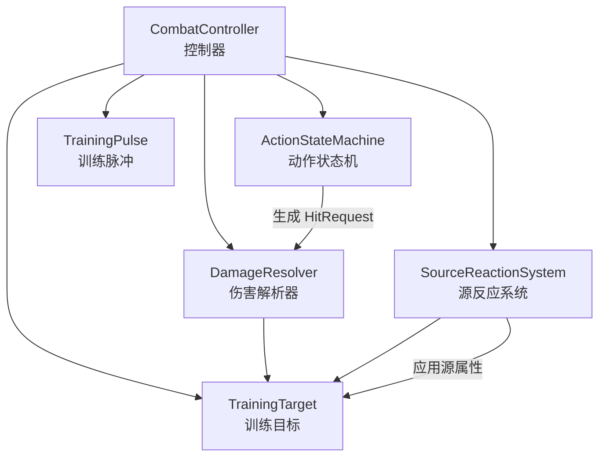
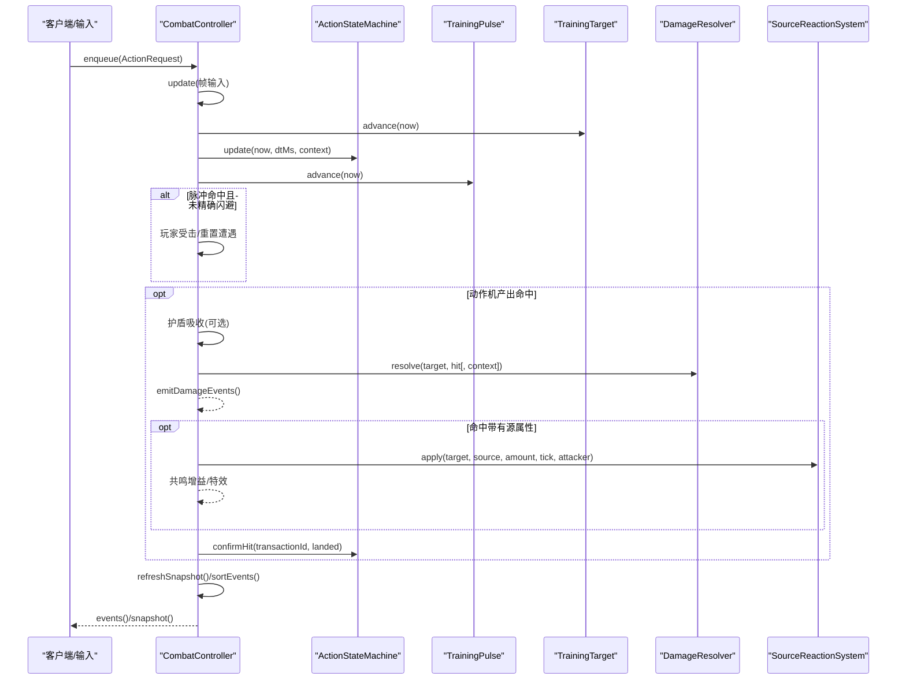
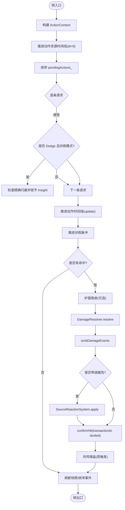
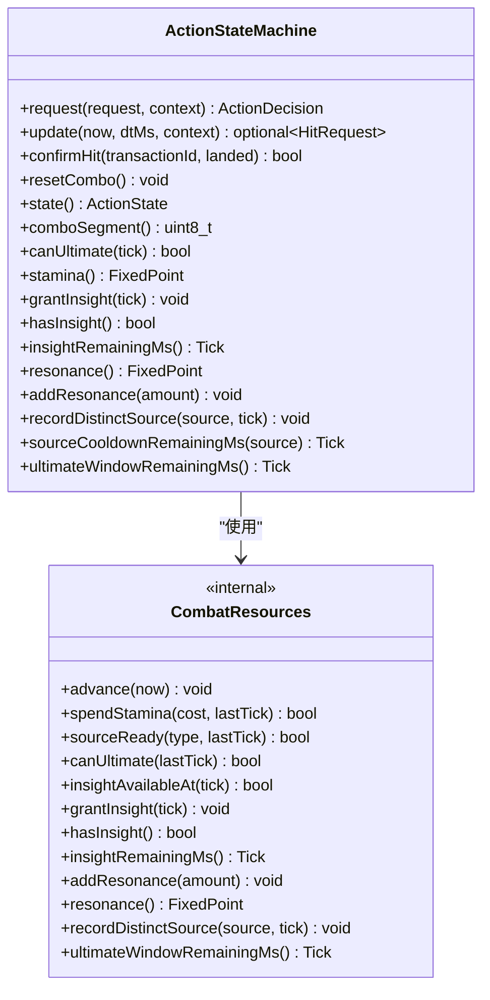
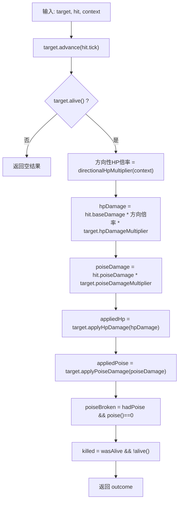
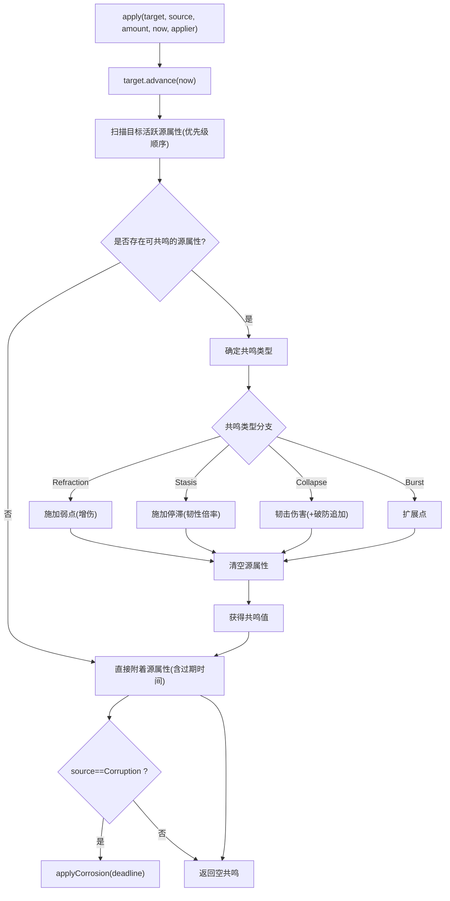
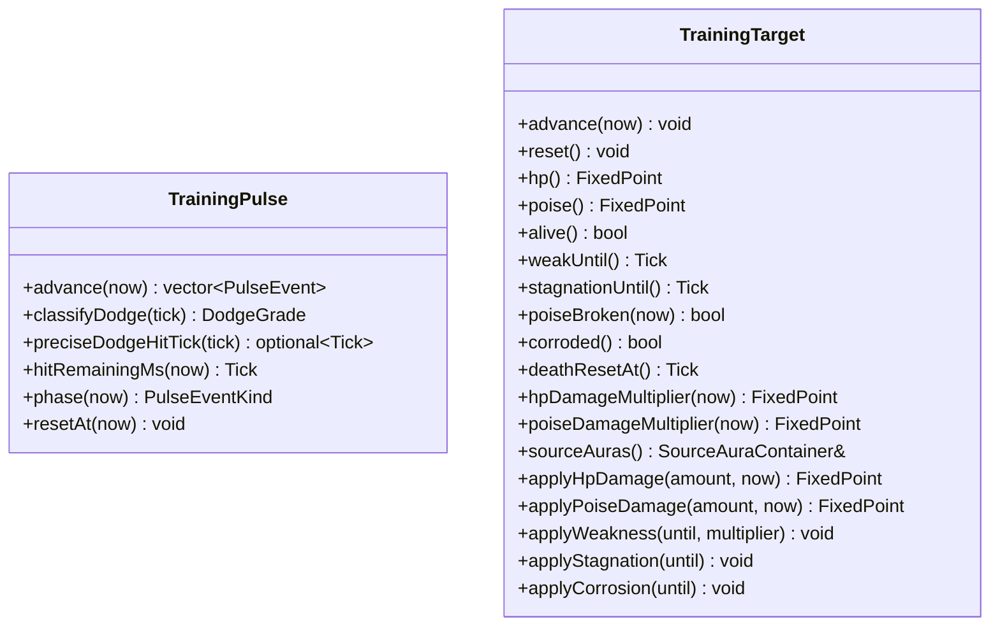
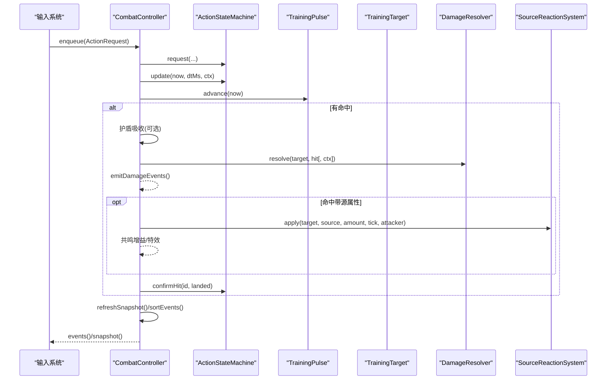
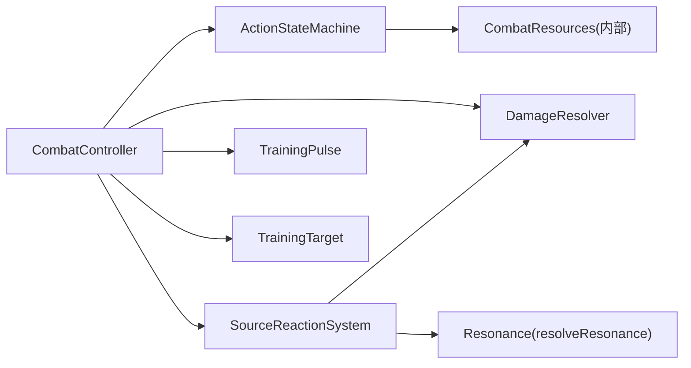

# 战斗系统

<cite>
**本文引用的文件**   
- [combat_controller.h](file://native/gameplay/combat/combat_controller.h)
- [combat_controller.cpp](file://native/gameplay/combat/combat_controller.cpp)
- [action_state_machine.h](file://native/gameplay/combat/action_state_machine.h)
- [action_state_machine.cpp](file://native/gameplay/combat/action_state_machine.cpp)
- [damage_resolver.h](file://native/gameplay/combat/damage_resolver.h)
- [damage_resolver.cpp](file://native/gameplay/combat/damage_resolver.cpp)
- [source_reaction_system.h](file://native/gameplay/combat/source_reaction_system.h)
- [source_reaction_system.cpp](file://native/gameplay/combat/source_reaction_system.cpp)
- [resonance.h](file://native/gameplay/combat/resonance.h)
- [resonance.cpp](file://native/gameplay/combat/resonance.cpp)
- [training_pulse.h](file://native/gameplay/combat/training_pulse.h)
- [training_target.h](file://native/gameplay/combat/training_target.h)
- [combat_config.h](file://native/gameplay/combat/combat_config.h)
- [combat_action.h](file://native/gameplay/combat/combat_action.h)
- [event.h](file://native/gameplay/combat/event.h)
</cite>

## 目录
1. [简介](#简介)
2. [项目结构](#项目结构)
3. [核心组件](#核心组件)
4. [架构总览](#架构总览)
5. [详细组件分析](#详细组件分析)
6. [依赖关系分析](#依赖关系分析)
7. [性能考虑](#性能考虑)
8. [故障排查指南](#故障排查指南)
9. [结论](#结论)
10. [附录](#附录)

## 简介
本文件为 my-world 的战斗系统提供系统化、可操作的文档。重点覆盖以下方面：
- CombatController 的核心循环与事件编排
- ActionStateMachine 的动作状态机与资源管理
- DamageResolver 的伤害计算与方向性防御
- SourceReactionSystem 的源反应系统与 Resonance 共鸣判定
- TrainingPulse 训练脉冲与 TrainingTarget 训练目标的机制
- 战斗动作定义、状态转换规则、伤害类型与计算公式
- 完整战斗流程示例（攻击发起→命中检测→伤害计算→结果反馈）
- 配置参数、平衡性调整与扩展新机制的方法
- 性能优化建议与调试技巧

## 项目结构
战斗系统位于 native/gameplay/combat 目录下，采用分层模块化设计：
- 控制器层：CombatController 负责帧更新、事件排序与跨子系统协调
- 动作层：ActionStateMachine 管理玩家动作、连击、冷却与资源
- 伤害层：DamageResolver 统一伤害计算与目标抗性/弱点处理
- 反应层：SourceReactionSystem 管理源属性附着与共鸣反应
- 训练模块：TrainingPulse 与 TrainingTarget 用于训练场景
- 配置与事件：CombatConfig、CombatAction、Event 等基础类型与常量

**图表来源** 
- [combat_controller.h:64-113](file://native/gameplay/combat/combat_controller.h#L64-L113)
- [action_state_machine.h:24-91](file://native/gameplay/combat/action_state_machine.h#L24-L91)
- [damage_resolver.h:28-38](file://native/gameplay/combat/damage_resolver.h#L28-L38)
- [source_reaction_system.h:15-28](file://native/gameplay/combat/source_reaction_system.h#L15-L28)
- [training_pulse.h:17-35](file://native/gameplay/combat/training_pulse.h#L17-L35)
- [training_target.h:6-44](file://native/gameplay/combat/training_target.h#L6-L44)

**章节来源**
- [combat_controller.h:64-113](file://native/gameplay/combat/combat_controller.h#L64-L113)
- [combat_action.h:7-67](file://native/gameplay/combat/combat_action.h#L7-L67)
- [event.h:5-96](file://native/gameplay/combat/event.h#L5-L96)

## 核心组件
- CombatController
  - 职责：帧输入聚合、动作入队与决策、训练脉冲推进、伤害与反应编排、快照与事件输出
  - 关键接口：enqueue、update、updateEnemy、applyEnemyHit、snapshot/events
- ActionStateMachine
  - 职责：动作请求校验、状态推进、连击窗口、冷却/耐力/共鸣资源管理、命中事务生命周期
  - 关键接口：request、update、confirmHit、state、comboSegment、canUltimate
- DamageResolver
  - 职责：基于目标状态与方向性防御计算最终 HP/Poise 伤害，判断破防与击杀
  - 关键接口：resolve(target, hit[, context])
- SourceReactionSystem
  - 职责：根据目标已附着源属性与本次来源进行共鸣判定，产生额外效果并刷新源属性
  - 关键接口：apply(target, source, amount, now, applier)
- TrainingPulse
  - 职责：周期性警告与命中事件，支持精确闪避判定
  - 关键接口：advance、classifyDodge、preciseDodgeHitTick、phase
- TrainingTarget
  - 职责：HP/Poise 管理、弱点/停滞/腐蚀状态、源属性容器、死亡重置
  - 关键接口：applyHpDamage、applyPoiseDamage、applyWeakness、applyStagnation、applyCorrosion

**章节来源**
- [combat_controller.h:64-113](file://native/gameplay/combat/combat_controller.h#L64-L113)
- [action_state_machine.h:24-91](file://native/gameplay/combat/action_state_machine.h#L24-L91)
- [damage_resolver.h:28-38](file://native/gameplay/combat/damage_resolver.h#L28-L38)
- [source_reaction_system.h:15-28](file://native/gameplay/combat/source_reaction_system.h#L15-L28)
- [training_pulse.h:17-35](file://native/gameplay/combat/training_pulse.h#L17-L35)
- [training_target.h:6-44](file://native/gameplay/combat/training_target.h#L6-L44)

## 架构总览
战斗系统以帧驱动，按固定顺序执行：
1. 推进目标时间线（TrainingTarget.advance）
2. 推进资源时间线（ActionStateMachine.update 内部 resources_.advance）
3. 处理动作请求（ActionStateMachine.request），必要时进入精确闪避与洞察
4. 推进动作时间线（ActionStateMachine.update），产出 HitRequest
5. 推进训练脉冲（TrainingPulse.advance），处理玩家受击或闪避
6. 若存在命中，先扣除护盾（如有），再调用 DamageResolver.resolve
7. 若有源属性，调用 SourceReactionSystem.apply 触发共鸣
8. 确认命中事务（ActionStateMachine.confirmHit），并根据共鸣结果增加共鸣值
9. 刷新快照、排序事件并输出

**图表来源** 
- [combat_controller.cpp:30-151](file://native/gameplay/combat/combat_controller.cpp#L30-L151)
- [action_state_machine.cpp:108-200](file://native/gameplay/combat/action_state_machine.cpp#L108-L200)
- [damage_resolver.cpp:40-65](file://native/gameplay/combat/damage_resolver.cpp#L40-L65)
- [source_reaction_system.cpp:12-68](file://native/gameplay/combat/source_reaction_system.cpp#L12-L68)
- [training_pulse.h:17-35](file://native/gameplay/combat/training_pulse.h#L17-L35)

## 详细组件分析

### CombatController 核心逻辑
- 帧更新流程
  - 构建 ActionContext（目标选择、存活、移动、受伤）
  - 推进动作资源时间线（dt=0 不推进命中点）
  - 对 pendingActions_ 按 sequence 稳定排序后逐一 request
  - 训练模式下 Dodge 可能触发精确闪避并授予 Insight
  - 推进动作时间线，产出 HitRequest（若存在）
  - 推进训练脉冲，处理玩家受击或闪避，必要时重置遭遇
  - 命中处理：护盾吸收→伤害解析→事件发射→源反应→确认命中→共鸣增益
  - 刷新快照、排序事件
- 关键数据结构
  - CombatFrameInput：tick、dtMs、moving、targetId/targetAlive
  - CombatSnapshot：连击段、HP/Poise、耐力、共鸣、洞察、冷却、当前动作等
  - CombatEventBatch：GameplayEvent 与 PresentationEvent 双通道事件
  - CombatTargetBinding：绑定外部敌人实体、护盾指针与伤害上下文

**图表来源** 
- [combat_controller.cpp:30-151](file://native/gameplay/combat/combat_controller.cpp#L30-L151)

**章节来源**
- [combat_controller.h:64-113](file://native/gameplay/combat/combat_controller.h#L64-L113)
- [combat_controller.cpp:30-151](file://native/gameplay/combat/combat_controller.cpp#L30-L151)

### ActionStateMachine 状态管理与动作定义
- 动作类型与状态
  - CombatAction：Attack、Dodge、Radiance、Current、Corruption、Ultimate
  - ActionState：Idle、Attack1..4、Dodging、CastingSource、CastingUltimate
  - 拒绝原因：NoTarget、TargetDead、Cooldown、InsufficientStamina/Resonance、ActionLocked、InvalidAction
- 状态机行为
  - request：校验上下文、资源、冷却、锁定；设置 activeAction_/startTick/sequence
  - update：推进时间线；移动/受伤打断连击；Dodge 期间无命中；攻击在固定延迟后产出 HitRequest；源/终极技能通过事务机制等待确认
  - confirmHit：根据命中结果决定是否计入连击/资源消耗
  - 资源管理：耐力、洞察、源冷却、共鸣上限、终极窗口
- 连击与窗口
  - comboWindowMs 控制连击窗口；链式攻击索引递增；超时或被打断重置

**图表来源** 
- [action_state_machine.h:24-91](file://native/gameplay/combat/action_state_machine.h#L24-L91)
- [action_state_machine.cpp:26-106](file://native/gameplay/combat/action_state_machine.cpp#L26-L106)

**章节来源**
- [action_state_machine.h:11-91](file://native/gameplay/combat/action_state_machine.h#L11-L91)
- [action_state_machine.cpp:26-200](file://native/gameplay/combat/action_state_machine.cpp#L26-L200)
- [combat_action.h:7-67](file://native/gameplay/combat/combat_action.h#L7-L67)

### DamageResolver 伤害计算算法
- 输入：TrainingTarget、HitRequest、可选 DamageResolutionContext（位置、朝向、方向性防御）
- 计算步骤
  - 方向性修正：根据攻击者相对朝向与最小点积阈值决定前向倍率
  - 目标倍率：结合弱点/停滞/腐蚀等状态获取 hp/poise 倍率
  - 应用伤害：依次应用 HP 与 Poise 伤害，记录破防与击杀
- 复杂度：O(1)，仅涉及向量点积与常数倍率乘法

**图表来源** 
- [damage_resolver.cpp:40-65](file://native/gameplay/combat/damage_resolver.cpp#L40-L65)

**章节来源**
- [damage_resolver.h:9-38](file://native/gameplay/combat/damage_resolver.h#L9-L38)
- [damage_resolver.cpp:1-65](file://native/gameplay/combat/damage_resolver.cpp#L1-L65)

### SourceReactionSystem 与 Resonance 共鸣系统
- 源属性附着
  - 每次命中若携带 SourceType，则为目标添加源属性（含过期时间与施加者）
  - Corruption 同时附加腐蚀状态
- 共鸣判定
  - 优先级 Radiance > Current > Corruption
  - 若已有同种源属性，则不触发共鸣；不同组合对应不同共鸣类型
  - 共鸣类型与效果：
    - Refraction：固定折光伤害，并施加弱点（增伤）
    - Stasis：施加停滞（提升受到的格挡/韧性伤害倍率）
    - Collapse：造成崩解韧击伤害，若破防则追加额外 HP 伤害
    - Burst：预留扩展点
- 共鸣收益
  - 触发共鸣时获得固定共鸣值，清空目标上所有源属性

**图表来源** 
- [source_reaction_system.cpp:12-68](file://native/gameplay/combat/source_reaction_system.cpp#L12-L68)
- [resonance.cpp:1-12](file://native/gameplay/combat/resonance.cpp#L1-L12)

**章节来源**
- [source_reaction_system.h:7-28](file://native/gameplay/combat/source_reaction_system.h#L7-L28)
- [source_reaction_system.cpp:1-68](file://native/gameplay/combat/source_reaction_system.cpp#L1-L68)
- [resonance.h:1-5](file://native/gameplay/combat/resonance.h#L1-L5)
- [resonance.cpp:1-12](file://native/gameplay/combat/resonance.cpp#L1-L12)

### TrainingPulse 训练脉冲与 TrainingTarget 训练目标
- TrainingPulse
  - 周期推进，产生 Warning 与 Hit 事件
  - 支持精确闪避判定：根据输入时机返回精确命中 Tick，配合 dodge 实现高难度练习
  - 暴露 phase/hitRemainingMs 供 UI 显示
- TrainingTarget
  - 维护 HP/Poise、弱点/停滞/腐蚀/死亡重置时间
  - 提供 hp/poise 倍率查询与伤害应用接口
  - 源属性容器管理多源附着与过期清理

**图表来源** 
- [training_pulse.h:17-35](file://native/gameplay/combat/training_pulse.h#L17-L35)
- [training_target.h:6-44](file://native/gameplay/combat/training_target.h#L6-L44)

**章节来源**
- [training_pulse.h:9-35](file://native/gameplay/combat/training_pulse.h#L9-L35)
- [training_target.h:6-44](file://native/gameplay/combat/training_target.h#L6-L44)

### 战斗流程示例：从攻击到反馈的数据流
- 输入阶段
  - 客户端通过 CombatController.enqueue 提交 ActionRequest（如 Attack/Dodge/源技能/终极）
- 决策阶段
  - ActionStateMachine.request 校验上下文与资源，决定是否接受
  - 训练模式下 Dodge 可能触发精确闪避并授予 Insight
- 推进阶段
  - ActionStateMachine.update 推进时间线，产出 HitRequest（包含 baseDamage、poiseDamage、source、amount、transactionId）
- 命中阶段
  - CombatController 先尝试护盾吸收，再调用 DamageResolver.resolve 计算实际伤害
  - 若命中携带源属性，调用 SourceReactionSystem.apply 判定共鸣并刷新源属性
- 结算阶段
  - 确认命中事务（影响连击/资源消耗）
  - 若触发共鸣，增加玩家共鸣值
  - 刷新快照（连击段、HP/Poise、冷却、当前动作等）
  - 排序并输出 GameplayEvent 与 PresentationEvent

**图表来源** 
- [combat_controller.cpp:30-151](file://native/gameplay/combat/combat_controller.cpp#L30-L151)
- [action_state_machine.cpp:108-200](file://native/gameplay/combat/action_state_machine.cpp#L108-L200)
- [damage_resolver.cpp:40-65](file://native/gameplay/combat/damage_resolver.cpp#L40-L65)
- [source_reaction_system.cpp:12-68](file://native/gameplay/combat/source_reaction_system.cpp#L12-L68)

## 依赖关系分析
- 组件耦合
  - CombatController 强依赖 ActionStateMachine、DamageResolver、SourceReactionSystem、TrainingPulse、TrainingTarget
  - SourceReactionSystem 依赖 DamageResolver 与 Resonance 判定
  - ActionStateMachine 依赖 CombatResources（内部资源管理）与 CombatConfig
- 外部依赖
  - 数学库 Vec2/GLM（方向性防御计算）
  - TickClock（时间单位 Tick）
- 潜在循环依赖
  - 当前设计无循环依赖；各子系统单向调用或通过事件解耦

**图表来源** 
- [combat_controller.h:64-113](file://native/gameplay/combat/combat_controller.h#L64-L113)
- [source_reaction_system.h:15-28](file://native/gameplay/combat/source_reaction_system.h#L15-L28)
- [action_state_machine.h:24-91](file://native/gameplay/combat/action_state_machine.h#L24-L91)

**章节来源**
- [combat_controller.h:64-113](file://native/gameplay/combat/combat_controller.h#L64-L113)
- [source_reaction_system.h:15-28](file://native/gameplay/combat/source_reaction_system.h#L15-L28)
- [action_state_machine.h:24-91](file://native/gameplay/combat/action_state_machine.h#L24-L91)

## 性能考虑
- 时间复杂度
  - 每帧主要操作均为 O(1)：动作决策、伤害计算、共鸣判定、事件排序（事件数量通常较小）
- 内存与对象分配
  - 避免每帧频繁分配：pendingActions_ 复用、事件批量收集、TrainingTarget/SourceAura 复用
- 数值计算
  - 固定点乘法使用 __int128 中间类型，避免溢出；方向性点积计算需做有限性检查
- 渲染与事件
  - 将 PresentationEvent 与 GameplayEvent 分离，便于渲染侧按需消费
- 建议
  - 使用对象池缓存临时结构体（如 HitRequest、PulseEvent）
  - 对高频路径（如大量小怪）启用批处理与空间划分
  - 减少字符串/日志打印，仅在调试开关开启时输出

[本节为通用指导，无需特定文件引用]

## 故障排查指南
- 常见拒绝原因定位
  - NoTarget/TargetDead：检查目标选择与存活状态
  - Cooldown：核对源冷却与终极窗口
  - InsufficientStamina/Resonance：检查耐力/共鸣资源
  - ActionLocked：上一动作未完成或事务未确认
- 精确闪避失效
  - 检查 preciseDodgeHitTick 返回值与 preciseDodgedPulseTick_ 匹配逻辑
  - 确认 dodgeInvulnerability 区间是否正确设置
- 共鸣未触发
  - 检查目标源属性容器 active() 列表与优先级
  - 确认 resolveResonance 的组合是否符合预期
- 伤害异常
  - 检查方向性防御配置与向量有限性
  - 验证目标弱点/停滞/腐蚀倍率是否生效
- 调试技巧
  - 利用 snapshot() 与 events() 观察帧末状态与事件序列
  - 在关键路径插入断点（如 confirmHit、apply、resolve）
  - 使用测试用例（test_combat_controller.cpp、test_damage_resolver.cpp、test_source_reaction_system.cpp）复现问题

**章节来源**
- [action_state_machine.cpp:26-106](file://native/gameplay/combat/action_state_machine.cpp#L26-L106)
- [combat_controller.cpp:153-195](file://native/gameplay/combat/combat_controller.cpp#L153-L195)
- [damage_resolver.cpp:10-36](file://native/gameplay/combat/damage_resolver.cpp#L10-L36)
- [source_reaction_system.cpp:12-68](file://native/gameplay/combat/source_reaction_system.cpp#L12-L68)

## 结论
本战斗系统以清晰的职责划分与稳定的帧驱动流程实现了可扩展、可调试的战斗体验。通过 ActionStateMachine 的状态机、DamageResolver 的统一伤害计算、SourceReactionSystem 的共鸣机制以及 TrainingPulse/TrainingTarget 的训练闭环，开发者可以便捷地扩展新动作、新共鸣与新平衡参数。建议在保持现有 O(1) 性能特征的前提下，逐步引入批处理与对象池优化，并通过完善的测试覆盖确保稳定性。

[本节为总结性内容，无需特定文件引用]

## 附录

### 战斗配置参数与平衡性调整
- 连击与资源
  - comboDamage/comboPoiseDamage：连击伤害与韧性伤害数组
  - comboWindowMs：连击窗口时长
  - maxStamina/dodgeCost/staminaRecoveryDelayMs/staminaRecoveryPerSecond：耐力与闪避成本/恢复
  - dodgeDurationMs/dodgeInvulnerabilityMs：闪避时长与无敌时长
  - preciseDodgeWindowMinMs/MaxMs：精确闪避窗口范围
  - insightDurationMs/insightDamageMultiplier：洞察持续时间与增伤倍率
- 源技能
  - sourceCooldownMs/sourceDamage/sourcePoiseDamage：三源冷却/伤害/韧性伤害
  - sourceAuraDurationMs：源属性附着时长
- 共鸣与终极
  - refractionDamage/weakDurationMs/weakDamageMultiplier：折光伤害与弱点增伤
  - stagnationDurationMs/stagnationPoiseMultiplier：停滞持续与韧性倍率
  - disintegrationPoiseDamage/disintegrationBreakDamage：崩解韧击与破防追加
  - sourceResonanceGain/reactionResonanceGain/maxResonance：源/共鸣增益与上限
  - triSourceWindowMs/ultimateWindowMs/ultimateDamage/ultimatePoiseDamage：三源窗口/终极窗口/终极伤害
- 训练目标
  - trainingTargetHp/Poise/breakDurationMs/deathResetMs：目标血量/韧性/破防/死亡重置
  - trainingPlayerHp/Poise：玩家初始血量/韧性
  - trainingPulsePeriodMs/WarningMs/Damage：训练脉冲周期/预警/伤害

**章节来源**
- [combat_config.h:9-153](file://native/gameplay/combat/combat_config.h#L9-L153)

### 扩展新战斗机制的方法
- 新增动作类型
  - 在 CombatAction 中添加枚举，并在 TryMapCombatAction 中映射输入
  - 在 ActionStateMachine.request/update 中补充校验与时间线逻辑
- 新增共鸣类型
  - 在 ResonanceType 中添加枚举，并在 resolveResonance 中定义组合规则
  - 在 SourceReactionSystem.apply 中为新类型添加效果分支
- 新增伤害/防御特性
  - 在 DamageResolutionContext 中扩展方向性防御或其他乘区
  - 在 TrainingTarget 中扩展状态与倍率查询接口
- 新增训练机制
  - 在 TrainingPulse 中扩展事件种类或判定逻辑
  - 在 TrainingTarget 中扩展状态（如护盾、反伤、反弹）

[本节为概念性扩展指导，无需特定文件引用]