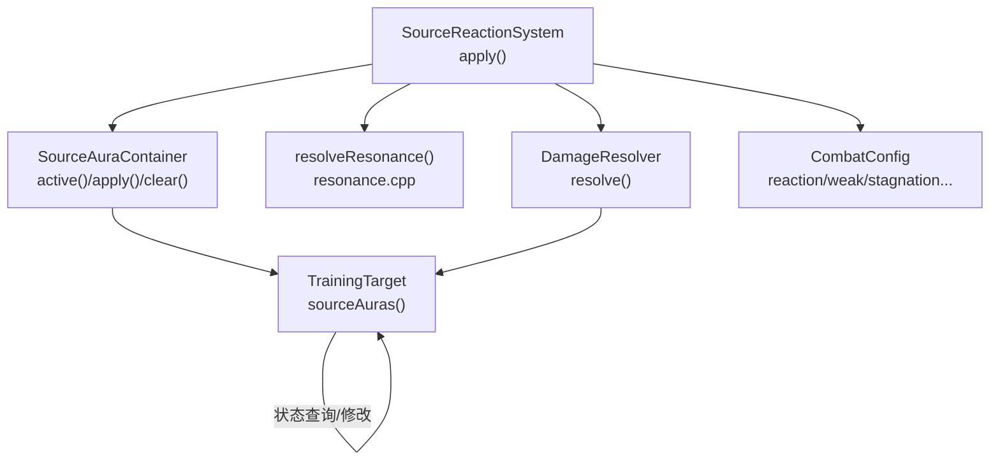
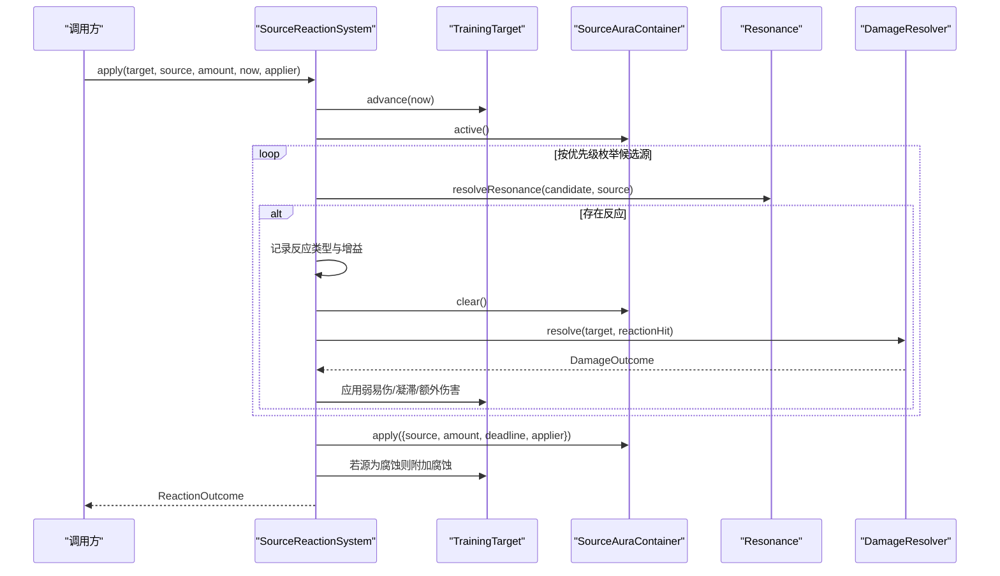
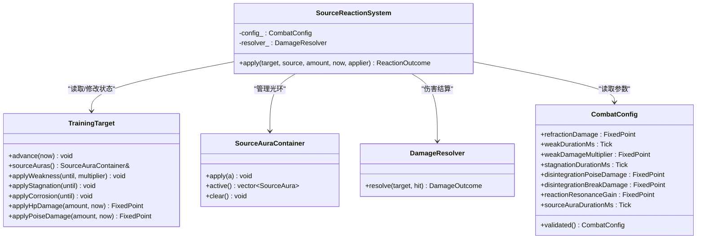
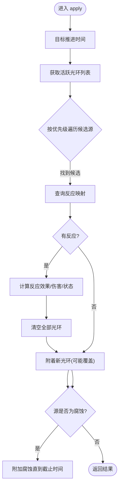
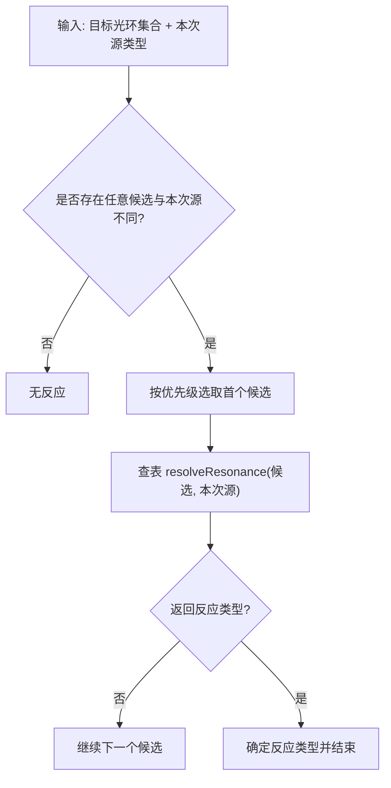
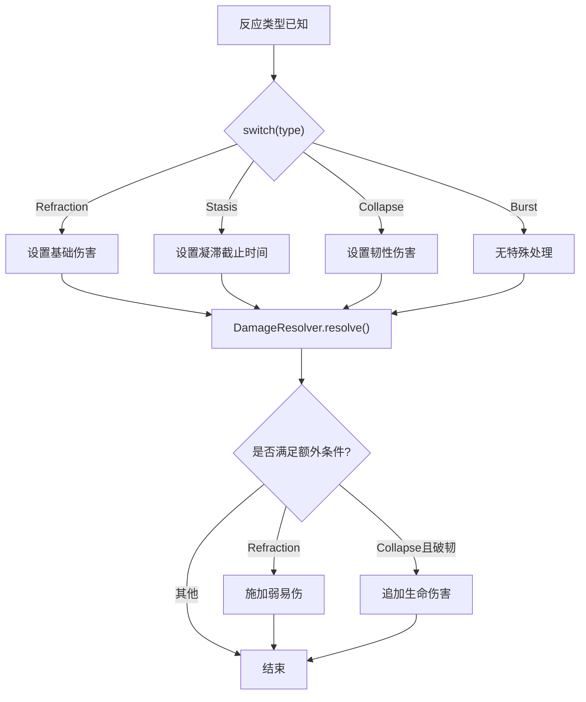
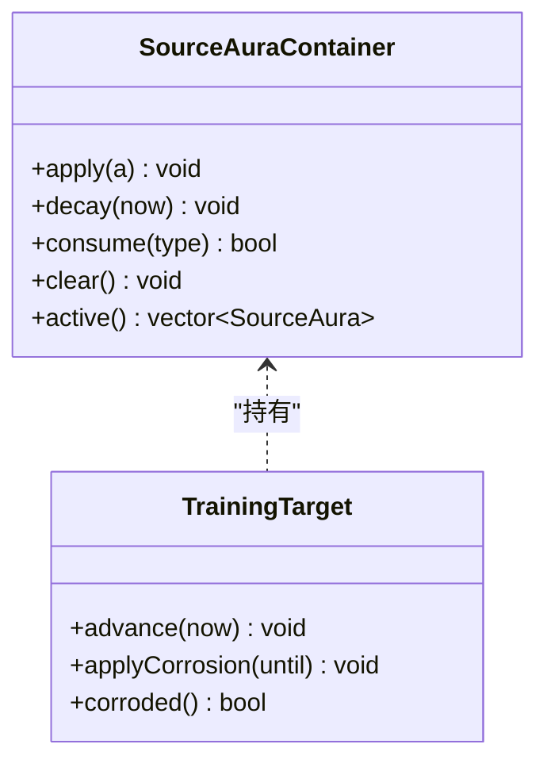
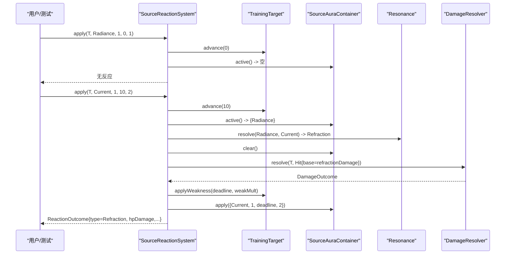
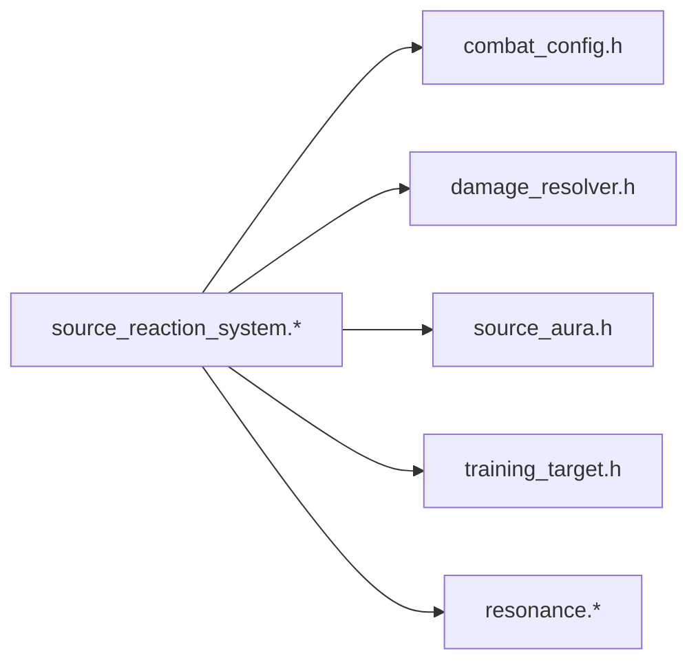

# 源反应系统

<cite>
**本文引用的文件**   
- [source_reaction_system.h](file://native/gameplay/combat/source_reaction_system.h)
- [source_reaction_system.cpp](file://native/gameplay/combat/source_reaction_system.cpp)
- [source_aura.h](file://native/gameplay/combat/source_aura.h)
- [source_aura.cpp](file://native/gameplay/combat/source_aura.cpp)
- [resonance.h](file://native/gameplay/combat/resonance.h)
- [resonance.cpp](file://native/gameplay/combat/resonance.cpp)
- [damage_resolver.h](file://native/gameplay/combat/damage_resolver.h)
- [damage_resolver.cpp](file://native/gameplay/combat/damage_resolver.cpp)
- [training_target.h](file://native/gameplay/combat/training_target.h)
- [combat_config.h](file://native/gameplay/combat/combat_config.h)
- [test_source_reaction_system.cpp](file://tests/test_source_reaction_system.cpp)
</cite>

## 目录
1. [简介](#简介)
2. [项目结构](#项目结构)
3. [核心组件](#核心组件)
4. [架构总览](#架构总览)
5. [详细组件分析](#详细组件分析)
6. [依赖关系分析](#依赖关系分析)
7. [性能考量](#性能考量)
8. [故障排查指南](#故障排查指南)
9. [结论](#结论)
10. [附录：扩展与平衡性调整](#附录扩展与平衡性调整)

## 简介
本文件为 SourceReactionSystem（源反应系统）的完整技术文档。该系统负责将“源类型”与目标上的“源光环”进行匹配，判定是否触发元素反应，并计算反应效果（伤害、韧性、易伤、凝滞等）。其设计强调：
- 明确的源类型与反应类型映射
- 基于目标的源光环附着与生命周期管理
- 可配置的反应参数与伤害结算
- 清晰的优先级与链式触发边界

## 项目结构
围绕 SourceReactionSystem 的相关代码集中在 combat 子系统内，关键文件如下：
- source_reaction_system.*：反应系统的入口与主流程
- source_aura.*：源光环容器与附着/过期/消费逻辑
- resonance.*：源类型到反应类型的映射表
- damage_resolver.*：伤害与韧性结算
- training_target.h：受击目标的状态与接口
- combat_config.h：所有数值与时间参数的集中配置

**图表来源** 
- [source_reaction_system.cpp:12-67](file://native/gameplay/combat/source_reaction_system.cpp#L12-L67)
- [source_aura.h:3-10](file://native/gameplay/combat/source_aura.h#L3-L10)
- [source_aura.cpp:4-25](file://native/gameplay/combat/source_aura.cpp#L4-L25)
- [resonance.cpp:2-11](file://native/gameplay/combat/resonance.cpp#L2-L11)
- [damage_resolver.h:28-37](file://native/gameplay/combat/damage_resolver.h#L28-L37)
- [damage_resolver.cpp:40-64](file://native/gameplay/combat/damage_resolver.cpp#L40-L64)
- [training_target.h:6-43](file://native/gameplay/combat/training_target.h#L6-L43)
- [combat_config.h:9-152](file://native/gameplay/combat/combat_config.h#L9-L152)

**章节来源**
- [source_reaction_system.h:15-27](file://native/gameplay/combat/source_reaction_system.h#L15-L27)
- [source_reaction_system.cpp:1-68](file://native/gameplay/combat/source_reaction_system.cpp#L1-L68)
- [source_aura.h:1-11](file://native/gameplay/combat/source_aura.h#L1-L11)
- [source_aura.cpp:1-26](file://native/gameplay/combat/source_aura.cpp#L1-L26)
- [resonance.h:1-5](file://native/gameplay/combat/resonance.h#L1-L5)
- [resonance.cpp:1-12](file://native/gameplay/combat/resonance.cpp#L1-L12)
- [damage_resolver.h:1-38](file://native/gameplay/combat/damage_resolver.h#L1-L38)
- [damage_resolver.cpp:1-65](file://native/gameplay/combat/damage_resolver.cpp#L1-L65)
- [training_target.h:1-44](file://native/gameplay/combat/training_target.h#L1-L44)
- [combat_config.h:1-153](file://native/gameplay/combat/combat_config.h#L1-L153)

## 核心组件
- SourceReactionSystem：对外暴露 apply(target, source, amount, now, applier)，完成反应判定、效果结算与源光环附着。
- SourceAuraContainer：维护目标上已附着的源光环集合，支持覆盖刷新、过期清理与按类型消费。
- Resonance 映射：根据两个源类型返回反应类型或无反应。
- DamageResolver：统一处理生命与韧性伤害、方向防御修正、破韧判定等。
- TrainingTarget：承载目标的生命、韧性、弱易伤、凝滞、腐蚀、死亡复位等状态，并提供应用接口。
- CombatConfig：集中定义所有数值与时间参数，含校验与回退策略。

**章节来源**
- [source_reaction_system.h:15-27](file://native/gameplay/combat/source_reaction_system.h#L15-L27)
- [source_aura.h:3-10](file://native/gameplay/combat/source_aura.h#L3-L10)
- [resonance.h:3-5](file://native/gameplay/combat/resonance.h#L3-L5)
- [damage_resolver.h:28-37](file://native/gameplay/combat/damage_resolver.h#L28-L37)
- [training_target.h:6-43](file://native/gameplay/combat/training_target.h#L6-L43)
- [combat_config.h:9-152](file://native/gameplay/combat/combat_config.h#L9-L152)

## 架构总览
SourceReactionSystem 的核心调用序列如下：

**图表来源** 
- [source_reaction_system.cpp:12-67](file://native/gameplay/combat/source_reaction_system.cpp#L12-L67)
- [resonance.cpp:2-11](file://native/gameplay/combat/resonance.cpp#L2-L11)
- [damage_resolver.cpp:40-64](file://native/gameplay/combat/damage_resolver.cpp#L40-L64)
- [training_target.h:11-31](file://native/gameplay/combat/training_target.h#L11-L31)

## 详细组件分析

### SourceReactionSystem 类
- 职责
  - 接收一次源攻击事件，结合目标当前已附着的源光环，判定是否触发反应。
  - 根据反应类型执行差异化效果：伤害、韧性、弱易伤、凝滞、额外破韧伤害等。
  - 在目标上附着新的源光环，并在特定源类型下附加腐蚀状态。
- 关键实现要点
  - 优先级顺序固定为 Radiance > Current > Corruption，确保多候选时行为确定。
  - 同一源类型重复附着会覆盖更新持续时间与数量。
  - 反应触发后清空全部已有光环，避免链式叠加导致的不可控效果。
  - 使用统一的 DamageResolver 进行伤害与韧性结算，保证一致性。
  - 对时间计算提供溢出保护（deadline 函数）。

**图表来源** 
- [source_reaction_system.h:15-27](file://native/gameplay/combat/source_reaction_system.h#L15-L27)
- [source_reaction_system.cpp:12-67](file://native/gameplay/combat/source_reaction_system.cpp#L12-L67)
- [training_target.h:6-43](file://native/gameplay/combat/training_target.h#L6-L43)
- [source_aura.h:3-10](file://native/gameplay/combat/source_aura.h#L3-L10)
- [damage_resolver.h:28-37](file://native/gameplay/combat/damage_resolver.h#L28-L37)
- [combat_config.h:9-152](file://native/gameplay/combat/combat_config.h#L9-L152)

**章节来源**
- [source_reaction_system.h:15-27](file://native/gameplay/combat/source_reaction_system.h#L15-L27)
- [source_reaction_system.cpp:12-67](file://native/gameplay/combat/source_reaction_system.cpp#L12-L67)

### SourceAuraContainer 与源光环机制
- 附着规则
  - 同类型光环会被覆盖更新（时间与数量），不同种类可共存。
  - 过期清理基于 expireAt 与当前 tick 比较。
- 作用机制
  - 作为反应判定的“环境态”，决定能否与本次源类型产生反应。
  - 反应触发后会清空全部光环，防止连续叠加。
  - 非反应情况下，仅追加新光环；若为腐蚀源，同时附加腐蚀状态。

**图表来源** 
- [source_reaction_system.cpp:12-67](file://native/gameplay/combat/source_reaction_system.cpp#L12-L67)
- [source_aura.cpp:4-25](file://native/gameplay/combat/source_aura.cpp#L4-L25)

**章节来源**
- [source_aura.h:3-10](file://native/gameplay/combat/source_aura.h#L3-L10)
- [source_aura.cpp:4-25](file://native/gameplay/combat/source_aura.cpp#L4-L25)

### 反应映射与触发条件
- 映射规则
  - 相同源类型不触发反应。
  - Radiance + Current = Refraction（折射）
  - Current + Corruption = Stasis（凝滞）
  - Corruption + Radiance = Collapse（崩解）
- 触发顺序
  - 先扫描目标上已有的光环，按固定优先级 Radiance > Current > Corruption 选择第一个能触发的候选。
  - 一旦命中即停止后续扫描，确保单次事件只触发一次反应。

**图表来源** 
- [resonance.cpp:2-11](file://native/gameplay/combat/resonance.cpp#L2-L11)
- [source_reaction_system.cpp:21-31](file://native/gameplay/combat/source_reaction_system.cpp#L21-L31)

**章节来源**
- [resonance.h:3-5](file://native/gameplay/combat/resonance.h#L3-L5)
- [resonance.cpp:2-11](file://native/gameplay/combat/resonance.cpp#L2-L11)
- [source_reaction_system.cpp:21-31](file://native/gameplay/combat/source_reaction_system.cpp#L21-L31)

### 反应效果与伤害结算
- 折射（Refraction）
  - 基础伤害来自配置项，随后通过 DamageResolver 结算。
  - 成功后为目标施加弱易伤（持续时长与倍率由配置控制）。
- 凝滞（Stasis）
  - 为目标设置凝滞截止时间，期间韧性伤害获得倍率加成。
- 崩解（Collapse）
  - 造成固定韧性伤害；若恰好在此刻破韧，则追加额外生命伤害。
  - 同时为目标施加弱易伤。
- 共鸣增益
  - 每次反应成功给予固定的共鸣值增长。

**图表来源** 
- [source_reaction_system.cpp:33-61](file://native/gameplay/combat/source_reaction_system.cpp#L33-L61)
- [damage_resolver.cpp:40-64](file://native/gameplay/combat/damage_resolver.cpp#L40-L64)

**章节来源**
- [source_reaction_system.cpp:33-61](file://native/gameplay/combat/source_reaction_system.cpp#L33-L61)
- [damage_resolver.h:9-14](file://native/gameplay/combat/damage_resolver.h#L9-L14)
- [damage_resolver.cpp:40-64](file://native/gameplay/combat/damage_resolver.cpp#L40-L64)

### 源光环附着与生命周期
- 附着
  - 每次 apply 结束时，都会为目标附着本次源类型的光环，包含数量、截止时间与施放者。
  - 同类型光环会覆盖更新，而非叠加。
- 过期
  - 通过 decay(now) 移除已过期光环，确保 active() 仅返回有效光环。
- 腐蚀
  - 当源类型为腐蚀时，除光环外还会附加腐蚀状态，直至指定时间。

**图表来源** 
- [source_aura.h:3-10](file://native/gameplay/combat/source_aura.h#L3-L10)
- [source_aura.cpp:4-25](file://native/gameplay/combat/source_aura.cpp#L4-L25)
- [training_target.h:20-31](file://native/gameplay/combat/training_target.h#L20-L31)

**章节来源**
- [source_aura.cpp:4-25](file://native/gameplay/combat/source_aura.cpp#L4-L25)
- [training_target.h:20-31](file://native/gameplay/combat/training_target.h#L20-L31)

### 完整反应示例流程（以折射为例）
- 步骤
  1) 目标首次被 Radiance 附着（无反应）。
  2) 再次被 Current 击中，检测到 Radiance 候选，解析出 Refraction。
  3) 结算伤害并施加弱易伤，清空旧光环，附着新的 Current 光环。
- 验证
  - 测试用例覆盖了伤害值、弱易伤截止时间、剩余光环数量与类型等断言。

**图表来源** 
- [test_source_reaction_system.cpp:8-17](file://tests/test_source_reaction_system.cpp#L8-L17)
- [source_reaction_system.cpp:12-67](file://native/gameplay/combat/source_reaction_system.cpp#L12-L67)
- [resonance.cpp:2-11](file://native/gameplay/combat/resonance.cpp#L2-L11)
- [damage_resolver.cpp:40-64](file://native/gameplay/combat/damage_resolver.cpp#L40-L64)

**章节来源**
- [test_source_reaction_system.cpp:8-17](file://tests/test_source_reaction_system.cpp#L8-L17)

## 依赖关系分析
- 内部耦合
  - SourceReactionSystem 强依赖 CombatConfig（数值）、DamageResolver（伤害）、SourceAuraContainer（光环）、TrainingTarget（状态）。
  - Resonance 映射独立于具体目标，便于扩展新反应。
- 外部依赖
  - 时间模型 Tick、FixedPoint 精度类型由引擎提供。
  - 训练目标接口由 TrainingTarget 提供，屏蔽复杂状态细节。

**图表来源** 
- [source_reaction_system.h:1-6](file://native/gameplay/combat/source_reaction_system.h#L1-L6)
- [source_reaction_system.cpp:1-10](file://native/gameplay/combat/source_reaction_system.cpp#L1-L10)
- [combat_config.h:1-10](file://native/gameplay/combat/combat_config.h#L1-L10)
- [damage_resolver.h:1-10](file://native/gameplay/combat/damage_resolver.h#L1-L10)
- [source_aura.h:1-5](file://native/gameplay/combat/source_aura.h#L1-L5)
- [training_target.h:1-10](file://native/gameplay/combat/training_target.h#L1-L10)
- [resonance.h:1-5](file://native/gameplay/combat/resonance.h#L1-L5)

**章节来源**
- [source_reaction_system.h:1-6](file://native/gameplay/combat/source_reaction_system.h#L1-L6)
- [source_reaction_system.cpp:1-10](file://native/gameplay/combat/source_reaction_system.cpp#L1-L10)

## 性能考量
- 时间计算
  - 使用 deadline(now, duration) 避免 Tick 溢出，保障长时间运行稳定性。
- 内存与遍历
  - 光环列表通常较小，线性扫描开销可接受；反应判定仅在 apply 时发生。
- 伤害结算
  - DamageResolver 内部进行少量向量点积与乘法，复杂度低。
- 建议
  - 保持光环数量可控，避免过多并发附着。
  - 合理设置 sourceAuraDurationMs，减少过期清理压力。

[本节为通用指导，无需引用具体文件]

## 故障排查指南
- 未触发预期反应
  - 检查目标是否确实存在对应类型的光环（active()）。
  - 确认响应顺序与优先级是否符合 Radiance > Current > Corruption。
  - 查看测试用例中关于“同源刷新”和“过期不参与反应”的行为。
- 伤害异常
  - 核对 DamageResolver 的方向防御与乘区是否正确传入。
  - 确认配置项 refractionDamage、weakDamageMultiplier 等是否被正确校验。
- 状态未生效
  - 检查 applyWeakness/applyStagnation/applyCorrosion 的截止时间是否大于当前 tick。
  - 注意死亡复位会清空光环，复活后需重新附着。

**章节来源**
- [test_source_reaction_system.cpp:35-44](file://tests/test_source_reaction_system.cpp#L35-L44)
- [test_source_reaction_system.cpp:58-70](file://tests/test_source_reaction_system.cpp#L58-L70)
- [combat_config.h:58-134](file://native/gameplay/combat/combat_config.h#L58-L134)

## 结论
SourceReactionSystem 以简洁清晰的数据流与状态管理实现了稳定的元素反应体系。通过固定优先级、明确映射与统一伤害结算，保证了行为的可预测性与可扩展性。配合 CombatConfig 的校验与回退，系统在数值调参与长期运行方面具备良好鲁棒性。

[本节为总结，无需引用具体文件]

## 附录：扩展与平衡性调整
- 添加新反应类型
  - 在 Resonance 映射中添加新的源类型组合到反应类型的对应关系。
  - 在 SourceReactionSystem 的 switch 分支中为该反应类型补充效果（伤害、状态、额外伤害等）。
  - 如需新增源类型，需在优先级数组中插入合适位置，并确保映射逻辑一致。
- 平衡性调整
  - 调整反应伤害与持续时间：refractionDamage、weakDurationMs、weakDamageMultiplier、stagnationDurationMs、disintegrationPoiseDamage、disintegrationBreakDamage。
  - 调整共鸣收益：reactionResonanceGain。
  - 调整光环持续时间：sourceAuraDurationMs。
  - 所有数值均经过 validated() 校验，非法值将回退至默认值，避免运行时异常。
- 参考测试
  - 利用 test_source_reaction_system.cpp 中的断言快速验证改动效果，包括伤害、状态、持续时间与光环残留等。

**章节来源**
- [resonance.cpp:2-11](file://native/gameplay/combat/resonance.cpp#L2-L11)
- [source_reaction_system.cpp:33-61](file://native/gameplay/combat/source_reaction_system.cpp#L33-L61)
- [combat_config.h:94-115](file://native/gameplay/combat/combat_config.h#L94-L115)
- [test_source_reaction_system.cpp:1-118](file://tests/test_source_reaction_system.cpp#L1-L118)