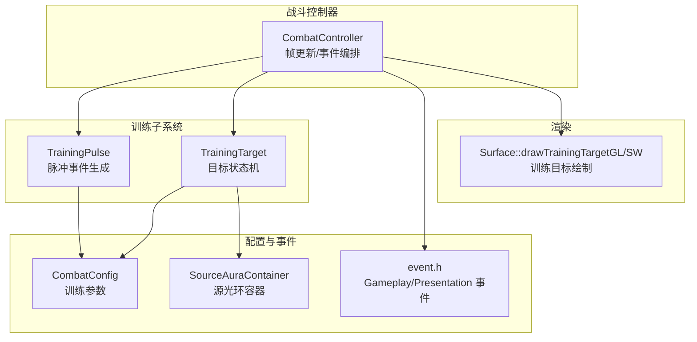
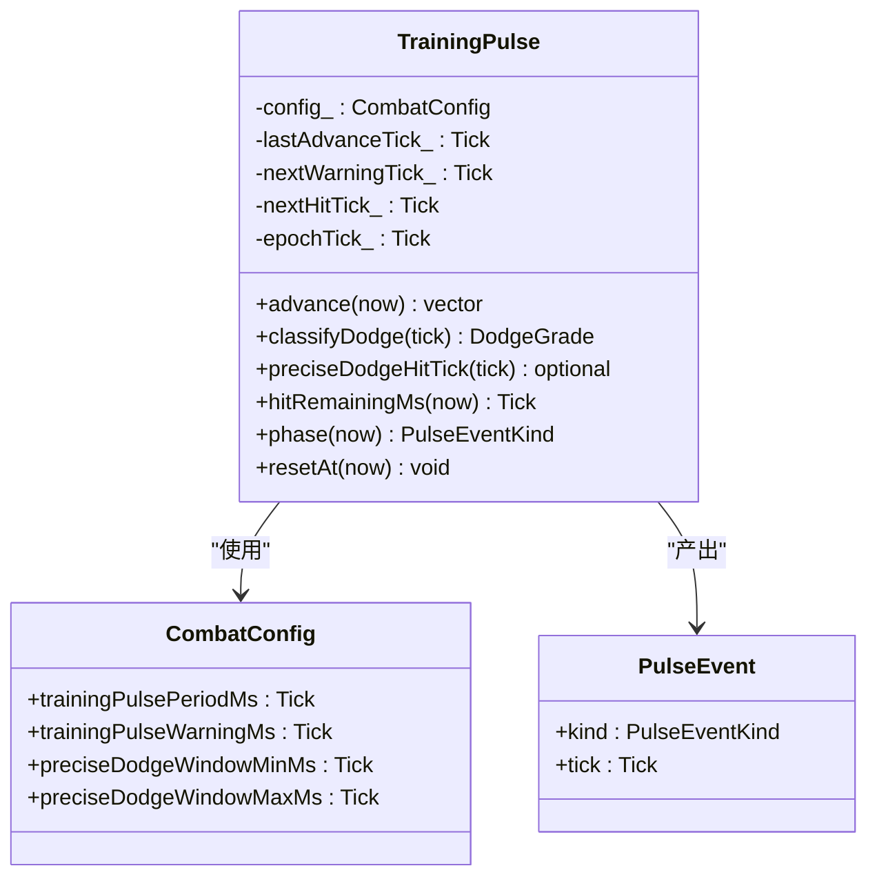
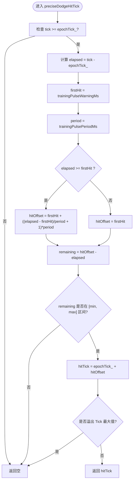
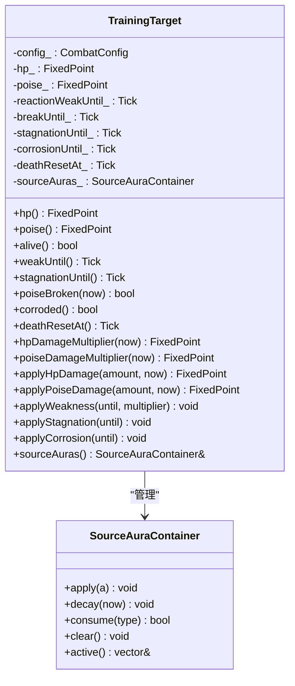
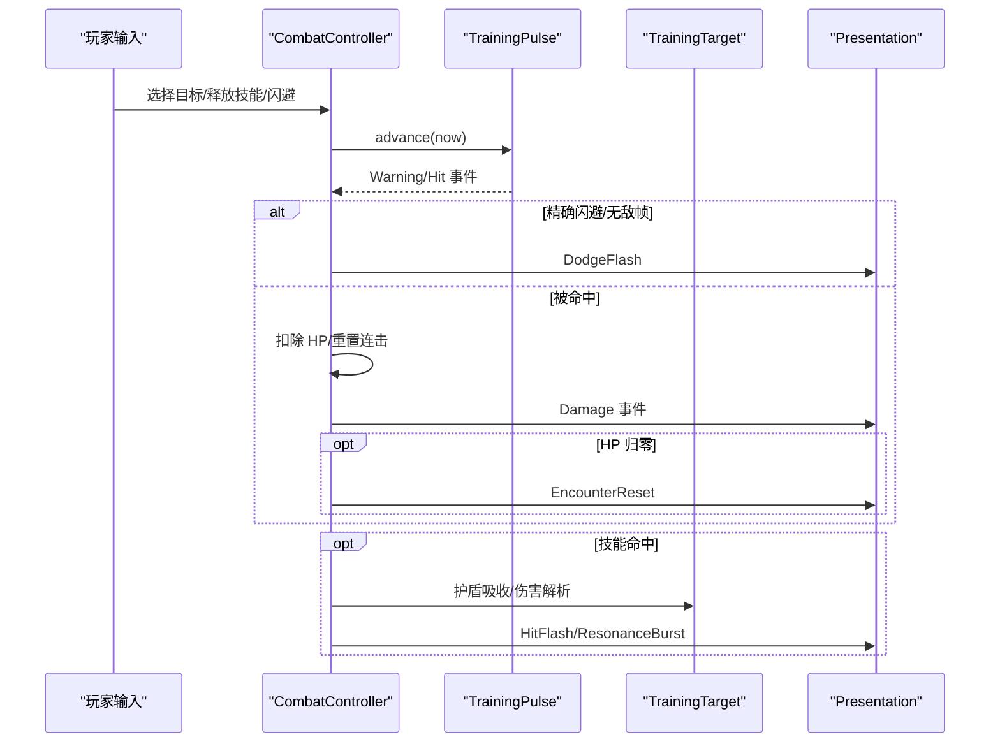
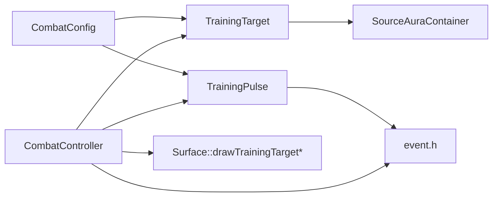

# 训练系统

<cite>
**本文引用的文件**   
- [training_pulse.h](file://native/gameplay/combat/training_pulse.h)
- [training_pulse.cpp](file://native/gameplay/combat/training_pulse.cpp)
- [training_target.h](file://native/gameplay/combat/training_target.h)
- [training_target.cpp](file://native/gameplay/combat/training_target.cpp)
- [combat_config.h](file://native/gameplay/combat/combat_config.h)
- [event.h](file://native/gameplay/combat/event.h)
- [source_aura.h](file://native/gameplay/combat/source_aura.h)
- [combat_controller.cpp](file://native/gameplay/combat/combat_controller.cpp)
- [surface.cpp](file://native/engine/render/surface.cpp)
- [test_training_pulse.cpp](file://tests/test_training_pulse.cpp)
</cite>

## 目录
1. [简介](#简介)
2. [项目结构](#项目结构)
3. [核心组件](#核心组件)
4. [架构总览](#架构总览)
5. [详细组件分析](#详细组件分析)
6. [依赖关系分析](#依赖关系分析)
7. [性能考量](#性能考量)
8. [故障排查指南](#故障排查指南)
9. [结论](#结论)
10. [附录：配置与自定义场景](#附录配置与自定义场景)

## 简介
本文件面向训练系统的实现与设计，重点解释 TrainingPulse（训练脉冲）与 TrainingTarget（训练目标）的数据结构、状态机与交互流程。文档涵盖以下要点：
- 训练模式的特殊规则：无伤害输出（对敌人）、无限资源（练习模式）、以及练习模式的行为特征。
- PulseEventKind（脉冲事件类型）与阶段转换逻辑。
- 训练目标的属性设置：生命值、护盾值、受击反馈、易伤/破韧/停滞/腐蚀等状态。
- 完整训练场景示例：从目标选择、脉冲发射到命中反馈的时序。
- 训练模式配置项与自定义训练场景的方法。

## 项目结构
训练系统位于 gameplay/combat 模块中，核心由“脉冲生成器”和“目标状态机”组成，并通过 CombatController 统一编排帧更新、动作决策与事件输出。渲染层提供训练目标的可视化绘制。



图表来源
- [combat_controller.cpp:30-151](file://native/gameplay/combat/combat_controller.cpp#L30-L151)
- [training_pulse.h:17-34](file://native/gameplay/combat/training_pulse.h#L17-L34)
- [training_target.h:6-43](file://native/gameplay/combat/training_target.h#L6-L43)
- [combat_config.h:45-55](file://native/gameplay/combat/combat_config.h#L45-L55)
- [event.h:42-96](file://native/gameplay/combat/event.h#L42-L96)
- [source_aura.h:3-10](file://native/gameplay/combat/source_aura.h#L3-L10)
- [surface.cpp:309-315](file://native/engine/render/surface.cpp#L309-L315)

章节来源
- [combat_controller.cpp:30-151](file://native/gameplay/combat/combat_controller.cpp#L30-L151)
- [training_pulse.h:17-34](file://native/gameplay/combat/training_pulse.h#L17-L34)
- [training_target.h:6-43](file://native/gameplay/combat/training_target.h#L6-L43)
- [combat_config.h:45-55](file://native/gameplay/combat/combat_config.h#L45-L55)
- [event.h:42-96](file://native/gameplay/combat/event.h#L42-L96)
- [source_aura.h:3-10](file://native/gameplay/combat/source_aura.h#L3-L10)
- [surface.cpp:309-315](file://native/engine/render/surface.cpp#L309-L315)

## 核心组件
- TrainingPulse：按周期生成 Warning/Hit 两类脉冲事件，支持精确闪避判定与剩余时间计算。
- TrainingTarget：维护 HP/韧性（Poise）、易伤/破韧/停滞/腐蚀等状态，处理伤害应用与自动重置。
- CombatConfig：集中管理训练相关参数（目标血量、韧性、脉冲周期、警告时长、伤害等），并提供校验回退。
- event.h：定义 Gameplay/Presentation 事件类型，用于训练阶段的视觉与玩法事件输出。
- SourceAuraContainer：为训练目标维护源光环（如折光/凝滞/崩解/共鸣爆发）的施加与衰减。
- CombatController：在训练模式下驱动 TrainingPulse 与 TrainingTarget，并输出事件。

章节来源
- [training_pulse.h:17-34](file://native/gameplay/combat/training_pulse.h#L17-L34)
- [training_target.h:6-43](file://native/gameplay/combat/training_target.h#L6-L43)
- [combat_config.h:45-55](file://native/gameplay/combat/combat_config.h#L45-L55)
- [event.h:42-96](file://native/gameplay/combat/event.h#L42-L96)
- [source_aura.h:3-10](file://native/gameplay/combat/source_aura.h#L3-L10)
- [combat_controller.cpp:30-151](file://native/gameplay/combat/combat_controller.cpp#L30-L151)

## 架构总览
训练模式下的帧更新主流程如下：
- 推进目标状态（TrainingTarget::advance）。
- 推进玩家动作资源与决策（ActionStateMachine）。
- 若为训练遭遇战，则推进 TrainingPulse 并处理其事件。
- 处理技能命中、护盾吸收、伤害解析、反应系统与共振增益。
- 刷新快照并排序事件输出。

```mermaid
sequenceDiagram
participant 输入 as "帧输入"
participant 控制器 as "CombatController"
participant 目标 as "TrainingTarget"
participant 脉冲 as "TrainingPulse"
participant 动作 as "ActionStateMachine"
participant 事件 as "事件队列"
输入->>控制器 : update(CombatFrameInput)
控制器->>目标 : advance(now)
控制器->>动作 : update(now, dt, context)
alt 训练遭遇战
控制器->>脉冲 : advance(now)
loop 遍历脉冲事件
控制器->>控制器 : 判断精确闪避/无敌帧
opt 命中玩家
控制器->>事件 : 推送 Damage/Dodge/EncounterReset
else 未命中或已闪避
控制器->>事件 : 推送 DodgeFlash
end
end
end
opt 有技能命中
控制器->>控制器 : 护盾吸收/伤害解析
控制器->>事件 : 推送 Hit/Damage/AuraApplied/Resonance
end
控制器->>控制器 : refreshSnapshot + sortEvents
```

图表来源
- [combat_controller.cpp:30-151](file://native/gameplay/combat/combat_controller.cpp#L30-L151)
- [training_pulse.cpp:12-32](file://native/gameplay/combat/training_pulse.cpp#L12-L32)
- [training_target.cpp:15-32](file://native/gameplay/combat/training_target.cpp#L15-L32)
- [event.h:42-96](file://native/gameplay/combat/event.h#L42-L96)

## 详细组件分析

### TrainingPulse（训练脉冲）
- 职责：以固定周期生成 Warning/Hit 事件；提供精确闪避窗口判定与距下次命中的剩余毫秒数；支持 epoch 重置。
- 关键方法：
  - advance(now)：推进时间并产出事件。
  - classifyDodge(tick)/preciseDodgeHitTick(tick)：判定是否为精确闪避及对应命中时刻。
  - hitRemainingMs(now)：返回距离下一次命中的剩余毫秒。
  - phase(now)：当前阶段（None/Warning/Hit）。
  - resetAt(now)：重置 epoch 与计时指针。
- 事件类型：PulseEventKind::None/Warning/Hit。
- 复杂度：每次 advance 最多产生常数个事件（按周期推进），时间复杂度 O(k)，k 为跨越的周期数。



图表来源
- [training_pulse.h:17-34](file://native/gameplay/combat/training_pulse.h#L17-L34)
- [training_pulse.cpp:12-82](file://native/gameplay/combat/training_pulse.cpp#L12-L82)
- [combat_config.h:20-55](file://native/gameplay/combat/combat_config.h#L20-L55)

章节来源
- [training_pulse.h:17-34](file://native/gameplay/combat/training_pulse.h#L17-L34)
- [training_pulse.cpp:12-82](file://native/gameplay/combat/training_pulse.cpp#L12-L82)
- [test_training_pulse.cpp:1-80](file://tests/test_training_pulse.cpp#L1-L80)

#### 精确闪避判定流程图


图表来源
- [training_pulse.cpp:38-55](file://native/gameplay/combat/training_pulse.cpp#L38-L55)
- [combat_config.h:20-55](file://native/gameplay/combat/combat_config.h#L20-L55)

### TrainingTarget（训练目标）
- 职责：维护目标的生命值与韧性，处理易伤、破韧、停滞、腐蚀等状态，并在死亡后按配置自动重置。
- 关键属性与方法：
  - hp()/poise()：查询当前生命与韧性。
  - alive()：存活判断。
  - weakUntil()/stagnationUntil()/poiseBroken()/corroded()：状态查询。
  - applyHpDamage()/applyPoiseDamage()：应用伤害，触发破韧/死亡重置。
  - applyWeakness()/applyStagnation()/applyCorrosion()：施加状态。
  - sourceAuras()：访问源光环容器。
- 自动重置：当 hp 归零时，记录 deathResetAt；advance 到达该时间点则 reset() 恢复初始状态。



图表来源
- [training_target.h:6-43](file://native/gameplay/combat/training_target.h#L6-L43)
- [source_aura.h:3-10](file://native/gameplay/combat/source_aura.h#L3-L10)

章节来源
- [training_target.h:6-43](file://native/gameplay/combat/training_target.h#L6-L43)
- [training_target.cpp:15-88](file://native/gameplay/combat/training_target.cpp#L15-L88)

### 训练模式特殊规则
- 无伤害输出：训练模式下，TrainingPulse 的 Hit 事件会对玩家造成伤害，但不对敌人造成实际伤害（训练目标仅作为靶子，不反击）。
- 无限资源：练习模式下，玩家资源（如耐力、冷却）不受限制，便于反复练习闪避与连招。
- 练习模式特点：
  - 通过 CombatController::updateAgainst(..., trainingEncounter=true) 启用训练逻辑。
  - 精确闪避成功会授予 Insight（洞察）并触发 Dodge 事件与闪烁表现。
  - 玩家被脉冲命中会扣除固定训练伤害，并重置连击段；HP 归零触发 EncounterReset。

章节来源
- [combat_controller.cpp:30-151](file://native/gameplay/combat/combat_controller.cpp#L30-L151)
- [event.h:42-96](file://native/gameplay/combat/event.h#L42-L96)

### 脉冲事件类型与阶段转换
- PulseEventKind：None（空闲）、Warning（预警）、Hit（命中）。
- 阶段转换：
  - 每周期开始先出现 Warning，持续至 trainingPulseWarningMs。
  - 到达 warning 阈值时切换为 Hit 事件。
  - 其余时间为 None。
- 判定依据：phase(now) 基于 (now - epochTick_) % period 与 warning 阈值的比较。

章节来源
- [training_pulse.h:9-15](file://native/gameplay/combat/training_pulse.h#L9-L15)
- [training_pulse.cpp:67-74](file://native/gameplay/combat/training_pulse.cpp#L67-L74)

### 训练目标属性与受击反馈
- 生命值与韧性：
  - 初始值来自 CombatConfig.trainingTargetHp / trainingTargetPoise。
  - applyHpDamage 扣减 HP，归零后设置 deathResetAt。
  - applyPoiseDamage 扣减韧性，归零后进入 breakUntil 时间段，期间受到训练破韧增伤倍率。
- 易伤/停滞/腐蚀：
  - applyWeakness 延长 reactionWeakUntil，提升 HP 伤害倍率。
  - applyStagnation 延长 stagnationUntil，提升韧性伤害倍率。
  - applyCorrosion 延长 corrosionUntil，标记目标处于腐蚀状态。
- 受击反馈：
  - 通过 GameplayEvent 的 Hit/Damage/AuraApplied/Resonance 等事件输出。
  - PresentationEvent 提供 HitFlash/DodgeFlash/ResonanceBurst 等表现事件。

章节来源
- [training_target.cpp:45-88](file://native/gameplay/combat/training_target.cpp#L45-L88)
- [event.h:42-96](file://native/gameplay/combat/event.h#L42-L96)

### 训练场景示例（端到端流程）
- 目标选择：CombatController::contextFor 根据输入 targetId 与目标存活状态决定上下文。
- 脉冲发射：TrainingPulse::advance 按周期产出 Warning/Hit 事件。
- 命中反馈：
  - 若精确闪避或无敌帧存在，输出 Dodge 与 DodgeFlash。
  - 否则对玩家扣除 trainingPulseDamage，触发 Damage 事件；HP 归零触发 EncounterReset。
  - 若有技能命中，进行护盾吸收、伤害解析、反应系统与共振增益，输出相应事件。



图表来源
- [combat_controller.cpp:30-151](file://native/gameplay/combat/combat_controller.cpp#L30-L151)
- [training_pulse.cpp:12-32](file://native/gameplay/combat/training_pulse.cpp#L12-L32)
- [event.h:42-96](file://native/gameplay/combat/event.h#L42-L96)

## 依赖关系分析
- TrainingPulse 依赖 CombatConfig 的训练参数（周期、警告时长、精确闪避窗口）。
- TrainingTarget 依赖 CombatConfig 的目标血量、韧性、破韧增伤、死亡重置时长等。
- CombatController 协调 TrainingPulse、TrainingTarget、ActionStateMachine、DamageResolver、ReactionSystem，并输出事件。
- 渲染层 Surface 负责训练目标的绘制（椭圆 billboard）。



图表来源
- [combat_config.h:45-55](file://native/gameplay/combat/combat_config.h#L45-L55)
- [training_pulse.cpp:12-32](file://native/gameplay/combat/training_pulse.cpp#L12-L32)
- [training_target.cpp:15-32](file://native/gameplay/combat/training_target.cpp#L15-L32)
- [combat_controller.cpp:30-151](file://native/gameplay/combat/combat_controller.cpp#L30-L151)
- [surface.cpp:309-315](file://native/engine/render/surface.cpp#L309-L315)

章节来源
- [combat_config.h:45-55](file://native/gameplay/combat/combat_config.h#L45-L55)
- [training_pulse.cpp:12-32](file://native/gameplay/combat/training_pulse.cpp#L12-L32)
- [training_target.cpp:15-32](file://native/gameplay/combat/training_target.cpp#L15-L32)
- [combat_controller.cpp:30-151](file://native/gameplay/combat/combat_controller.cpp#L30-L151)
- [surface.cpp:309-315](file://native/engine/render/surface.cpp#L309-L315)

## 性能考量
- TrainingPulse::advance 的时间复杂度与跨越的周期数成正比，通常很小；避免大时间步长导致批量事件堆积。
- TrainingTarget::advance 包含状态衰减与清理，均为常数操作。
- 事件排序与输出在控制器内完成，建议保持事件数量可控，避免过多 PresentationEvent 影响帧率。
- 渲染训练目标使用简单几何体（椭圆 billboard），开销较低。

[本节为通用指导，无需特定文件引用]

## 故障排查指南
- 脉冲事件未按期产出：
  - 检查 CombatConfig.trainingPulsePeriodMs 与 trainingPulseWarningMs 的设置是否合法（非负、warning <= period）。
  - 确认 TrainingPulse::resetAt 是否正确初始化 epoch。
- 精确闪避判定异常：
  - 验证 preciseDodgeWindowMinMs/maxMs 区间是否合理。
  - 确保 classifyDodge/preciseDodgeHitTick 使用的 epoch 与 tick 一致。
- 目标未自动重置：
  - 检查 deathResetAt 是否设置，且 advance 到达该时间点。
  - 确认 reset() 正确恢复 hp/poise 与状态。
- 事件缺失：
  - 核查 CombatController 的事件推送路径（Dodge/Hit/Damage/Resonance）。
  - 确认 PresentationEvent 与 GameplayEvent 的类型与字段。

章节来源
- [training_pulse.cpp:12-82](file://native/gameplay/combat/training_pulse.cpp#L12-L82)
- [training_target.cpp:15-88](file://native/gameplay/combat/training_target.cpp#L15-L88)
- [combat_controller.cpp:30-151](file://native/gameplay/combat/combat_controller.cpp#L30-L151)
- [event.h:42-96](file://native/gameplay/combat/event.h#L42-L96)

## 结论
训练系统通过 TrainingPulse 与 TrainingTarget 的协作，提供了稳定、可配置的练习环境。CombatController 将脉冲事件、动作决策与伤害解析整合，形成完整的训练闭环。借助 CombatConfig 的参数化配置，开发者可以灵活定制训练场景，满足不同的练习需求。

[本节为总结性内容，无需特定文件引用]

## 附录：配置与自定义场景
- 训练相关配置项（CombatConfig）：
  - trainingTargetHp：训练目标初始生命值。
  - trainingTargetPoise：训练目标初始韧性。
  - trainingBreakDurationMs：破韧持续时间。
  - trainingBreakDamageMultiplier：破韧期间增伤倍率。
  - trainingDeathResetMs：死亡后自动重置延迟。
  - trainingPlayerHp：训练模式下玩家初始生命值。
  - trainingPlayerPoise：训练模式下玩家初始韧性。
  - trainingPulsePeriodMs：脉冲周期。
  - trainingPulseWarningMs：脉冲预警时长。
  - trainingPulseDamage：脉冲对玩家的固定伤害。
  - preciseDodgeWindowMinMs/maxMs：精确闪避窗口范围。
- 自定义训练场景方法：
  - 修改 CombatConfig 默认值或运行时覆盖，以调整目标血量、韧性、脉冲节奏与伤害。
  - 通过 TrainingTarget::applyWeakness/applyStagnation/applyCorrosion 动态施加状态，改变受击反馈。
  - 在 CombatController::updateAgainst 中传入 trainingEncounter=true 启用训练模式。
  - 结合 SourceAuraContainer 施加不同源光环，观察反应系统与共振增益效果。

章节来源
- [combat_config.h:45-55](file://native/gameplay/combat/combat_config.h#L45-L55)
- [training_target.cpp:80-88](file://native/gameplay/combat/training_target.cpp#L80-L88)
- [combat_controller.cpp:30-151](file://native/gameplay/combat/combat_controller.cpp#L30-L151)
- [source_aura.h:3-10](file://native/gameplay/combat/source_aura.h#L3-L10)