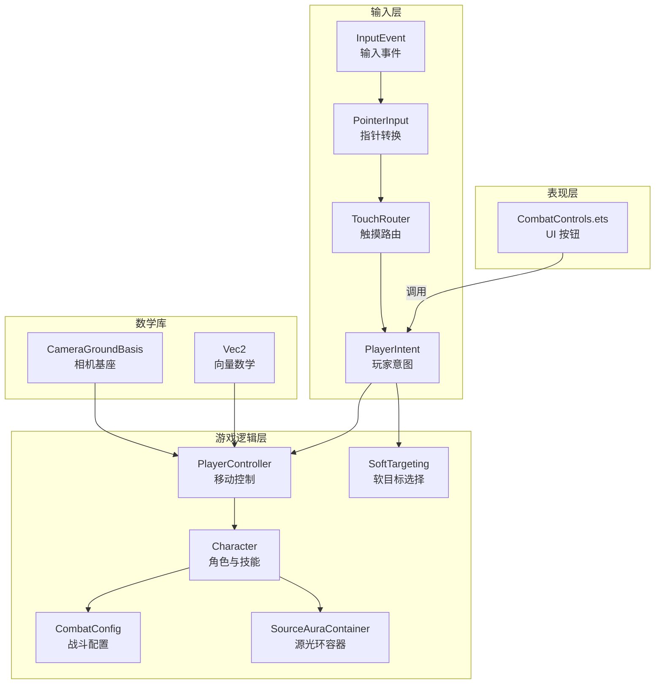
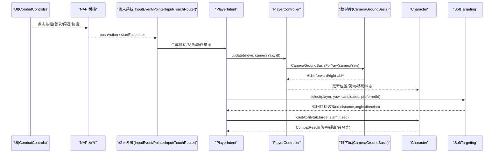
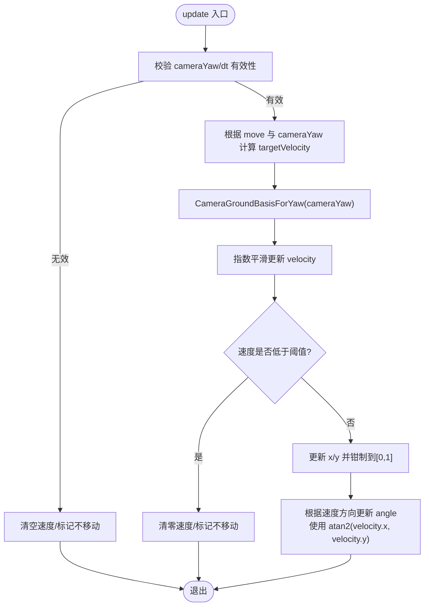
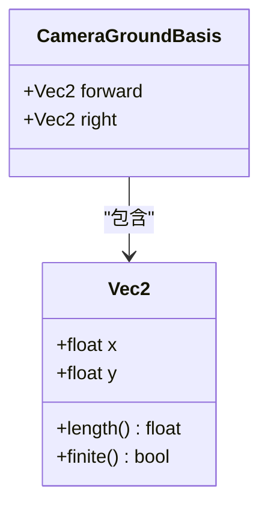
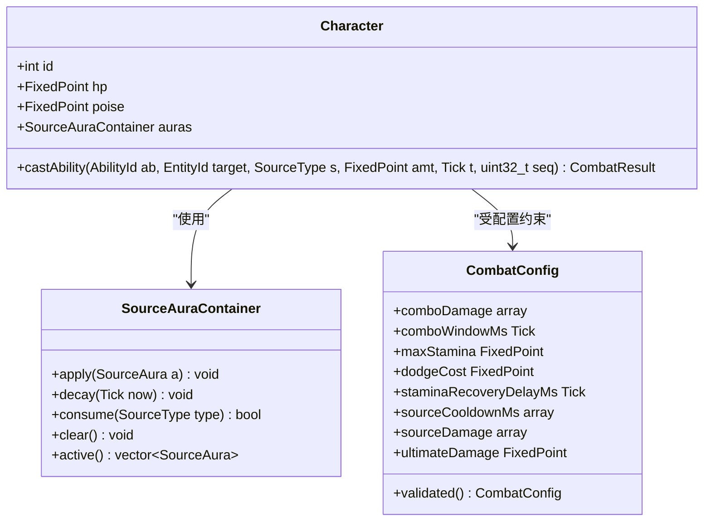
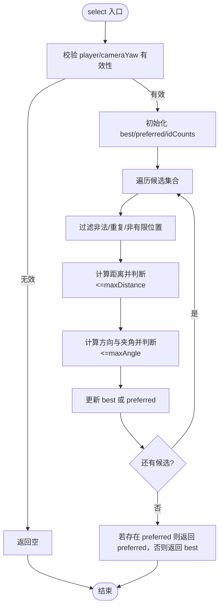
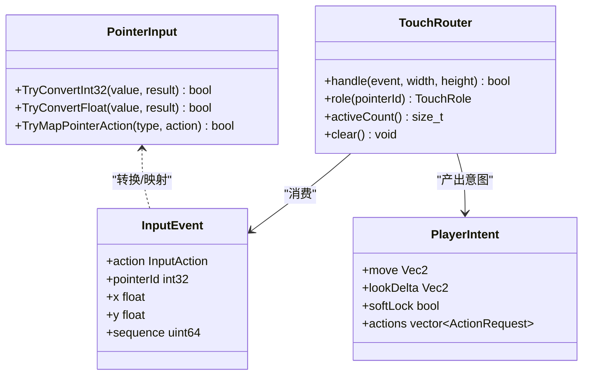
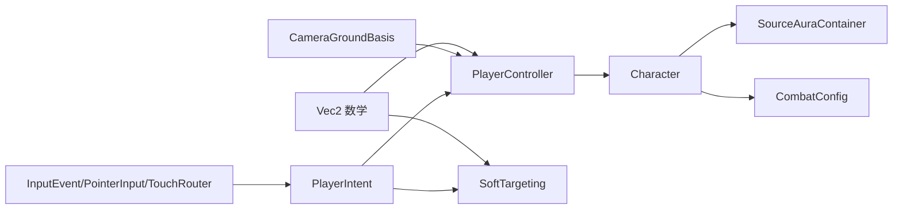

# 玩家控制系统

<cite>
**本文引用的文件**   
- [player_controller.h](file://native/gameplay/player/player_controller.h)
- [player_controller.cpp](file://native/gameplay/player/player_controller.cpp)
- [camera_ground_basis.h](file://native/engine/math/camera_ground_basis.h)
- [vec2.h](file://native/engine/math/vec2.h)
- [character.h](file://native/gameplay/player/character.h)
- [character.cpp](file://native/gameplay/player/character.cpp)
- [soft_targeting.h](file://native/gameplay/targeting/soft_targeting.h)
- [soft_targeting.cpp](file://native/gameplay/targeting/soft_targeting.cpp)
- [player_intent.h](file://native/engine/input/player_intent.h)
- [input_event.h](file://native/engine/input/input_event.h)
- [pointer_input.h](file://native/engine/input/pointer_input.h)
- [touch_router.h](file://native/engine/input/touch_router.h)
- [characters.json](file://config/dev/characters.json)
- [combat_config.h](file://native/gameplay/combat/combat_config.h)
- [source_aura.h](file://native/gameplay/combat/source_aura.h)
- [CombatControls.ets](file://entry/src/main/ets/ui/CombatControls.ets)
- [test_player_controller.cpp](file://tests/test_player_controller.cpp)
- [test_soft_targeting.cpp](file://tests/test_soft_targeting.cpp)
</cite>

## 更新摘要
**所做更改**   
- 更新了 PlayerController 的移动平滑处理和方向计算实现
- 新增了 CameraGroundBasisForYaw() 函数的详细说明
- 修正了 3D Y 轴旋转的角度计算方法
- 增强了移动控制的准确性和一致性

## 目录
1. [简介](#简介)
2. [项目结构](#项目结构)
3. [核心组件](#核心组件)
4. [架构总览](#架构总览)
5. [详细组件分析](#详细组件分析)
6. [依赖关系分析](#依赖关系分析)
7. [性能考虑](#性能考虑)
8. [故障排查指南](#故障排查指南)
9. [结论](#结论)
10. [附录](#附录)

## 简介
本文件为 my-world 的玩家控制系统提供系统化、可操作的技术文档，覆盖以下关键主题：
- PlayerController 的玩家输入处理与移动控制（含相机相对方向映射、平滑加速/减速、角度转向）
- Character 的角色状态管理与技能释放流程（含源光环、战斗配置、连招窗口）
- SoftTargeting 的软目标选择机制（距离计算、视野检测、优先级排序、首选目标保持）
- 输入映射配置、响应延迟处理与网络同步建议
- 玩家体验优化与防作弊设计最佳实践
- 具体操作示例：移动控制、瞄准射击、连招组合等

**最新更新**：PlayerController 已增强移动平滑处理和方向计算，使用新的 CameraGroundBasisForYaw() 函数进行一致的方向计算。修正了角度计算使用 atan2(player.velocity.x, player.velocity.y) 以正确处理 3D Y 轴旋转。

## 项目结构
围绕玩家控制的关键代码分布在 gameplay 与 engine/input 两个层次：
- gameplay/player：PlayerController、Character
- gameplay/targeting：SoftTargeting
- engine/input：InputEvent、PlayerIntent、PointerInput、TouchRouter
- engine/math：Vec2、CameraGroundBasis
- config/dev：角色基础配置
- entry/src/main/ets/ui：UI 触发入口（调试与动作按钮）

**图表来源**
- [player_intent.h:1-13](file://native/engine/input/player_intent.h#L1-L13)
- [input_event.h:1-24](file://native/engine/input/input_event.h#L1-L24)
- [pointer_input.h:1-36](file://native/engine/input/pointer_input.h#L1-L36)
- [touch_router.h:1-59](file://native/engine/input/touch_router.h#L1-L59)
- [player_controller.h:1-37](file://native/gameplay/player/player_controller.h#L1-L37)
- [character.h:1-6](file://native/gameplay/player/character.h#L1-L6)
- [soft_targeting.h:1-42](file://native/gameplay/targeting/soft_targeting.h#L1-L42)
- [combat_config.h:1-153](file://native/gameplay/combat/combat_config.h#L1-L153)
- [source_aura.h:1-11](file://native/gameplay/combat/source_aura.h#L1-L11)
- [camera_ground_basis.h:1-18](file://native/engine/math/camera_ground_basis.h#L1-L18)
- [vec2.h:1-24](file://native/engine/math/vec2.h#L1-L24)
- [CombatControls.ets:1-42](file://entry/src/main/ets/ui/CombatControls.ets#L1-L42)

## 核心组件
- PlayerController：负责将摇杆/虚拟手柄输入转换为世界空间速度，使用指数平滑实现启动/转向/停止无突跳；同时根据速度方向平滑更新角色朝向。
- Character：承载角色实体信息（ID、HP、Poise、源光环），并提供 castAbility 接口以释放技能并返回战斗结果。
- SoftTargeting：基于距离与视角角度的软锁定目标选择，支持首选目标保持与去重过滤，输出目标 ID、距离、角度与方向。
- 输入系统：InputEvent/PointerInput/TouchRouter 将原始指针事件转化为带角色的输入流，PlayerIntent 聚合移动、视角变化、软锁开关与动作请求。
- 数学库：Vec2 提供向量运算，CameraGroundBasis 提供相机基座计算，确保正确的 3D 坐标转换。
- 战斗配置：CombatConfig 集中管理连招窗口、耐力恢复、技能冷却、共鸣增益等数值，并提供校验回退。
- 源光环：SourceAuraContainer 维护当前生效的源光环，支持应用、衰减与消耗。

## 架构总览
下图展示从 UI 到游戏逻辑的数据与控制流：UI 触发动作 -> 生成 InputEvent -> PointerInput 转换 -> TouchRouter 分配角色 -> PlayerIntent 聚合 -> PlayerController 更新移动 -> Character 执行技能 -> SoftTargeting 选择目标。

**图表来源**
- [CombatControls.ets:1-42](file://entry/src/main/ets/ui/CombatControls.ets#L1-L42)
- [input_event.h:1-24](file://native/engine/input/input_event.h#L1-L24)
- [pointer_input.h:1-36](file://native/engine/input/pointer_input.h#L1-L36)
- [touch_router.h:1-59](file://native/engine/input/touch_router.h#L1-L59)
- [player_intent.h:1-13](file://native/engine/input/player_intent.h#L1-L13)
- [player_controller.cpp:1-80](file://native/gameplay/player/player_controller.cpp#L1-L80)
- [camera_ground_basis.h:14-17](file://native/engine/math/camera_ground_basis.h#L14-L17)
- [character.cpp:1-6](file://native/gameplay/player/character.cpp#L1-L6)
- [soft_targeting.cpp:1-77](file://native/gameplay/targeting/soft_targeting.cpp#L1-L77)

## 详细组件分析

### PlayerController：移动与朝向控制

**更新**：PlayerController 现在使用 CameraGroundBasisForYaw() 函数进行更精确的方向计算，并修正了 3D Y 轴旋转的角度计算方法。

- **输入映射**：将摇杆输入 move(x,y) 与相机 yaw 结合，通过 CameraGroundBasisForYaw() 获取正确的相机基座（forward 和 right 向量），按分量合成后乘以 speed。
- **平滑驱动**：采用指数插值因子 factor = 1 - exp(-sharpness * dt)，在加速与减速时分别使用 accelSharpness 与 decelSharpness，保证连续无突跳。
- **停止阈值**：当速度长度低于阈值时清零并标记 moving=false，避免无限滑行。
- **边界限制**：位置 x/y 被钳制到 [0,1]，防止越界。
- **朝向更新**：根据速度方向计算目标角度，使用最短角度差与 turnSpeed*dt 限制单帧最大转向，确保角度平滑过渡。**关键改进**：现在使用 `atan2(player.velocity.x, player.velocity.y)` 正确处理 3D Y 轴旋转，其中模型局部 +Z 为前方。

**图表来源**
- [player_controller.cpp:25-79](file://native/gameplay/player/player_controller.cpp#L25-L79)
- [camera_ground_basis.h:14-17](file://native/engine/math/camera_ground_basis.h#L14-L17)

**章节来源**
- [player_controller.h:1-37](file://native/gameplay/player/player_controller.h#L1-L37)
- [player_controller.cpp:1-80](file://native/gameplay/player/player_controller.cpp#L1-L80)
- [camera_ground_basis.h:1-18](file://native/engine/math/camera_ground_basis.h#L1-18)
- [test_player_controller.cpp:1-110](file://tests/test_player_controller.cpp#L1-110)

### CameraGroundBasis：相机基座计算

**新增**：CameraGroundBasis 结构体和 CameraGroundBasisForYaw() 函数提供了正确的 3D 坐标转换。

- **坐标系映射**：逻辑世界 (x, y) 映射到 3D 地面 (x, z)。在右手坐标系中，相机前方与屏幕右方必须组成正交基。
- **基座计算**：CameraGroundBasisForYaw() 根据 yaw 角度计算 forward 和 right 向量，确保正确的方向映射。
- **数学原理**：forward = {sin(yaw), cos(yaw)}，right = {-cos(yaw), sin(yaw)}，符合 3D 旋转的数学定义。

**图表来源**
- [camera_ground_basis.h:9-17](file://native/engine/math/camera_ground_basis.h#L9-L17)
- [vec2.h:4-16](file://native/engine/math/vec2.h#L4-L16)

**章节来源**
- [camera_ground_basis.h:1-18](file://native/engine/math/camera_ground_basis.h#L1-18)
- [vec2.h:1-24](file://native/engine/math/vec2.h#L1-24)

### Character：角色状态与技能释放
- 数据结构：包含 id、hp、poise、auras（源光环容器）。
- 技能释放：castAbility 接收 AbilityId、目标、SourceType、数值、时间戳与序列号，内部通过 auras.apply 施加源光环，并返回 CombatResult（伤害、硬直、共鸣类型等）。
- 与战斗配置联动：CombatConfig 定义连招窗口、耐力、冷却、共鸣增益等，影响 castAbility 的行为与返回值。

**图表来源**
- [character.h:1-6](file://native/gameplay/player/character.h#L1-L6)
- [character.cpp:1-6](file://native/gameplay/player/character.cpp#L1-L6)
- [source_aura.h:1-11](file://native/gameplay/combat/source_aura.h#L1-L11)
- [combat_config.h:1-153](file://native/gameplay/combat/combat_config.h#L1-L153)

**章节来源**
- [character.h:1-6](file://native/gameplay/player/character.h#L1-L6)
- [character.cpp:1-6](file://native/gameplay/player/character.cpp#L1-L6)
- [combat_config.h:1-153](file://native/gameplay/combat/combat_config.h#L1-L153)
- [source_aura.h:1-11](file://native/gameplay/combat/source_aura.h#L1-L11)

### SoftTargeting：软目标选择算法
- 候选过滤：仅接受 id>0、出现一次、位置有限且非零的目标；忽略重复 id 与非法坐标。
- 距离筛选：计算欧氏距离，超过 maxDistance 则丢弃。
- 视野检测：计算目标方向与相机前向的夹角，超过 maxAngle 则丢弃。
- 优先级排序：优先选择"首选目标"（preferredId），否则按 (angle, distance, id) 三元组升序比较，角度越小越优先，其次距离更近，最后 id 更小。
- 输出：返回 TargetSelection（id、distance、angle、direction）。

**图表来源**
- [soft_targeting.cpp:1-77](file://native/gameplay/targeting/soft_targeting.cpp#L1-L77)
- [soft_targeting.h:1-42](file://native/gameplay/targeting/soft_targeting.h#L1-L42)

**章节来源**
- [soft_targeting.h:1-42](file://native/gameplay/targeting/soft_targeting.h#L1-L42)
- [soft_targeting.cpp:1-77](file://native/gameplay/targeting/soft_targeting.cpp#L1-L77)
- [test_soft_targeting.cpp:1-181](file://tests/test_soft_targeting.cpp#L1-181)

### 输入系统与映射
- InputEvent：描述指针事件类型（按下、移动、抬起、取消）以及动作（攻击、闪避、辉印、脉流、蚀质、终结等），附带 pointerId、坐标与序列号。
- PointerInput：提供类型转换与映射工具，如 TryConvertInt32/Float、TryMapPointerAction。
- TouchRouter：根据屏幕左右半区分配触摸点角色（移动/摄像机），避免冲突，跟踪活跃触摸数量。
- PlayerIntent：聚合 move（二维向量）、lookDelta（视角增量）、softLock（软锁开关）与 actions（动作请求列表）。

**图表来源**
- [input_event.h:1-24](file://native/engine/input/input_event.h#L1-L24)
- [pointer_input.h:1-36](file://native/engine/input/pointer_input.h#L1-L36)
- [touch_router.h:1-59](file://native/engine/input/touch_router.h#L1-L59)
- [player_intent.h:1-13](file://native/engine/input/player_intent.h#L1-L13)

**章节来源**
- [input_event.h:1-24](file://native/engine/input/input_event.h#L1-L24)
- [pointer_input.h:1-36](file://native/engine/input/pointer_input.h#L1-L36)
- [touch_router.h:1-59](file://native/engine/input/touch_router.h#L1-L59)
- [player_intent.h:1-13](file://native/engine/input/player_intent.h#L1-L13)

### 动画状态同步（概念性说明）
- 移动动画：依据 PlayerController 输出的 velocity 与 moving 状态，驱动行走/待机动画混合。
- 攻击/技能动画：根据 Character::castAbility 返回的 CombatResult 中的伤害/硬直/共鸣类型，切换至攻击或施法动画，并在合适时机播放命中反馈。
- 朝向同步：将 PlayerController 计算的 angle 作为模型朝向，确保视觉一致。**更新**：现在使用正确的 3D Y 轴旋转角度，确保模型朝向与实际移动方向完全匹配。
- 网络同步：客户端本地预测动画播放，服务端权威判定命中与状态，客户端进行回滚修正与补帧。

## 依赖关系分析
- PlayerController 依赖 Vec2 数学库与固定步长 dt，对 cameraYaw 敏感，现在还依赖 CameraGroundBasis 进行正确的方向计算。
- Character 依赖 SourceAuraContainer 与 CombatConfig，用于资源管理与行为参数。
- SoftTargeting 依赖 Vec2 与标准库算法，对输入候选集顺序无关，具备鲁棒性。
- 输入子系统通过 InputEvent/PointerInput/TouchRouter 产生 PlayerIntent，供上层控制器消费。

**图表来源**
- [player_controller.h:1-37](file://native/gameplay/player/player_controller.h#L1-L37)
- [camera_ground_basis.h:1-18](file://native/engine/math/camera_ground_basis.h#L1-18)
- [soft_targeting.h:1-42](file://native/gameplay/targeting/soft_targeting.h#L1-L42)
- [character.h:1-6](file://native/gameplay/player/character.h#L1-L6)
- [source_aura.h:1-11](file://native/gameplay/combat/source_aura.h#L1-L11)
- [combat_config.h:1-153](file://native/gameplay/combat/combat_config.h#L1-L153)
- [input_event.h:1-24](file://native/engine/input/input_event.h#L1-L24)
- [pointer_input.h:1-36](file://native/engine/input/pointer_input.h#L1-L36)
- [touch_router.h:1-59](file://native/engine/input/touch_router.h#L1-L59)
- [player_intent.h:1-13](file://native/engine/input/player_intent.h#L1-L13)

**章节来源**
- [player_controller.h:1-37](file://native/gameplay/player/player_controller.h#L1-L37)
- [camera_ground_basis.h:1-18](file://native/engine/math/camera_ground_basis.h#L1-18)
- [soft_targeting.h:1-42](file://native/gameplay/targeting/soft_targeting.h#L1-L42)
- [character.h:1-6](file://native/gameplay/player/character.h#L1-L6)
- [source_aura.h:1-11](file://native/gameplay/combat/source_aura.h#L1-L11)
- [combat_config.h:1-153](file://native/gameplay/combat/combat_config.h#L1-L153)
- [input_event.h:1-24](file://native/engine/input/input_event.h#L1-L24)
- [pointer_input.h:1-36](file://native/engine/input/pointer_input.h#L1-L36)
- [touch_router.h:1-59](file://native/engine/input/touch_router.h#L1-L59)
- [player_intent.h:1-13](file://native/engine/input/player_intent.h#L1-L13)

## 性能考虑
- 指数平滑：factor = 1 - exp(-sharpness * dt) 避免了逐帧线性插值的抖动，减少 CPU 分支与条件判断。
- 停止阈值：速度低于阈值即清零，避免浮点拖尾导致的持续计算。
- 目标选择复杂度：SoftTargeting 单次扫描候选集 O(N)，使用 unordered_map 统计 id 出现次数，保证去重与顺序无关。
- 输入处理：PointerInput 的类型转换与映射为常量时间，TouchRouter 使用哈希表维护角色分配，查询与删除均为 O(1)。
- 推荐优化：批量更新玩家与目标、缓存相机前向向量、对候选集做空间分区（如网格/四叉树）以降低 N。

## 故障排查指南
- **移动异常（卡顿/滑移）**：检查 dt 是否为正数、cameraYaw 是否有限；确认 kStopSpeedThreshold 设置合理；验证加速/减速 sharpness 是否过大导致过冲。
- **方向计算错误**：确认 CameraGroundBasisForYaw() 函数正确调用；检查 atan2(player.velocity.x, player.velocity.y) 的参数顺序是否正确。
- **目标选择失败**：确认候选 id 唯一且有限；检查 maxDistance/maxAngle 配置；验证玩家位置与 yaw 是否有限。
- **技能未生效**：检查 CombatConfig 的冷却与窗口；确认 SourceAuraContainer 是否正确 apply/decay/consume；核对 castAbility 的参数与返回值。
- **输入冲突**：TouchRouter 可能将多余触摸点标记为 Ignored；检查 activeCount 与 role 分配逻辑。

**章节来源**
- [player_controller.cpp:1-80](file://native/gameplay/player/player_controller.cpp#L1-80)
- [camera_ground_basis.h:1-18](file://native/engine/math/camera_ground_basis.h#L1-18)
- [soft_targeting.cpp:1-77](file://native/gameplay/targeting/soft_targeting.cpp#L1-77)
- [character.cpp:1-6](file://native/gameplay/player/character.cpp#L1-6)
- [combat_config.h:1-153](file://native/gameplay/combat/combat_config.h#L1-L153)
- [source_aura.h:1-11](file://native/gameplay/combat/source_aura.h#L1-L11)
- [touch_router.h:1-59](file://native/engine/input/touch_router.h#L1-L59)

## 结论
my-world 的玩家控制系统以清晰的职责划分与稳健的数值处理为核心：**最新改进**包括使用 CameraGroundBasisForYaw() 函数进行一致的方向计算，以及修正 atan2(player.velocity.x, player.velocity.y) 以正确处理 3D Y 轴旋转。PlayerController 提供顺滑的移动与朝向更新，Character 通过 SourceAuraContainer 与 CombatConfig 实现技能与状态管理，SoftTargeting 提供稳定可靠的目标选择。输入系统通过标准化事件与路由机制，将 UI 与底层逻辑解耦。整体架构具备良好的扩展性与性能潜力，适合进一步集成网络同步与动画系统。

## 附录

### 玩家操作示例
- **移动控制**：按住左侧虚拟摇杆推动，PlayerController 根据 cameraYaw 映射世界方向，指数平滑加速/减速，最终达到稳态位移 speed*dt。**更新**：现在使用 CameraGroundBasisForYaw() 确保方向映射的准确性。
- **瞄准射击**：SoftTargeting 根据玩家位置与相机 yaw 筛选候选目标，优先首选目标，否则按角度/距离/id 排序；返回的方向可用于弹道或射线检测。
- **连招组合**：在 comboWindowMs 内连续触发 Attack/Dodge/Radiance/Pulse/Corruption/Ultimate，CombatConfig 决定伤害与硬直累积；Character::castAbility 返回结果驱动动画与状态机。

**章节来源**
- [test_player_controller.cpp:1-110](file://tests/test_player_controller.cpp#L1-110)
- [test_soft_targeting.cpp:1-181](file://tests/test_soft_targeting.cpp#L1-181)
- [combat_config.h:1-153](file://native/gameplay/combat/combat_config.h#L1-L153)
- [character.cpp:1-6](file://native/gameplay/player/character.cpp#L1-L6)

### 输入映射配置
- InputAction 枚举定义了所有可用动作（PointerDown/Move/Up/Cancel、Attack、Dodge、Radiance、Current、Corruption、Ultimate）。
- PointerInput 提供类型转换与映射工具，确保跨平台输入一致性。
- TouchRouter 将屏幕左/右区域分别映射为移动/摄像机控制，避免多指冲突。
- PlayerIntent 聚合 move、lookDelta、softLock 与 actions，供上层统一消费。

**章节来源**
- [input_event.h:1-24](file://native/engine/input/input_event.h#L1-L24)
- [pointer_input.h:1-36](file://native/engine/input/pointer_input.h#L1-L36)
- [touch_router.h:1-59](file://native/engine/input/touch_router.h#L1-L59)
- [player_intent.h:1-13](file://native/engine/input/player_intent.h#L1-L13)

### 响应延迟处理
- 指数平滑：factor = 1 - exp(-sharpness * dt) 天然引入一阶低通滤波，降低输入抖动与瞬时突变。
- 停止阈值：kStopSpeedThreshold 避免微小速度导致的持续更新。
- 建议：在网络环境下，客户端本地预测使用相同平滑策略，服务端权威校验并回滚差异。

**章节来源**
- [player_controller.cpp:1-80](file://native/gameplay/player/player_controller.cpp#L1-80)

### 网络同步机制（建议）
- 客户端：记录输入序列与本地预测状态（位置、朝向、动画阶段），快速响应。
- 服务端：权威判定移动合法性、目标命中、技能冷却与伤害结算，广播状态快照。
- 客户端：收到服务端快照后进行插值/补帧，修正动画与位置，保持流畅体验。

### 玩家体验优化与防作弊最佳实践
- **体验优化**：
  - 调整 accelSharpness/decelSharpness 以获得舒适的起步/停止手感。
  - 合理设置 maxDistance/maxAngle，提升软锁命中率与容错。
  - 在连招窗口内提供明确的视觉/音效反馈，增强打击感。
  - **更新**：利用改进的方向计算确保模型朝向与实际移动方向完全一致。
- **防作弊**：
  - 服务端校验移动速度与转向速率，拒绝异常瞬移或超快转向。
  - 目标选择与服务端碰撞检测一致，禁止客户端自定命中。
  - 技能冷却与资源消耗在服务端权威管理，客户端仅提交请求。

### 角色配置
- characters.json 定义角色基础属性（id、hp、poise），可在加载时注入 Character 实例。

**章节来源**
- [characters.json:1-2](file://config/dev/characters.json#L1-L2)

### 数学库增强
- **Vec2**：提供基础的向量运算功能，包括加法、减法、标量乘法、长度计算和有限性检查。
- **CameraGroundBasis**：新增的相机基座结构体，提供 forward 和 right 向量，用于正确的 3D 坐标转换。
- **ClampLength**：向量长度限制工具函数，确保输入向量不超过指定最大值。

**章节来源**
- [vec2.h:1-24](file://native/engine/math/vec2.h#L1-L24)
- [camera_ground_basis.h:1-18](file://native/engine/math/camera_ground_basis.h#L1-L18)