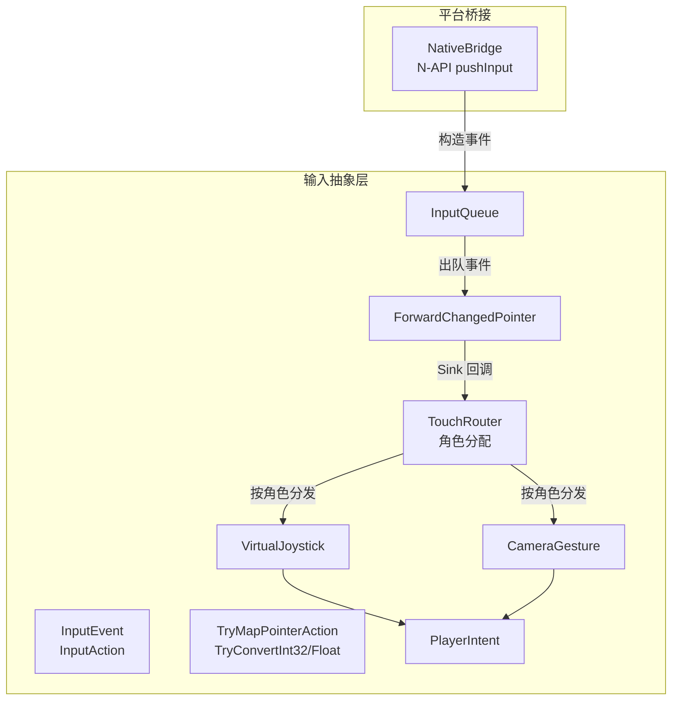
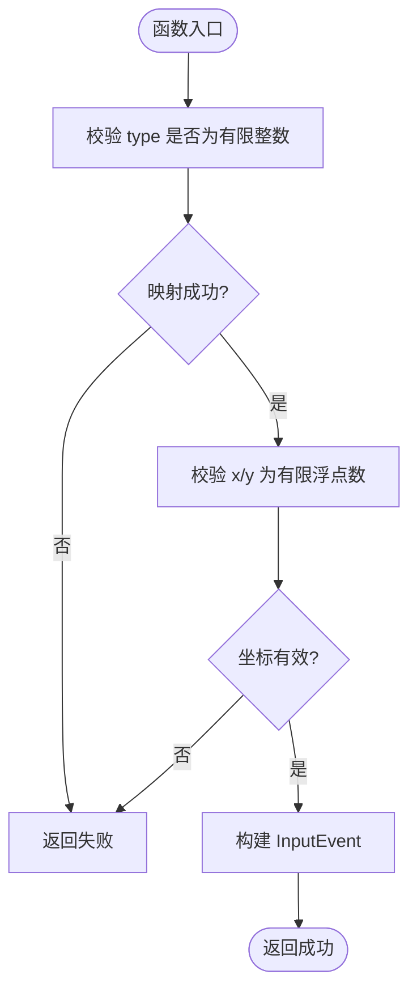
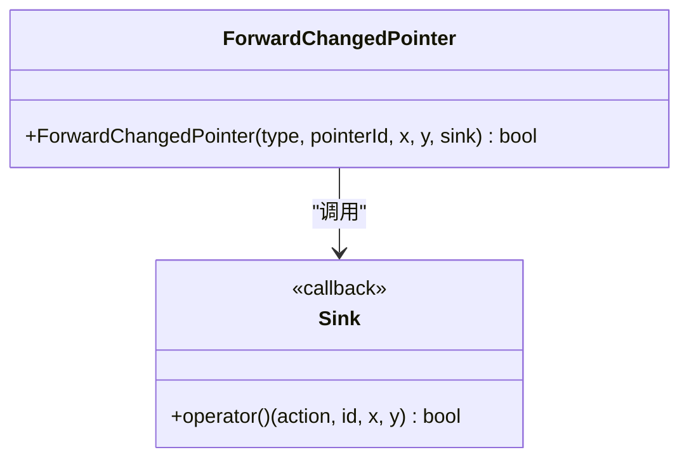
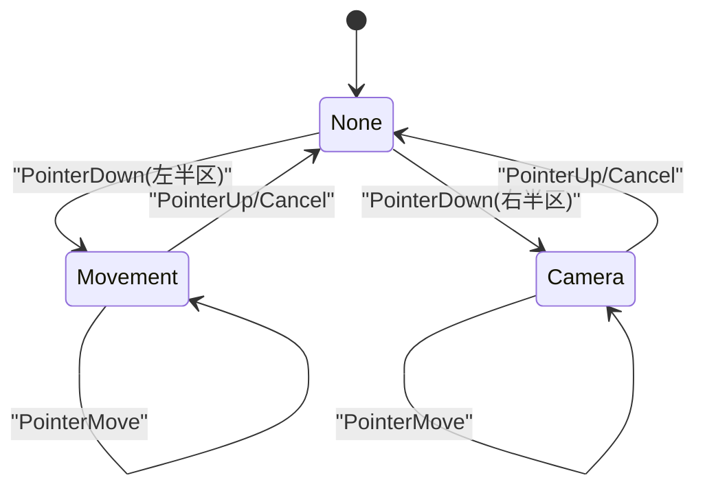
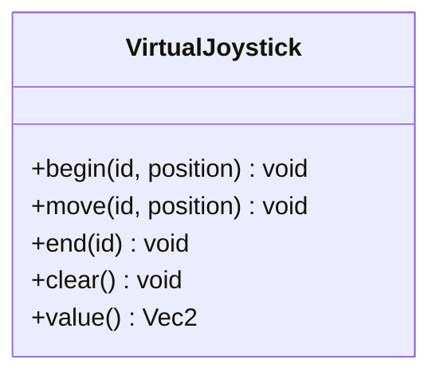
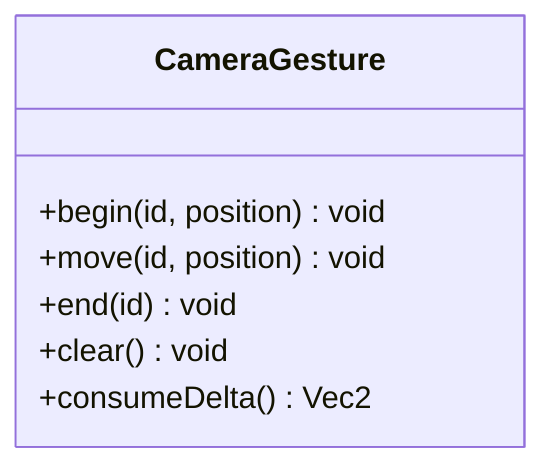
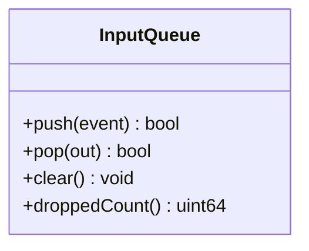
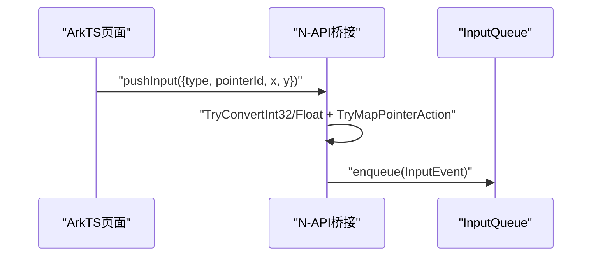
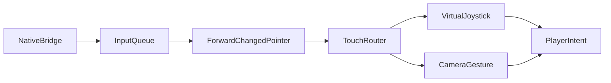

# 指针输入抽象层

<cite>
**本文引用的文件**   
- [pointer_input.h](file://native/engine/input/pointer_input.h)
- [input_event.h](file://native/engine/input/input_event.h)
- [changed_pointer_forwarder.h](file://native/engine/input/changed_pointer_forwarder.h)
- [touch_router.h](file://native/engine/input/touch_router.h)
- [virtual_joystick.h](file://native/engine/input/virtual_joystick.h)
- [camera_gesture.h](file://native/engine/input/camera_gesture.h)
- [input_queue.h](file://native/engine/input/input_queue.h)
- [player_intent.h](file://native/engine/input/player_intent.h)
- [test_pointer_input.cpp](file://tests/test_pointer_input.cpp)
- [test_changed_pointer_forwarding.cpp](file://tests/test_changed_pointer_forwarding.cpp)
- [test_input_queue.cpp](file://tests/test_input_queue.cpp)
- [native_bridge.cpp](file://entry/src/main/cpp/native_bridge.cpp)
</cite>

## 目录
1. [简介](#简介)
2. [项目结构](#项目结构)
3. [核心组件](#核心组件)
4. [架构总览](#架构总览)
5. [详细组件分析](#详细组件分析)
6. [依赖关系分析](#依赖关系分析)
7. [性能考量](#性能考量)
8. [故障排查指南](#故障排查指南)
9. [结论](#结论)
10. [附录](#附录)

## 简介
本技术文档围绕 my-world 的指针输入抽象层展开，重点解释以下目标：
- PointerInput 抽象与事件统一建模：通过 InputEvent、InputAction 等类型对多平台触控进行统一抽象。
- ChangedPointerForwarder 的事件转发机制：将平台侧“变化点”转换为标准事件并分发到下游处理链。
- 平台无关接口与适配差异：HarmonyOS 作为当前实现平台，桥接层负责坐标、缩放与密度适配；Android/iOS 可复用相同抽象。
- 坐标转换、缩放与屏幕密度适配：在桥接层完成数值校验与单位归一化，保证引擎内部使用一致的浮点坐标。
- 自定义设备集成、输入映射配置与调试工具：提供扩展点与测试用例，便于接入新设备与验证行为。
- 扩展点与插件式架构：基于 Sink 回调与路由策略（TouchRouter）解耦输入来源与消费端。

## 项目结构
输入子系统位于 native/engine/input 目录，采用头文件组织，职责清晰：
- 事件定义：input_event.h
- 指针动作映射与类型转换：pointer_input.h
- 变化点转发器：changed_pointer_forwarder.h
- 触控路由与角色分配：touch_router.h
- 虚拟摇杆与相机手势：virtual_joystick.h、camera_gesture.h
- 线程安全队列：input_queue.h
- 玩家意图聚合：player_intent.h
- 平台桥接入口：entry/src/main/cpp/native_bridge.cpp



图表来源
- [input_event.h:1-24](file://native/engine/input/input_event.h#L1-L24)
- [pointer_input.h:1-36](file://native/engine/input/pointer_input.h#L1-L36)
- [changed_pointer_forwarder.h:1-12](file://native/engine/input/changed_pointer_forwarder.h#L1-L12)
- [touch_router.h:1-59](file://native/engine/input/touch_router.h#L1-L59)
- [virtual_joystick.h:1-62](file://native/engine/input/virtual_joystick.h#L1-L62)
- [camera_gesture.h:1-54](file://native/engine/input/camera_gesture.h#L1-L54)
- [input_queue.h:1-47](file://native/engine/input/input_queue.h#L1-L47)
- [player_intent.h:1-13](file://native/engine/input/player_intent.h#L1-L13)
- [native_bridge.cpp:224-250](file://entry/src/main/cpp/native_bridge.cpp#L224-L250)

章节来源
- [input_event.h:1-24](file://native/engine/input/input_event.h#L1-L24)
- [pointer_input.h:1-36](file://native/engine/input/pointer_input.h#L1-L36)
- [changed_pointer_forwarder.h:1-12](file://native/engine/input/changed_pointer_forwarder.h#L1-L12)
- [touch_router.h:1-59](file://native/engine/input/touch_router.h#L1-L59)
- [virtual_joystick.h:1-62](file://native/engine/input/virtual_joystick.h#L1-L62)
- [camera_gesture.h:1-54](file://native/engine/input/camera_gesture.h#L1-L54)
- [input_queue.h:1-47](file://native/engine/input/input_queue.h#L1-L47)
- [player_intent.h:1-13](file://native/engine/input/player_intent.h#L1-L13)
- [native_bridge.cpp:224-250](file://entry/src/main/cpp/native_bridge.cpp#L224-L250)

## 核心组件
- InputEvent/InputAction：统一的输入事件结构与动作枚举，包含 pointerId、x/y 坐标与序列号，确保跨平台一致性。
- TryMapPointerAction/TryConvert*：将平台原始 type 映射为 InputAction，并对坐标与 ID 做严格数值校验，防止非法值进入引擎。
- ForwardChangedPointer：以模板 Sink 形式将“变化点”转换为标准事件并投递给下游，屏蔽平台差异。
- TouchRouter：根据 x 坐标划分左右区域，为每个 pointerId 分配 Movement/Camera/Ignored/None 角色，维护活跃指针集合。
- VirtualJoystick/CameraGesture：分别处理移动向量与相机相对位移，输出稳定的 Vec2 增量或方向。
- InputQueue：线程安全的有界队列，承载从平台侧入队的输入事件，支持并发生产与消费。
- PlayerIntent：聚合移动、视角与战斗动作请求，供上层游戏逻辑消费。

章节来源
- [input_event.h:1-24](file://native/engine/input/input_event.h#L1-L24)
- [pointer_input.h:1-36](file://native/engine/input/pointer_input.h#L1-L36)
- [changed_pointer_forwarder.h:1-12](file://native/engine/input/changed_pointer_forwarder.h#L1-L12)
- [touch_router.h:1-59](file://native/engine/input/touch_router.h#L1-L59)
- [virtual_joystick.h:1-62](file://native/engine/input/virtual_joystick.h#L1-L62)
- [camera_gesture.h:1-54](file://native/engine/input/camera_gesture.h#L1-L54)
- [input_queue.h:1-47](file://native/engine/input/input_queue.h#L1-L47)
- [player_intent.h:1-13](file://native/engine/input/player_intent.h#L1-L13)

## 架构总览
输入系统采用“平台桥接 → 事件队列 → 变化点转发 → 路由与手势处理 → 玩家意图”的分层设计。平台侧仅负责采集与校验，核心逻辑完全与平台解耦。

```mermaid
sequenceDiagram
participant Platform as "平台侧(HarmonyOS)"
participant Bridge as "NativeBridge(N-API)"
participant Queue as "InputQueue"
participant Loop as "游戏循环"
participant Router as "TouchRouter"
participant Joystick as "VirtualJoystick"
participant Camera as "CameraGesture"
participant Intent as "PlayerIntent"
Platform->>Bridge : "pushInput(type, pointerId, x, y)"
Bridge->>Bridge : "数值校验与类型映射"
Bridge->>Queue : "enqueue(InputEvent)"
Loop->>Queue : "pop(out)"
Loop->>Loop : "ForwardChangedPointer(..., sink)"
Loop->>Router : "handle(event, width, height)"
alt 角色为 Movement
Loop->>Joystick : "begin/move/end"
Joystick-->>Intent : "move = Vec2"
else 角色为 Camera
Loop->>Camera : "begin/move/end"
Camera-->>Intent : "lookDelta = Vec2"
end
Intent-->>Loop : "聚合后的玩家意图"
```

图表来源
- [native_bridge.cpp:224-250](file://entry/src/main/cpp/native_bridge.cpp#L224-L250)
- [input_queue.h:1-47](file://native/engine/input/input_queue.h#L1-L47)
- [changed_pointer_forwarder.h:1-12](file://native/engine/input/changed_pointer_forwarder.h#L1-L12)
- [touch_router.h:1-59](file://native/engine/input/touch_router.h#L1-L59)
- [virtual_joystick.h:1-62](file://native/engine/input/virtual_joystick.h#L1-L62)
- [camera_gesture.h:1-54](file://native/engine/input/camera_gesture.h#L1-L54)
- [player_intent.h:1-13](file://native/engine/input/player_intent.h#L1-L13)

## 详细组件分析

### 事件与类型转换（InputEvent、TryMapPointerAction、TryConvert*）
- InputEvent 提供 action、pointerId、x、y、sequence 字段，确保事件有序且可追踪。
- TryMapPointerAction 将平台 type（如 0/1/2/3）映射为 PointerDown/Up/Move/Cancel，非法值直接拒绝。
- TryConvertInt32/TryConvertFloat 对坐标与 ID 做范围与有限性检查，避免 NaN/Inf 污染后续计算。



图表来源
- [pointer_input.h:1-36](file://native/engine/input/pointer_input.h#L1-L36)
- [input_event.h:1-24](file://native/engine/input/input_event.h#L1-L24)

章节来源
- [pointer_input.h:1-36](file://native/engine/input/pointer_input.h#L1-L36)
- [input_event.h:1-24](file://native/engine/input/input_event.h#L1-L24)
- [test_pointer_input.cpp:1-34](file://tests/test_pointer_input.cpp#L1-L34)

### 变化点转发器（ForwardChangedPointer）
- 接收平台“变化点”参数（type、pointerId、x、y），调用 TryMapPointerAction 得到标准动作。
- 通过模板 Sink 回调将事件传递给下游（例如路由与手势处理器）。
- 若映射失败则直接返回，不产生副作用。



图表来源
- [changed_pointer_forwarder.h:1-12](file://native/engine/input/changed_pointer_forwarder.h#L1-L12)
- [pointer_input.h:1-36](file://native/engine/input/pointer_input.h#L1-L36)

章节来源
- [changed_pointer_forwarder.h:1-12](file://native/engine/input/changed_pointer_forwarder.h#L1-L12)
- [test_changed_pointer_forwarding.cpp:1-92](file://tests/test_changed_pointer_forwarding.cpp#L1-L92)

### 触控路由（TouchRouter）
- 根据 event.x 与屏幕宽度判断左右半区，为首次 PointerDown 分配 Movement（左）或 Camera（右）角色。
- 维护 pointerId→role 的映射，PointerUp/Cancel 时清理状态。
- 提供 activeCount() 与 role(pointerId) 查询，便于上层同步 UI 或调试。



图表来源
- [touch_router.h:1-59](file://native/engine/input/touch_router.h#L1-L59)

章节来源
- [touch_router.h:1-59](file://native/engine/input/touch_router.h#L1-L59)
- [test_changed_pointer_forwarding.cpp:1-92](file://tests/test_changed_pointer_forwarding.cpp#L1-L92)

### 虚拟摇杆（VirtualJoystick）
- begin/move/end 生命周期管理，记录 origin 与 value。
- 使用 deadZone 与 radius 控制死区与归一化半径，输出 [-1,1] 范围的 Vec2。
- move 中按 -y 翻转坐标系以匹配引擎习惯。



图表来源
- [virtual_joystick.h:1-62](file://native/engine/input/virtual_joystick.h#L1-L62)

章节来源
- [virtual_joystick.h:1-62](file://native/engine/input/virtual_joystick.h#L1-L62)
- [test_changed_pointer_forwarding.cpp:1-92](file://tests/test_changed_pointer_forwarding.cpp#L1-L92)

### 相机手势（CameraGesture）
- 累积 delta 并按 sensitivityX/Y 缩放，输出 lookDelta。
- 仅在 pointerId 一致且坐标有限时更新 previous 与 accumulated。
- consumeDelta 一次性取出并清空累积值，保证帧间确定性。



图表来源
- [camera_gesture.h:1-54](file://native/engine/input/camera_gesture.h#L1-L54)

章节来源
- [camera_gesture.h:1-54](file://native/engine/input/camera_gesture.h#L1-L54)
- [test_changed_pointer_forwarding.cpp:1-92](file://tests/test_changed_pointer_forwarding.cpp#L1-L92)

### 输入队列（InputQueue）
- 有界队列，容量满时丢弃并计数 droppedCount。
- push/pop/clear 均加锁保护，支持多线程并发。
- 测试覆盖顺序性与并发场景，确保 sequence 单调递增。



图表来源
- [input_queue.h:1-47](file://native/engine/input/input_queue.h#L1-L47)

章节来源
- [input_queue.h:1-47](file://native/engine/input/input_queue.h#L1-L47)
- [test_input_queue.cpp:1-50](file://tests/test_input_queue.cpp#L1-L50)

### 玩家意图（PlayerIntent）
- 聚合 move（来自摇杆）、lookDelta（来自相机手势）与 actions（战斗动作请求）。
- softLock 标志用于软锁定目标选择。
- 由上层消费后驱动角色移动、摄像机旋转与战斗系统。

章节来源
- [player_intent.h:1-13](file://native/engine/input/player_intent.h#L1-L13)

### 平台桥接（HarmonyOS N-API）
- NativeBridge::pushInput 解析 JSON 参数，执行数值校验与类型映射，再入队 InputEvent。
- 使用 changedTouches 作为单一触控源，避免重复采集。
- 坐标与 ID 必须为有限数，否则抛出类型错误。



图表来源
- [native_bridge.cpp:224-250](file://entry/src/main/cpp/native_bridge.cpp#L224-L250)
- [pointer_input.h:1-36](file://native/engine/input/pointer_input.h#L1-L36)

章节来源
- [native_bridge.cpp:224-250](file://entry/src/main/cpp/native_bridge.cpp#L224-L250)

## 依赖关系分析
- 低耦合：ForwardChangedPointer 通过 Sink 回调解耦上游平台与下游路由/手势。
- 高内聚：TouchRouter/VirtualJoystick/CameraGesture 各自维护状态，职责单一。
- 线程安全：InputQueue 使用互斥锁保护，避免竞态。
- 可扩展：新增手势或路由规则只需实现相应类并通过 Sink 接入。



图表来源
- [native_bridge.cpp:224-250](file://entry/src/main/cpp/native_bridge.cpp#L224-L250)
- [input_queue.h:1-47](file://native/engine/input/input_queue.h#L1-L47)
- [changed_pointer_forwarder.h:1-12](file://native/engine/input/changed_pointer_forwarder.h#L1-L12)
- [touch_router.h:1-59](file://native/engine/input/touch_router.h#L1-L59)
- [virtual_joystick.h:1-62](file://native/engine/input/virtual_joystick.h#L1-L62)
- [camera_gesture.h:1-54](file://native/engine/input/camera_gesture.h#L1-L54)
- [player_intent.h:1-13](file://native/engine/input/player_intent.h#L1-L13)

章节来源
- [input_queue.h:1-47](file://native/engine/input/input_queue.h#L1-L47)
- [changed_pointer_forwarder.h:1-12](file://native/engine/input/changed_pointer_forwarder.h#L1-L12)
- [touch_router.h:1-59](file://native/engine/input/touch_router.h#L1-L59)
- [virtual_joystick.h:1-62](file://native/engine/input/virtual_joystick.h#L1-L62)
- [camera_gesture.h:1-54](file://native/engine/input/camera_gesture.h#L1-L54)
- [player_intent.h:1-13](file://native/engine/input/player_intent.h#L1-L13)
- [native_bridge.cpp:224-250](file://entry/src/main/cpp/native_bridge.cpp#L224-L250)

## 性能考量
- 事件入队与出队均为 O(1)，但需考虑队列容量与丢包率监控（droppedCount）。
- TouchRouter 使用 unordered_map，平均 O(1) 查找与插入，适合多指场景。
- VirtualJoystick/CameraGesture 的 move 操作为常数时间，无动态分配。
- 建议在高负载下增大队列容量，或在消费端快速处理以避免堆积。

[本节为通用指导，无需引用具体文件]

## 故障排查指南
- 常见错误：
  - type 不在 0~3 范围：TryMapPointerAction 返回失败，检查平台侧事件类型。
  - x/y 非有限数：TryConvertFloat 拒绝，检查屏幕坐标与缩放系数。
  - pointerId 非整数：TryConvertInt32 拒绝，检查平台传递的 ID 类型。
  - 队列溢出：droppedCount 增长，需提升消费频率或扩容。
- 调试建议：
  - 使用 test_changed_pointer_forwarding 模拟快照流，验证路由与手势联动。
  - 使用 test_input_queue 验证并发与顺序性。
  - 在 Sink 回调中打印事件序列与角色变化，定位异常分支。

章节来源
- [test_pointer_input.cpp:1-34](file://tests/test_pointer_input.cpp#L1-L34)
- [test_changed_pointer_forwarding.cpp:1-92](file://tests/test_changed_pointer_forwarding.cpp#L1-L92)
- [test_input_queue.cpp:1-50](file://tests/test_input_queue.cpp#L1-L50)
- [input_queue.h:1-47](file://native/engine/input/input_queue.h#L1-L47)
- [pointer_input.h:1-36](file://native/engine/input/pointer_input.h#L1-L36)

## 结论
my-world 的指针输入抽象层通过统一事件模型、严格的数值校验与模板化的事件转发，实现了平台无关的输入处理。TouchRouter 与手势组件解耦了触控语义与业务逻辑，InputQueue 保障并发安全。该设计易于扩展至 Android/iOS，并提供完善的测试与调试手段。

[本节为总结，无需引用具体文件]

## 附录

### 平台适配差异（HarmonyOS、Android、iOS）
- HarmonyOS：
  - 使用 changedTouches 作为唯一触控源，经 N-API 注入队列。
  - 坐标与 ID 在桥接层进行有限性与类型校验。
- Android/iOS：
  - 可复用同一套 InputEvent/ForwardChangedPointer/TrouRouter 抽象。
  - 平台侧仅需将原生触摸事件转换为 (type, pointerId, x, y) 并调用 pushInput。
  - 注意屏幕密度与缩放：建议在桥接层将物理像素转换为引擎逻辑像素。

[本节为概念性说明，无需引用具体文件]

### 坐标转换、缩放与屏幕密度适配
- 桥接层应完成：
  - 物理像素 → 逻辑像素的转换（依据 DPI/缩放因子）。
  - 坐标有限性校验与范围裁剪。
  - 坐标系方向统一（如 Y 轴向上/向下）。
- 引擎内部统一使用 float 坐标，避免精度问题。

[本节为概念性说明，无需引用具体文件]

### 自定义输入设备集成指南
- 步骤：
  - 在平台侧将设备事件转换为 (type, pointerId, x, y)。
  - 调用 pushInput 入队。
  - 在 Sink 回调中根据需求扩展路由或手势处理。
- 注意事项：
  - 保持 pointerId 稳定，避免重复分配。
  - 确保 type 映射正确，必要时扩展 TryMapPointerAction。

[本节为概念性说明，无需引用具体文件]

### 输入映射配置
- VirtualJoystickConfig：deadZone、radius。
- CameraGestureConfig：sensitivityX、sensitivityY。
- 可通过配置文件或运行时参数调整，影响移动与视角灵敏度。

章节来源
- [virtual_joystick.h:1-62](file://native/engine/input/virtual_joystick.h#L1-L62)
- [camera_gesture.h:1-54](file://native/engine/input/camera_gesture.h#L1-L54)

### 输入调试工具使用方法
- 单元测试：
  - test_changed_pointer_forwarding：模拟快照流，验证路由与手势联动。
  - test_input_queue：验证并发与顺序性。
  - test_pointer_input：验证类型映射与数值转换。
- 日志建议：
  - 在 Sink 回调中记录事件序列、角色变化与手势输出。
  - 监控 InputQueue.droppedCount 评估吞吐压力。

章节来源
- [test_changed_pointer_forwarding.cpp:1-92](file://tests/test_changed_pointer_forwarding.cpp#L1-L92)
- [test_input_queue.cpp:1-50](file://tests/test_input_queue.cpp#L1-L50)
- [test_pointer_input.cpp:1-34](file://tests/test_pointer_input.cpp#L1-L34)

### 扩展点与插件架构设计
- Sink 回调：允许任意下游处理器订阅事件，无需修改转发器。
- 路由策略：TouchRouter 可按策略分配角色，支持未来扩展更多触控模式。
- 手势组件：新增手势只需实现 begin/move/end/consume 接口并接入 Sink。

[本节为概念性说明，无需引用具体文件]