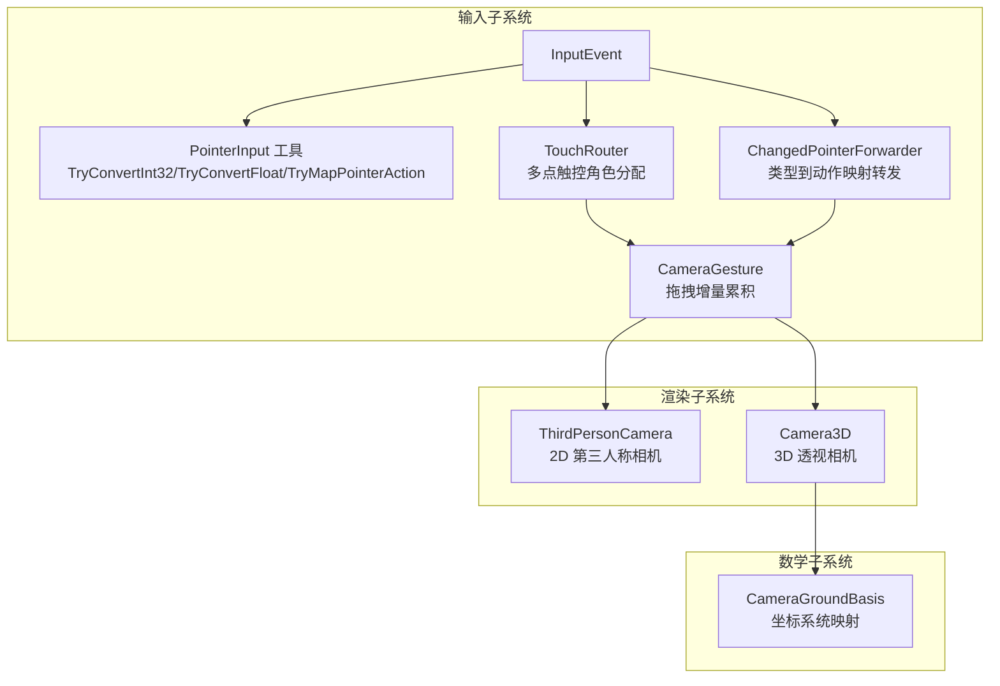
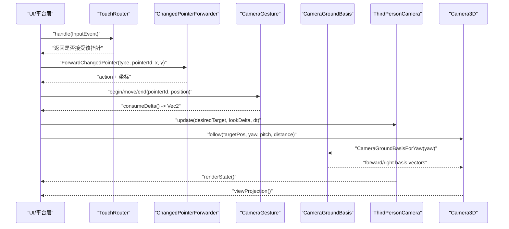
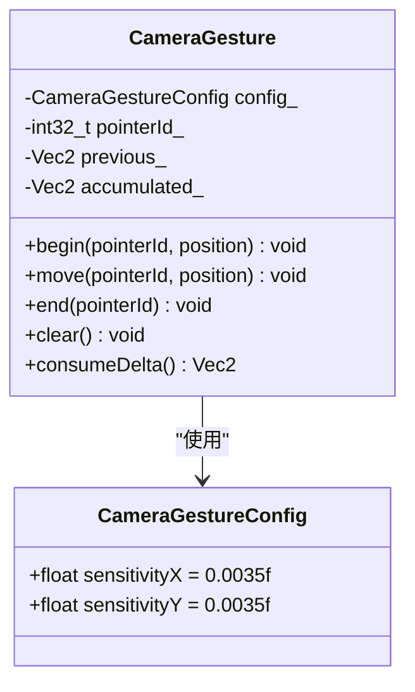
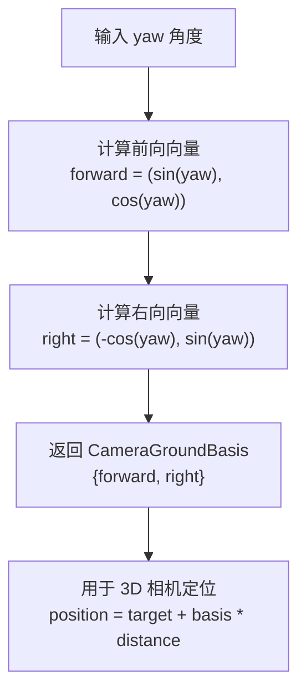
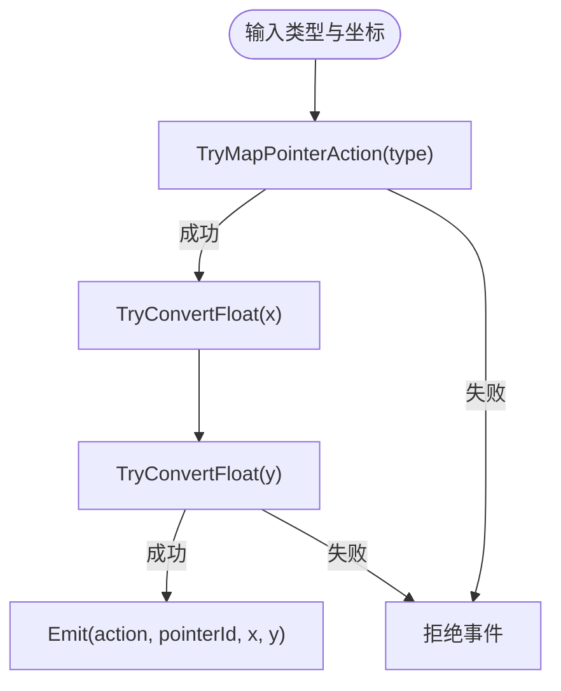
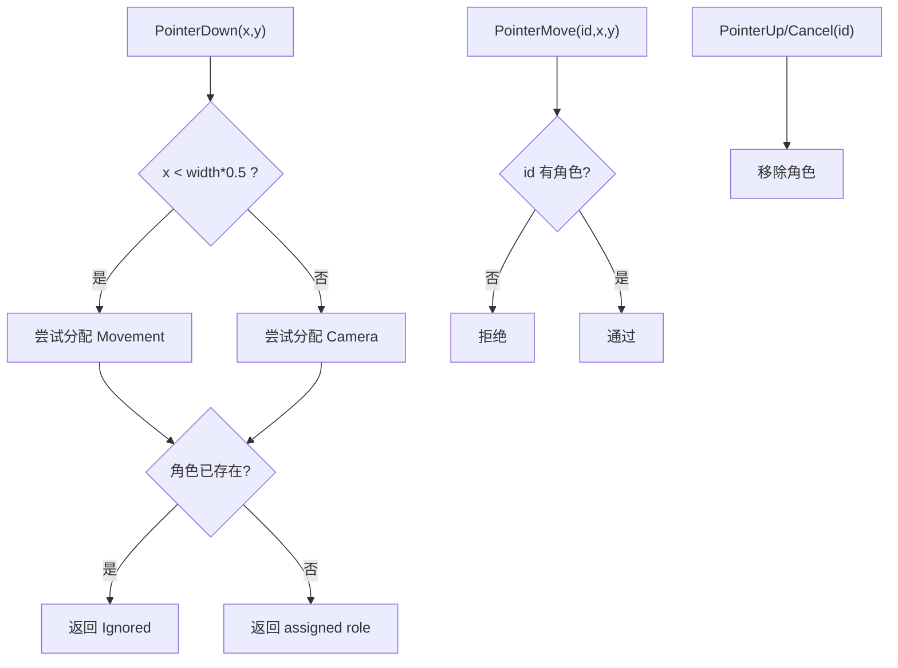
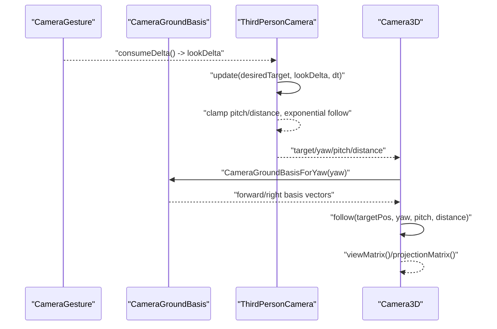
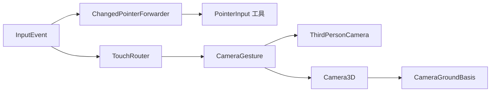

# 相机手势识别

<cite>
**本文引用的文件**   
- [camera_gesture.h](file://native/engine/input/camera_gesture.h)
- [pointer_input.h](file://native/engine/input/pointer_input.h)
- [touch_router.h](file://native/engine/input/touch_router.h)
- [input_event.h](file://native/engine/input/input_event.h)
- [changed_pointer_forwarder.h](file://native/engine/input/changed_pointer_forwarder.h)
- [camera.h](file://native/engine/render/camera.h)
- [camera.cpp](file://native/engine/render/camera.cpp)
- [camera3d.h](file://native/engine/render/camera3d.h)
- [camera3d.cpp](file://native/engine/render/camera3d.cpp)
- [camera_ground_basis.h](file://native/engine/math/camera_ground_basis.h)
- [test_pointer_input.cpp](file://tests/test_pointer_input.cpp)
- [test_camera3d.cpp](file://tests/test_camera3d.cpp)
</cite>

## 更新摘要
**所做更改**
- 更新了 CameraGestureConfig 灵敏度参数，sensitivityX 和 sensitivityY 从 0.01f 降低到 0.0035f，提供更精细的相机控制
- 新增了 CameraGroundBasis 坐标系统，统一了逻辑世界(x,y)到3D地面(x,z)的映射关系
- 增强了 Camera3D 的 follow() 方法，使用新的坐标系统进行更精确的相机定位
- 添加了 clear() 方法到 CameraGesture 类，支持完整的手势状态重置

## 目录
1. [简介](#简介)
2. [项目结构](#项目结构)
3. [核心组件](#核心组件)
4. [架构总览](#架构总览)
5. [详细组件分析](#详细组件分析)
6. [依赖关系分析](#依赖关系分析)
7. [性能考虑](#性能考虑)
8. [故障排查指南](#故障排查指南)
9. [结论](#结论)
10. [附录](#附录)

## 简介
本技术文档围绕 my-world 的相机手势识别系统展开，重点解析 CameraGesture 类的手势检测算法与 PointerInput 系统的集成方式。内容涵盖拖拽、缩放、旋转等常见相机操作的手势识别思路、阈值设置、平滑处理与防抖机制；记录多点触控下的角色分配与优先级管理；说明手势状态转换、持续时间与距离计算；并提供配置选项、扩展点与移动端优化建议。

**最新更新**：相机手势系统灵敏度已优化，sensitivityX和sensitivityY从0.01f降低到0.0035f，提供更精细的相机控制。新增了CameraGroundBasis坐标系统，统一了逻辑世界(x,y)到3D地面(x,z)的映射关系。

## 项目结构
与相机手势相关的关键代码位于 native/engine/input 与 native/engine/render 两个子系统中：
- input 子系统负责输入事件抽象、指针路由与手势聚合（CameraGesture、TouchRouter、PointerInput 工具）。
- render 子系统提供相机状态与渲染矩阵（ThirdPersonCamera、Camera3D），用于将手势结果转化为视角变化。
- math 子系统包含新增的 CameraGroundBasis 坐标系统，用于统一的坐标映射。

**图表来源**
- [input_event.h:1-24](file://native/engine/input/input_event.h#L1-L24)
- [pointer_input.h:1-36](file://native/engine/input/pointer_input.h#L1-L36)
- [touch_router.h:1-59](file://native/engine/input/touch_router.h#L1-L59)
- [changed_pointer_forwarder.h:1-12](file://native/engine/input/changed_pointer_forwarder.h#L1-L12)
- [camera_gesture.h:1-54](file://native/engine/input/camera_gesture.h#L1-L54)
- [camera_ground_basis.h:1-18](file://native/engine/math/camera_ground_basis.h#L1-L18)
- [camera.h:1-45](file://native/engine/render/camera.h#L1-L45)
- [camera3d.h:1-36](file://native/engine/render/camera3d.h#L1-L36)

章节来源
- [input_event.h:1-24](file://native/engine/input/input_event.h#L1-L24)
- [pointer_input.h:1-36](file://native/engine/input/pointer_input.h#L1-L36)
- [touch_router.h:1-59](file://native/engine/input/touch_router.h#L1-L59)
- [changed_pointer_forwarder.h:1-12](file://native/engine/input/changed_pointer_forwarder.h#L1-L12)
- [camera_gesture.h:1-54](file://native/engine/input/camera_gesture.h#L1-L54)
- [camera_ground_basis.h:1-18](file://native/engine/math/camera_ground_basis.h#L1-L18)
- [camera.h:1-45](file://native/engine/render/camera.h#L1-L45)
- [camera3d.h:1-36](file://native/engine/render/camera3d.h#L1-L36)

## 核心组件
- InputEvent：统一的输入事件结构，包含动作类型、指针 ID、屏幕坐标与序列号。
- PointerInput 工具：提供数值转换与动作映射辅助函数，确保输入数据有效性与一致性。
- TouchRouter：根据指针位置与已有角色分配策略，决定每个指针是"移动"、"相机控制"还是"忽略"。
- ChangedPointerForwarder：将底层指针类型转换为标准 InputAction 并转发给上层处理。
- CameraGesture：基于单指拖拽的增量累积器，支持灵敏度配置、有限值校验与消费式读取。
- CameraGroundBasis：新的坐标系统，统一逻辑世界(x,y)到3D地面(x,z)的映射关系。
- ThirdPersonCamera/Camera3D：接收手势产生的增量或目标变化，输出相机姿态与投影矩阵。

**Section sources**
- [input_event.h:1-24](file://native/engine/input/input_event.h#L1-L24)
- [pointer_input.h:1-36](file://native/engine/input/pointer_input.h#L1-L36)
- [touch_router.h:1-59](file://native/engine/input/touch_router.h#L1-L59)
- [changed_pointer_forwarder.h:1-12](file://native/engine/input/changed_pointer_forwarder.h#L1-L12)
- [camera_gesture.h:1-54](file://native/engine/input/camera_gesture.h#L1-L54)
- [camera_ground_basis.h:1-18](file://native/engine/math/camera_ground_basis.h#L1-L18)
- [camera.h:1-45](file://native/engine/render/camera.h#L1-L45)
- [camera3d.h:1-36](file://native/engine/render/camera3d.h#L1-L36)

## 架构总览
下图展示了从原始指针事件到相机姿态更新的完整流程，包括角色分配、手势识别与相机更新。

**图表来源**
- [touch_router.h:17-36](file://native/engine/input/touch_router.h#L17-L36)
- [changed_pointer_forwarder.h:5-11](file://native/engine/input/changed_pointer_forwarder.h#L5-L11)
- [camera_gesture.h:17-46](file://native/engine/input/camera_gesture.h#L17-L46)
- [camera_ground_basis.h:14-17](file://native/engine/math/camera_ground_basis.h#L14-L17)
- [camera.h:24-34](file://native/engine/render/camera.h#L24-L34)
- [camera3d.h:23-35](file://native/engine/render/camera3d.h#L23-L35)

## 详细组件分析

### CameraGesture 类分析
CameraGesture 是一个轻量级的单指拖拽增量累积器，用于将连续触摸位移转换为可消费的 delta 向量。其设计要点如下：
- **灵敏度配置**：通过 CameraGestureConfig 的 sensitivityX/sensitivityY 控制每像素位移对输出的影响比例。**已优化为 0.0035f，提供更精细的控制**。
- **有限值保护**：move 中仅当 pointerId 匹配且新位置为有限值时才累积，避免非法输入污染状态。
- **增量累积与消费**：内部维护 accumulated_，每次 consumeDelta 后清空，保证帧级消费语义。
- **生命周期**：begin/move/end 对应指针按下、移动、抬起/取消，clear 用于强制复位。

**更新**：灵敏度参数已从 0.01f 降低到 0.0035f，提供更精细的相机控制体验。

**图表来源**
- [camera_gesture.h:5-53](file://native/engine/input/camera_gesture.h#L5-L53)

章节来源
- [camera_gesture.h:5-53](file://native/engine/input/camera_gesture.h#L5-L53)

### CameraGroundBasis 坐标系统分析
**新增组件**：CameraGroundBasis 提供了统一的坐标系统，解决逻辑世界(x,y)到3D地面(x,z)的映射问题。

- **正交基定义**：包含 forward（前向）和 right（右向）两个二维向量，构成右手坐标系下的正交基。
- **Yaw 计算**：CameraGroundBasisForYaw() 函数根据 yaw 角度计算前向和右向向量。
- **坐标映射**：在右手坐标系中，逻辑 y 轴映射到 3D z 轴，确保相机前方与屏幕右方形成正确的正交关系。

**图表来源**
- [camera_ground_basis.h:14-17](file://native/engine/math/camera_ground_basis.h#L14-L17)
- [camera3d.cpp:14-21](file://native/engine/render/camera3d.cpp#L14-L21)

章节来源
- [camera_ground_basis.h:1-18](file://native/engine/math/camera_ground_basis.h#L1-18)
- [camera3d.cpp:10-21](file://native/engine/render/camera3d.cpp#L10-L21)

### PointerInput 工具与动作映射
PointerInput 工具提供两类能力：
- **数值转换**：TryConvertInt32/TryConvertFloat 确保来自平台的浮点/整型坐标与 ID 在范围内且有限。
- **动作映射**：TryMapPointerAction 将底层类型码映射为标准 InputAction（按下、抬起、移动、取消）。

这些工具被 ChangedPointerForwarder 复用，形成稳定的输入适配层。

**图表来源**
- [pointer_input.h:7-35](file://native/engine/input/pointer_input.h#L7-L35)
- [changed_pointer_forwarder.h:5-11](file://native/engine/input/changed_pointer_forwarder.h#L5-L11)

章节来源
- [pointer_input.h:7-35](file://native/engine/input/pointer_input.h#L7-L35)
- [changed_pointer_forwarder.h:5-11](file://native/engine/input/changed_pointer_forwarder.h#L5-L11)
- [test_pointer_input.cpp:14-20](file://tests/test_pointer_input.cpp#L14-L20)

### TouchRouter 多点触控与角色分配
TouchRouter 负责为每个指针分配角色：
- 左半屏优先"移动"，右半屏优先"相机控制"。
- 若期望角色已被占用，则返回"忽略"，避免冲突。
- 支持 PointerDown/Move/Up/Cancel 的生命周期管理。

**图表来源**
- [touch_router.h:17-36](file://native/engine/input/touch_router.h#L17-L36)
- [touch_router.h:49-55](file://native/engine/input/touch_router.h#L49-L55)

章节来源
- [touch_router.h:17-36](file://native/engine/input/touch_router.h#L17-L36)
- [touch_router.h:49-55](file://native/engine/input/touch_router.h#L49-L55)

### 相机更新与平滑处理
ThirdPersonCamera 与 Camera3D 分别承担 2D 与 3D 相机的姿态更新：
- ThirdPersonCamera.update 接收期望目标与 lookDelta（由手势产生），按指数插值平滑更新 yaw 与 target，pitch/distance 受配置限幅。
- **Camera3D.follow 使用新的 CameraGroundBasis 坐标系统**，以球坐标计算 position，输出 view/projection 矩阵。

**更新**：Camera3D 现在使用 CameraGroundBasis 进行更精确的坐标映射，确保逻辑世界的移动与 3D 空间的正确对应。

**图表来源**
- [camera_gesture.h:42-46](file://native/engine/input/camera_gesture.h#L42-L46)
- [camera_ground_basis.h:14-17](file://native/engine/math/camera_ground_basis.h#L14-L17)
- [camera.cpp:63-85](file://native/engine/render/camera.cpp#L63-L85)
- [camera3d.cpp:10-21](file://native/engine/render/camera3d.cpp#L10-L21)

章节来源
- [camera.cpp:63-85](file://native/engine/render/camera.cpp#L63-L85)
- [camera3d.cpp:10-21](file://native/engine/render/camera3d.cpp#L10-L21)

## 依赖关系分析
- InputEvent 是所有输入事件的统一载体，被 TouchRouter、ChangedPointerForwarder 与上层逻辑共同消费。
- PointerInput 工具被 ChangedPointerForwarder 直接依赖，保障动作映射与数值安全。
- TouchRouter 与 CameraGesture 解耦：前者决定"谁控制什么"，后者只关心"当前指针的位移增量"。
- CameraGesture 不依赖渲染模块，仅输出 Vec2 增量，便于被 2D/3D 相机共同使用。
- **CameraGroundBasis 被 Camera3D 依赖**，提供统一的坐标映射功能。
- ThirdPersonCamera/Camera3D 作为最终执行者，将增量转换为相机姿态与矩阵。

**图表来源**
- [input_event.h:17-23](file://native/engine/input/input_event.h#L17-L23)
- [pointer_input.h:27-35](file://native/engine/input/pointer_input.h#L27-L35)
- [touch_router.h:17-36](file://native/engine/input/touch_router.h#L17-L36)
- [changed_pointer_forwarder.h:5-11](file://native/engine/input/changed_pointer_forwarder.h#L5-L11)
- [camera_gesture.h:17-46](file://native/engine/input/camera_gesture.h#L17-L46)
- [camera_ground_basis.h:1-18](file://native/engine/math/camera_ground_basis.h#L1-18)
- [camera.h:24-34](file://native/engine/render/camera.h#L24-L34)
- [camera3d.h:23-35](file://native/engine/render/camera3d.h#L23-L35)

章节来源
- [input_event.h:17-23](file://native/engine/input/input_event.h#L17-L23)
- [pointer_input.h:27-35](file://native/engine/input/pointer_input.h#L27-L35)
- [touch_router.h:17-36](file://native/engine/input/touch_router.h#L17-L36)
- [changed_pointer_forwarder.h:5-11](file://native/engine/input/changed_pointer_forwarder.h#L5-L11)
- [camera_gesture.h:17-46](file://native/engine/input/camera_gesture.h#L17-L46)
- [camera_ground_basis.h:1-18](file://native/engine/math/camera_ground_basis.h#L1-18)
- [camera.h:24-34](file://native/engine/render/camera.h#L24-L34)
- [camera3d.h:23-35](file://native/engine/render/camera3d.h#L23-L35)

## 性能考虑
- **增量累积与消费**：CameraGesture 使用帧级消费语义，避免重复计算与内存分配。
- **有限值检查**：所有关键路径均进行 isfinite 校验，减少无效计算分支。
- **指数平滑**：ThirdPersonCamera 采用 exp(-k*dt) 形式的指数插值，避免阶跃与抖动，同时保持低开销。
- **角色分配 O(1)**：TouchRouter 使用哈希表存储指针到角色的映射，查找与删除均为常数时间。
- **坐标计算优化**：CameraGroundBasis 预计算前向和右向向量，避免重复三角函数计算。
- **移动端优化建议**：
  - 降低采样频率：在低端设备上合并多帧输入，减少 CPU 压力。
  - 限制最大指针数：仅保留必要的左右手指针，避免过多状态维护。
  - 预分配与池化：对频繁创建的对象（如事件）进行池化，减少 GC/分配开销。
  - 批量消费：将多次 move 合并为一次 delta，降低调用次数。

## 故障排查指南
- **输入无效导致重置**：
  - 现象：相机状态异常或突然回到默认值。
  - 原因：传入非有限值（NaN/Inf）或 dt 非法，触发 reset。
  - 定位：检查 update/setDistance 的参数有效性。
- **指针未生效**：
  - 现象：拖拽无响应。
  - 原因：TouchRouter 未分配角色或 pointerId 不匹配。
  - 定位：确认 handle 返回值与 begin/move 的 pointerId 一致。
- **动作映射失败**：
  - 现象：事件被丢弃。
  - 原因：底层 type 不在已知范围。
  - 定位：检查 TryMapPointerAction 的分支覆盖。
- **坐标映射错误**：
  - 现象：3D 相机位置不正确。
  - 原因：CameraGroundBasis 计算错误或 yaw 角度异常。
  - 定位：验证 CameraGroundBasisForYaw() 的输出和 yaw 值的合理性。

**Section sources**
- [camera.cpp:63-85](file://native/engine/render/camera.cpp#L63-L85)
- [camera.cpp:87-101](file://native/engine/render/camera.cpp#L87-L101)
- [touch_router.h:17-36](file://native/engine/input/touch_router.h#L17-L36)
- [pointer_input.h:27-35](file://native/engine/input/pointer_input.h#L27-L35)
- [camera_ground_basis.h:14-17](file://native/engine/math/camera_ground_basis.h#L14-L17)

## 结论
CameraGesture 提供了简洁可靠的单指拖拽增量累积能力，配合 TouchRouter 的多点触控角色分配与 PointerInput 的工具函数，形成了稳定高效的输入管线。**最新的灵敏度优化（0.0035f）和 CameraGroundBasis 坐标系统进一步提升了相机控制的精确性和 3D 空间映射的准确性**。结合 ThirdPersonCamera/Camera3D 的平滑更新与限幅策略，可实现流畅的相机操控体验。针对移动端场景，可通过采样合并、指针数量限制与批量消费等手段进一步优化性能。

## 附录

### 手势参数与阈值
- **CameraGestureConfig.sensitivityX/Y**：**已优化为 0.0035f**，控制像素到增量的比例，提供更精细的相机控制。
- ThirdPersonCameraConfig：
  - defaultYaw/defaultPitch/defaultDistance：初始姿态。
  - minPitch/maxPitch/minDistance/maxDistance：角度与距离限幅。
  - followSharpness/yawSharpness：平滑系数，越大越灵敏但可能抖动。

**Section sources**
- [camera_gesture.h:5-8](file://native/engine/input/camera_gesture.h#L5-L8)
- [camera.h:6-18](file://native/engine/render/camera.h#L6-L18)

### 手势状态转换与生命周期
- CameraGesture：begin -> move* -> end/clear，consumeDelta 消费增量。
- TouchRouter：PointerDown 分配角色，PointerMove 维持，PointerUp/Cancel 释放。
- ThirdPersonCamera：update 持续平滑逼近目标，setDistance 限幅更新。

**Section sources**
- [camera_gesture.h:17-46](file://native/engine/input/camera_gesture.h#L17-L46)
- [touch_router.h:17-36](file://native/engine/input/touch_router.h#L17-L36)
- [camera.cpp:63-93](file://native/engine/render/camera.cpp#L63-L93)

### 距离与时间计算
- 距离：CameraGesture 使用 Vec2 差值累积，ThirdPersonCamera 使用欧氏距离与三角函数计算位置。
- 时间：dtSeconds 用于指数平滑系数计算，确保不同帧率下行为一致。

**Section sources**
- [camera_gesture.h:22-28](file://native/engine/input/camera_gesture.h#L22-L28)
- [camera.cpp:76-80](file://native/engine/render/camera.cpp#L76-L80)
- [camera3d.cpp:10-21](file://native/engine/render/camera3d.cpp#L10-L21)

### 自定义手势扩展与优先级管理
- 扩展点：
  - 新增手势类型可在 TouchRouter 的角色枚举中添加，并在 assignRole 中实现分配策略。
  - 在 ChangedPointerForwarder 中扩展动作映射，支持更多底层类型。
- 优先级：
  - 左/右手角色冲突时，TouchRouter 会忽略新请求，避免抢占。
  - 可按业务需求调整 assignRole 的判定逻辑（例如长按切换角色）。

**Section sources**
- [touch_router.h:8-13](file://native/engine/input/touch_router.h#L8-L13)
- [touch_router.h:49-55](file://native/engine/input/touch_router.h#L49-L55)
- [changed_pointer_forwarder.h:5-11](file://native/engine/input/changed_pointer_forwarder.h#L5-L11)

### 移动端特有问题的解决方案
- 多点触控冲突：通过 TouchRouter 的角色分配与忽略策略避免误触。
- 输入抖动：利用指数平滑与有限值校验抑制噪声。
- 性能瓶颈：合并输入、限制指针数量、批量消费增量。
- **坐标映射问题**：使用 CameraGroundBasis 确保逻辑世界与 3D 空间的正确对应。

### CameraGroundBasis 坐标系统详解
**新增功能**：CameraGroundBasis 解决了逻辑世界(x,y)到3D地面(x,z)的映射问题。

- **正交基原理**：在右手坐标系中，相机前方与屏幕右方必须组成正交基，不能直接套用二维顺时针旋转。
- **前向向量**：forward = (sin(yaw), cos(yaw))，表示相机在逻辑世界的朝向。
- **右向向量**：right = (-cos(yaw), sin(yaw))，垂直于前向向量。
- **3D 映射**：逻辑 y 轴映射到 3D z 轴，确保移动方向的一致性。

**Section sources**
- [camera_ground_basis.h:7-17](file://native/engine/math/camera_ground_basis.h#L7-L17)
- [camera3d.cpp:14-21](file://native/engine/render/camera3d.cpp#L14-L21)