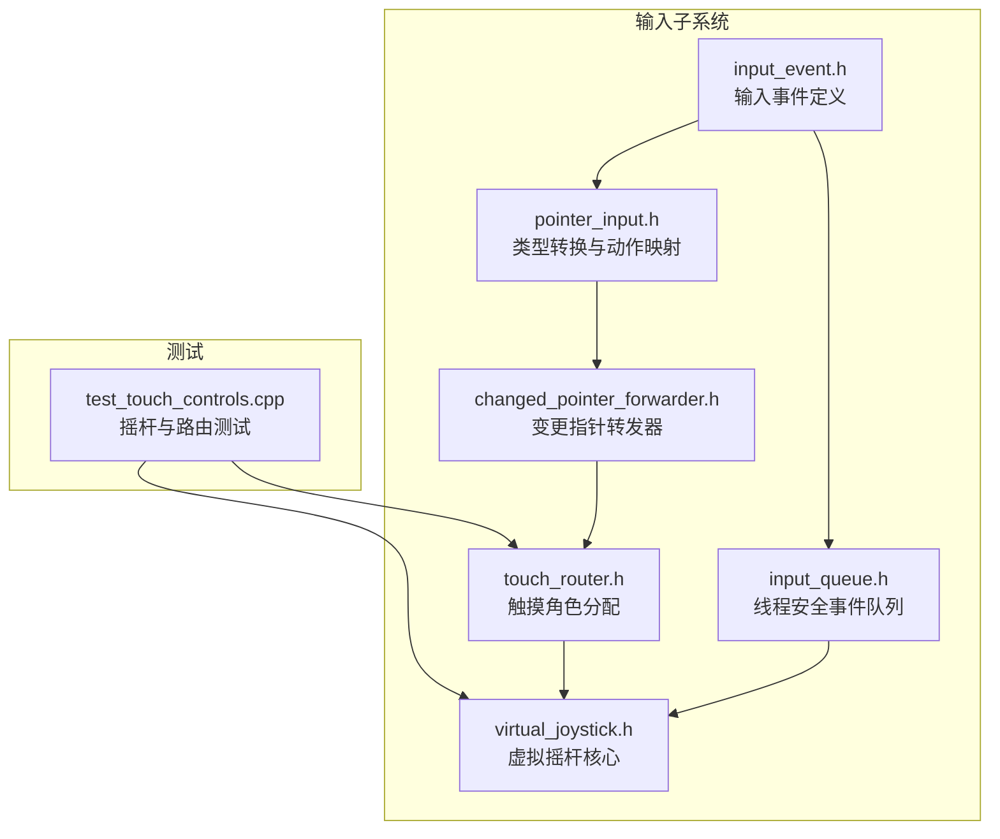
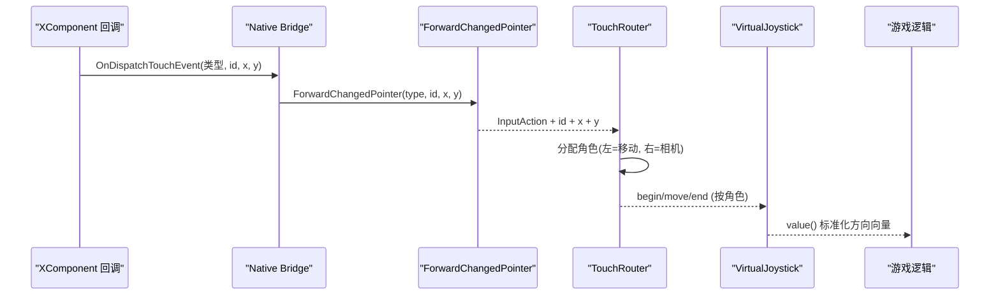
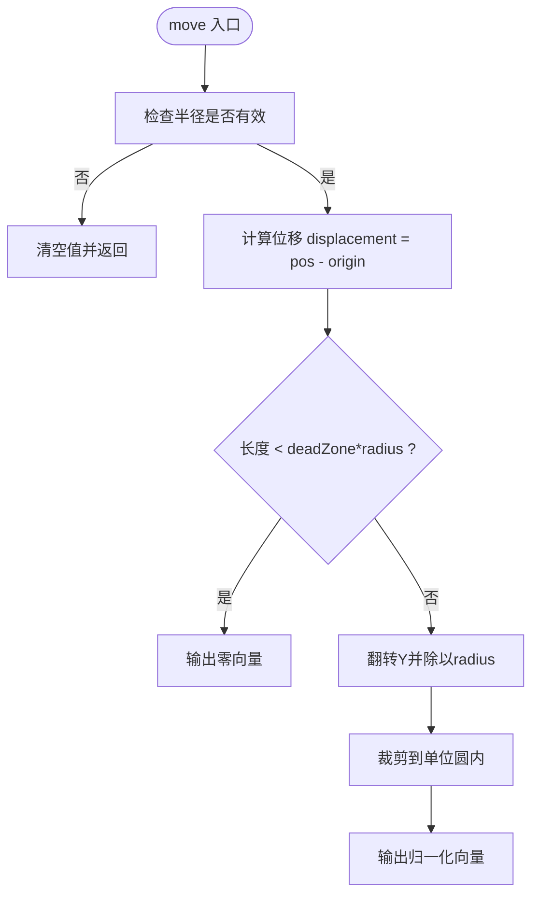
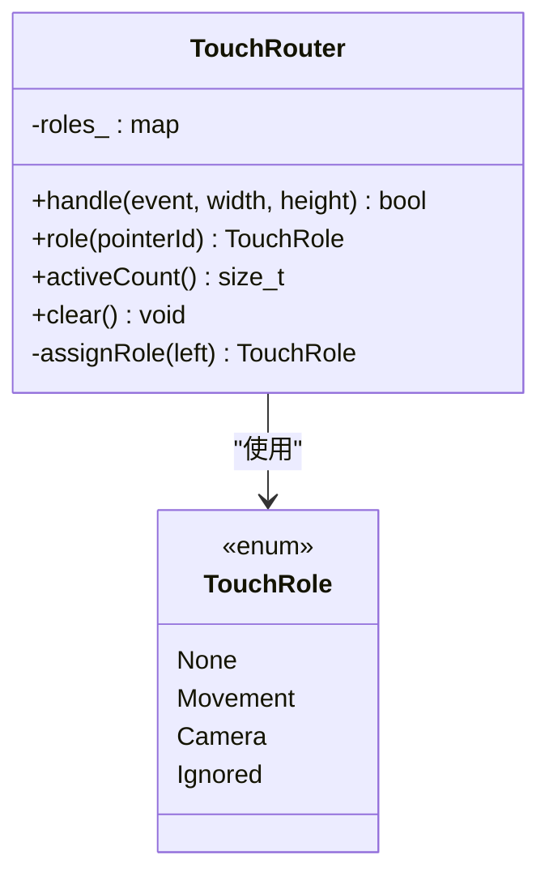
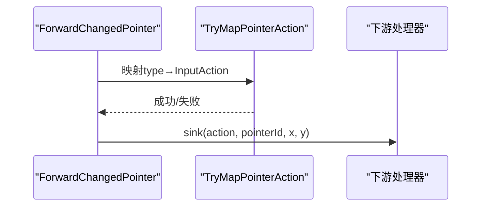
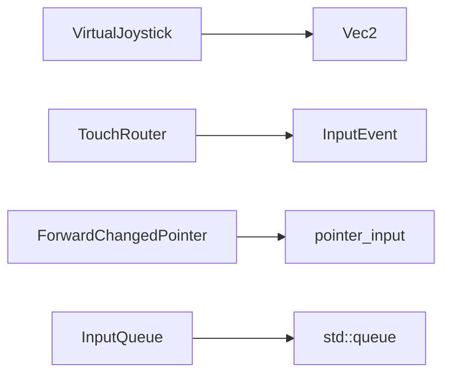

# 虚拟摇杆控制

<cite>
**本文引用的文件**   
- [virtual_joystick.h](file://native/engine/input/virtual_joystick.h)
- [input_event.h](file://native/engine/input/input_event.h)
- [pointer_input.h](file://native/engine/input/pointer_input.h)
- [changed_pointer_forwarder.h](file://native/engine/input/changed_pointer_forwarder.h)
- [touch_router.h](file://native/engine/input/touch_router.h)
- [input_queue.h](file://native/engine/input/input_queue.h)
- [test_touch_controls.cpp](file://tests/test_touch_controls.cpp)
</cite>

## 目录
1. [简介](#简介)
2. [项目结构](#项目结构)
3. [核心组件](#核心组件)
4. [架构总览](#架构总览)
5. [详细组件分析](#详细组件分析)
6. [依赖关系分析](#依赖关系分析)
7. [性能考量](#性能考量)
8. [故障排查指南](#故障排查指南)
9. [结论](#结论)
10. [附录：配置与扩展](#附录：配置与扩展)

## 简介
本技术文档聚焦 my-world 的虚拟摇杆控制系统，围绕 VirtualJoystick 类的实现原理展开，涵盖触摸区域检测、位移计算、方向向量生成、边界与死区处理、归一化输出，以及与 PointerInput 系统的集成流程。同时给出多摇杆支持思路、样式与灵敏度调节建议，以及与其他输入方式的协调与冲突处理策略。

## 项目结构
与虚拟摇杆相关的代码主要位于 native/engine/input 目录下，包括事件定义、指针输入转换、变更指针转发、触摸路由与队列等；测试用例位于 tests 目录中，覆盖摇杆行为与路由逻辑。

图表来源 
- [input_event.h:1-24](file://native/engine/input/input_event.h#L1-L24)
- [pointer_input.h:1-36](file://native/engine/input/pointer_input.h#L1-L36)
- [changed_pointer_forwarder.h:1-12](file://native/engine/input/changed_pointer_forwarder.h#L1-L12)
- [touch_router.h:1-59](file://native/engine/input/touch_router.h#L1-L59)
- [input_queue.h:1-47](file://native/engine/input/input_queue.h#L1-L47)
- [virtual_joystick.h:1-62](file://native/engine/input/virtual_joystick.h#L1-L62)
- [test_touch_controls.cpp:1-111](file://tests/test_touch_controls.cpp#L1-L111)

章节来源
- [input_event.h:1-24](file://native/engine/input/input_event.h#L1-L24)
- [pointer_input.h:1-36](file://native/engine/input/pointer_input.h#L1-L36)
- [changed_pointer_forwarder.h:1-12](file://native/engine/input/changed_pointer_forwarder.h#L1-L12)
- [touch_router.h:1-59](file://native/engine/input/touch_router.h#L1-L59)
- [input_queue.h:1-47](file://native/engine/input/input_queue.h#L1-L47)
- [virtual_joystick.h:1-62](file://native/engine/input/virtual_joystick.h#L1-L62)
- [test_touch_controls.cpp:1-111](file://tests/test_touch_controls.cpp#L1-L111)

## 核心组件
- VirtualJoystick：封装摇杆状态机（begin/move/end/clear），负责死区过滤、长度裁剪与归一化，输出二维方向向量。
- InputEvent：统一输入事件结构，包含动作、指针ID、坐标与序列号。
- pointer_input：提供数值类型安全转换与动作枚举映射。
- changed_pointer_forwarder：将底层变更指针事件转换为上层 InputAction 并投递到 Sink。
- TouchRouter：根据屏幕左右半区为每个指针分配“移动/相机/忽略”角色，避免冲突。
- InputQueue：线程安全的输入事件队列，用于跨线程缓冲与消费。

章节来源
- [virtual_joystick.h:1-62](file://native/engine/input/virtual_joystick.h#L1-L62)
- [input_event.h:1-24](file://native/engine/input/input_event.h#L1-L24)
- [pointer_input.h:1-36](file://native/engine/input/pointer_input.h#L1-L36)
- [changed_pointer_forwarder.h:1-12](file://native/engine/input/changed_pointer_forwarder.h#L1-L12)
- [touch_router.h:1-59](file://native/engine/input/touch_router.h#L1-L59)
- [input_queue.h:1-47](file://native/engine/input/input_queue.h#L1-L47)

## 架构总览
虚拟摇杆的输入流从底层 XComponent 回调开始，经 Native Bridge 转发至 ForwardChangedPointer，再进入 TouchRouter 进行角色分配，随后由上层逻辑驱动 VirtualJoystick 的状态更新，最终输出标准化的方向向量供游戏逻辑使用。

图表来源 
- [changed_pointer_forwarder.h:1-12](file://native/engine/input/changed_pointer_forwarder.h#L1-L12)
- [pointer_input.h:1-36](file://native/engine/input/pointer_input.h#L1-L36)
- [touch_router.h:1-59](file://native/engine/input/touch_router.h#L1-L59)
- [virtual_joystick.h:1-62](file://native/engine/input/virtual_joystick.h#L1-L62)

## 详细组件分析

### VirtualJoystick 类
- 职责
  - 维护单个指针的生命周期：begin 记录原点与指针ID，move 计算位移与方向，end/clear 复位状态。
  - 死区与半径：当位移小于 deadZone*radius 时视为无效；超过 radius 则裁剪到单位圆内。
  - 坐标系：Y 轴翻转以适配屏幕坐标系到数学坐标系。
  - 输出：value() 返回归一化的二维向量，未激活或无效时为默认零向量。
- 关键流程
  - 位移计算：displacement = position - origin_
  - 死区判断：length(displacement) < deadZone * radius → 输出零向量
  - 归一化与裁剪：ClampLength((x, -y)/radius, 1.0f)
- 复杂度
  - 每次 move 为 O(1)，仅涉及基本算术与向量运算。
- 错误与边界
  - 非法参数（非有限数、负半径）会被拒绝，保证输出始终有限且有效。
  - 指针ID不匹配直接忽略，防止误触其他摇杆。

图表来源 
- [virtual_joystick.h:26-40](file://native/engine/input/virtual_joystick.h#L26-L40)

章节来源
- [virtual_joystick.h:1-62](file://native/engine/input/virtual_joystick.h#L1-L62)
- [test_touch_controls.cpp:63-84](file://tests/test_touch_controls.cpp#L63-L84)

### 触摸路由与角色分配（TouchRouter）
- 职责
  - 根据屏幕宽度与指针X坐标决定角色：左半屏优先“移动”，右半屏优先“相机”。
  - 若目标角色已被占用，则新指针标记为“忽略”，避免冲突。
  - 维护 pointerId→role 的映射，支持 activeCount 与 clear。
- 事件处理
  - PointerDown：注册角色
  - PointerMove：仅当已注册角色才处理
  - PointerUp/Cancel：移除角色
- 鲁棒性
  - 对宽高与坐标的非有限值进行快速拒绝。

图表来源 
- [touch_router.h:1-59](file://native/engine/input/touch_router.h#L1-L59)

章节来源
- [touch_router.h:1-59](file://native/engine/input/touch_router.h#L1-L59)
- [test_touch_controls.cpp:17-57](file://tests/test_touch_controls.cpp#L17-L57)

### 输入事件与转换（InputEvent / pointer_input / changed_pointer_forwarder）
- InputEvent：统一描述一次输入，包含动作、指针ID、坐标与序列号。
- pointer_input：提供 TryConvertInt32/TryConvertFloat 的安全转换与 TryMapPointerAction 的动作映射。
- changed_pointer_forwarder：将底层 type/id/x/y 转为标准 InputAction 并投递给 Sink。

图表来源 
- [changed_pointer_forwarder.h:1-12](file://native/engine/input/changed_pointer_forwarder.h#L1-L12)
- [pointer_input.h:27-35](file://native/engine/input/pointer_input.h#L27-L35)

章节来源
- [input_event.h:1-24](file://native/engine/input/input_event.h#L1-L24)
- [pointer_input.h:1-36](file://native/engine/input/pointer_input.h#L1-L36)
- [changed_pointer_forwarder.h:1-12](file://native/engine/input/changed_pointer_forwarder.h#L1-L12)

### 输入队列（InputQueue）
- 职责：线程安全地缓冲输入事件，支持 push/pop/clear 与丢弃计数统计。
- 适用场景：在渲染/逻辑线程与输入线程之间解耦，避免阻塞。

章节来源
- [input_queue.h:1-47](file://native/engine/input/input_queue.h#L1-L47)

## 依赖关系分析
- VirtualJoystick 依赖 Vec2（数学库）与自身配置结构体，内部通过长度裁剪与向量运算完成方向输出。
- TouchRouter 依赖 InputEvent 与 unordered_map 管理角色映射。
- changed_pointer_forwarder 依赖 pointer_input 的动作映射能力。
- InputQueue 依赖 std::queue 与互斥量保证并发安全。

图表来源 
- [virtual_joystick.h:1-62](file://native/engine/input/virtual_joystick.h#L1-L62)
- [touch_router.h:1-59](file://native/engine/input/touch_router.h#L1-L59)
- [changed_pointer_forwarder.h:1-12](file://native/engine/input/changed_pointer_forwarder.h#L1-L12)
- [pointer_input.h:1-36](file://native/engine/input/pointer_input.h#L1-L36)
- [input_queue.h:1-47](file://native/engine/input/input_queue.h#L1-L47)

章节来源
- [virtual_joystick.h:1-62](file://native/engine/input/virtual_joystick.h#L1-L62)
- [touch_router.h:1-59](file://native/engine/input/touch_router.h#L1-L59)
- [changed_pointer_forwarder.h:1-12](file://native/engine/input/changed_pointer_forwarder.h#L1-L12)
- [pointer_input.h:1-36](file://native/engine/input/pointer_input.h#L1-L36)
- [input_queue.h:1-47](file://native/engine/input/input_queue.h#L1-L47)

## 性能考量
- VirtualJoystick 的 move 操作为常数时间，适合高频调用。
- TouchRouter 使用哈希表维护角色映射，平均 O(1) 查询与插入。
- InputQueue 使用互斥锁保护队列，push/pop 为 O(1)，在高吞吐下需关注锁竞争。
- 建议在热点路径上避免不必要的对象创建，复用临时变量。

## 故障排查指南
- 现象：摇杆无响应
  - 检查 begin 是否被调用且 pointerId 一致。
  - 确认 move 的坐标是否为有限值，半径配置是否大于 0。
  - 验证死区设置是否过大导致位移被过滤。
- 现象：方向异常或溢出
  - 检查 Y 轴翻转逻辑是否正确（屏幕坐标 vs 数学坐标）。
  - 确认 ClampLength 是否正常工作，确保输出范数不超过 1。
- 现象：多指冲突
  - 查看 TouchRouter 的角色分配是否符合预期（左移右摄）。
  - 确认 PointerUp/Cancel 能正确释放角色。
- 现象：丢帧或卡顿
  - 检查 InputQueue 的 droppedCount 是否增长，必要时增大容量或优化消费频率。

章节来源
- [virtual_joystick.h:26-46](file://native/engine/input/virtual_joystick.h#L26-L46)
- [touch_router.h:17-37](file://native/engine/input/touch_router.h#L17-L37)
- [input_queue.h:12-28](file://native/engine/input/input_queue.h#L12-L28)
- [test_touch_controls.cpp:63-84](file://tests/test_touch_controls.cpp#L63-L84)

## 结论
VirtualJoystick 提供了轻量、稳定且高效的虚拟摇杆核心能力，配合 TouchRouter 可实现左右分区的多输入协作。通过合理的死区、半径与归一化处理，系统能在移动端提供一致的操控体验。结合 InputQueue 与事件转换层，可构建高内聚、低耦合的输入管线。

## 附录：配置与扩展
- 配置参数
  - deadZone：相对半径的死区阈值，范围 [0, ∞)，推荐 0.05~0.2。
  - radius：摇杆最大作用半径，影响灵敏度与视觉反馈大小。
- 视觉反馈建议
  - 背景圆盘：半径等于配置的 radius。
  - 手柄中心点：跟随手指位置，限制在圆盘内。
  - 颜色/透明度：根据位移长度动态变化，增强手感。
- 灵敏度调节
  - 调整 deadZone 改变最小触发位移。
  - 调整 radius 改变单位位移对应的输出幅度。
  - 可在 move 后加入平滑滤波（如指数移动平均）降低抖动。
- 多摇杆支持方案
  - 为每个指针维护独立的 VirtualJoystick 实例，由 TouchRouter 或上层管理器分发 begin/move/end。
  - 使用 InputQueue 缓冲不同来源的事件，按 pointerId 路由到对应实例。
- 与其他输入协调与冲突处理
  - 使用 TouchRouter 明确角色划分，避免移动与相机冲突。
  - 对于按键类输入（攻击、闪避等），与摇杆并行处理，互不影响。
  - 在 UI 层屏蔽透明点击区域，避免误触。

章节来源
- [virtual_joystick.h:5-18](file://native/engine/input/virtual_joystick.h#L5-L18)
- [touch_router.h:48-55](file://native/engine/input/touch_router.h#L48-L55)
- [input_queue.h:1-47](file://native/engine/input/input_queue.h#L1-L47)
- [test_touch_controls.cpp:1-111](file://tests/test_touch_controls.cpp#L1-L111)