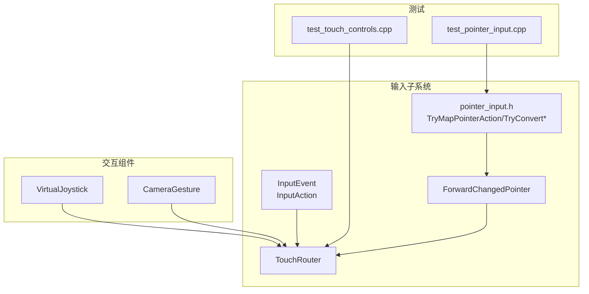
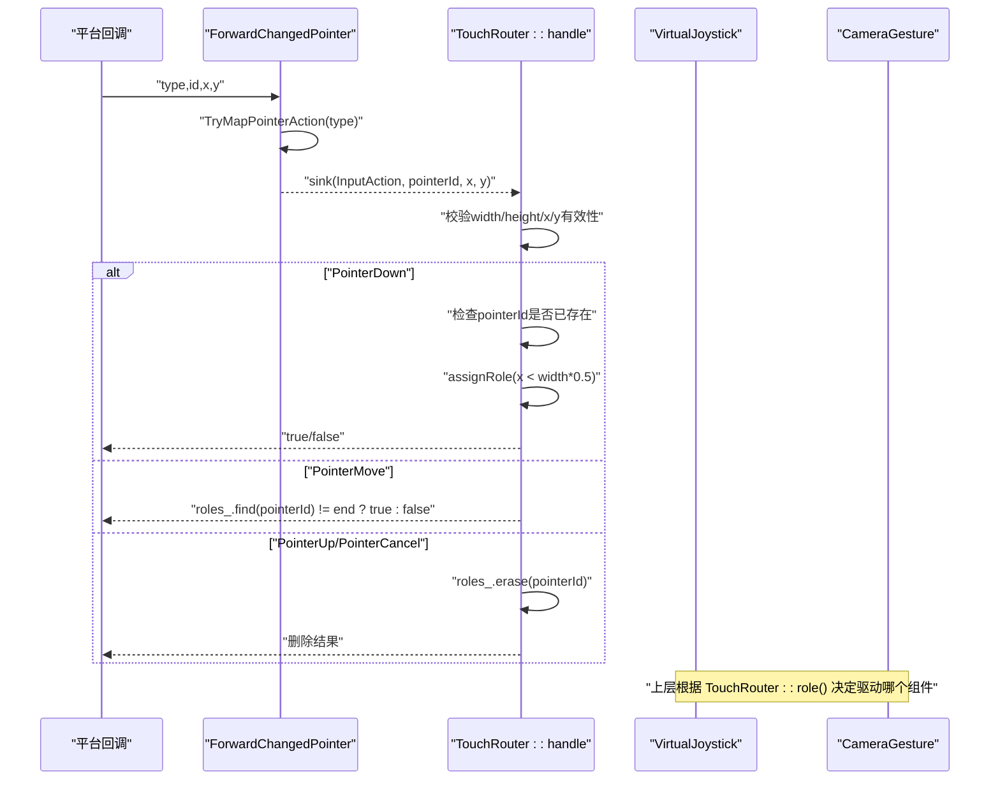
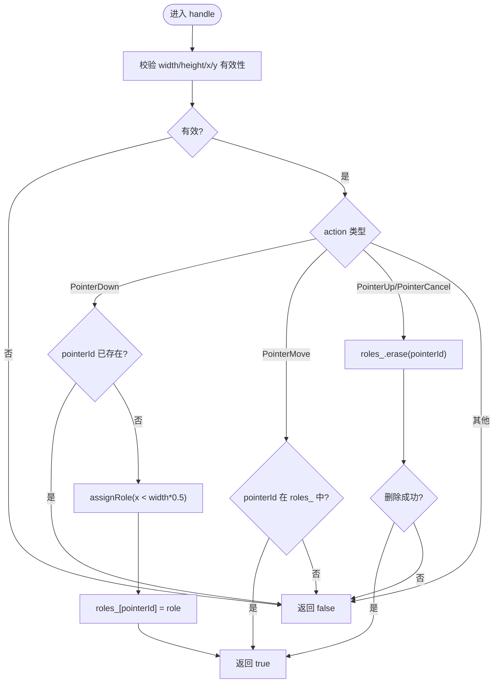
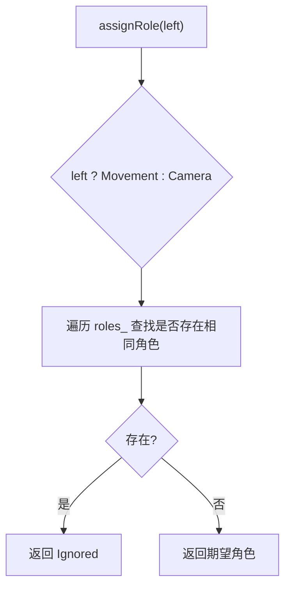
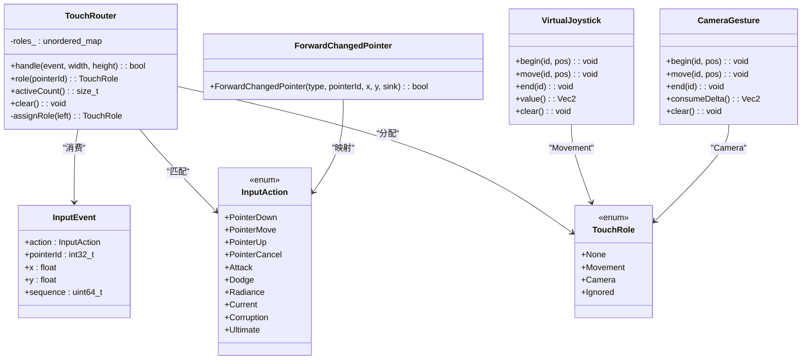

# 触摸路由系统

<cite>
**本文引用的文件**   
- [touch_router.h](file://native/engine/input/touch_router.h)
- [input_event.h](file://native/engine/input/input_event.h)
- [pointer_input.h](file://native/engine/input/pointer_input.h)
- [changed_pointer_forwarder.h](file://native/engine/input/changed_pointer_forwarder.h)
- [camera_gesture.h](file://native/engine/input/camera_gesture.h)
- [virtual_joystick.h](file://native/engine/input/virtual_joystick.h)
- [test_touch_controls.cpp](file://tests/test_touch_controls.cpp)
- [test_pointer_input.cpp](file://tests/test_pointer_input.cpp)
</cite>

## 目录
1. [简介](#简介)
2. [项目结构](#项目结构)
3. [核心组件](#核心组件)
4. [架构总览](#架构总览)
5. [详细组件分析](#详细组件分析)
6. [依赖关系分析](#依赖关系分析)
7. [性能考量](#性能考量)
8. [故障排查指南](#故障排查指南)
9. [结论](#结论)
10. [附录](#附录)

## 简介
本技术文档围绕 my-world 的触摸路由系统展开，重点解析 TouchRouter 类的事件分发机制与多点触控角色分配策略。TouchRouter 负责将屏幕上的每个指针（触摸点）自动识别为“移动”或“相机”两类角色，并在冲突时给出合理的忽略策略；同时维护活动触摸点计数、指针ID跟踪以及状态清理能力。文档还涵盖输入事件模型、桥接转发器、虚拟摇杆与相机手势等配套组件，并提供配置示例与自定义角色分配规则的扩展指南。

## 项目结构
触摸路由系统位于 native/engine/input 目录下，核心头文件包括：
- touch_router.h：定义 TouchRole 枚举与 TouchRouter 类，实现事件分发与角色分配
- input_event.h：定义 InputAction 枚举与 InputEvent 结构体
- pointer_input.h：提供类型转换与平台动作映射工具函数
- changed_pointer_forwarder.h：通用指针事件转发模板
- camera_gesture.h / virtual_joystick.h：相机手势与虚拟摇杆的实现，配合 TouchRouter 使用
- tests/test_touch_controls.cpp：覆盖 TouchRouter 行为的多点触控测试
- tests/test_pointer_input.cpp：验证输入动作映射与类型转换

图表来源
- [touch_router.h:1-59](file://native/engine/input/touch_router.h#L1-L59)
- [input_event.h:1-24](file://native/engine/input/input_event.h#L1-L24)
- [pointer_input.h:1-36](file://native/engine/input/pointer_input.h#L1-L36)
- [changed_pointer_forwarder.h:1-12](file://native/engine/input/changed_pointer_forwarder.h#L1-L12)
- [camera_gesture.h:1-54](file://native/engine/input/camera_gesture.h#L1-L54)
- [virtual_joystick.h:1-62](file://native/engine/input/virtual_joystick.h#L1-L62)
- [test_touch_controls.cpp:1-111](file://tests/test_touch_controls.cpp#L1-L111)
- [test_pointer_input.cpp:1-34](file://tests/test_pointer_input.cpp#L1-L34)

章节来源
- [touch_router.h:1-59](file://native/engine/input/touch_router.h#L1-L59)
- [input_event.h:1-24](file://native/engine/input/input_event.h#L1-L24)
- [pointer_input.h:1-36](file://native/engine/input/pointer_input.h#L1-L36)
- [changed_pointer_forwarder.h:1-12](file://native/engine/input/changed_pointer_forwarder.h#L1-L12)
- [camera_gesture.h:1-54](file://native/engine/input/camera_gesture.h#L1-L54)
- [virtual_joystick.h:1-62](file://native/engine/input/virtual_joystick.h#L1-L62)
- [test_touch_controls.cpp:1-111](file://tests/test_touch_controls.cpp#L1-L111)
- [test_pointer_input.cpp:1-34](file://tests/test_pointer_input.cpp#L1-L34)

## 核心组件
- TouchRole 枚举：定义指针的角色类别，包括 None、Movement、Camera、Ignored
- TouchRouter 类：处理 PointerDown/Move/Up/Cancel 事件，维护 roles_ 映射（pointerId -> TouchRole），提供 role() 查询、activeCount() 统计与 clear() 清理
- InputEvent 与 InputAction：描述输入事件的结构与动作类型
- ForwardChangedPointer：将平台侧的指针动作类型映射为 InputAction，并调用 sink(action, pointerId, x, y)
- VirtualJoystick 与 CameraGesture：分别用于左侧移动控制与右侧相机旋转，配合 TouchRouter 的角色分配进行工作

章节来源
- [touch_router.h:8-58](file://native/engine/input/touch_router.h#L8-L58)
- [input_event.h:4-24](file://native/engine/input/input_event.h#L4-L24)
- [changed_pointer_forwarder.h:5-11](file://native/engine/input/changed_pointer_forwarder.h#L5-L11)
- [virtual_joystick.h:5-61](file://native/engine/input/virtual_joystick.h#L5-L61)
- [camera_gesture.h:5-53](file://native/engine/input/camera_gesture.h#L5-L53)

## 架构总览
触摸路由系统的整体流程如下：
- 平台层通过 OnDispatchTouchEvent 回调获取触摸事件，提取 type、id、x、y
- 使用 ForwardChangedPointer 将 type 映射为 InputAction，并调用 sink(action, pointerId, x, y)
- TouchRouter::handle 接收事件，校验尺寸与坐标有效性后，按动作分支处理：
  - PointerDown：若该 pointerId 未注册，则根据 x < width * 0.5f 判断左右区域，调用 assignRole 分配角色
  - PointerMove：仅当 pointerId 已存在且已分配角色时返回 true
  - PointerUp/PointerCancel：从 roles_ 中移除对应条目并返回是否成功删除
- 上层逻辑根据 TouchRouter::role(pointerId) 的结果驱动 VirtualJoystick 或 CameraGesture

图表来源
- [changed_pointer_forwarder.h:5-11](file://native/engine/input/changed_pointer_forwarder.h#L5-L11)
- [pointer_input.h:27-35](file://native/engine/input/pointer_input.h#L27-L35)
- [touch_router.h:17-37](file://native/engine/input/touch_router.h#L17-L37)
- [touch_router.h:49-55](file://native/engine/input/touch_router.h#L49-L55)

## 详细组件分析

### TouchRole 枚举与角色语义
- None：无角色，表示指针未被路由或未激活
- Movement：移动角色，通常绑定到左侧屏幕区域，驱动 VirtualJoystick
- Camera：相机角色，通常绑定到右侧屏幕区域，驱动 CameraGesture
- Ignored：被忽略，表示当前指针因冲突策略而被拒绝参与控制

章节来源
- [touch_router.h:8-13](file://native/engine/input/touch_router.h#L8-L13)

### TouchRouter 类与事件分发
- handle(event, width, height)：
  - 参数校验：width/height 必须为正且有限；event.x/event.y 必须有限
  - PointerDown：若 pointerId 已存在则直接返回 false；否则根据 x < width * 0.5f 判定左右区域，调用 assignRole 分配角色
  - PointerMove：仅当 pointerId 已在 roles_ 中存在时返回 true
  - PointerUp/PointerCancel：从 roles_ 中删除对应条目并返回是否成功
- role(pointerId)：查询指定 pointerId 的当前角色，不存在则返回 None
- activeCount()：返回 roles_ 的大小，即活动触摸点数量
- clear()：清空 roles_，重置所有状态

图表来源
- [touch_router.h:17-37](file://native/engine/input/touch_router.h#L17-L37)

章节来源
- [touch_router.h:17-46](file://native/engine/input/touch_router.h#L17-L46)

### 多点触控角色分配与冲突解决
- 左右区域自动识别：
  - 当 x < width * 0.5f 时，期望角色为 Movement（左侧）
  - 否则期望角色为 Camera（右侧）
- 冲突解决策略（assignRole）：
  - 遍历 roles_，若已存在相同期望角色，则返回 Ignored 以拒绝该指针
  - 若无冲突，返回期望角色
- 效果：
  - 同一时刻最多只有一个 Movement 和一个 Camera 角色
  - 超出限制的新指针将被标记为 Ignored，避免冲突

图表来源
- [touch_router.h:49-55](file://native/engine/input/touch_router.h#L49-L55)

章节来源
- [touch_router.h:49-55](file://native/engine/input/touch_router.h#L49-L55)

### 触摸状态管理与指针ID跟踪
- roles_ 映射：int32_t pointerId -> TouchRole，记录每个活动指针的角色
- role(pointerId)：O(1) 查找，不存在返回 None
- activeCount()：返回 roles_.size()，即活动触摸点计数
- clear()：清空 roles_，释放所有活动指针状态

章节来源
- [touch_router.h:39-46](file://native/engine/input/touch_router.h#L39-L46)

### 输入事件模型与桥接转发
- InputEvent：包含 action、pointerId、x、y、sequence
- InputAction：PointerDown、PointerMove、PointerUp、PointerCancel 等
- TryMapPointerAction：将平台类型映射为 InputAction
- ForwardChangedPointer：封装映射与 sink 调用，便于上层统一接入

章节来源
- [input_event.h:4-24](file://native/engine/input/input_event.h#L4-L24)
- [pointer_input.h:27-35](file://native/engine/input/pointer_input.h#L27-L35)
- [changed_pointer_forwarder.h:5-11](file://native/engine/input/changed_pointer_forwarder.h#L5-L11)

### 与 VirtualJoystick 和 CameraGesture 的协作
- VirtualJoystick：根据 Movement 角色的移动轨迹计算方向向量，支持死区与半径配置
- CameraGesture：根据 Camera 角色的滑动轨迹累积角度变化，支持灵敏度配置
- 上层逻辑依据 TouchRouter::role(pointerId) 的结果选择驱动哪个组件

章节来源
- [virtual_joystick.h:10-61](file://native/engine/input/virtual_joystick.h#L10-L61)
- [camera_gesture.h:10-53](file://native/engine/input/camera_gesture.h#L10-L53)

### 测试用例与行为验证
- test_touch_controls.cpp：
  - 验证无效尺寸与坐标导致 handle 返回 false
  - 验证 PointerDown/Move/Up/Cancel 的生命周期与角色分配
  - 验证冲突场景下新指针被标记为 Ignored
  - 验证 activeCount() 与 role() 的状态一致性
  - 验证 clear() 后所有状态复位
- test_pointer_input.cpp：
  - 验证 TryMapPointerAction 的类型映射正确性
  - 验证 TryConvertInt32/TryConvertFloat 的边界与非法值处理

章节来源
- [test_touch_controls.cpp:17-61](file://tests/test_touch_controls.cpp#L17-L61)
- [test_pointer_input.cpp:14-33](file://tests/test_pointer_input.cpp#L14-L33)

## 依赖关系分析
TouchRouter 依赖以下组件与接口：
- InputEvent/InputAction：事件结构与动作类型
- pointer_input.h：类型转换与动作映射
- changed_pointer_forwarder.h：通用指针事件转发
- 上层逻辑：根据角色驱动 VirtualJoystick/CameraGesture

图表来源
- [input_event.h:4-24](file://native/engine/input/input_event.h#L4-L24)
- [touch_router.h:8-58](file://native/engine/input/touch_router.h#L8-L58)
- [changed_pointer_forwarder.h:5-11](file://native/engine/input/changed_pointer_forwarder.h#L5-L11)
- [virtual_joystick.h:10-61](file://native/engine/input/virtual_joystick.h#L10-L61)
- [camera_gesture.h:10-53](file://native/engine/input/camera_gesture.h#L10-L53)

章节来源
- [input_event.h:4-24](file://native/engine/input/input_event.h#L4-L24)
- [touch_router.h:8-58](file://native/engine/input/touch_router.h#L8-L58)
- [changed_pointer_forwarder.h:5-11](file://native/engine/input/changed_pointer_forwarder.h#L5-L11)
- [virtual_joystick.h:10-61](file://native/engine/input/virtual_joystick.h#L10-L61)
- [camera_gesture.h:10-53](file://native/engine/input/camera_gesture.h#L10-L53)

## 性能考量
- 时间复杂度：
  - handle(PointerDown)：O(n) 遍历 roles_ 检测冲突，n 为当前活动指针数
  - role()/activeCount()/clear()：O(1)/O(1)/O(n)
- 空间复杂度：O(n)，存储 pointerId -> TouchRole 的映射
- 优化建议：
  - 若冲突检测频繁，可引入角色计数器（movementCount/cameraCount）以降低 O(n) 遍历
  - 对高频 move 事件，确保上层仅在角色存在时调用，减少无意义查找

[本节为通用性能讨论，不直接分析具体文件]

## 故障排查指南
- 症状：PointerDown 返回 false
  - 可能原因：width/height 非正或非有限；event.x/event.y 非有限；pointerId 已存在
  - 排查步骤：检查传入尺寸与坐标的有效性；确认 pointerId 唯一性
- 症状：PointerMove 始终返回 false
  - 可能原因：pointerId 未在 roles_ 中；上层未正确处理 PointerDown
  - 排查步骤：确认 PointerDown 成功分配角色；检查 role(pointerId) 返回值
- 症状：activeCount() 不降
  - 可能原因：PointerUp/PointerCancel 未触发；上层未调用 clear()
  - 排查步骤：检查事件生命周期；必要时调用 clear() 强制复位
- 症状：角色冲突导致 Ignored
  - 可能原因：同侧多点触控超过一个；期望角色已存在
  - 排查步骤：调整交互设计，避免同侧多点；或扩展 assignRole 规则

章节来源
- [touch_router.h:17-37](file://native/engine/input/touch_router.h#L17-L37)
- [test_touch_controls.cpp:17-61](file://tests/test_touch_controls.cpp#L17-L61)

## 结论
TouchRouter 提供了简洁高效的触摸路由机制，通过左右区域自动识别与冲突解决策略，确保多点触控下的稳定角色分配。结合 VirtualJoystick 与 CameraGesture，可实现流畅的移动与相机控制体验。其状态管理清晰、接口简单，易于扩展与集成。

[本节为总结性内容，不直接分析具体文件]

## 附录

### 触摸路由配置示例
- 基本用法：
  - 创建 TouchRouter 实例
  - 在 PointerDown 时调用 handle(event, width, height)
  - 根据 role(pointerId) 的结果驱动 VirtualJoystick 或 CameraGesture
  - 在 PointerUp/PointerCancel 时确保上层组件结束跟踪
- 示例路径参考：
  - [test_touch_controls.cpp:17-61](file://tests/test_touch_controls.cpp#L17-L61)

### 自定义角色分配规则实现指南
- 目标：修改 assignRole 的行为，例如基于更复杂的区域划分或优先级策略
- 步骤：
  - 在 TouchRouter 中重写 assignRole 方法
  - 根据业务需求调整 left 判断或增加额外条件
  - 保持冲突检测逻辑的一致性，避免破坏现有行为
- 注意事项：
  - 确保返回值为 TouchRole 的有效成员
  - 更新相关测试用例以覆盖新规则

章节来源
- [touch_router.h:49-55](file://native/engine/input/touch_router.h#L49-L55)
- [test_touch_controls.cpp:17-61](file://tests/test_touch_controls.cpp#L17-L61)