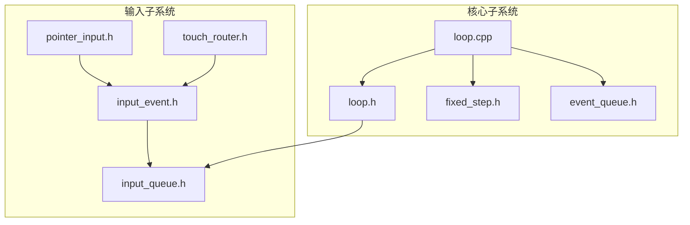
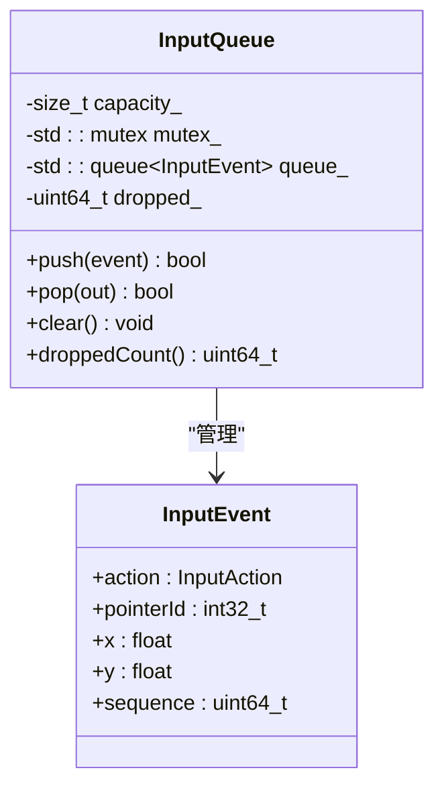
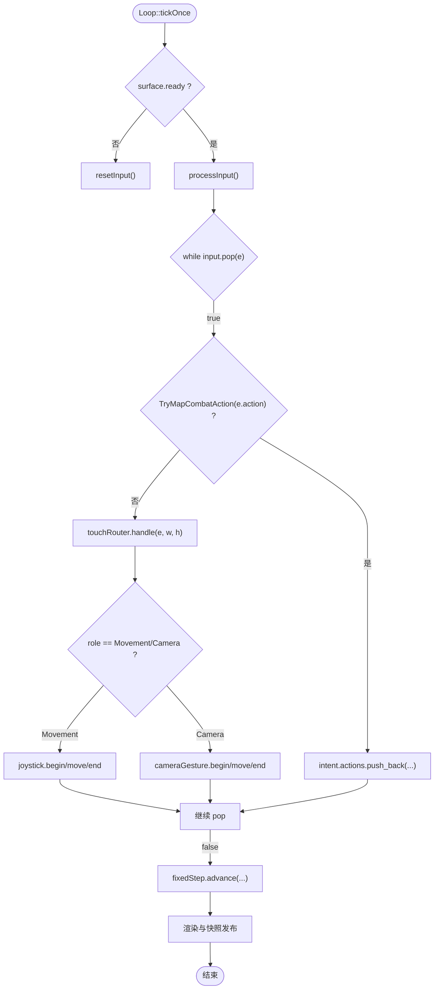
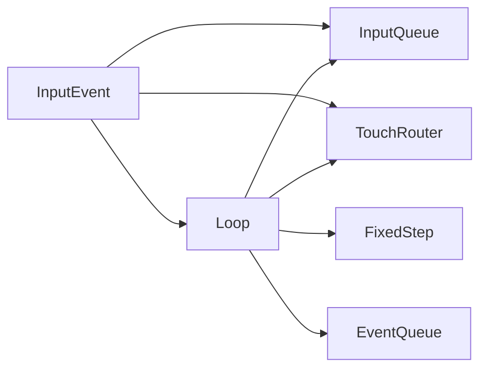

# 输入事件队列

<cite>
**本文引用的文件**   
- [input_event.h](file://native/engine/input/input_event.h)
- [input_queue.h](file://native/engine/input/input_queue.h)
- [pointer_input.h](file://native/engine/input/pointer_input.h)
- [touch_router.h](file://native/engine/input/touch_router.h)
- [loop.h](file://native/engine/core/loop.h)
- [loop.cpp](file://native/engine/core/loop.cpp)
- [fixed_step.h](file://native/engine/core/fixed_step.h)
- [event_queue.h](file://native/engine/core/event_queue.h)
- [test_input_queue.cpp](file://tests/test_input_queue.cpp)
- [test_event_queue.cpp](file://tests/test_event_queue.cpp)
</cite>

## 目录
1. [简介](#简介)
2. [项目结构](#项目结构)
3. [核心组件](#核心组件)
4. [架构总览](#架构总览)
5. [详细组件分析](#详细组件分析)
6. [依赖关系分析](#依赖关系分析)
7. [性能考虑](#性能考虑)
8. [故障排查指南](#故障排查指南)
9. [结论](#结论)
10. [附录](#附录)

## 简介
本技术文档围绕 my-world 的输入事件队列系统展开，重点解析 InputQueue 类的事件管理机制（入队、出队与生命周期）、InputEvent 数据结构设计（坐标、时间戳、指针ID、动作类型等），以及线程安全、内存管理与性能优化策略。同时覆盖事件过滤、批量处理、延迟执行、序列化格式说明、跨平台兼容性处理、调试工具使用方法，以及与游戏主循环的同步机制和帧率适配策略。

## 项目结构
输入事件相关代码主要位于 native/engine/input 与 native/engine/core 两个子系统中：
- input 子系统负责事件定义、路由与转换
- core 子系统负责主循环、固定步长推进与输入消费



图表来源
- [input_event.h:1-24](file://native/engine/input/input_event.h#L1-L24)
- [input_queue.h:1-47](file://native/engine/input/input_queue.h#L1-L47)
- [pointer_input.h:1-36](file://native/engine/input/pointer_input.h#L1-L36)
- [touch_router.h:1-59](file://native/engine/input/touch_router.h#L1-L59)
- [loop.h:1-104](file://native/engine/core/loop.h#L1-L104)
- [loop.cpp:1-614](file://native/engine/core/loop.cpp#L1-L614)
- [fixed_step.h:1-49](file://native/engine/core/fixed_step.h#L1-L49)
- [event_queue.h:1-31](file://native/engine/core/event_queue.h#L1-L31)

章节来源
- [input_event.h:1-24](file://native/engine/input/input_event.h#L1-L24)
- [input_queue.h:1-47](file://native/engine/input/input_queue.h#L1-L47)
- [pointer_input.h:1-36](file://native/engine/input/pointer_input.h#L1-L36)
- [touch_router.h:1-59](file://native/engine/input/touch_router.h#L1-L59)
- [loop.h:1-104](file://native/engine/core/loop.h#L1-L104)
- [loop.cpp:1-614](file://native/engine/core/loop.cpp#L1-L614)
- [fixed_step.h:1-49](file://native/engine/core/fixed_step.h#L1-L49)
- [event_queue.h:1-31](file://native/engine/core/event_queue.h#L1-L31)

## 核心组件
- InputEvent：输入事件的数据载体，包含动作类型、指针ID、二维坐标与序列号。
- InputQueue：线程安全的有界事件队列，提供 push/pop/clear/droppedCount 接口。
- Loop：游戏主循环，负责将外部输入通过 enqueueInput 推入 InputQueue，并在每帧 processInput 中消费。
- TouchRouter：触摸角色分配器，根据屏幕左右区域为指针分配移动或相机控制角色。
- FixedStep：固定步长推进器，确保逻辑更新以固定时间步进行，避免掉帧累积导致雪崩。
- EventQueue：通用事件队列模板，用于其他领域事件的批量排空（drain）。

章节来源
- [input_event.h:1-24](file://native/engine/input/input_event.h#L1-L24)
- [input_queue.h:1-47](file://native/engine/input/input_queue.h#L1-L47)
- [loop.h:26-104](file://native/engine/core/loop.h#L26-L104)
- [touch_router.h:1-59](file://native/engine/input/touch_router.h#L1-L59)
- [fixed_step.h:1-49](file://native/engine/core/fixed_step.h#L1-L49)
- [event_queue.h:1-31](file://native/engine/core/event_queue.h#L1-L31)

## 架构总览
输入事件从平台层进入 Loop::enqueueInput，经 InputQueue 缓冲后，在 Loop::processInput 中被逐条取出并分发到虚拟摇杆、相机手势与战斗意图。FixedStep 保证逻辑更新的时间步稳定，Loop 每帧调用一次 processInput，从而形成“生产者-消费者”模型。

```mermaid
sequenceDiagram
participant Producer as "外部生产者<br/>平台/NAPI"
participant Loop as "Loop : : enqueueInput"
participant Queue as "InputQueue"
participant Consumer as "Loop : : processInput"
participant Router as "TouchRouter"
participant Joystick as "VirtualJoystick"
participant Camera as "CameraGesture"
Producer->>Loop : "pushAction / startEncounter / ... 触发输入"
Loop->>Queue : "push(InputEvent)"
Note over Queue : "容量限制，满则丢弃并计数"
loop 每帧
Consumer->>Queue : "pop() 取出一条事件"
alt 可映射为战斗动作
Consumer->>Consumer : "TryMapCombatAction -> intent.actions"
else 指针事件
Consumer->>Router : "handle(event, width, height)"
alt 移动角色
Consumer->>Joystick : "begin/move/end"
else 相机角色
Consumer->>Camera : "begin/move/end"
end
end
end
```

图表来源
- [loop.h:88-95](file://native/engine/core/loop.h#L88-L95)
- [input_queue.h:12-28](file://native/engine/input/input_queue.h#L12-L28)
- [loop.cpp:240-292](file://native/engine/core/loop.cpp#L240-L292)
- [touch_router.h:17-37](file://native/engine/input/touch_router.h#L17-L37)

## 详细组件分析

### InputEvent 数据结构
- action：输入动作枚举，包括指针事件（按下、移动、抬起、取消）与战斗动作（攻击、闪避、辉印、脉流、蚀质、终结等）。
- pointerId：指针标识，用于区分多指触控。
- x/y：归一化或像素坐标，具体由上层决定；TouchRouter 使用屏幕宽高进行边界校验。
- sequence：全局递增序列号，用于事件排序与去重。

章节来源
- [input_event.h:4-23](file://native/engine/input/input_event.h#L4-L23)

### InputQueue 线程安全与生命周期
- 线程安全：所有公共方法均使用互斥锁保护内部 std::queue，确保多线程并发下的原子性。
- 容量限制：构造函数支持 capacity_ 参数，push 时若已满则丢弃并递增 dropped_ 计数。
- 生命周期：clear 清空队列；droppedCount 暴露丢包统计；pop 返回 bool 指示是否成功取出一条事件。
- 复杂度：push/pop/clear 均为 O(1)，droppedCount 为 O(1)。



图表来源
- [input_queue.h:8-46](file://native/engine/input/input_queue.h#L8-L46)
- [input_event.h:17-23](file://native/engine/input/input_event.h#L17-L23)

章节来源
- [input_queue.h:10-46](file://native/engine/input/input_queue.h#L10-L46)
- [test_input_queue.cpp:6-49](file://tests/test_input_queue.cpp#L6-L49)

### Loop 与 InputQueue 的集成
- 入队：Loop::enqueueInput 对每个输入事件生成 InputEvent，并写入 InputQueue，同时维护 inputSequence 与 inputEventCount_。
- 出队：Loop::processInput 在每帧循环 pop 事件，按动作类型分流至战斗意图或指针处理。
- 重置：resetInput 会清空 TouchRouter、Joystick、CameraGesture、Intent 与 InputQueue，确保状态一致性。



图表来源
- [loop.cpp:311-354](file://native/engine/core/loop.cpp#L311-L354)
- [loop.cpp:240-292](file://native/engine/core/loop.cpp#L240-L292)
- [loop.h:88-95](file://native/engine/core/loop.h#L88-L95)

章节来源
- [loop.h:88-95](file://native/engine/core/loop.h#L88-L95)
- [loop.cpp:240-292](file://native/engine/core/loop.cpp#L240-L292)
- [loop.cpp:311-354](file://native/engine/core/loop.cpp#L311-L354)

### TouchRouter 事件过滤与角色分配
- 作用：根据指针 ID 与屏幕位置分配角色（移动/相机/忽略），并对无效尺寸或坐标进行快速拒绝。
- 行为：PointerDown 首次分配角色；PointerMove/Up/Cancel 基于已分配角色进行处理；超出范围或重复分配会被拒绝。
- 复杂度：查找与插入为 O(1) 平均；activeCount 返回当前活跃指针数。

章节来源
- [touch_router.h:17-58](file://native/engine/input/touch_router.h#L17-L58)

### PointerInput 类型转换与映射
- TryConvertInt32/TryConvertFloat：对浮点值进行有限性与范围检查，安全转换为整型/浮点型。
- TryMapPointerAction：将平台类型码映射为 InputAction 枚举，统一不同平台的输入语义。

章节来源
- [pointer_input.h:7-35](file://native/engine/input/pointer_input.h#L7-L35)

### FixedStep 固定步长与帧率适配
- 原理：累计 elapsedMs，按 stepMs 计算可执行的 tick 数量，上限 maxSteps 防止卡顿雪崩。
- 指标：tick() 返回当前逻辑 tick；droppedFrames() 统计因超时而丢弃的帧数。
- 与输入的关系：Loop::tickOnce 使用 fixedStep.advance 包裹 updateFixed，确保输入消费与逻辑更新解耦且稳定。

章节来源
- [fixed_step.h:8-48](file://native/engine/core/fixed_step.h#L8-L48)
- [loop.cpp:329-331](file://native/engine/core/loop.cpp#L329-L331)

### 通用 EventQueue 批量处理
- 用途：面向其他领域事件（如表现层事件）的批量排空，提供 drain 一次性转移全部事件。
- 线程安全：push/drain 均加锁；适合生产者-消费者模式中的批量消费。

章节来源
- [event_queue.h:7-30](file://native/engine/core/event_queue.h#L7-L30)
- [test_event_queue.cpp:5-19](file://tests/test_event_queue.cpp#L5-L19)

## 依赖关系分析
输入子系统与核心子系统之间的耦合关系如下：
- InputEvent 被 InputQueue、TouchRouter、Loop 共同使用。
- InputQueue 被 Loop 作为成员持有，供 enqueueInput 与 processInput 访问。
- TouchRouter 在 processInput 中用于指针事件的角色分配与过滤。
- FixedStep 在 Loop 中驱动逻辑更新，确保输入消费与逻辑更新解耦。
- EventQueue 独立于输入子系统，用于其他领域事件的批量处理。



图表来源
- [input_event.h:17-23](file://native/engine/input/input_event.h#L17-L23)
- [input_queue.h:8-46](file://native/engine/input/input_queue.h#L8-L46)
- [touch_router.h:15-58](file://native/engine/input/touch_router.h#L15-L58)
- [loop.h:26-104](file://native/engine/core/loop.h#L26-L104)
- [fixed_step.h:8-48](file://native/engine/core/fixed_step.h#L8-L48)
- [event_queue.h:7-30](file://native/engine/core/event_queue.h#L7-L30)

章节来源
- [input_event.h:17-23](file://native/engine/input/input_event.h#L17-L23)
- [input_queue.h:8-46](file://native/engine/input/input_queue.h#L8-L46)
- [touch_router.h:15-58](file://native/engine/input/touch_router.h#L15-L58)
- [loop.h:26-104](file://native/engine/core/loop.h#L26-L104)
- [fixed_step.h:8-48](file://native/engine/core/fixed_step.h#L8-L48)
- [event_queue.h:7-30](file://native/engine/core/event_queue.h#L7-L30)

## 性能考虑
- 线程安全开销：InputQueue 的互斥锁在高频输入场景下可能成为瓶颈。建议在高吞吐场景下评估无锁队列或分片队列方案。
- 容量与丢包：合理设置 capacity_，结合 droppedCount 监控丢包率；必要时采用背压策略（如生产者侧退让）。
- 批量消费：processInput 使用 while(pop) 批量消费，减少锁竞争与上下文切换。
- 固定步长：FixedStep 限制最大步进次数，避免卡顿雪崩；droppedFrames 可用于性能调优。
- 内存分配：InputEvent 为轻量结构体，避免频繁动态分配；必要时可使用对象池进一步降低分配压力。

[本节为通用指导，不直接分析具体文件]

## 故障排查指南
- 事件丢失：检查 InputQueue::droppedCount 是否增长；确认 capacity_ 是否过小；观察生产者速率是否过高。
- 指针异常：验证 TouchRouter 的 handle 返回值；检查坐标有效性（非有限值或越界）；确认 pointerId 未重复分配。
- 输入顺序错乱：确认 sequence 字段单调递增；在消费端如需排序，依据 sequence 稳定排序。
- 帧率抖动：查看 FixedStep::droppedFrames 与 Loop 的 FPS 日志；调整 stepMs 与 maxSteps。
- 测试用例参考：
  - 输入队列并发与容量限制：[test_input_queue.cpp:6-49](file://tests/test_input_queue.cpp#L6-L49)
  - 通用事件队列批量排空：[test_event_queue.cpp:5-19](file://tests/test_event_queue.cpp#L5-L19)

章节来源
- [input_queue.h:36-39](file://native/engine/input/input_queue.h#L36-L39)
- [touch_router.h:17-37](file://native/engine/input/touch_router.h#L17-L37)
- [fixed_step.h:39-48](file://native/engine/core/fixed_step.h#L39-L48)
- [test_input_queue.cpp:6-49](file://tests/test_input_queue.cpp#L6-L49)
- [test_event_queue.cpp:5-19](file://tests/test_event_queue.cpp#L5-L19)

## 结论
my-world 的输入事件队列系统通过 InputQueue 提供线程安全、有界的缓冲能力，配合 Loop 的主循环与 FixedStep 的固定步长推进，实现了稳定的输入消费与逻辑更新。TouchRouter 与 PointerInput 提供了事件过滤与类型映射，确保跨平台兼容性与健壮性。通过合理的容量配置、丢包监控与批量消费策略，可在高吞吐场景下保持低延迟与稳定性。

[本节为总结，不直接分析具体文件]

## 附录

### 输入事件序列化格式说明
- 字段顺序：action(uint8)、pointerId(int32)、x(float)、y(float)、sequence(uint64)
- 字节序：建议使用小端序（常见于 x86/ARM 平台），跨平台传输时需统一约定
- 校验：sequence 单调递增，可用于检测丢包与乱序；x/y 需进行有限性与范围校验

[本节为概念性说明，不直接分析具体文件]

### 跨平台兼容性处理
- 指针动作映射：通过 TryMapPointerAction 将平台类型码映射为标准 InputAction
- 数值转换：TryConvertInt32/TryConvertFloat 确保数值有效性与精度损失可控
- 坐标单位：TouchRouter 使用屏幕宽高进行边界判断，上层应统一坐标单位

章节来源
- [pointer_input.h:27-35](file://native/engine/input/pointer_input.h#L27-L35)
- [pointer_input.h:7-25](file://native/engine/input/pointer_input.h#L7-L25)
- [touch_router.h:17-22](file://native/engine/input/touch_router.h#L17-L22)

### 调试工具使用方法
- 启用调试 HUD：Loop::toggleDebugHud 切换 debugHud_ 标志，影响快照输出字段 showDebugHud
- 日志输出：Loop::tickOnce 中打印 FPS、性能等级、绘制调用与三角形数量等关键指标
- 丢包统计：InputQueue::droppedCount 与 FixedStep::droppedFrames 用于定位瓶颈

章节来源
- [loop.h:80](file://native/engine/core/loop.h#L80)
- [loop.cpp:342-353](file://native/engine/core/loop.cpp#L342-L353)
- [input_queue.h:36-39](file://native/engine/input/input_queue.h#L36-L39)
- [fixed_step.h:39-48](file://native/engine/core/fixed_step.h#L39-L48)