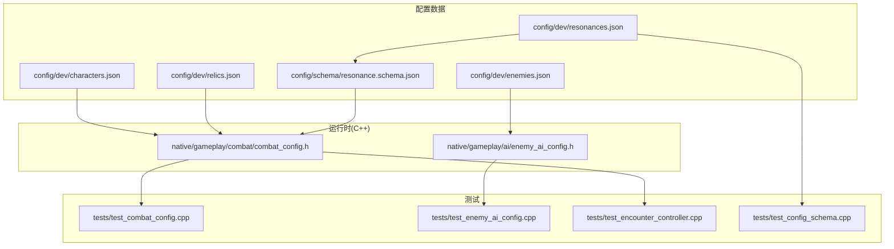
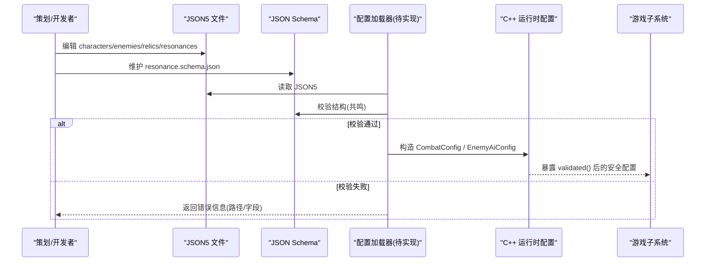
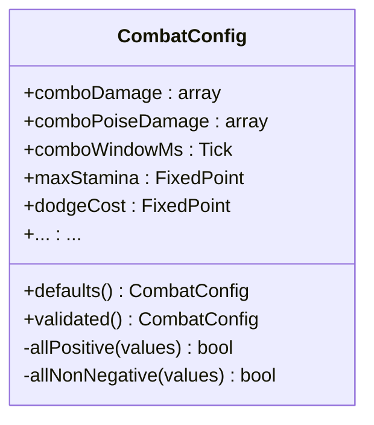
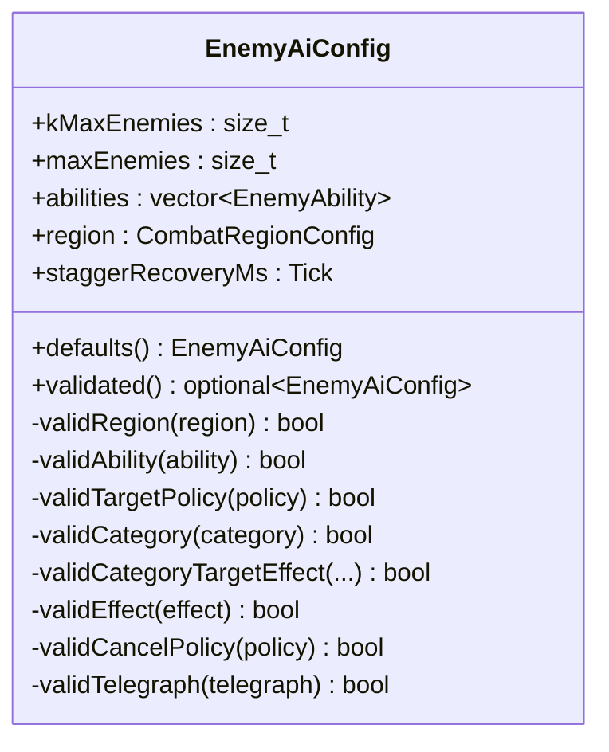
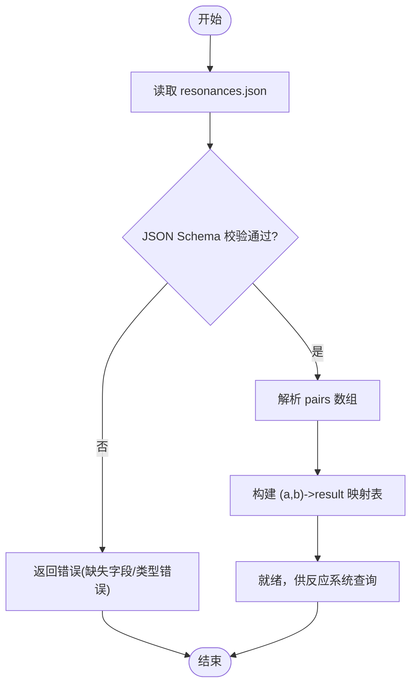
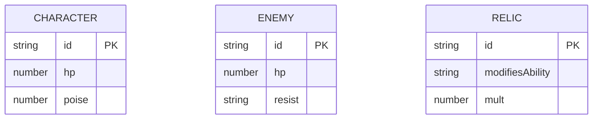
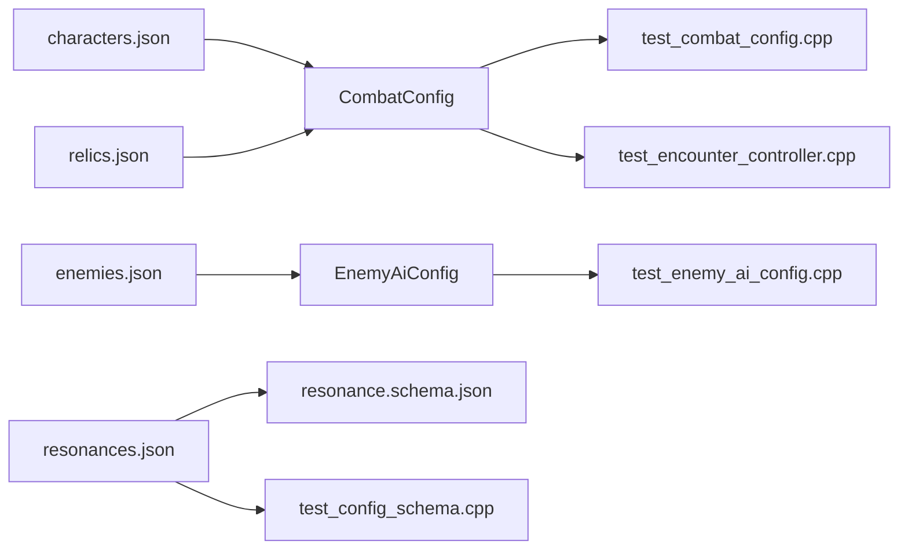

# 配置系统

<cite>
**本文引用的文件**   
- [characters.json](file://config/dev/characters.json)
- [enemies.json](file://config/dev/enemies.json)
- [relics.json](file://config/dev/relics.json)
- [resonances.json](file://config/dev/resonances.json)
- [resonance.schema.json](file://config/schema/resonance.schema.json)
- [combat_config.h](file://native/gameplay/combat/combat_config.h)
- [enemy_ai_config.h](file://native/gameplay/ai/enemy_ai_config.h)
- [test_combat_config.cpp](file://tests/test_combat_config.cpp)
- [test_enemy_ai_config.cpp](file://tests/test_enemy_ai_config.cpp)
- [test_encounter_controller.cpp](file://tests/test_encounter_controller.cpp)
- [test_config_schema.cpp](file://tests/test_config_schema.cpp)
</cite>

## 目录
1. [简介](#简介)
2. [项目结构](#项目结构)
3. [核心组件](#核心组件)
4. [架构总览](#架构总览)
5. [详细组件分析](#详细组件分析)
6. [依赖关系分析](#依赖关系分析)
7. [性能考虑](#性能考虑)
8. [故障排查指南](#故障排查指南)
9. [结论](#结论)
10. [附录](#附录)

## 简介
本文件为 my-world 的配置系统提供完整说明，覆盖 JSON5 配置文件结构、Schema 验证机制与运行时配置管理。重点解释角色配置、敌人配置、遗物配置与共鸣配置的字段定义与业务规则；记录热重载机制、版本兼容性与数据迁移策略；给出配置示例与自定义类型开发指南；阐述验证流程与错误处理；并讨论优化、缓存与性能实践，以及开发与调试工作流。

## 项目结构
配置相关资源主要位于以下目录：
- config/dev：运行时使用的 JSON5 配置（角色、敌人、遗物、共鸣）
- config/schema：JSON Schema 校验定义（当前包含共鸣配置）
- native/gameplay：C++ 运行时配置结构与验证逻辑（战斗配置、敌人 AI 配置）
- tests：针对配置与行为的单元测试，确保配置有效性与行为一致性

图表来源
- [combat_config.h:1-153](file://native/gameplay/combat/combat_config.h#L1-L153)
- [enemy_ai_config.h:1-124](file://native/gameplay/ai/enemy_ai_config.h#L1-L124)
- [resonance.schema.json:1-5](file://config/schema/resonance.schema.json#L1-L5)

章节来源
- [combat_config.h:1-153](file://native/gameplay/combat/combat_config.h#L1-L153)
- [enemy_ai_config.h:1-124](file://native/gameplay/ai/enemy_ai_config.h#L1-L124)
- [resonance.schema.json:1-5](file://config/schema/resonance.schema.json#L1-L5)

## 核心组件
- 战斗配置 CombatConfig：定义连击、耐力、源技能、反应、训练目标等数值与窗口参数，并提供 validated() 进行安全回退。
- 敌人 AI 配置 EnemyAiConfig：定义最大敌人数、能力列表、区域与失衡恢复时间，并通过 validated() 进行严格校验。
- 共鸣配置 Resonances：以 pairs 数组描述元素组合与结果映射，使用 JSON Schema 约束结构。
- 角色/敌人/遗物配置：以 JSON5 形式声明基础属性（如 id、hp、poise、resist、modifiesAbility、mult 等），供运行时加载与消费。

章节来源
- [combat_config.h:1-153](file://native/gameplay/combat/combat_config.h#L1-L153)
- [enemy_ai_config.h:1-124](file://native/gameplay/ai/enemy_ai_config.h#L1-L124)
- [resonance.schema.json:1-5](file://config/schema/resonance.schema.json#L1-L5)
- [characters.json:1-2](file://config/dev/characters.json#L1-L2)
- [enemies.json:1-2](file://config/dev/enemies.json#L1-L2)
- [relics.json:1-2](file://config/dev/relics.json#L1-L2)
- [resonances.json:1-5](file://config/dev/resonances.json#L1-L5)

## 架构总览
配置系统采用“数据 + 校验 + 运行时”的分层设计：
- 数据层：JSON5 配置与 JSON Schema
- 校验层：运行时 validated() 与 Schema 校验
- 运行层：C++ 配置结构体被游戏子系统消费（战斗、AI、训练、共鸣）

图表来源
- [resonance.schema.json:1-5](file://config/schema/resonance.schema.json#L1-L5)
- [combat_config.h:1-153](file://native/gameplay/combat/combat_config.h#L1-L153)
- [enemy_ai_config.h:1-124](file://native/gameplay/ai/enemy_ai_config.h#L1-L124)

## 详细组件分析

### 战斗配置 CombatConfig
- 职责：集中管理连击、耐力、源技能、反应、训练目标等数值与时间窗口。
- 关键特性：
  - defaults() 提供默认值
  - validated() 对输入进行范围与一致性检查，不合法时回退到默认值
  - 内置辅助 allPositive/allNonNegative 保证数组合法性
- 典型字段分组：
  - 连击：comboDamage、comboPoiseDamage、comboWindowMs
  - 耐力：maxStamina、dodgeCost、staminaRecoveryDelayMs、staminaRecoveryPerSecond、dodgeDurationMs、dodgeInvulnerabilityMs、preciseDodgeWindowMinMs、preciseDodgeWindowMaxMs、insightDurationMs、insightDamageMultiplier
  - 源技能：sourceCooldownMs、sourceDamage、sourcePoiseDamage、sourceAuraDurationMs
  - 反应：refractionDamage、weakDurationMs、weakDamageMultiplier、stagnationDurationMs、stagnationPoiseMultiplier、disintegrationPoiseDamage、disintegrationBreakDamage、sourceResonanceGain、reactionResonanceGain、maxResonance、triSourceWindowMs、ultimateWindowMs、ultimateDamage、ultimatePoiseDamage
  - 训练：trainingTargetHp、trainingTargetPoise、trainingBreakDurationMs、trainingBreakDamageMultiplier、trainingDeathResetMs、trainingPlayerHp、trainingPlayerPoise、trainingPulsePeriodMs、trainingPulseWarningMs、trainingPulseDamage

图表来源
- [combat_config.h:1-153](file://native/gameplay/combat/combat_config.h#L1-L153)

章节来源
- [combat_config.h:1-153](file://native/gameplay/combat/combat_config.h#L1-L153)
- [test_combat_config.cpp:1-74](file://tests/test_combat_config.cpp#L1-L74)

### 敌人 AI 配置 EnemyAiConfig
- 职责：定义敌人数量上限、能力集合、战斗区域与失衡恢复时间，并对能力进行强校验。
- 关键特性：
  - kMaxEnemies 常量限制最大敌人数
  - validated() 返回 std::optional，非法时返回空，避免不安全状态
  - 能力校验涵盖 ID 唯一性、标签非空、范围/冷却/前摇/激活/恢复/权重为正、类别与效果匹配、取消策略与预兆合法等
- 典型字段分组：
  - maxEnemies、abilities、region(center,radius)、staggerRecoveryMs

图表来源
- [enemy_ai_config.h:1-124](file://native/gameplay/ai/enemy_ai_config.h#L1-L124)

章节来源
- [enemy_ai_config.h:1-124](file://native/gameplay/ai/enemy_ai_config.h#L1-L124)
- [test_enemy_ai_config.cpp:1-131](file://tests/test_enemy_ai_config.cpp#L1-L131)

### 共鸣配置 Resonances
- 数据结构：对象包含 pairs 数组，每项由 a、b、result 三个字符串组成，表示两种元素组合产生一种新元素。
- 校验：通过 JSON Schema 约束结构，确保必需字段存在且类型为字符串。
- 运行时：可由加载器解析后注入到反应系统中（例如 refraction/stagnation/disintegration 等）。

图表来源
- [resonance.schema.json:1-5](file://config/schema/resonance.schema.json#L1-L5)
- [resonances.json:1-5](file://config/dev/resonances.json#L1-L5)

章节来源
- [resonance.schema.json:1-5](file://config/schema/resonance.schema.json#L1-L5)
- [resonances.json:1-5](file://config/dev/resonances.json#L1-L5)
- [test_config_schema.cpp:1-8](file://tests/test_config_schema.cpp#L1-L8)

### 角色/敌人/遗物配置
- 角色配置 characters.json：包含 id、hp、poise 等基础属性，用于初始化玩家或可操控单位。
- 敌人配置 enemies.json：包含 id、hp、resist 等，用于生成不同抗性类型的敌人。
- 遗物配置 relics.json：包含 id、modifiesAbility、mult 等，用于对特定能力进行倍率修正。

图表来源
- [characters.json:1-2](file://config/dev/characters.json#L1-L2)
- [enemies.json:1-2](file://config/dev/enemies.json#L1-L2)
- [relics.json:1-2](file://config/dev/relics.json#L1-L2)

章节来源
- [characters.json:1-2](file://config/dev/characters.json#L1-L2)
- [enemies.json:1-2](file://config/dev/enemies.json#L1-L2)
- [relics.json:1-2](file://config/dev/relics.json#L1-L2)

## 依赖关系分析
- 配置数据与运行时结构的耦合点：
  - 战斗配置 CombatConfig 被战斗控制器、训练系统等消费
  - 敌人 AI 配置 EnemyAiConfig 被遭遇控制器、AI 决策与感知系统消费
  - 共鸣配置通过 Schema 保障结构正确性，再由反应系统消费
- 测试用例确保配置在边界条件下的行为稳定与原子性（如遭遇模式启动拒绝非法配置并保持快照一致）

图表来源
- [combat_config.h:1-153](file://native/gameplay/combat/combat_config.h#L1-L153)
- [enemy_ai_config.h:1-124](file://native/gameplay/ai/enemy_ai_config.h#L1-L124)
- [resonance.schema.json:1-5](file://config/schema/resonance.schema.json#L1-L5)
- [test_combat_config.cpp:1-74](file://tests/test_combat_config.cpp#L1-L74)
- [test_enemy_ai_config.cpp:1-131](file://tests/test_enemy_ai_config.cpp#L1-L131)
- [test_encounter_controller.cpp:1-72](file://tests/test_encounter_controller.cpp#L1-L72)
- [test_config_schema.cpp:1-8](file://tests/test_config_schema.cpp#L1-L8)

章节来源
- [test_encounter_controller.cpp:1-72](file://tests/test_encounter_controller.cpp#L1-L72)

## 性能考虑
- 配置加载与缓存
  - 建议在应用启动阶段一次性加载所有配置，并在内存中建立只读索引（如共鸣 pairs 的哈希映射）
  - 对大型数组（如 abilities）避免重复排序与查找，必要时预处理
- 验证开销
  - validated() 应在加载期执行一次，运行时直接消费已验证的安全配置
  - 将复杂校验拆分为快速路径（常见合法场景）与慢速路径（异常分支）
- 内存布局
  - 使用固定大小数组（如 comboDamage、sourceCooldownMs）减少动态分配
  - EnemyAiConfig::abilities 若频繁访问，建议按 tag/id 建立二次索引
- I/O 与并发
  - 多文件并行读取（Promise.all 风格）缩短冷启动时间
  - 避免在渲染线程执行配置解析，使用后台线程或任务队列

[本节为通用指导，不直接分析具体文件]

## 故障排查指南
- 常见错误与定位
  - JSON 语法错误：检查注释、尾逗号、键名引号等 JSON5 特性是否被解析器支持
  - Schema 校验失败：对照 resonance.schema.json 的 required 与 properties，确认字段类型与必填项
  - 运行时 validated() 失败：查看对应字段范围（负数、零、越界、不一致窗口）
- 调试步骤
  - 打印解析前后差异（diff）
  - 输出 validated() 的回退字段与原值对比
  - 使用单元测试复现问题（参考 test_* 用例）
- 原子性与一致性
  - 遭遇控制器在 start() 失败时应保持快照不变，确保状态机不被污染

章节来源
- [test_encounter_controller.cpp:1-72](file://tests/test_encounter_controller.cpp#L1-L72)
- [test_config_schema.cpp:1-8](file://tests/test_config_schema.cpp#L1-L8)

## 结论
my-world 的配置系统通过“JSON5 数据 + JSON Schema + C++ validated()”三层保障，实现了高可用、易扩展与强一致性的配置管理。配合完善的测试与清晰的职责划分，策划与开发者可以安全地迭代数值与行为，同时保证运行时的稳定性与性能。

[本节为总结，不直接分析具体文件]

## 附录

### 配置字段定义与业务规则（摘要）
- 角色配置（characters.json）
  - id：标识符
  - hp：生命值
  - poise：架势值
- 敌人配置（enemies.json）
  - id：标识符
  - hp：生命值
  - resist：抗性类型（字符串）
- 遗物配置（relics.json）
  - id：标识符
  - modifiesAbility：作用的能力名称
  - mult：倍率系数
- 共鸣配置（resonances.json）
  - pairs：数组，每项含 a、b、result 三字段，表示元素组合结果

章节来源
- [characters.json:1-2](file://config/dev/characters.json#L1-L2)
- [enemies.json:1-2](file://config/dev/enemies.json#L1-L2)
- [relics.json:1-2](file://config/dev/relics.json#L1-L2)
- [resonances.json:1-5](file://config/dev/resonances.json#L1-L5)

### 热重载机制（建议）
- 触发方式：监听文件系统变更或收到外部信号
- 加载流程：
  - 读取新配置 -> Schema 校验 -> 构造临时配置 -> validated() -> 替换旧配置（原子交换指针或版本号）
- 回滚策略：校验失败则保留旧配置并记录错误
- 影响范围：仅更新受影响子系统（如反应系统、AI 能力表）

[本节为概念性建议，不直接分析具体文件]

### 版本兼容性与数据迁移策略（建议）
- 版本字段：在根对象增加 version 字段，用于向后兼容
- 迁移脚本：根据 version 执行增量迁移（重命名字段、默认值填充、格式转换）
- 降级策略：当新版本不可用时，自动回退到上一个已知版本

[本节为概念性建议，不直接分析具体文件]

### 自定义配置类型开发指南（建议）
- 新增配置类型步骤：
  - 定义 JSON5 结构（config/dev/*.json）
  - 编写 JSON Schema（config/schema/*.schema.json）
  - 在 C++ 中定义结构体与 validated() 校验逻辑
  - 添加单元测试覆盖边界条件
  - 在加载器中集成解析与校验流程
- 最佳实践：
  - 优先使用固定长度数组与枚举，减少运行时歧义
  - 校验失败一律回退到默认值或返回可选空，避免未定义行为
  - 为每个配置类型提供独立的测试用例

[本节为概念性建议，不直接分析具体文件]

### 验证流程与错误处理（建议）
- 验证顺序：Schema 结构校验 -> 业务规则校验（validated()）-> 跨字段一致性校验
- 错误报告：包含文件路径、字段路径、期望类型与实际类型、建议修复
- 日志级别：警告（可回退）、错误（阻断加载）、致命（崩溃保护）

[本节为概念性建议，不直接分析具体文件]

### 配置优化与缓存策略（建议）
- 预热：启动时预计算常用映射（如共鸣 pairs 的哈希表）
- 只读视图：对外暴露 const 引用，禁止运行时修改
- 懒加载：按需加载大配置（如关卡专属配置）

[本节为概念性建议，不直接分析具体文件]

### 开发与调试工作流（建议）
- 本地开发：
  - 使用 JSON5 编辑器开启实时校验
  - 运行单元测试快速反馈
- 集成测试：
  - 模拟极端数值与非法输入
  - 验证子系统在配置变更下的稳定性
- 发布前检查：
  - Schema 全量校验
  - 回归测试覆盖关键路径

[本节为概念性建议，不直接分析具体文件]