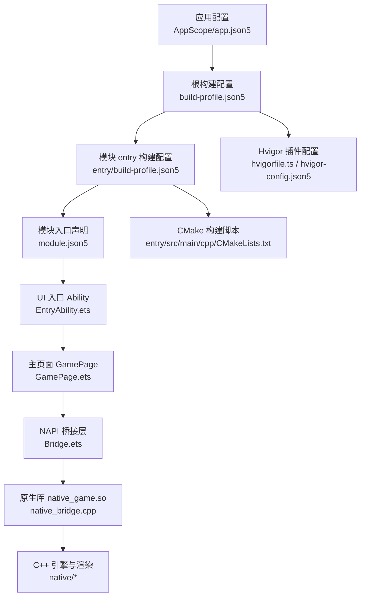
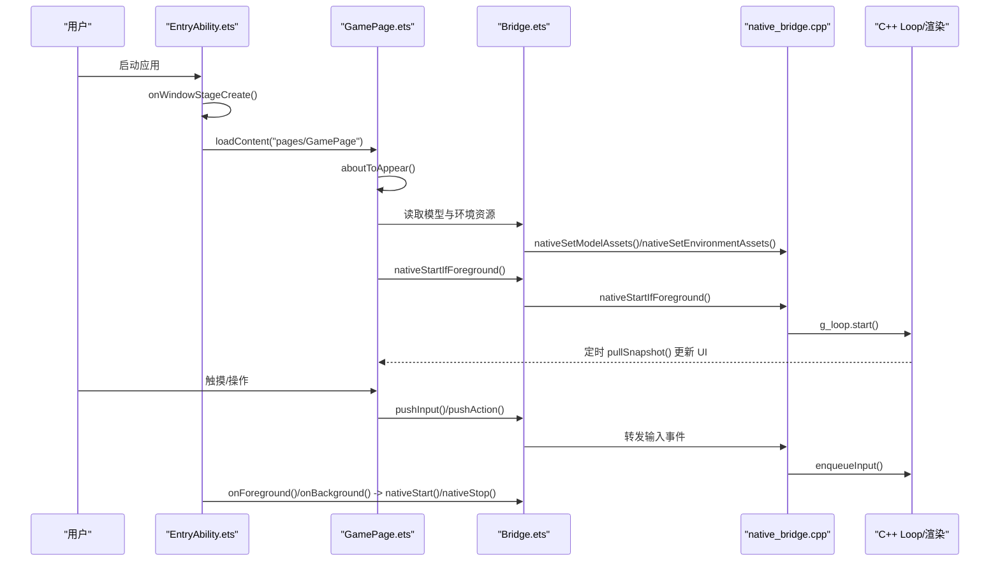
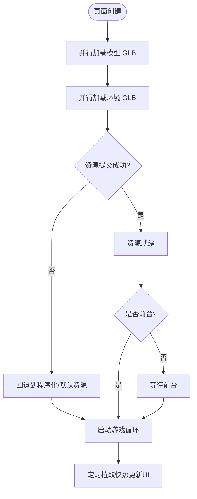
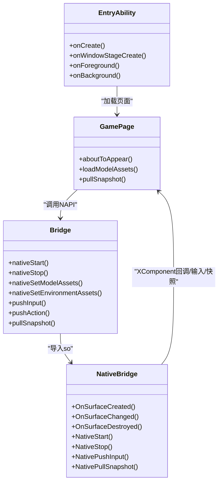
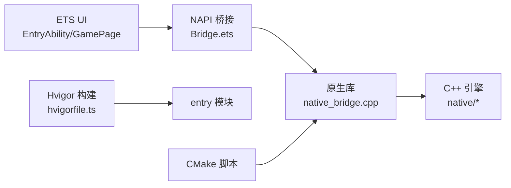

# 快速开始指南

<cite>
**本文引用的文件**   
- [build-profile.json5](file://build-profile.json5)
- [hvigorfile.ts](file://hvigorfile.ts)
- [oh-package.json5](file://oh-package.json5)
- [AppScope/app.json5](file://AppScope/app.json5)
- [entry/build-profile.json5](file://entry/build-profile.json5)
- [entry/hvigorfile.ts](file://entry/hvigorfile.ts)
- [hvigor/hvigor-config.json5](file://hvigor/hvigor-config.json5)
- [entry/src/main/module.json5](file://entry/src/main/module.json5)
- [entry/src/main/ets/EntryAbility.ets](file://entry/src/main/ets/EntryAbility.ets)
- [entry/src/main/ets/pages/GamePage.ets](file://entry/src/main/ets/pages/GamePage.ets)
- [entry/src/main/ets/napi/Bridge.ets](file://entry/src/main/ets/napi/Bridge.ets)
- [entry/src/main/cpp/native_bridge.cpp](file://entry/src/main/cpp/native_bridge.cpp)
- [assets/environment/manifest.json](file://assets/environment/manifest.json)
</cite>

## 目录
1. [简介](#简介)
2. [项目结构](#项目结构)
3. [核心组件](#核心组件)
4. [架构总览](#架构总览)
5. [详细组件分析](#详细组件分析)
6. [依赖分析](#依赖分析)
7. [性能考虑](#性能考虑)
8. [故障排查指南](#故障排查指南)
9. [结论](#结论)
10. [附录](#附录)

## 简介
本指南面向首次接触 my-world（HarmonyOS 开放世界 RPG）的开发者，提供从零到一的环境搭建、构建配置说明、运行与调试步骤，以及常见问题的解决方案。通过本文，你将了解：
- 如何准备 HarmonyOS 开发环境与工具链
- 项目的构建系统（Hvigor + CMake）与关键配置文件
- 应用启动流程、资源加载、游戏循环与渲染初始化
- 如何在模拟器或真机上运行并查看日志进行调试

## 项目结构
my-world 采用典型的 HarmonyOS 多模块工程组织方式：
- 根级配置：应用签名、产品形态、构建模式、模块声明等
- entry 模块：UI 入口、页面、NAPI 桥接与原生库集成
- native 代码：C++ 引擎、渲染、输入、资源加载与平台适配
- assets：资源清单与第三方素材来源信息

图示来源
- [AppScope/app.json5:1-13](file://AppScope/app.json5#L1-L13)
- [build-profile.json5:1-57](file://build-profile.json5#L1-L57)
- [entry/build-profile.json5:1-17](file://entry/build-profile.json5#L1-L17)
- [entry/src/main/module.json5:1-43](file://entry/src/main/module.json5#L1-L43)
- [entry/src/main/ets/EntryAbility.ets:1-44](file://entry/src/main/ets/EntryAbility.ets#L1-L44)
- [entry/src/main/ets/pages/GamePage.ets:1-305](file://entry/src/main/ets/pages/GamePage.ets#L1-L305)
- [entry/src/main/ets/napi/Bridge.ets:1-93](file://entry/src/main/ets/napi/Bridge.ets#L1-L93)
- [entry/src/main/cpp/native_bridge.cpp:1-542](file://entry/src/main/cpp/native_bridge.cpp#L1-L542)
- [hvigorfile.ts:1-7](file://hvigorfile.ts#L1-L7)
- [hvigor/hvigor-config.json5:1-4](file://hvigor/hvigor-config.json5#L1-L4)

章节来源
- [build-profile.json5:1-57](file://build-profile.json5#L1-L57)
- [entry/build-profile.json5:1-17](file://entry/build-profile.json5#L1-L17)
- [entry/src/main/module.json5:1-43](file://entry/src/main/module.json5#L1-L43)
- [entry/src/main/ets/EntryAbility.ets:1-44](file://entry/src/main/ets/EntryAbility.ets#L1-L44)
- [entry/src/main/ets/pages/GamePage.ets:1-305](file://entry/src/main/ets/pages/GamePage.ets#L1-L305)
- [entry/src/main/ets/napi/Bridge.ets:1-93](file://entry/src/main/ets/napi/Bridge.ets#L1-L93)
- [entry/src/main/cpp/native_bridge.cpp:1-542](file://entry/src/main/cpp/native_bridge.cpp#L1-L542)
- [hvigorfile.ts:1-7](file://hvigorfile.ts#L1-L7)
- [hvigor/hvigor-config.json5:1-4](file://hvigor/hvigor-config.json5#L1-L4)

## 核心组件
- 应用与模块配置
  - AppScope/app.json5：定义 BundleName、版本、图标、标签、最小与目标 API 版本
  - build-profile.json5：定义产品、SDK 版本、ABI 过滤、编译器（BiSheng）、构建模式（debug/release）
  - entry/build-profile.json5：指定 stageMode、CMake 路径、ABI 过滤与 cppFlags
  - module.json5：声明 EntryAbility、页面路由、设备类型、权限等
- UI 与 NAPI 桥接
  - EntryAbility.ets：应用生命周期管理，前台/后台时启动/停止原生循环
  - GamePage.ets：XComponent 渲染表面、资源加载、定时拉取快照驱动 UI
  - Bridge.ets：NAPI 接口封装，暴露给 ETS 调用
- 原生层
  - native_bridge.cpp：NAPI 导出函数、XComponent 回调、输入事件转发、资产提交、游戏循环控制与快照输出

章节来源
- [AppScope/app.json5:1-13](file://AppScope/app.json5#L1-L13)
- [build-profile.json5:1-57](file://build-profile.json5#L1-L57)
- [entry/build-profile.json5:1-17](file://entry/build-profile.json5#L1-L17)
- [entry/src/main/module.json5:1-43](file://entry/src/main/module.json5#L1-L43)
- [entry/src/main/ets/EntryAbility.ets:1-44](file://entry/src/main/ets/EntryAbility.ets#L1-L44)
- [entry/src/main/ets/pages/GamePage.ets:1-305](file://entry/src/main/ets/pages/GamePage.ets#L1-L305)
- [entry/src/main/ets/napi/Bridge.ets:1-93](file://entry/src/main/ets/napi/Bridge.ets#L1-L93)
- [entry/src/main/cpp/native_bridge.cpp:1-542](file://entry/src/main/cpp/native_bridge.cpp#L1-L542)

## 架构总览
my-world 的运行链路从 UI 层进入，经 NAPI 桥接到达 C++ 引擎，完成渲染与游戏循环；同时通过 XComponent 绑定原生窗口，处理触摸事件与生命周期。

图示来源
- [entry/src/main/ets/EntryAbility.ets:14-37](file://entry/src/main/ets/EntryAbility.ets#L14-L37)
- [entry/src/main/ets/pages/GamePage.ets:103-152](file://entry/src/main/ets/pages/GamePage.ets#L103-L152)
- [entry/src/main/ets/pages/GamePage.ets:219-293](file://entry/src/main/ets/pages/GamePage.ets#L219-L293)
- [entry/src/main/ets/napi/Bridge.ets:77-93](file://entry/src/main/ets/napi/Bridge.ets#L77-L93)
- [entry/src/main/cpp/native_bridge.cpp:130-149](file://entry/src/main/cpp/native_bridge.cpp#L130-L149)
- [entry/src/main/cpp/native_bridge.cpp:212-275](file://entry/src/main/cpp/native_bridge.cpp#L212-L275)
- [entry/src/main/cpp/native_bridge.cpp:326-482](file://entry/src/main/cpp/native_bridge.cpp#L326-L482)

## 详细组件分析

### 环境搭建与工具链
- 安装 DevEco Studio（支持 Stage 模型与 ArkTS）
- 配置 SDK 版本与 ABI：确保兼容与目标 SDK 为 6.1.0(23)，ABI 包含 arm64-v8a 与 x86_64
- 启用 BiSheng 编译器用于原生编译
- 准备 CMake 工具链（由 DevEco 自动管理）

章节来源
- [build-profile.json5:6-16](file://build-profile.json5#L6-L16)
- [entry/build-profile.json5:1-10](file://entry/build-profile.json5#L1-L10)

### 构建配置详解
- 根级 build-profile.json5
  - products.default：签名配置、compatibleSdkVersion/targetSdkVersion、runtimeOS、nativeCompiler
  - buildModeSet.debug：开启 debuggable、externalNativeOptions（CMake 路径、参数、ABI 过滤、cppFlags）
  - buildModeSet.release：关闭 debuggable
- 模块级 entry/build-profile.json5
  - apiType=stageMode
  - externalNativeOptions.path 指向 CMakeLists.txt
  - abiFilters 限定 arm64-v8a 与 x86_64
- Hvigor 插件
  - 根 hvigorfile.ts 使用 appTasks
  - 模块 hvigorfile.ts 使用 hapTasks
  - hvigor-config.json5 声明模型版本与依赖（当前为空）

章节来源
- [build-profile.json5:1-57](file://build-profile.json5#L1-L57)
- [entry/build-profile.json5:1-17](file://entry/build-profile.json5#L1-L17)
- [hvigorfile.ts:1-7](file://hvigorfile.ts#L1-L7)
- [entry/hvigorfile.ts:1-7](file://entry/hvigorfile.ts#L1-L7)
- [hvigor/hvigor-config.json5:1-4](file://hvigor/hvigor-config.json5#L1-L4)

### 应用启动与资源加载流程
- EntryAbility.onWindowStageCreate 加载 GamePage
- GamePage.aboutToAppear 并行加载模型与环境 GLB 资源，通过 NAPI 提交至原生层
- 资源就绪后调用 nativeStartIfForeground，若处于前台则启动游戏循环
- 每 100ms 拉取一次 Snapshot 更新 UI

图示来源
- [entry/src/main/ets/pages/GamePage.ets:103-152](file://entry/src/main/ets/pages/GamePage.ets#L103-L152)
- [entry/src/main/ets/pages/GamePage.ets:219-293](file://entry/src/main/ets/pages/GamePage.ets#L219-L293)
- [entry/src/main/ets/napi/Bridge.ets:77-93](file://entry/src/main/ets/napi/Bridge.ets#L77-L93)
- [entry/src/main/cpp/native_bridge.cpp:144-149](file://entry/src/main/cpp/native_bridge.cpp#L144-L149)

章节来源
- [entry/src/main/ets/EntryAbility.ets:14-23](file://entry/src/main/ets/EntryAbility.ets#L14-L23)
- [entry/src/main/ets/pages/GamePage.ets:103-152](file://entry/src/main/ets/pages/GamePage.ets#L103-L152)
- [entry/src/main/ets/pages/GamePage.ets:219-293](file://entry/src/main/ets/pages/GamePage.ets#L219-L293)

### 渲染系统与游戏循环
- XComponent 绑定原生窗口，触发 OnSurfaceCreated/Changed/Destroyed
- surface_init/surface_resize 初始化或调整渲染表面
- g_loop.start/stop 控制游戏循环启停
- 输入事件通过 OH_NativeXComponent_GetTouchEvent 获取，转换为 InputAction 入队
- 每帧快照通过 g_loop.snapshot() 生成，NAPI 序列化后返回 ETS

图示来源
- [entry/src/main/ets/EntryAbility.ets:1-44](file://entry/src/main/ets/EntryAbility.ets#L1-L44)
- [entry/src/main/ets/pages/GamePage.ets:1-305](file://entry/src/main/ets/pages/GamePage.ets#L1-L305)
- [entry/src/main/ets/napi/Bridge.ets:1-93](file://entry/src/main/ets/napi/Bridge.ets#L1-L93)
- [entry/src/main/cpp/native_bridge.cpp:59-111](file://entry/src/main/cpp/native_bridge.cpp#L59-L111)
- [entry/src/main/cpp/native_bridge.cpp:130-149](file://entry/src/main/cpp/native_bridge.cpp#L130-L149)
- [entry/src/main/cpp/native_bridge.cpp:212-275](file://entry/src/main/cpp/native_bridge.cpp#L212-L275)
- [entry/src/main/cpp/native_bridge.cpp:326-482](file://entry/src/main/cpp/native_bridge.cpp#L326-L482)

章节来源
- [entry/src/main/cpp/native_bridge.cpp:59-111](file://entry/src/main/cpp/native_bridge.cpp#L59-L111)
- [entry/src/main/cpp/native_bridge.cpp:130-149](file://entry/src/main/cpp/native_bridge.cpp#L130-L149)
- [entry/src/main/cpp/native_bridge.cpp:212-275](file://entry/src/main/cpp/native_bridge.cpp#L212-L275)
- [entry/src/main/cpp/native_bridge.cpp:326-482](file://entry/src/main/cpp/native_bridge.cpp#L326-L482)

### 资源清单与素材来源
- assets/environment/manifest.json 记录了衍生资源（outer_ring.glb 等）及其来源模型的 SHA256 与下载链接
- 该清单有助于追踪资源版权与完整性校验

章节来源
- [assets/environment/manifest.json:1-163](file://assets/environment/manifest.json#L1-L163)

## 依赖分析
- 模块依赖关系
  - entry 模块依赖 C++ 原生库（libnative_game.so），通过 NAPI 暴露接口
  - UI 层通过 Bridge.ets 统一访问原生能力
- 构建依赖
  - Hvigor 插件负责打包与任务编排
  - CMake 负责 C++ 编译与链接
- 运行时依赖
  - HarmonyOS Stage 模型与 ArkTS 运行时
  - XComponent 原生窗口与图形栈

图示来源
- [entry/src/main/ets/EntryAbility.ets:1-44](file://entry/src/main/ets/EntryAbility.ets#L1-L44)
- [entry/src/main/ets/pages/GamePage.ets:1-305](file://entry/src/main/ets/pages/GamePage.ets#L1-L305)
- [entry/src/main/ets/napi/Bridge.ets:1-93](file://entry/src/main/ets/napi/Bridge.ets#L1-L93)
- [entry/src/main/cpp/native_bridge.cpp:1-542](file://entry/src/main/cpp/native_bridge.cpp#L1-L542)
- [hvigorfile.ts:1-7](file://hvigorfile.ts#L1-L7)
- [entry/hvigorfile.ts:1-7](file://entry/hvigorfile.ts#L1-L7)

章节来源
- [entry/src/main/module.json5:1-43](file://entry/src/main/module.json5#L1-L43)
- [entry/build-profile.json5:1-17](file://entry/build-profile.json5#L1-L17)
- [build-profile.json5:1-57](file://build-profile.json5#L1-L57)

## 性能考虑
- 资源加载
  - 使用 Promise.all 并行加载多个 GLB，减少首屏等待时间
  - 失败时回退到程序化/默认资源，保证可用性
- 渲染与循环
  - 仅在 XComponent 表面可用时启动循环，避免无效绘制
  - 定时快照频率为 100ms，平衡 UI 刷新与性能
- 输入处理
  - 将触摸事件转换为轻量 InputAction 入队，降低主线程压力
- 构建优化
  - 仅编译需要的 ABI，减小包体
  - 使用 BiSheng 编译器提升原生编译效率

[本节为通用建议，不直接分析具体文件]

## 故障排查指南
- 无法加载 XComponent 或 GLES 不可用
  - 现象：页面提示不支持 GLES，原生渲染已安全停止
  - 排查：确认模拟器/真机图形环境；重建模拟器或切换真机
  - 参考：GamePage 中 rendererReady 状态与提示信息
- 资源加载失败
  - 现象：控制台报错“Failed to load model/environment assets”
  - 排查：检查 rawfile 路径是否存在；确认资源未被篡改；查看错误详情
  - 参考：GamePage.loadModelAssets 中的 try/catch 分支
- 原生崩溃或无响应
  - 现象：应用闪退或黑屏
  - 排查：查看 ohos 日志（DevEco 日志面板），关注 “Ethelan” 前缀日志
  - 参考：native_bridge.cpp 中的 LOGI/LOGE 宏
- 输入无响应
  - 现象：点击无效
  - 排查：确认 pushInput/pushAction 参数类型与范围；检查指针坐标是否为有限值
  - 参考：native_bridge.cpp 中输入解析与校验逻辑
- 构建失败
  - 现象：abiFilters 不匹配或 CMake 路径错误
  - 排查：核对 entry/build-profile.json5 的 externalNativeOptions.path 与 abiFilters
  - 参考：entry/build-profile.json5 与 build-profile.json5

章节来源
- [entry/src/main/ets/pages/GamePage.ets:168-181](file://entry/src/main/ets/pages/GamePage.ets#L168-L181)
- [entry/src/main/ets/pages/GamePage.ets:119-144](file://entry/src/main/ets/pages/GamePage.ets#L119-L144)
- [entry/src/main/cpp/native_bridge.cpp:14-15](file://entry/src/main/cpp/native_bridge.cpp#L14-L15)
- [entry/src/main/cpp/native_bridge.cpp:212-249](file://entry/src/main/cpp/native_bridge.cpp#L212-L249)
- [entry/build-profile.json5:1-10](file://entry/build-profile.json5#L1-L10)
- [build-profile.json5:20-32](file://build-profile.json5#L20-L32)

## 结论
通过本文，你已完成 my-world 的环境搭建、构建配置理解与应用启动流程掌握。建议在实际开发中：
- 优先在真机验证图形与性能表现
- 利用日志定位问题，结合资源清单追踪素材来源
- 按需调整快照频率与资源加载策略以优化体验

[本节为总结性内容，不直接分析具体文件]

## 附录

### 常用命令与操作步骤
- 打开项目：使用 DevEco Studio 打开仓库根目录
- 选择设备：连接模拟器或真机，选择 ABI 匹配的 target
- 运行应用：点击 Run，等待构建与部署完成
- 查看日志：在 DevEco 日志面板筛选 “Ethelan” 关键字

### 关键配置项速查
- 应用版本与权限
  - bundleName、versionCode、minAPIVersion、targetAPIVersion
  - 请求权限：INTERNET
- 构建模式
  - debug：可调试、CMake 路径、ABI 过滤
  - release：关闭调试
- 模块与入口
  - mainElement：EntryAbility
  - pages：main_pages 配置文件

章节来源
- [AppScope/app.json5:1-13](file://AppScope/app.json5#L1-L13)
- [entry/src/main/module.json5:1-43](file://entry/src/main/module.json5#L1-L43)
- [build-profile.json5:18-40](file://build-profile.json5#L18-L40)
- [entry/build-profile.json5:1-10](file://entry/build-profile.json5#L1-L10)