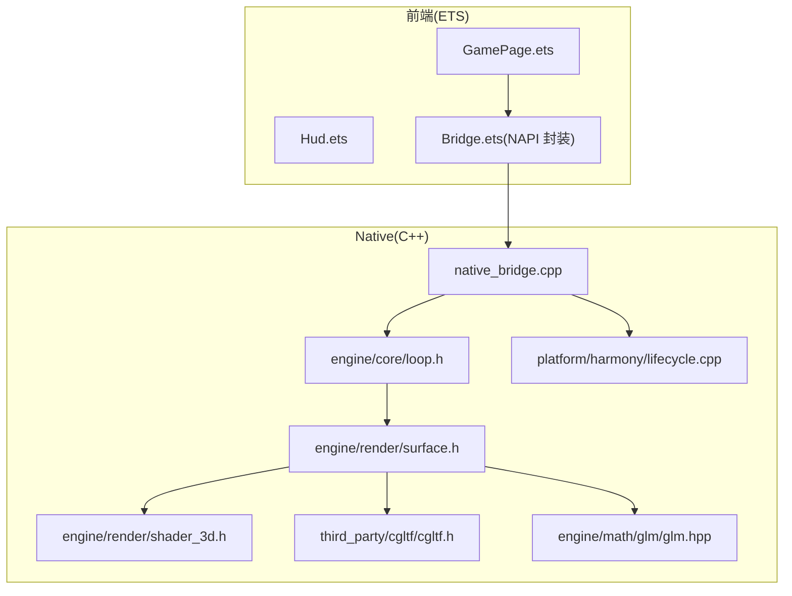
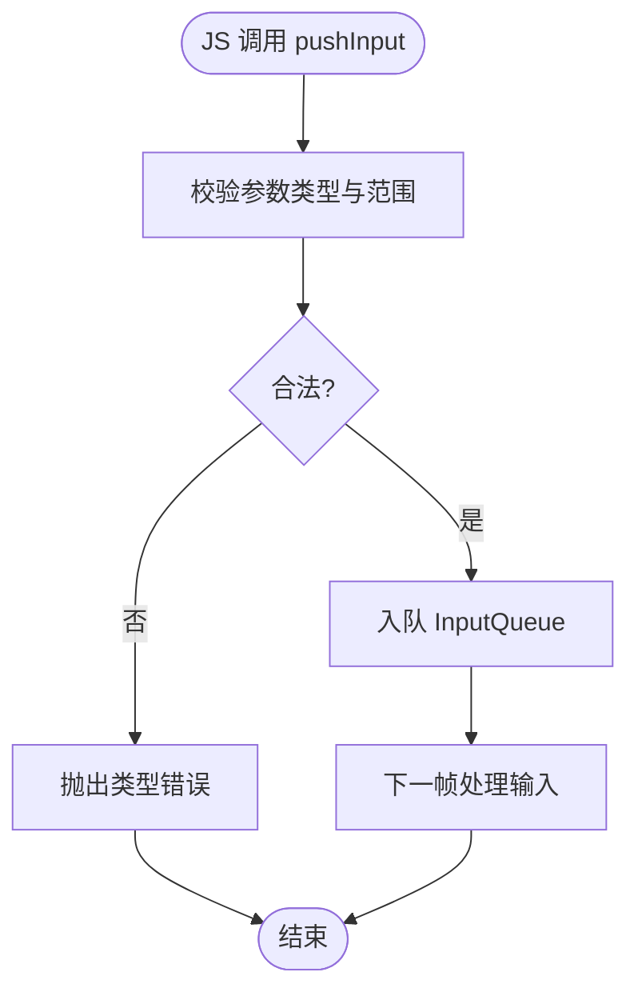
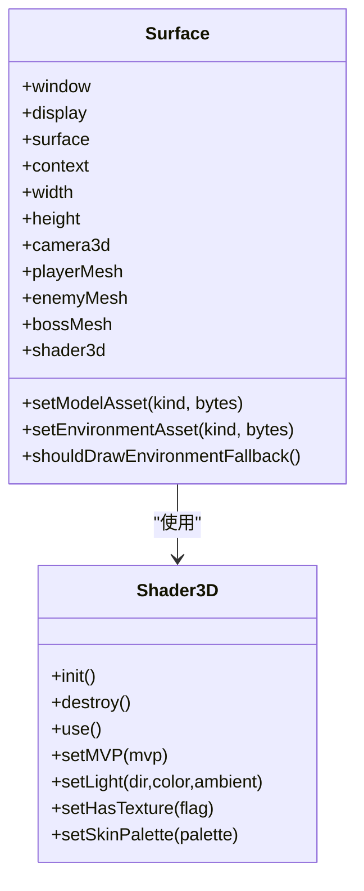
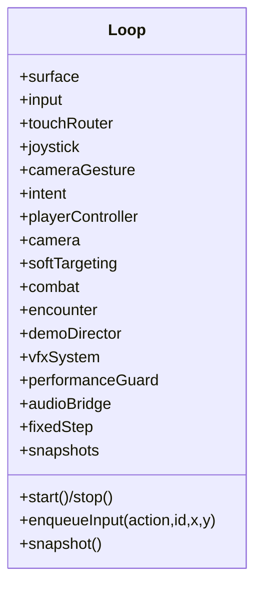
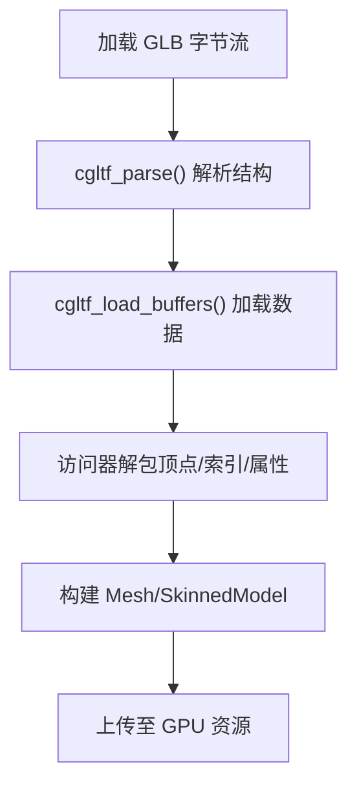
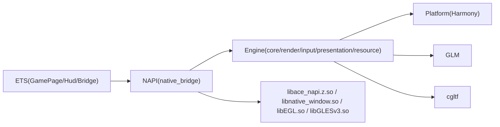

# 技术栈概览

<cite>
**本文引用的文件**   
- [native_bridge.cpp](file://entry/src/main/cpp/native_bridge.cpp)
- [Bridge.ets](file://entry/src/main/ets/napi/Bridge.ets)
- [GamePage.ets](file://entry/src/main/ets/pages/GamePage.ets)
- [Hud.ets](file://entry/src/main/ets/ui/Hud.ets)
- [CMakeLists.txt](file://entry/src/main/cpp/CMakeLists.txt)
- [build-profile.json5](file://build-profile.json5)
- [oh-package.json5](file://oh-package.json5)
- [loop.h](file://native/engine/core/loop.h)
- [surface.h](file://native/engine/render/surface.h)
- [shader_3d.h](file://native/engine/render/shader_3d.h)
- [cgltf.h](file://native/third_party/cgltf/cgltf.h)
- [glm.hpp](file://native/engine/math/glm/glm.hpp)
- [lifecycle.cpp](file://native/platform/harmony/lifecycle.cpp)
</cite>

## 目录
1. [简介](#简介)
2. [项目结构](#项目结构)
3. [核心组件](#核心组件)
4. [架构总览](#架构总览)
5. [详细组件分析](#详细组件分析)
6. [依赖关系分析](#依赖关系分析)
7. [性能与兼容性](#性能与兼容性)
8. [故障排查指南](#故障排查指南)
9. [结论](#结论)
10. [附录：版本与依赖清单](#附录版本与依赖清单)

## 简介
本文件为 my-world 项目的技术栈概览，聚焦于以下核心技术及其协作方式：
- C++ 作为游戏引擎核心语言，承载渲染、输入、AI、战斗等关键逻辑
- OpenGL ES（GLES3）用于 3D 图形渲染管线
- GLM 数学库提供向量与矩阵运算
- cgltf 解析 GLTF/GLB 模型资源
- HarmonyOS SDK 提供平台能力（XComponent、EGL/GLES、NAPI、日志等）
- ArkTS/ETS 负责 UI 与交互，通过 NAPI 桥接调用 C++ 模块

选择原因与定位：
- C++ + OpenGL ES：高性能渲染与跨平台图形能力，契合移动端实时渲染需求
- GLM：与 GLSL 语义一致，降低数学计算心智负担
- cgltf：单头文件、轻量、广泛使用，适合嵌入式与移动端场景
- HarmonyOS：原生窗口、事件、音频、日志等系统能力完备，便于构建沉浸式体验
- ArkTS/ETS：声明式 UI 开发效率高，配合 NAPI 实现高效的前后端互操作

## 项目结构
- entry/src/main/cpp：NAPI 桥接与 CMake 构建配置，导出 native_game 动态库
- entry/src/main/ets：ArkTS/ETS 页面、UI 组件与 NAPI 封装
- native/engine：引擎核心（循环、输入、渲染、表现层、资源）
- native/gameplay：玩法逻辑（战斗、AI、玩家控制、目标选择、成长）
- native/platform/harmony：HarmonyOS 平台适配（生命周期、音频、栅栏等待）
- native/third_party/cgltf：GLTF 解析器
- native/engine/math/glm：GLM 数学库源码



**图表来源** 
- [GamePage.ets](file://entry/src/main/ets/pages/GamePage.ets)
- [Bridge.ets](file://entry/src/main/ets/napi/Bridge.ets)
- [native_bridge.cpp](file://entry/src/main/cpp/native_bridge.cpp)
- [loop.h](file://native/engine/core/loop.h)
- [surface.h](file://native/engine/render/surface.h)
- [shader_3d.h](file://native/engine/render/shader_3d.h)
- [cgltf.h](file://native/third_party/cgltf/cgltf.h)
- [glm.hpp](file://native/engine/math/glm/glm.hpp)
- [lifecycle.cpp](file://native/platform/harmony/lifecycle.cpp)

**章节来源**
- [CMakeLists.txt](file://entry/src/main/cpp/CMakeLists.txt)
- [build-profile.json5](file://build-profile.json5)
- [oh-package.json5](file://oh-package.json5)

## 核心组件
- NAPI 桥接层（native_bridge.cpp）
  - 暴露 nativeStart/nativeStop/pushInput/pushAction/startEncounter/advanceLevel/useSupply/retryBoss/toggleDebugHud/skipDemoPhase/pullSnapshot 等接口
  - 注册 XComponent 回调（OnSurfaceCreated/Changed/Destroyed、触摸事件分发）
  - 将 ArkTS 传入的 ArrayBuffer 拷贝并提交给渲染层（模型与环境资源）
- ETS 前端（GamePage.ets、Hud.ets、Bridge.ets）
  - 加载 GLB 资源并通过 NAPI 下发至 Native
  - 定时拉取快照（pullSnapshot），驱动 UI 更新
  - 处理用户输入并转发到 Native
- 引擎循环（loop.h）
  - 管理固定步长更新、输入队列、相机、战斗、遭遇战、演示导演、VFX、性能保护、音频桥接
  - 提供 withLifecycle 同步执行入口，保证线程安全
- 渲染表面（surface.h）
  - 初始化 EGL/GLES、创建上下文、绘制帧、交换缓冲
  - 维护 3D 渲染状态（Camera3D、Mesh、Shader3D、SkinnedModel、环境批处理）
  - 接收并延迟应用模型与环境资产变更
- 着色器（shader_3d.h）
  - 编译链接 3D 程序，设置 MVP、光照、纹理、蒙皮调色板等 uniform
- 数学库（glm.hpp）
  - 提供与 GLSL 一致的向量/矩阵类型与函数
- GLTF 解析（cgltf.h）
  - 解析 glTF/GLB，提供访问器、缓冲区、节点变换等 API
- 平台生命周期（lifecycle.cpp）
  - 监听应用前后台，暂停/恢复循环，预留保存接口

**章节来源**
- [native_bridge.cpp](file://entry/src/main/cpp/native_bridge.cpp)
- [Bridge.ets](file://entry/src/main/ets/napi/Bridge.ets)
- [GamePage.ets](file://entry/src/main/ets/pages/GamePage.ets)
- [Hud.ets](file://entry/src/main/ets/ui/Hud.ets)
- [loop.h](file://native/engine/core/loop.h)
- [surface.h](file://native/engine/render/surface.h)
- [shader_3d.h](file://native/engine/render/shader_3d.h)
- [glm.hpp](file://native/engine/math/glm/glm.hpp)
- [cgltf.h](file://native/third_party/cgltf/cgltf.h)
- [lifecycle.cpp](file://native/platform/harmony/lifecycle.cpp)

## 架构总览
整体采用“前端 ETS + NAPI + C++ 引擎”的分层架构。ETS 负责 UI 与资源加载，NAPI 作为双向通道，C++ 引擎负责渲染与逻辑。OpenGL ES 在 Native 侧完成 GPU 渲染，GLM 提供数学支持，cgltf 负责模型解析。

```mermaid
sequenceDiagram
participant UI as "GamePage.ets"
participant NAPI as "Bridge.ets"
participant NATIVE as "native_bridge.cpp"
participant LOOP as "Loop(loop.h)"
participant SURF as "Surface(surface.h)"
participant GLES as "OpenGL ES(GLES3)"
UI->>NAPI : 读取 GLB 资源
NAPI->>NATIVE : nativeSetModelAssets / nativeSetEnvironmentAssets
NATIVE->>LOOP : 提交字节数组异步
LOOP->>SURF : setModelAsset / setEnvironmentAsset
UI->>NAPI : pullSnapshot()
NAPI->>NATIVE : pullSnapshot()
NATIVE->>LOOP : snapshot()
LOOP-->>NATIVE : GameSnapshot
NATIVE-->>NAPI : JS Object
NAPI-->>UI : 更新状态
Note over SURF,GLES : 渲染帧由 surface_draw 调用 GLES 完成
```

**图表来源** 
- [GamePage.ets](file://entry/src/main/ets/pages/GamePage.ets)
- [Bridge.ets](file://entry/src/main/ets/napi/Bridge.ets)
- [native_bridge.cpp](file://entry/src/main/cpp/native_bridge.cpp)
- [loop.h](file://native/engine/core/loop.h)
- [surface.h](file://native/engine/render/surface.h)

## 详细组件分析

### NAPI 桥接与前端交互
- 功能要点
  - 启动/停止渲染循环，支持前台拉起
  - 输入事件映射（指针动作、动作键）
  - 资源提交（模型与环境 GLB 字节流）
  - 快照拉取（包含大量运行时状态）
- 错误处理
  - 参数校验失败抛出类型错误
  - 资源复制失败返回 false，前端回退到程序化网格
- 线程与生命周期
  - 通过 withLifecycle 确保在正确上下文执行
  - XComponent 回调统一进入生命周期保护



**图表来源** 
- [native_bridge.cpp](file://entry/src/main/cpp/native_bridge.cpp)

**章节来源**
- [native_bridge.cpp](file://entry/src/main/cpp/native_bridge.cpp)
- [Bridge.ets](file://entry/src/main/ets/napi/Bridge.ets)
- [GamePage.ets](file://entry/src/main/ets/pages/GamePage.ets)

### 渲染表面与 3D 管线
- 功能要点
  - EGL/GLES 初始化、窗口尺寸变化、帧绘制与缓冲交换
  - 3D 渲染状态：Camera3D、Mesh、Shader3D、SkinnedModel、环境批处理
  - 模型与环境资产的延迟应用（CPU 缓存 + 脏标记）
- 着色器
  - 独立 3D Program，支持 MVP、光照、纹理开关、蒙皮调色板
- 性能
  - 环境渲染调用数与三角面计数上报，供 UI 调试



**图表来源** 
- [surface.h](file://native/engine/render/surface.h)
- [shader_3d.h](file://native/engine/render/shader_3d.h)

**章节来源**
- [surface.h](file://native/engine/render/surface.h)
- [shader_3d.h](file://native/engine/render/shader_3d.h)

### 引擎循环与子系统
- 功能要点
  - 固定步长更新（FixedStep）、输入队列、触摸路由、虚拟摇杆、相机手势
  - 玩家控制器、软目标选择、战斗控制器、遭遇控制器、演示导演
  - VFX 系统、性能保护、音频桥接、快照存储
- 并发与同步
  - 输入入队加锁，战斗事件批量提交，withLifecycle 同步执行



**图表来源** 
- [loop.h](file://native/engine/core/loop.h)

**章节来源**
- [loop.h](file://native/engine/core/loop.h)

### 数学库与 GLTF 解析
- GLM
  - 提供 vec/mat/quaternion 等类型与几何/变换函数，广泛用于相机、光照、网格计算
- cgltf
  - 解析 glTF/GLB，提供访问器、缓冲区、节点变换工具，支撑 SkinnedModel 与静态模型加载



**图表来源** 
- [cgltf.h](file://native/third_party/cgltf/cgltf.h)
- [surface.h](file://native/engine/render/surface.h)

**章节来源**
- [glm.hpp](file://native/engine/math/glm/glm.hpp)
- [cgltf.h](file://native/third_party/cgltf/cgltf.h)

### 平台生命周期与音频
- 生命周期
  - 监听应用前后台，暂停/恢复循环，预留 Save 写入接口
- 音频
  - 通过 AudioBridge 抽象平台音频能力，供引擎播放音效/音乐

**章节来源**
- [lifecycle.cpp](file://native/platform/harmony/lifecycle.cpp)

## 依赖关系分析
- 构建与 ABI
  - CMake 定义 include 路径与源文件集合，链接 ACE NAPI、EGL、GLES3、HiLog 等系统库
  - build-profile 指定 targetSdkVersion 与 abiFilters（arm64-v8a、x86_64）
- 模块耦合
  - ETS 仅依赖 NAPI 导出的方法签名；Native 内部按 engine/gameplay/platform 分层，减少反向依赖
- 外部依赖
  - GLM 与 cgltf 以源码形式集成，避免运行时依赖



**图表来源** 
- [CMakeLists.txt](file://entry/src/main/cpp/CMakeLists.txt)
- [build-profile.json5](file://build-profile.json5)

**章节来源**
- [CMakeLists.txt](file://entry/src/main/cpp/CMakeLists.txt)
- [build-profile.json5](file://build-profile.json5)

## 性能与兼容性
- 渲染性能
  - 环境渲染调用数与三角面计数可观测，便于调优
  - 固定步长更新保障逻辑稳定性，避免帧时间抖动影响
- 内存与资源
  - 模型与环境资产延迟应用，避免频繁 GPU 切换
  - 资源加载失败时回退到程序化网格，提升鲁棒性
- 兼容性与版本
  - HarmonyOS targetSdkVersion 6.1.0(23)，abiFilters 限定 arm64-v8a/x86_64
  - C++ 标准 cxx_std_17，GLES3 接口稳定
  - GLM 与 cgltf 源码集成，版本可控

[本节为通用指导，不直接分析具体文件]

## 故障排查指南
- 常见现象
  - 图形环境不支持 GLES：前端显示提示，Native 安全停止
  - 资源加载失败：控制台输出错误，自动回退到默认网格
  - 输入无效：检查 pushInput/pushAction 参数类型与取值范围
- 定位建议
  - 查看日志宏 OH_LOG_Print 输出（native_bridge.cpp）
  - 确认 XComponent 回调是否被正确注册与触发
  - 检查 ABI 与 targetSdkVersion 是否与设备匹配

**章节来源**
- [native_bridge.cpp](file://entry/src/main/cpp/native_bridge.cpp)
- [GamePage.ets](file://entry/src/main/ets/pages/GamePage.ets)

## 结论
my-world 采用“ETS + NAPI + C++ 引擎 + OpenGL ES”的现代移动游戏架构，结合 GLM 与 cgltf 形成完整的数学与资源管线。HarmonyOS SDK 提供稳定的平台能力，ArkTS/ETS 提供高效的 UI 开发体验。该方案兼顾性能、可维护性与跨平台扩展性，适合移动端 3D 游戏的持续迭代。

[本节为总结性内容，不直接分析具体文件]

## 附录：版本与依赖清单
- HarmonyOS SDK
  - 目标版本：6.1.0(23)
  - ABI 过滤：arm64-v8a、x86_64
- C++ 标准：cxx_std_17
- 图形接口：OpenGL ES 3.0（libGLESv3.so）
- 第三方库
  - GLM：头文件集成，提供向量/矩阵运算
  - cgltf：单头文件解析器（版本见注释）
- 构建系统
  - CMake 构建 native_game 共享库
  - hvigor/build-profile 管理产物与签名

**章节来源**
- [build-profile.json5](file://build-profile.json5)
- [CMakeLists.txt](file://entry/src/main/cpp/CMakeLists.txt)
- [cgltf.h](file://native/third_party/cgltf/cgltf.h)
- [glm.hpp](file://native/engine/math/glm/glm.hpp)