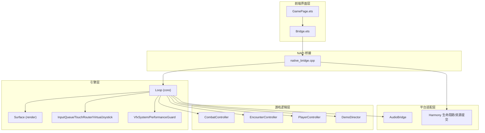
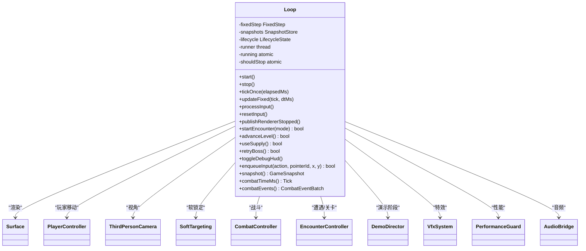
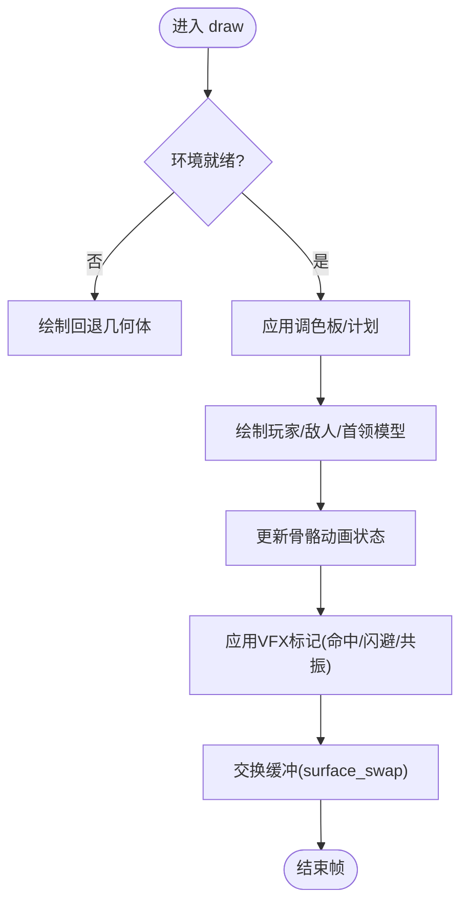
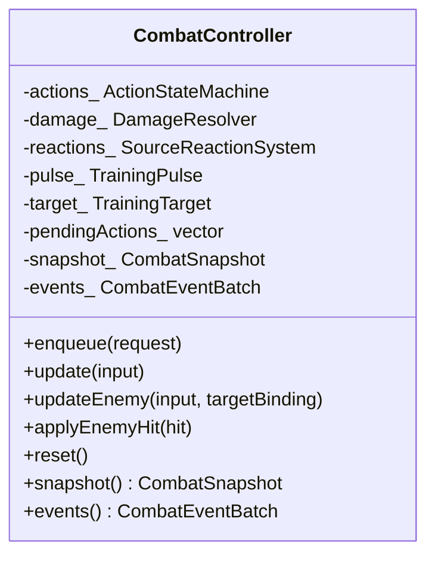
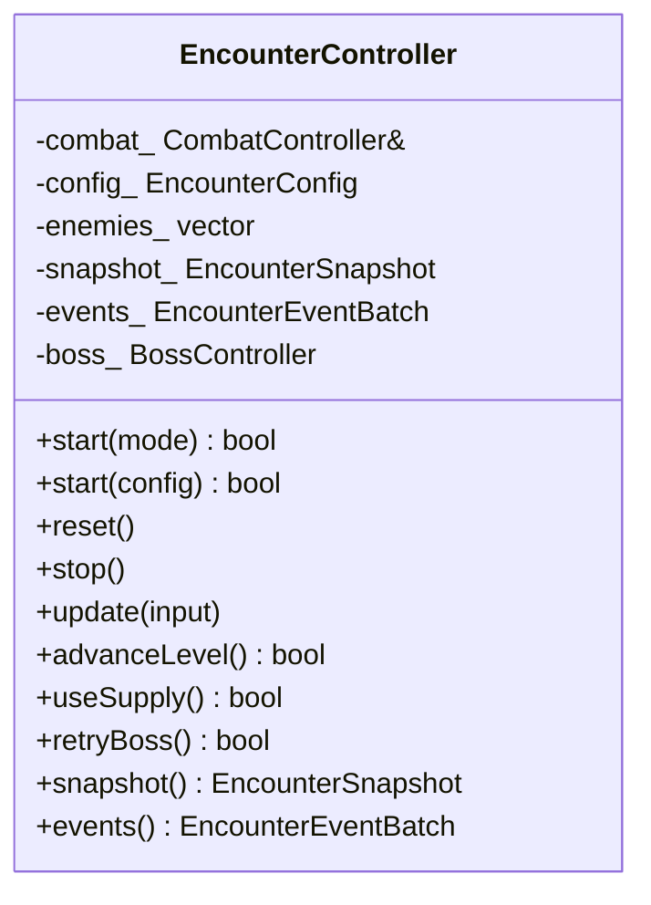
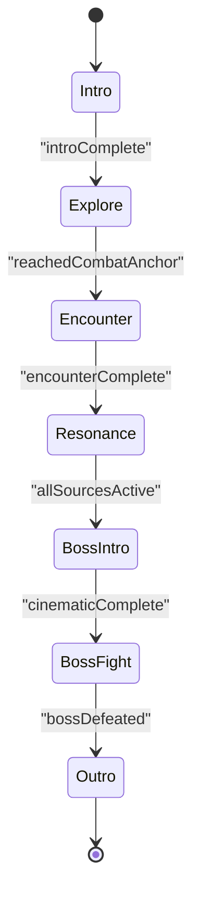
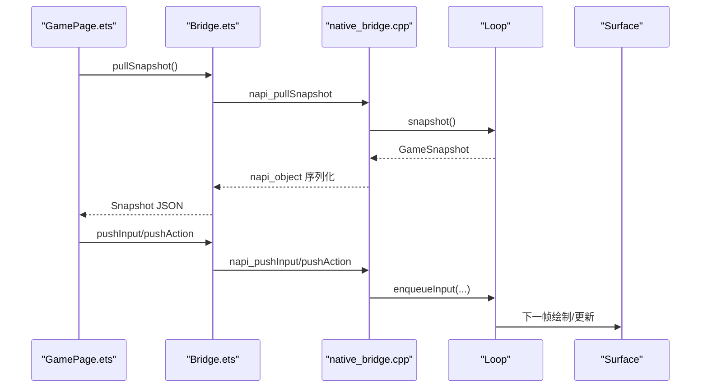
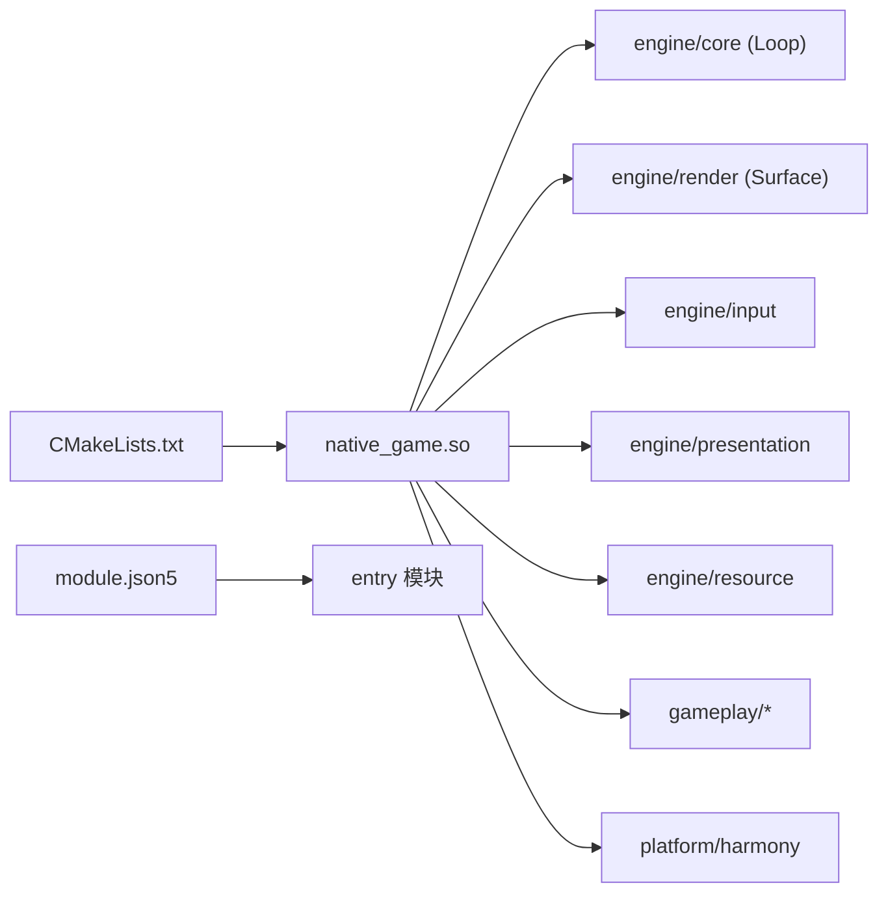

# 架构设计概览

<cite>
**本文引用的文件**   
- [native_bridge.cpp](file://entry/src/main/cpp/native_bridge.cpp)
- [Bridge.ets](file://entry/src/main/ets/napi/Bridge.ets)
- [GamePage.ets](file://entry/src/main/ets/pages/GamePage.ets)
- [loop.h](file://native/engine/core/loop.h)
- [loop.cpp](file://native/engine/core/loop.cpp)
- [surface.h](file://native/engine/render/surface.h)
- [combat_controller.h](file://native/gameplay/combat/combat_controller.h)
- [encounter_controller.h](file://native/gameplay/ai/encounter_controller.h)
- [player_controller.h](file://native/gameplay/player/player_controller.h)
- [demo_director.h](file://native/gameplay/flow/demo_director.h)
- [audio_bridge.h](file://native/platform/harmony/audio_bridge.h)
- [CMakeLists.txt](file://entry/src/main/cpp/CMakeLists.txt)
- [module.json5](file://entry/src/main/module.json5)
</cite>

## 目录
1. [简介](#简介)
2. [项目结构](#项目结构)
3. [核心组件](#核心组件)
4. [架构总览](#架构总览)
5. [详细组件分析](#详细组件分析)
6. [依赖关系分析](#依赖关系分析)
7. [性能考量](#性能考量)
8. [故障排查指南](#故障排查指南)
9. [结论](#结论)
10. [附录：扩展与插件机制](#附录扩展与插件机制)

## 简介
本文件为 my-world 项目的架构设计概览，面向希望快速理解系统分层、数据流与关键交互的开发者。项目采用清晰的分层架构：引擎层（native/engine）、游戏逻辑层（native/gameplay）、平台适配层（native/platform）和前端界面层（entry/src/main/ets）。前后端通过 NAPI 桥接进行通信，N 端负责渲染与仿真循环，E 端负责 UI 展示与用户输入转发。核心组件包括 Loop（主循环）、Surface（渲染与资源管理）、CombatController（战斗与状态机）、EncounterController（遭遇/关卡流程）、DemoDirector（演示阶段控制）等。

## 项目结构
- 前端界面层（entry/src/main/ets）
  - GamePage.ets：页面入口，加载模型与环境资源，定时拉取快照并驱动 HUD 更新，处理 XComponent 生命周期。
  - Bridge.ets：NAPI 接口封装，定义 Snapshot 类型与原生方法调用。
  - CMakeLists.txt：构建 native_game.so 的源文件与头文件路径、链接库配置。
  - module.json5：应用模块配置，声明 EntryAbility 与权限。
- 引擎层（native/engine）
  - core：Loop 主循环、FixedStep、SnapshotStore、LifecycleState、TickClock 等。
  - render：Surface、Camera、Mesh、Shader、Environment、AssetProfile 等。
  - input：InputQueue、PointerInput、TouchRouter、VirtualJoystick、PlayerIntent 等。
  - presentation：VfxSystem、PerformanceGuard、VisualTokens。
  - resource：Loader、Save。
- 游戏逻辑层（native/gameplay）
  - combat：CombatController、ActionStateMachine、DamageResolver、SourceReactionSystem、TrainingPulse/Target 等。
  - ai：EncounterController、EnemyAgent、PerceptionSystem、DecisionPolicy、TacticalPlanner 等。
  - player：PlayerController、Character。
  - targeting：SoftTargeting。
  - flow：DemoDirector。
  - growth：Relic。
- 平台适配层（native/platform/harmony）
  - audio_bridge：音频事件派发与降级策略。
  - lifecycle/fence_wait：平台生命周期与同步原语。
  - model/environment asset commit：跨线程安全提交模型与环境资源。



**图表来源** 
- [GamePage.ets:1-305](file://entry/src/main/ets/pages/GamePage.ets#L1-L305)
- [Bridge.ets:1-94](file://entry/src/main/ets/napi/Bridge.ets#L1-L94)
- [native_bridge.cpp:1-577](file://entry/src/main/cpp/native_bridge.cpp#L1-L577)
- [loop.h:1-104](file://native/engine/core/loop.h#L1-L104)
- [surface.h:1-252](file://native/engine/render/surface.h#L1-L252)
- [combat_controller.h:1-113](file://native/gameplay/combat/combat_controller.h#L1-L113)
- [encounter_controller.h:1-151](file://native/gameplay/ai/encounter_controller.h#L1-L151)
- [player_controller.h:1-36](file://native/gameplay/player/player_controller.h#L1-L36)
- [demo_director.h:1-71](file://native/gameplay/flow/demo_director.h#L1-L71)
- [audio_bridge.h:1-27](file://native/platform/harmony/audio_bridge.h#L1-L27)

**章节来源**
- [CMakeLists.txt:1-135](file://entry/src/main/cpp/CMakeLists.txt#L1-L135)
- [module.json5:1-43](file://entry/src/main/module.json5#L1-L43)

## 核心组件
- Loop（主循环）
  - 职责：维护运行态、固定步长更新、输入处理、渲染帧调度、快照聚合、与平台生命周期/音频集成。
  - 关键成员：Surface、InputQueue、TouchRouter、VirtualJoystick、PlayerIntent、PlayerController、ThirdPersonCamera、SoftTargeting、CombatController、EncounterController、DemoDirector、VfxSystem、PerformanceGuard、AudioBridge、FixedStep、SnapshotStore、LifecycleState。
- Surface（渲染与资源）
  - 职责：EGL/GL 上下文、窗口缓冲、2D/3D 渲染管线、环境批处理与回退、模型/环境资产异步提交与替换、VFX 标记。
- CombatController（战斗控制器）
  - 职责：玩家动作状态机、伤害计算、反应系统、训练脉冲/目标、帧级快照与事件批次输出。
- EncounterController（遭遇/关卡控制器）
  - 职责：模式切换（训练/野兽/混合/守卫/等级流程/首领）、敌人槽位管理、Boss 控制、关卡阶段推进、供给使用。
- DemoDirector（演示导演）
  - 职责：演示阶段流转（Intro/Explore/Encounter/Resonance/BossIntro/BossFight/Outro）、Boss 过场状态、信号驱动。
- AudioBridge（音频桥）
  - 职责：根据战斗/表现事件派发音效，不支持时降级为静默。

**章节来源**
- [loop.h:1-104](file://native/engine/core/loop.h#L1-L104)
- [surface.h:1-252](file://native/engine/render/surface.h#L1-L252)
- [combat_controller.h:1-113](file://native/gameplay/combat/combat_controller.h#L1-L113)
- [encounter_controller.h:1-151](file://native/gameplay/ai/encounter_controller.h#L1-L151)
- [demo_director.h:1-71](file://native/gameplay/flow/demo_director.h#L1-L71)
- [audio_bridge.h:1-27](file://native/platform/harmony/audio_bridge.h#L1-L27)

## 架构总览
整体采用“前端 UI + NAPI 桥 + 引擎/逻辑 + 平台适配”的分层设计。前端通过 XComponent 绑定原生 Surface，NAPI 暴露启动/停止、输入推送、资源设置、快照读取等接口；引擎层以 Loop 为中心驱动固定步长更新，协调输入、相机、战斗、遭遇、演示、特效与音频；渲染层在 Surface 中完成 2D/3D 绘制与资源替换；平台层提供生命周期回调与资源提交、音频能力。

```mermaid
sequenceDiagram
participant UI as "GamePage.ets"
participant NAPI as "Bridge.ets"
participant Native as "native_bridge.cpp"
participant Loop as "Loop"
participant Render as "Surface"
participant Logic as "Combat/Encounter/Demo"
participant Platform as "Platform/Harmony"
UI->>NAPI : 加载模型/环境资源
NAPI->>Native : nativeSetModelAssets / nativeSetEnvironmentAssets
Native->>Platform : 跨线程提交资源
Native-->>UI : 返回布尔结果
UI->>NAPI : nativeStartIfForeground()
NAPI->>Native : 启动循环
Native->>Loop : start()
Loop->>Render : surface_init/resize/draw
Loop->>Logic : update(固定步长)
Loop-->>Native : 生成快照
Native-->>NAPI : pullSnapshot()
NAPI-->>UI : 返回 Snapshot
UI->>NAPI : pushInput/pushAction
NAPI->>Native : enqueueInput
Native->>Loop : 入队输入
Loop->>Platform : 音频事件派发(AudioBridge)
```

**图表来源** 
- [GamePage.ets:1-305](file://entry/src/main/ets/pages/GamePage.ets#L1-L305)
- [Bridge.ets:1-94](file://entry/src/main/ets/napi/Bridge.ets#L1-L94)
- [native_bridge.cpp:1-577](file://entry/src/main/cpp/native_bridge.cpp#L1-L577)
- [loop.cpp:1-200](file://native/engine/core/loop.cpp#L1-L200)
- [surface.h:1-252](file://native/engine/render/surface.h#L1-L252)
- [audio_bridge.h:1-27](file://native/platform/harmony/audio_bridge.h#L1-L27)

## 详细组件分析

### Loop（主循环）
- 职责与流程
  - start()/stop()：生命周期保护、线程启动/停止、重置输入与战斗状态、音频桥启停。
  - tickOnce(dtMs)：固定步长更新、输入处理、相机/玩家移动、战斗与遭遇更新、VFX/性能守护、快照写入。
  - publishRendererStopped()：通知前端图形不可用时的安全降级。
- 关键交互
  - 与 Surface：初始化/调整大小/绘制/交换缓冲。
  - 与 InputQueue：入队输入、序列号递增、事件计数。
  - 与 Combat/Encounter/Demo：更新战斗快照、发布 3D 遭遇状态、推进关卡阶段。
  - 与 AudioBridge：按帧派发事件。
- 复杂度与稳定性
  - 固定步长保证确定性仿真；多线程安全通过 LifecycleState 与互斥量保护共享状态。



**图表来源** 
- [loop.h:1-104](file://native/engine/core/loop.h#L1-L104)
- [loop.cpp:1-200](file://native/engine/core/loop.cpp#L1-L200)

**章节来源**
- [loop.h:1-104](file://native/engine/core/loop.h#L1-L104)
- [loop.cpp:1-200](file://native/engine/core/loop.cpp#L1-L200)

### Surface（渲染与资源）
- 职责与数据结构
  - EGL/GL 上下文、窗口缓冲、像素缓冲、2D/3D 渲染状态、粒子/装饰物、训练目标。
  - 3D 渲染字段：Camera3D、Mesh、Shader3D、SkinnedModel、动画状态、光照参数。
  - 资源管理：PendingModelAsset、EnvironmentBatchStatus、EnvironmentController、Palette、RenderPlan。
- 资源提交
  - setModelAsset/setEnvironmentAsset：线程安全保存字节数组并标记脏；实际解析/上传在 GL 上下文下执行。
- 渲染流程
  - surface_init/resize/draw/swap：创建/调整/绘制/交换缓冲；环境就绪判断与回退。



**图表来源** 
- [surface.h:1-252](file://native/engine/render/surface.h#L1-L252)

**章节来源**
- [surface.h:1-252](file://native/engine/render/surface.h#L1-L252)

### CombatController（战斗控制器）
- 职责
  - 接收 ActionRequest，基于 ActionStateMachine 驱动当前动作；DamageResolver 计算伤害与护盾/韧性；SourceReactionSystem 处理元素反应；TrainingPulse/Target 用于训练模式。
  - 输出 CombatSnapshot（HP/Poise/Stamina/Resonance/状态标志）与 CombatEventBatch（游戏/表现事件）。
- 关键接口
  - enqueue/update/updateEnemy/applyEnemyHit/reset/snapshot/events。



**图表来源** 
- [combat_controller.h:1-113](file://native/gameplay/combat/combat_controller.h#L1-L113)

**章节来源**
- [combat_controller.h:1-113](file://native/gameplay/combat/combat_controller.h#L1-L113)

### EncounterController（遭遇/关卡控制器）
- 职责
  - 管理 EncounterMode（训练/野兽/混合/守卫/等级流程/首领），维护敌人槽位与 Boss 控制器，推进 LevelStage（训练/裂隙爪/祭司混合/守卫精英/补给/首领）。
  - 输出 EncounterSnapshot（敌人列表、候选目标、Boss 状态）与 EncounterEventBatch（合并战斗事件与效果请求）。
- 关键接口
  - start/reset/stop/update/advanceLevel/useSupply/retryBoss/snapshot/events。



**图表来源** 
- [encounter_controller.h:1-151](file://native/gameplay/ai/encounter_controller.h#L1-L151)

**章节来源**
- [encounter_controller.h:1-151](file://native/gameplay/ai/encounter_controller.h#L1-L151)

### DemoDirector（演示导演）
- 职责
  - 管理 DemoPhase（Intro/Explore/Encounter/Resonance/BossIntro/BossFight/Outro），维护 BossCinematicState（环进度/碎片数/源颜色/破碎状态/就绪标志），基于信号推进阶段。
- 关键接口
  - tick/skipTo/phase/snapshot/bossCinematic。



**图表来源** 
- [demo_director.h:1-71](file://native/gameplay/flow/demo_director.h#L1-L71)

**章节来源**
- [demo_director.h:1-71](file://native/gameplay/flow/demo_director.h#L1-L71)

### NAPI 桥接（native_bridge.cpp 与 Bridge.ets）
- 职责
  - 暴露原生方法：启动/停止、设置模型/环境资源、推送输入/动作、开始遭遇、推进关卡、使用补给、重试首领、切换调试 HUD、跳过演示阶段、拉取快照。
  - 注册 XComponent 回调：OnSurfaceCreated/Changed/Destroyed、DispatchTouchEvent，将触摸事件转换为输入队列项。
  - 资源提交：CopyAndCommitModelAssets/CopyAndCommitEnvironmentAssets，跨线程安全提交字节数组并在 GL 上下文下替换。
- 数据流向
  - E 端：GamePage.ets 定时 pullSnapshot() 获取快照，映射到 @State 驱动 HUD。
  - N 端：Loop.snapshot() 聚合各子系统状态，构造 GameSnapshot 对象并通过 napi_create_* 导出。



**图表来源** 
- [native_bridge.cpp:1-577](file://entry/src/main/cpp/native_bridge.cpp#L1-L577)
- [Bridge.ets:1-94](file://entry/src/main/ets/napi/Bridge.ets#L1-L94)
- [GamePage.ets:1-305](file://entry/src/main/ets/pages/GamePage.ets#L1-L305)
- [loop.h:1-104](file://native/engine/core/loop.h#L1-L104)

**章节来源**
- [native_bridge.cpp:1-577](file://entry/src/main/cpp/native_bridge.cpp#L1-L577)
- [Bridge.ets:1-94](file://entry/src/main/ets/napi/Bridge.ets#L1-L94)
- [GamePage.ets:1-305](file://entry/src/main/ets/pages/GamePage.ets#L1-L305)

### 平台适配层（Harmony）
- 职责
  - 音频桥：根据 CombatEventBatch 派发音效，无支持时降级为静默。
  - 生命周期：XComponent 回调与 Loop 生命周期同步，确保 Surface 初始化/销毁安全。
  - 资源提交：跨线程安全拷贝与提交模型/环境字节数组，避免 GL 上下文竞争。

**章节来源**
- [audio_bridge.h:1-27](file://native/platform/harmony/audio_bridge.h#L1-L27)
- [native_bridge.cpp:59-111](file://entry/src/main/cpp/native_bridge.cpp#L59-L111)

## 依赖关系分析
- 构建与链接
  - CMakeLists.txt 定义了 native_game 共享库的源文件集合、包含路径与依赖库（libace_napi.z.so、libnative_window.so、libEGL.so、libGLESv3.so 等）。
- 模块配置
  - module.json5 声明 entry 模块、EntryAbility 入口与网络权限。
- 组件耦合
  - Loop 强依赖 render/input/presentation/resource 与 gameplay 子系统；Surface 依赖 camera/mesh/shader/environment；CombatController 依赖 action/state/damage/reaction；EncounterController 依赖 CombatController 与 AI 子系统。



**图表来源** 
- [CMakeLists.txt:1-135](file://entry/src/main/cpp/CMakeLists.txt#L1-L135)
- [module.json5:1-43](file://entry/src/main/module.json5#L1-L43)

**章节来源**
- [CMakeLists.txt:1-135](file://entry/src/main/cpp/CMakeLists.txt#L1-L135)
- [module.json5:1-43](file://entry/src/main/module.json5#L1-L43)

## 性能考量
- 固定步长与帧率
  - Loop 使用 FixedStep 保证仿真稳定，渲染线程约 60fps（sleep 16ms），dt 上限限制防止跳帧。
- 资源提交与渲染
  - Surface 的模型/环境资源采用 Pending 与 Batch 状态，避免频繁 GL 调用；环境未就绪时使用回退几何体。
- 事件与快照
  - 快照聚合在 Loop 内完成，减少跨语言拷贝次数；输入事件计数与序列号保障顺序性。
- 性能守护
  - PerformanceGuard 可动态降低特效或纹理质量，保障帧率。

[本节为通用指导，不直接分析具体文件]

## 故障排查指南
- 图形环境不可用
  - 现象：rendererReady=false，页面提示 GLES 不可用。
  - 排查：检查 OnSurfaceCreated/Changed 是否成功初始化 surface；确认 native_bridge.cpp 中的 surface_init/resize 返回值。
- 资源加载失败
  - 现象：nativeSetModelAssets/nativeSetEnvironmentAssets 返回 false。
  - 排查：确认 ArrayBuffer 非空且格式正确；查看 CopyArrayBuffer 校验逻辑；检查跨线程提交是否被拒绝。
- 输入无效
  - 现象：pushInput/pushAction 无效或抛类型错误。
  - 排查：检查参数类型与范围（type/pointerId/x/y/action 枚举值）；确认输入已入队（inputEventCount 增长）。
- 崩溃或卡顿
  - 现象：循环未启动或卡死。
  - 排查：确认 lifecycle.start 成功；检查 shouldStop/running 状态；查看日志输出（LOGI/LOGE）。

**章节来源**
- [native_bridge.cpp:59-111](file://entry/src/main/cpp/native_bridge.cpp#L59-L111)
- [native_bridge.cpp:130-149](file://entry/src/main/cpp/native_bridge.cpp#L130-L149)
- [native_bridge.cpp:212-275](file://entry/src/main/cpp/native_bridge.cpp#L212-L275)
- [GamePage.ets:168-181](file://entry/src/main/ets/pages/GamePage.ets#L168-L181)

## 结论
my-world 项目通过清晰的分层与明确的职责边界，实现了前端 UI、NAPI 桥、引擎/逻辑与平台适配的高效协作。Loop 作为中枢协调输入、渲染、战斗、遭遇与演示；Surface 提供稳定的渲染与资源管理能力；Combat/Encounter/Demo 构成核心玩法与流程；AudioBridge 与平台生命周期确保跨设备兼容。该架构便于扩展新功能与插件化开发，同时具备良好的性能与可维护性。

[本节为总结，不直接分析具体文件]

## 附录：扩展与插件机制
- 新增输入动作
  - 在 native_bridge.cpp 的 pushAction 映射中添加新枚举值；在 Loop::processInput 中处理对应行为；在 UI 层添加按钮触发。
- 新增战斗能力
  - 扩展 CombatController 的状态机与伤害计算；在 CombatSnapshot 增加字段；在 Bridge.ets 的 Snapshot 类型中补充字段；在 GamePage.ets 中映射显示。
- 新增环境资源批次
  - 在 Surface 的 environmentAssets 数组中新增槽位；实现 setEnvironmentAsset 与对应的 EnvironmentBatchStatus；在 loop.cpp 的 publish3DEncounterState 中按需消费。
- 新增演示阶段
  - 在 DemoDirector 中扩展 DemoPhase 与信号；在 Loop 中接入 skipTo 与阶段推进逻辑；在前端提供跳转入口。
- 插件式扩展点建议
  - 事件总线：在 Loop 或 EncounterController 中引入统一事件队列，供外部模块订阅。
  - 资源管线：在 Resource Loader 中增加新的文件格式与解码器，保持与 AssetProfile 的解耦。
  - 表现层：在 VfxSystem 中扩展特效开关与参数，配合 PerformanceGuard 动态调节。

[本节为概念性指导，不直接分析具体文件]